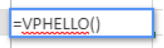
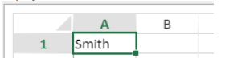

   
## フォーミュラの使い方

スプレッドシートのフォーミュラとは、セルの値を計算する式のことです。

### フォーミュラの入力

4D View Pro エリアにフォーミュラを入力するには:

1.  フォーミュラを入力するセルを選択します。
2.  = (等号) を入力します。
3.  フォーミュラを入力し、**Enter**キーを入力します。

フォーミュラ入力の際には、次のショートカットを使うことができます:

- フォーミュラにセル参照を入力する代わりに、参照するセルをクリックします:


- 入力したい関数の頭文字を入力します。 すると、利用可能な関数と参照の一覧がポップアップメニューに表示され、必要な要素を選択することができます:


また、命名フォーミュラを作成すると、その名前で呼び出すことが可能です。 この場合、[VP ADD FORMULA NAME](method-list.md#vp-add-formula-name) コマンドを使用して命名フォーミュラを入力します。

### 演算子とオペランド

すべてのフォーミュラはオペランドと演算子から成り立っています:

*   **演算子**: 後述の [値と演算子](#値と演算子) 参照。
*   **オペランド** は、いくつかのカテゴリーに分けられます:
    *   [値](#値と演算子) (5つのデータ型がサポートされています)
    *   [他のセルへの参照](#セル参照) (相対参照、絶対参照、ミックス参照、あるいは名前での参照)
    *   [標準のスプレッドシートファンクション (関数)](#ビルトインファンクション)
    *   4Dフォーミュラに基づく [4Dファンクション](#4dファンクション) (4D変数、フィールド、メソッド、コマンド、式が利用可能です)

## 値と演算子

4D View Pro は 5つのデータ型をサポートします。 それぞれのデータ型について、特定の定数と演算子がサポートされています。

| データ型                            | 値                                                     | 演算子                                                                                                                               |
| ------------------------------- | ----------------------------------------------------- | --------------------------------------------------------------------------------------------------------------------------------- |
| [Number](Concepts/dt_number.md) | 1.2<br/>1.2 E3<br/>1.2E-3<br/>10.3x | + (加法)<br/>- (減法)<br/>* (乗法)<br/>/ (除法)<br/>^ (べき乗、数値を自身に対してかける回数)<br/>% (パーセント -- 演算子の前の数値を100で割る) |
| [Date](Concepts/dt_date.md)     | 10/24/2017                                            | + (日付 + 日数 -> 日付)<br/>+ (日付 + 時間 -> 日付 + その日の時間)<br/>- (日付 - 日数 -> 日付)<br/>- (日付 - 日付 -> 2つの日付間の日数)             |
| [Time](Concepts/dt_time.md)     | 10:12:10                                              | 経過時間演算子:<br/>+ (加法)<br/>- (減法)<br/>* (経過時間 * 数値 -> 経過時間)<br/>/ (経過時間 / 数値 -> 経過時間)                      |
| [String](Concepts/dt_string.md) | 'Sophie' または "Sophie"                                 | & (連結)                                                                                                                            |
| [ブール](Concepts/dt_boolean.md)   | TRUE または FALSE                                        | -                                                                                                                                 |


### 比較演算子

同じ型の 2つのオペランドに対して以下の演算子を使用することができます:

| 演算子        | 比較  |
| ---------- | --- |
| =          | 等しい |
| `<>` | 異なる |
| >          | 大きい |
| <          | 小さい |
| >=         | 以上  |
| <=         | 以下  |


### 演算子の優先順位

以下は演算子を優先度順に並べたものです (優先度が高い方が上):

| 演算子                                           | 説明          |
| --------------------------------------------- | ----------- |
| ()                                            | カッコ (グループ化) |
| -                                             | 否定          |
| +                                             | 追加          |
| %                                             | パーセント       |
| ^                                             | べき乗         |
| * および /                                       | 乗法と除法       |
| + と -                                         | 加法と減法       |
| &                                             | 連結          |
| `=`  `>` `<` `>=` `<=` `<>` | 比較          |


## セル参照

フォーミュラ (式) は多くの場合、セルアドレスを使って他のセルを参照します。 このような式を他のセルにコピーすることも可能です。 たとえば、C8 に入力された以下の式では、すぐ上にある 2つのセルの値を足して結果を表示します。

```
= C6 + C7
```

この式はセル C6 と C7 を参照します。 つまり、式内で使用する値については他のセルを参照するよう、4D View Pro に指示しています。

こういった式を別のセルにコピーあるいは移動させた場合、式内のセルアドレスは参照の仕方によって連動して変化したり変化しなかったりします。

*   参照が変化するものは **相対参照** と呼ばれ、式が入っているセルを基準として、相対的にどれだけ上下左右に離れているかでセルを参照します。
*   常に特定のセルを参照するものは **絶対参照** と呼ばれます。
*   また、複合参照といって、特定の行あるいはカラムに参照を固定することもできます。


### 参照の記法

セル座標 ( `C5` など) のみを使用すると、4D View Pro はそれを相対参照として解釈します。 文字と数字の前に $ (ドル) 記号を入れることで、参照を絶対参照にすることができます (例: `$C$5`)。

ドル記号を文字あるいは数字の前だけに入れることで相対参照と絶対参照を組み合わせることができます (例: `$C5`、`C$5`)。 複合参照を使用すると、行かカラムを絶対参照として指定しながら、もう片方については相対的に参照させることが可能になります。

素早くかつ正確に絶対参照を指定するには、セルを命名し、その名前をセルアドレス代わりに使用する方法があります。 命名セルへの参照は常に絶対参照です。 命名セルまたは命名セルレンジを作成・編集するには、[`VP ADD RANGE NAME`](method-list.md#vp-add-range-name) メソッドを使用します。

以下の表は異なる記法による効果をまとめたものです:

| 例題   | 参照タイプ | 説明                                                                                      |
| ---- | ----- | --------------------------------------------------------------------------------------- |
| C5   | 相対    | 参照は相対的にセル C5 を指しており、参照が最初に使用されたセルが位置の基準となります。                                           |
| $C$5 | 絶対    | 参照は絶対参照です。 どこで使用されるかにかかわらず、常にセル C5 を参照します。                                              |
| $C5  | 複合    | 常にカラム C を参照しますが、行の参照は相対的で、参照が最初に使用されたセルを基準に決まります。                                       |
| C$5  | 複合    | 常に 5行目を参照しますが、カラムの参照は相対的で、参照が最初に使用されたセルを基準に決まります。                                       |
| セル名  | 絶対    | 参照は絶対参照です。 どこで使用されるかにかかわらず、常に [命名されたセルまたはレンジ](method-list.md#vp-add-range-name) を参照します。 |


## ビルトインファンクション

スプレッドシートのファンクションとは、セルの値を計算する規定のフォーミュラのことで、関数とも呼ばれます。 入力したい関数の頭文字を入力すると、利用可能な関数と参照の一覧がポップアップメニューに表示され、必要な要素を選択することができます:


詳細や例題については [**SpreadJS's extented list of functions**](https://www.grapecity.com/spreadjs/docs/v14/online/FormulaFunctions.html) (英文) を参照ください。


## 4Dファンクション

4D View Pro では、[4Dフォーミュラ](API/FunctionClass.md) を実行する **4Dカスタムファンクション** を定義・使用することができます。 4Dカスタムファンクションを使用すると、4D View Pro ドキュメントの可能性が広がり、4Dデータベースとの強力な連携が可能になります。

4Dカスタムファンクションを使用すると、4D View Pro のフォーミュラ内で以下が利用可能になります:

- 4Dプロセス変数
- フィールド
- プロジェクトメソッド
- 4Dランゲージコマンド
- または、有効な 4D式

4Dカスタムファンクションは、4D View Pro エリアから [引数](#引数) を受け取り、値を返すことができます。

これらのカスタムファンクションは [`VP SET CUSTOM FUNCTIONS`](method-list.md#vp-set-custom-functions) メソッドを使って宣言します。 例:

```4d
o:=New object

// 4D View Pro におけるファンクション名: "DRIVERS_LICENCE"
$o.DRIVERS_LICENCE:=New object

// プロセス変数
$o.DRIVERS_LICENCE.formula:=Formula(DriverLicence)

// テブルフィールド
$o.DRIVERS_LICENCE.formula:=Formula([Users]DriverLicence)

// プロジェクトメソッド
$o.DRIVERS_LICENCE.formula:=Formula(DriverLicenceState)

// 4Dコマンド
$o.DRIVERS_LICENCE:=Formula(Choose(DriverLicence; "Obtained"; "Failed"))

//4D式と引数
$o.DRIVERS_LICENCE.formula:=Formula(ds.Users.get($1).DriverLicence)
$o.DRIVERS_LICENCE.parameters:=New collection
$o.DRIVERS_LICENCE.parameters.push(New object("name"; "ID"; "type"; Is longint))
```

> [4D View Pro: 4D のフォーミュラをスプレッドシートで使用する](https://blog.4d.com/ja/4d-view-pro-use-4d-formulas-in-your-spreadsheet/) も参照ください。


### Hello World 例題

4Dプロジェクトメソッドを使って、4D View Pro エリアのセルに "Hello World" と表示させます。

1.  "myMethod" プロジェクトメソッドを作成し、次のコードを書きます:

```4d
 #DECLARE->$hw Text
 $hw:="Hello World"

```

2.  4D View Pro エリアが設置されたフォームを開く前に、以下のコードを実行します:

```4d
  Case of
    :(Form event code=On Load)
       var $o : Object
       $o:=New object
  // "myMethod" メソッドから "vpHello" ファンクションを定義します
       $o.vpHello:=New object
       $o.vpHello.formula:=Formula(myMethod)
       VP SET CUSTOM FUNCTIONS("ViewProArea";$o)
 End case
```

3.  4D View Pro エリアのセルに次を入力します:

    

    すると、4D によって "myMethod "が呼び出され、セルの表示は次のようになります:

    


### 引数

プロジェクトのメソッドを呼び出す 4Dファンクションには、以下のシンタックスで引数を渡すことができます:

```
=METHODNAME(param1,param2,...,paramN)
```

*methodName* はこれらの引数を $1, $2...$N に受け取ります。

引数を渡さない場合でも ( ) の使用は必須です:

```
=METHODWITHOUTNAME()
```

[VP SET CUSTOM FUNCTIONS](method-list.md#vp-set-custom-functions) メソッドを使用して宣言したファンクションの *parameters* コレクションを使って、引数の名前、型、数を宣言することができます。 オプションとして、*minParams* および *maxParams* プロパティにより、ユーザーから渡される引数の数を制御することができます。

サポートされている引数の型の詳細については、[VP SET CUSTOM FUNCTIONS](method-list.md#vp-set-custom-functions) メソッドの説明を参照ください。

> 引数を宣言していない場合には、メソッドに値を順番に渡すことができ ($1、$2... に受け取られます)、それらの型は自動的に変換されます。 *jstype* の日付は、4Dコードでは 2つのプロパティを持つ [オブジェクト](Concepts/dt_object.md) として渡されます:   
> |プロパティ|    型|   説明| |---|---|---| |value|   Date|   日付| |time |Real|  時間 (秒単位)|

4Dプロジェクトメソッドは、$0 を介して 4D View Pro のセルフォーミュラに値を返すこともできます。 以下のデータ型の戻り値がサポートされています:

* [テキスト](Concepts/dt_string.md) (4D View Pro 内で文字列に変換)
* [実数](Concepts/dt_number.md)/[倍長整数](Concepts/dt_number.md) (4D View Pro 内で数値に変換)
* [日付](Concepts/dt_date.md) (4D View Pro 内で JS日付型に変換 - 時間、分、秒 = 0)
* [時間](Concepts/dt_time.md) (4D View Pro 内で JS日付型に変換 - 日付は基準日、つまり 1899年12月30日)
* [ブール](Concepts/dt_boolean.md) (4D View Pro 内でブールに変換)
* [ピクチャー](Concepts/dt_picture.md) (jpg,png,gif,bmp,svg, その他のタイプは png に変換) の場合、URI (data:image/png;base64,xxxx) が作成され、フォーミュラを実行した 4D View Pro のセルにおいて背景として使用されます。
* 次の 2つのプロパティを持つ [オブジェクト](Concepts/dt_object.md) (日付と時間の受け渡しを可能にします):

    | プロパティ | 型    | 説明       |
    | ----- | ---- | -------- |
    | value | Date | 日付値      |
    | time  | 実数   | 数値 (秒単位) |

4Dメソッドが何も返さない場合は、自動的に空の文字列が返されます。

以下の場合は、4D View Pro セルにエラーが返されます:

*   4Dメソッドが上記以外のデータ型を返した場合。
*   4Dメソッドの実行中にエラーが発生した場合 (ユーザーが "中止" ボタンをクリックした場合)。

#### 例題

```4d
var $o : Object

$o.BIRTH_INFORMATION:=New object
$o.BIRTH_INFORMATION.formula:=Formula(BirthInformation)
$o.BIRTH_INFORMATION.parameters:=New collection
$o.BIRTH_INFORMATION.parameters.push(New object("name";"First name";"type";Is text))
$o.BIRTH_INFORMATION.parameters.push(New object("name";"Birthday";"type";Is date))
$o.BIRTH_INFORMATION.parameters.push(New object("name";"Time of birth";"type";Is time))
$o.BIRTH_INFORMATION.summary:="渡された情報に基づきフォーマットされた文字列を返します"

VP SET CUSTOM FUNCTIONS("ViewProArea"; $o)
```


## 互換性

4D View Pro エリアでフィールドやメソッドをファンクションとして宣言する場合、代わりの方法も利用可能です。 これらの方法は、互換性のために維持されており、特定のケースで使用することができます。 しかしながら、[`VP SET CUSTOM FUNCTIONS`](method-list.md#vp-set-custom-functions) の使用が推奨されます。

### 仮想ストラクチャーを使ったフィールド参照


4D View Pro では、データベースの仮想ストラクチャーを使用して 4Dフィールドを参照することができます。つまり、\*引数とともに [`SET TABLE TITLES`](https://doc.4d.com/4dv19/help/command/ja/page601.html) や [`SET FIELD TITLES`](https://doc.4d.com/4dv19/help/command/ja/page602.html) コマンドで宣言されている場合です。 この代替方法は、アプリケーションがすでに仮想ストラクチャーに依存している場合に便利です (そうでない場合は、[`VP SET CUSTOM FUNCTIONS` の使用](#4dファンクション) が推奨されます)。

> **警告**: 仮想ストラクチャーと `VP SET CUSTOM FUNCTIONS` を同時に使用することはできません。 `VP SET CUSTOM FUNCTIONS` が呼び出されると、4D View Pro エリアは `SET TABLE TITLES` や `SET FIELD TITLES` コマンドに基づく機能を無視します。

#### 要件

*   フィールドは、データベースの仮想ストラクチャーに属していること。つまり、\*引数とともに [`SET TABLE TITLES`](https://doc.4d.com/4dv19/help/command/ja/page601.html) や [`SET FIELD TITLES`](https://doc.4d.com/4dv19/help/command/ja/page602.html) コマンドで宣言されていなくてはなりません。
*   テーブルとフィールド名は ECMA 準拠であること ([ECMA Script standard](https://www.ecma-international.org/ecma-262/5.1/#sec-7.6) 参照)。
*   フィールドの型が 4D View Pro でサポートされていること (前述参照)。

準拠していないフィールドがフォーミュラに呼び出されると、4D View Pro セルにエラーが返されます。

#### フォーミュラでの仮想フィールドの使用

フォーミュラ内に仮想フィールドへの参照を挿入するには、次のシンタックスを使います:

```
TABLENAME_FIELDNAME()
```

たとえば、"People" テーブルの "Name" フィールドを仮想ストラクチャーで宣言した場合、以下のようなファンクションを呼び出すことができます:

```
=PEOPLE_NAME()
=LEN(PEOPLE_NAME())
```

> フィールドが [4Dメソッド] と同名の場合は、フィールド名が優先されます。

#### 例題

4D の仮想フィールドを使用して、4D View Pro エリアのセル内に人の名前を表示します:

1.  "Employee" テーブルと "L_Name" フィールドを作成します:


2.  次のコードを実行して、仮想ストラクチャーを初期化します:

    ```4d
    ARRAY TEXT($tableTitles;1)
        ARRAY LONGINT($tableNum;1)
        $tableTitles{1}:="Emp"
        $tableNum{1}:=2
        SET TABLE TITLES($tableTitles;$tableNum;*)

        ARRAY TEXT($fieldTitles;1)
        ARRAY LONGINT($fieldNum;1)
        $fieldTitles{1}:="Name"
        $fieldNum{1}:=2 // ラストネーム
        SET FIELD TITLES([Employee];$fieldTitles;$fieldNum;*)
    ```

3.  4D View Pro エリアのセルに "=e" と入力します":


4.  (Tabキーを使用して) EMP_NAME を選択し、閉じる ")" を入力します。


5.  セルを確定すると、カレントの従業員の名前が表示されます:


> \[Employee] テーブルはカレントレコードを持っている必要があります。


### 許可されたメソッドの宣言

4D View Pro のフォーミュラ内にて 4Dプロジェクトメソッドを直接呼び出すことができます。 セキュリティ上の理由から、ユーザーによって呼び出し可能なメソッドは [VP SET ALLOWED METHODS](method-list.md#vp-set-allowed-methods) によって明示的に宣言されなくてはなりません。


#### 要件

4D View Pro フォーミュラ内で呼び出すには、プロジェクトメソッドは以下の条件を満たしている必要があります:

*   **許可されている**: [VP SET ALLOWED METHODS](method-list.md#vp-set-allowed-methods) によって明示的に宣言されていること。
*   **実行可能**: メソッドがホストデータベースに属している、あるいはロードされたコンポーネントに属しており当該メソッドの "コンポーネントとホストデータベース間で共有" オプションが有効化されていること ([プロジェクトメソッドの共有](../Concepts/components.md#プロジェクトメソッドの共有) 参照)。
*   既存の 4D View Pro ファンクションと **競合していない**: 4D View Pro ビルトインファンクションと同じ名前のプロジェクトメソッドを呼び出した場合、ファンクションの方が呼び出されます。
> [VP SET CUSTOM FUNCTIONS](method-list.md#vp-set-custom-functions) および [VP SET ALLOWED METHODS](method-list.md#vp-set-allowed-methods) コマンドのいずれもがセッション中に実行されていない場合、4D View Pro カスタムファンクションには 4D の汎用的な `SET ALLOWED METHODS` コマンドで許可されたメソッドが使用できます。 この場合、プロジェクトメソッド名は JavaScript の字句文法に則ってなければなりません ([ECMA Script standard](https://www.ecma-international.org/ecma-262/5.1/#sec-7.6) 参照)。 ストラクチャー設定のグローバルなフィルタリングオプション (セキュリティページ ＞ データアクセス権) はいずれの場合でも無視されます。

