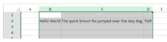
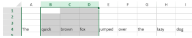
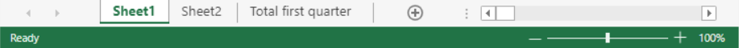
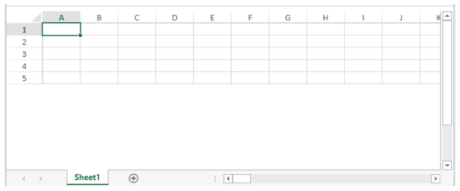
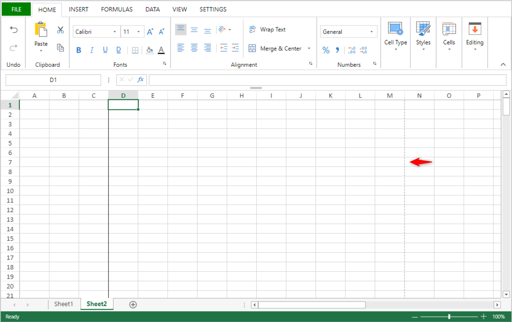
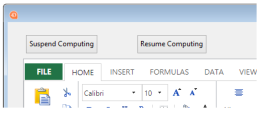

> **警告**: このページのコマンドはスレッドセーフではありません。

[A](#a) - [C](#c) - [D](#d) - [E](#e) - [F](#f) - [G](#g) - [I](#i) - [M](#m) - [N](#n) - [O](#o) - [P](#p) - [R](#r) - [S](#s)

## A

### VP ADD FORMULA NAME

<!-- REF #_method_.VP ADD FORMULA NAME.Syntax -->

**VP ADD FORMULA NAME** ( *vpAreaName* : Text ; *vpFormula* : Text ; *name* : Text { ; *options* : Object } )<!-- END REF -->

<!-- REF #_method_.VP ADD FORMULA NAME.Params -->

| 引数         | 型      |    | 説明                                        |
| ---------- | ------ | -- | ----------------------------------------- |
| vpAreaName | Text   | -> | 4D View Pro フォームオブジェクト名                   |
| vpFormula  | Text   | -> | 4D View Pro フォーミュラ                        |
| name       | Text   | -> | フォーミュラの名称                                 |
| options    | Object | -> | 命名フォーミュラのオプション|<!-- END REF -->

|

#### 説明

`VP ADD FORMULA NAME` コマンドは、 <!-- REF #_method_.VP ADD FORMULA NAME.Summary -->開いているドキュメント内において命名されたフォーミュラを作成、または編集します<!-- END REF -->。
> このコマンドで作成された命名フォーミュラはドキュメントとともに保存されます。

*vpAreaName* には、4D View Pro エリアの名前を渡します。 存在しない名前を渡した場合、エラーが返されます。

*vpFormula* には、命名する 4D View Pro フォーミュラを渡します。 フォーミュラシンタックスの詳細については、[式と関数](formulas.md) ページを参照ください。

名前をつけたいレンジを *rangeObj* に、新しいレンジの名前は *name* に渡します。 同じスコープ内で名前が既に使用されている場合、新しい命名レンジは既存のものを上書きします。 ただし異なるスコープであれば同じ名前を使用することが可能です (以下参照)。

*options* 引数には、命名フォーミュラの追加プロパティを格納したオブジェクト型を渡すことができます。 以下のプロパティがサポートされています:

| プロパティ   | 型      | 説明                                                                                                                                                                                                                                                            |
| ------- | ------ | ------------------------------------------------------------------------------------------------------------------------------------------------------------------------------------------------------------------------------------------------------------- |
| scope   | Number | フォーミュラのスコープ。 シートのインデックス (0起点) を渡すか、あるいは以下の定数を使用することができます: <li>`vk current sheet`</li><li>`vk workbook`</li>スコープは、フォーミュラ名が特定のワークシートに限定されたローカル (*scope* = シートのインデックス または `vk current sheet`) なものか、あるいはワークブック全体で使用できるグローバル (*scope* = `vk workbook`) なものかを決定します。 |
| comment | Text   | 命名フォーミュラに割り当てられたコメント                                                                                                                                                                                                                                          |

#### 例題

```4d
VP ADD FORMULA NAME("ViewProArea";"SUM($A$1:$A$10)";"Total2")
```

#### 参照

[Cell references](formulas.md#cell-references)<br/>[VP Get formula by name](#vp-get-formula-by-name)<br/>[VP Get names](#vp-get-names)

### VP ADD RANGE NAME

<!-- REF #_method_.VP ADD RANGE NAME.Syntax -->

**VP ADD RANGE NAME** ( *rangeObj* : Object ; *name* : Text { ; *options* : Object } )<!-- END REF -->

<!-- REF #_method_.VP ADD RANGE NAME.Params -->

| 引数       | 型      |    | 説明                                        |
| -------- | ------ | -- | ----------------------------------------- |
| rangeObj | Object | -> | レンジオブジェクト                                 |
| name     | Text   | -> | フォーミュラの名称                                 |
| options  | Object | -> | 命名フォーミュラのオプション|<!-- END REF -->

|

#### 説明

`VP ADD RANGE NAME` コマンドは、 <!-- REF #_method_.VP ADD RANGE NAME.Summary -->開いているドキュメント内に命名レンジを作成、または編集します<!-- END REF -->。
> このコマンドで作成された命名レンジはドキュメントとともに保存されます。

*name* 引数には、新しいフォーミュラの名前を渡します。 同じスコープ内で名前が既に使用されている場合、新しい命名フォーミュラは既存のものを上書きします。 ただし異なるスコープであれば同じ名前を使用することが可能です (以下参照)。

*options* 引数には、命名レンジの追加プロパティを格納したオブジェクト型を渡すことができます。 以下のプロパティがサポートされています:

| プロパティ   | 型      | 説明                                                                                                                                                                                                                                                      |
| ------- | ------ | ------------------------------------------------------------------------------------------------------------------------------------------------------------------------------------------------------------------------------------------------------- |
| scope   | Number | レンジのスコープ。 シートのインデックス (0起点) を渡すか、あるいは以下の定数を使用することができます: <li>`vk current sheet`</li><li>`vk workbook`</li>スコープは、レンジ名が特定のワークシートに限定されたローカル (*scope* = シートのインデックス または `vk current sheet`) なものか、あるいはワークブック全体で使用できるグローバル (*scope* = `vk workbook`) なものかを決定します。 |
| comment | Text   | 命名レンジに割り当てられたコメント                                                                                                                                                                                                                                       |
> * 命名レンジの実態は、座標を格納した命名フォーミュラです。 `VP ADD RANGE NAME` を使うと簡単に命名レンジの作成ができますが、[`VP ADD FORMULA NAME`](#vp-add-formula-name) コマンドで命名レンジを作成することもできます。
> * 命名レンジを定義するフォーミュラは、[`VP Get formula by name`](#vp-get-formula-by-name) コマンドで取得することができます。

#### 例題

あるセルレンジに対して命名レンジを作成します:

```4d
$range:=VP Cell("ViewProArea";2;10)
VP ADD RANGE NAME($range;"Total1")
```

#### 参照

[VP Get names](#vp-get-names)<br/>[VP Name](#vp-name)

### VP ADD SELECTION

<!-- REF #_method_.VP ADD SELECTION.Syntax -->

**VP ADD SELECTION** ( *rangeObj* : Object )<!-- END REF -->

<!-- REF #_method_.VP ADD SELECTION.Params -->

| 引数       | 型      |    | 説明                                    |
| -------- | ------ | -- | ------------------------------------- |
| rangeObj | Object | -> | レンジオブジェクト |<!-- END REF -->

|

#### 説明

`VP ADD SELECTION` コマンドは、 <!-- REF #_method_.VP ADD SELECTION.Summary -->指定されたセルを、現在選択されているセル範囲に追加します<!-- END REF -->。

*rangeObj* には、カレントセレクションに追加するセルのレンジオブジェクトを渡します。
> アクティブセルは変更されません。

#### 例題

以下のようにセルが選択されている場合:


以下のコードを実行すると、指定したセルを選択範囲に追加します:

```4d
$currentSelection:=VP Cells("myVPArea";3;4;2;3)
VP ADD SELECTION($currentSelection)
```

結果:


#### 参照

[VP Get active cell](#vp-get-active-cell)<br/>[VP Get selection](#vp-get-selection)<br/>[VP RESET SELECTION](#vp-reset-selection)<br/>[VP SET ACTIVE CELL](#vp-set-active-cell)<br/>[VP SET SELECTION](#vp-set-selection)<br/>[VP SHOW CELL](#vp-show-cell)

### VP ADD SHEET

<!-- REF #_method_.VP ADD SHEET.Syntax -->
**VP ADD SHEET** ( *vpAreaName* : Text )<br/>**VP ADD SHEET** ( *vpAreaName* : Text ; *index* : Integer )<br/>**VP ADD SHEET** ( *vpAreaName* : Text ; *sheet* : Integer ; *name* : Text )<!-- END REF -->

<!-- REF #_method_.VP ADD SHEET.Params -->

| 引数         | 型       |    | 説明                              |
| ---------- | ------- | -- | ------------------------------- |
| vpAreaName | Text    | -> | 4D View Pro フォームオブジェクト名         |
| sheet      | Integer | -> | 新しいシートのインデックス                   |
| name       | Text    | -> | シート名|<!-- END REF -->

|

#### 説明

`VP ADD SHEET` コマンドは、 <!-- REF #_method_.VP ADD SHEET.Summary -->*vpAreaName* にロードされているドキュメントにシートを挿入します。<!-- END REF -->

*vpAreaName* には、4D View Pro エリアの名前を渡します。

*sheet* 引数として、新しいシートのインデックスを渡します。 渡した *index* 引数が 0以下だった場合、コマンドは新しいシートを先頭に挿入します。 *index* 引数がシートの総数より多い場合、コマンドは既存のシートの後に新しいシートを挿入します。
> インデックスは 0 起点です。

*name* 引数として、新しいシートの名前を渡します。 新しい名前には、次の文字を含めることはできません: `*, :, [, ], ?,\,/`

#### 例題

ドキュメントには現在 3つのシートがあります:


新しいシートを 3つ目の位置 (インデックスは 2) に挿入し、名前を "March" にします:

```4d
VP ADD SHEET("ViewProArea";2;"March")
```


#### 参照

[VP REMOVE SHEET](#vp-remove-sheet)

### VP ADD SPAN

<!-- REF #_method_.VP ADD SPAN.Syntax -->
**VP ADD SPAN** ( *rangeObj* : Object )<!-- END REF -->

<!-- REF #_method_.VP ADD SPAN.Params -->

| 引数       | 型      |    | 説明                                   |
| -------- | ------ | -- | ------------------------------------ |
| rangeObj | Object | -> | レンジオブジェクト|<!-- END REF -->

|

#### 説明

`VP ADD SPAN` コマンドは、*rangeObj* に渡したセルを単一のセルに結合します。

*rangeObj* には、セルのレンジオブジェクトを渡します。 レンジ内のセルは結合され、複数のカラム/行にまたがる大きなセルが作成されます。 複数のセルレンジを渡すことで、一度に複数の結合セルを作成することもできます。 ただし、セルレンジが重なった場合、最初のセルレンジのみが使用されます。

> * 結合セルでは、左上端セルのデータのみが表示されます。 他のセルのデータは結合が解除されるまで非表示になります。
> * 結合セル内の非表示データは、フォーミュラを使用することでアクセス可能です (フォーミュラは左上端セルから始まります)。

#### 例題

"First quarter" セルと "Second quarter" セルを、それぞれ右 2つのセルと結合し、"South area" セルは下 2つのセルと結合します:


```4d
 // "First quarter" レンジ
 $q1:=VP Cells("ViewProArea";2;3;3;1)

  // "Second quarter" レンジ
 $q2:=VP Cells("ViewProArea";5;3;3;1)

  // "South area" レンジ
 $south:=VP Cells("ViewProArea";0;5;1;3)

 VP ADD SPAN(VP Combine ranges($q1;$q2;$south))
```


#### 参照

[4D View Pro Range Object Properties](getting-started.md#using-range-objects)<br/>[VP Get spans](#vp-get-spans)<br/>[VP REMOVE SPAN](#vp-remove-span)

### VP ADD STYLESHEET

<!-- REF #_method_.VP ADD STYLESHEET.Syntax -->
**VP ADD STYLESHEET** ( *vpAreaName* : Text ; *styleName* : Text ; *styleObj* : Object { ; *sheet* : Integer } )<!-- END REF -->

<!-- REF #_method_.VP ADD STYLESHEET.Params -->

| 引数         | 型       |    | 説明                                                     |
| ---------- | ------- | -- | ------------------------------------------------------ |
| vpAreaName | Text    | -> | 4D View Pro フォームオブジェクト名                                |
| styleName  | Text    | -> | スタイルの名前                                                |
| styleObj   | Object  | -> | 属性設定を定義するオブジェクト                                        |
| sheet      | Integer | -> | シートのインデックス (省略した場合はカレントシート)|<!-- END REF -->

|

#### 説明

`VP ADD STYLESHEET` コマンドは、 <!-- REF #_method_.VP ADD STYLESHEET.Summary -->開いているドキュメント内にて、*styleName* 引数で指定したスタイルシートを、*styleObj* 引数のプロパティの組み合わせに基づいて作成または変更します<!-- END REF -->。 同じ名前とインデックスを持つスタイルシートがドキュメント内にすでに存在する場合、このコマンドはそれを新しい値で上書きします。

> このコマンドで作成されたスタイルシートはドキュメントとともに保存されます。

*vpAreaName* には、4D View Pro エリアの名前を渡します。 存在しない名前を渡した場合、エラーが返されます。

*styleName* 引数には、スタイルシートの名前を渡します。 同じスコープ内で名前が既に使用されている場合、新しいスタイルシートは既存のものを上書きします。 ただし異なるスコープであれば同じ名前を使用することが可能です (以下参照)。

*styleObj* には、スタイルシートの設定 (例: フォント、テキスト装飾、文字揃え、境界線、など) を指定します。 スタイルプロパティの完全な一覧については、[スタイルオブジェクトプロパティ](configuring.md#スタイルオブジェクトプロパティ) を参照ください。

任意の *sheet* 引数を使用することで、スタイルシートをどこに定義するかを指定することができます。シートインデックス (0 起点) か、以下の定数のいずれかを渡すことができます:

* `vk current sheet`
* `vk workbook`

同じ *styleName* のスタイルシートが、ワークブックレベルとシートレベルとで定義されている場合、シートレベルのスタイルが優先されます。

スタイルシートを適用するには、[VP SET DEFAULT STYLE](#vp-set-default-style) または [VP SET CELL STYLE](#vp-set-cell-style) コマンドを使用します。

#### 例題

以下のコードは:

```4d
$styles:=New object
$styles.backColor:="green"

// 境界線オブジェクト
$borders:=New object("color";"green";"style";vk line style medium dash dot)

$styles.borderBottom:=$borders
$styles.borderLeft:=$borders
$styles.borderRight:=$borders
$styles.borderTop:=$borders

VP ADD STYLESHEET("ViewProArea";"GreenDashDotStyle";$styles)

// スタイルを適用します
VP SET CELL STYLE(VP Cells("ViewProArea";1;1;2;2);New object("name";"GreenDashDotStyle"))
```

*GreenDashDotStyle* という名前の、以下のようなスタイルオブジェクトを作成します:

```
{
 backColor:green,
 borderBottom:{color:green,style:10},
 borderLeft:{color:green,style:10},
 borderRight:{color:green,style:10},
 borderTop:{color:green,style:10}
}
```

#### 参照

[4D View Pro Style Objects and Style Sheets](configuring.md#style-objects--style-sheets)<br/>[VP Get stylesheet](#vp-get-stylesheet)<br/>[VP Get stylesheets](#vp-get-stylesheets)<br/>[VP REMOVE STYLESHEET](#vp-remove-stylesheet)<br/>[VP SET CELL STYLE](#vp-set-cell-style)<br/>[VP SET DEFAULT STYLE](#vp-set-default-style)

### VP All

<!-- REF #_method_.VP All.Syntax -->
**VP All** ( *vpAreaName* : Text { ; *sheet* : Integer } )  : Object<!-- END REF -->

<!-- REF #_method_.VP All.Params -->

| 引数         | 型       |    | 説明                                          |
| ---------- | ------- | -- | ------------------------------------------- |
| vpAreaName | Text    | -> | 4D View Pro フォームオブジェクト名                     |
| sheet      | Integer | -> | シートのインデックス (省略した場合はカレントシート)                 |
| 戻り値        | Object  | <- | すべてのセルのレンジオブジェクト|<!-- END REF -->

|

#### 説明

`VP ALL` コマンドは、 <!-- REF #_method_.VP All.Summary -->すべてのセルを参照する新しいレンジオブジェクトを返します<!-- END REF -->。

*vpAreaName* には、4D View Pro エリアの名前を渡します。 存在しない名前を渡した場合、エラーが返されます。

任意の *sheet* 引数として、シートのインデックス (0 起点) を渡すことで、定義されるレンジが属するスプレッドシートを指定することができます。 省略された場合、または `vk current sheet` を渡した場合、カレントスプレッドシートが使用されます。

#### 例題

カレントスプレッドシートにおいて、全セルのレンジオブジェクトを定義します:

```4d
$all:=VP All("ViewProArea") // カレントシートの全セル
```

#### 参照

[VP Cell](#vp-cell)<br/>[VP Cells](#vp-cells)<br/>[VP Column](#vp-column)<br/>[VP Combine ranges](#vp-combine-ranges)<br/>[VP Name](#vp-name)<br/>[VP Row](#vp-row)

## C

### VP Cell

<!-- REF #_method_.VP Cell.Syntax -->
**VP Cell** ( *vpAreaName* ; *column* : Integer ; *row* : Integer ; Text { ; *sheet* : Integer } )  : Object<!-- END REF -->

<!-- REF #_method_.VP Cell.Params -->

| 引数         | 型       |    | 説明                          |
| ---------- | ------- | -- | --------------------------- |
| vpAreaName | Text    | -> | 4D View Pro フォームオブジェクト名     |
| column     | Integer | -> | カラムのインデックス                  |
| row        | Integer | -> | 行のインデックス                    |
| sheet      | Integer | -> | シートのインデックス (省略した場合はカレントシート) |
| 戻り値        | Object  | <- | 単一セルのレンジオブジェクト              |
<!-- END REF -->

#### 説明

`VP Cell` コマンドは、 <!-- REF #_method_.VP Cell.Summary -->特定のセルを参照する新しいレンジオブジェクトを返します<!-- END REF -->。

> このコマンドは単一セルのレンジを想定しています。 複数セルに対するレンジオブジェクトを作成するには、[VP Cells](#vp-cells) コマンドを使用します。

*vpAreaName* には、4D View Pro エリアの名前を渡します。 存在しない名前を渡した場合、エラーが返されます。

*column* 引数で、セルレンジの位置のカラムを定義します。 この引数としてカラムのインデックスを渡します。

*row* 引数で、セルレンジの位置をの行を定義します。 この引数として行のインデックスを渡します。

任意の *sheet* 引数で、レンジが定義されるシートのインデックスを指定することができます。 省略された場合、または `vk current sheet` を渡した場合、カレントスプレッドシートが使用されます。

> インデックスは 0 起点です。

#### 例題

以下に表示されている (カレントスプレッドシートの) セルに対するレンジオブジェクトを定義します:


以下のようにコードを書くことができます:

```4d
$cell:=VP Cell("ViewProArea";2;4) // C5
```

#### 参照

[VP All](#vp-all)<br/>[VP Cells](#vp-cells)<br/>[VP Column](#vp-column)<br/>[VP Combine ranges](#vp-combine-ranges)<br/>[VP Name](#vp-name)<br/>[VP Row](#vp-row)

### VP Cells

<!-- REF #_method_.VP Cells.Syntax -->
**VP Cells** ( *vpAreaName* : Text ; *column*: Integer ; *row*: Integer ; *columnCount* : Integer ; *rowCount* : Integer { ; *sheet* : Integer } ) : Object<!-- END REF -->

<details><summary>履歴</summary>

| リリース  | 内容 |
| ----- | -- |
| 17 R4 | 追加 |
</details>

<!-- REF #_method_.VP Cells.Params -->

| 引数          | 型       |    | 説明                                        |
| ----------- | ------- | -- | ----------------------------------------- |
| vpAreaName  | Text    | -> | 4D View Pro フォームオブジェクト名                   |
| column      | Integer | -> | カラムのインデックス                                |
| row         | Integer | -> | 行のインデックス                                  |
| columnCount | Integer | -> | カラム数                                      |
| rowCount    | Integer | -> | 行数                                        |
| sheet       | Integer | -> | シートのインデックス (省略した場合はカレントシート)               |
| 戻り値         | Object  | <- | 複数セルのレンジオブジェクト|<!-- END REF -->

|

#### 説明

`VP Cells` コマンドは、 <!-- REF #_method_.VP Cells.Summary -->指定された複数のセルを参照する新しいレンジオブジェクトを返します<!-- END REF -->。

*vpAreaName* には、4D View Pro エリアの名前を渡します。 存在しない名前を渡した場合、エラーが返されます。

*column* 引数で、セルレンジの先頭カラムを指定します。 この引数としてカラムのインデックス (0 起点) を渡します。 レンジが複数カラムにわたる場合、*columnCount* 引数も併せて使用します。

*row* 引数で、セルレンジの位置を決める行を指定します。 この引数として行のインデックス (0 起点) を渡します。 レンジが複数行にわたる場合、*rowCount* 引数も併せて使用します。

*columnCount* には、レンジに含まれるカラム数を指定することができます。 *columnCount* 引数は 0 より大きい値でなくてはなりません。

*rowCount* には、レンジに含まれる行数を指定することができます。 *rowCount* 引数は 0 より大きい値でなくてはなりません。

任意の *sheet* 引数として、シートのインデックス (0 起点) を渡すことで、定義されるレンジが属するスプレッドシートを指定することができます。 省略された場合、または `vk current sheet` を渡した場合、カレントスプレッドシートが使用されます。

#### 例題

(カレントシートにおいて) 以下のセルのレンジオブジェクトを定義します:


以下のようにコードを書くことができます:

```4d
$cells:=VP Cells("ViewProArea";2;4;2;3) // C5 から D7
```

#### 参照

[VP All](#vp-all)<br/>[VP Cells](#vp-cells)<br/>[VP Column](#vp-column)<br/>[VP Combine ranges](#vp-combine-ranges)<br/>[VP Name](#vp-name)<br/>[VP Row](#vp-row)

### VP Column

<!-- REF #_method_.VP Column.Syntax -->
**VP Column** ( *vpAreaName* : Text ; *column*: Integer ; *columnCount* : Integer { ; *sheet* : Integer } ) : Object<!-- END REF -->

<!-- REF #_method_.VP Column.Params -->

| 引数          | 型       |    | 説明                                        |
| ----------- | ------- | -- | ----------------------------------------- |
| vpAreaName  | Text    | -> | 4D View Pro フォームオブジェクト名                   |
| column      | Integer | -> | カラムのインデックス                                |
| columnCount | Integer | -> | カラム数                                      |
| sheet       | Integer | -> | シートのインデックス (省略した場合はカレントシート)               |
| 戻り値         | Object  | <- | 複数セルのレンジオブジェクト|<!-- END REF -->

|

#### 説明

`VP Column` コマンドは、 <!-- REF #_method_.VP Column.Summary -->特定のカラム、あるいは複数のカラムを参照する新しいレンジオブジェクトを返します<!-- END REF -->。

*vpAreaName* には、4D View Pro エリアの名前を渡します。 存在しない名前を渡した場合、エラーが返されます。

*column* 引数で、カラムレンジの先頭カラムを指定します。 この引数としてカラムのインデックス (0 起点) を渡します。 レンジが複数カラムにわたる場合には、任意の *columnCount* 引数も併せて使用します。

任意の *columnCount* には、レンジに含まれるカラム数を指定することができます。 *columnCount* 引数は 0 より大きい値でなくてはなりません。 省略時、デフォルトで値は 1 に設定され、カラム型のレンジが作成されます。

任意の *sheet* 引数として、シートのインデックス (0 起点) を渡すことで、定義されるレンジが属するスプレッドシートを指定することができます。 省略された場合、または `vk current sheet` を渡した場合、カレントスプレッドシートが使用されます。

#### 例題

以下に表示されている (カレントスプレッドシートの) カラムに対するレンジオブジェクトを定義します:


以下のようにコードを書くことができます:

```4d
 $column:=VP Column("ViewProArea";3) // カラム D
```

#### 参照

[VP All](#vp-all)<br/>[VP Cells](#vp-cells)<br/>[VP Column](#vp-column)<br/>[VP Combine ranges](#vp-combine-ranges)<br/>[VP Name](#vp-name)<br/>[VP Row](#vp-row)<br/>[VP SET COLUMN ATTRIBUTES](#vp-set-column-attributes)

### VP COLUMN AUTOFIT

<!-- REF #_method_.VP COLUMN AUTOFIT.Syntax -->
**VP COLUMN AUTOFIT** ( *rangeObj* : Object )<!-- END REF -->

<!-- REF #_method_.VP COLUMN AUTOFIT.Params -->

| 引数       | 型      |    | 説明                                   |
| -------- | ------ | -- | ------------------------------------ |
| rangeObj | Object | -> | レンジオブジェクト|<!-- END REF -->

|

#### 説明

`VP COLUMN AUTOFIT` コマンドは、 <!-- REF #_method_.VP COLUMN AUTOFIT.Summary -->*rangeObj* 引数のレンジ内にあるカラムを、そのコンテンツに応じて自動的にリサイズします<!-- END REF -->。

*rangeObj* 引数として、サイズを自動調整したいカラムを格納しているレンジオブジェクトを渡します。

#### 例題

以下のカラムはすべて同じサイズで、一部のテキストが表示しきれていません:


カラムを選択して、以下のコードを実行すると:

```4d
 VP COLUMN AUTOFIT(VP Get selection("ViewProarea"))
```

コンテンツに合うようにカラムがリサイズされます:



#### 参照

[VP ROW AUTOFIT](#vp-row-autofit)

### VP Combine ranges

<!-- REF #_method_.VP Combine ranges.Syntax -->
**VP Combine ranges** ( *rangeObj* : Object ; *otherRangeObj* : Object {;...*otherRangeObjN* : Object }  ) : Object<!-- END REF -->

<!-- REF #_method_.VP Combine ranges.Params -->

| 引数            | 型      |    | 説明                                             |
| ------------- | ------ | -- | ---------------------------------------------- |
| rangeObj      | Object | -> | レンジオブジェクト                                      |
| otherRangeObj | Object | -> | レンジオブジェクト                                      |
| 戻り値           | Object | <- | 統合されたレンジを格納したオブジェクト|<!-- END REF -->

|

#### 説明

`VP Combine Ranges` コマンドは、 <!-- REF #_method_.VP Combine ranges.Summary -->2つ以上のレンジオブジェクトを統合した新しいレンジオブジェクトを返します<!-- END REF -->。 レンジはすべて同じ 4D View Pro エリア内のものでなくてはなりません。

*rangeObj* には、1つ目のレンジオブジェクトを渡します。

*otherRangeObj* には、*rangeObj* のレンジオブジェクトと統合させる他のレンジオブジェクトを渡します。
> このコマンドは *rangeObj* および *otherRangeObj* のオブジェクトを参照によって組み合わせます。

#### 例題

セル、カラム、行のレンジオブジェクトを、新規レンジオブジェクトにまとめます:

```4d
 $cell:=VP Cell("ViewProArea";2;4) // C5
 $column:=VP Column("ViewProArea";3) // カラム D
 $row:=VP Row("ViewProArea";9) // 行 10

 $combine:=VP Combine ranges($cell;$column;$row)
```

#### 参照

[VP All](#vp-all)<br/>[VP Cells](#vp-cells)<br/>[VP Column](#vp-column)<br/>[VP Combine ranges](#vp-combine-ranges)<br/>[VP Name](#vp-name)<br/>[VP Row](#vp-row)<br/>[VP SET COLUMN ATTRIBUTES](#vp-set-column-attributes)

### VP Convert from 4D View

<!-- REF #_method_.VP Convert from 4D View.Syntax -->
**VP Convert from 4D View** ( *4DViewDocument* : Blob ) : Object<!-- END REF -->

<!-- REF #_method_.VP Convert from 4D View.Params -->

| 引数             | 型      |    | 説明                                           |
| -------------- | ------ | -- | -------------------------------------------- |
| 4DViewDocument | BLOB   | -> | 4D View ドキュメント                               |
| 戻り値            | Object | <- | 4D View Pro オブジェクト<!-- END REF -->

|

#### 説明

`VP Convert from 4D View` コマンドを使用すると、 <!-- REF #_method_.VP Convert from 4D View.Summary -->旧式の 4D View ドキュメントを 4D View Pro オブジェクトへと変換することができます<!-- END REF -->。
> 旧式の 4D View プラグインが現環境にインストールされていなくても、このコマンドは使用可能です。

*4DViewDocument* には変換する 4D View ドキュメントを格納する BLOB変数やフィールドを渡します。 コマンドは、4D View ドキュメントに保存されていた情報をすべて 4D View Pro 属性へと変換した 4D View Pro オブジェクトを返します。

#### 例題

BLOB に保存されている 4D View エリアから 4D View Pro オブジェクトを取得します:

```4d
C_OBJECT($vpObj)
$vpObj:=VP Convert from 4D View($pvblob)
```

### VP Convert to picture

<!-- REF #_method_.VP Convert to picture.Syntax -->
**VP Convert to picture** ( *vpObject* : Object {; *rangeObj* : Object} ) : Picture<!-- END REF -->

<!-- REF #_method_.VP Convert to picture.Params -->

| 引数       | 型       |    | 説明                                       |
| -------- | ------- | -- | ---------------------------------------- |
| vpObject | Object  | -> | 変換するエリアを格納した 4D View Pro オブジェクト          |
| rangeObj | Object  | -> | レンジオブジェクト                                |
| 戻り値      | Picture | <- | エリアの SVGピクチャー|<!-- END REF -->

|

#### 説明

`VP Convert to picture` コマンドは、 <!-- REF #_method_.VP Convert to picture.Summary -->*vpObject* 引数で指定した 4D View Pro オブジェクト (あるいは *vpObject* 内にある、*rangeObj* 引数で指定したレンジ) を、SVGピクチャーに変換します<!-- END REF -->。

このコマンドは以下のような場合に有用です:

* 4D View Pro ドキュメントを 4D Write Pro ドキュメントなど、他のドキュメントに埋め込みたい場合
* 4D View Pro ドキュメントを、4D View Pro エリアに読み込まずに印刷したい場合

*vpObject* 引数には、変換したい 4D View Pro オブジェクトを渡します。 このオブジェクトは事前に [VP Export to object](#vp-export-to-object) コマンドで解析するか、または [VP EXPORT DOCUMENT](#vp-export-document) コマンドにより保存してある必要があります。
> 4D View Pro エリアに含まれている式や書式 ([セルフォーマット](configuring.md#セルフォーマット) 参照) が正常に書き出されるよう、少なくともそれらが一度は評価されていることが SVG変換プロセスには必要です。 事前に評価されていないドキュメントを変換した場合、式や書式が予期せぬ形にレンダリングされている可能性があります。

*rangeObj* には、変換するセルのレンジを渡します。 この引数が省略された場合のデフォルトでは、ドキュメントのコンテンツ全体が変換されます。

書式 (上の注記参照)、ヘッダーの表示状態、カラムと行などを含めた表示属性に準じて、ドキュメントコンテンツは変換されます。 以下の要素の変換がサポートされます:

* テキスト: スタイル / フォント / サイズ / 文字揃え / 向き / 回転 / 書式
* セルの背景: カラー / 画像
* セルの罫線: 太さ / カラー / スタイル
* セルの結合
* ピクチャー
* 行高さ
* カラム幅
* 非表示のカラム / 行 > 枠線の表示状態は [VP SET PRINT INFO](#vp-set-print-info) で定義されたドキュメント属性に依存します。
> 枠線の表示状態は [VP SET PRINT INFO](#vp-set-print-info) で定義されたドキュメント属性に依存します。

#### 戻り値

コマンドは SVGフォーマットのピクチャーを返します。

#### 例題

4D View Pro エリアを SVG に変換し、結果をプレビューするためピクチャー変数に戻り値を代入します:

```4d
C_OBJECT($vpAreaObj)
C_PICTURE($vPict)
$vpAreaObj:=VP Export to object("ViewProArea")
$vPict:=VP Convert to picture($vpAreaObj) // エリア全体を書き出します
```

#### 参照

[VP EXPORT DOCUMENT](#vp-export-document)<br/>[VP Export to object](#vp-export-to-object)<br/>[VP SET PRINT INFO](#vp-set-print-info)

### VP Copy to object

<details><summary>履歴</summary>

| リリース  | 内容 |
| ----- | -- |
| 19 R4 | 追加 |
</details>

<!-- REF #_method_.VP Copy to object.Syntax -->
**VP Copy to object** ( *rangeObj* : Object {; *options* : Object} ) : Object<!-- END REF -->

<!-- REF #_method_.VP Copy to object.Params -->

| 引数       | 型      |    | 説明                                                        |
| -------- | ------ | -- | --------------------------------------------------------- |
| rangeObj | Object | -> | レンジオブジェクト                                                 |
| options  | Object | -> | 追加のオプション                                                  |
| 戻り値      | Object | <- | 返されるオブジェクト。 コピーされたデータが格納されています|<!-- END REF -->


|


#### 説明

`VP Copy to object` コマンドは、 <!-- REF #_method_.VP Copy to object.Summary -->*rangeObj* のコンテンツ、スタイル、フォーミュラをオブジェクトにコピーします<!-- END REF -->。

*rangeObj* には、コピーしたい値、フォーマット、フォーミュラを格納しているセルレンジを渡します。 *rangeObj* が結合レンジの場合は、最初のものだけが使用されます。

任意の *options* 引数として、以下のプロパティを渡すことができます。

| プロパティ       | 型       | 説明                                                           |
| ----------- | ------- | ------------------------------------------------------------ |
| copy        | Boolean | コマンド実行後もコピーされた値、書式、数式が保持するには *true* (デフォルト)。 削除するには *false*。 |
| copyOptions | Integer | コピーまたは移動する内容を指定します。 とりうる値: <p><table><tr><th>値</th><th>説明</th></tr><tr><td>`vk clipboard options all` (デフォルト)</td><td>値、フォーマット、フォーミュラを含むすべてのデータオブジェクトをコピーします。</td></tr><tr><td>`vk clipboard options formatting`</td><td>フォーマットだけをコピーします。</td></tr><tr><td>`vk clipboard options formulas`</td><td>フォーミュラだけをコピーします。</td></tr><tr><td>`vk clipboard options formulas and formatting`</td><td>フォーミュラとフォーマットをコピーします。</td></tr><tr><td>`vk clipboard options values`</td><td>値だけをコピーします。</td></tr><tr><td>`vk clipboard options value and formatting`</td><td>値とフォーマットをコピーします。</td></tr></table></p>          |

[ワークブックオプション](#vp-set-workbook-options) で定義されている貼り付けオプションが考慮されます。

このコマンドは、コピーされたデータを含むオブジェクトを返します。

#### 例題

あるレンジのコンテンツ、値、フォーマット、フォーミュラをオブジェクトに格納し、それを別のレンジに貼り付けます:

```4d
var $originRange; $targetRange; $dataObject; $options : Object

$originRange:=VP Cells("ViewProArea"; 0; 0; 2; 5)

$options:=New object
$options.copy:=True
$options.copyOptions:=vk clipboard options all

$dataObject:=VP Copy to object($originRange; $options)

$targetRange:=VP Cell("ViewProArea"; 4; 0)
VP PASTE FROM OBJECT($targetRange; $dataObject; vk clipboard options all)
```

#### 参照


[VP PASTE FROM OBJECT](#vp-paste-from-object)<br/>[VP MOVE CELLS](#vp-move-cells)<br/>[VP Get workbook options](#vp-get-workbook-options)<br/>[VP SET WORKBOOK OPTIONS](#vp-set-workbook-options)

### VP CREATE TABLE

<details><summary>履歴</summary>

| リリース  | 内容                                                                                              |
| ----- | ----------------------------------------------------------------------------------------------- |
| 19 R8 | テーマオプションのサポート: `bandColumn`, `bandRows`, `highlightFirstColumn`, `highlightLastColumn`, `theme` |
| 19 R7 | `allowAutoExpand` オプションをサポート                                                                    |
| 19 R6 | 追加                                                                                              |
</details>

<!-- REF #_method_.VP CREATE TABLE.Syntax -->
**VP CREATE TABLE** ( *rangeObj* : Object ; *tableName* : Text {; *source* : Text} {; *options* : cs.ViewPro.TableOptions} )<!-- END REF -->

<!-- REF #_method_.VP CREATE TABLE.Params -->

| 引数        | 型                                                  |    | 説明                                  |
| --------- | -------------------------------------------------- | -- | ----------------------------------- |
| rangeObj  | Object                                             | -> | レンジオブジェクト                           |
| tableName | Text                                               | -> | 表組みの名称                              |
| source    | Text                                               | -> | 表に表示するデータコンテキストプロパティ名               |
| options   | [cs.ViewPro.TableOptions](classes.md#tableoptions) | -> | 追加のオプション|<!-- END REF -->

|

#### 説明

`VP CREATE TABLE` コマンドは、 <!-- REF #_method_.VP CREATE TABLE.Summary -->指定のレンジ内に表組みを作成します<!-- END REF -->。 表組みを作成することで、関連するデータの管理や分析をより簡単におこなえます。 表組みは通常、関連するデータを行と列に含み、 [データコンテキスト](#vp-set-data-context) を利用します。


*rangeObj* 引数には、表の作成場所としたいセルのレンジを渡します。

*tableName* には、表組みの名称を渡します。 名称は次の条件を満たさなくてはなりません:

* シートにおいて固有のものである
* 5文字以上である
* 先頭が数字でなく、スペースを含まない

*source* には、表組みにデータを提供する [データコンテキスト](#vp-set-data-context) のプロパティ名を渡します。 これにより、表をデータコンテキストにバインドします。 データコンテキストが更新されると、表に表示されるデータも更新されます。 このデータコンテキストには、各要素が行を表すオブジェクトのコレクションが含まれている必要があります。

  * *source* を指定しない場合、コマンドは *rangeObj* が定義するサイズの空の表を作成します。
  * 指定された *source* をドキュメント内に完全に表示できない場合、表は作成されません。

*options* には、設定する表プロパティを格納する [`cs.ViewPro.TableOptions` クラス](classes.md#tableoptions) のオブジェクトを渡します。

*options* オブジェクトの中で、*tableColumns* コレクションが、表の列のデータ構造を決定します。 *tableColumns* コレクションの長さは、レンジの列数と等しくなければなりません:

  * *rangeObj* の列数が *tableColumns* の列数より多い場合、表は追加の空列で埋められます。
  * *rangeObj* の列数が *tableColumns* の列数より少ない場合、表はレンジの列数のみを表示します。

*source* を渡しながら、*tableColumn* オプションは渡さなかった場合、コマンドは自動的に列を生成します。 この場合、*rangeObj* はセルレンジでなければなりません。 そうでなければ、レンジの先頭セルが使用されます。 列を自動生成する場合、次のルールが適用されます:

* コマンドに渡されるデータがオブジェクトのコレクションである場合、列のタイトルとしてプロパティ名が使用されます。 例:

```4d
([{ LastName: \"Freehafer\", FirstName: \"Nancy\"},{ LastName: \"John\", FirstName: \"Doe\"})
```
この場合、列のタイトルは `LastName` と `FirstName` になります。

* スカラー値のコレクションを各行のデータとして渡すには、それらはサブコレクションとしてコレクションに格納されている必要があります:

  * 第1レベルのコレクションは、値のサブコレクションを格納しています。 それぞれのサブコレクションは行を定義します。 行をスキップするには空のコレクションを渡します。 最初のサブコレクションに格納されている値の数により、生成されるカラム数が決定します。
  * 列のタイトルとして、サブコレクションのインデックスが使用されます。
  * それぞれのサブコレクションは行におけるセルの値を定義します。 `Integer`, `Real`, `Boolean`, `Text`, `Date`, `Null`, `Time` または `Picture` の値が可能です。 `Time` の値は、[VP SET VALUE](#vp-set-value) でも記述されているように、time 属性を含むオブジェクトでなければなりません。

> これは列を自動生成するときにのみ機能します。 *tableColumns* オプションを使用する場合、スカラーデータのコレクションは使用できません。


#### 例題

データコンテキストを使用した表組みを作成します:

```4d
// Set a data context
var $data : Object

$data:=New object()
$data.people:=New collection()
$data.people.push(New object("firstName"; "John"; "lastName"; "Smith"; "email"; "johnsmith@gmail.com"))
$data.people.push(New object("firstName"; "Mary"; "lastName"; "Poppins"; "email"; "marypoppins@gmail.com"))


VP SET DATA CONTEXT("ViewProArea"; $data)

// Define the columns for the table
var $options : cs.ViewPro.TableOptions

$options:=cs.ViewPro.TableOptions.new()
$options.tableColumns:=New collection()
$options.tableColumns.push(cs.ViewPro.TableColumn.new("name"; "First name"; "dataField"; "firstName"))
$options.tableColumns.push(cs.ViewPro.TableColumn.new("name"; "Last name"; "dataField"; "lastName"))
$options.tableColumns.push(cs.ViewPro.TableColumn.new("name"; "Email"; "dataField"; "email"))

// Create a table from the "people" collection
VP CREATE TABLE(VP Cells("ViewProArea"; 1; 1; $options.tableColumns.length; 1); "ContextTable"; "people"; $options)
```

このようになります:


#### 参照

[VP Find table](#vp-find-table)<br/>[VP Get table column attributes](#vp-get-table-column-attributes)<br/>[VP Get table column index](#vp-get-table-column-index)<br/>[VP INSERT TABLE COLUMNS](#vp-insert-table-columns)<br/>[VP INSERT TABLE ROWS](#vp-insert-table-rows)<br/>[VP REMOVE TABLE](#vp-remove-table)<br/>[VP RESIZE TABLE](#vp-resize-table)<br/>[VP SET DATA CONTEXT](#vp-set-data-context)<br/>[VP SET TABLE COLUMN ATTRIBUTES](#vp-set-table-column-attributes)<br/>[VP SET TABLE THEME](#vp-set-table-theme)


## D

### VP DELETE COLUMNS

<!-- REF #_method_.VP DELETE COLUMNS.Syntax -->
**VP DELETE COLUMNS** ( *rangeObj* : Object )<!-- END REF -->

<!-- REF #_method_.VP DELETE COLUMNS.Params -->

| 引数       | 型      |    | 説明                                   |
| -------- | ------ | -- | ------------------------------------ |
| rangeObj | Object | -> | レンジオブジェクト|<!-- END REF -->

|

#### 説明

`VP DELETE COLUMNS` コマンドは、 <!-- REF #_method_.VP DELETE COLUMNS.Summary -->*rangeObj* 引数で指定したカラムを削除します<!-- END REF -->。

*rangeObj* 引数には、削除するカラムを指定するレンジオブジェクトを渡します。 渡すレンジについては、以下の点に注意してください:

* レンジにカラムと行の両方が含まれる場合、カラムのみが削除されます。
* レンジに行しか含まれていない場合、コマンドは何もしません。 > カラムは右から左に向かって削除されます。
> カラムは右から左に向かって削除されます。

#### 例題

ユーザーが選択したカラムを削除します (以下の画像の B、C、D のカラムを削除します):



以下のコードを実行します:

```4d
VP DELETE COLUMNS(VP Get selection("ViewProArea"))
```

#### 参照

[VP All](#vp-delete-rows)<br/>[VP Cells](#vp-insert-columns)<br/>[VP Column](#vp-insert-rows)

### VP DELETE ROWS

<!-- REF #_method_.VP DELETE ROWS.Syntax -->
**VP DELETE ROWS** ( *rangeObj* : Object )<!-- END REF -->

<!-- REF #_method_.VP DELETE ROWS.Params -->

| 引数       | 型      |    | 説明                                   |
| -------- | ------ | -- | ------------------------------------ |
| rangeObj | Object | -> | レンジオブジェクト|<!-- END REF -->

|

#### 説明

`VP DELETE ROWS` コマンドは、 <!-- REF #_method_.VP DELETE ROWS.Summary -->*rangeObj* 引数で指定した行を削除します<!-- END REF -->。

*rangeObj* 引数には、削除する行を指定するレンジオブジェクトを渡します。 渡すレンジについては、以下の点に注意してください:

* レンジにカラムと行の両方が含まれる場合、行のみが削除されます。
* レンジにカラムしか含まれていない場合、コマンドは何もしません。 > 行は下から上に向かって削除されます。
> 行は下から上に向かって削除されます。

#### 例題

ユーザーが選択した行を削除します (以下の画像の 1、2、3行目を削除します):


以下のコードを実行します:

```4d

 VP DELETE ROWS(VP Get selection("ViewProArea"))
```

#### 参照

[VP All](#vp-delete-columns)<br/>[VP Cells](#vp-insert-columns)<br/>[VP Column](#vp-insert-rows)

## E

### VP EXPORT DOCUMENT

<!-- REF #_method_.VP EXPORT DOCUMENT.Syntax -->
**VP EXPORT DOCUMENT** ( *vpAreaName* : Text ; *filePath* : Text {; *paramObj* : Object} )<!-- END REF -->

<!-- REF #_method_.VP EXPORT DOCUMENT.Params -->

| 引数         | 型      |    | 説明                                    |
| ---------- | ------ | -- | ------------------------------------- |
| vpAreaName | Text   | -> | 4D View Pro フォームオブジェクト名               |
| filePath   | Text   | -> | ドキュメントのパス名                            |
| paramObj   | Object | -> | 書き出しのオプション|<!-- END REF -->

|

#### 説明

`VP EXPORT DOCUMENT` コマンドは、 <!-- REF #_method_.VP EXPORT DOCUMENT.Summary -->*vpAreaName* で指定した 4D View Pro エリアに関連付けられている 4D View Pro オブジェクトを、*filePath* と *paramObj* で指定したとおりにディスク上のドキュメントに書き出します<!-- END REF -->。

*vpAreaName* には、4D View Pro エリアの名前を渡します。 存在しない名前を渡した場合、エラーが返されます。

*filePath* には書き出すドキュメントのパスとファイル名を渡します。 パスを指定しない場合、ドキュメントは Projectフォルダーと同階層に保存されます。

ドキュメント名に拡張子を付けることで、書き出すドキュメントの形式を指定することができます:

* 4D View Pro (".4vp")
* Microsoft Excel (".xlsx")
* PDF (".pdf")
* CSV (".txt" または ".csv")

ファイル名に拡張子が含まれていなくても、*paramObj* 引数によって形式が指定されている場合、書き出されたファイルには形式に対応する拡張子がつけられます。 ただし CSV形式の場合には拡張子がつきません。

任意の *paramObj* 引数を渡すと、書き出される 4D View Pro オブジェクトの複数のプロパティに加えて、書き出しが完了した際に呼び出されるコールバックメソッド名を定義することができます。

| プロパティ                      | 型       | 説明                                                                                                                                                                                                                                                                                                                                                              |
| -------------------------- | ------- | --------------------------------------------------------------------------------------------------------------------------------------------------------------------------------------------------------------------------------------------------------------------------------------------------------------------------------------------------------------- |
| format                     | text    | (任意) 渡した場合、書き出されるファイルの形式を指定します: ".4VP" (デフォルト)、 ".csv"、".xlsx"、または ".pdf"。 次の定数が利用できます:<li>`vk 4D View Pro format`</li><li>`vk csv format`</li><li>`vk MS Excel format`</li><li>`vk pdf format`</li>4D は必要に応じて適切な拡張子をファイル名に追加します。 指定した形式が *filePath* 引数として渡された拡張子と合致しない場合、指定形式の拡張子は *filePath* 引数の後ろに追加されます。 形式が指定されず、*filePath* 引数にも拡張子がなかった場合には、デフォルトのファイル形式が使用されます。 |
| password                   | text    | Microsoft Excel のみ (任意) - MS Excel ドキュメントの保護に使用されるパスワード。                                                                                                                                                                                                                                                                                                        |
| formula                    | object  | 書き出しが完了した際に呼び出されるコールバックメソッド名。 書き出しが非同期でおこなわれる (PDF および Excel 形式での書き出しが該当します) 場合かつ、書き出し後にコードを実行したい場合には、コールバックメソッドが必要です。 コールバックメソッドは [`Formula`](https://doc.4d.com/4dv19/help/command/ja/page1597.html) コマンドと使用する必要があります (詳細は以下を参照ください)。                                                                                                                         |
| valuesOnly                 | ブール     | フォーミュラ (あれば) の値のみを書き出すかどうかを指定します。                                                                                                                                                                                                                                                                                                                               |
| includeFormatInfo          | ブール     | フォーマット (書式) 情報を含めるには true、それ以外の場合には false (デフォルトは true)。 フォーマット情報は特定の場合 (例: SVGへの書き出しなど) において有用です。 一方で、このプロパティを **false** に設定することで書き出し時間を短縮することもできます。                                                                                                                                                                                                           |
| includeBindingSource       | Boolean | 4DVP および Microsoft Excel のみ。 true (デフォルト) の場合、カレントデータコンテキストの値を、書き出したドキュメントのセルの値としてエクスポートします (データコンテキスト自体はエクスポートされません)。 それ以外は false。 セルバインドは常にエクスポートされます。 データコンテキストおよびセルバインドの管理については、[VP SET DATA CONTEXT](#vp-set-data-context) および [VP SET BINDING PATH](#vp-set-binding-path) を参照ください。                                                                        |
| sheetIndex                 | number  | PDF のみ (任意) - 書き出すシートのインデックス (0 起点)。 -2 = 表示されている全シート (デフォルト)、-1 = カレントシートのみ                                                                                                                                                                                                                                                                                    |
| pdfOptions                 | object  | PDFのみ (任意) - pdf 書き出しのオプション <p><table><tr><th>プロパティ</th><th>型</th><th>説明</th></tr><tr><td>creator</td><td>text</td><td>変換されたドキュメントの変換元を作成したアプリケーション名。</td></tr><tr><td>title</td><td>text</td><td>ドキュメント名。</td></tr><tr><td>author</td><td>text</td><td>ドキュメントの作成者の名前。</td></tr><tr><td>keywords</td><td>text</td><td>ドキュメントに割り当てられたキーワード。</td></tr><tr><td>subject</td><td>text</td><td>ドキュメントの題名。</td></tr></table></p>                                                                                                                                                                                                                                                                                                           |
| csvOptions                 | object  | CSVのみ (任意) - csv 書き出しのオプション <p><table><tr><th>プロパティ</th><th>型</th><th>説明</th></tr><tr><td>range</td><td>object</td><td>複数セルのレンジオブジェクト</td></tr><tr><td>rowDelimiter</td><td>text</td><td>行の区切り文字。 デフォルト: "\r\n"</td></tr><tr><td>columnDelimiter</td><td>text</td><td>カラムの区切り文字。 デフォルト: ","</td></tr></table></p>                                                                                                                                                                                                                                                                                                           |
| `\<customProperty>` | any     | コールバックメソッドの $3 引数を通して利用可能な任意のプロパティ。                                                                                                                                                                                                                                                                                                                             |

**Excel 形式についての注意**:

* 4D View Pro ドキュメントを Microsoft Excel 形式のファイルに書き出す場合、一部の設定が失われる可能性があります。 たとえば、4Dメソッドとフォーミュラは Excel ではサポートされません。 [GrapeCity にある一覧](http://help.grapecity.com/spread/SpreadSheets10/webframe.html#excelexport.html) にて、その他の設定を確認することができます。
* このフォーマットへの書き出しは非同期に実行されるため、書き出し後にコードを実行するには、*paramObj* 引数の *formula* プロパティを使用します。

**PDF 形式についての注意**:

* 4D View Pro ドキュメントを PDF 形式に書き出す場合、ドキュメントで使用されているフォントは自動的に PDF ファイルに埋め込まれます。 ただし、埋め込み可能なのは Unicode マップを持つ OpenType フォント (.OTF または .TTF ファイル) のみです。 フォントに対して有効なフォントファイルが見つからない場合、デフォルトのフォントが代用されます。
* このフォーマットへの書き出しは非同期に実行されるため、書き出し後にコードを実行するには、*paramObj* 引数の *formula* プロパティを使用します。

**CSV 形式についての注意**:

* 4D View Pro ドキュメントを CSV 形式に書き出す場合、テキストと値のみが保存されるため、一部の設定が失われる可能性があります。
* すべての値は二重引用符で括られた形で保存されます。 ユーザー定義区切りの値 (DSV) に関する詳細については、こちらの [Wikipedia の記事](https://en.wikipedia.org/wiki/Delimiter-separated_values) (英文) を参照ください。

書き出し操作が完了すると、`VP EXPORT DOCUMENT` は自動的に、*paramObj* オブジェクトの *formula* プロパティに設定されたメソッドをトリガーします (設定されていれば)。

#### コールバックメソッド (フォーミュラ) の渡し方

`VP EXPORT DOCUMENT` コマンドに任意の *paramObj* 引数を渡す場合、[`Formula`](https://doc.4d.com/4dv19/help/command/ja/page1597.html) コマンドを使って、書き出し完了時に実行される 4Dメソッドを呼び出すことができます。 コールバックメソッドは、以下の値をローカル変数として受け取ります:

| 変数 |               | 型       | 説明                                    |
| -- | ------------- | ------- | ------------------------------------- |
| $1 |               | text    | 4D View Pro エリアのオブジェクト名               |
| $2 |               | text    | 書き出された 4D View Pro オブジェクトのファイルパス      |
| $3 |               | object  | コマンドの *paramObj* 引数への参照               |
| $4 |               | object  | メソッドから返されるステータスメッセージを格納したオブジェクト       |
|    | .success      | ブール     | 書き出しに成功した場合は true 、それ以外の場合は false     |
|    | .errorCode    | integer | エラーコード。 4D あるいは JavaScript から返されます。   |
|    | .errorMessage | text    | エラーメッセージ。 4D あるいは JavaScript から返されます。 |

#### 例題 1

"VPArea" エリアのコンテンツをディスク上の 4D View Pro ドキュメントに書き出します:

```4d
var $docPath: Text

$docPath:="C:\\Bases\\ViewProDocs\\MyExport.4VP"
VP EXPORT DOCUMENT("VPArea";$docPath)
// MyExport.4VP がディスク上に保存されます
```

#### 例題 2

カレントシートを PDF に書き出します:

```4d
var $params: Object
$params:=New object
$params.format:=vk pdf format
$params.sheetIndex:=-1
$params.pdfOptions:=New object("title";"Annual Report";"author";Current user)
VP EXPORT DOCUMENT("VPArea";"report.pdf";$params)
```

#### 例題 3

4D View Pro ドキュメントを ".xlsx" 形式に書き出して、書き出し完了後にそのドキュメントをMicrosoft Excel で開くメソッドを呼び出します:

```4d
 $params:=New object
 $params.formula:=Formula(AfterExport)
 $params.format:=vk MS Excel format //".xlsx"
 $params.valuesOnly:=True

 VP EXPORT DOCUMENT("ViewProArea";"c:\\tmp\\convertedfile";$params)
```

***AfterExport*** メソッド:

```4d
 C_TEXT($1;$2)
 C_OBJECT($3;$4)
 $areaName:=$1
 $filePath:=$2
 $params:=$3
 $status:=$4

 If($status.success=False)
    ALERT($status.errorMessage)
 Else
    LAUNCH EXTERNAL PROCESS("C:\\Program Files\\Microsoft Office\\Office15\\excel "+$filePath)
 End if
```

#### 例題 4

カレントシートを、縦棒 (|) 区切りの `.txt` ファイルに書き出します:


```4d
var $params : Object
$params:=New object
$params.range:=VP Cells("ViewProArea";0;0;2;5)
$params.rowDelimiter:="\n"
$params.columnDelimiter:="|"
VP EXPORT DOCUMENT("ViewProArea";"c:\\tmp\\data.txt";New object("format";vk csv format;"csvOptions";$params))
```

このようになります:


#### 参照


[VP Convert to picture](#vp-convert-to-picture)<br/>[VP Export to object](#vp-export-to-object)<br/>[VP Column](#vp-import-document)<br/>[VP Print](#vp-print)

### VP Export to object

<!-- REF #_method_.VP Export to object.Syntax -->
**VP Export to object** ( *vpAreaName* : Text {; *options* : Object} ) : Object<!-- END REF -->

<!-- REF #_method_.VP Export to object.Params -->

| 引数         | 型      |    | 説明                                            |
| ---------- | ------ | -- | --------------------------------------------- |
| vpAreaName | Text   | -> | 4D View Pro フォームオブジェクト名                       |
| options    | Object | -> | 書き出しのオプション                                    |
| 戻り値        | Object | <- | 4D View Pro オブジェクト|<!-- END REF -->

|

#### 説明

`VP Export to object` コマンドは、 <!-- REF #_method_.VP Export to object.Summary --> *vpAreaName* で指定した 4D View Pro エリアに関連付けられている 4D View Pro オブジェクトを返します<!-- END REF -->。 このコマンドによって、たとえば 4D View Pro エリアを 4Dデータベースのオブジェクトフィールドに保存することができます。

*vpAreaName* には、4D View Pro エリアの名前を渡します。 存在しない名前を渡した場合、エラーが返されます。

*options* 引数として、必要に応じて以下の書き出しオプションを渡すことができます:

| プロパティ                | 型       | 説明                                                                                                                                          |
| -------------------- | ------- | ------------------------------------------------------------------------------------------------------------------------------------------- |
| includeFormatInfo    | Boolean | フォーマット (書式) 情報を含めるには true (デフォルト)、それ以外の場合には false。 フォーマット情報は特定の場合 (例: SVGへの書き出しなど) において有用です。 一方で、このプロパティを false に設定することで書き出し時間を短縮することもできます。 |
| includeBindingSource | Boolean | true (デフォルト) の場合、カレントデータコンテキストの値を、書き出したオブジェクトのセルの値としてエクスポートします (データコンテキスト自体はエクスポートされません)。 それ以外は false。 セルバインドは常にエクスポートされます。                 |

4D View Pro オブジェクトについての詳細は [4D View Pro オブジェクト](configuring.md#4d-view-pro-オブジェクト) を参照ください。

#### 例題 1

4D View Pro エリアの "version" プロパティを取得します:

```4d
var $vpAreaObj : Object
var $vpVersion : Number
$vpAreaObj:=VP Export to object("vpArea")
 // $vpVersion:=OB Get($vpAreaObj;"version")
$vpVersion:=$vpAreaObj.version
```

#### 例題 2

フォーマット (書式) 情報を含めてエリアを書き出します:

```4d
var $vpObj : Object
$vpObj:=VP Export to object("vpArea";New object("includeFormatInfo";False))
```

#### 参照

[VP Convert to picture](#vp-convert-to-picture)<br/>[VP EXPORT DOCUMENT](#vp-export-document)<br/>[VP IMPORT FROM OBJECT](#vp-import-from-object)

## F

### VP Find

<!-- REF #_method_.VP Find.Syntax -->
**VP Find** (  *rangeObj* : Object ; *searchValue* : Text ) : Object<br/>**VP Find** (  *rangeObj* : Object ; *searchValue* : Text ; *searchCondition* : Object } ) : Object<br/>**VP Find** (  *rangeObj* : Object ; *searchValue* : Text ; *searchCondition* : Object ; *replaceValue* : Text ) : Object<!-- END REF -->

<!-- REF #_method_.VP Find.Params -->

| 引数              | 型      |    | 説明                                   |
| --------------- | ------ | -- | ------------------------------------ |
| rangeObj        | Object | -> | レンジオブジェクト                            |
| searchValue     | Text   | -> | 検索値                                  |
| searchCondition | Object | -> | 検索条件を格納したオブジェクト                      |
| replaceValue    | Text   | -> | 置き換え値                                |
| 戻り値             | Object | <- | レンジオブジェクト|<!-- END REF -->

|

#### 説明

`VP Find` コマンドは、 <!-- REF #_method_.VP Find.Summary -->*rangeObj* に指定したレンジ内で *searchValue* に指定した値を検索します<!-- END REF -->。 任意の引数を渡すことで、検索条件を詳細に指定したり、検索結果を置換したりすることができます。

*rangeObj* 引数として、検索対象のレンジを格納したオブジェクトを渡します。

*searchValue* 引数として、*rangeObj* に指定したレンジ内で検索するテキスト値を渡します。

任意の *searchCondition* 引数を渡すことで、検索がどのように実行されるかを指定することができます。 以下のプロパティがサポートされています:

| プロパティ       | 型       | 説明                                                                                                          |
| ----------- | ------- | ----------------------------------------------------------------------------------------------------------- |
| afterColumn | Integer | 検索を開始するカラムの直前のカラムの番号。 *rangeObj* 引数が統合されたレンジの場合、渡されるカラムの番号は最初のレンジのものでなければなりません。 デフォルト値: -1 (*rangeObj* の最初) |
| afterRow    | Integer | 検索を開始する行の直前の行番号。 *rangeObj* 引数が統合されたレンジの場合、渡される行番号は最初のレンジのものでなければなりません。 デフォルト値: -1 (*rangeObj* の最初)         |
| all         | Boolean | <li>true - *rangeObj* 内で *searchValue* の値に合致するセルはすべて返されます。</li><li>false - (デフォルト値) *rangeObj* 内で *searchValue* の値に合致する最初のセルのみが返されます。</li>                                                        |
| flags       | Integer | <table><tr><td>`vk find flag exact match`</td><td>セルの中身全体が検索値と完全に一致する必要があります</td></tr><tr><td>`vk find flag ignore case`</td><td>文字の大小は区別されません。 例: "a" と "A" は同じとみなされます。</td></tr><tr><td>`vk find flag none`</td><td>検索フラグは指定されていません (デフォルト)。</td></tr><tr><td>`vk find flag use wild cards`</td><td>検索文字列においてワイルドカード文字 (\*,?) を使用できます。 ワイルドカードは、すべての文字列の比較に使用することができ、ワイルドカードによって置き換わる文字の数は指定されません:<li>\* は 0 から複数文字に使用可能です (例: "bl*" を検索した場合、"bl"、"black"、"blob" などが合致します)。</li><li>? は単一文字に使用可能です (例: "h?t" を検索した場合、"hot"、"hit" などが合致します)。</li></td></tr></table>フラグは組み合わせることができます。 例: <code>$search.flags:=vk find flag use wild cards+vk find flag ignore case</code>                                   |
| order       | Integer | <table><tr><td>`vk find order by columns`</td><td>検索がカラムごとに実行されます。 カラムの各行が検索されたあとに次のカラムへと移動します。</td></tr><tr><td>`vk find order by rows`</td><td>検索が行ごとに実行されます。 行の各カラムが検索されたあとに次の行へと移動します (デフォルト)。</td></tr></table>                                                                                  |
| target      | Integer | <table><tr><td>`vk find target formula`</td><td>セルフォーミュラ内で検索がおこなわれます。</td></tr><tr><td>`vk find target tag`</td><td>セルタグ内で検索がおこなわれます。</td></tr><tr><td>`vk find target text`</td><td>セルテキスト内で検索がおこなわれます (デフォルト)。</td></tr></table><p>フラグは組み合わせることができます。 例:<code>$search.target:=vk find target formula+vk find target text</code></p>                                                        |

任意の *replaceValue* 引数として、*rangeObj* 内で見つかった *searchValue* の値のテキストを置換するテキストを渡すことができます。

#### 返されるオブジェクト

この関数は、検出または置換された検索値の詳細を格納したレンジオブジェクトを返します。 何も見つからなかった場合には、空のレンジオブジェクトが返されます。

#### 例題 1

"Total" という単語が入っている最初のセルを見つけるには:

```4d
var $range;$result : Object

$range:=VP All("ViewProArea")

$result:=VP Find($range;"Total")
```

#### 例題 2

"Total" のセルを検出し、それを "Grand Total" で置き換えるには:

```4d
var $range;$condition;$result : Object

$range:=VP All("ViewProArea")

$condition:=New object
$condition.target:=vk find target text
$condition.all:=True // ドキュメント全体を検索します
$condition.flags:=vk find flag exact match

  // カレントシートにおいて "Total" のみを格納しているセルを "Grand Total" で置き換えます
$result:=VP Find($range;"Total";$condition;"Grand Total")

  // 戻り値のレンジオブジェクトが空かどうかをチェックします
If($result.ranges.length=0)
    ALERT("No result found")
Else
    ALERT($result.ranges.length+" results found")
End if
```


### VP Find table

<details><summary>履歴</summary>

| リリース  | 内容 |
| ----- | -- |
| 19 R7 | 追加 |
</details>

<!-- REF #_method_.VP Find table.Syntax -->
**VP Find table** ( *rangeObj* : Object ) : Text<!-- END REF -->

<!-- REF #_method_.VP Find table.Params -->

| 引数       | 型      |    | 説明                                |
| -------- | ------ | -- | --------------------------------- |
| rangeObj | Object | -> | セルのレンジ                            |
| 戻り値      | Text   | <- | 表組みの名称|<!-- END REF -->

|

#### 説明

`VP Find table` コマンドは、 <!-- REF #_method_.VP Find table.Summary -->*rangeObj* で指定したセルが所属する表組みの名称を返します<!-- END REF -->。

*rangeObj* には、セルのレンジオブジェクトを渡します。 指定したセルが表組みの一部でない場合、コマンドは空の文字列を返します。

*rangeObj* 引数のレンジが単独セルのレンジでない場合、あるいは複数レンジを指定している場合、最初のレンジの先頭セルが使用されます。

#### 例題

```4d
If (FORM Event.code=On After Edit && FORM Event.action="valueChanged")
     $tableName:=VP Find table(FORM Event.range)
     If ($tableName#"")
         ALERT("表組み "+$tableName+" は変更されました。")
     End if
End if
```


#### 参照

[VP Get table range](#vp-get-table-range)


### VP FLUSH COMMANDS

<!-- REF #_method_.VP FLUSH COMMANDS.Syntax -->
**VP FLUSH COMMANDS** (  *vpAreaName* : Text )<!-- END REF -->

<!-- REF #_method_.VP FLUSH COMMANDS.Params -->

| 引数         | 型    |    | 説明                                                 |
| ---------- | ---- | -- | -------------------------------------------------- |
| vpAreaName | Text | -> | 4D View Pro フォームオブジェクト名|<!-- END REF -->

|

#### 説明

`VP FLUSH COMMANDS` コマンドは、 <!-- REF #_method_.VP FLUSH COMMANDS.Summary -->保存されているコマンドをただちに実行し、コマンドバッファをクリアします<!-- END REF -->。

*vpAreaName* には、4D View Pro エリアの名前を渡します。 存在しない名前を渡した場合、エラーが返されます。

パフォーマンス向上と、送信リクエスト数を抑えるため、デベロッパーが呼び出した 4D View Pro コマンドはコマンドバッファに保存されます。 `VP FLUSH COMMANDS` は呼び出されると、メソッド終了時にコマンドをバッチとして実行し、コマンドバッファのコンテンツを空にします。

#### 例題

コマンドの実行をトレースし、コマンドバッファを空にします:

```4d

 VP SET TEXT VALUE(VP Cell("ViewProArea1";10;1);"INVOICE")
 VP SET TEXT VALUE(VP Cell("ViewProArea1";10;2);"Invoice date: ")
 VP SET TEXT VALUE(VP Cell("ViewProArea1";10;3);"Due date: ")

 VP FLUSH COMMANDS(("ViewProArea1")
 TRACE
```

### VP Font to object

<!-- REF #_method_.VP Font to object.Syntax -->
**VP Font to object** (  *font* : Text ) : Object<!-- END REF -->


<!-- REF #_method_.VP Font to object.Params -->

| 引数   | 型      |    | 説明              |
| ---- | ------ | -- | --------------- |
| font | Text   | -> | フォントのショートハンド文字列 |
| 戻り値  | Object | <- | フォントオブジェクト      |
<!-- END REF -->


#### 説明

`VP Font to object` ユーティリティコマンドは、 <!-- REF #_method_.VP Font to object.Summary -->フォントのショートハンド文字列からオブジェクトを返します<!-- END REF -->。 このオブジェクトはその後、オブジェクト記法を通してフォントプロパティ設定を取得・設定するのに使用することができます。

*font* には、フォントのショートハンド文字列を渡してフォントのプロパティを指定します (例: "12 pt Arial")。 フォントのショートハンド文字列についての詳細は、[こちら](https://www.w3schools.com/cssref/pr_font_font.asp) を参照ください。

返されるオブジェクトには、フォント属性がプロパティとして格納されています。 利用可能なプロパティの詳細については、[VP Object to font](#vp-object-to-font) コマンドを参照ください。

#### 例題 1

以下のコードを実行すると:

```4d
$font:=VP Font to object("16pt arial")
```

以下の $font オブジェクトが返されます:

```4d
{

family:arial
size:16pt
}
```

#### 例題 2

[`VP Object to font`](#vp-object-to-font) の例題を参照ください。

#### 参照

[4D View Pro Style Objects and Style Sheets](configuring.md#style-objects--style-sheets)<br/>[VP Object to font](#vp-object-to-font)<br/>[VP SET CELL STYLE](#vp-set-cell-style)<br/>[VP SET DEFAULT STYLE](#vp-set-default-style)

## G

### VP Get active cell

<!-- REF #_method_.VP Get active cell.Syntax -->
**VP Get active cell** (  *vpAreaName* : Text { ; *sheet* : Integer } ) : Object<!-- END REF -->

<!-- REF #_method_.VP Get active cell.Params -->

| 引数         | 型       |    | 説明                                        |
| ---------- | ------- | -- | ----------------------------------------- |
| vpAreaName | Text    | -> | 4D View Pro フォームオブジェクト名                   |
| sheet      | Integer | -> | シートのインデックス (省略した場合はカレントシート)               |
| 戻り値        | Object  | <- | 単一セルのレンジオブジェクト|<!-- END REF -->

|

#### 説明

`VP Get active cell` コマンドは、 <!-- REF #_method_.VP Get active cell.Summary -->フォーカスを持ち、データ入力されようとしてるセル (アクティブセル) を参照する新しいレンジオブジェクトを返します<!-- END REF -->。

*vpAreaName* には、4D View Pro エリアの名前を渡します。 存在しない名前を渡した場合、エラーが返されます。

任意の *sheet* 引数として、シートのインデックス (0 起点) を渡すことで、定義されるレンジが属するスプレッドシートを指定することができます。 省略された場合、または `vk current sheet` を渡した場合、カレントスプレッドシートが使用されます。

#### 例題


以下のコードを実行するとアクティブセルの座標が取得できます:

```4d
$activeCell:=VP Get active cell("myVPArea")

  // 返されるレンジオブジェクトには以下が格納されています:
  //$activeCell.ranges[0].column=3
  //$activeCell.ranges[0].row=4
  //$activeCell.ranges[0].sheet=0
```

#### 参照

[VP ADD SELECTION](#vp-add-selection)<br/>[VP Get selection](#vp-get-selection)<br/>[VP RESET SELECTION](#vp-reset-selection)<br/>[VP SET ACTIVE CELL](#vp-set-active-cell)<br/>[VP SET SELECTION](#vp-set-selection)<br/>[VP SHOW CELL](#vp-show-cell)

### VP Get binding path

<details><summary>履歴</summary>

| リリース  | 内容 |
| ----- | -- |
| 19 R5 | 追加 |

</details>

<!-- REF #_method_.VP Get binding path.Syntax -->
**VP Get binding path** ( *rangeObj* : Object ) : Text<!-- END REF -->

<!-- REF #_method_.VP Get binding path.Params -->

| 引数       | 型      |    | 説明                                          |
| -------- | ------ | -- | ------------------------------------------- |
| rangeObj | Object | -> | レンジオブジェクト                                   |
| 戻り値      | Text   | <- | セルにバインドされた属性の名称 |<!-- END REF -->

|

#### 説明

`VP Get binding path` コマンドは、 <!-- REF #_method_.VP Get binding path.Summary -->*rangeObj* で指定したセルにバインドされた属性の名称を返します<!-- END REF -->。

*rangeObj* 引数には、セルレンジまたは複合セルレンジのオブジェクトを渡します。 注:

* *rangeObj* のレンジが複数セルを含む場合、コマンドは最初のセルにバインドされている属性名を返します。
* *rangeObj* 引数が複数のレンジを含む場合、最初のレンジの最初のセルにバインドされた属性名が返されます。

#### 例題


```4d
var $p; $options : Object
var $myAttribute : Text

$p:=New object
$p.firstName:="Freehafer"
$p.lastName:="Nancy"

VP SET DATA CONTEXT("ViewProArea"; $p)

VP SET BINDING PATH(VP Cell("ViewProArea"; 0; 0); "firstName")
VP SET BINDING PATH(VP Cell("ViewProArea"; 1; 0); "lastName")

$myAttribute:=VP Get binding path(VP Cell("ViewProArea"; 1; 0)) // "lastName"
```

#### 参照

[VP SET BINDING PATH](#vp-set-binding-path)<br/>[VP Get data context](#vp-get-data-context)<br/>[VP SET DATA CONTEXT](#vp-get-data-context)

### VP Get cell style

<!-- REF #_method_.VP Get cell style.Syntax -->
**VP Get cell style** (  *rangeObj* : Object ) : Object<!-- END REF -->

<!-- REF #_method_.VP Get cell style.Params -->

| 引数       | 型      |    | 説明                                    |
| -------- | ------ | -- | ------------------------------------- |
| rangeObj | Object | -> | レンジオブジェクト                             |
| 戻り値      | Object | <- | スタイルオブジェクト|<!-- END REF -->

|

#### 説明

`VP Get cell style` コマンドは、 <!-- REF #_method_.VP Get cell style.Summary -->*rangeObj* 引数で指定したレンジの最初のセルの [スタイルオブジェクト](configuring.md#スタイルオブジェクト) を返します<!-- END REF -->。

*rangeObj* 引数で、スタイルを取得するレンジを指定します。

* *rangeObj* 引数としてセルレンジを渡した場合、セルのスタイルが返されます。
* *rangeObj* 引数として、セルレンジではないレンジを渡した場合、そのレンジ内の最初のセルのスタイルが返されます。
* *rangeObj* 引数に複数のレンジが含まれている場合、最初のレンジの最初のセルのスタイルのみが返されます。

#### 例題

選択されたセル (B2) のスタイルの詳細を取得します:


以下のコードを実行すると:

```4d
$cellStyle:=VP Get cell style(VP Get selection("myDoc"))
```

... 以下のオブジェクトが返されます:

```4d
{
  "backColor":"Azure",
  "borderBottom":
   {
     "color":#800080,
     "style":5
   }
  "font":"8pt Arial",
  "foreColor":"red",
  "hAlign":1,
  "isVerticalText":"true",
  "vAlign":0
}
```

#### 参照

[VP GET DEFAULT STYLE](#vp-get-default-style)<br/>[VP SET CELL STYLE](#vp-set-cell-style)

### VP Get column attributes

<!-- REF #_method_.VP Get column attributes.Syntax -->
**VP Get column attributes** (  *rangeObj* : Object ) : Collection<!-- END REF -->

<!-- REF #_method_.VP Get column attributes.Params -->

| 引数       | 型          |    | 説明                                         |
| -------- | ---------- | -- | ------------------------------------------ |
| rangeObj | Object     | -> | レンジオブジェクト                                  |
| 戻り値      | Collection | <- | カラムプロパティのコレクション|<!-- END REF -->

|

#### 説明

`VP Get column attributes` コマンドは、 <!-- REF #_method_.VP Get column attributes.Summary -->*rangeObj* 引数で指定したレンジ内にあるカラムのプロパティのコレクションを返します<!-- END REF -->。

*rangeObj* 引数には、属性を取得したいカラムのレンジを格納しているオブジェクトを渡します。

[VP SET COLUMN ATTRIBUTES](#vp-set-column-attributes) コマンドを使用して属性を設定してる/いないに関わらず、返されるコレクションにはカラムの属性がすべて返されます。

#### 例題

以下のコードは:

```4d
C_OBJECT($range)
C_COLLECTION($attr)

$range:=VP Column("ViewProArea";1;2)
$attr:=VP Get column attributes($range)
```

渡したレンジ内の属性のコレクションを返します:


#### 参照

[VP Get row attributes](#vp-get-row-attributes)<br/>[VP SET COLUMN ATTRIBUTES](#vp-set-column-attributes)<br/>[VP SET ROW ATTRIBUTES](#vp-set-row-attributes)

### VP Get column count

<!-- REF #_method_.VP Get column count.Syntax -->
**VP Get column count** ( *vpAreaName* : Text { ; *sheet* :  Integer } ) : Integer<!-- END REF -->

<!-- REF #_method_.VP Get column count.Params -->

| 引数         | 型       |    | 説明                                 |
| ---------- | ------- | -- | ---------------------------------- |
| vpAreaName | Text    | -> | 4D View Pro エリアフォームオブジェクト名         |
| sheet      | Integer | -> | シートのインデックス (省略した場合はカレントシート)        |
| 戻り値        | Integer | <- | カラムの総数 |<!-- END REF -->

|

#### 説明

`VP Get column count` コマンドは、 <!-- REF #_method_.VP Get column count.Summary -->*sheet* 引数で指定したシートにおけるカラムの総数を返します<!-- END REF -->。

*vpAreaName* には、4D View Pro エリアの名前を渡します。 存在しない名前を渡した場合、エラーが返されます。

任意の *sheet* 引数にシートインデックス (0 起点) を指定することで、どのシートのカラム数を取得するかを定義することができます。 省略された場合、または `vk current sheet` を渡した場合、カレントスプレッドシートが使用されます。

#### 例題

以下のコードを実行すると、4D View Pro エリア内のカラムの数が返されます:

```4d
C_INTEGER($colCount)
$colCount:=VP Get column count("ViewProarea")
```

#### 参照

[VP Get row count](#vp-get-row-count)<br/>[VP SET COLUMN COUNT](#vp-set-column-count)<br/>[VP SET ROW COUNT](#vp-set-row-count)

### VP Get current sheet

<!-- REF #_method_.VP Get current sheet.Syntax -->
**VP Get current sheet** ( *vpAreaName* : Text )<!-- END REF -->

<!-- REF #_method_.VP Get current sheet.Params -->

| 引数         | 型       |    | 説明                                        |
| ---------- | ------- | -- | ----------------------------------------- |
| vpAreaName | Text    | -> | 4D View Pro フォームオブジェクト名                   |
| 戻り値        | Integer | <- | カレントシートのインデックス|<!-- END REF -->

|

#### 説明

`VP Get current sheet` コマンドは、 <!-- REF #_method_.VP Get current sheet.Summary -->*vpAreaName* 引数で指定した View Pro エリアのカレントシートのインデックスを返します。 カレントシートとは、ドキュメント内で選択されているシートのことです。<!-- END REF -->

*vpAreaName* には、4D View Pro エリアの名前を渡します。

> インデックスは 0 起点です。

#### 例題

3番目のシートが選択されている場合:


コマンドは 2 を返します:

```4d
$index:=VP Get current sheet("ViewProArea")
```

#### 参照

[VP SET CURRENT SHEET](#vp-set-current-sheet)

### VP Get data context

<details><summary>履歴</summary>

| リリース  | 内容 |
| ----- | -- |
| 19 R5 | 追加 |

</details>

<!-- REF #_method_.VP Get data context.Syntax -->
**VP Get data context** ( *vpAreaName* : Text {; *sheet* : Integer } ) : any<!-- END REF -->

<!-- REF #_method_.VP Get data context.Params -->

| 引数         | 型                        |    | 説明                                   |
| ---------- | ------------------------ | -- | ------------------------------------ |
| vpAreaName | Text                     | -> | 4D View Pro フォームオブジェクト名              |
| sheet      | Integer                  | -> | データコンテキストを取得するシートのインデックス             |
| 戻り値        | Object &#124; Collection | <- | データコンテキスト|<!-- END REF -->

|

#### 説明

`VP Get data context` コマンドは、 <!-- REF #_method_.VP Get data context.Summary -->ワークシートのカレントのデータコンテキストを返します<!-- END REF -->。 返されるコンテキストには、データコンテキストの内容に対しておこなわれた変更を含みます。

*sheet* には、データコンテキストを取得するシートのインデックスを渡します。 インデックスを省略した場合、コマンドはカレントワークシートのデータコンテキストを返します。 ワークシートのコンテキストが存在しない場合、コマンドは `Null` を返します。

[VP SET DATA CONTEXT](#vp-set-data-context) により設定されたデータコンテキストの種類によって、関数はオブジェクトまたはコレクションを返します。

#### 例題

次のセルにバインドされたデータコンテキストを取得します:


```4d
var $dataContext : Object

$dataContext:=VP Get data context("ViewProArea") // {firstName:Freehafer,lastName:Nancy}
```

#### 参照

[VP SET DATA CONTEXT](#vp-set-data-context)<br/>[VP Get binding path](#vp-get-binding-path)<br/>[VP SET BINDING PATH](#vp-set-binding-path)

### VP Get default style

<!-- REF #_method_.VP Get default style.Syntax -->
**VP Get default style** ( *vpAreaName* : Text { ; *sheet* :  Integer } ) : Object<!-- END REF -->

<!-- REF #_method_.VP Get default style.Params -->

| 引数         | 型       |    | 説明                                      |
| ---------- | ------- | -- | --------------------------------------- |
| vpAreaName | Text    | -> | 4D View Pro エリアフォームオブジェクト名              |
| sheet      | Integer | -> | シートのインデックス (省略した場合はカレントシート)             |
| 戻り値        | Object  | <- | デフォルトスタイル設定 |<!-- END REF -->

|

#### 説明

`VP Get default style` コマンドは、 <!-- REF #_method_.VP Get default style.Summary -->シートのデフォルトスタイルオブジェクトを返します<!-- END REF -->。 返されるオブジェクトには、ドキュメントの基本的なレンダリングプロパティに加え、[VP SET DEFAULT STYLE](#vp-set-default-style) コマンドによって事前に設定されたデフォルトのスタイル設定 (あれば) が格納されます。 スタイルプロパティの詳細な情報については、[スタイルオブジェクトとスタイルシート](configuring.md#スタイルオブジェクトとスタイルシート) を参照ください。

*vpAreaName* には、4D View Pro エリアの名前を渡します。 存在しない名前を渡した場合、エラーが返されます。

任意の *sheet* 引数にシートインデックス (0 起点) を指定することで、どのシートのカラム数を取得するかを定義することができます。 省略された場合、または `vk current sheet` を渡した場合、カレントスプレッドシートが使用されます。

#### 例題

このドキュメントのデフォルトスタイルを取得したい場合:


以下のコードを実行すると:

```4d
$defaultStyle:=VP Get default style("myDoc")
```

*$defaultStyle* オブジェクトに以下のような情報が返されます:

```4d
{
 backColor:#E6E6FA,
 hAlign:0,
 vAlign:0,
 font:12pt papyrus
}
```

#### 参照

[VP Get cell style](#vp-get-cell-style)<br/>[VP SET DEFAULT STYLE](#vp-set-default-style)

### VP Get formula

<!-- REF #_method_.VP Get formula.Syntax -->
**VP Get formula** ( *rangeObj* : Object) : Text<!-- END REF -->

<!-- REF #_method_.VP Get formula.Params -->

| 引数       | 型      |    | 説明                                |
| -------- | ------ | -- | --------------------------------- |
| rangeObj | Object | -> | レンジオブジェクト                         |
| 戻り値      | Text   | <- | フォーミュラ|<!-- END REF -->

|

#### 説明

`VP Get formula` コマンドは、 <!-- REF #_method_.VP Get formula.Summary -->指定したセルレンジのフォーミュラを取得します<!-- END REF -->。

*rangeObj* 引数で、フォーミュラを取得したいレンジを指定します。 *rangeObj* 引数のレンジが複数セルあるいは複数レンジを指定している場合、最初のセルのフォーミュラが返されます。 *rangeObj* 引数がフォーミュラのないセルを指定している場合、コマンドは空の文字列を返します。

#### 例題

```4d
  // フォーミュラを設定します
VP SET FORMULA(VP Cell("ViewProArea";5;2);"SUM($A$1:$C$10)")

$result:=VP Get formula(VP Cell("ViewProArea";5;2)) // $result="SUM($A$1:$C$10)"
```

#### 参照

[VP Get formulas](#vp-get-formulas)<br/>[VP SET FORMULA](#vp-set-formula)<br/>[VP SET ROW COUNT](#vp-set-row-count)

### VP Get formula by name

<!-- REF #_method_.VP Get formula by name.Syntax -->
**VP Get formula by name** ( *vpAreaName* : Text ; *name* : Text { ; *scope* : Number } ) : Object<!-- END REF -->

<!-- REF #_method_.VP Get formula by name.Params -->

| 引数         | 型      |    | 説明                                              |
| ---------- | ------ | -- | ----------------------------------------------- |
| vpAreaName | Text   | -> | 4D View Pro フォームオブジェクト名                         |
| name       | Text   | -> | 命名レンジの名前                                        |
| scope      | Number | -> | ターゲットのスコープ (デフォルト=カレントシート)                      |
| 戻り値        | Object | <- | 命名フォーミュラ、または命名レンジの定義|<!-- END REF -->

|

#### 説明

`VP Get formula by name` コマンドは、 <!-- REF #_method_.VP Get formula by name.Summary --> *name* 引数で指定された名前の命名フォーミュラ、あるいは命名レンジに対応したフォーミュラとコメントを返します (定義されたスコープにそれらが存在しない場合には **null** が返されます)<!-- END REF -->。

*vpAreaName* には、4D View Pro エリアの名前を渡します。 存在しない名前を渡した場合、エラーが返されます。

*name* には、取得したい命名レンジあるいは命名フォーミュラの名前を渡します。 命名レンジは、絶対セル参照を格納したフォーミュラとして返されるという点に注意してください。

*scope* 引数を使用することで、フォーミュラを取得するスコープを定義できます。その際、シートのインデックス (0 起点) を渡すか、以下の定数のいずれかを渡します:

* `vk current sheet`
* `vk workbook`

##### 返されるオブジェクト

戻り値のオブジェクトには、以下のプロパティが格納されています:

| プロパティ   | 型    | 説明                                                                    |
| ------- | ---- | --------------------------------------------------------------------- |
| formula | Text | 命名フォーミュラまたは命名レンジに対応したフォーミュラのテキスト。 命名レンジの場合、フォーミュラは連続した絶対セル参照として返されます。 |
| comment | Text | 命名フォーミュラまたは命名レンジに対応したコメント                                             |

#### 例題

```4d
$range:=VP Cell("ViewProArea";0;0)
VP ADD RANGE NAME("Total1";$range)

$formula:=VP Get formula by name("ViewProArea";"Total1")
  //$formula.formula=Sheet1!$A$1

$formula:=VP Get formula by name("ViewProArea";"Total")
  //$formula=null (存在しない場合)
```

#### 参照

[VP ADD FORMULA NAME](#vp-add-formula-name)<br/>[VP Get names](#vp-get-names)

### VP Get formulas

<!-- REF #_method_.VP Get formulas.Syntax -->
**VP Get formulas** ( *rangeObj* : Object ) : Collection<!-- END REF -->

<!-- REF #_method_.VP Get formulas.Params -->

| 引数       | 型          |    | 説明                                        |
| -------- | ---------- | -- | ----------------------------------------- |
| rangeObj | Object     | -> | レンジオブジェクト                                 |
| 戻り値      | Collection | <- | フォーミュラ値のコレクション|<!-- END REF -->

|

#### 説明

`VP Get formulas` コマンドは、 <!-- REF #_method_.VP Get formulas.Summary -->*rangeObj* 引数で指定したレンジからフォーミュラを取得します<!-- END REF -->。

*rangeObj* 引数で、フォーミュラを取得したいレンジを指定します。 *rangeObj* 引数のレンジが複数レンジを指定している場合、最初のレンジのフォーミュラが返されます。 *rangeObj* 引数のレンジにフォーミュラが一つも含まれていない場合には、コマンドは空の文字列を返します。

返されるコレクションは 2次元構造になっています:

* 第1レベルのコレクションは、フォーミュラのサブコレクションを格納しています。 それぞれのサブコレクションは行をあらわします。
* それぞれのサブコレクションは行におけるセルの値を定義します。 値は、セルのフォーミュラを格納しているテキスト要素です。

#### 例題

このドキュメントの総計行と平均行のフォーミュラを取得します:


以下のコードを使用することができます:

```4d
$formulas:=VP Get formulas(VP Cells("ViewProArea";5;1;2;3))
//$formulas[0]=[Sum(B2:D2),Average(B2:D2)]
//$formulas[1]=[Sum(B3:D3),Average(B3:D3)]
//$formulas[2]=[Sum(B4:D4),Average(C4:D4)]
```

#### 参照

[VP Get formula](#vp-get-formula)<br/>[VP Get values](#vp-get-values)<br/>[VP SET FORMULAS](#vp-set-formulas)<br/>[VP SET VALUES](#vp-set-values)

### VP Get frozen panes

<!-- REF #_method_.VP Get frozen panes.Syntax -->
**VP Get frozen panes** ( vpAreaName : Text { ; sheet : Integer } ) : Object<!-- END REF -->

<!-- REF #_method_.VP Get frozen panes.Params -->

| 引数         | 型       |    | 説明                                                       |
| ---------- | ------- | -- | -------------------------------------------------------- |
| vpAreaName | Text    | -> | 4D View Pro フォームオブジェクト名                                  |
| sheet      | Integer | -> | シートのインデックス (省略した場合はカレントシート)                              |
| 戻り値        | Object  | <- | 固定化されたカラムと行についての情報を格納したオブジェクト|<!-- END REF -->

|

#### 説明

`VP Get frozen panes` コマンドは、 <!-- REF #_method_.VP Get frozen panes.Summary -->*vpAreaName* 引数で指定した View Pro エリア内の、固定化されたカラムと行についての情報を格納したオブジェクトを返します<!-- END REF -->。

*vpAreaName* には、4D View Pro エリアの名前を渡します。 存在しない名前を渡した場合、エラーが返されます。

任意の *sheet* 引数として、シートのインデックス (0 起点) を渡すことで、定義されるレンジが属するスプレッドシートを指定することができます。 省略された場合、または `vk current sheet` を渡した場合、カレントスプレッドシートが使用されます。

##### 返されるオブジェクト

このコマンドは固定化されたカラムと行についてのオブジェクトを返します。 このオブジェクトには、次のプロパティが格納されることがあります:

| プロパティ               | 型       | 説明                 |
| ------------------- | ------- | ------------------ |
| columnCount         | Integer | シートの左側にある固定化されたカラム |
| trailingColumnCount | Integer | シートの右側にある固定化されたカラム |
| rowCount            | Integer | シートの上側にある固定化された行   |
| trailingRowCount    | Integer | シートの下側にある固定化された行   |

#### 例題

固定化されたカラムと行についての情報を取得します:

```4d
var $panesObj : Object

$panesObj:=VP Get frozen panes("ViewProArea")
```

戻り値のオブジェクトには、以下のようなものが格納されています:


#### 参照

[VP SET FROZEN PANES](#vp-set-frozen-panes)

### VP Get names

<!-- REF #_method_.VP Get names.Syntax -->
**VP Get names** ( vpAreaName : Text { ; scope : Number } ) : Collection<!-- END REF -->

<!-- REF #_method_.VP Get names.Params -->

| 引数         | 型          |    | 説明                                           |
| ---------- | ---------- | -- | -------------------------------------------- |
| vpAreaName | Text       | -> | 4D View Pro フォームオブジェクト名                      |
| scope      | Number     | -> | ターゲットのスコープ (デフォルト = カレントシート)                 |
| 戻り値        | Collection | <- | 定義されたスコープ内に存在する名前|<!-- END REF -->

|

#### 説明

`VP Get names` コマンドは、 <!-- REF #_method_.VP Get names.Summary -->カレントシートまたは *scope* 引数で指定されたスコープ内において定義されているすべての "名前" のコレクションを返します<!-- END REF -->。

*vpAreaName* には、4D View Pro エリアの名前を渡します。 存在しない名前を渡した場合、エラーが返されます。

*scope* 引数を使用することで、名前を取得するスコープを定義できます。その際、シートのインデックス (0 起点) を渡すか、以下の定数のいずれかを渡します:

* `vk current sheet`
* `vk workbook`

##### 返されるコレクション

返されるコレクションには、1つの名前につき 1つのオブジェクトが格納されています。 以下のオブジェクトプロパティが返されます:

| プロパティ               | 型    | 説明             |
| ------------------- | ---- | -------------- |
| result\[ ].name    | Text | セルまたはレンジ名      |
| result\[ ].formula | Text | フォーミュラ         |
| result\[ ].comment | Text | 名前に割り当てられたコメント |

返されるプロパティは、命名された要素のタイプ (命名セル、命名レンジ、または命名フォーミュラ) に応じて異なります。

#### 例題

```4d
var $list : Collection


$list:=VP Get names("ViewProArea";2) // 3番目のシートにある名前
```

#### 参照

[VP ADD FORMULA NAME](#vp-get-formula)<br/>[VP ADD RANGE NAME](#vp-add-range-name)<br/>[VP Get formula by name](#vp-get-formula-by-name)<br/>[VP Name](#vp-name)

### VP Get print info

<!-- REF #_method_.VP Get print info.Syntax -->
**VP Get print info** ( vpAreaName : Text { ; sheet : Integer } ) : Object<!-- END REF -->

<!-- REF #_method_.VP Get print info.Params -->

| 引数         | 型       |    | 説明                                     |
| ---------- | ------- | -- | -------------------------------------- |
| vpAreaName | Text    | -> | 4D View Pro フォームオブジェクト名                |
| sheet      | Integer | -> | シートのインデックス (省略した場合はカレントシート)            |
| 戻り値        | Object  | <- | 印刷情報のオブジェクト|<!-- END REF -->

|

#### 説明

`VP Get print info` コマンドは、 <!-- REF #_method_.VP Get print info.Summary -->*vpAreaName* 引数で指定したエリアの印刷属性を格納したオブジェクトを返します<!-- END REF -->。

*vpAreaName* には、4D View Pro エリアの名前を渡します。 存在しない名前を渡した場合、エラーが返されます。

任意の *sheet* 引数として、シートのインデックス (0 起点) を渡すことで、印刷属性を取得するスプレッドシートを指定することができます。  省略された場合、または `vk current sheet` を渡した場合、カレントスプレッドシートが使用されます。

#### 例題

以下のコードを実行すると:

```4d
$pinfo:=VP Get print info("ViewProArea")
```

[VP SET PRINT INFO](#vp-set-print-info) コマンドで設定された、4D View Pro エリアの以下のような印刷属性を返します:

```4d
{
bestFitColumns:false,
bestFitRows:false,
blackAndWhite:false,
centering:0,
columnEnd:8,
columnStart:0,
firstPageNumber:1,
fitPagesTall:1,
fitPagesWide:1,
footerCenter:"&BS.H.I.E.L.D. &A Sales Per Region",
footerCenterImage:,
footerLeft:,
footerLeftImage:,
footerRight:"page &P of &N",
footerRightImage:,
headerCenter:,
headerCenterImage:,
headerLeft:"&G",
headerLeftImage:logo.png,
headerRight:,
headerRightImage:,
margin:{top:75,bottom:75,left:70,right:70,header:30,footer:30},
orientation:2,
pageOrder:0,
pageRange:,
paperSize:{width:850,height:1100,kind:1},
qualityFactor:2,
repeatColumnEnd:-1,
repeatColumnStart:-1,
repeatRowEnd:-1,
repeatRowStart:-1,
rowEnd:24,
rowStart:0,
showBorder:false,
showColumnHeader:0,
showGridLine:false,
showRowHeader:0,
useMax:true,
watermark:[],
zoomFactor:1
}
```

#### 参照

[4D View Pro Print Attributes](configuring.md#print-attributes)<br/>[VP SET PRINT INFO](#vp-set-print-info)

### VP Get row attributes

<!-- REF #_method_.VP Get row attributes.Syntax -->
**VP Get row attributes** ( rangeObj : Object ) : Collection<!-- END REF -->

<!-- REF #_method_.VP Get row attributes.Params -->

| 引数       | 型          |    | 説明                                       |
| -------- | ---------- | -- | ---------------------------------------- |
| rangeObj | Object     | -> | レンジオブジェクト                                |
| 戻り値      | Collection | <- | 行プロパティのコレクション|<!-- END REF -->

|

#### 説明

`VP Get row attributes` コマンドは、 <!-- REF #_method_.VP Get row attributes.Summary -->*rangeObj* 引数で指定したレンジ内にある行のプロパティのコレクションを返します<!-- END REF -->。

*rangeObj* 引数には、属性を取得したい行のレンジを格納しているオブジェクトを渡します。

[VP SET ROW ATTRIBUTES](#vp-set-row-attributes) コマンドを使用して属性を設定してる/いないに関わらず、返されるコレクションには行の属性がすべて返されます。

#### 例題

以下のコードは、指定したレンジ内の行属性のコレクションを返します:

```4d
var $range : Object
var $attr : Collection

$range:=VP Column("ViewProArea";1;2)
$attr:=VP Get row attributes($range)
```


#### 参照

[VP Get column attributes](#vp-get-column-attributes)<br/>[VP SET COLUMN ATTRIBUTES](#vp-set-column-attributes)<br/>[VP SET ROW ATTRIBUTES](#vp-set-row-attributes)

### VP Get row count

<!-- REF #_method_.VP Get row count.Syntax -->
**VP Get row count** ( *vpAreaName* : Text {; *sheet* : Integer } ) : Integer<!-- END REF -->

<!-- REF #_method_.VP Get row count.Params -->

| 引数         | 型       |    | 説明                              |
| ---------- | ------- | -- | ------------------------------- |
| vpAreaName | Text    | -> | 4D View Pro エリアフォームオブジェクト名      |
| sheet      | Integer | -> | シートのインデックス (省略した場合はカレントシート)     |
| 戻り値        | Integer | <- | 行の総数|<!-- END REF -->

|

#### 説明

`VP Get row count` コマンドは、 <!-- REF #_method_.VP Get row count.Summary -->*sheet* 引数で指定したシートにおける行の総数を返します<!-- END REF -->。

*vpAreaName* には、4D View Pro エリアの名前を渡します。 存在しない名前を渡した場合、エラーが返されます。

任意の *sheet* 引数にシートインデックス (0 起点) を指定することで、どのシートの行数を取得するかを定義することができます。 省略された場合、または `vk current sheet` を渡した場合、カレントスプレッドシートが使用されます。

#### 例題

以下のコードを実行すると、4D View Pro エリア内の行の数が返されます:

```4d
var $rowCount : Integer
$rowCount:=VP Get row count("ViewProarea")
```

#### 参照

[VP Get column count](#vp-get-column-count)<br/>[VP SET COLUMN COUNT](#vp-set-column-count)<br/>[VP SET ROW COUNT](#vp-set-row-count)

### VP Get selection

<!-- REF #_method_.VP Get selection.Syntax -->
**VP Get selection** ( *vpAreaName* : Text {; *sheet* : Integer } ) ) : Object<!-- END REF -->

<!-- REF #_method_.VP Get selection.Params -->

| 引数         | 型       |    | 説明                                        |
| ---------- | ------- | -- | ----------------------------------------- |
| vpAreaName | Text    | -> | 4D View Pro エリアフォームオブジェクト名                |
| sheet      | Integer | -> | シートのインデックス (省略した場合はカレントシート)               |
| 戻り値        | Object  | <- | 複数セルのレンジオブジェクト|<!-- END REF -->

|

#### 説明

`VP Get selection` コマンドは、 <!-- REF #_method_.VP Get selection.Summary -->現在選択されているセルを参照する新しいレンジオブジェクトを返します<!-- END REF -->。

*vpAreaName* には、4D View Pro エリアの名前を渡します。 存在しない名前を渡した場合、エラーが返されます。

任意の *sheet* 引数として、シートのインデックス (0 起点) を渡すことで、定義されるレンジが属するスプレッドシートを指定することができます。 省略された場合、または `vk current sheet` を渡した場合、カレントスプレッドシートが使用されます。

#### 例題


以下のコードを実行すると、現在選択されているセルの座標がすべて取得できます:

```4d
$currentSelection:=VP Get selection("myVPArea")


// 返されるレンジオブジェクトには以下が格納されています:
//$currentSelection.ranges[0].column=5
//$currentSelection.ranges[0].columnCount=2
//$currentSelection.ranges[0].row=8
//$currentSelection.ranges[0].rowCount=6
```

#### 参照

[VP ADD SELECTION](#vp-add-selection)<br/>[VP Get active cell](#vp-reset-selection)<br/>[VP SET ACTIVE CELL](#vp-set-active-cell)<br/>[VP SET SELECTION](#vp-set-selection)<br/>[VP SHOW CELL](#vp-show-cell)

### VP Get sheet count

<!-- REF #_method_.VP Get sheet count.Syntax -->
**VP Get sheet count** ( *vpAreaName* : Text ) : Integer<!-- END REF -->

<!-- REF #_method_.VP Get sheet count.Params -->

| 引数         | 型       |    | 説明                               |
| ---------- | ------- | -- | -------------------------------- |
| vpAreaName | Text    | -> | 4D View Pro フォームオブジェクト名          |
| 戻り値        | Integer | <- | シートの数|<!-- END REF -->

|

#### 説明

`VP Get sheet count` コマンドは、 <!-- REF #_method_.VP Get sheet count.Summary -->*vpAreaName* で指定したエリアにロードされているドキュメント内にあるシート数を返します<!-- END REF -->

*vpAreaName* には、4D View Pro エリアの名前を渡します。


#### 例題

以下のドキュメントにおいて:


シート数を取得し、最後のシートをカレントシートに設定します:

```4d
 $count:=VP Get sheet count("ViewProArea")
  // 最後のシートをカレントシートに設定します (0 起点)
 VP SET CURRENT SHEET("ViewProArea";$count-1)
```


#### 参照

[VP Get sheet index](#vp-get-sheet-index)<br/>[VP SET SHEET COUNT](#vp-set-sheet-count)

### VP Get sheet index

<!-- REF #_method_.VP Get sheet index.Syntax -->
**VP Get sheet index** ( *vpAreaName* : Text ; *name* : Text ) : Integer<!-- END REF -->

<!-- REF #_method_.VP Get sheet index.Params -->

| 引数         | 型       |    | 説明                                    |
| ---------- | ------- | -- | ------------------------------------- |
| vpAreaName | Text    | -> | 4D View Pro フォームオブジェクト名               |
| name       | Text    | -> | シート名                                  |
| 戻り値        | Integer | <- | シートのインデックス|<!-- END REF -->

|

#### 説明

`VP Get sheet index` コマンドは、 <!-- REF #_method_.VP Get sheet index.Summary -->*vpAreaName* 引数で指定したエリア内の、シート名で指定したシートのインデックスを返します<!-- END REF -->

*vpAreaName* には、4D View Pro エリアの名前を渡します。

*name* には、インデックスを返して欲しいシートの名前を渡します。 *name* 引数のシート名がドキュメント内に見つからない場合、コマンドは -1 を返します。
> インデックスは 0 起点です。

#### 例題

以下のドキュメントにおいて:



"Total first quarter" という名前のシートのインデックスを取得します:

```4d
$index:=VP Get sheet index("ViewProArea";"Total first quarter") // 2 を返します
```

#### 参照

[VP Get sheet count](#vp-get-sheet-count)<br/>[VP Get sheet name](#vp-get-sheet-name)

### VP Get sheet name

<!-- REF #_method_.VP Get sheet name.Syntax -->
**VP Get sheet name** ( *vpAreaName* : Text ; *sheet* : Integer ) : Text<!-- END REF -->

<!-- REF #_method_.VP Get sheet name.Params -->

| 引数         | 型       |    | 説明                              |
| ---------- | ------- | -- | ------------------------------- |
| vpAreaName | Text    | -> | 4D View Pro フォームオブジェクト名         |
| sheet      | Integer | -> | シートのインデックス                      |
| 戻り値        | Text    | <- | シート名|<!-- END REF -->

|

#### 説明

`VP Get sheet name` コマンドは、 <!-- REF #_method_.VP Get sheet name.Summary -->*vpAreaName* 引数で指定したエリア内の、インデックスで指定したシートの名前を返します。<!-- END REF -->

*vpAreaName* には、4D View Pro エリアの名前を渡します。

*sheet* には、名前を返して欲しいシートのインデックスを渡します。

渡したシートインデックスが存在しない場合、コマンドは空の文字列を返します。
> インデックスは 0 起点です。

#### 例題

ドキュメント内の 3つめのシートの名前を取得します:

```4d
$sheetName:=VP Get sheet name("ViewProArea";2)
```


#### 参照

[VP Get sheet index](#vp-get-sheet-index)

### VP Get sheet options

<!-- REF #_method_.VP Get sheet options.Syntax -->
**VP Get sheet options** ( *vpAreaName* : Text {; *sheet* : Integer } ) ) : Object<!-- END REF -->

<!-- REF #_method_.VP Get sheet options.Params -->

| 引数         | 型       |    | 説明                                        |
| ---------- | ------- | -- | ----------------------------------------- |
| vpAreaName | Text    | -> | 4D View Pro エリアフォームオブジェクト名                |
| sheet      | Integer | -> | シートのインデックス (省略した場合はカレントシート)               |
| 戻り値        | Object  | <- | シートオプションのブジェクト|<!-- END REF -->

|

#### 説明

`VP Get sheet options` コマンドは、 <!-- REF #_method_.VP Get sheet options.Summary -->*vpAreaName* で指定したエリア内の、カレントのシートオプションを格納したオブジェクトを返します<!-- END REF -->。

*vpAreaName* には、4D View Pro エリアの名前を渡します。 存在しない名前を渡した場合、エラーが返されます。

任意の *sheet* 引数として、シートのインデックス (0 起点) を渡すことで、スプレッドシートを指定することができます。 省略された場合、または `vk current sheet` を渡した場合、カレントスプレッドシートが使用されます。

#### 返されるオブジェクト

コマンドは、利用可能なシートオプションのカレント値をすべて格納したオブジェクトを返します。 オプションの値は、ユーザーあるいは [VP SET SHEET OPTIONS](#vp-set-sheet-options) コマンドによって変更される可能性があります。

オプション一覧については、[シートオプション](configuring.md#シートオプション) を参照ください。

#### 例題

```4d
$options:=VP Get sheet options("ViewProArea")
If($options.colHeaderVisible) // カラムヘッダーが表示状態の場合
    ... // なんらかの処理
End if
```

#### 参照

[4D VIEW PRO SHEET OPTIONS](configuring.md#sheet-options)<br/>[VP SET SHEET OPTIONS](#vp-set-sheet-options)

### VP Get show print lines

<!-- REF #_method_.VP Get show print lines.Syntax -->
**VP Get show print lines** ( *vpAreaName* : Text {; *sheet* : Integer } ) : Boolean<!-- END REF -->

<!-- REF #_method_.VP Get show print lines.Params -->

| 引数         | 型       |    | 説明                                                       |
| ---------- | ------- | -- | -------------------------------------------------------- |
| vpAreaName | Text    | -> | 4D View Pro フォームオブジェクト名                                  |
| sheet      | Integer | <- | シートのインデックス                                               |
| 戻り値        | Boolean | <- | 印刷線が表示状態であれば true、それ以外は false|<!-- END REF -->

|

#### 説明

`VP Get show print lines` コマンドは、 <!-- REF #_method_.VP Get show print lines.Summary -->印刷プレビューの線が表示状態であれば `true` を、非表示であれば `false` を返します。<!-- END REF -->

*vpAreaName* には、4D View Pro エリアの名前を渡します。

*sheet* には、ターゲットシートのインデックスを渡します。 *sheet* が省略された場合、コマンドはカレントシートに対して適用されます。

> インデックスは 0 起点です。

#### 例題

以下のコードは、ドキュメントの印刷プレビュー線の表示状態をチェックします:

```4d
 var $result : Boolean
 $result:=VP Get show print lines("ViewProArea";1)
```

#### 参照

[VP SET SHOW PRINT LINES](#vp-set-show-print-lines)

### VP Get spans

<!-- REF #_method_.VP Get spans.Syntax -->
**VP Get spans** ( *rangeObj* : Object ) : Object<!-- END REF -->

<!-- REF #_method_.VP Get spans.Params -->

| 引数       | 型      |    | 説明                                              |
| -------- | ------ | -- | ----------------------------------------------- |
| rangeObj | Object | -> | レンジオブジェクト                                       |
| 戻り値      | Object | <- | 指定レンジ内にあるセル結合のオブジェクト|<!-- END REF -->

|

#### 説明

`VP Get spans` コマンドは、 <!-- REF #_method_.VP Get spans.Summary -->*rangeObj* で指定したレンジ内にあるセル結合を取得します<!-- END REF -->。

*rangeObj* 引数で、セル結合を取得したいレンジを指定します。 *rangeObj* にセル結合が含まれない場合には、空のレンジが返されます。

#### 例題


ドキュメント内の結合セルにおいて、テキストを中央揃えに変更します:


```4d
// すべてのセル結合を検索します
$range:=VP Get spans(VP All("ViewProArea"))

// テキストを中央揃えにします
$style:=New object("vAlign";vk vertical align center;"hAlign";vk horizontal align center)
VP SET CELL STYLE($range;$style)
```

#### 参照

[VP ADD SPAN](configuring.md#sheet-options)<br/>[VP REMOVE SPAN](#vp-remove-span)

### VP Get stylesheet

<!-- REF #_method_.VP Get stylesheet.Syntax -->
**VP Get stylesheet** ( *vpAreaName* : Text ; *styleName* : Text { ; *sheet* : Integer } ) : Object<!-- END REF -->

<!-- REF #_method_.VP Get stylesheet.Params -->

| 引数         | 型       |    | 説明                                       |
| ---------- | ------- | -- | ---------------------------------------- |
| vpAreaName | Text    | -> | 4D View Pro フォームオブジェクト名                  |
| styleName  | Text    | -> | スタイルの名前                                  |
| sheet      | Integer | -> | シートのインデックス (省略した場合はカレントシート)              |
| 戻り値        | Object  | <- | スタイルシートオブジェクト|<!-- END REF -->

|

#### 説明

`VP Get stylesheet` コマンドは、 <!-- REF #_method_.VP Get stylesheet.Summary -->*styleName* で指定した、定義済のプロパティ値を格納したスタイルシートオブジェクトを返します<!-- END REF -->。

*vpAreaName* には、4D View Pro エリアの名前を渡します。 存在しない名前を渡した場合、エラーが返されます。

*styleName* には、取得するスタイルシートの名前を渡します。

任意の *sheet* 引数を使用することで、スタイルシートをどこから取得するかを指定することができます。シートインデックス (0 起点) か、以下の定数のいずれかを渡すことができます:

* `vk current sheet`
* `vk workbook`

#### 例題

以下のコードは:

```4d
$style:=VP Get stylesheet("ViewProArea";"GreenDashDotStyle")
```

カレントシートの *GreenDashDotStyle* スタイルオブジェクトを返します:

```4d
{
backColor:green,
borderBottom:{color:green,style:10},
borderLeft:{color:green,style:10},
borderRight:{color:green,style:10},
borderTop:{color:green,style:10}
}
```

#### 参照

[4D View Pro Style Objects and Style Sheets](configuring.md#style-objects--style-sheets)<br/>[VP ADD STYLESHEET](#vp-set-sheet-options)<br/>[VP Get stylesheets](#vp-get-stylesheets)<br/>[VP REMOVE STYLESHEET](#vp-remove-stylesheet)

### VP Get stylesheets

<!-- REF #_method_.VP Get stylesheets.Syntax -->
**VP Get stylesheets** ( *vpAreaName* : Text { ; *sheet* : Integer } ) : Collection<!-- END REF -->

<!-- REF #_method_.VP Get stylesheets.Params -->

| 引数         | 型          |    | 説明                                              |
| ---------- | ---------- | -- | ----------------------------------------------- |
| vpAreaName | Text       | -> | 4D View Pro フォームオブジェクト名                         |
| sheet      | Integer    | -> | ターゲットのスコープ (デフォルト = カレントシート)                    |
| 戻り値        | Collection | <- | スタイルシートオブジェクトのコレクション|<!-- END REF -->

|

#### 説明

`VP Get stylesheets` コマンドは、 <!-- REF #_method_.VP Get stylesheets.Summary -->*sheet* で指定されたスコープにおいて定義されているスタイルシートのコレクションを返します<!-- END REF -->。

*vpAreaName* には、4D View Pro エリアの名前を渡します。 存在しない名前を渡した場合、エラーが返されます。

任意の *sheet* 引数を使用することで、スタイルシートをどこから取得するかを指定することができます。シートインデックス (0 起点) か、以下の定数のいずれかを渡すことができます:

* `vk current sheet`
* `vk workbook`

#### 例題

以下のコードは、カレントシート内にある全スタイルオブジェクトのコレクションを返します:

```4d
$styles:=VP Get stylesheets("ViewProArea")
```

カレントシートが 2つのスタイルオブジェクトを使用していた場合:

```4d
[
   {
     backColor:green,
     borderLeft:{color:green,style:10},
     borderTop:{color:green,style:10},
     borderRight:{color:green,style:10},
     borderBottom:{color:green,style:10},
     name:GreenDashDotStyle
   },
   {
     backColor:red,
     textIndent:10,
     name:RedIndent
   }
]
```

#### 参照

[VP ADD STYLESHEET](#vp-add-stylesheet)<br/>[VP Get stylesheet](#vp-get-stylesheet)<br/>[VP REMOVE STYLESHEET](#vp-remove-stylesheet)


### VP Get table column attributes

<details><summary>履歴</summary>

| リリース  | 内容 |
| ----- | -- |
| 19 R7 | 追加 |
</details>

<!-- REF #_method_.VP Get table column attributes.Syntax -->
**VP Get table column attributes** ( *vpAreaName* : Text ; *tableName* : Text ; *column* : Integer {; *sheet* : Integer } ) : Object<!-- END REF -->

<!-- REF #_method_.VP Get table column attributes.Params -->

| 引数         | 型       |    | 説明                                      |
| ---------- | ------- | -- | --------------------------------------- |
| vpAreaName | Text    | -> | 4D View Pro フォームオブジェクト名                 |
| tableName  | Text    | -> | Table name                              |
| column     | Integer | -> | 表の列のインデックス                              |
| sheet      | Integer | -> | シートのインデックス (省略した場合はカレントシート)             |
| 戻り値        | Object  | <- | *column* の属性|<!-- END REF -->


|


#### 説明

`VP Get table column attributes` コマンドは、 <!-- REF #_method_.VP Get table column attributes.Summary -->*tableName* で指定した表組みの *column* でインデックスを指定した列のカレント属性を返します<!-- END REF -->。

*vpAreaName* には、4D View Pro エリアの名前を渡します。

*sheet* には、ターゲットシートのインデックスを渡します。 index が省略された場合、または -1 が渡された場合、コマンドはカレントシートに対して適用されます。
> インデックスは 0 起点です。

このコマンドは、*column* のカレント属性を格納するオブジェクトを返します:

| プロパティ               | 型    | 説明                                                 |
| ------------------- | ---- | -------------------------------------------------- |
| dataField           | text | データコンテキストにおける、表の列のプロパティ名。 表組みが自動で表示されている場合は返されません。 |
| name                | text | 表の列の名前。                                            |
| footerText          | text | 列のフッター値                                            |
| footerFormula       | text | 列のフッターのフォーミュラ。                                     |
| filterButtonVisible | ブール  | 列のフィルターボタンが表示されている場合には true、そうでない場合は false。        |

*tableName* に指定した名称の表組みが見つからない場合、または *column* に指定したインデックスが列数を超える場合には、コマンドは **null** を返します。

#### 例題

```4d
var $attributes : Object
$attributes:=VP Get table column attributes("ViewProArea"; $tableName; 1)
If ($attributes.dataField#"")
     ...
End if
```

#### 参照

[VP CREATE TABLE](#vp-create-table)<br/>[VP Find table](#vp-find-table)<br/>[VP SET TABLE COLUMN ATTRIBUTES](#vp-set-table-column-attributes)<br/>[VP RESIZE TABLE](#vp-resize-table)


### VP Get table column index

<details><summary>履歴</summary>

| リリース  | 内容 |
| ----- | -- |
| 19 R7 | 追加 |
</details>

<!-- REF #_method_.VP Get table column index.Syntax -->
**VP Get table column index** ( *vpAreaName* : Text ; *tableName* : Text ; *columnName* : Text {; *sheet* : Integer } ) : Integer<!-- END REF -->

<!-- REF #_method_.VP Get table column index.Params -->

| 引数         | 型       |    | 説明                                              |
| ---------- | ------- | -- | ----------------------------------------------- |
| vpAreaName | Text    | -> | 4D View Pro フォームオブジェクト名                         |
| tableName  | Text    | -> | Table name                                      |
| columnName | Text    | -> | 列の名称                                            |
| sheet      | Integer | -> | シートのインデックス (省略した場合はカレントシート)                     |
| 戻り値        | Integer | <- | *columnName* のインデックス|<!-- END REF -->


|


#### 説明

`VP Get table column index` コマンドは、 <!-- REF #_method_.VP Get table column index.Summary -->*tableName* で指定した表組みの *columnName* で指定した列のインデックスを返します<!-- END REF -->。

*vpAreaName* には、4D View Pro エリアの名前を渡します。

*columnName* には、インデックスを取得する表組みの列の名前を渡します。

*sheet* には、ターゲットシートのインデックスを渡します。 index が省略された場合、または -1 が渡された場合、コマンドはカレントシートに対して適用されます。
> インデックスは 0 起点です。

*tableName* で指定した表組み、または *columnName* で指定した列が見つからない場合、コマンドは -1 を返します。

#### 例題

```4d
    // 列の名前をもとに、列のインデックスを取得します
var $id : Integer
$id:=VP Get table column index($area; $tableName; "Weight price")
    // インデックスを指定して列を削除します
VP REMOVE TABLE COLUMNS($area; $tableName; $id)
```


#### 参照

[VP CREATE TABLE](#vp-create-table)<br/>[VP Find table](#vp-find-table)<br/>[VP Get table column attributes](#vp-get-table-column-attributes)<br/>[VP SET TABLE COLUMN ATTRIBUTES](#vp-set-table-column-attributes)


### VP Get table dirty rows

<details><summary>履歴</summary>

| リリース  | 内容 |
| ----- | -- |
| 19 R8 | 追加 |
</details>

<!-- REF #_method_.VP Get table dirty rows.Syntax -->
**VP Get table dirty rows** ( *vpAreaName* : Text ; *tableName* : Text { ; *reset* : Boolean {; *sheet* : Integer }} ) : Collection<!-- END REF -->

<!-- REF #_method_.VP Get table dirty rows.Params -->

| 引数         | 型          |    | 説明                                                                    |
| ---------- | ---------- | -- | --------------------------------------------------------------------- |
| vpAreaName | Text       | -> | 4D View Pro フォームオブジェクト名                                               |
| tableName  | Text       | -> | Table name                                                            |
| reset      | Boolean    | -> | 現在の表から "ダーティ" ステータスをクリアするには true、そのままにするには false を指定します。 デフォルト = true |
| sheet      | Integer    | -> | シートのインデックス (省略した場合はカレントシート)                                           |
| 戻り値        | Collection | <- | 前回のリセット以降に変更された全項目を格納するオブジェクトのコレクション|<!-- END REF -->


|


#### 説明

`VP Get table dirty rows` コマンドは、 <!-- REF #_method_.VP Get table dirty rows.Summary -->*tableName* が指定する表組みの前回のリセット以降に変更された項目を含む *dirty row* ("ダーティ" な行) のオブジェクトのコレクションを返します<!-- END REF -->。

*vpAreaName* には、4D View Pro エリアの名前を渡します。

*tableName* には、変更された行を取得したい表組みの名称を渡します。 なお、[データコンテキスト](#vp-set-data-context) にバインドされている列の変更のみが考慮されます。

デフォルトでは、このコマンドを呼び出すと、現在のテーブルから *ダーティ* のステータスをクリアします。 この状態をリセットせずに維持するには、*reset* に `false` を渡します。

*sheet* には、ターゲットシートのインデックスを渡します。 index が省略された場合、または -1 が渡された場合、コマンドはカレントシートに対して適用されます。

> インデックスは 0 起点です。

返されるコレクション内の各 *dirty row* ("ダーティ" な行) オブジェクトは、以下のプロパティを含みます:

| プロパティ        | 型       | 説明              |
| ------------ | ------- | --------------- |
| item         | object  | 変更された行の変更オブジェクト |
| originalItem | object  | 変更前のオブジェクト      |
| row          | integer | 変更された行のインデックス   |

*tableName* が見つからない場合、または変更された列が含まれていない場合、コマンドは空のコレクションを返します。

#### 例題

変更された行の数を取得します:

```4d
var $dirty : Collection
$dirty:=VP Get table dirty rows("ViewProArea"; "ContextTable"; False)
VP SET NUM VALUE(VP Cell("ViewProArea"; 0; 0); $dirty.length)
```

#### 参照

[VP CREATE TABLE](#vp-create-table)<br/>[VP Find table](#vp-find-table)<br/>[VP SET TABLE COLUMN ATTRIBUTES](#vp-set-table-column-attributes)<br/>[VP RESIZE TABLE](#vp-resize-table)


### VP Get table range

<details><summary>履歴</summary>

| リリース  | 内容 |
| ----- | -- |
| 19 R7 | 追加 |
</details>

<!-- REF #_method_.VP Get table range.Syntax -->
**VP Get table range** ( *vpAreaName* : Text ; *tableName* : Text {; *onlyData* : Integer {; *sheet* : Integer }} ) : Object<!-- END REF -->

<!-- REF #_method_.VP Get table range.Params -->

| 引数         | 型       |    | 説明                                                      |
| ---------- | ------- | -- | ------------------------------------------------------- |
| vpAreaName | Text    | -> | 4D View Pro フォームオブジェクト名                                 |
| tableName  | Text    | -> | Table name                                              |
| onlyData   | Integer | -> | `vk table full range` (デフォルト) または `vk table data range` |
| sheet      | Integer | -> | シートのインデックス (省略した場合はカレントシート)                             |
| 戻り値        | Object  | <- | 表組みが含まれるレンジ|<!-- END REF -->

|

#### 説明

`VP Get table range` コマンドは、 <!-- REF #_method_.VP Get table range.Summary -->*tableName* で指定した表組みが含まれるレンジを返します<!-- END REF -->。

*vpAreaName* には、4D View Pro エリアの名前を渡します。

*onlyData* 引数に次のいずれかの定数を渡すことで、データ部のみを対象とするかを指定できます:

| 定数                    | 値 | 説明                                                |
| --------------------- | - | ------------------------------------------------- |
| `vk table full range` | 0 | フッターとヘッダーを含む表組みの全エリアを含むセルレンジを取得します (省略した場合のデフォルト) |
| `vk table data range` | 1 | 表組みのデータエリアのみを含むセルレンジを取得します                        |

*sheet* には、ターゲットシートのインデックスを渡します。 index が省略された場合、コマンドはカレントシートに対して適用されます。
> インデックスは 0 起点です。

*tableName* に指定した名称の表組みが見つからない場合、コマンドは **null** を返します。

#### 参照

[VP RESIZE TABLE](#vp-resize-table)<br/> [VP Find table](#vp-find-table)


### VP Get table theme

<details><summary>履歴</summary>

| リリース  | 内容 |
| ----- | -- |
| 19 R8 | 追加 |
</details>

<!-- REF #_method_.VP Get table theme.Syntax -->

**VP Get table theme** ( *vpAreaName* : Text ; *tableName* : Text ) : cs.ViewPro.TableTheme<!-- END REF -->

<!-- REF #_method_.VP Get table theme.Params -->

| 引数         | 型                                              |    | 説明                                        |
| ---------- | ---------------------------------------------- | -- | ----------------------------------------- |
| vpAreaName | Text                                           | -> | 4D View Pro フォームオブジェクト名                   |
| tableName  | Text                                           | -> | Table name                                |
| 戻り値        | [cs.ViewPro.TableTheme](classes.md#tabletheme) | <- | 現在の表テーマのプロパティ値|<!-- END REF -->


|


#### 説明

`VP Get table theme` コマンドは、 <!-- REF #_method_.VP Get table theme.Summary -->*tableName* で指定した表組みの現在のテーマのプロパティ値を返します<!-- END REF -->。 表組みのテーマは、[`VP CREATE TABLE`](#vp-create-table) または [`VP SET TABLE THEME`](#vp-set-table-theme) コマンド、もしくはインターフェースから設定することができます。

*vpAreaName* には 4D View Pro エリアの名前を渡します。*tableName* には表組みの名前を渡します。

このコマンドは、現在の表テーマを記述するプロパティと値を格納する、[cs.ViewPro.TableTheme](classes.md#tabletheme) クラスのオブジェクトを返します。


#### 例題

[ネイティブ SpreadJS テーマ](https://www.grapecity.com/spreadjs/api/classes/GC.Spread.Sheets.Tables.TableThemes) 名を使用してテーマを定義した場合でも、このコマンドは完全な `theme` オブジェクトを返します。

```4d
var $param : cs.ViewPro.TableTheme
$param:=cs.ViewPro.TableTheme.new()
$param.theme:="dark10" // ネイティブテーマ名を使用します

VP SET TABLE THEME("ViewProArea"; "ContextTable"; $param)
$vTheme:=VP Get table theme("ViewProArea"; "ContextTable")
$result:=Asserted(Value type($vTheme.theme)=Is object) // true
```


#### 参照

[VP CREATE TABLE](#vp-create-table)<br/>[VP SET TABLE THEME](#vp-set-table-theme)


### VP Get tables

<details><summary>履歴</summary>

| リリース  | 内容 |
| ----- | -- |
| 19 R7 | 追加 |
</details>

<!-- REF #_method_.VP Get tables.Syntax -->
**VP Get tables** ( *vpAreaName* : Text { ; *sheet* : Integer } ) : Collection<!-- END REF -->

<!-- REF #_method_.VP Get tables.Params -->

| 引数         | 型          |    | 説明                                                   |
| ---------- | ---------- | -- | ---------------------------------------------------- |
| vpAreaName | Text       | -> | 4D View Pro フォームオブジェクト名                              |
| sheet      | Integer    | -> | シートのインデックス (省略した場合はカレントシート)                          |
| 戻り値        | Collection | <- | 表組みの名称をすべて格納するテキストのコレクション|<!-- END REF -->

|

#### 説明

`VP Get tables` コマンドは、 <!-- REF #_method_.VP Get tables.Summary -->*sheet* で指定されたスコープにおいて定義されている表組み名のコレクションを返します<!-- END REF -->。

*vpAreaName* には、4D View Pro エリアの名前を渡します。

*sheet* には、ターゲットシートのインデックスを渡します。 index が省略された場合、コマンドはカレントシートに対して適用されます。
> インデックスは 0 起点です。


#### 例題

以下のコードは、カレントシート内にある全表組み名のコレクションを返します:


```4d
$tables:=VP Get tables("ViewProArea")
//$tables の中身の例: ["contextTable","emailTable"]

```

#### 参照

[VP CREATE TABLE](#vp-create-table)


### VP Get value

<!-- REF #_method_.VP Get value.Syntax -->
**VP Get value** ( *rangeObj* : Object ) : Object<!-- END REF -->

<!-- REF #_method_.VP Get value.Params -->

| 引数       | 型      |    | 説明                                         |
| -------- | ------ | -- | ------------------------------------------ |
| rangeObj | Object | -> | レンジオブジェクト                                  |
| 戻り値      | Object | <- | セルの値を格納したオブジェクト|<!-- END REF -->

|

#### 説明

`VP Get value` コマンドは、 <!-- REF #_method_.VP Get value.Summary -->指定されたセルレンジからセルの値を取得します<!-- END REF -->。

*rangeObj* 引数で、値を取得したいレンジを指定します。

#### 返されるオブジェクト

返されるオブジェクトには `value` プロパティと、JS日付値の場合に返される `time` プロパティが格納されます:

| プロパティ | 型                                  | 説明                           |
| ----- | ---------------------------------- | ---------------------------- |
| value | Integer, Real, Boolean, Text, Date | *rangeObj* レンジの値 (ただし時間型を除く) |
| time  | Real                               | 値が js 日付型の場合、時間値 (秒単位)       |

返されるオブジェクトに日付または時間が含まれている場合、これは "日付時間"として扱われ、以下のように補完されます:

* 時間値 - 日付部分は DD/MM/YYYY フォーマットの、1899年12月30日 (30/12/1899) として補完されます。
* 日付値 - 時間部分は HH:MM:SS フォーマットの、真夜中 (00:00:00) として補完されます。

*rangeObj* のレンジが複数セルあるいは複数レンジを含んでいる場合、最初のセルの値が返されます。 セルが空の場合には、コマンドは null オブジェクトを返します。


#### 例題

```4d
$cell:=VP Cell("ViewProArea";5;2)
$value:=VP Get value($cell)
If(Value type($value.value)=Is text)
    VP SET VALUE($cell;New object("value";Uppercase($value.value)))
End if
```

#### 参照

[VP Get values](#vp-get-values)<br/>[VP SET VALUE](#vp-set-value)<br/>[VP SET VALUES](#vp-set-values)

### VP Get values

<!-- REF #_method_.VP Get values.Syntax -->
**VP Get values** ( *rangeObj* : Object ) : Collection<!-- END REF -->

<!-- REF #_method_.VP Get values.Params -->

| 引数       | 型          |    | 説明                                  |
| -------- | ---------- | -- | ----------------------------------- |
| rangeObj | Object     | -> | レンジオブジェクト                           |
| 戻り値      | Collection | <- | 値のコレクション|<!-- END REF -->

|

#### 説明

`VP Get values` コマンドは、 <!-- REF #_method_.VP Get values.Summary --> *rangeObj* で指定したレンジの値をすべて取得します<!-- END REF -->。

*rangeObj* 引数で、値を取得したいレンジを指定します。 *rangeObj* のレンジが複数レンジを指定している場合、最初のレンジのみが使用されます。

`VP Get values` によって返されるコレクションは、2次元構造のコレクションです:

* 第1レベルのコレクションの各要素は行を表し、値のサブコレクションを格納しています。
* 各サブコレクションはその行のセル値を格納しています。 値は整数、実数、ブール、テキスト、Null のいずれかです。 値が日付または時間の場合には、以下のプロパティを持つオブジェクトとして返されます:

 | プロパティ | 型    | 説明                     |
 | ----- | ---- | ---------------------- |
 | value | Date | セルの値 (時間部分を除く)         |
 | time  | Real | 値が js 日付型の場合、時間値 (秒単位) |

日付または時間は 日付時間 (datetime) として扱われ、以下のように補完されます:

* 時間値 - 日付部分は 1899年12月30日として補完されます。
* 日付値 - 時間部分は真夜中 (00:00:00:000) として補完されます。

#### 例題

C4 から G6 までの値を取得します:


```4d
$result:=VP Get values(VP Cells("ViewProArea";2;3;5;3))
// $result[0]=[4,5,null,hello,world]
// $result[1]=[6,7,8,9,null]
// $result[2]=[null,{time:42,value:2019-05-29T00:00:00.000Z},null,null,null]
```

#### 参照

[VP Get formulas](#vp-get-formulas)<br/>[VP Get value](#vp-get-value)<br/>[VP SET FORMULAS](#vp-set-formulas)<br/>[VP SET VALUES](#vp-set-values)

### VP Get workbook options

<!-- REF #_method_.VP Get workbook options.Syntax -->

**VP Get workbook options** ( *vpAreaName* : Text ) : Object<!-- END REF -->

<!-- REF #_method_.VP Get workbook options.Params -->

| 引数         | 型      |    | 説明                                                |
| ---------- | ------ | -- | ------------------------------------------------- |
| vpAreaName | Text   | -> | 4D View Pro フォームオブジェクト名                           |
| 戻り値        | Object | <- | ワークブックオプションを格納したオブジェクト|<!-- END REF -->

|

#### 説明

`VP Get workbook options` コマンドは、 <!-- REF #_method_.Get workbook options.Summary -->
*vpAreaName* で指定したエリアのワークブックオプションをすべて格納したオブジェクトを返します<!-- END REF -->

*vpAreaName* には、4D View Pro エリアの名前を渡します。

返されるオブジェクトには、ワークブック内のワークブックオプションの値 (デフォルト値および変更値) がすべて格納されています。

ワークブックオプションの一覧については [`VP SET WORKBOOK OPTIONS` の説明](#vp-set-workbook-options) を参照ください。

#### 例題

```4d
var $workbookOptions : Object

$workbookOptions:=VP Get workbook options("ViewProArea")
```

#### 参照

[VP SET WORKBOOK OPTIONS](#vp-set-workbook-options)

## I

### VP IMPORT DOCUMENT

<!-- REF #_method_.VP IMPORT DOCUMENT.Syntax -->
**VP IMPORT DOCUMENT** ( *vpAreaName* : Text ; *filePath* : Text { ; *paramObj* : Object} ) <!-- END REF -->

<!-- REF #_method_.VP IMPORT DOCUMENT.Params -->

| 引数         | 型      |    | 説明                                    |
| ---------- | ------ | -- | ------------------------------------- |
| vpAreaName | Text   | -> | 4D View Pro フォームオブジェクト名               |
| filePath   | Text   | -> | ドキュメントのパス名                            |
| paramObj   | Object | -> | 読み込みのオプション|<!-- END REF -->

|

#### 説明

`VP IMPORT DOCUMENT` コマンドは、 <!-- REF #_method_.VP IMPORT DOCUMENT.Summary -->*vpAreaName* で指定した 4D View Pro エリアに、*filePath* 引数のドキュメントを読み込んで表示させます<!-- END REF -->。 エリア内に挿入されていたデータがあれば、それらは読み込んだドキュメントによって置換されます。

*vpAreaName* には、4D View Pro エリアの名前を渡します。 存在しない名前を渡した場合、エラーが返されます。

*filePath* には読み込むドキュメントのパスとファイル名を渡します。 以下のフォーマットがサポートされています :

* 4D View Pro ドキュメント (拡張子 ".4vp")
* Microsoft Excel 形式 (拡張子 ".xlsx")

* テキスト形式のドキュメント (拡張子 ".txt", ".csv", ドキュメントは UTF-8 形式である必要あり)

ドキュメントの拡張子が認識される拡張子 (`.4vp` や `.xlsx` など) ではなかった場合、ドキュメントはテキスト形式であると見なされます。 ドキュメントが Project フォルダーと同階層に置かれている場合を除き、フルパスを渡す必要があります (同階層に置かれている場合にはファイル名のみを渡すことができます)。

> Microsoft Excel 形式のファイルを 4D View Pro ドキュメントに読み込む場合、一部の設定が失われる可能性があります。 [GrapeCity にある一覧](http://help.grapecity.com/spread/SpreadSheets10/webframe.html#excelexport.html) にて、設定を検証することができます。

`filePath` 引数が無効だった場合や、対象ファイルが存在しなかったり、壊れたりしている場合には、エラーが返されます。

任意の *paramObj* 引数を渡すことで、読み込まれるドキュメントのプロパティを定義することができます:

| 引数         |                 | 型      | 説明                                                                                                                                                                             |
| ---------- | --------------- | ------ | ------------------------------------------------------------------------------------------------------------------------------------------------------------------------------ |
| formula    |                 | object | 書き出し終了時に実行させるコールバックメソッド名。 メソッドは [`Formula`](https://doc.4d.com/4dv19/help/command/en/page1597.html) コマンドと組み合わせて使用する必要があります。 [コールバックメソッドの渡し方](#コールバックメソッド-フォーミュラ-の渡し方) を参照ください。 |
| password   |                 | text   | Microsoft Excel のみ (任意) - MS Excel ドキュメントの保護に使用されているパスワード。                                                                                                                     |
| csvOptions |                 | object | CSV読み込みのオプション                                                                                                                                                                  |
|            | range           | object | 書き出されるデータの、最初のセルを格納しているセルレンジ。 指定されたレンジがセルレンジではない場合、レンジの最初のセルが使用されます。                                                                                                           |
|            | rowDelimiter    | text   | 行の区切り文字。 渡されなかった場合、区切り文字は 4D によって自動的に定義されます。                                                                                                                                   |
|            | columnDelimiter | text   | カラムの区切り文字。 デフォルト: ","                                                                                                                                                          |

> CSV形式およびユーザー定義区切りの値 (DSV) に関する詳細については、こちらの [Wikipedia の記事](https://en.wikipedia.org/wiki/Delimiter-separated_values) (英文) を参照ください。

#### 例題 1

フォームが開かれたときに、ディスク上に保存されているデフォルトの 4D View Pro ドキュメントを読み込みます:

```4d
C_TEXT($docPath)
If(Form event code=On VP Ready) // 4D View Pro エリアの読み込みが完了しています
    $docPath:="C:\\Bases\\ViewProDocs\\MyExport.4VP"
    VP IMPORT DOCUMENT("VPArea";$docPath)
End if
```

#### 例題 2

パスワードで保護されている Microsoft Excel ドキュメントを 4D View Pro エリアに読み込みます:

```4d
$o:=New object
$o.password:="excel123"

VP IMPORT DOCUMENT("ViewProArea";"c:\\tmp\\excelfilefile.xlsx";$o)
```

```4d
    // myImport コールバックメソッド
#DECLARE($area : Text; $filePath : Text; $param : Object; $status : Object)

If ($status.success)
     ALERT("読み込みに成功しました。")
Else
     ALERT("エラー: "+$status.errorMessage)
End if
```


#### 例題 3

カンマ (",") を区切り文字として使用している `.txt` ファイルを読み込みます:


```4d
$params:=New object
$params.range:=VP Cells("ViewProArea";0;0;2;5)
VP IMPORT DOCUMENT("ViewProArea";"c:\\import\\my-file.txt";New object("csvOptions";$params))
```

このようになります: 

#### 参照


[VP EXPORT DOCUMENT](#vp-export-document)<br/>[VP NEW DOCUMENT](#vp-new-document)

### VP IMPORT FROM OBJECT

<!-- REF #_method_.VP IMPORT FROM OBJECT.Syntax -->
**VP IMPORT FROM OBJECT** ( *vpAreaName* : Text  { ; *viewPro* : Object} ) <!-- END REF -->

<!-- REF #_method_.VP IMPORT FROM OBJECT.Params -->

| 引数         | 型      |    | 説明                                            |
| ---------- | ------ | -- | --------------------------------------------- |
| vpAreaName | Text   | -> | 4D View Pro フォームオブジェクト名                       |
| viewPro    | Object | -> | 4D View Pro オブジェクト|<!-- END REF -->

|

#### 説明

`VP IMPORT FROM OBJECT` コマンドは、 <!-- REF #_method_.VP IMPORT FROM OBJECT.Summary -->*vpAreaName* で指定した 4D View Pro エリアに *viewPro* の 4D View Pro オブジェクトを読み込んで表示させます<!-- END REF -->。 エリア内に挿入されていたデータがあれば、それらは読み込んだオブジェクトのデータで置換されます。

*vpAreaName* には、4D View Pro エリアの名前を渡します。 存在しない名前を渡した場合、エラーが返されます。

*viewPro* には有効な 4D View Pro オブジェクトを渡します。 このオブジェクトは手動で作成するほか、[VP Export to object](#vp-export-to-object) を使って取得することができます。 4D View Pro オブジェクトについての詳細は [4D View Pro オブジェクト](configuring.md#4d-view-pro-オブジェクト) を参照ください。

*viewPro* オブジェクトが無効な場合には、エラーが返されます。

#### 例題

オブジェクトフィールドに保存してあるスプレッドシートを読み込みます:

```4d
QUERY([VPWorkBooks];[VPWorkBooks]ID=10)
VP IMPORT FROM OBJECT("ViewProArea1";[VPWorkBooks]SPBook)
```

#### 参照

[VP Export to object](#vp-export-to-object)

### VP INSERT COLUMNS

<!-- REF #_method_.VP INSERT COLUMNS.Syntax -->
**VP INSERT COLUMNS** ( *rangeObj* : Object ) <!-- END REF -->

<!-- REF #_method_.VP INSERT COLUMNS.Params -->

| 引数       | 型      |    | 説明                                   |
| -------- | ------ | -- | ------------------------------------ |
| rangeObj | Object | -> | レンジオブジェクト|<!-- END REF -->

|

#### 説明

`VP INSERT COLUMNS` コマンドは、 <!-- REF #_method_.VP INSERT COLUMNS.Summary -->*rangeObj* 引数で指定したレンジにカラムを挿入します<!-- END REF -->。

*rangeObj* には、開始カラム (新しいカラムが挿入される場所を指定するカラム) と挿入するカラムの数を格納したオブジェクトを渡します。 挿入するカラムの数が省略された場合 (定義されていない場合)、カラムは 1列だけ挿入されます。

新しいカラムは、*rangeObj* 引数で指定した開始カラムの直前 (すぐ左側) に挿入されます。

#### 例題

2番目のカラムの前にカラムを3列挿入します:

```4d
VP INSERT COLUMNS(VP Column("ViewProArea";1;3))
```

このようになります:


#### 参照

[VP DELETE COLUMNS](#vp-delete-columns)<br/>[VP DELETE ROWS](#vp-delete-rows)<br/>[VP INSERT ROWS](#vp-insert-rows)

### VP INSERT ROWS

<!-- REF #_method_.VP INSERT ROWS.Syntax -->
**VP INSERT ROWS** ( *rangeObj* : Object ) <!-- END REF -->

<!-- REF #_method_.VP INSERT ROWS.Params -->

| 引数       | 型      |    | 説明                                   |
| -------- | ------ | -- | ------------------------------------ |
| rangeObj | Object | -> | レンジオブジェクト|<!-- END REF -->

|

#### 説明

`VP INSERT ROWS` コマンドは、 <!-- REF #_method_.VP INSERT ROWS.Summary -->*rangeObj* 引数で指定したレンジに行を挿入します<!-- END REF -->。

*rangeObj* には、開始行 (新しい行が挿入される場所を指定する行) と挿入する行数を格納したオブジェクトを渡します。 挿入する行数が省略された場合 (定義されていない場合) には、1行だけ挿入されます。

新しい行は、*rangeObj* 引数で指定した開始行の直前 (すぐ上) に挿入されます。

#### 例題

先頭行の前に 3行挿入します:

```4d
VP INSERT ROWS(VP Row("ViewProArea";0;3))
```

このようになります:


#### 参照

[VP DELETE COLUMNS](#vp-delete-columns)<br/>[VP DELETE ROWS](#vp-delete-rows)<br/>[VP INSERT COLUMNS](#vp-insert-columns)

### VP INSERT TABLE COLUMNS

<details><summary>履歴</summary>

| リリース  | 内容 |
| ----- | -- |
| 19 R7 | 追加 |
</details>

<!-- REF #_method_.VP INSERT TABLE COLUMNS.Syntax -->
**VP INSERT TABLE COLUMNS** ( *vpAreaName* : Text ; *tableName* : Text ; *column* : Integer {; *count* : Integer {; *insertAfter* : Integer {; *sheet* : Integer }}} )<!-- END REF -->

<!-- REF #_method_.VP INSERT TABLE COLUMNS.Params -->

| 引数          | 型       |    | 説明                                                     |
| ----------- | ------- | -- | ------------------------------------------------------ |
| vpAreaName  | Text    | -> | 4D View Pro フォームオブジェクト名                                |
| tableName   | Text    | -> | Table name                                             |
| column      | Integer | -> | 列の挿入場所を指定する表組み内のインデックス                                 |
| count       | Text    | -> | 挿入する列の数 (>0)                                           |
| insertAfter | Integer | -> | `vk table insert before` または `vk table insert after`   |
| sheet       | Integer | -> | シートのインデックス (省略した場合はカレントシート)|<!-- END REF -->

|

#### 説明

`VP INSERT TABLE COLUMNS` コマンドは、 <!-- REF #_method_.VP INSERT TABLE COLUMNS.Summary -->*tableName* で指定した表組みの *column* で指定した列インデックスに、1つまたは *count* で指定した数の空の列を挿入します<!-- END REF -->。

このコマンドで列を挿入した場合、通常は [VP SET TABLE COLUMN ATTRIBUTES](#vp-set-table-column-attributes) コマンドを使用してその内容を編集します。

*insertAfter* パラメーターに以下の定数のいずれかを渡すことで、*column* に指定した列インデックスの前または後に列を挿入するかを指定できます。

| 定数                       | 値 | 説明                              |
| ------------------------ | - | ------------------------------- |
| `vk table insert before` | 0 | *column* の前に列を挿入します (省略時のデフォルト) |
| `vk table insert after`  | 1 | *column* の後に列を挿入します             |

このコマンドは、シート内ではなく、*tableName* の表組みに列を挿入します。 したがって、シートの総列数は、このコマンドの影響を受けません。 表組みより右側にデータがある場合は、挿入された列の数に応じて自動的に右に移動します。

*tableName* の表組みが存在しない場合、あるいはシートに十分なスペースがない場合は、何も起こりません。


#### 例題

[VP INSERT TABLE ROWS](#vp-insert-table-rows) および [VP SET TABLE COLUMN ATTRIBUTES](#vp-set-table-column-attributes) の例題を参照ください。


#### 参照

[VP INSERT TABLE ROWS](#vp-insert-table-rows)<br/>[VP REMOVE TABLE COLUMNS](#vp-remove-table-columns)<br/>[VP SET TABLE COLUMN ATTRIBUTES](#vp-set-table-column-attributes)


### VP INSERT TABLE ROWS

<details><summary>履歴</summary>

| リリース  | 内容 |
| ----- | -- |
| 19 R7 | 追加 |
</details>

<!-- REF #_method_.VP INSERT TABLE ROWS.Syntax -->
**VP INSERT TABLE ROWS** ( *vpAreaName* : Text ; *tableName* : Text ; *row* : Integer {; *count* : Integer {; *insertAfter* : Integer {; *sheet* : Integer }}} )<!-- END REF -->

<!-- REF #_method_.VP INSERT TABLE ROWS.Params -->

| 引数          | 型       |    | 説明                                                     |
| ----------- | ------- | -- | ------------------------------------------------------ |
| vpAreaName  | Text    | -> | 4D View Pro フォームオブジェクト名                                |
| tableName   | Text    | -> | Table name                                             |
| row         | Integer | -> | 行の挿入場所を指定する表組み内のインデックス                                 |
| count       | Text    | -> | 挿入する行の数 (>0)                                           |
| insertAfter | Integer | -> | `vk table insert before` または `vk table insert after`   |
| sheet       | Integer | -> | シートのインデックス (省略した場合はカレントシート)|<!-- END REF -->

|

#### 説明

`VP INSERT TABLE ROWS` コマンドは、 <!-- REF #_method_.VP INSERT TABLE ROWS.Summary -->*tableName* で指定した表組みの *row* で指定した行インデックスに、1つまたは *count* で指定した数の空の行を挿入します<!-- END REF -->。

*insertAfter* パラメーターに以下の定数のいずれかを渡すことで、*row* に指定した行インデックスの前または後に行を挿入するかを指定できます。

| 定数                       | 値 | 説明                           |
| ------------------------ | - | ---------------------------- |
| `vk table insert before` | 0 | *row* の前に行を挿入します (省略時のデフォルト) |
| `vk table insert after`  | 1 | *row* の後に行を挿入します             |

このコマンドは、シート内ではなく、*tableName* の表組みに行を挿入します。 したがって、シートの総行数は、このコマンドの影響を受けません。 表組みより下側にデータがある場合は、挿入された行の数に応じて自動的に下に移動します。

*tableName* の表組みが [データコンテキスト](#vp-set-data-context) にバインドされている場合、このコマンドはコレクションに新しい空の要素を挿入します。

*tableName* の表組みが存在しない場合、あるいはシートに十分なスペースがない場合は、何も起こりません。


#### 例題

データコンテキストを使用した表組みを作成します:

```4d
var $context : Object
$context:=New object()

$context.col:=New collection
$context.col.push(New object("name"; "Smith"; "salary"; 10000))
$context.col.push(New object("name"; "Wesson"; "salary"; 50000))
$context.col.push(New object("name"; "Gross"; "salary"; 10500))

VP SET DATA CONTEXT("ViewProArea"; $context)

VP CREATE TABLE(VP Cells("ViewProArea"; 1; 1; 3; 3); "PeopleTable"; "col")
```


表組みに 2行と 2列を挿入したい場合、次のように書きます:

```4d
VP INSERT TABLE ROWS("ViewProArea"; "PeopleTable"; 1; 2)
VP INSERT TABLE COLUMNS("ViewProArea"; "PeopleTable"; 1; 2)
```


#### 参照

[VP INSERT TABLE COLUMNS](#vp-insert-table-columns)<br/>[VP REMOVE TABLE ROWS](#vp-remove-table-rows)


## M

### VP MOVE CELLS


<details><summary>履歴</summary>

| リリース  | 内容 |
| ----- | -- |
| 19 R4 | 追加 |
</details>

<!-- REF #_method_.VP MOVE CELLS.Syntax -->
**VP MOVE CELLS** ( *originRange* : Object ; *targetRange* : Object ; *options* : Object )<!-- END REF -->

<!-- REF #_method_.VP MOVE CELLS.Params -->

| 引数          | 型      |    | 説明                                  |
| ----------- | ------ | -- | ----------------------------------- |
| originRange | Object | -> | 移動 (コピー) 元のセルレンジ                    |
| targetRange | Object | -> | 値・書式・フォーミュラの移動 (コピー) 先レンジ           |
| options     | Object | -> | 追加のオプション|<!-- END REF -->

|

#### 説明

`VP MOVE CELLS` コマンドは、 <!-- REF #_method_.VP MOVE CELLS.Summary -->*originRange* の値・書式・フォーミュラを *targetRange* に移動またはコピーします<!-- END REF -->。

*originRange* と *targetRange* は異なる 4D View Pro エリアを参照することができます。

*originRange* には、移動またはコピーする値・書式・フォーミュラが格納されているレンジオブジェクトを渡します。 *originRange* が結合レンジの場合は、最初のものだけが使用されます。

*targetRange* には、値・書式・フォーミュラのコピー先または移動先であるターゲットレンジを渡します。

*options* は、複数のプロパティを持ちます:

| プロパティ        | 型       | 説明                                                                              |
| ------------ | ------- | ------------------------------------------------------------------------------- |
| copy         | Boolean | *originRange* のセルの値・書式・フォーミュラをコマンド実行後に削除するかどうかを指定します:<ul><li>削除するには false (デフォルト)。</li><li>保持するには true。</li></ul> |
| pasteOptions | Integer | ペーストする内容を指定します。 とりうる値: <p><table><tr><th>値</th><th>説明</th></tr><tr><td>`vk clipboard options all` (デフォルト)</td><td>値・フォーマット・フォーミュラを含むすべてのデータオブジェクトをペーストします。</td></tr><tr><td>`vk clipboard options formatting`</td><td>フォーマットだけをペーストします。</td></tr><tr><td>`vk clipboard options formulas`</td><td>フォーミュラだけをペーストします。</td></tr><tr><td>`vk clipboard options formulas and formatting`</td><td>フォーミュラとフォーマットをペーストします。</td></tr><tr><td>`vk clipboard options values`</td><td>値だけをペーストします。</td></tr><tr><td>`vk clipboard options value and formatting`</td><td>値とフォーマットをペーストします。</td></tr></table></p>                                |


[ワークブックオプション](#vp-set-workbook-options) で定義されている貼り付けオプションが考慮されます。

#### 例題

内容・値・書式・フォーミュラをコピーします:

```4d
var $originRange; $targetRange; $options : Object

$originRange:=VP Cells("ViewProArea"; 0; 0; 2; 5)

$targetRange:=VP Cells("ViewProArea"; 4; 0; 2; 5)

$options:=New object
$options.copy:=True
$options.pasteOptions:=vk clipboard options all

VP MOVE CELLS($originRange; $targetRange; $options)
```

#### 参照

[VP Copy to object](#vp-copy-to-object)<br/>[VP PASTE FROM OBJECT](#vp-paste-from-object)<br/>[VP SET WORKBOOK OPTIONS](#vp-set-workbook-options)

## N

### VP Name

<!-- REF #_method_.VP Name.Syntax -->
**VP Name** ( *vpAreaName* : Text ; *rangeName* : Text { ; *sheet* : Integer }  ) : Object <!-- END REF -->

<!-- REF #_method_.VP Name.Params -->

| 引数         | 型       |    | 説明                                              |
| ---------- | ------- | -- | ----------------------------------------------- |
| vpAreaName | Text    | -> | 4D View Pro フォームオブジェクト名                         |
| rangeName  | Text    | -> | 既存のレンジ名                                         |
| sheet      | Integer | -> | レンジの場所 (省略時はカレントシート)                            |
| 戻り値        | Object  | <- | rangeName のレンジオブジェクト|<!-- END REF -->

|

#### 説明

`VP Name` コマンドは、 <!-- REF #_method_.VP Name.Summary -->命名レンジを参照する新しいレンジオブジェクトを返します<!-- END REF -->。

*vpAreaName* には、4D View Pro エリアの名前を渡します。 存在しない名前を渡した場合、エラーが返されます。

*rangeName* には、既存のセルレンジ名を渡します。

任意の *sheet* 引数として、*rangeName* のレンジが属するスプレッドシートを指定することができます。 省略された場合はデフォルトでカレントスプレッドシートが使用されます。 以下の定数を使用することでカレントのスプレッドシートあるいはワークブック全体を明示的に選択することができます:

* `vk current sheet`
* `vk workbook`

#### 例題

"Total" という名前のレンジに値を渡します:

```4d
// B5 のセルを "Total" と命名します
VP ADD RANGE NAME(VP Cell("ViewProArea";1;4);"Total")
$name:=VP Name("ViewProArea";"Total")
VP SET NUM VALUE($name;285;"$#,###.00")
```

#### 参照

[VP ADD RANGE NAME](#vp-add-range-name)<br/>[VP ALL](#vp-all)<br/>[VP Cell](#vp-cell)<br/>[VP Cells](#vp-cells)<br/>[VP Column](#vp-column)<br/>[VP Combine ranges](#vp-combine-ranges)<br/>[VP Get names](#vp-get-names)<br/>[VP REMOVE NAME](#vp-remove-name)<br/>[VP Row](#vp-row)

### VP NEW DOCUMENT

<!-- REF #_method_.VP NEW DOCUMENT.Syntax -->
**VP NEW DOCUMENT** ( *vpAreaName* : Text ) <!-- END REF -->

<!-- REF #_method_.VP NEW DOCUMENT.Params -->

| 引数         | 型    |    | 説明                                                 |
| ---------- | ---- | -- | -------------------------------------------------- |
| vpAreaName | Text | -> | 4D View Pro フォームオブジェクト名|<!-- END REF -->

|

#### 説明

`VP NEW DOCUMENT` コマンドは、 <!-- REF #_method_.VP NEW DOCUMENT.Summary -->*vpAreaName* で指定した 4D View Pro エリアに、新規のデフォルトドキュメントを読み込んで表示させます<!-- END REF -->。 エリア内に挿入されていたデータがあれば、それらは新規の空ドキュメントによって置換されます。

*vpAreaName* には、4D View Pro エリアの名前を渡します。 存在しない名前を渡した場合、エラーが返されます。

#### 例題

"myVPArea" フォームオブジェクトに空ドキュメントを表示します:

```4d
VP NEW DOCUMENT("myVPArea")
```

#### 参照

[VP IMPORT DOCUMENT](#vp-import-document)

---

## O

### VP Object to font

<!-- REF #_method_.VP Object to font.Syntax -->
**VP Object to font** ( *fontObj* : Object ) : Text <!-- END REF -->

<!-- REF #_method_.VP Object to font.Params -->

| 引数      | 型      |    | 説明                                         |
| ------- | ------ | -- | ------------------------------------------ |
| fontObj | Object | -> | フォントオブジェクト                                 |
| 戻り値     | Text   | <- | フォントのショートハンド文字列|<!-- END REF -->

|

#### 説明

`VP Object to font` コマンドは、 <!-- REF #_method_.VP Object to font.Summary -->*fontObj* 引数で指定したフォントオブジェクトからフォントのショートハンド文字列を返します<!-- END REF -->。

*fontObj* には、フォントプロパティを格納するオブジェクトを渡します。 以下のプロパティがサポートされています:

| プロパティ   | 型    | 説明                                                                                             | とりうる値                                                                                                                                                                                                                                                                                                                    | 必須 |
| ------- | ---- | ---------------------------------------------------------------------------------------------- | ------------------------------------------------------------------------------------------------------------------------------------------------------------------------------------------------------------------------------------------------------------------------------------------------------------------------ | -- |
| family  | text | フォントを指定します。                                                                                    | 標準の、あるいは一般的なフォントファミリー。 例:  "Arial", "Helvetica", "serif", "arial,sans-serif"                                                                                                                                                                                                                                             | ◯  |
| size    | text | フォントのサイズを定義します。"font-size/line-height" の形で line-height をfont-size に追加することもできます: 例: "15pt/20pt" | 以下のいずれかの単位を伴う数値: <li>"em", "ex", "%", "px", "cm", "mm", "in", "pt", "pc", "ch", "rem", "vh", "vw", "vmin", "vmax"</li>あるいは、以下の定数のいずれか 1つ:<li>`vk font size large`</li><li>`vk font size larger`</li><li>`vk font size x large`</li><li>`vk font size xx large`</li><li>`vk font size small`</li><li>`vk font size smaller`</li><li>`vk font size x small`</li><li>`vk font size xx small`</li>                                            | ◯  |
| style   | text | フォントのスタイル。                                                                                     | <li>`vk font style italic`</li><li>`vk font style oblique`</li>                                                                                                                                                                                                                                                                     | ×  |
| variant | text | スモールキャピタルのフォントを定義します。                                                                          | <li>`vk font variant small caps`</li>                                                                                                                                                                                                                                                                                               | ×  |
| weight  | text | フォントの太さを定義します。                                                                                 | <li>`vk font weight 100`</li><li>`vk font weight 200`</li><li>`vk font weight 300`</li><li>`vk font weight 400`</li><li>`vk font weight 500`</li><li>`vk font weight 600`</li><li>`vk font weight 700`</li><li>`vk font weight 800`</li><li>`vk font weight 900`</li><li>`vk font weight bold`</li><li>`vk font weight bolder`</li><li>`vk font weight lighter`</li> | ×  |

このオブジェクトは [VP Font to object](#vp-font-to-object) コマンドで作成することができます。

返されるショートハンド文字列は、たとえば [VP SET CELL STYLE](#vp-set-cell-style) を使って、セルの "font" プロパティに割り当てることができます。

#### 例題

```4d
$cellStyle:=VP Get cell style($range)

$font:=VP Font to object($cellStyle.font)
$font.style:=vk font style oblique
$font.variant:=vk font variant small caps
$font.weight:=vk font weight bolder

$cellStyle.font:=VP Object to font($font)
//$cellStyle.font には "bolder oblique small-caps 16pt arial" が格納されます
```

#### 参照

[4D View Pro Style Objects and Style Sheets](configuring.md#style-objects--style-sheets)<br/>[VP Font to object](#vp-font-to-object)<br/>[VP SET CELL STYLE](#vp-set-cell-style)<br/>[VP SET DEFAULT STYLE](#vp-set-default-style)

## P


### VP PASTE FROM OBJECT

<details><summary>履歴</summary>

| リリース  | 内容 |
| ----- | -- |
| 19 R4 | 追加 |
</details>

<!-- REF #_method_.PASTE FROM OBJECT.Syntax -->
**VP PASTE FROM OBJECT** ( *rangeObj* : Object ; *dataObject* : Object {; *options* : Longint} )<!-- END REF -->

<!-- REF #_method_.PASTE FROM OBJECT.Params -->

| 引数         | 型       |    | 説明                                        |
| ---------- | ------- | -- | ----------------------------------------- |
| rangeObj   | Object  | -> | セルレンジオブジェクト                               |
| dataObject | Object  | -> | ペーストするデータを格納したオブジェクト                      |
| options    | Integer | -> | ペーストする内容を指定します|<!-- END REF -->

|

#### 説明

`VP PASTE FROM OBJECT` コマンドは、 <!-- REF #_method_.PASTE FROM OBJECT.Summary -->*dataObject* のコンテンツ・スタイル・フォーミュラを *rangeObj* セルレンジオブジェクトにペーストします<!-- END REF -->。

*rangeObj* には、値・フォーマット・フォーミュラをペーストする先のセルレンジオブジェクトを渡します。 *rangeObj* が複数のセルを参照している場合は、最初のセルだけが使用されます。

*dataObject* には、ペーストしたい値・フォーマット・フォーミュラを格納しているオブジェクトを渡します。

任意の *options* 引数を渡して、セルレンジにペーストする内容を指定することができます。 とりうる値:

| 定数                                             | 説明                                       |
| ---------------------------------------------- | ---------------------------------------- |
| `vk clipboard options all`                     | 値・フォーマット・フォーミュラを含むすべてのデータオブジェクトをペーストします。 |
| `vk clipboard options formatting`              | フォーマットだけをペーストします。                        |
| `vk clipboard options formulas`                | フォーミュラだけをペーストします。                        |
| `vk clipboard options formulas and formatting` | フォーミュラとフォーマットをペーストします。                   |
| `vk clipboard options values`                  | 値だけをペーストします。                             |
| `vk clipboard options value and formatting`    | 値とフォーマットをペーストします。                        |

[ワークブックオプション](#vp-set-workbook-options) で定義されている貼り付けオプションが考慮されます。

dataObject に存在しない要素を *options* で指定した場合 (例: フォーミュラ) コマンドはなにもしません。

#### 例題

[VP Copy to object](#vp-copy-to-object) の例題を参照ください。

#### 参照

[VP Copy to object](#vp-copy-to-object)<br/>[VP MOVE CELLS](#vp-move-cells)<br/>[VP Get workbook options](#vp-get-workbook-options)<br/>[VP SET WORKBOOK OPTIONS](#vp-set-workbook-options)

### VP PRINT

<!-- REF #_method_.VP PRINT.Syntax -->
**VP PRINT** ( *vpAreaName* : Text  { ; *sheet* : Integer } ) <!-- END REF -->

<!-- REF #_method_.VP PRINT.Params -->

| 引数         | 型       |    | 説明                                                     |
| ---------- | ------- | -- | ------------------------------------------------------ |
| vpAreaName | Text    | -> | 4D View Pro フォームオブジェクト名                                |
| sheet      | Integer | -> | シートのインデックス (省略した場合はカレントシート)|<!-- END REF -->

|

#### 説明

`VP PRINT` コマンドは、 <!-- REF #_method_.VP PRINT.Summary -->*vpAreaName* 引数で指定したエリアを印刷する印刷ダイアログウィンドウを開きます<!-- END REF -->。

*vpAreaName* には、印刷する 4D View Pro エリアの名前を渡します。 コマンドによって、システムの印刷ダイアログウィンドウが開かれ、プリンターを指定したりページプロパティを定義したりすることができます。
> 印刷ダイアログウィンドウで定義されるプロパティはプリンター用紙のためのもので、4D View Pro エリアの印刷プロパティではありません。 4D View Pro エリアの印刷プロパティは [VP SET PRINT INFO](#vp-set-print-info) コマンドで定義されます。 プリンターと 4D View Pro エリアの両プロパティが合致することが強く推奨されます。 そうでない場合、ドキュメントが期待通りに印刷されない可能性があります。

任意の *sheet* 引数として、シートのインデックス (0 起点) を渡すことで、印刷するスプレッドシートを指定することができます。 省略された場合はデフォルトでカレントシートが使用されます。 以下の定数を使用することでカレントのスプレッドシートあるいはワークブック全体を明示的に選択することができます:

* `vk current sheet`
* `vk workbook`

> * 4D View Pro エリアは、`VP PRINT` コマンドによってのみ印刷可能です。
> * 4Dコマンドの **印刷** テーマのコマンドは、`VP PRINT` ではサポートされません。
> * このコマンドは、最終的なエンドユーザーが個別に印刷を実行することを想定しています。 自動化印刷ジョブについては、[VP EXPORT DOCUMENT](#vp-export-document) コマンドで 4D View Pro エリアを PDF に書き出すことが推奨されます。

#### 例題

以下のコードは:

```4d
 VP PRINT("myVPArea")
```

印刷ダイアログウィンドウを開きます:


#### 参照

[VP EXPORT DOCUMENT](#vp-export-document)<br/>[VP SET PRINT INFO](#vp-set-print-info)

## R

### VP RECOMPUTE FORMULAS


<!-- REF #_method_.VP RECOMPUTE FORMULAS.Syntax -->
**VP RECOMPUTE FORMULAS** ( *vpAreaName* : Text ) <!-- END REF -->

<!-- REF #_method_.VP RECOMPUTE FORMULAS.Params -->

| 引数         | 型    |    | 説明                                                 |
| ---------- | ---- | -- | -------------------------------------------------- |
| vpAreaName | Text | -> | 4D View Pro フォームオブジェクト名|<!-- END REF -->

|

#### 説明

`VP RECOMPUTE FORMULAS` コマンドは、 <!-- REF #_method_.VP RECOMPUTE FORMULAS.Summary -->*vpAreaName* 引数で指定したエリアの全フォーミュラを即座に評価します<!-- END REF -->。 デフォルトでは、4D はフォーミュラを挿入時、読み込み時、そして書き出し時のタイミングで自動計算します。 `VP RECOMPUTE FORMULAS` コマンドを使用すると、任意のタイミングで強制的に計算を実行することができます(例: フォーミュラに変更が加えられた場合、またはフォーミュラがデータベースへの呼び出しを格納している場合など)。 コマンドは [VP FLUSH COMMANDS](#vp-flush-commands) コマンドを実行することで、実行保留されていたコマンドをすべて実行し、コマンドバッファをクリアします。

*vpAreaName* には、4D View Pro エリアの名前を渡します。 存在しない名前を渡した場合、エラーが返されます。
> `VP RECOMPUTE FORMULAS` コマンドを使用する前に [VP SUSPEND COMPUTING](#vp-suspend-computing)コマンドが実行されていないようにしてください。


#### 例題

ワークブック内の全フォーミュラを更新します:

```4d
VP RECOMPUTE FORMULAS("ViewProArea")
```

#### 参照

[VP RESUME COMPUTING](#vp-resume-computing)<br/>[VP SUSPEND COMPUTING](#vp-suspend-computing)

### VP REMOVE NAME

<!-- REF #_method_.VP REMOVE NAME.Syntax -->
**VP REMOVE NAME** ( *vpAreaName* : Text  ; *name*  : Text { ; *sheet* : Integer } )<!-- END REF -->

<!-- REF #_method_.VP REMOVE NAME.Params -->

| 引数         | 型       |    | 説明                                                    |
| ---------- | ------- | -- | ----------------------------------------------------- |
| vpAreaName | Text    | -> | 4D View Pro フォームオブジェクト名                               |
| name       | Text    | -> | 削除する命名レンジまたは命名フォーミュラの名前                               |
| scope      | Integer | -> | ターゲットのスコープ (デフォルト=カレントシート)|<!-- END REF -->

|

#### 説明

`VP REMOVE NAME` コマンドは、 <!-- REF #_method_.VP REMOVE NAME.Summary -->*name* の命名レンジまたは命名フォーミュラを、定義された *scope* のスコープから削除します<!-- END REF -->。

*vpAreaName* には、4D View Pro エリアの名前を渡します。 存在しない名前を渡した場合、エラーが返されます。

*name* には、削除したい命名レンジあるいは命名フォーミュラの名前を渡します。

*scope* 引数を使用することで、命名レンジまたは命名フォーミュラをどこから削除するのか、指定することができます。その際、シートのインデックス (0 起点) を渡すか、以下の定数のいずれかを渡します:

* `vk current sheet`
* `vk workbook`

#### 例題

```4d
$range:=VP Cell("ViewProArea";0;0)
VP ADD RANGE NAME("Total1";$range)

VP REMOVE NAME("ViewProArea";"Total1")
$formula:=VP Get formula by name("ViewProArea";"Total1")
// $formula=null
```


#### 参照

[VP Name](#vp-name)

### VP REMOVE SHEET

<!-- REF #_method_.VP REMOVE SHEET.Syntax -->
**VP REMOVE SHEET** ( *vpAreaName* : Text ; *index*: Integer ) <!-- END REF -->

<!-- REF #_method_.VP REMOVE SHEET.Params -->

| 引数         | 型       |    | 説明                                        |
| ---------- | ------- | -- | ----------------------------------------- |
| vpAreaName | Text    | -> | 4D View Pro フォームオブジェクト名                   |
| index      | Integer | -> | 削除するシートのインデックス|<!-- END REF -->

|

#### 参照

[VP ADD SHEET](#vp-add-sheet)

#### 説明

`VP REMOVE SHEET` コマンドは、 <!-- REF #_method_.VP REMOVE SHEET.Summary -->*vpAreaName* 引数で指定したエリアにロードされているドキュメントから、*index* 引数で指定したインデックスのシートを削除します<!-- END REF -->。

*vpAreaName* には、4D View Pro エリアの名前を渡します。

*index* 引数には、削除したいシートのインデックスを渡します。 *index* 引数に渡したインデックスが存在しない場合、このコマンドは何もしません。
> インデックスは 0 起点です。

#### 例題

ドキュメントには現在 3つのシートがあります:


3つ目のシートを削除します:

```4d
VP REMOVE SHEET("ViewProArea";2)
```


### VP REMOVE SPAN

<!-- REF #_method_.VP REMOVE SPAN.Syntax -->
**VP REMOVE SPAN** ( *rangeObj* : Object ) <!-- END REF -->

<!-- REF #_method_.VP REMOVE SPAN.Params -->

| 引数       | 型      |    | 説明                                   |
| -------- | ------ | -- | ------------------------------------ |
| rangeObj | Object | -> | レンジオブジェクト|<!-- END REF -->
|
#### 説明

`VP REMOVE SPAN` コマンドは、 <!-- REF #_method_.VP REMOVE SPAN.Summary -->*rangeObj* で指定したレンジ内のセル結合を解除します<!-- END REF -->。

*rangeObj* には、セル結合しているレンジのオブジェクトを渡します。 レンジ内の結合セルは個別セルに分割されます。

#### 例題

ドキュメントのセル結合をすべて解除します:


```4d
 // すべてのセル結合を探します
 $span:=VP Get spans(VP All("ViewProArea"))


  // すべてのセル結合を解除します
 VP REMOVE SPAN($span)
```

結果:


#### 参照

[VP ADD SPAN](#vp-add-span)<br/>[VP Get spans](#vp-get-spans)

### VP REMOVE STYLESHEET

<!-- REF #_method_.VP REMOVE STYLESHEET.Syntax -->
**VP REMOVE STYLESHEET** ( *vpAreaName* : Text ; *styleName* : Text { ; *sheet* : Integer } ) <!-- END REF -->

<!-- REF #_method_.VP REMOVE STYLESHEET.Params -->

| 引数         | 型       |    | 説明                                                     |
| ---------- | ------- | -- | ------------------------------------------------------ |
| vpAreaName | Text    | -> | 4D View Pro フォームオブジェクト名                                |
| styleName  | Text    | -> | 削除するスタイルの名前                                            |
| sheet      | Integer | -> | シートのインデックス (省略した場合はカレントシート)|<!-- END REF -->

|

#### 説明

`VP REMOVE STYLESHEET` コマンドは、 <!-- REF #_method_.VP REMOVE STYLESHEET.Summary -->*vpAreaName* 引数で指定したエリアから、*styleName* で指定したスタイルシートを削除します<!-- END REF -->。

*vpAreaName* には、4D View Pro エリアの名前を渡します。 存在しない名前を渡した場合、エラーが返されます。

*styleName* 引数には、削除するスタイルシートの名前を渡します。

任意の *sheet* 引数を使用することで、スタイルシートをどこから削除するかを指定することができます。シートインデックス (0 起点) か、以下の定数のいずれかを渡すことができます:

* `vk current sheet`
* `vk workbook`

#### 例題

カレントシートから、*GreenDashDotStyle* スタイルオブジェクトを削除します:

```4d
VP REMOVE STYLESHEET("ViewProArea";"GreenDashDotStyle")
```

#### 参照

[VP ADD STYLESHEET](#vp-add-stylesheet)<br/>[VP Get stylesheet](#vp-get-stylesheet)<br/>[VP Get stylesheets](#vp-get-stylesheets)

### VP REMOVE TABLE

<details><summary>履歴</summary>

| リリース  | 内容 |
| ----- | -- |
| 19 R6 | 追加 |
</details>

<!-- REF #_method_.VP REMOVE TABLE.Syntax -->
**VP REMOVE TABLE** ( *vpAreaName* : Object; *tableName* : Text {; *options* : Integer} {; *sheet* : Integer}} )<!-- END REF -->

<!-- REF #_method_.VP REMOVE TABLE.Params -->

| 引数         | 型       |    | 説明                                                     |
| ---------- | ------- | -- | ------------------------------------------------------ |
| vpAreaName | Text    | -> | 4D View Pro エリア名                                       |
| tableName  | Text    | -> | 削除する表組みの名称                                             |
| options    | Integer | -> | 追加のオプション                                               |
| sheet      | Integer | -> | シートのインデックス (省略した場合はカレントシート)|<!-- END REF -->

|

#### 説明

`VP REMOVE TABLE` コマンドは、 <!-- REF #_method_.VP REMOVE TABLE.Summary -->表組みを削除します<!-- END REF --> ([VP CREATE TABLE](#vp-create-table) で作成した表組み)。

*vpAreaName* には、削除したい表組みが置かれている 4D View Pro エリアの名前を渡します。

*tableName* には、削除する表組みの名称を渡します。

*options* には、追加のオプションを指定できます。 とりうる値:

| 定数                    | 値 | 説明                |
| --------------------- | - | ----------------- |
| vk table remove all   | 0 | スタイルとデータを含むすべてを削除 |
| vk table remove style | 1 | スタイルを削除し、データは保持   |
| vk table remove data  | 2 | データを削除し、スタイルは維持   |

表組み名はシートのレベルで定義されます。 任意の *sheet* 引数にシートインデックス (0 起点) を指定することで、表が置かれているシートを指定できます。

#### 例題

2番目のシートの "people" の表組みを削除し、セルのデータは保持します:

```4d
VP REMOVE TABLE("ViewProArea"; "people"; vk table remove style; 2)
```

#### 参照

[VP CREATE TABLE](#vp-create-table)


### VP REMOVE TABLE COLUMNS

<details><summary>履歴</summary>

| リリース  | 内容 |
| ----- | -- |
| 19 R7 | 追加 |
</details>

<!-- REF #_method_.VP REMOVE TABLE COLUMNS.Syntax -->
**VP REMOVE TABLE COLUMNS** ( *vpAreaName* : Text ; *tableName* : Text ; *column* : Integer {; *count* : Integer {; *sheet* : Integer }}} )<!-- END REF -->

<!-- REF #_method_.VP REMOVE TABLE COLUMNS.Params -->

| 引数         | 型       |    | 説明                                                     |
| ---------- | ------- | -- | ------------------------------------------------------ |
| vpAreaName | Text    | -> | 4D View Pro フォームオブジェクト名                                |
| tableName  | Text    | -> | Table name                                             |
| column     | Integer | -> | 列の削除の開始場所を指定する表組み内のインデックス                              |
| count      | Text    | -> | 削除する列の数 (>0)                                           |
| sheet      | Integer | -> | シートのインデックス (省略した場合はカレントシート)|<!-- END REF -->

|

#### 説明

`VP REMOVE TABLE COLUMNS` コマンドは、 <!-- REF #_method_.VP REMOVE TABLE COLUMNS.Summary -->*tableName* で指定した表組みの *column* で指定した列インデックスから、1つまたは *count* で指定した数の列を削除します<!-- END REF -->。 このコマンドは、値とスタイルを削除します。

このコマンドは、シートではなく、*tableName* の表組みから列を削除します。 したがって、シートの総列数は、このコマンドの影響を受けません。 表組みより右側にデータがある場合は、削除された列の数に応じて自動的に左に移動します。

*tableName* の表組みが存在しない場合には、何も起こりません。


#### 例題

"dataTable" 表組みの 3列目から 2列を削除します:

```4d
VP REMOVE TABLE COLUMNS("ViewProArea"; "dataTable"; 3; 2)
```

#### 参照

[VP INSERT TABLE COLUMNS](#vp-insert-table-columns)<br/>[VP REMOVE TABLE ROWS](#vp-remove-table-rows)


### VP REMOVE TABLE ROWS

<details><summary>履歴</summary>

| リリース  | 内容 |
| ----- | -- |
| 19 R7 | 追加 |
</details>

<!-- REF #_method_.VP REMOVE TABLE ROWS.Syntax -->
**VP REMOVE TABLE ROWS** ( *vpAreaName* : Text ; *tableName* : Text ; *row* : Integer {; *count* : Integer {; *sheet* : Integer }}} )<!-- END REF -->

<!-- REF #_method_.VP REMOVE TABLE ROWS.Params -->

| 引数         | 型       |    | 説明                                                     |
| ---------- | ------- | -- | ------------------------------------------------------ |
| vpAreaName | Text    | -> | 4D View Pro フォームオブジェクト名                                |
| tableName  | Text    | -> | Table name                                             |
| row        | Integer | -> | 行の削除の開始場所を指定する表組み内のインデックス                              |
| count      | Text    | -> | 削除する行の数 (>0)                                           |
| sheet      | Integer | -> | シートのインデックス (省略した場合はカレントシート)|<!-- END REF -->

|

#### 説明

`VP REMOVE TABLE ROWS` コマンドは、 <!-- REF #_method_.VP REMOVE TABLE ROWS.Summary -->*tableName* で指定した表組みの *row* で指定した行インデックスから、1つまたは *count* で指定した数の行を削除します<!-- END REF -->。 このコマンドは、値とスタイルを削除します。

このコマンドは、シートではなく、*tableName* の表組みから行を削除します。 したがって、シートの総行数は、このコマンドの影響を受けません。 表組みより下側にデータがある場合は、削除された行の数に応じて自動的に上に移動します。

*tableName* の表組みが [データコンテキスト](#vp-set-data-context) にバインドされている場合、このコマンドはコレクションから要素を削除します。

*tableName* の表組みが存在しない場合には、何も起こりません。


#### 例題

"dataTable" 表組みの 3行目から 2行を削除します:

```4d
VP REMOVE TABLE ROWS("ViewProArea"; "dataTable"; 3; 2)
```

#### 参照

[VP INSERT TABLE ROWS](#vp-insert-table-rows)<br/>[VP REMOVE TABLE COLUMNS](#vp-remove-table-columns)


### VP RESET SELECTION

<!-- REF #_method_.VP RESET SELECTION.Syntax -->
**VP RESET SELECTION** ( *vpAreaName* : Text { ; *sheet* : Integer } ) <!-- END REF -->

<!-- REF #_method_.VP RESET SELECTION.Params -->

| 引数         | 型       |    | 説明                                                     |
| ---------- | ------- | -- | ------------------------------------------------------ |
| vpAreaName | Text    | -> | 4D View Pro フォームオブジェクト名                                |
| sheet      | Integer | -> | シートのインデックス (省略した場合はカレントシート)|<!-- END REF -->

|

#### 説明

`VP RESET SELECTION` コマンドは、 <!-- REF #_method_.VP RESET SELECTION.Summary -->すべてのセル選択を解除し、その結果カレントセレクション (またはアクティブセル) がなくなります<!-- END REF -->。

> 4D View Pro コマンドに対して定義されているデフォルトのアクティブセル (A1 セル) は残ります。

*vpAreaName* には、4D View Pro エリアの名前を渡します。 存在しない名前を渡した場合、エラーが返されます。

任意の *sheet* 引数として、シートのインデックス (0 起点) を渡すことで、定義されるレンジが属するスプレッドシートを指定することができます。 省略された場合はデフォルトでカレントスプレッドシートが使用されます。 以下の定数を使用することでカレントのスプレッドシートを明示的に選択することができます:

* `vk current sheet`

#### 例題

セル選択 (アクティブセルと選択セル) をすべて解除します:

```4d
VP RESET SELECTION("myVPArea")
```

#### 参照

[VP ADD SELECTION](#vp-add-selection)<br/>[VP Get active cell](#vp-get-active-cell)<br/>[VP Get selection](#vp-get-selection)<br/>[VP SET ACTIVE CELL](#vp-set-active-cell)<br/>[VP SET SELECTION](#vp-set-selection)<br/>[VP SHOW CELL](#vp-show-cell)


### VP RESIZE TABLE

<details><summary>履歴</summary>

| リリース  | 内容 |
| ----- | -- |
| 19 R7 | 追加 |
</details>

<!-- REF #_method_.VP RESIZE TABLE.Syntax -->
**VP RESIZE TABLE** ( *rangeObj* : Object; *tableName* : Text )<!-- END REF -->

<!-- REF #_method_.VP RESIZE TABLE.Params -->

| 引数        | 型      |    | 説明                              |
| --------- | ------ | -- | ------------------------------- |
| rangeObj  | Object | -> | 表組みの新しいレンジ                      |
| tableName | Text   | -> | 表組み名|<!-- END REF -->

|

#### 説明

`VP RESIZE TABLE` コマンドは、 <!-- REF #_method_.VP RESIZE TABLE.Summary -->*rangeObj* で指定したレンジの大きさに *tableName* で指定した表組みをリサイズします<!-- END REF -->。

次のルールが適用されます:

- ヘッダーは同じ行のまま残り、結果の表範囲は元の表範囲と重なっている必要があります。
- リサイズされた表組みの行数がリサイズ前より少ない場合、切り取られた行や列内の値は、それらが [データコンテキスト](#vp-set-data-context) にバインドされていなければ保持され、そうでなければ削除されます。
- 表組みを拡張した先にデータを含むセルが存在する場合には:
    - 行が追加された場合、データは削除されます。
    - 列が追加された場合、データは保持され、新しい列に表示されます。

*tableName* の表組みが存在しない場合には、何も起こりません。


#### 例題

データコンテキストを使用した表組みを作成します:

```4d
var $context : Object
$context:=New object()

$context.col:=New collection
$context.col.push(New object("name"; "Smith"; "salary"; 10000))
$context.col.push(New object("name"; "Wesson"; "salary"; 50000))
$context.col.push(New object("name"; "Gross"; "salary"; 10500))

VP SET DATA CONTEXT("ViewProArea"; $context)

VP CREATE TABLE(VP Cells("ViewProArea"; 1; 1; 3; 3); "PeopleTable"; "col")
```


表組みの前後に 1列ずつと、空行を 2行を追加します。 以下のように書くことができます:

```4d
VP RESIZE TABLE(VP Cells("ViewProArea"; 0; 1; 4; 6); "PeopleTable")
```


#### 参照

[VP CREATE TABLE](#vp-create-table)<br/>[VP Get table range](#vp-get-table-range)


### VP RESUME COMPUTING

<!-- REF #_method_.VP RESUME COMPUTING.Syntax -->
**VP RESUME COMPUTING** ( *vpAreaName* : Text ) <!-- END REF -->

<!-- REF #_method_.VP RESUME COMPUTING.Params -->

| 引数         | 型    |    | 説明                                                 |
| ---------- | ---- | -- | -------------------------------------------------- |
| vpAreaName | Text | -> | 4D View Pro フォームオブジェクト名|<!-- END REF -->

|

#### 説明

`VP RESUME COMPUTING` コマンドは、 <!-- REF #_method_.VP RESUME COMPUTING.Summary --> *vpAreaName* 引数で指定したエリア内の計算を再開します<!-- END REF -->。

このコマンドは 4D View Pro 内の計算機能を再開します。 計算停止中におこなった編集に影響されたフォーミュラは更新され、`VP RESUME COMPUTING` 実行後に追加されるフォーミュラは計算されます。

*vpAreaName* には、4D View Pro エリアの名前を渡します。 存在しない名前を渡した場合、エラーが返されます。

> 4D View Pro 計算機能は停止/再開アクションを内部的にカウントしています。 そのため、`VP RESUME COMPUTING` コマンドの実行数は、[VP SUSPEND COMPUTING](#vp-suspend-computing) コマンドの実行数と釣り合っていなければなりません。

#### 例題

[VP SUSPEND COMPUTING](#vp-suspend-computing) の例題を参照ください。

#### 参照

[VP RECOMPUTE FORMULAS](#vp-recompute-formulas)<br/>[VP SUSPEND COMPUTING](#vp-suspend-computing)

### VP Row

<!-- REF #_method_.VP Row.Syntax -->
**VP Row** ( *vpAreaName* : Text; *row* : Integer { ; *rowCount* : Integer { ; *sheet* : Integer } } ) : Object <!-- END REF -->

<!-- REF #_method_.VP Row.Params -->

| 引数         | 型       |    | 説明                      |
| ---------- | ------- | -- | ----------------------- |
| vpAreaName | Text    | -> | 4D View Pro フォームオブジェクト名 |
| row        | Integer | -> | 行のインデックス                |
| rowCount   | Integer | -> | 行数                      |

|sheet  |Integer|->|Sheet index (current sheet if omitted)| |Result |Object|<-|Range object of row(s)|<!-- END REF -->

#### 説明

`VP Row` コマンドは、 <!-- REF #_method_.VP Row.Summary -->特定の行、あるいは複数の行を参照する新しいレンジオブジェクトを返します<!-- END REF -->。

*vpAreaName* には、4D View Pro エリアの名前を渡します。 存在しない名前を渡した場合、エラーが返されます。

*row* 引数で、セルレンジの先頭行を指定します。 この引数として行のインデックス (0 起点) を渡します。 レンジが複数行にわたる場合には、任意の *rowCount* 引数も併せて使用します。

任意の *rowCount* には、レンジに含まれる行数を指定することができます。 *rowCount* 引数は 0 より大きい値でなくてはなりません。 省略時、デフォルトで値は 1 に設定されます。

任意の *sheet* 引数として、シートのインデックス (0 起点) を渡すことで、定義されるレンジが属するスプレッドシートを指定することができます。 省略された場合はデフォルトでカレントスプレッドシートが使用されます。 以下の定数を使用することでカレントのスプレッドシートを明示的に選択することができます:

* `vk current sheet`

#### 例題

以下に表示されている (カレントスプレッドシートの) 行に対するレンジオブジェクトを定義します:


以下のように書くことができます:

```4d
$row:=VP Row("ViewProArea";9) // 10行目
```

#### 参照

[VP All](#vp-all)<br/>[VP Cell](#vp-cell)<br/>[VP Cells](#vp-cells)<br/>[VP Column](#vp-column)<br/>[VP Combine ranges](#vp-combine-ranges)<br/>[VP Name](#vp-name)

### VP ROW AUTOFIT

<!-- REF #_method_.VP ROW AUTOFIT.Syntax -->
**VP ROW AUTOFIT** ( *rangeObj* : Object) <!-- END REF -->

<!-- REF #_method_.VP ROW AUTOFIT.Params -->

| 引数       | 型      |    | 説明                                   |
| -------- | ------ | -- | ------------------------------------ |
| rangeObj | Object | -> | レンジオブジェクト|<!-- END REF -->

|

#### 説明

`VP ROW AUTOFIT` コマンドは、 <!-- REF #_method_.VP ROW AUTOFIT.Summary -->*rangeObj* 引数のレンジ内にある行を、そのコンテンツに応じて自動的にリサイズします<!-- END REF -->。

*rangeObj* 引数として、サイズを自動調整したい行を格納しているレンジオブジェクトを渡します。

#### 例題

以下の行では、テキストを正しく表示できていません:


```4d
 VP ROW AUTOFIT(VP Row("ViewProArea";1;2))
```

結果:


#### 参照

[VP Column autofit](#vp-column-autofit)

### VP Run offscreen area

<!-- REF #_method_.VP Run offscreen area.Syntax -->
**VP Run offscreen area** ( *parameters* : Object) : Mixed<!-- END REF -->

<!-- REF #_method_.VP Run offscreen area.Params -->

| 引数         | 型      |    | 説明                                                                               |
| ---------- | ------ | -- | -------------------------------------------------------------------------------- |
| parameters | Object | -> | オフスクリーンエリアの属性を格納するオブジェクト                                                         |
| 戻り値        | 複合     | <- | `.onEvent` オブジェクトの `.result` プロパティ、または値を返さない場合には Null|<!-- END REF -->

|

#### 説明

`VP Run offscreen area` コマンドは、 <!-- REF #_method_.VP Run offscreen area.Summary -->メモリ内にオフスクリーンエリアを作成し、これを利用して 4D View Pro エリアのコマンドやファンクションを処理することができます<!-- END REF -->。

*parameters* オブジェクトには、以下の任意のプロパティのいずれかを渡します。 これらのプロパティは `onEvent` コールバックメソッド内において `This` コマンドを介して利用可能であり、そのインスタンスを参照することができます:

| プロパティ                    | 型               | 説明                                                                                                                                                                                                                                                                                                                                                                                                                                                                                                                                                                               |
| ------------------------ | --------------- | -------------------------------------------------------------------------------------------------------------------------------------------------------------------------------------------------------------------------------------------------------------------------------------------------------------------------------------------------------------------------------------------------------------------------------------------------------------------------------------------------------------------------------------------------------------------------------- |
| area                     | text            | オフスクリーンエリアの名前。 省略時あるいは null の場合、一般的な名前 (例: "OffscreenArea1") が割り当てられます。                                                                                                                                                                                                                                                                                                                                                                                                                                                                                                          |
| onEvent                  | object (フォーミュラ) | オフスクリーンエリアの準備ができたときに実行されるコールバックメソッド。 以下のいずれかを渡すことができます:<li>クラスの `onEvent` 関数</li><li>`Formula` オブジェクト</li>デフォルトでは、コールバックメソッドは、[`On VP Ready`](../Events/onVpReady.md), [`On Load`](../Events/onLoad.md), [`On Unload`](../Events/onUnload.md), [`On End URL Loading`](../Events/onEndUrlLoading.md), [`On URL Loading Error`](../Events/onUrlLoadingError.md), [`On VP Range Changed`](../Events/onVpRangeChanged.md), または [`On Timer`](../Events/onTimer.md) イベントで呼び出されます。 コールバックメソッドを使用して [4D View Pro フォームオブジェクト変数](configuring.md#4d-view-pro-フォームオブジェクト変数) にアクセスすることができます。 |
| autoQuit                 | ブール             | True (デフォルト値) の場合、[`On End URL Loading`](../Events/onEndUrlLoading.md) または [`On URL Loading Error`](../Events/onUrlLoadingError.md) イベントが起きた際にはコマンドがフォーミュラの実行を中止します。 False の場合、*onEvent* コールバックメソッド内で `CANCEL` あるいは `ACCEPT` コマンドを使用する必要があります。                                                                                                                                                                                                                                                                                                                                   |
| timeout                  | number          | イベントが何も生成されない場合にエリアが自動的に閉まるまでの最大時間 (秒単位)。 0 に設定した場合、エリアは自動的には閉まりません。 デフォルト値: 60                                                                                                                                                                                                                                                                                                                                                                                                                                                                                                  |
| 戻り値                      | mixed           | 処理の結果 (あれば)                                                                                                                                                                                                                                                                                                                                                                                                                                                                                                                                                                      |
| `<customProperty>` | mixed           | *onEvent* コールバックメソッドで利用可能なカスタムの属性。                                                                                                                                                                                                                                                                                                                                                                                                                                                                                                                                               |


以下のプロパティは、必要に応じてコマンドによって自動的に追加されます:

| プロパティ          | 型   | 説明                           |
| -------------- | --- | ---------------------------- |
| timeoutReached | ブール | タイムアウトを超えた場合に true の値で追加されます |

> オフスクリーンエリアは、`VP Run offscreen area` コマンドの実行中にしか利用できません。 実行が終わるとエリアは自動的に消去されます。

コールバックメソッドでは、以下のコマンドを使用することができます:

* `ACCEPT`
* `CANCEL`
* `SET TIMER`
* `WA Evaluate JavaScript`
* `WA EXECUTE JAVASCRIPT FUNCTION`

#### 例題 1

オフスクリーンの 4D View Pro エリアを作成し、そこからセルの値を取得します:

```4d
// cs.OffscreenArea クラス宣言
Class constructor ($path : Text)
    This.filePath:=$path

// この関数はオフスクリーンエリアの各イベントごとに呼び出されます
Function onEvent()
    Case of
       :(FORM Event.code=On VP Ready)
            VP IMPORT DOCUMENT(This.area;This.filePath)
            This.result:=VP Get value(VP Cell(This.area;6;22))

            ALERT("The G23 cell contains the value: "+String(This.result))
    End case

```

*OffscreenArea* コールバックメソッドの内容は以下の通りです:

```4d
$o:=cs.OffscreenArea.new()
$result:=VP Run offscreen area($o)
```

#### 例題 2

大きなドキュメントをオフスクリーンで読み込み、計算の評価が完了するのを待ってドキュメントを PDF として書き出します:


```4d
//cs.OffscreenArea クラス宣言
Class constructor($pdfPath : Text)
    This.pdfPath:=$pdfPath
    This.autoQuit:=False
    This.isWaiting:=False

Function onEvent()
    Case of
        :(FORM Event.code=On VP Ready)
    // ドキュメントの読み込み
            VP IMPORT DOCUMENT(This.area;$largeDocument4VP)
            This.isWaiting:=True

    // 計算が完了したかを検証するタイマーをスタートさせます
 // この間に "On VP Range Changed" イベントが発生した場合、タイマーはリスタートされます
 // 時間はコンピューターの設定に応じて定義されなければなりません
   SET TIMER(60)

       :(FORM Event.code=On VP Range Changed)
    // 計算の完了を感知し、 タイマーを再スタートさせます
            If(This.isWaiting)
                SET TIMER(60)
            End if

       :(FORM Event.code=On Timer)
    // この時点以降、他の 4D View コマンドを呼び出してもタイマーが再スタートしないようにします
            This.isWaiting:=False

    // タイマーを停止します
            SET TIMER(0)

    // PDF 書き出しを開始します
            VP EXPORT DOCUMENT(This.area;This.pdfPath;New object("formula";Formula(ACCEPT)))

       :(FORM Event.code=On URL Loading Error)
            CANCEL
    End case
```

*OffscreenArea* コールバックメソッドの内容は以下の通りです:

```4d
$o:=cs.OffscreenArea.new()

$result:=VP Run offscreen area($o)
```

#### 参照

[ブログ記事 (英文): End of document loading](https://blog.4d.com/4d-view-pro-end-of-document-loading/)

## S

### VP SET ACTIVE CELL

<!-- REF #_method_.VP SET ACTIVE CELL.Syntax -->
**VP SET ACTIVE CELL** ( *rangeObj* : Object) <!-- END REF -->

<!-- REF #_method_.VP SET ACTIVE CELL.Params -->

| 引数       | 型      |    | 説明                                   |
| -------- | ------ | -- | ------------------------------------ |
| rangeObj | Object | -> | レンジオブジェクト|<!-- END REF -->

|

#### 説明

`VP SET ACTIVE CELL` コマンドは、 <!-- REF #_method_.VP SET ACTIVE CELL.Summary -->指定したセルをアクティブセルにします<!-- END REF -->。

*rangeObj* 引数には、単独のセルを格納するレンジオブジェクトを渡します ([VP Cell](#vp-cell) 参照)。 *rangeObj* 引数のレンジが単独セルのレンジでない場合、あるいは複数レンジを指定している場合、最初のレンジの先頭セルが使用されます。

#### 例題

カラム D、行 5 のセルをアクティブセルに設定します:

```4d
$activeCell:=VP Cell("myVPArea";3;4)
VP SET ACTIVE CELL($activeCell)
```


#### 参照

[VP ADD SELECTION](#vp-add-selection)<br/>[VP Get active cell](#vp-get-active-cell)<br/>[VP Get selection](#vp-get-selection)<br/>[VP RESET SELECTION](#vp-reset-selection)<br/>[VP SET SELECTION](#vp-set-selection)<br/>[VP SHOW CELL](#vp-show-cell)

### VP SET ALLOWED METHODS

<!-- REF #_method_.VP SET ALLOWED METHODS.Syntax -->
**VP SET ALLOWED METHODS** ( *methodObj* : Object) <!-- END REF -->

<!-- REF #_method_.VP SET ALLOWED METHODS.Params -->


| 引数        | 型      |    | 説明                                                      |
| --------- | ------ | -- | ------------------------------------------------------- |
| methodObj | Object | -> | 4D View Pro エリアでの実行を許可するメソッド|<!-- END REF -->

|
> **互換性**
> 
> より高い柔軟性のため、4D View Pro エリアから呼び出せる 4Dフォーミュラを指定できる [`VP SET CUSTOM FUNCTIONS`](#vp-set-custom-functions) コマンドの使用が推奨されます。 `VP SET CUSTOM FUNCTIONS` が呼び出された場合、`VP SET ALLOWED METHODS` の呼び出しは無視されます。 `VP SET CUSTOM FUNCTIONS` と `VP SET ALLOWED METHODS` のどちらも呼び出されていない場合、4D View Pro は 4D の汎用コマンド `SET ALLOWED METHODS` もサポートしますが、汎用コマンドの使用は推奨されません。


#### 説明

`VP SET ALLOWED METHODS` コマンドは、 <!-- REF #_method_.VP SET ALLOWED METHODS.Summary -->4D View Pro フォーミュラから呼び出し可能なプロジェクトメソッドを指定します<!-- END REF -->。 このコマンドは、呼び出し後のセッション中に初期化される 4D View Pro エリアすべてに対して適用されます。 同じセッション中において異なる設定で初期化をするために、複数回呼び出すこともできます。

セキュリティ上の理由により、 `VP SET ALLOWED METHODS` コマンドを実行していない場合のデフォルトでは、4D View Pro エリアにおいてはメソッドの呼び出しは許可されません (ただし、4D の汎用的な `SET ALLOWED METHODS` コマンドが呼び出されていた場合を除きます (前述の互換性に関する注記参照)。 許可されていないのメソッドをフォーミュラ内で使用した場合には、4D View Pro エリアに #NAME? エラーが表示されます。

*methodObj* には、4D View Pro エリア内で定義したいファンクションの名前をプロパティとして格納しているオブジェクトを渡します:

| プロパティ                  |            |            | 型                   | 説明                                                                                                                                                                                                                                                                                                                                                                                       |
| ---------------------- | ---------- | ---------- | ------------------- | ---------------------------------------------------------------------------------------------------------------------------------------------------------------------------------------------------------------------------------------------------------------------------------------------------------------------------------------------------------------------------------------- |
| `<functionName>` |            |            | Object              | カスタムファンクションの名前。 `<customFunction>` プロパティ名は、4D View Pro フォーミュラで表示するカスタムファンクションの名前を定義します (スペースは使用できません)                                                                                                                                                                                                                                                                              |
|                        | method     |            | Text                | (必須) 許可する既存の 4D プロジェクトメソッドの名前                                                                                                                                                                                                                                                                                                                                                            |
|                        | parameters |            | Object の Collection | 引数のコレクション (メソッド内で定義されている順)                                                                                                                                                                                                                                                                                                                                                               |
|                        |            | \[ ].name | Text                | `<functionName>` 用に表示する引数の名前。**注**: 引数の名前にスペースを含めることはできません。                                                                                                                                                                                                                                                                                                                        |
|                        |            | \[ ].type | Number              | 引数の型。 サポートされている型:<li>`Is Boolean`</li><li>`Is date`</li><li>`Is Integer`</li><li>`Is object`</li><li>`Is real`</li><li>`Is text`</li><li>`Is time`</li>省略時のデフォルトでは、値は型と一緒に渡されますが、日付と時間の値に関してはオブジェクトとして送られます ([引数](formulas.md#引数) の章を参照ください)。 type が `Is object` の場合、そのオブジェクトは [`VP Get value`](#vp-get-value) によって返されるオブジェクトと同じ構造を持ちます。 |
|                        | summary    |            | Text                | 4D View Pro に表示するファンクションの説明                                                                                                                                                                                                                                                                                                                                                              |
|                        | minParams  |            | Number              | 引数の最小の数                                                                                                                                                                                                                                                                                                                                                                                  |
|                        | maxParams  |            | Number              | 引数の最大の数。 ここに parameters の length より大きな値を渡すことによって、デフォルトの型を持つ "任意の" 引数を宣言することができるようになります。                                                                                                                                                                                                                                                                                                  |

#### 例題

4D View Pro エリアにおいて、2つのメソッドを許可します:

```4d
C_OBJECT($allowed)
$allowed:=New object // コマンドに渡す引数

$allowed.Hello:=New object // "Hello" という名前の 1つ目の簡単なファンクションを作成します
$allowed.Hello.method:="My_Hello_Method" // 4Dメソッドを設定します
$allowed.Hello.summary:="Hello prints hello world"

$allowed.Byebye:=New object // "Byebye" という名前の、引数を受け付ける 2つ目のファンクションを作成
$allowed.Byebye.method:="My_ByeBye_Method"
$allowed.Byebye.parameters:=New collection
$allowed.Byebye.parameters.push(New object("name";"Message";"type";Is text))
$allowed.Byebye.parameters.push(New object("name";"Date";"type";Is date))
$allowed.Byebye.parameters.push(New object("name";"Time";"type";Is time))
$allowed.Byebye.summary:="Byebye prints a custom timestamp"
$allowed.Byebye.minParams:=3
$allowed.Byebye.maxParams:=3

VP SET ALLOWED METHODS($allowed)
```

このコードが実行されたあと、定義されたファンクションは 4D View Pro フォーミュラで使用することができるようになります:


> インデックスは 0 起点です。

#### 参照

[4D functions](formulas.md#4d-functions)<br/>[VP SET CUSTOM FUNCTIONS](#vp-set-custom-functions)

### VP SET BINDING PATH

<details><summary>履歴</summary>

| リリース  | 内容 |
| ----- | -- |
| 19 R5 | 追加 |

</details>

<!-- REF #_method_.VP SET BINDING PATH.Syntax -->
**VP SET BINDING PATH** ( *rangeObj* : Object  ; *dataContextAttribute*  : Text) <!-- END REF -->

<!-- REF #_method_.VP SET BINDING PATH.Params -->

| 引数                   | 型      |    | 説明                                                  |
| -------------------- | ------ | -- | --------------------------------------------------- |
| rangeObj             | Object | -> | レンジオブジェクト                                           |
| dataContextAttribute | Text   | -> | *rangeObj* にバインドする属性の名称 |<!-- END REF -->

|

#### 説明

`VP SET BINDING PATH` コマンドは、 <!-- REF #_method_.VP SET BINDING PATH.Summary -->*rangeObj* で指定したレンジに、シートのデータコンテキストの属性をバインドします<!-- END REF -->。 機能するには、[SET DATA CONTEXT](#vp-set-data-context) を使ってデータコンテキストを設定する必要があります。 読み込まれたデータコンテキストが属性を含む場合、*dataContextAttribute* の値が *rangeObj* のセルに自動的に表示されます。

*rangeObj* 引数には、セルレンジまたは複合セルレンジのオブジェクトを渡します。

* *rangeObj* のレンジが複数セルを含む場合、コマンドは最初のセルに属性をバインドします。
* *rangeObj* 引数が複数のレンジを含む場合、コマンドは最初のレンジの最初のセルに属性をバインドします。

*dataContextAttribute* には、*rangeObj* にバインドする属性の名称を渡します。 *dataContextAttribute* が空の文字列だった場合、関数は属性のバインドを解除します。

> コレクション型の属性はサポートされていません。 コレクション属性の名前を渡した場合、コマンドは何もしません。

#### 例題

データコンテキストを設定し、`firstName` と `lastName` の属性をセルにバインドします:

```4d
var $p : Object

$p:=New object
$p.firstName:="Freehafer"
$p.lastName:="Nancy"

VP SET DATA CONTEXT("ViewProArea"; $p)

VP SET BINDING PATH(VP Cell("ViewProArea"; 0; 0); "firstName")
VP SET BINDING PATH(VP Cell("ViewProArea"; 1; 0); "lastName")
```


#### 参照

[VP Get binding path](#vp-get-binding-path)<br/>[VP Get data context](#vp-get-data-context)<br/>[VP SET DATA CONTEXT](#vp-get-data-context)

### VP SET BOOLEAN VALUE

<!-- REF #_method_.VP SET BOOLEAN VALUE.Syntax -->
**VP SET BOOLEAN VALUE** ( *rangeObj* : Object  ; *boolValue* : Boolean) <!-- END REF -->

<!-- REF #_method_.VP SET BOOLEAN VALUE.Params -->

| 引数        | 型       |    | 説明                                  |
| --------- | ------- | -- | ----------------------------------- |
| rangeObj  | Object  | -> | レンジオブジェクト                           |
| boolValue | Boolean | -> | 設定するブール値|<!-- END REF -->

|

#### 説明

`VP SET BOOLEAN VALUE` コマンドは、 <!-- REF #_method_.VP SET BOOLEAN VALUE.Summary -->指定のセルレンジにブール値を割り当てます<!-- END REF -->。

*rangeObj* には、値を割り当てたいセルのレンジ (たとえば [`VP Cell`](#vp-cell) あるいは [`VP Column`](#vp-column) で作成されたレンジ) を渡します。 *rangeObj* 引数に複数のセルが含まれる場合、指定された値はそれぞれのセルに対して繰り返し割り当てられます。


*boolValue* 引数には、*rangeObj* のセルレンジに割り当てるブール値 (**true** あるいは **false**) を渡します。


#### 例題

```4d
// セルの値を false に設定
VP SET BOOLEAN VALUE(VP Cell("ViewProArea";3;2);False)
```

#### 参照

[VP SET VALUE](#vp-set-value)

### VP SET BORDER

<!-- REF #_method_.VP SET BORDER.Syntax -->
**VP SET BORDER** ( *rangeObj* : Object ; *borderStyleObj* : Object  ; *borderPosObj* : Object ) <!-- END REF -->

<!-- REF #_method_.VP SET BORDER.Params -->

| 引数             | 型      |    | 説明                                           |
| -------------- | ------ | -- | -------------------------------------------- |
| rangeObj       | Object | -> | レンジオブジェクト                                    |
| borderStyleObj | Object | -> | 境界線スタイルを格納したオブジェクト                           |
| borderPosObj   | Object | -> | 境界線の位置を格納したオブジェクト|<!-- END REF -->

|

#### 説明

`VP SET BORDER` コマンドは、 <!-- REF #_method_.VP SET BORDER.Summary -->*rangeObj* のレンジに *borderStyleObj* および *borderPosObj* で定義される境界線スタイルを適用します<!-- END REF -->。

*rangeObj* 引数には、境界線スタイルを適用したいセルのレンジを渡します。 *rangeObj* 引数に複数のセルが含まれる場合、`VP SET BORDER` で適用される境界線は、*rangeObj* のレンジ全体を一つのセルとして適用されます (これに対し、[`VP SET CELL STYLE`](#vp-set-cell-style) コマンドでは*rangeObj* 引数のレンジに含まれる個々のセルに対し境界線が適用されます)。 スタイルシートがすでに適用されている場合、`VP SET BORDER` コマンドは *rangeObj* のレンジに対してすでに適用されていた境界線設定を上書きします。

*borderStyleObj* 引数を使用すると、境界線のスタイルを定義することができます。 *borderStyleObj* 引数は、以下のプロパティをサポートしています:

| プロパティ | 型       | 説明                             | とりうる値                                                                                                                                                                                                                                                                                                                                                                        |
| ----- | ------- | ------------------------------ | ---------------------------------------------------------------------------------------------------------------------------------------------------------------------------------------------------------------------------------------------------------------------------------------------------------------------------------------------------------------------------- |
| color | text    | 境界線のカラーを定義します。 デフォルト = black   | CSSカラー "#rrggbb" シンタックス (推奨シンタックス)、CSSカラー "rgb(r,g,b)" シンタックス (代替シンタックス)、CSSカラーネーム (代替シンタックス)                                                                                                                                                                                                                                                                                |
| style | Integer | 境界線のスタイルを定義します。 デフォルト = empty。 | <li>`vk line style dash dot`</li><li>`vk line style dash dot dot`</li><li>`vk line style dashed`</li> <li>`vk line style dotted`</li><li>`vk line style double`</li><li>`vk line style empty`</li><li>`vk line style hair`</li> <li>`vk line style medium`</li><li>`vk line style medium dash dot`</li><li>`vk line style medium dash dot dot`</li><li>`vk line style medium dashed`</li><li>`vk line style slanted dash dot`</li><li>`vk line style thick`</li><li>`vk line style thin`</li> |

*borderStyleObj* の境界線スタイルの位置 (どこに境界線を引くか) は *borderPosObj* 引数で定義します:

| プロパティ           | 型   | 説明                        |
| --------------- | --- | ------------------------- |
| all             | ブール | 境界線スタイルはすべての境界に適用されます。    |
| left            | ブール | 境界線スタイルは左の境界に適用されます。      |
| top             | ブール | 境界線スタイルは上の境界に適用されます。      |
| right           | ブール | 境界線スタイルは右の境界に適用されます。      |
| bottom          | ブール | 境界線スタイルは下の境界に適用されます。      |
| outline         | ブール | 境界線スタイルは外側の境界にのみ適用されます。   |
| inside          | ブール | 境界線スタイルは内側の境界にのみ適用されます。   |
| innerHorizontal | ブール | 境界線スタイルは内側の横の境界にのみ適用されます。 |
| innerVertical   | ブール | 境界線スタイルは内側の縦の境界にのみ適用されます。 |

#### 例題 1

以下のコードは、レンジ全体の外周に境界線を生成します:

```4d
$border:=New object("color";"red";"style";vk line style thick)
$option:=New object("outline";True)
VP SET BORDER(VP Cells("ViewProArea";1;1;3;3);$border;$option)
```


#### 例題 2

以下のコードは、`VP SET BORDER` と [`VP SET CELL STYLE`](#vp-set-cell-style) で境界線を設定した場合の違いを示します:

```4d
// VP SET BORDER で境界線を設定します
$border:=New object("color";"red";"style";vk line style thick)
$option:=New object("outline";True)
VP SET BORDER(VP Cells("ViewProArea";1;1;3;3);$border;$option)

// VP SET CELL STYLE を使用して境界線を設定します
$cellStyle:=New object
$cellStyle.borderBottom:=New object("color";"blue";"style";vk line style thick)
$cellStyle.borderRight:=New object("color";"blue";"style";vk line style thick)
VP SET CELL STYLE(VP Cells("ViewProArea";4;4;3;3);$cellStyle)
```


#### 参照

[VP SET CELL STYLE](#vp-set-cell-style)

### VP SET CELL STYLE


<!-- REF #_method_.VP SET CELL STYLE.Syntax -->

**VP SET CELL STYLE** ( *rangeObj* : Object  ; *styleObj*  : Object) <!-- END REF -->

<!-- REF #_method_.VP SET CELL STYLE.Params -->

| 引数       | 型      |    | 説明                                    |
| -------- | ------ | -- | ------------------------------------- |
| rangeObj | Object | -> | レンジオブジェクト                             |
| styleObj | Object | -> | スタイルオブジェクト|<!-- END REF -->

|

#### 説明

`VP SET CELL STYLE` コマンドは、 <!-- REF #_method_.VP SET CELL STYLE.Summary -->*styleObj* に定義されているスタイルを、*rangeObj* で定義されたセルに適用します<!-- END REF -->。

*rangeObj* 引数には、スタイルを適用したいセルのレンジを渡します。 *rangeObj* に複数のセルが含まれる場合、スタイルはそれぞれのセルに割り当てられます。
> `VP SET CELL STYLE` で適用された境界線は、*rangeObj* の各セルに対して適用されます。これに対して [VP SET BORDER](#vp-set-border) コマンドは境界線を *rangeObj* のレンジ全体に対して適用されます。

*styleObj* にはスタイル設定を格納したオブジェクトを渡します。 既存のスタイルシートを使用することもできますし、新しいスタイルを作成することも可能です。 *styleObj* に既存のスタイルシートと、追加のスタイル設定の両方が格納されている場合、既存のスタイルシートが先に適用され、そのあとに追加の設定が適用されます。

スタイルを削除してデフォルトのスタイル設定 (あれば) に戻すには、NULL値を渡します:

* *styleObj* 引数として NULL値を渡した場合、*rangeObj* のレンジのスタイルシートはすべて削除されます。
* 属性に NULL値を指定すると、当該属性は *rangeObj* から削除されます。

スタイルオブジェクトとスタイルシートの詳細については、[スタイルオブジェクト](configuring.md#スタイルオブジェクト) を参照ください。

#### 例題

```4d
$style:=New object
$style.font:="8pt Arial"
$style.backColor:="Azure"
$style.foreColor:="red"
$style.hAlign:=1
$style.isVerticalText:=True
$style.borderBottom:=New object("color";"#800080";"style";vk line style thick)
$style.backgroundImage:=Null // 特定の属性を削除します

VP SET CELL STYLE(VP Cell("ViewProArea";1;1);$style)
```


#### 参照

[VP ADD STYLESHEET](#vp-add-stylesheet)<br/>[VP Font to object](#vp-font-to-object)<br/>[VP Get cell style](#vp-get-cell-style)<br/>[VP Object to font](#vp-object-to-font)<br/>[VP SET BORDER](#vp-set-border)<br/>[VP SET DEFAULT STYLE](#vp-set-default-style)

### VP SET COLUMN ATTRIBUTES

<!-- REF #_method_.VP SET COLUMN ATTRIBUTES.Syntax -->
**VP SET COLUMN ATTRIBUTES** ( *rangeObj* : Object  ; *propertyObj* : Object) <!-- END REF -->

<!-- REF #_method_.VP SET COLUMN ATTRIBUTES.Params -->

| 引数          | 型      |    | 説明                                             |
| ----------- | ------ | -- | ---------------------------------------------- |
| rangeObj    | Object | -> | レンジオブジェクト                                      |
| propertyObj | Object | -> | カラムプロパティを格納したオブジェクト|<!-- END REF -->

|

#### 説明

`VP SET COLUMN ATTRIBUTES` コマンドは、 <!-- REF #_method_.VP SET COLUMN ATTRIBUTES.Summary --> *rangeObj* 引数で指定したカラムに対して *propertyObj* 引数で定義されている属性を適用します<!-- END REF -->。

*rangeObj* 引数には、レンジオブジェクトを渡します。 レンジにカラムと行の両方が格納されている場合、属性はカラムに対してのみ適用されます。

*propertyObj* 引数は、*rangeObj* 引数のレンジ内のカラムに対して適用する属性を指定します。 指定できる属性は以下の通りです:

| プロパティ     | 型      | 説明                                          |
| --------- | ------ | ------------------------------------------- |
| width     | number | カラムの幅 (ピクセル単位)                              |
| pageBreak | ブール    | レンジ内の先頭カラムの前に改ページを挿入する場合には true、それ以外は false |
| visible   | ブール    | カラムが表示状態であれば true、それ以外は false               |
| resizable | ブール    | カラムがリサイズ可能であれば true、それ以外は false             |
| header    | text   | カラムヘッダーのテキスト                                |

#### 例題

2列目のカラムの幅を変更して、ヘッダーを設定します:

```4d
C_OBJECT($column;$properties)

$column:=VP Column("ViewProArea";1) // カラムB を取得
$properties:=New object("width";100;"header";"Hello World")

VP SET COLUMN ATTRIBUTES($column;$properties)
```


#### 参照

[VP Column](#vp-column)<br/>[VP Get column attributes](#vp-get-column-attributes)<br/>[VP Get row attributes](#vp-get-row-attributes)<br/>[VP SET ROW ATTRIBUTES](#vp-set-row-attributes)

### VP SET COLUMN COUNT

<!-- REF #_method_.VP SET COLUMN COUNT.Syntax -->
**VP SET COLUMN COUNT** ( *vpAreaName* : Text , *columnCount* : Integer { , *sheet* : Integer } ) <!-- END REF -->

<!-- REF #_method_.VP SET COLUMN COUNT.Params -->

| 引数          | 型       |    | 説明                                                     |
| ----------- | ------- | -- | ------------------------------------------------------ |
| vpAreaName  | Text    | -> | 4D View Pro フォームオブジェクト名                                |
| columnCount | Integer | -> | カラム数                                                   |
| sheet       | Integer | -> | シートのインデックス (省略した場合はカレントシート)|<!-- END REF -->

|

#### 説明

`VP SET COLUMN COUNT` コマンドは、 <!-- REF #_method_.VP SET COLUMN COUNT.Summary -->*vpAreaName* 引数内にあるカラムの総数を定義します<!-- END REF -->。


*vpAreaName* には、4D View Pro エリアの名前を渡します。 存在しない名前を渡した場合、エラーが返されます。

*columnCount* には、カラムの総数を渡します。 *columnCount* 引数は 0 より大きい値でなくてはなりません。

任意の *sheet* 引数として、シートのインデックス (0 起点) を渡すことで、*columnCount* が適用されるスプレッドシートを指定することができます。 省略された場合はデフォルトでカレントスプレッドシートが使用されます。 以下の定数を使用することでカレントのスプレッドシートを明示的に選択することができます:

* `vk current sheet`

#### 例題

以下のコードは 4D View Pro エリア内に 5つのカラムを定義します:

```4d
VP SET COLUMN COUNT("ViewProArea";5)
```


#### 参照

[VP Get column count](#vp-get-column-count)<br/>[VP Get row count](#vp-get-row-count)<br/>[VP SET ROW COUNT](#vp-set-row-count)

### VP SET CURRENT SHEET

<!-- REF #_method_.VP SET CURRENT SHEET.Syntax -->
**VP SET CURRENT SHEET** ( *vpAreaName* : Text ; *sheet* : Integer)<!-- END REF -->

<!-- REF #_method_.VP SET CURRENT SHEET.Params -->

| 引数         | 型       |    | 説明                                           |
| ---------- | ------- | -- | -------------------------------------------- |
| vpAreaName | Text    | -> | 4D View Pro フォームオブジェクト名                      |
| sheet      | Integer | <- | 新しいカレントシートのインデックス|<!-- END REF -->

|

#### 説明

`VP SET CURRENT SHEET` コマンドは、 <!-- REF #_method_.VP SET CURRENT SHEET.Summary -->*vpAreaName* 引数で指定した View Pro エリアのカレントシートを設定します<!-- END REF --> 。 カレントシートとは、ドキュメント内で選択されているシートのことです。


*vpAreaName* には、4D View Pro エリアの名前を渡します。

*sheet* 引数には、カレントシートに設定したいシートのインデックスを渡します。 index 引数が 0未満の場合、またはシートの総数より多い場合、コマンドは何もしません。

> インデックスは 0 起点です。

#### 例題

ドキュメントの最初のシートがカレントシートになっています:


カレントシートを第3シートに設定します:

```4d
VP SET CURRENT SHEET("ViewProArea";2)
```


#### 参照

[VP Get current sheet](#vp-get-current-sheet)

### VP SET CUSTOM FUNCTIONS

<!-- REF #_method_.VP SET CUSTOM FUNCTIONS.Syntax -->
**VP SET CUSTOM FUNCTIONS** ( *vpAreaName* : Text ; *formulaObj* : Object  ) <!-- END REF -->

<!-- REF #_method_.VP SET CUSTOM FUNCTIONS.Params -->

| 引数         | 型      |    | 説明                                      |
| ---------- | ------ | -- | --------------------------------------- |
| vpAreaName | Text   | -> | 4D View Pro フォームオブジェクト名                 |
| formulaObj | Object | -> | フォーミュラオブジェクト|<!-- END REF -->

|

#### 説明

`VP SET CUSTOM FUNCTIONS` コマンドは、 <!-- REF #_method_.VP SET CUSTOM FUNCTIONS.Summary -->4D View Pro フォーミュラから直接呼び出し可能な 4Dフォーミュラを指定します<!-- END REF -->。 カスタムのファンクションはドキュメント内に保存されていないので、`VP SET CUSTOM FUNCTIONS` は `On Load` フォームイベント内で呼び出される必要があります。

`VP SET CUSTOM FUNCTIONS` で指定されたフォーミュラは、最初の文字が入力されるとポップアップメニューに表示されます。 詳細については [式と関数](formulas.md) を参照ください。

> `VP SET CUSTOM FUNCTIONS` が同一セッション中に同じエリアに対して複数回呼び出された場合、最後の呼び出しのみが有効になります。

*vpAreaName* には、4D View Pro エリアの名前を渡します。 存在しない名前を渡した場合、エラーが返されます。

*formulaObj* 引数として、4D View Pro フォーミュラから呼び出し可能な 4Dフォーミュラと、その追加のプロパティを格納したオブジェクトを渡します。 *formulaObj* 引数の各 `customFunction` プロパティが 4D View Pro エリア内でのファンクション名になります。

| プロパティ                    |            |            | 型                   | 説明                                                                                                                                                                                                                                                                                                                                                                                                            |
| ------------------------ | ---------- | ---------- | ------------------- | ------------------------------------------------------------------------------------------------------------------------------------------------------------------------------------------------------------------------------------------------------------------------------------------------------------------------------------------------------------------------------------------------------------- |
| `<customFunction>` |            |            | Object              | カスタムファンクションの名前。 `<customFunction>` は、4D View Pro フォーミュラで表示するカスタムファンクションの名前を定義します (スペースは使用できません)                                                                                                                                                                                                                                                                                                         |
|                          | formula    |            | Object              | 4Dフォーミュラオブジェクト (必須)。 `Formula` コマンド参照。                                                                                                                                                                                                                                                                                                                                                                        |
|                          | parameters |            | Object の Collection | 引数のコレクション (フォーミュラ内で定義されている順)                                                                                                                                                                                                                                                                                                                                                                                  |
|                          |            | \[ ].name | Text                | 4D View Pro に表示する引数の名前。                                                                                                                                                                                                                                                                                                                                                                                       |
|                          |            | \[ ].type | Number              | 引数の型。 サポートされている型:<li>`Is Boolean`</li><li>`Is date`</li><li>`Is Integer`</li><li>`Is object`</li><li>`Is real`</li><li>`Is text`</li><li>`Is time`</li>*type* 省略時、またはデフォルト値 (-1) が渡された場合、値は型と一緒に渡されますが、日付と時間の値に関してはオブジェクトとして送られます ([引数](formulas.md#引数) の章を参照ください)。*type* が `Is object` の場合、そのオブジェクトは [VP Get value](#vp-get-value) によって返されるオブジェクトと同じ構造を持ちます。 |
|                          | summary    |            | Text                | 4D View Pro に表示するフォーミュラの説明                                                                                                                                                                                                                                                                                                                                                                                    |
|                          | minParams  |            | Number              | 引数の最小の数                                                                                                                                                                                                                                                                                                                                                                                                       |
|                          | maxParams  |            | Number              | 引数の最大の数。 ここに *parameters* の length より大きな値を渡すことによって、デフォルトの型を持つ "任意の" 引数を宣言できるようになります。                                                                                                                                                                                                                                                                                                                          |
> **警告**
> * `VP SET CUSTOM FUNCTIONS` が呼び出された場合、[VP SET ALLOWED METHODS](#vp-set-allowed-methods) コマンドにより許可されたメソッド (あれば) は同 4D View Pro エリアにおいて無視されます。
> * `VP SET CUSTOM FUNCTIONS` が呼び出されると、4D View Pro エリアは `SET TABLE TITLES` や `SET FIELD TITLES` コマンドに基づく機能を無視します。

#### 例題

4D View Pro エリア内で、フォーミュラオブジェクトを使用して、数値を追加/顧客の苗字/顧客の性別を取得します:

```4d
Case of
    :(FORM Event.code=On Load)

       var $o : Object
       $o:=New object

// "addnum" メソッドを使用した "addnum" ファンクションを定義します
       $o.addnum:=New object
       $o.addnum.formula:=Formula(addnum)
       $o.addnum.parameters:=New collection
       $o.addnum.parameters.push(New object("name";"num1";"type";Is Integer))
       $o.addnum.parameters.push(New object("name";"num2";"type";Is Integer))

// データベースフィールドから "ClientLastName" ファンクションを定義します
$o.ClientLastName:=New object
       $o.ClientLastName.formula:=Formula([Customers]lastname)
       $o.ClientLastName.summary:="Lastname of the current client"

// 引数を 1つ受け取る 4D式から "label" ファンクションを定義します
       $o.label:=New object
       $o.label.formula:=Formula(ds.Customers.get($1).label)
       $o.label.parameters:=New collection
       $o.label.parameters.push(New object("name";"ID";"type";Is Integer))

// Define "Title" function from a variable named "Title"
       $o.Title:=New object
       $o.Title.formula:=Formula(Title)

       VP SET CUSTOM FUNCTIONS("ViewProArea";$o)

End case
```

#### 参照

[VP SET ALLOWED METHODS](#vp-set-allowed-methods)

### VP SET DATA CONTEXT

<details><summary>履歴</summary>

| リリース  | 内容 |
| ----- | -- |
| 19 R5 | 追加 |

</details>

<!-- REF #_method_.VP SET DATA CONTEXT.Syntax -->
**VP SET DATA CONTEXT** ( *vpAreaName* : Text ; *dataObj* : Object {; *options* : Object } {; *sheet* : Integer} )<br/>**VP SET DATA CONTEXT** ( *vpAreaName* : Text ; *dataColl* : Collection ; {*options* : Object } {; *sheet* : Integer} )<!-- END REF -->

<!-- REF #_method_.VP SET DATA CONTEXT.Params -->

| 引数         | 型          |    | 説明                                    |
| ---------- | ---------- | -- | ------------------------------------- |
| vpAreaName | Text       | -> | 4D View Pro フォームオブジェクト名               |
| dataObj    | Object     | -> | データコンテキストに読み込むデータオブジェクト               |
| dataColl   | Collection | -> | データコンテキストに読み込むデータのコレクション              |
| options    | Object     | -> | 追加のオプション                              |
| sheet      | Integer    | -> | シートのインデックス|<!-- END REF -->

|

#### 説明

`VP SET DATA CONTEXT` コマンドは、 <!-- REF #_method_.VP SET DATA CONTEXT.Summary -->シートのデータコンテキストを設定します<!-- END REF -->。 データコンテキストは、ワークシートにバインドされたオブジェクトまたはコレクションで、自動生成オプションまたは [VP SET BINDING PATH](#vp-set-binding-path) メソッドを使用することで、シートのセルにその内容を自動的に表示させることができます。 他方、[VP Get data context](#vp-get-data-context) コマンドは、ユーザーによる編集が含まれたコンテキストを返すことができます。

*vpAreaName* には、4D View Pro エリアの名前を渡します。 存在しない名前を渡した場合、エラーが返されます。

*dataObj* または *dataColl* には、データコンテキストに読み込むデータを格納したオブジェクトまたはコレクションを渡します。 ピクチャーはデータURIスキームに変換されます。

*dataObj* または *dataColl* に時間値を渡すには、次のプロパティを持つオブジェクトにカプセル化します ([例題 4](#例題-4---日付と時間のシンタックス) 参照):

| プロパティ | 型                                        | 説明                   |
| ----- | ---------------------------------------- | -------------------- |
| value | Integer, Real, Boolean, Text, Date, Null | コンテキストに設定する値         |
| time  | Real                                     | コンテキストに設定する時間値 (秒単位) |

*options* には、追加のオプションを格納したオブジェクトを渡せます。 利用可能なプロパティは次のとおりです:

| プロパティ               | 型      | 説明                                                                                                                     |
| ------------------- | ------ | ---------------------------------------------------------------------------------------------------------------------- |
| reset               | Object | 新しいコンテキストを読み込む前にシートの内容をリセットする場合は true、それ以外は false (デフォルト)                                                              |
| autoGenerateColumns | Object | コレクション型のデータの場合にのみ使用します。 データコンテキストがバインドされると同時に、カラムを自動生成する場合は true (デフォルト)。 この場合、次のルールが適用されます: <ul><li>*dataColl* がオブジェクトのコレクションの場合、属性名はカラムのタイトルとして使用されます (例題 2 参照)。</li><li>*dataColl* がスカラー値のサブコレクションを含む場合、各サブコレクションは一つの行の値を定義します (例題 3 参照)。 最初のサブコレクションにより、生成されるカラム数が決定します。</li></ul> |

*sheet* には、データコンテキストを受け取るシートのインデックスを渡します。 インデックスを渡さなかった場合、コンテキストはカレントシートに対して適用されます。

[VP Export to object](#vp-export-to-object) でドキュメントをオブジェクトにエクスポート、または [VP EXPORT DOCUMENT](#vp-export-document) でドキュメントを 4DVP ドキュメントにエクスポートする場合、`includeBindingSource` オプションを使うことで、現在のコンテキストの内容をエクスポート先のセルの値としてコピーすることができます。 詳細については、これらのメソッドの説明を参照ください。

#### 例題

オブジェクトを受け渡し、先頭行のセルにコンテキストデータをバインドします:

```4d
var $data : Object

$data:=New object

$data.firstName:="Freehafer"
$data.lastName:="Nancy"

VP SET DATA CONTEXT("ViewProArea"; $data)

VP SET BINDING PATH(VP Cell("ViewProArea"; 0; 0); "firstName")
VP SET BINDING PATH(VP Cell("ViewProArea"; 1; 0); "lastName")

```


#### 例題 2

オブジェクトのコレクションを受け渡して、カラムを自動生成します:


```4d
var $options : Object
var $data : Collection

$data:=New collection()
$data.push(New object("firstname"; "John"; "lastname"; "Smith"))
$data.push(New object("firstname"; "Mary"; "lastname"; "Poppins"))

$options:=New object("autoGenerateColumns"; True)

VP SET DATA CONTEXT("ViewProArea"; $data; $options)
```


#### 例題 3

引数として渡す *data* は、サブコレクションを含むコレクションです。 それぞれのサブコレクションは行を定義します:

```4d
var $data : Collection
var $options : Object

$data:=New collection
$data.push(New collection(1; 2; 3; False; ""))  // 5 columns are created
$data.push(New collection)  // Second row is empty
$data.push(New collection(4; 5; Null; "hello"; "world"))  // Third row has 5 values
$data.push(New collection(6; 7; 8; 9))  // Fourth row has 4 values

$options:=New object("autoGenerateColumns"; True)

VP SET DATA CONTEXT("ViewProArea"; $data; $options)
```


#### 例題 4 - 日付と時間のシンタックス

```4d
var $data : Collection
var $options : Object

$data:= New collection()

// 日付はスカラー値として渡すことができます
$data.push(New collection("Date"; Current date))

// 時間はオブジェクト属性として渡す必要があります
$data.push(New collection("Time"; New object("time"; 5140)))

// 日付 + 時間の例
$data.push(New collection("Date + Time"; New object("value"; Current date; "time"; 5140)))

$options:=New object("autoGenerateColumns"; True)

VP SET DATA CONTEXT("ViewProArea"; $data; $options)
```

カラムが生成された後の結果です:


#### 参照

[VP SET BINDING PATH](#vp-set-binding-path)<br/>[VP Get binding path](#vp-get-binding-path)<br/>[VP Get data context](#vp-get-data-context)

### VP SET DATE TIME VALUE

<!-- REF #_method_.VP SET DATE TIME VALUE.Syntax -->
**VP SET DATE TIME VALUE** ( *rangeObj* : Object ; *dateValue* : Date ; *timeValue* : Time {; *formatPattern* : Text } ) <!-- END REF -->

<!-- REF #_method_.VP SET DATE TIME VALUE.Params -->

| 引数            | 型      |    | 説明                                  |
| ------------- | ------ | -- | ----------------------------------- |
| rangeObj      | Object | -> | レンジオブジェクト                           |
| dateValue     | Date   | -> | 設定する日付値                             |
| timeValue     | Time   | -> | 設定する時間値                             |
| formatPattern | Text   | -> | 値のフォーマット|<!-- END REF -->

|

#### 説明

`VP SET DATE TIME VALUE` コマンドは、 <!-- REF #_method_.VP SET DATE TIME VALUE.Summary -->指定されたセルレンジに日付・時間値を割り当てます<!-- END REF -->。

*rangeObj* には、値を割り当てたいセルのレンジ (たとえば [`VP Cell`](#vp-cell) あるいは [`VP Column`](#vp-column) で作成されたレンジ) を渡します。 *rangeObj* 引数に複数のセルが含まれる場合、指定された値はそれぞれのセルに対して繰り返し割り当てられます。

*dateValue* 引数に、*rangeObj* 引数のレンジに割り当てたい日付値を指定します。

*timeValue* 引数に、*rangeObj* 引数のレンジに割り当てたい時間値 (秒単位) を指定します。

任意の *formatPattern* 引数は、*dateValue* および *timeValue* 引数に対するパターンを定義します。 パターンおよびフォーマット文字に関しての情報については、[日付と時間のフォーマット](configuring.md#日付と時間のフォーマット) の章を参照してください。

#### 例題

```4d
// セルの値をカレントの日付と時間に設定

VP SET DATE TIME VALUE(VP Cell("ViewProArea";6;2);Current time;Current date;vk pattern full date time)

// セルの値を 12月18日に設定
VP SET DATE TIME VALUE(VP Cell("ViewProArea";3;9);!2024-12-18!;?14:30:10?;vk pattern sortable date time)
```

#### 参照

[4D View Pro cell format](configuring.md#cell-format)<br/>[VP SET DATE VALUE](#vp-set-date-value)<br/>[VP SET TIME VALUE](#vp-set-time-value)<br/>[VP SET VALUE](#vp-set-value)

### VP SET DATE VALUE

<!-- REF #_method_.VP SET DATE VALUE.Syntax -->
**VP SET DATE VALUE** ( *rangeObj* : Object ; *dateValue* : Date { ; *formatPattern* : Text } ) <!-- END REF -->

<!-- REF #_method_.VP SET DATE VALUE.Params -->

| 引数            | 型      |    | 説明                                  |
| ------------- | ------ | -- | ----------------------------------- |
| rangeObj      | Object | -> | レンジオブジェクト                           |
| dateValue     | Date   | -> | 設定する日付値                             |
| formatPattern | Text   | -> | 値のフォーマット|<!-- END REF -->

|

#### 説明

`VP SET DATE VALUE` コマンドは、 <!-- REF #_method_.VP SET DATE VALUE.Summary -->指定されたセルレンジに日付値を割り当てます<!-- END REF -->。

*rangeObj* には、値を割り当てたいセルのレンジを渡します。 *rangeObj* 引数に複数のセルが含まれる場合、指定された値はそれぞれのセルに対して繰り返し割り当てられます。

*dateValue* 引数に、*rangeObj* 引数のレンジに割り当てたい日付値を指定します。

任意の *formatPattern* 引数は、*dateValue* 引数に対するパターンを定義します。 カスタムのフォーマット、または以下の定数のいずれかを渡します:

| 定数                      | 説明                       | デフォルト US パターン        |
| ----------------------- | ------------------------ | -------------------- |
| `vk pattern long date`  | ISO 8601 フォーマットの完全な日付。   | "dddd, dd MMMM yyyy" |
| `vk pattern month day`  | ISO 8601 フォーマットの月と日付。    | "MMMM dd"            |
| `vk pattern short date` | 省略形の ISO 8601 フォーマットの日付。 | "MM/dd/yyyy"         |
| `vk pattern year month` | ISO 8601 フォーマットの年と月。     | "yyyy MMMM"          |

パターンおよびフォーマット文字に関しての情報については、[日付と時間のフォーマット](configuring.md#日付と時間のフォーマット) の章を参照してください。

#### 例題

```4d
// セルの日付をカレントの日付に設定します
VP SET DATE VALUE(VP Cell("ViewProArea";4;2);Current date))

// セルの値を、指定されたフォーマットの特定の日付に設定します
VP SET DATE VALUE(VP Cell("ViewProArea";4;4);Date("12/25/94");"d/m/yy ")
VP SET DATE VALUE(VP Cell("ViewProArea";4;6);!2005-01-15!;vk pattern month day)
```

#### 参照

[4D View Pro cell format](configuring.md#cell-format)<br/>[VP SET DATE TIME VALUE](#vp-set-date-time-value)<br/>[VP SET VALUE](#vp-set-value)

### VP SET DEFAULT STYLE

<!-- REF #_method_.VP SET DEFAULT STYLE.Syntax -->
**VP SET DEFAULT STYLE** ( *vpAreaName* : Text ; *styleObj* : Object { ; *sheet* : Integer } ) <!-- END REF -->

<!-- REF #_method_.VP SET DEFAULT STYLE.Params -->

| 引数         | 型       |    | 説明                                                   |
| ---------- | ------- | -- | ---------------------------------------------------- |
| vpAreaName | Text    | -> | 4D View Pro フォームオブジェクト名                              |
| styleObj   | Object  | -> | スタイルオブジェクト                                           |
| sheet      | Integer | -> | シートインデックス (デフォルト=カレントシート)|<!-- END REF -->

|

#### 説明

`VP SET DEFAULT STYLE` コマンドは、 <!-- REF #_method_.VP SET DEFAULT STYLE.Summary -->*sheet* で指定したシートに対して、*styleObj* 引数のスタイルをデフォルトスタイルとして定義します<!-- END REF -->。

*vpAreaName* には、4D View Pro エリアの名前を渡します。 存在しない名前を渡した場合、エラーが返されます。

*styleObj* にはスタイル設定を格納したオブジェクトを渡します。 既存のスタイルシートを使用することもできますし、新しいスタイルを作成することも可能です。 詳細については、[スタイルオブジェクト](configuring.md#スタイルオブジェクト) を参照ください。

任意の *sheet* 引数として、シートのインデックスを渡すことで、スタイルが定義されるスプレッドシートを指定することができます。 省略された場合はデフォルトでカレントスプレッドシートが使用されます。 以下の定数を使用することでカレントのスプレッドシートを明示的に選択することができます:

* `vk current sheet`

#### 例題

```4d
$style:=New object
$style.hAlign:=vk horizontal align left
$style.font:="12pt papyrus"
$style.backColor:="#E6E6FA" // 薄い紫色

VP SET DEFAULT STYLE("myDoc";$style)
```


#### 参照

[VP ADD STYLESHEET](#vp-add-stylesheet)<br/>[VP Font to object](#vp-font-to-object)<br/>[VP Get default style](#vp-get-default-style)<br/>[VP Object to font](#vp-object-to-font)<br/>[VP SET BORDER](#vp-set-border)<br/>[VP SET CELL STYLE](#vp-set-cell-style)

### VP SET FIELD

<!-- REF #_method_.VP SET FIELD.Syntax -->
**VP SET FIELD** ( *rangeObj* : Object ; *field* : Pointer { ; *formatPattern* : Text } ) <!-- END REF -->

<!-- REF #_method_.VP SET FIELD.Params -->

| 引数            | 型       |    | 説明                                      |
| ------------- | ------- | -- | --------------------------------------- |
| rangeObj      | Object  | -> | レンジオブジェクト                               |
| field         | Pointer | -> | 仮想ストラクチャーのフィールドへの参照                     |
| formatPattern | Text    | -> | フィールドのフォーマット|<!-- END REF -->

|

#### 説明

`VP SET FIELD` コマンドは、 <!-- REF #_method_.VP SET FIELD.Summary -->指定されたセルレンジに、4Dデータベースの仮想フィールドを割り当てます<!-- END REF -->。

*rangeObj* には、値を割り当てたいセルのレンジを渡します。 *rangeObj* 引数に複数のセルが含まれる場合、指定されたフィールドはそれぞれのセルに対して繰り返し割り当てられます。

*field* 引数は、*rangeObj* のレンジに対して割り当てられる 4Dデータベースの [仮想フィールド](formulas.md#仮想ストラクチャーを使ったフィールド参照) を指定します。 フォーミュラバーには、*field* の仮想ストラクチャー名が表示されます。 *rangeObj* に含まれるセルに既存のコンテンツがあった場合、そのコンテンツは *field* で上書きされます。

任意の *formatPattern* 引数は、*field* 引数に対するパターンを定義します。 有効な [カスタムフォーマット](configuring.md#セルフォーマット) を渡すことができます。

#### 例題

```4d
VP SET FIELD(VP Cell("ViewProArea";5;2);->[TableName]Field)
```

#### 参照

[VP SET VALUE](#vp-set-value)

### VP SET FORMULA

<!-- REF #_method_.VP SET FORMULA.Syntax -->
**VP SET FORMULA** ( *rangeObj* : Object ; *formula* : Text { ; *formatPattern* : Text } ) <!-- END REF -->


<!-- REF #_method_.VP SET FORMULA.Params -->

| 引数 | 型 |  | 説明 |
| -- | - |  | -- |
|    |   |  |    |

|rangeObj |Object|->|レンジオブジェクト| |formula |Text|->|フォーミュラまたは 4Dメソッド| |formatPattern |Text|->|フィールドのフォーマット|<!-- END REF -->

#### 説明


`VP SET FORMULA` コマンドは、 <!-- REF #_method_.VP SET FORMULA.Summary -->指定されたセルレンジにフォーミュラまたは 4Dメソッドを割り当てます<!-- END REF -->。

*rangeObj* には、値を割り当てたいセルのレンジ (たとえば [`VP Cell`](#vp-cell) あるいは [`VP Column`](#vp-column) で作成されたレンジ) を渡します。 *rangeObj* 引数に複数のセルが含まれる場合、指定されたフォーミュラはそれぞれのセルに対して繰り返し割り当てられます。

*formula* 引数に、*rangeObj* 引数のレンジに割り当てたいフォーミュラまたは 4Dメソッド名を指定します。

> *formula* が文字列の場合、数値の区切り文字にピリオド `.` そして引数の区切り文字にカンマ `,` を使用します。 4Dメソッドを使用する場合、そのメソッドは [`SET ALLOWED METHODS`](#vp-set-allowed-method) コマンドで許可されている必要があります。

任意の *formatPattern* 引数は、*formula* に対する [パターン](configuring.md#セルフォーマット) を定義します。

*rangeObj* 内のフォーミュラは、空の文字列 ("") で置き換えることで削除することができます。

#### 例題 1

```4d
VP SET FORMULA(VP Cell("ViewProArea";5;2);"SUM($A$1:$C$10)")
```

#### 例題 2

フォーミュラを削除します:

```4d
VP SET FORMULA(VP Cell("ViewProArea";5;2);"")
```

#### 例題 3

```4d
VP SET FORMULA($range;"SUM(A1,B7,C11)") // 引数の区切り文字に ","
```

#### 参照

[Cell format](configuring.md#cell-format)<br/>[VP Get Formula](#vp-get-formula)<br/>[VP SET FORMULAS](#vp-set-formulas)<br/>[VP SET VALUE](#vp-set-value)

### VP SET FORMULAS

<!-- REF #_method_.VP SET FORMULAS.Syntax -->
**VP SET FORMULAS** ( *rangeObj* : Object ; *formulasCol* : Collection ) <!-- END REF -->

<!-- REF #_method_.VP SET FORMULAS.Params -->

| 引数          | 型          |    | 説明                                       |
| ----------- | ---------- | -- | ---------------------------------------- |
| rangeObj    | Object     | -> | セルレンジオブジェクト                              |
| formulasCol | Collection | -> | フォーミュラのコレクション|<!-- END REF -->

|

#### 説明

`VP SET FORMULAS` コマンドは、 <!-- REF #_method_.VP SET FORMULAS.Summary -->指定のセルレンジから開始してフォーミュラのコレクションを割り当てていきます<!-- END REF -->。

*rangeObj* には、フォーミュラを割り当てたいセルのレンジ ([VP Cell](#vp-cell) で作成されたレンジ) を渡します。 *rangeObj* のレンジが複数レンジを指定している場合、最初のレンジのみが使用されます。

*formulasCol* 引数は 2次元構造のコレクションです:

* 第1レベルのコレクションは、フォーミュラのサブコレクションを格納しています。 それぞれのサブコレクションは行を定義します。
* それぞれのサブコレクションは行におけるセルの値を定義します。 値は、セルに割り当てるフォーミュラを格納したテキスト要素でなくてはなりません。

> フォーミュラが文字列の場合、数値の区切り文字にピリオド `.` そして引数の区切り文字にカンマ `,` を使用します。 4Dメソッドを使用する場合、そのメソッドは [`SET ALLOWED METHODS`](#vp-set-allowed-method) コマンドで許可されている必要があります。

*rangeObj* 内のフォーミュラは、空の文字列 ("") で置き換えることで削除することができます。

#### 例題 1

```4d
$formulas:=New collection
$formulas.push(New collection("MAX(B11,C11,D11)";"myMethod(G4)")) // 一行目
$formulas.push(New collection("SUM(B11:D11)";"AVERAGE(B11:D11)")) // 二行目

VP SET FORMULAS(VP Cell("ViewProArea";6;3);$formulas) // フォーミュラをセルに設定します
```

*myMethod*:

```4d
$0:=$1*3.33
```


#### 例題 2

フォーミュラを削除します:

```4d
$formulas:=New collection
$formulas.push(New collection("";"")) // 一行目
$formulas.push(New collection("";"")) // 二行目

VP SET FORMULAS(VP Cell("ViewProArea";0;0);$formulas) // セルに割り当てます
```

#### 参照

[VP Get Formulas](#vp-get-formulas)<br/>[VP GET VALUES](#vp-get-values)[VP SET FORMULA](#vp-set-formula)<br/>[VP SET VALUES](#vp-set-values)

### VP SET FROZEN PANES

<!-- REF #_method_.VP SET FROZEN PANES.Syntax -->
**VP SET FROZEN PANES** ( *vpAreaName* : Text ; *paneObj* : Object { ; *sheet* : Integer } ) <!-- END REF -->

<!-- REF #_method_.VP SET FROZEN PANES.Params -->

| 引数         | 型       |    | 説明                            |
| ---------- | ------- | -- | ----------------------------- |
| vpAreaName | Text    | -> | 4D View Pro フォームオブジェクト名       |
| paneObj    | Object  | -> | 固定化されたカラムと行についての情報を格納したオブジェクト |
| sheet      | Integer | -> | シートのインデックス (省略した場合はカレントシート)   |
<!-- END REF -->


#### 説明

`VP SET FROZEN PANES` コマンドは、 <!-- REF #_method_.VP SET FROZEN PANES.Summary -->*vpAreaName* 引数で指定した View Pro エリア内の、*paneObj* 引数のカラムと行の固定化ステータスを設定します<!-- END REF -->。 固定化されたカラムと行は固定された位置に表示され続け、ドキュメントの他の部分がスクロールされても移動しません。 そのカラムと行が固定化されていることを示すために、太い実線が表示されます。 実線の位置は、固定化されたカラムまたは行がシートのどこにあるかによって変わります:

* **左または右にあるカラム**: シートの左側にあるカラムについては、実線は最後に固定化されたカラム (最も右のカラム) の右側に表示されます。 シートの右側に表示されているカラムについては、実線は最初に固定化されたカラム (最も左のカラム) の左側に表示されます。
* **上または下にある行**: シートの上部にある行については、実線は最後に固定化された行 (最も下の行) の下側に表示されます。 シートの下部に表示されている行については、実線は最初に固定化された行 (最も上の行) の上側に表示されます。

*vpAreaName* には、4D View Pro エリアの名前を渡します。 存在しない名前を渡した場合、エラーが返されます。

*paneObj* には、固定化するカラムと行を定義するオブジェクトを渡します。 以下のカラムまたは行のプロパティの値にゼロを設定すると、そのプロパティをリセット (固定解除) します。 プロパティが 0以下の値に設定された場合、コマンドは何もしません。 以下のものを渡すことができます:

| プロパティ               | 型       | 説明                 |
| ------------------- | ------- | ------------------ |
| columnCount         | Integer | シートの左側にある固定化されたカラム |
| trailingColumnCount | Integer | シートの右側にある固定化されたカラム |
| rowCount            | Integer | シートの上側にある固定化された行   |
| trailingRowCount    | Integer | シートの下側にある固定化された行   |

任意の *sheet* 引数として、シートのインデックス (0 起点) を渡すことで、定義されるレンジが属するスプレッドシートを指定することができます。 省略された場合はデフォルトでカレントスプレッドシートが使用されます。 以下の定数を使用することでカレントのスプレッドシートを明示的に選択することができます:

* `vk current sheet`

#### 例題

左側の最初の 3つのカラム、右側にある 2つのカラム、そして最初の行を固定化します:

```4d
C_OBJECT($panes)

$panes:=New object
$panes.columnCount:=3
$panes.trailingColumnCount:=2
$panes.rowCount:=1

VP SET FROZEN PANES("ViewProArea";$panes)
```


#### 参照

[VP Get frozen panes](#vp-get-frozen-panes)

### VP SET NUM VALUE

<!-- REF #_method_.VP SET NUM VALUE.Syntax -->
**VP SET NUM VALUE** ( *rangeObj* : Object ; *numberValue* : Number { ; *formatPattern* : Text } ) <!-- END REF -->

<!-- REF #_method_.VP SET NUM VALUE.Params -->

| 引数            | 型      |    | 説明                                  |
| ------------- | ------ | -- | ----------------------------------- |
| rangeObj      | Object | -> | レンジオブジェクト                           |
| numberValue   | Number | -> | 設定する数値                              |
| formatPattern | Text   | -> | 値のフォーマット|<!-- END REF -->

|

#### 説明

`VP SET NUM VALUE` コマンドは、 <!-- REF #_method_.VP SET NUM VALUE.Summary -->指定のセルレンジに数値を割り当てます<!-- END REF -->。

*rangeObj* には、値を割り当てたいセルのレンジ (たとえば [`VP Cell`](#vp-cell) あるいは [`VP Column`](#vp-column) で作成されたレンジ) を渡します。 *rangeObj* 引数に複数のセルが含まれる場合、指定された値はそれぞれのセルに対して繰り返し割り当てられます。

*numberValue* 引数に、*rangeObj* 引数のレンジに割り当てたい数値を指定します。

任意の *formatPattern* 引数は、*numberValue* に対する [パターン](configuring.md#セルフォーマット) を定義します。

#### 例題

```4d
// セルに2という値を設定します
VP SET NUM VALUE(VP Cell("ViewProArea";3;2);2)

// セルの値を設定し、フォーマットをドル表記に設定します
VP SET NUM VALUE(VP Cell("ViewProArea";3;2);12.356;"_($* #,##0.00_)")
```

#### 参照

[Cell format](configuring.md#cell-format)<br/>[VP SET VALUE](#vp-set-value)

### VP SET PRINT INFO

<!-- REF #_method_.VP SET PRINT INFO.Syntax -->
**VP SET PRINT INFO** ( *vpAreaName* : Text ; *printInfo* : Object { ; *sheet* : Integer }  ) <!-- END REF -->

<!-- REF #_method_.VP SET PRINT INFO.Params -->

| 引数         | 型       |    | 説明                                                     |
| ---------- | ------- | -- | ------------------------------------------------------ |
| vpAreaName | Text    | -> | 4D View Pro エリア名                                       |
| printInfo  | Object  | -> | 印刷属性を格納するオブジェクト                                        |
| sheet      | Integer | -> | シートのインデックス (省略した場合はカレントシート)|<!-- END REF -->

|

#### 説明

`VP SET PRINT INFO` コマンドは、 <!-- REF #_method_.VP SET PRINT INFO.Summary -->*vpAreaName* 引数で指定したエリアを印刷する際に使用する属性を定義します<!-- END REF -->。

*vpAreaName* には、印刷する 4D View Pro エリアの名前を渡します。 存在しない名前を渡した場合、エラーが返されます。

*printInfo* には、様々な印刷属性の定義を格納したオブジェクトを渡します。 利用可能な属性の一覧については、[4D View Pro 印刷属性](configuring.md#印刷属性) を参照してください。

任意の *sheet* 引数として、シートのインデックス (0 起点) を渡すことで、印刷するスプレッドシートを指定することができます。 省略された場合はデフォルトでカレントスプレッドシートが使用されます。 以下の定数を使用することでカレントのスプレッドシートを明示的に選択することができます:

* `vk current sheet`

#### 例題

以下のコードを実行すると、4D View Pro エリアを PDFドキュメントに出力します:


```4d
var $printInfo : Object

// 印刷属性オブジェクトを宣言します
$printInfo:=New object

// 印刷属性を定義します
$printInfo.headerCenter:="&BS.H.I.E.L.D. &A Sales Per Region"
$printInfo.firstPageNumber:=1
$printInfo.footerRight:="page &P of &N"
$printInfo.orientation:=vk print page orientation landscape
$printInfo.centering:=vk print centering horizontal
$printInfo.columnStart:=0
$printInfo.columnEnd:=8
$printInfo.rowStart:=0
$printInfo.rowEnd:=24

$printInfo.showGridLine:=True

// 会社のロゴを追加します
$printInfo.headerLeftImage:=logo.png
$printInfo.headerLeft:="&G"

$printInfo.showRowHeader:=vk print visibility hide
$printInfo.showColumnHeader:=vk print visibility hide
$printInfo.fitPagesWide:=1
$printInfo.fitPagesTall:=1

// 印刷情報を設定します
VP SET PRINT INFO ("ViewProArea";$printInfo)

// PDF を書き出します
VP EXPORT DOCUMENT("ViewProArea";"Sales2018.pdf";New object("formula";Formula(ALERT("PDF ready!"))))
```

出力されたPDF:


#### 参照

[4D View Pro print attributes](configuring.md#print-attributes)<br/>[VP Convert to picture](#vp-convert-to-picture)<br/>[VP Get print info](#vp-get-print-info)<br/>[VP PRINT](#vp-print)

### VP SET ROW ATTRIBUTES

<!-- REF #_method_.VP SET ROW ATTRIBUTES.Syntax -->
**VP SET ROW ATTRIBUTES** ( *rangeObj* : Object ; *propertyObj* : Object  ) <!-- END REF -->

<!-- REF #_method_.VP SET ROW ATTRIBUTES.Params -->

| 引数          | 型      |    | 説明                                            |
| ----------- | ------ | -- | --------------------------------------------- |
| rangeObj    | Object | -> | 行レンジ                                          |
| propertyObj | Object | -> | 行のプロパティを格納したオブジェクト|<!-- END REF -->

|

#### 説明

`VP SET ROW ATTRIBUTES` コマンドは、 <!-- REF #_method_.VP SET ROW ATTRIBUTES.Summary -->*rangeObj* 引数で指定した行に対して *propertyObj* 引数で定義されている属性を適用します<!-- END REF -->。

*rangeObj* 引数には、レンジオブジェクトを渡します。 レンジにカラムと行の両方が格納されている場合、属性は行に対してのみ適用されます。

*propertyObj* 引数は、*rangeObj* 引数のレンジ内の行に対して適用する属性を指定します。 指定できる属性は以下の通りです:

| プロパティ     | 型      | 説明                                        |
| --------- | ------ | ----------------------------------------- |
| height    | number | 行の高さ (ピクセル単位)                             |
| pageBreak | ブール    | レンジ内の先頭行の前に改ページを挿入する場合には true、それ以外は false |
| visible   | ブール    | 行が表示状態であれば true、それ以外は false               |
| resizable | ブール    | 行がリサイズ可能であれば true、それ以外は false             |
| header    | text   | 行ヘッダーのテキスト                                |

#### 例題

2番目の行の高さを変更して、ヘッダーを設定します:

```4d
var $row; $properties : Object

$row:=VP Row("ViewProArea";1)
$properties:=New object("height";75;"header";"June")

VP SET ROW ATTRIBUTES($row;$properties)
```


#### 参照

[VP Get row attributes](#vp-get-row-attributes)<br/>[VP get column attributes](#vp-get-column-attributes)<br/>[VP SET ROW ATTRIBUTES](#vp-set-row-attributes)

### VP SET ROW COUNT


<!-- REF #_method_.VP SET ROW COUNT.Syntax -->
**VP SET ROW COUNT** ( *vpAreaName* : Text ; *rowCount* : Integer { ; *sheet* : Integer }  ) <!-- END REF -->

<!-- REF #_method_.VP SET ROW COUNT.Params -->

| 引数         | 型       |    | 説明                                                     |
| ---------- | ------- | -- | ------------------------------------------------------ |
| vpAreaName | Text    | -> | 4D View Pro フォームオブジェクト名                                |
| rowCount   | Integer | -> | 行数                                                     |
| sheet      | Integer | -> | シートのインデックス (省略した場合はカレントシート)|<!-- END REF -->

|

#### 説明

`VP SET ROW COUNT` コマンドは、 <!-- REF #_method_.VP SET ROW COUNT.Summary -->*vpAreaName* 引数内にある行の総数を定義します<!-- END REF -->。

*vpAreaName* には、4D View Pro エリアの名前を渡します。 存在しない名前を渡した場合、エラーが返されます。

*rowCount* には、行の総数を渡します。 *rowCount* 引数は 0 より大きい値でなくてはなりません。

任意の *sheet* 引数として、シートのインデックス (0 起点) を渡すことで、*rowCount* が適用されるスプレッドシートを指定することができます。 省略された場合はデフォルトでカレントスプレッドシートが使用されます。 以下の定数を使用することでカレントのスプレッドシートを明示的に選択することができます:

* `vk current sheet`

#### 例題

以下のコードは 4D View Pro エリア内に 5つの行を定義します:

```4d
VP SET ROW COUNT("ViewProArea";5)
```



#### 参照

[VP Get column count](#vp-get-column-count)<br/>[VP get row-count](#vp-get-row-count)<br/>[VP SET COLUMN COUNT](#vp-set-column-count)

### VP SET SELECTION

<!-- REF #_method_.VP SET SELECTION.Syntax -->
**VP SET SELECTION** ( *rangeObj* : Object  ) <!-- END REF -->

<!-- REF #_method_.VP SET SELECTION.Params -->

| 引数       | 型      |    | 説明                                        |
| -------- | ------ | -- | ----------------------------------------- |
| rangeObj | Object | -> | 複数セルのレンジオブジェクト|<!-- END REF -->

|

#### 説明

`VP SET SELECTION` コマンドは、 <!-- REF #_method_.VP SET SELECTION.Summary -->指定のセルレンジを選択し、その先頭セルをアクティブセルに設定します<!-- END REF -->。

*rangeObj* には、カレントセレクションとして定義するセルのレンジオブジェクトを渡します。

#### 例題


```4d
$currentSelection:=VP Combine ranges(VP Cells("myVPArea";3;2;1;6);VP Cells("myVPArea";5;7;1;7))
VP SET SELECTION($currentSelection)
```


#### 参照

[VP Get active cell](#vp-get-active-cell)<br/>[VP Get selection](#vp-get-selection)<br/>[VP RESET SELECTION](#vp-reset-selection)<br/>[VP SET ACTIVE CELL](#vp-set-active-cell)<br/>[VP ADD SELECTION](#vp-add-selection)<br/>[VP SHOW CELL](#vp-show-cell)

### VP SET SHEET COUNT

<!-- REF #_method_.VP SET SHEET COUNT.Syntax -->
**VP SET SHEET COUNT** ( *vpAreaName* : Text ; *number* : Integer  ) <!-- END REF -->

<!-- REF #_method_.VP SET SHEET COUNT.Params -->

| 引数         | 型       |    | 説明                               |
| ---------- | ------- | -- | -------------------------------- |
| vpAreaName | Text    | -> | 4D View Pro フォームオブジェクト名          |
| number     | Integer | -> | シートの数|<!-- END REF -->

|

#### 説明

`VP SET SHEET COUNT` コマンドは、 <!-- REF #_method_.VP SET SHEET COUNT.Summary -->*vpAreaName* 引数で指定した View Pro エリア内のシートの数を設定します<!-- END REF -->。

`number` 引数には、コマンド実行後にドキュメントが格納するシート数を指定する数値を渡します。
> **警告**: このコマンドは、現在のシート数より少ない数字を渡した場合にはシートを削除します。 たとえば、ドキュメント内にシートが 5つあり、このコマンドでシートを 3つに設定した場合には、シート4 と 5 は削除されます。

#### 例題

ドキュメントには現在シートが 1つあります:


シート数を 3つに設定します:

```4d
VP SET SHEET COUNT("ViewProArea";3)
```


#### 参照

[VP Get sheet count](#vp-get-sheet-count)

### VP SET SHEET NAME

<!-- REF #_method_.VP SET SHEET NAME.Syntax -->
**VP SET SHEET NAME** ( *vpAreaName* : Text ; *name* : Text {; *sheet*: Integer} )<!-- END REF -->

<!-- REF #_method_.VP SET SHEET NAME.Params -->

| 引数         | 型       |    | 説明                                          |
| ---------- | ------- | -- | ------------------------------------------- |
| vpAreaName | Text    | -> | 4D View Pro フォームオブジェクト名                     |
| name       | Text    | -> | シートの新しい名称                                   |
| sheet      | Integer | -> | 名称変更するシートのインデックス|<!-- END REF -->

|

#### 説明

`VP SET SHEET NAME` コマンドは、 <!-- REF #_method_.VP SET SHEET NAME.Summary -->*vpAreaName* 引数で指定した View Pro エリア内にロードされているドキュメント内のシート名を変更します<!-- END REF -->。

*vpAreaName* には、4D View Pro エリアの名前を渡します。

*name* 引数として、シートの新しい名前を渡します。

*sheet* 引数には、名称変更するシートのインデックスを渡します。

> インデックスは 0 起点です。

*sheet* が省略された場合、コマンドはカレントシートを名称変更します。

新しい名前には、次の文字を含めることはできません: `*, :, [, ], ?,\,/`

このコマンドは、以下の場合には何もしません:

* 新しい名前に禁止文字が含まれている
* 新しい名前が空の文字列である
* 新しい名前が既に存在している
* *sheet* に渡したシートが存在しない

#### 例題

3つ目のシートの名前を "Total first quarter" に変更します:

```4d
VP SET SHEET NAME("ViewProArea";"Total first quarter";2)
```


### VP SET SHEET OPTIONS

<!-- REF #_method_.VP SET SHEET OPTIONS.Syntax -->
**VP SET SHEET OPTIONS** ( *vpAreaName* : Text; *sheetOptions* : Object { ; *sheet* : Integer}  ) <!-- END REF -->

<!-- REF #_method_.VP SET SHEET OPTIONS.Params -->

| 引数           | 型      |    | 説明                                                     |
| ------------ | ------ | -- | ------------------------------------------------------ |
| vpAreaName   | Text   | -> | 4D View Pro エリア名                                       |
| sheetOptions | Object | -> | 設定するシートオプション                                           |
| sheet        | Object | -> | シートのインデックス (省略した場合はカレントシート)|<!-- END REF -->

|

#### 説明

`VP SET SHEET OPTIONS` コマンドは、 <!-- REF #_method_.VP SET SHEET OPTIONS.Summary -->*vpAreaName* 引数で名前を指定した View Pro エリアの様々なシートオプションを設定します<!-- END REF -->。

*vpAreaName* には、4D View Pro エリアの名前を渡します。 存在しない名前を渡した場合、エラーが返されます。

*sheetOptions* には、設定するオプションの定義を格納したオブジェクトを渡します。 利用可能なオプション一覧については、[シートオプション](configuring.md#シートオプション) を参照ください。

任意の *sheet* 引数として、シートのインデックス (0 起点) を渡すことで、スプレッドシートを指定することができます。 省略された場合はデフォルトでカレントスプレッドシートが使用されます。 以下の定数を使用することでカレントのスプレッドシートを明示的に選択することができます:

* `vk current sheet`

#### 例題 1

C5:D10 のレンジ以外のセルをすべて保護します:

```4d
// カレントシートでセルの保護を有効化します
var $options : Object

$options:=New object
$options.isProtected:=True
VP SET SHEET OPTIONS("ViewProArea";$options)

// C5:D10 を 'unlocked' に設定します
VP SET CELL STYLE(VP Cells("ViewProArea";2;4;2;6);New object("locked";False))
```

#### 例題 2

ドキュメントを保護しつつ、ユーザーが行とカラムをリサイズできるようにします:

```4d
var $options : Object

$options:=New object
// 保護を有効化します
$options.isProtected:=True
$options.protectionOptions:=New object
// ユーザーに行のリサイズを許可します
$options.protectionOptions.allowResizeRows=True;
// ユーザーにカラムのリサイズを許可します
$options.protectionOptions.allowResizeColumns=True;

// カレントシートに上記の設定での保護を適用します
VP SET SHEET OPTIONS("ViewProArea";$options)
```

#### 例題 3

シートのタブ、固定化された線、枠線、選択範囲の背景と選択範囲の境界線のカラーをカスタマイズします:

```4d
var $options : Object

$options:=New object
// Sheet1 のタブのカラーをカスタマイズします
$options.sheetTabColor:="Black"
$options.gridline:=New object("color";"Purple")
$options.selectionBackColor:="rgb(255,128,0,0.4)"
$options.selectionBorderColor:="Yellow"
$options.frozenlineColor:="Gold"

VP SET SHEET OPTIONS("ViewProArea";$options;0)

// Sheet2 のタブのカラーをカスタマイズします
$options.sheetTabColor:="red"

VP SET SHEET OPTIONS("ViewProArea";$options;1)

// Sheet3 のタブのカラーをカスタマイズします
$options.sheetTabColor:="blue"

VP SET SHEET OPTIONS("ViewProArea";$options;2)
```

結果:


#### 例題 4

枠線と、行ヘッダー/カラムヘッダーを非表示にします:

```4d
var $options : Object

$options:=New object

$options.gridline:=New object()
$options.gridline.showVerticalGridline:=False
$options.gridline.showHorizontalGridline:=False
$options.rowHeaderVisible:=False
$options.colHeaderVisible:=False

VP SET SHEET OPTIONS("ViewProArea";$options)
```

結果:


#### 参照

[4D View Pro sheet options](configuring.md#sheet-options)<br/>[VP Get sheet options](#vp-get-sheet-options)

### VP SET SHOW PRINT LINES

<!-- REF #_method_.VP SET SHOW PRINT LINES.Syntax -->
**VP SET SHOW PRINT LINES** ( *vpAreaName* : Text {; visible : Boolean}{; *sheet* : Integer} )<!-- END REF -->

<!-- REF #_method_.VP SET SHOW PRINT LINES.Params -->

| 引数         | 型       |    | 説明                                                     |
| ---------- | ------- | -- | ------------------------------------------------------ |
| vpAreaName | Text    | -> | 4D View Pro フォームオブジェクト名                                |
| visible    | Boolean | -> | 印刷線を表示する場合は true (デフォルト)、非表示の場合は false                 |
| sheet      | Integer | -> | シートのインデックス (省略した場合はカレントシート)|<!-- END REF -->

|

#### 説明

`VP SET SHOW PRINT LINES` コマンドは、 <!-- REF #_method_.VP SET SHOW PRINT LINES.Summary --> スプレッドシート内で印刷プレビュー線を表示するかどうかを設定します<!-- END REF -->。

*vpAreaName* には、4D View Pro エリアの名前を渡します。

*visible* には、印刷線を表示するには `True`、非表示にするには `False` を渡します。 デフォルトでは `True` が渡されます。

*sheet* には、ターゲットシートのインデックスを渡します。 index が省略された場合、コマンドはカレントシートに対して適用されます。


> インデックスは 0 起点です。

スプレッドシートの印刷線の位置は、スプレッドシートの改ページの位置によって変化します。

#### 例題

以下のコードはドキュメントの 2番目のシートの印刷線を表示させます:

```4d
VP SET SHOW PRINT LINES("ViewProArea";True;1)

```


改ページがある場合:



#### 参照

[4D Get show print lines](#vp-get-show-print-lines)


### VP SET TABLE COLUMN ATTRIBUTES

<details><summary>履歴</summary>

| リリース  | 内容 |
| ----- | -- |
| 19 R7 | 追加 |
</details>

<!-- REF #_method_.VP SET TABLE COLUMN ATTRIBUTES.Syntax -->
**VP SET TABLE COLUMN ATTRIBUTES** ( *vpAreaName* : Text ; *tableName* : Text ; *column* : Integer ; *attributes* : Object {; *sheet* : Integer } )<!-- END REF -->

<!-- REF #_method_.VP SET TABLE COLUMN ATTRIBUTES.Params -->

| 引数         | 型       |    | 説明                                                     |
| ---------- | ------- | -- | ------------------------------------------------------ |
| vpAreaName | Text    | -> | 4D View Pro フォームオブジェクト名                                |
| tableName  | Text    | -> | Table name                                             |
| column     | Integer | -> | 表の列のインデックス                                             |
| attributes | Object  | -> | *column* の列に適用する属性                                     |
| sheet      | Integer | -> | シートのインデックス (省略した場合はカレントシート)|<!-- END REF -->

|

#### 説明

`VP SET TABLE COLUMN ATTRIBUTES` コマンドは、 <!-- REF #_method_.VP SET TABLE COLUMN ATTRIBUTES.Summary -->*tableName* で指定した表組みの *column* でインデックスを指定した列に *attributes* の属性を適用します<!-- END REF -->。

*vpAreaName* には、4D View Pro エリアの名前を渡します。

*attributes* 引数には、設定するプロパティを含むオブジェクトを渡します:

| プロパティ               | 型    | 説明                                                                                                                                           |
| ------------------- | ---- | -------------------------------------------------------------------------------------------------------------------------------------------- |
| dataField           | text | データコンテキストにおける、表の列のプロパティ名。                                                                                                                    |
| name                | text | 表の列の名前。 表組み内でユニークでなくてはなりません。 すでに他の列で使われている場合、名前は適用されず、自動的にデフォルトの名前が使われます。                                                                    |
| formula             | text | 列の各セルにフォーミュラを設定します。 SpreadJS のドキュメント [Structured Reference Formulas](https://www.grapecity.com/spreadjs/docs/features/tablegen/structref) 参照 |
| footerText          | text | 列のフッター値                                                                                                                                      |
| footerFormula       | text | 列のフッターのフォーミュラ。                                                                                                                               |
| filterButtonVisible | ブール  | 表組みの列のフィルターボタンを表示するかどうかを設定します (表組み作成時のデフォルトは `true`)。                                                                                        |

*sheet* には、ターゲットシートのインデックスを渡します。 index が省略された場合、または -1 が渡された場合、コマンドはカレントシートに対して適用されます。
> インデックスは 0 起点です。

*tableName* に指定した名称の表組みが見つからない場合、または *column* に指定したインデックスが列数を超える場合には、コマンドは何もしません。


#### 例題

データコンテキストを使用した表組みを作成します:

```4d
var $context;$options : Object

$context:=New object()
$context.col:=New collection()
$context.col.push(New object("name"; "Smith"; "firstname"; "John"; "salary"; 10000))
$context.col.push(New object("name"; "Wesson"; "firstname"; "Jim"; "salary"; 50000))
$context.col.push(New object("name"; "Gross"; "firstname"; "Maria"; "salary"; 10500))
VP SET DATA CONTEXT("ViewProArea"; $context)

    // 表組みの列を定義します
$options:=New object()
$options.tableColumns:=New collection()
$options.tableColumns.push(New object("name"; "Last Name"; "dataField"; "name"))
$options.tableColumns.push(New object("name"; "Salary"; "dataField"; "salary"))

VP CREATE TABLE(VP Cells("ViewProArea"; 1; 1; 2; 3); "PeopleTable"; "col"; $options)
```


その後、データコンテキストからデータを取得する列を挿入し、フィルターボタンをいくつか非表示にします:

```4d
    // 列を挿入します
VP INSERT TABLE COLUMNS("ViewProArea"; "PeopleTable"; 1; 1)

var $param : Object
$param:=New object()
    // データコンテキストの firstname フィールドに列をバインドします
$param.dataField:="firstname"
    // 列名をデフォルトから "First name" に変更します
    // フィルターボタンを非表示にします
$param.name:="First Name"
$param.filterButtonVisible:=False

VP SET TABLE COLUMN ATTRIBUTES("ViewProArea"; "PeopleTable"; 1; $param)

    // 1列目のフィルターボタンも非表示にします
VP SET TABLE COLUMN ATTRIBUTES("ViewProArea"; "PeopleTable"; 0; \
    New object("filterButtonVisible"; False))

```


#### 参照

[VP CREATE TABLE](#vp-create-table)<br/>[VP Find table](#vp-find-table)<br/>[VP Get table column attributes](#vp-get-table-column-attributes)<br/>[VP RESIZE TABLE](#vp-resize-table)


### VP SET TABLE THEME

<details><summary>履歴</summary>

| リリース  | 内容 |
| ----- | -- |
| 19 R8 | 追加 |
</details>

<!-- REF #_method_.VP SET TABLE THEME.Syntax -->
**VP SET TABLE THEME** ( *vpAreaName* : Text ; *tableName* : Text ; *options* : cs.ViewPro.TableTheme )<!-- END REF -->

<!-- REF #_method_.VP SET TABLE THEME.Params -->

| 引数         | 型                                              |    | 説明                                        |
| ---------- | ---------------------------------------------- | -- | ----------------------------------------- |
| vpAreaName | Text                                           | -> | 4D View Pro フォームオブジェクト名                   |
| tableName  | Text                                           | -> | Table name                                |
| options    | [cs.ViewPro.TableTheme](classes.md#tabletheme) | -> | 設定する表テーマのプロパティ|<!-- END REF -->


|


#### 説明

`VP SET TABLE THEME` コマンドは、 <!-- REF #_method_.VP SET TABLE THEME.Summary -->*tableName* の表の現在のテーマを変更します<!-- END REF -->。

*vpAreaName* には 4D View Pro エリアの名前を渡します。*tableName* には変更する表の名前を渡します。

*options* には、設定するテーマプロパティを格納する [`cs.ViewPro.TableTheme` クラス](classes.md#tabletheme) のオブジェクトを渡します。


#### 例題 1

あらかじめ定義されたテーマを表に設定します:

```4d
var $param : cs.ViewPro.TableTheme
$param:=cs.ViewPro.TableTheme.new()
$param.theme:="medium2"
VP SET TABLE THEME("ViewProArea"; "myTable"; $param)
```

#### 例題 2

交互の列表示を設定します:


```4d
var $param : cs.ViewPro.TableTheme
$param:=cs.ViewPro.TableTheme.new()

// 交互の列の表示を有効にします
$param.bandColumns:=True
$param.bandRows:=False

// ヘッダーと列のスタイル用のテーマオブジェクトを作成します
$param.theme:=cs.ViewPro.TableThemeOptions.new()

var $styleHeader; $styleColumn; $styleColumn2 : cs.ViewPro.TableStyle

$styleHeader:=cs.ViewPro.TableStyle.new()
$styleHeader.backColor:="Gold"
$styleHeader.foreColor:="#03045E"
$param.theme.headerRowStyle:=$styleHeader

$styleColumn1:=cs.ViewPro.TableStyle.new()
$styleColumn1.backColor:="SkyBlue"
$styleColumn1.foreColor:="#03045E"
$param.theme.firstColumnStripStyle:=$styleColumn1

$styleColumn2:=cs.ViewPro.TableStyle.new()
$styleColumn2.backColor:="LightCyan"
$styleColumn2.foreColor:="#03045E"
$param.theme.secondColumnStripStyle:=$styleColumn2

VP SET TABLE THEME("ViewProArea"; "myTable"; $param)

```


#### 参照

[VP CREATE TABLE](#vp-create-table)<br/>[VP Get table theme](#vp-get-table-theme)


### VP SET TEXT VALUE

<!-- REF #_method_.VP SET TEXT VALUE.Syntax -->
**VP SET TEXT VALUE** ( *rangeObj* : Object ; *textValue* : Text { ; *formatPattern* : Text }  ) <!-- END REF -->

<!-- REF #_method_.VP SET TEXT VALUE.Params -->

| 引数            | 型      |    | 説明                                  |
| ------------- | ------ | -- | ----------------------------------- |
| rangeObj      | Object | -> | レンジオブジェクト                           |
| textValue     | Text   | -> | 設定するテキスト値                           |
| formatPattern | Text   | -> | 値のフォーマット|<!-- END REF -->

|

#### 説明

`VP SET TEXT VALUE` コマンドは、 <!-- REF #_method_.VP SET TEXT VALUE.Summary -->指定されたセルレンジにテキスト値を割り当てます<!-- END REF -->。

*rangeObj* には、値を割り当てたいセルのレンジ (たとえば [`VP Cell`](#vp-cell) あるいは [`VP Column`](#vp-column) で作成されたレンジ) を渡します。 *rangeObj* 引数に複数のセルが含まれる場合、指定された値はそれぞれのセルに対して繰り返し割り当てられます。

*textValue* 引数に、*rangeObj* 引数のレンジに割り当てたいテキスト値を指定します。

任意の *formatPattern* 引数は、*textValue* に対する [パターン](configuring.md#セルフォーマット) を定義します。

#### 例題

```4d
VP SET TEXT VALUE(VP Cell("ViewProArea";3;2);"Test 4D View Pro")
```

#### 参照

[Cell Format](configuring.md#cell-format)<br/>[VP SET VALUE](#vp-set-value)

### VP SET TIME VALUE

<!-- REF #_method_.VP SET TIME VALUE.Syntax -->
**VP SET TIME VALUE** ( *rangeObj* : Object ; *timeValue* : Text { ; *formatPattern* : Text }  ) <!-- END REF -->

<!-- REF #_method_.VP SET TIME VALUE.Params -->

| 引数            | 型      |    | 説明                                  |
| ------------- | ------ | -- | ----------------------------------- |
| rangeObj      | Object | -> | レンジオブジェクト                           |
| timeValue     | Text   | -> | 設定する時間値                             |
| formatPattern | Text   | -> | 値のフォーマット|<!-- END REF -->

|

#### 説明

`VP SET TIME VALUE` コマンドは、 <!-- REF #_method_.VP SET TIME VALUE.Summary -->指定されたセルレンジに時間値を割り当てます<!-- END REF -->。

*rangeObj* には、値を割り当てたいセルのレンジ (たとえば [`VP Cell`](#vp-cell) あるいは [`VP Column`](#vp-column) で作成されたレンジ) を渡します。 *rangeObj* 引数に複数のセルが含まれる場合、指定された値はそれぞれのセルに対して繰り返し割り当てられます。

*timeValue* 引数に、*rangeObj* 引数のレンジに割り当てる時間 (秒単位) を指定します。

任意の *formatPattern* 引数は、*timeValue* に対する [パターン](configuring.md#セルフォーマット) を定義します。

#### 例題

```4d
// セルの値を現在の時間に設定します
VP SET TIME VALUE(VP Cell("ViewProArea";5;2);Current time)

// セルの値を、指定されたフォーマットの特定の時間に設定します
VP SET TIME VALUE(VP Cell("ViewProArea";5;2);?12:15:06?;vk pattern long time)
```

#### 参照

[Cell Format](configuring.md#cell-format)<br/>[VP SET DATE TIME VALUE](#vp-set-date-time-value)<br/>[VP SET VALUE](#vp-set-value)

### VP SET VALUE

<!-- REF #_method_.VP SET VALUE.Syntax -->
**VP SET VALUE** ( *rangeObj* : Object ; *valueObj* : Object ) <!-- END REF -->

<!-- REF #_method_.VP SET VALUE.Params -->

| 引数       | 型      |    | 説明                                          |
| -------- | ------ | -- | ------------------------------------------- |
| rangeObj | Object | -> | レンジオブジェクト                                   |
| valueObj | Object | -> | セルの値とフォーマットオプション|<!-- END REF -->

|

#### 説明

`VP SET VALUE` コマンドは、 <!-- REF #_method_.VP SET VALUE.Summary -->指定されたセルレンジに値を割り当てます<!-- END REF -->。

このコマンドを使用すると、汎用的なコードで *rangeObj* のレンジに様々な型の値とそのフォーマットを設定できます。それに対して [`VP SET TEXT VALUE`](#vp-set-text-value) や [`VP SET NUM VALUE`](#vp-set-num-value) などの他のコマンドは、設定する値の型が限定されています。

*rangeObj* には、値を割り当てたいセルのレンジ (たとえば [`VP Cell`](#vp-cell) あるいは [`VP Column`](#vp-column) で作成されたレンジ) を渡します。 *rangeObj* 引数に複数のセルが含まれる場合、指定された値はそれぞれのセルに対して繰り返し割り当てられます。

*valueObj* 引数は、*rangeObj* のレンジに対して割り当てたい値と[フォーマット](configuring.md#セルフォーマット) のプロパティを格納しているオブジェクトです。 このオブジェクトには以下のプロパティを含めることができます:

| プロパティ  | 型                                        | 説明                                                                                        |
| ------ | ---------------------------------------- | ----------------------------------------------------------------------------------------- |
| value  | Integer, Real, Boolean, Text, Date, Null | *rangeObj* のレンジに対して割り当てる値 (時間型を除く)。 セルの中身を消去するためには Null を渡します。                            |
| time   | Real                                     | *rangeObj* のレンジに対して割り当てる時間 (秒単位)                                                          |
| format | Text                                     | 値や日時に対するパターン パターンおよびフォーマット文字に関しての情報については、[セルフォーマット](configuring.md#セルフォーマット) の章を参照してください。 |

#### 例題

```4d
// セルの値を False に設定します
VP SET VALUE(VP Cell("ViewProArea";3;2);New object("value";False))

// セルの値を 2 に設定します
VP SET VALUE(VP Cell("ViewProArea";3;2);New object("value";2))

// セルの値を $125,571.35 に設定します
VP SET VALUE(VP Cell("ViewProArea";3;2);New object("value";125571.35;"format";"_($* #,##0.00_)"))

// セルの値を Hello World!
に設定します
VP SET VALUE(VP Cell("ViewProArea";3;2);New object("value";"Hello World!"))

// セルの値を現在の日付に設定します
VP SET VALUE(VP Cell("ViewProArea";4;2);New object("value";Current date))

// セルの値を現在の時間に設定します
VP SET VALUE(VP Cell("ViewProArea";5;2);New object("time";Current hour))

// セルの値を特定の日付と時間に設定します
VP SET VALUE(VP Cell("ViewProArea";3;9);New object("value";!2024-12-18!);"time";?14:30:10?;"format";vk pattern full date time))

// セルの中身を消去します
VP SET VALUE(VP Cell("ViewProArea";3;9);New object("value";Null))
```

#### 参照

[Cell Format](configuring.md#cell-format)<br/>[VP Get values](#vp-get-value)<br/>[VP SET VALUE](#vp-set-value)<br/>[VP SET BOOLEAN VALUE](#vp-set-boolean-value)<br/>[VP SET DATE TIME VALUE](#vp-set-date-time-value)<br/>[VP SET FIELD](#vp-set-field)<br/>[VP SET FORMULA](#vp-set-formula)<br/>[VP SET NUM VALUE](#vp-set-num-value)<br/>[VP SET TEXT VALUE](#vp-set-text-value)<br/>[VP SET TIME VALUE](#vp-set-time-value)

### VP SET VALUES


<!-- REF #_method_.VP SET VALUES.Syntax -->
**VP SET VALUES** ( *rangeObj* : Object ; *valuesCol* : Collection ) <!-- END REF -->

<!-- REF #_method_.VP SET VALUES.Params -->

| 引数        | 型          |    | 説明                                  |
| --------- | ---------- | -- | ----------------------------------- |
| rangeObj  | Object     | -> | レンジオブジェクト                           |
| valuesCol | Collection | -> | 値のコレクション|<!-- END REF -->

|

#### 説明

`VP SET VALUES` コマンドは、 <!-- REF #_method_.VP SET VALUES.Summary -->指定のセルレンジから開始して値のコレクションを割り当てていきます<!-- END REF -->。

*rangeObj* には、値を割り当てたいセルのレンジ (たとえば [`VP Cell`](#vp-cell) あるいは [`VP Column`](#vp-column) で作成されたレンジ) を渡します。 *rangeObj* 引数で定義されたセルは、開始ポイントを決定します。
> * *rangeObj* がセルレンジではない場合、レンジの最初のセルが使用されます。
> * *rangeObj* のレンジが複数レンジを指定している場合、最初のレンジの先頭セルのみが使用されます。

*valuesCol* 引数は 2次元構造のコレクションです:


* 第1レベルのコレクションは、値のサブコレクションを格納しています。 それぞれのサブコレクションは行を定義します。 行をスキップするには空のコレクションを渡します。
* それぞれのサブコレクションは行におけるセルの値を定義します。 値は整数、実数、ブール、テキスト、日付、Null、オブジェクトのいずれかです。 値がオブジェクトの場合、以下のプロパティを持つことができます:

 | プロパティ | 型                                        | 説明             |
 | ----- | ---------------------------------------- | -------------- |
 | value | Integer, Real, Boolean, Text, Date, Null | セルの値 (時間部分を除く) |
 | time  | Real                                     | 時間値 (秒単位)      |

#### 例題

```4d
$param:=New collection
$param.push(New collection(1;2;3;False)) // 1行目用に 4つの値を設定します
$param.push(New collection) // 2行目は空行です
$param.push(New collection(4;5;Null;"hello";"world")) // 3行目用に 5つの値を設定します
$param.push(New collection(6;7;8;9)) // 4行目用に 4つの値を設定します
$param.push(New collection(Null;New object("value";Current date;"time";42))) // 5行目用に 1つの値を設定します

VP SET VALUES(VP Cell("ViewProArea";2;1);$param)
```


#### 参照

[VP Get formulas](configuring.md#vp-get-formulas)<br/>[VP Get value](#vp-get-value)<br/>[VP Get Values](#vp-get-values)<br/>[VP SET FORMULAS](#vp-set-formulas)<br/>[VP SET VALUE](#vp-set-value)

### VP SET WORKBOOK OPTIONS

<!-- REF #_method_.VP SET WORKBOOK OPTIONS.Syntax -->
**VP SET WORKBOOK OPTIONS** ( *vpAreaName* : Text ; *optionObj* : Object)<!-- END REF -->

<!-- REF #_method_.VP SET WORKBOOK OPTIONS.Params -->
| 引数         | 型      |    | 説明                                                    |
| ---------- | ------ | -- | ----------------------------------------------------- |
| vpAreaName | Text   | -> | 4D View Pro フォームオブジェクト名                               |
| optionObj  | Object | -> | 設定するワークブックオプションを格納したオブジェクト|<!-- END REF -->

|

#### 説明

`VP SET WORKBOOK OPTIONS` コマンドは、 <!-- REF #_method_.VP SET WORKBOOK OPTIONS.Summary -->
*vpAreaName* 引数で指定した View Pro エリアのワークブックオプションを設定します<!-- END REF -->。

*vpAreaName* には、4D View Pro エリアの名前を渡します。

*optionObj*には、*vpAreaName* のエリアに対して適用するワークブックオプションを渡します。

*optionObj* 引数が空の場合、このコマンドは何もしません。

変更されたワークブックオプションはドキュメントとともに保存されます。

次の表は、利用可能なワークブックオプションの一覧です:

| プロパティ                                 | 型                       | 説明                                                                                                                                                                                         |
| ------------------------------------- | ----------------------- | ------------------------------------------------------------------------------------------------------------------------------------------------------------------------------------------ |
| allowUserDragMerge                    | ブール                     | ドラッグ＆マージオプションを許可します (複数セルを選択し、選択をドラッグしてセルを結合します)                                                                                                                                           |
| allowAutoCreateHyperlink              | ブール                     | スプレッドシート内でハイパーリンクの自動作成を有効にします。                                                                                                                                                             |
| allowContextMenu                      | ブール                     | ビルトインのコンテキストメニューの使用を許可します。                                                                                                                                                                 |
| allowCopyPasteExcelStyle              | ブール                     | スプレッドシートのスタイルを Excel にコピー＆ペーストすることを許可します (逆も可)。                                                                                                                                            |
| allowDynamicArray                     | ブール                     | ワークシート内で動的配列を有効にします。                                                                                                                                                                       |
| allowExtendPasteRange                 | ブール                     | 貼り付けデータが貼り付け先の範囲に収まりきらない場合に、貼り付け先の範囲を拡張します。                                                                                                                                                |
| allowSheetReorder                     | ブール                     | シートの順序変更を許可します。                                                                                                                                                                            |
| allowUndo                             | ブール                     | 編集を元に戻す操作を許可します。                                                                                                                                                                           |
| allowUserDeselect                     | ブール                     | 選択範囲から特定のセルを除外することを許可します。                                                                                                                                                                  |
| allowUserDragDrop                     | ブール                     | レンジデータのドラッグ＆ドロップを許可します。                                                                                                                                                                    |
| allowUserDragFill                     | ブール                     | ドラッグ＆フィルを許可します。                                                                                                                                                                            |
| allowUserEditFormula                  | ブール                     | セルへのフォーミュラの入力を許可します。                                                                                                                                                                       |
| allowUserResize                       | ブール                     | カラムと行のリサイズを許可します。                                                                                                                                                                          |
| allowUserZoom                         | ブール                     | ズームを許可します (Ctrl + マウスホイール)。                                                                                                                                                                |
| autoFitType                           | number                  | セル内やヘッダー内に収まるよう、内容をフォーマットします。 使用可能な値: <table><tr><th>定数</th><th>値</th><th>説明</th></tr><tr><td> vk auto fit type cell </td><td>0</td><td> 内容をセル内に収めます。</td></tr><tr><td> vk auto fit type cell with header </td><td>1</td><td> 内容をセル内・ヘッダー内に収めます。</td></tr></table>                                                                                                                            |
| backColor                             | string                  | エリアの背景色を表すカラー文字列 (例: "red"、"#FFFF00"、"rgb(255,0,0)"、"Accent 5")。 backgroundImage を設定している場合、背景色は非表示になります。                                                                                   |
| backgroundImage                       | string / picture / file | エリアの背景画像。                                                                                                                                                                                  |
| backgroundImageLayout                 | number                  | 背景画像のレイアウト。 使用可能な値: <table><tr><th>定数</th><th>値</th><th>説明</th></tr><tr><td> vk image layout center </td><td>1</td><td> エリアの中央に表示。</td></tr><tr><td> vk image layout none </td><td>3</td><td> エリアの左上に元のサイズで表示。</td></tr><tr><td> vk image layout stretch </td><td>0</td><td> エリアを埋めるように拡大表示。</td></tr><tr><td> vk image layout zoom </td><td>2</td><td> アスペクト比を維持して表示。</td></tr></table>                                                                                                                                             |
| calcOnDemand                          | ブール                     | 要求されたときのみフォーミュラを計算します。                                                                                                                                                                     |
| columnResizeMode                      | number                  | カラムのリサイズモード。 使用可能な値: <table><tr><th>定数</th><th>値</th><th>説明</th></tr><tr><td> vk resize mode normal </td><td>0</td><td> 通常のリサイズモード (残りのカラムに影響します)</td></tr><tr><td> vk resize mode split </td><td>1</td><td> split モード (残りのカラムに影響しません)</td></tr></table>                                                                                                                                            |
| copyPasteHeaderOptions                | number                  | データのコピー/ペースト時に含めるヘッダーについて指定します。 使用可能な値: <table><tr><th>定数</th><th>値</th><th>説明</th></tr><tr><td> vk copy paste header options all headers</td><td>3</td><td> データのコピー時: 選択ヘッダーを含めます。データのペースト時: 選択ヘッダーを上書きします。</td></tr><tr><td> vk copy paste header options column headers </td><td>2</td><td> データのコピー時: 選択されたカラムヘッダーを含めます。データのペースト時: 選択されたカラムヘッダーを上書きします。</td></tr><tr><td> vk copy paste header options no headers</td><td>0</td><td> データのコピー時: ヘッダーを含めません。データのペースト時: ヘッダーを上書きしません。</td></tr><tr><td> vk copy paste header options row headers</td><td>1</td><td>  データのコピー時: 選択された行ヘッダーを含めます。データのペースト時: 選択された行ヘッダーを上書きします。</td></tr></table>                                                                                                                         |
| customList                            | collection              | ドラッグ＆フィルをカスタマイズするためのリストです。フィルの際には、このリストに合致する値が入力されます。 各コレクション要素は、文字列のコレクションです。 [GrapeCity の Webサイト](https://www.grapecity.com/spreadjs/docs/v13/online/AutoFillLists.html#b) 参照。           |
| cutCopyIndicatorBorderColor           | string                  | ユーザーが選択をカットまたはコピーしたときの領域の境界色。                                                                                                                                                              |
| cutCopyIndicatorVisible               | ブール                     | コピーまたはカットされた際の領域を表示します。                                                                                                                                                                    |
| defaultDragFillType                   | number                  | デフォルトのドラッグ＆フィルタイプ。 使用可能な値 : <table><tr><th>定数</th><th>値</th><th>説明</th></tr><tr><td> vk auto fill type auto </td><td>5</td><td> 自動でセルをフィルします。 </td></tr><tr><td> vk auto fill type clear values </td><td>4</td><td> セルの値をクリアします。</td></tr><tr><td> vk auto fill type copycells </td><td>0</td><td> 値・フォーマット・フォーミュラを含むすべてのデータオブジェクトでセルをフィルします。</td></tr><tr><td> vk auto fill type fill formatting only </td><td>2</td><td> フォーマットのみでセルをフィルします。</td></tr><tr><td> vk auto fill type fill series </td><td>1</td><td> 連続データでフィルします。 </td></tr><tr><td> vk auto fill type fill without formatting </td><td>3</td><td> 値のみでセルをフィルします (フォーマットは除外)。 </td></tr></table>                                                                                                                                     |
| enableAccessibility                   | ブール                     | スプレッドシートにおけるアクセシビリティのサポートを有効にします。                                                                                                                                                          |
| enableFormulaTextbox                  | ブール                     | フォーミュラテキストボックスを有効化します。                                                                                                                                                                     |
| grayAreaBackColor                     | string                  | グレー領域の背景色を表すカラー文字列 (例: "red"、"#FFFF00"、"rgb(255,0,0)"、"Accent 5")。                                                                                                                         |
| highlightInvalidData                  | ブール                     | 無効なデータをハイライト表示します。                                                                                                                                                                         |
| iterativeCalculation                  | ブール                     | 反復計算を有効にします。 [Grapecity の Webサイト](https://www.grapecity.com/spreadjs/docs/v14/online/calculating-iterative.html) 参照。                                                                       |
| iterativeCalculationMaximumChange     | numeric                 | 2つの計算値の最大差。                                                                                                                                                                                |
| iterativeCalculationMaximumIterations | numeric                 | フォーミュラが反復計算される最大回数。                                                                                                                                                                        |
| newTabVisible                         | ブール                     | 新規シートを挿入するための特別なタブを表示します。                                                                                                                                                                  |
| numbersFitMode                        | number                  | 日付/数値データがカラム幅を超える場合の表示モード。 使用可能な値: <table><tr><th>定数</th><th>値</th><th>説明</th></tr><tr><td> vk numbers fit mode mask</td><td>0</td><td> データの中身を "###" で置き換え、Tipを表示します。</td></tr><tr><td> vk numbers fit mode overflow </td><td>1</td><td> データの中身を文字列として表示します。 隣のセルが空であれば、はみ出して表示します。</td></tr></table>                                                                                                                              |
| pasteSkipInvisibleRange               | ブール                     | 非表示のレンジへの貼り付けについて指定します。 <ul><li>False (デフォルト): データを貼り付けます。</li><li>True: 非表示のレンジはスキップします。</li></ul>非表示のレンジについての詳細は [Grapecity' のドキュメント](https://www.grapecity.com/spreadjs/docs/v14/online/paste-skip-data-invisible-range.html) を参照ください。   |
| referenceStyle                        | number                  | セルフォーミュラにおける、セルやレンジ参照のスタイル。 使用可能な値: <table><tr><th>定数</th><th>値</th><th>説明</th></tr><tr><td> vk reference style A1 </td><td>0</td><td> A1 スタイルを使用します。</td></tr><tr><td> vk reference style R1C1 </td><td>1</td><td> R1C1 スタイルを使用します。</td></tr></table>                                                                                                                             |
| resizeZeroIndicator                   | number                  | 行やカラムのサイズが 0 に変更されたときの描画ポリシー。 使用可能な値: <table><tr><th>定数</th><th>値</th><th>説明</th></tr><tr><td> vk resize zero indicator default </td><td>0</td><td> 行やカラムのサイズが 0 に変更されたときに、現在の描画ポリシーを使用します。</td></tr><tr><td> vk resize zero indicator enhanced </td><td>1</td><td> 行やカラムのサイズが 0 に変更されたときに、2本の短い線を描画します。</td></tr></table>                                                                                                                           |
| rowResizeMode                         | number                  | 行のリサイズモード。 使用可能な値は columnResizeMode と同じです。                                                                                                                                                 |
| scrollbarAppearance                   | number                  | スクロールバーの見た目。 使用可能な値: <table><tr><th>定数</th><th>値</th><th>説明</th></tr><tr><td> vk scrollbar appearance mobile</td><td>1</td><td> モバイル風のスクロールバー。</td></tr><tr><td> vk scrollbar appearance skin (デフォルト)</td><td>0</td><td> Excel風のクラシックなスクロールバー。</td></tr></table>                                                                                                                                            |
| scrollbarMaxAlign                     | ブール                     | スクロールバーをアクティブシートの最後の行およびカラムに揃えます。                                                                                                                                                          |
| scrollbarShowMax                      | ブール                     | シートのカラムと行の総数に基づいてスクロールバーを表示します。                                                                                                                                                            |
| scrollByPixel                         | ブール                     | ピクセル単位のスクロールを有効にします。                                                                                                                                                                       |
| scrollIgnoreHidden                    | ブール                     | スクロールバーは非表示の行やカラムを無視します。                                                                                                                                                                   |
| scrollPixel                           | integer                 | scrollByPixel が true の場合、スクロール毎のピクセル数を指定します。 最終的にスクロールするピクセル数は `scrolling delta (スクロールの相対変化値) * scrollPixel` によって算出されます。 例: scrolling delta が 3、scrollPixel が 5 の場合、最終的なスクロールピクセル数は 15 です。 |
| showDragDropTip                       | ブール                     | ドラッグ＆ドロップの Tip を表示します。                                                                                                                                                                     |
| showDragFillSmartTag                  | ブール                     | ドラッグ＆フィルダイアログを表示します。                                                                                                                                                                       |
| showDragFillTip                       | ブール                     | ドラッグ＆フィルの Tip を表示します。                                                                                                                                                                      |
| showHorizontalScrollbar               | ブール                     | 横スクロールバーを表示します。                                                                                                                                                                            |
| showResizeTip                         | number                  | リサイズ Tip の表示を指定します。 使用可能な値: <table><tr><th>定数</th><th>値</th><th>説明</th></tr><tr><td> vk show resize tip both </td><td>3</td><td> 縦と横のリサイズ Tip が表示されます。</td></tr><tr><td> vk show resize tip column </td><td>1</td><td> 横のリサイズ Tip のみ表示されます。</td></tr><tr><td> vk show resize tip none </td><td>0</td><td> リサイズ Tip は表示されません。</td></tr><tr><td> vk show resize tip row </td><td>2</td><td> 縦のリサイズ Tip のみ表示されます。</td></tr></table>                                                                                                                                     |
| showScrollTip                         | number                  | スクロール Tip の表示を指定します。 使用可能な値: <table><tr><th>定数</th><th>値</th><th>説明</th></tr><tr><td> vk show scroll tip both </td><td>3</td><td> 縦と横のスクロール Tip が表示されます。</td></tr><tr><td> vk show scroll tip horizontal </td><td>1</td><td> 横のスクロール Tip のみ表示されます。</td></tr><tr><td> vk show scroll tip none </td><td> スクロール Tip は表示されません。</td></tr><tr><td> vk show scroll tip vertical </td><td>2</td><td> 縦のスクロール Tip のみ表示されます。</td></tr></table>                                                                                                                                    |
| showVerticalScrollbar                 | ブール                     | 縦スクロールバーを表示します。                                                                                                                                                                            |
| tabEditable                           | ブール                     | タブストリップの編集を有効にします。                                                                                                                                                                         |
| tabNavigationVisible                  | ブール                     | タブナビゲーションを表示します。                                                                                                                                                                           |
| tabStripPosition                      | number                  | タブストリップの位置を指定します。 使用可能な値: <table><tr><th>定数</th><th>値</th><th>説明</th></tr><tr><td> vk tab strip position bottom </td><td>0</td><td> タブストリップはワークブックの下側に位置します。</td></tr><tr><td> vk tab strip position left </td><td>2</td><td> タブストリップはワークブックの左側に位置します。</td></tr><tr><td> vk tab strip position right </td><td>3</td><td> タブストリップはワークブックの右側に位置します。</td></tr><tr><td> vk tab strip position top </td><td>1</td><td> タブストリップはワークブックの上側に位置します。</td></tr></table>                                                                                                                                       |
| tabStripRatio                         | number                  | スプレッドシートエリアの幅において、タブストリップが占める割合を指定します (0.x)。 残るスペース (1 - 0.x) には横スクロールバーが表示されます。                                                                                                           |
| tabStripVisible                       | ブール                     | タブストリップを表示します。                                                                                                                                                                             |
| tabStripWidth                         | number                  | タブストリップの位置が左側/右側の場合に、その幅を指定します。 デフォルト値は最小値の 80 です。                                                                                                                                         |
| useTouchLayout                        | ブール                     | Spreadコンポーネントを提示するのにタッチレイアウトを使用するかどうかを指定します。                                                                                                                                               |

#### 例題

"ViewProArea" 内で allowExtendpasteRange オプションを設定します:

```4d
var $workbookOptions : Object

$workbookOptions:= New Object
$workbookOptions.allowExtendPasteRange:=True

VP SET WORKBOOK OPTIONS("ViewProArea";$workbookOptions)
```

#### 参照

[VP Get workbook options](#vp-get-workbook-options)

### VP SHOW CELL

<!-- REF #_method_.VP SHOW CELL.Syntax -->
**VP SHOW CELL** ( *rangeObj* : Object { ; *vPos* : Integer; *hPos* : Integer } ) <!-- END REF -->

<!-- REF #_method_.VP SHOW CELL.Params -->

| 引数       | 型       |    | 説明                                            |
| -------- | ------- | -- | --------------------------------------------- |
| rangeObj | Object  | -> | レンジオブジェクト                                     |
| vPos     | Integer | -> | セルあるいは行の縦方向の表示位置                              |
| hPos     | Integer | -> | セルあるいはカラムの横方向の表示位置|<!-- END REF -->

|

#### 説明

`VP SHOW CELL` コマンドは、 <!-- REF #_method_.VP SHOW CELL.Summary -->*rangeObj* で指定したレンジの表示位置を変更します<!-- END REF -->。

*rangeObj* 引数には、表示位置を指定するセルのレンジオブジェクトを渡します。 *rangeObj* で指定したレンジの表示位置は、*vPos* および *hPos* 引数に従って縦・横に移動します。 *rangeObj* の縦方向の表示位置は *vPos* 引数で、横方向の表示位置は　*hPos* 引数で指定します。

次のセレクターが利用可能です:

| セレクター                 | 説明                                                                                                         | *vPos* で利用可 | *hPos* で利用可 |
| --------------------- | ---------------------------------------------------------------------------------------------------------- | ----------- | ----------- |
| `vk position bottom`  | セルあるいは行の下辺に対する垂直揃え。                                                                                        | X           |             |
| `vk position center`  | 中央揃え。 セル・行・カラムの境界に対して位置を揃えます:<li>縦方向の表示位置 - セルあるいは行</li><li>横方向の表示位置 - セルあるいはカラム</li>                        | X           | X           |
| `vk position left`    | セルあるいはカラムの左辺に対する水平揃え。                                                                                      |             | X           |
| `vk position nearest` | 一番近い基準に対する位置揃え (上、下、左、右、中央)。 セル・行・カラムの境界に対して位置を揃えます:<li>縦方向の表示位置 (上、中央、下) - セルあるいは行 </li><li>横方向の表示位置 (左、中央、右) - セルあるいはカラム</li> | X           | X           |
| `vk position right`   | セルあるいはカラムの右辺に対する水平揃え。                                                                                      |             | X           |
| `vk position top`     | セルあるいは行の上辺に対する垂直揃え。                                                                                        | X           |             |
> このコマンドは、表示位置の変更が可能な場合にのみ動作します。 たとえば、*rangeObj* が現在のシートの A1 セル (先頭カラムと先頭行) の場合、すでに縦および横方向の限界に接している (つまり、上にも左にもこれ以上スクロールできない) ため、表示位置を変更しても何も変わりません。 *rangeObj* が C3 セルの場合に、表示位置を中央または右下に変えても同じことが言えます。 表示は変更されません。

#### 例題

AY カラムの 51 行目のセルを 4D View Pro エリアの中央に表示します:

```4d
$displayCell:=VP Cell("myVPArea";50;50)
// セルが表示されるよう、表示位置を調整します
VP SHOW CELL($displayCell;vk position center;vk position center)
```

結果:


先ほどのコードの縦および横方向のセレクターを変更して、AY51 セルを 4D View Pro エリアの右上に表示します:

```4d
$displayCell:=VP Cell("myVPArea";50;50)
  // セルが表示されるよう、表示位置を調整します
VP SHOW CELL($displayCell;vk position top;vk position right)
```

結果:


#### 参照

[VP ADD CELL](#vp-add-cell)<br/>[VP Get active cell](#vp-get-active-cell)<br/>[VP Get selection](#vp-get-selection)<br/>[VP RESET SELECTION](#vp-reset-selection)<br/>[VP SET ACTIVE CELL](#vp-set-active-cell)<br/>[VP SET SELECTION](#vp-set-selection)

### VP SUSPEND COMPUTING

<!-- REF #_method_.VP SUSPEND COMPUTING.Syntax -->
**VP SUSPEND COMPUTING** ( *vpAreaName* : Text ) <!-- END REF -->

<!-- REF #_method_.VP SUSPEND COMPUTING.Params -->

| 引数         | 型    |    | 説明                                                 |
| ---------- | ---- | -- | -------------------------------------------------- |
| vpAreaName | Text | -> | 4D View Pro フォームオブジェクト名|<!-- END REF -->

|

#### 説明

`VP SUSPEND COMPUTING` コマンドは、 <!-- REF #_method_.VP SUSPEND COMPUTING.Summary -->*vpAreaName* 引数で指定したエリア内の計算をすべて停止します<!-- END REF -->。 このコマンドは、4D View Pro エリア内の計算を停止したい場合、たとえばフォーミュラを手動で編集している際に、最終的な編集が完了するまでエラーが発生しないようにするのに便利です。

このコマンドは 4D View Pro 内の計算機能を停止します。 すでに計算済みのフォーミュラはそのままですが、`VP SUSPEND COMPUTING` の実行後に追加されたフォーミュラは計算されません。

*vpAreaName* には、4D View Pro エリアの名前を渡します。 存在しない名前を渡した場合、エラーが返されます。
> 4D View Pro 計算機能は停止/再開アクションを内部的にカウントしています。 そのため、`VP SUSPEND COMPUTING` コマンドの実行数は、`VP RESUME COMPUTING` コマンドの実行数と釣り合っていなければなりません。 計算が停止されていた間に編集された部分に影響を受けるフォーミュラは、 VP RESUME COMPUTING コマンドが実行された時に再計算されます。

#### 例題

ユーザーが計算を停止/再開できるように、フォーム上に 2つボタンを追加します:



計算停止ボタンのコード:

```4d
 // ユーザーが情報を入力する間、計算を停止します
 If(FORM Event.code=On Clicked)

    VP SUSPEND COMPUTING("ViewProArea")

 End if
```

```4d
// 計算再開ボタンのコード:
If(FORM Event.code=On Clicked)

    VP RESUME COMPUTING("ViewProArea")

End if
```

#### 参照

[VP RECOMPUTE FORMULAS](#vp-recompute-formulas)<br/>[VP RESUME COMPUTING](#vp-resume-computing)
