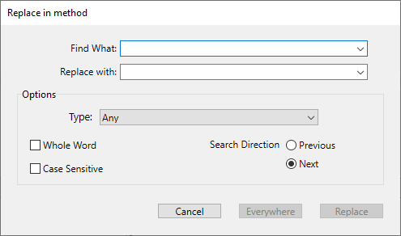

コードエディターには、カレントウィンドウ専用の検索/置換機能があります。

各ウィンドウのツールバーにある検索エリアを使用して単純な検索を実行することができます。

メソッド用の検索/置換コマンドは **編集** メニューの **検索** サブメニュー内にあります:

> **検索** サブメニューの上にある検索コマンドはコードエディター専用のものではなく、すべてのメソッド、クラス、関数を検索対象とするものです。**デザインモードを検索** 機能はツールバーからも簡単にアクセスできます。

## 検索

**検索...** コマンドを選択すると以下のダイアログボックスが表示されます:

このダイアログボックス内で定義された検索は最前面のメソッドに対して適用されます。

- **検索条件** エリアには、検索したい文字列を入力します。 このエリアはコンボボックスで、最新の検索/置換条件を15個、4D が終了するまで保持します。 **検索...** コマンドを選択する前にエディター中でテキストをハイライトすると、このエリアにそのテキストが表示されます。 このテキストを使用するか、別のテキストに置き換えることができます。
- **単語全体** オプションを選択すると、検索は (部分一致ではなく) 完全一致でおこなわれます。 たとえば、"client" を検索する場合、"clients" や "myclient" は検出されません。 このオプションはデフォルトで選択されておらず、"var" を検索すると "Myvar"、"variation" 等が検出されます。  デザインモードを検索ダイアログボックスの **語全体を含む** オプションとは異なり、**単語全体** オプションはオブジェクト名を考慮に入れない点に留意してください。 たとえば、このオプションを選択した場合、"My" をメソッド中で検索すると "My Variable" 変数が検出されます。 **語全体を含む** オプションを使用してデータベース全体を検索した場合、上記のような結果にはなりません。なぜならオブジェクト (ここでは変数のこと) の名称は "My Variable" であり、"My" とは一致しないからです。
- **大文字小文字を区別** オプションを使用すると、検索条件エリアに入力された文字の大小が区別されます。 たとえば、"MyVar" を検索した場合 "myVar" は検出されません。
- **前へ/次へ** ラジオボタンを使用して、現在カーソルのある方向を起点として、検索をおこなう方向を指定できます。

**OK** をクリックすると、4D は現在のカーソル位置から検索を実行します。 そして最初に見つかった項目がコードエディターウィンドウ内で選択されます。 その後は、**編集** メニューの **次を検索** / **前を検索** コマンドを使用して、同じ条件の検索を繰り返すことができます。

### 同じものを検索

**同じものを検索** コマンドを使用すると、選択した文字列と同じ文字列を検索することができます。 このコマンドは、コードエディター内で一文字以上選択した場合に利用可能となります。

実行される検索は、現在のコードエディターウィンドウ内の "次を検索" と同じです。

### 次の/前の同じものを検索

**次の同じものを検索** と **前の同じものを検索** コマンドは、選択された文字列と *厳密に* 一致する文字列を検索するのに使用されます。 たとえば、文字の大小は一致しなければなりません。

### すべてをブックマーク

**すべてをブックマーク** コマンドは、検索または置換ダイアログボックスで検索がすでに定義されている場合に利用可能となります。 このコマンドを選択すると、4D は現在設定されている検索条件に当てはまる行にブックマークを設定します。 これにより、すべての検索結果に簡単に印をつけられます。

ブックマークに関する詳細は [ブックマークを使用する](./write-class-method.md#ブックマークを使用する) を参照ください。

## 置換

**置換** コマンドを選択すると以下のダイアログボックスが表示されます:

- **検索条件** エリアには、検索したい文字列や式を入力します。 検索ダイアログ同様、このエリアはコンボボックスで、最新の検索/置換条件を15個、4D が終了するまで保持します。 **置換...** コマンドを選択する前にエディター中でテキストをハイライトすると、このエリアにそのテキストが表示されます。
- **置換文字** エリアには、検索条件として入力された文字を置換する文字列を入力します。 このエリアもコンボボックスで、最新の検索/置換条件を15個、4D が終了するまで保持します。
- **単語全体** オプションを選択すると、検索/置換は (部分一致ではなく) 完全一致でおこなわれます。 たとえば、"client" を検索する場合、"clients" や "myclient" は検出されません。
- **大文字小文字を区別** オプションを使用すると、検索条件エリアに入力された文字の大小が区別されます。 たとえば、"MyVar" を検索した場合 "myVar" は検出されません。
- 検索ダイアログ同様、**前へ/次へ** ラジオボタンを使用して、現在カーソルのある方向を起点として、検索をおこなう方向を指定できます。

**置換** ボタンをクリックすると、最初に見つかった語句に対する置換が実行されます。 4D は現在のカーソル位置から検索を実行します。 その後は、**編集** メニューの **次を置換** / **前を置換** コマンドを使用して、同じ条件の検索/置換を繰り返すことができます。

**一括置換** ボタンをクリックすると、開かれているメソッド内で検索条件に合致するすべての語句が一度に置換されます。

