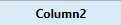
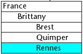

リストボックスは複合アクティブオブジェクトで、同期化された複数列 (カラムとも呼びます) の形式でデータの表示・入力がおこなえます。 リストボックスは、エンティティセレクションやレコードセレクションなどのデータベースコンテンツのほか、コレクションや配列などのランゲージコンテンツと紐づけることができます。 データ入力、列の並べ替え、イベント管理、外観のカスタマイズ、 列の移動など、リストボックスには高度な機能が備わっています。


リストボックスには 1つ以上の列があり、その内容が自動的に同期化されます。 理論上、列数に制限はありません (マシンのリソースに依存します)。

## 概要

### 基本のユーザー機能

実行中、リストボックスはリストとしてデータを表示し、入力を受け付けます。 セルを編集可能にするには ([その列について入力が許可されていれば](#入力の管理))、セル上で2回クリックします:


リストボックスのセルには、複数行のテキストを入力・表示できます。 セル内で改行するには、**Ctrl+Return** (Windows) または **Command+Return** (macOS) を押します。

セルにはブールやピクチャー、日付、時間、数値も表示することができます。 ヘッダーをクリックすると、列の値をソートできます ([標準ソート](#ソートの管理))。 すべての列が自動で同期されます。

またそれぞれの列幅を変更できるほか、ユーザーはマウスを使用して [列](properties_ListBox.md#locked-columns-and-static-columns) や [行](properties_Action.md#movable-rows) の順番を (そのアクションが許可されていれば) 入れ替えることもできます。 リストボックスは [階層モード](#階層リストボックス) で使用することもできます。

ユーザーは標準のショートカットを使用して 1つ以上の行を選択できます。**Shift+クリック** で連続した行を、**Ctrl+クリック** (Windows) や **Command+クリック** (macOS) で非連続行を選択できます。

### リストボックスの構成要素

リストボックスオブジェクトは、以下4つの項目で構成されます:

- [リストボックスオブジェクト](./listbox-object.md) 全体
- [カラム](./listbox-column.md)
- カラムの[ヘッダー](./listbox-header-footer.md#headers)
- カラムの[フッター](./listbox-header-footer.md#footers)


それぞれが独自のオブジェクト名や固有のプロパティを持ちます。 たとえば、列の数や、交互に使用する行の背景色などはリストボックスオブジェクトのプロパティで指定し、各列の幅は列プロパティ、ヘッダーのフォントはヘッダープロパティで指定します。

リストボックスオブジェクトやリストボックスの各列に対して、オブジェクトメソッドを設定することができます。 オブジェクトメソッドの呼び出しは、次の順でおこなわれます:

1. 各列のオブジェクトメソッド
2. リストボックスのオブジェクトメソッド

カラムのオブジェクトメソッドは [header](./listbox-header-footer.md#headers) および [footer](./listbox-header-footer.md#footers) 内で発生するイベントも取得します。

### リストボックスの型

リストボックスには複数のタイプがあり、動作やプロパティの点で異なります。 リストボックスの型は [データソースプロパティ](properties_Object.md#データソース) で定義します:

- **配列**: 各列に 4D 配列を割り当てます。 配列タイプのリストボックスは [階層リストボックス](listbox_overview.md#階層リストボックス) として表示することができます。
- **セレクション** (**カレントセレクション** または **命名セレクション**): 各列に式 (たとえばフィールド) を割り当てます。それぞれの行はセレクションのレコードを基に評価されます。
- **コレクションまたはエンティティセレクション**: 各列に式を割り当てます。各行の中身はコレクションの要素ごと、あるいはエンティティセレクションのエンティティごとに評価されます。

> 1つのリストボックス内に、複数のデータソースタイプを組み合わせて指定することはできません。 データソースは、リストボックス作成時に定義されます。 プログラムによって後から変更することはできません。

### リストボックスの管理

リストボックスオブジェクトはプロパティによってあらかじめ設定可能なほか、プログラムにより動的に管理することもできます。

4D ランゲージにはリストボックス関連のコマンドをまとめた "リストボックス" テーマが専用に設けられていますが、"オブジェクトプロパティ" コマンドや [`EDIT ITEM`](../commands/edit-item)、[`Displayed line number`](../commands/displayed-line-number) コマンドなど、ほかのテーマのコマンドも利用することができます。 詳細な情報については、*4D ランゲージリファレンス* の[リストボックスコマンドの一覧](https://doc.4d.com/4Dv20/4D/20.6/List-Box-Commands-Summary.300-7487600.en.html) のページを参照してください。

## 入力の管理

リストボックスのセルが入力可能であるには、以下の条件を満たす必要があります:

- セルが属する列が [入力可](properties_Entry.md#入力可) に設定されている (でなければ、その列のセルには入力できません)。
- `On Before Data Entry` イベントで $0 が -1 を返さない。 カーソルがセルに入ると、その列のメソッドで `On Before Data Entry` イベントが生成されます。 このイベントのコンテキストにおいて、$0 に -1 を設定すると、そのセルは入力不可として扱われます。 **Tab** や **Shift+Tab** が押された後にイベントが生成された場合には、フォーカスはそれぞれ次あるいは前のセルに移動します。 $0 が -1 でなければ (デフォルトは 0)、列は入力可であり編集モードに移行します。

2つの配列で構築されるリストボックスを考えてみましょう。 1つは日付でもう 1つはテキストです。 日付配列は入力不可ですが、テキスト配列は日付が過去でない場合に入力可とします。


*arrText* 列のメソッドは以下の通りです:

```4d
 Case of
    :(FORM event.code=On Before Data Entry) // セルがフォーカスを得たとき
       LISTBOX GET CELL POSITION(*;"lb";$col;$row)
  // セルの特定
       If(arrDate{$row}<Current date) // 過去の日付なら
          $0:=-1 // セルは入力不可
       Else
  // そうでなければ入力可
       End if
 End case
```

`On Before Data Entry` イベントは `On Getting Focus` より前に生成されます。

データの整合性を保つため、セレクション型とエンティティセレクション型のリストボックスにおいては、レコード/エンティティに対する変更はセル内の編集が確定されたときに自動的に保存されます。

- セルがアクティブでなくなったとき (ユーザーによるタブキー押下、クリック操作など)
- リストボックスからフォーカスが外れたとき
- フォームからフォーカスが外れたとき

データ入力・編集操作にともなって発生するイベントのシーケンスは次のようになります:

| 動作                                                                | リストボックス型            | イベントシーケンス                                                                                                                                                                                 |
| ----------------------------------------------------------------- | ------------------- | ----------------------------------------------------------------------------------------------------------------------------------------------------------------------------------------- |
| セルが編集モードに切り替わったとき (ユーザー操作または `EDIT ITEM` コマンド) | すべて                 | On Before Data Entry                                                                                                                                                                      |
|                                                                   | すべて                 | On Getting Focus                                                                                                                                                                          |
| セルの値が編集されたとき                                                      | すべて                 | On Before Keystroke                                                                                                                                                                       |
|                                                                   | すべて                 | On After Keystroke                                                                                                                                                                        |
|                                                                   | すべて                 | On After Edit                                                                                                                                                                             |
| ユーザーがセルを確定し、セルを移動したとき                                             | セレクションリストボックス       | 保存                                                                                                                                                                                        |
|                                                                   | レコードセレクションリストボックス   | On saving an existing record トリガー (設定されていれば)                                                                                                                           |
|                                                                   | セレクションリストボックス       | On Data Change(\*)                                                                                                                                                     |
|                                                                   | エンティティセレクションリストボックス | エンティティはオートマージオプション、オプティミスティック・ロックモードで保存されます (entity.save( ) を参照ください)。 正常に保存できた場合には、エンティティは更新され最新の状態が表示されます。 保存処理が失敗した場合、エラーが表示されます。 |
|                                                                   | すべて                 | On Losing Focus                                                                                                                                                                           |

(\*) エンティティセレクションリストボックスでの <code>On Data Change</code> イベントの場合:

- [カレントの項目](properties_DataSource.md#カレントの項目) オブジェクトには編集前の値が格納されます。
- `This` オブジェクトには、編集後の値が格納されます。

> コレクション/エンティティセレクション型では、式が null に評価される場合にリストボックスでのデータ入力に制約があります。 この場合、セル内の null 値を編集・削除することはできません。

## 選択行の管理

選択行の管理は、リストボックスのタイプが配列か、レコードのセレクションか、あるいはコレクション/エンティティセレクションかによって異なります。

- **セレクションリストボックス**: 選択行は、デフォルトで `$ListboxSetX` と呼ばれる変更可能なセットにより管理されます (X は 0 から始まり、フォーム内のリストボックスの数に応じて一つずつ増加していきます)。 このセットはリストボックスの[プロパティリスト](properties_ListBox.md#ハイライトセット)で定義します。 このセットは 4D が自動で管理します。 ユーザーがリストボックス中で 1つ以上の行を選択すると、セットが即座に更新されます。 他方、リストボックスの選択をプログラムから更新するために、"セット" テーマのコマンドを使用することができます。

- **コレクション/エンティティセレクションリストボックス**: 選択項目は、専用のリストボックスプロパティを通して管理されます。
  - [カレントの項目](properties_DataSource.md#カレントの項目) は、選択された要素/エンティティを受け取るオブジェクトです。
  - [選択された項目](properties_DataSource.md#選択された項目) は、選択された項目のコレクション/エンティティセレクションオブジェクトです。
  - [カレントの項目の位置](properties_DataSource.md#カレントの項目の位置) は、選択された要素あるいはエンティティの位置を返します。

- **配列リストボックス**: `LISTBOX SELECT ROW` コマンドを使用して、プログラムからリストボックスの行を選択できます。
  [リストボックスオブジェクトにリンクされた変数](properties_Object.md#変数あるいは式) は、行選択の取得、設定、保存に使用します。 この変数はブール配列で、4Dが自動的に作成・管理します。 この配列のサイズは、リストボックスのサイズにより決定されます。 つまり、各列に関連付けられた配列のうち、最も小さな配列と同じ数の要素を持ちます。
  この配列の各要素には、対応する行が選択された場合には `true` が、それ以外の場合は `false` が設定されます。 4D は、ユーザーの動作に応じてこの配列の内容を更新します。 これとは逆に、この配列要素の値を変更して、リストボックス中の選択行を変更することができます。
  他方、この配列への要素の挿入や削除はできず、行のタイプ変更もできません。 `Count in array` コマンドを使用して、選択された行の数を調べることができます。
  たとえば、以下のメソッドは配列タイプのリストボックスで、最初の行の選択を切り替えます:

```4d
 ARRAY BOOLEAN(tBListBox;10)
  // tBListBox はフォーム内にあるリストボックス変数の名前です
 If(tBListBox{1}=True)
    tBListBox{1}:=False
 Else
    tBListBox{1}:=True
 End if
```

> [`OBJECT SET SCROLL POSITION`](../commands/object-set-scroll-position) コマンドは、最初に選択された行または指定された行を表示するようにリストボックスをスクロールします。

### 選択行の見た目のカスタマイズ

リストボックスの [セレクションハイライトを非表示](properties_Appearance.md#セレクションハイライトを非表示) プロパティにチェックを入れている場合には、他のインターフェースオプションを活用してリストボックスの選択行を可視化する必要があります。 ハイライトが非表示になっていても選択行は引き続き 4D によって管理されています。つまり:

- 配列タイプのリストボックスの場合、当該リストボックスにリンクしているブール配列変数から選択行を割り出します。
- セレクションタイプのリストボックスの場合、特定行 (レコード) がリストボックスの [ハイライトセット](properties_ListBox.md#ハイライトセット) プロパティで指定しているセットに含まれているかを調べます。

特定された選択行は、それらの背景色やフォントカラー、フォントスタイルなどをプログラムによって調整することで、選択行を独自の方法で可視化することが可能です。 リストボックスのタイプによって、表示の管理は配列や式を使用しておこないます (後述参照)。

> リストボックスの現アピアランス (フォントカラー、背景色、フォントスタイル等) を使うには `lk inherited` 定数が使用できます。

#### セレクションリストボックス

選択行を特定するには、リストボックスの [ハイライトセット](properties_ListBox.md#ハイライトセット) プロパティで指定されているセットに対象行が含まれているかを調べます: 選択行のアピアランスを定義するには、プロパティリストにて [カラー式またはスタイル式プロパティ](#配列と式の使用) を 1つ以上使います。

次の場合には式が自動的に再評価されることに留意ください:

- リストボックスのセレクションが変わった場合
- リストボックスがフォーカスを得た、あるいは失った場合
- リストボックスが設置されたフォームウィンドウが最前面になった、あるいは最前面ではなくなった場合

#### 配列リストボックス

選択行を特定するには、当該リストボックスにリンクしているブール配列 [変数](properties_Object.md#変数あるいは式) を調べます:

選択行のアピアランスを定義するには、プロパティリストにて [行カラー配列または行スタイル配列プロパティ](#配列と式の使用) を 1つ以上使います。

選択行のアピアランスを定義するリストボックス配列は、`On Selection Change` フォームイベント内で再計算する必要があることに留意が必要です。また、フォーカスの有無を選択行の表示に反映させるには、次のフォームイベント内でもこれらの配列を変更することができます:

- `On Getting Focus` (リストボックスプロパティ)
- `On Losing Focus` (リストボックスプロパティ)
- `On Activate` (フォームプロパティ)
- `On Deactivate` (フォームプロパティ)
  ...いずれを利用するかは、選択のフォーカス変化を視覚的に表現するかどうか、またどのように表現するかによって異なります。

##### 例題

システムのハイライトを非表示にして、リストボックスの選択行を緑の背景色で表しました:


配列タイプのリストボックスの場合、[行背景色配列](properties_BackgroundAndBorder.md#行背景色配列) をプログラムにより更新する必要があります。 JSON フォームにおいて、リストボックスに次の行背景色配列を定義した場合:

```
	"rowFillSource": "_ListboxBackground",
```

リストボックスのオブジェクトメソッドに次のように書けます:

```4d
 Case of
    :(FORM event.code=On Selection Change)
       $n:=Size of array(LB_Arrays)
       ARRAY LONGINT(_ListboxBackground;$n) // 行背景色配列
       For($i;1;$n)
          If(LB_Arrays{$i}=True) // 選択されていれば
             _ListboxBackground{$i}:=0x0080C080 // 背景色を緑にします
          Else // 選択されていなければ
             _ListboxBackground{$i}:=lk inherited
          End if
       End for
 End case
```

セレクションタイプのリストボックスで同じ効果を得るには、[ハイライトセット](properties_ListBox.md#ハイライトセット) プロパティで指定されたセットに応じて [背景色式](properties_BackgroundAndBorder.md#背景色式) が更新されるよう、メソッドを利用します。

JSON フォームにおいて、リストボックスに次のハイライトセットおよび背景色式を定義した場合:

```
	"highlightSet": "$SampleSet",
	"rowFillSource": "UI_SetColor",
```

*UI_SetColor* メソッドに次のように書けます:

```4d
 If(Is in set("$SampleSet"))
    $color:=0x0080C080 //  背景色を緑にします
 Else
    $color:=lk inherited
 End if

 $0:=$color
```

> 階層リストボックスにおいては、[セレクションハイライトを非表示](properties_Appearance.md#セレクションハイライトを非表示) オプションをチェックした場合には、ブレーク行をハイライトすることができません。 同階層のヘッダーの色は個別指定することができないため、任意のブレーク行だけをプログラムでハイライト表示する方法はありません。

## ソートの管理

リストボックスには、標準ソートとカスタムソートがあります。 リストボックスの特定の列がソートされているとき、他の列も常に自動で同期されます。

### 標準ソート

ヘッダーがクリックされると、リストボックスはデフォルトで標準ソートによる並べ替えをおこないます。 標準的な並べ替えとは、列の評価値を英数字順に並べ替え、続けてクリックされると昇順/降順を交互に切り替えます。

リストボックスの [ソート可](properties_Action.md#ソート可) プロパティを無効化すると、ユーザーによる標準ソートを禁止することができます (デフォルトは有効)。

標準ソートのサポートは、リストボックスのタイプに依存します:

| リストボックスタイプ          | 標準ソートのサポート | コメント                                                                                                                                                                                                                                                                                                                                                                                                                                                                                                                                     |
| ------------------- | ---------- | ---------------------------------------------------------------------------------------------------------------------------------------------------------------------------------------------------------------------------------------------------------------------------------------------------------------------------------------------------------------------------------------------------------------------------------------------------------------------------------------------------------------------------------------- |
| Object の Collection | ◯          | <ul><li>"This.a" や "This.a.b" 列はソート可能です。</li><li>[リストボックス列の式プロパティ](properties_Object.md#変数あるいは式) は [代入可能な式](../Concepts/quick-tour.md#代入可-vs-代入不可の式) でなくてはなりません。</li></ul>                                                                                                                                                                                                                                                                                                                                                               |
| スカラー値のコレクション        | ×          | [`orderBy()`](../API/CollectionClass.md#orderby) 関数を使ったカスタムソートを使用します。                                                                                                                                                                                                                                                                                                                                                                                                                                                                    |
| エンティティセレクション        | ◯          | <ul><li>The [list box source property](properties_Object.md#variable-or-expression) must be an [assignable expression](../Concepts/quick-tour.md#assignable-vs-non-assignable-expressions).</li><li>サポートされる: オブジェクト属性プロパティに対するソート (例: "data" がオブジェクト属性であるときに"This.data.city")</li><li>サポートされる: リレートされた属性に対するソート(例: "This.company.name")</li><li>サポートされない: リレートされた属性を経由したオブジェクト属性に対するソート(例: "This.company.data.city")。 この場合には、[`orderByFormula()`](../API/EntitySelectionClass.md#orderbyformula) 関数を使ったカスタムソートを使用します (後述の例題参照)</li></ul> |
| カレントセレクション          | ◯          | 単純な式のみソート可能です (例: `[Table_1]Field_2`)                                                                                                                                                                                                                                                                                                                                                                                                                                                                 |
| 命名セレクション            | ×          |                                                                                                                                                                                                                                                                                                                                                                                                                                                                                                                                          |
| 配列                  | ◯          | ピクチャー配列やポインター配列と紐づけられた列はソートできません                                                                                                                                                                                                                                                                                                                                                                                                                                                                                                         |

### カスタムソート

デベロッパーは、例えば[`LISTBOX SORT COLUMNS`](../commands-legacy/listbox-sort-columns.md) コマンドを使用したり、あるいは[`On Header Click`](../Events/onHeaderClick) および [`On After Sort`](../Events/onAfterSort) フォームイベントと関連する4D コマンドを組み合わせることにより、カスタムのソートを設定することができます。

カスタムソートを以下のことが可能です:

- [`LISTBOX SORT COLUMNS`](../commands-legacy/listbox-sort-columns.md) コマンドを使うことで、複数のカラムに対してマルチレベルソートを実行する。
- [`collection.orderByMethod()`](../API/CollectionClass.md#orderbymethod) や [`entitySelection.orderByFormula()`](../API/EntitySelectionClass.md#orderbyformula) などの関数を使って、複雑な条件のソートをおこなう

#### 例題

リレート先のオブジェクト属性のプロパティ値に基づいてリストボックスをソートします。 以下のようなストラクチャーの場合を考えます:


`Form.child` 式に紐づいた、エンティティセレクションタイプのリストボックスを設置します。 `On Load` フォームイベントでは、`Form.child:=ds.Child.all()` を実行します。

次の 2つの列を表示します:

| 子供の名前       | 親のニックネーム                     |
| ----------- | ---------------------------- |
| `This.name` | `This.parent.extra.nickname` |

2列目の値に基づいてリストボックスをソートするには、次のコードを書きます:

```4d
If (Form event code=On Header Click)
	Form.child:=Form.child.orderByFormula("This.parent.extra.nickname"; dk ascending)
End if
```

### 列ヘッダー変数

[列ヘッダー変数](properties_Object.md#変数あるいは式)の値を使用すると、列の現在の並べ替え状況 (読み込み) や並べ替え矢印の表示など、追加情報を管理することができます。

- 変数が 0 のとき、列は並べ替えられておらず、矢印は表示されていません。  
  

- 変数が 1 のとき、列は昇順で並べ替えられており、並べ替え矢印が表示されています。
    
  

- 変数が 2 のとき、列は降順で並べ替えられており、並べ替え矢印が表示されています。
    
  

> 列ヘッダー変数には、宣言された、あるいは動的な [変数](Concepts/variables.md) のみを使用できます。 その他の [式](Concepts/quick-tour.md#式) (例: `Form.sortValue`) はサポートされていません。 その他の [式](Concepts/quick-tour.md#式) (例: `Form.sortValue`) はサポートされていません。

変数の値を設定して (たとえば Header2:=2)、ソートを表す矢印の表示を強制することができます。 しかし、列のソート順は変更されません、これを処理するのは開発者の役割です。

> The [`OBJECT SET FORMAT`](../commands-legacy/object-set-format.md) コマンドは、カスタマイズされた並べ替えアイコンをサポートする機能をリストボックスヘッダー用に提供しています。

## スタイルとカラー、表示の管理

リストボックスの背景色、フォントカラー、そしてフォントスタイルを設定するためにはいくつかの方法があります:

- [リストボックスオブジェクトのプロパティリスト](./listbox-object.md) を使用
- [カラムのプロパティリスト](./listbox-column.md) を使用
- リストボックスまたは列ごとの [配列や式](#配列と式の使用) プロパティを使用
- セルごとのテキストにて定義 ([マルチスタイルテキスト](properties_Text.md#マルチスタイル) の場合)

### 優先順位と継承

優先順位や継承の原理は、複数のレベルにわたって同じプロパティに異なる値が指定された場合に適用されます。

1. (最優先) セル(マルチスタイルテキストの場合)
2. 列の配列/メソッド
3. リストボックスの配列/メソッド
4. 列のプロパティ
5. リストボックスのプロパティ
6. (最も低い優先度) メタ情報式(コレクションまたはエンティティセレクション型リストボックスの場合)

例として、リストボックスのプロパティにてフォントスタイルを設定しながら、列には行スタイル配列を使用して異なるスタイルを設定した場合、後者が有効となります。

それぞれの属性 (スタイル、カラー、背景色) について、デフォルトの値を使用した場合、属性の **継承** がおこなわれます:

- セル属性について: 行の属性値を受け継ぎます
- 行属性について: 列の属性値を受け継ぎます
- 列属性について: リストボックスの属性値を受け継ぎます

このように、高次のレベルの属性値をオブジェクトに継承させたい場合は、定義するコマンドに `lk inherited` 定数 (デフォルト値) を渡すか、対応する行スタイル/カラー配列の要素に直接渡します。 以下のような、標準のフォントスタイルで行の背景色が交互に変わる配列リストボックスを考えます:


以下の変更を加えます:

- リストボックスオブジェクトの [行背景色配列](properties_BackgroundAndBorder.md#行背景色配列) プロパティを使用して、2行目の背景色を赤に変更します。
- リストボックスオブジェクトの [行スタイル配列](properties_Text.md#行スタイル配列) を使用して、4 行目のスタイルをイタリックに変更します。
- 5 列目の列オブジェクトの [行スタイル配列](properties_Text.md#行スタイル配列) を使用して、5 列目の二つの要素を太字に変更します。
- 1、2 列目の列オブジェクトの [行背景色配列](properties_BackgroundAndBorder.md#行背景色配列) を使用して、両列から一つずつ、計二つの背景色を濃い青に変更します:


リストボックスを元の状態に戻すには、以下の手順でおこないます:

- 1、2 列目の行背景色配列の要素 2 に定数 `lk inherited` 定数を渡します。これにより行の赤の背景色を継承します。
- 5 列目の行スタイル配列の要素 3 と 4 に定数 `lk inherited` を渡します。これにより、要素 4 を除いて標準のスタイルを継承します (要素 4 はリストボックスの行スタイル配列にて指定されたイタリックの属性を継承します)。
- リストボックスの行スタイル配列の要素 4 に定数 `lk inherited` を渡します。これにより、4 行目のイタリックのスタイルが除去されます。
- リストボックスの行背景色配列の要素 2 に定数 `lk inherited` を渡します。これにより元の、背景色が交互に変わるリストボックスの状態に戻すことができます。

### 配列と式の使用

リストボックスのタイプに応じて、行のカラーやスタイル、表示について使用できるプロパティが異なります:

| プロパティ    | 配列リストボックス                                          | セレクションリストボックス                                  | コレクションまたはエンティティセレクションリストボックス                                                         |
| -------- | -------------------------------------------------- | ---------------------------------------------- | ------------------------------------------------------------------------------------ |
| 背景色      | [行背景色配列](properties_BackgroundAndBorder.md#行背景色配列) | [背景色式](properties_BackgroundAndBorder.md#背景色式) | [背景色式](properties_BackgroundAndBorder.md#背景色式) または [メタ情報式](properties_Text.md#メタ情報式) |
| フォントカラー  | [行フォントカラー配列](properties_Text.md#行フォントカラー式)         | [フォントカラー式](properties_Text.md#フォントカラー式)        | [フォントカラー式](properties_Text.md#フォントカラー式) または [メタ情報式](properties_Text.md#メタ情報式)        |
| フォントスタイル | [行スタイル配列](properties_Text.md#行スタイル配列)              | [スタイル式](properties_Text.md#スタイル式)              | [スタイル式](properties_Text.md#スタイル式) または [メタ情報式](properties_Text.md#メタ情報式)              |
| 表示       | [行コントロール配列](properties_ListBox.md#行コントロール配列)       | -                                              | -                                                                                    |

## リストボックスの印刷

リストボックスの印刷には 2つの印刷モードがあります: フォームオブジェクトのようにリストボックスを印刷する **プレビューモード** と、フォーム内でリストボックスオブジェクトの印刷方法を制御できる **詳細モード** があります。 フォームエディターで、リストボックスオブジェクトに "印刷" アピアランスを適用できる点に留意してください。

### プレビューモード

プレビューモードでのリストボックスの印刷は、標準の印刷コマンドや **印刷** メニューを使用して、リストボックスを含むフォームをそのまま出力します。 リストボックスはフォーム上に表示されている通りに印刷されます。 このモードでは、オブジェクトの印刷を細かく制御することはできません。 とくに、表示されている以上の行を印刷することはできません。

### 詳細モード

このモードでは、リストボックスの印刷は `Print object` コマンドを使用してプログラムにより実行されます (プロジェクトフォームとテーブルフォームがサポートされています)。 [`LISTBOX GET PRINT INFORMATION`](../commands/listbox-get-print-information) コマンドはオブジェクトの印刷をコントロールするために使用されるコマンドです。

このモードでは:

- オブジェクトの高さよりも印刷する行数が少ない場合、リストボックスオブジェクトの高さは自動で減少させられます ("空白" 行は印刷されません)。 他方、オブジェクトの内容に基づき高さが自動で増大することはありません。 実際に印刷されたオブジェクトのサイズは [`LISTBOX GET PRINT INFORMATION`](../commands/listbox-get-print-information) コマンドを使用することで取得することができます。
- リストボックスオブジェクトは "そのまま" 印刷されます。言い換えれば、ヘッダーやグリッド線の表示、表示/非表示行など、現在の表示設定が考慮されます。
  これらの設定には印刷される最初の行も含みます。印刷を実行する前に [`OBJECT SET SCROLL POSITION`](../commands/object-set-scroll-position) を呼び出すと、リストボックスに印刷される最初の行はコマンドで指定した行になります。
- 自動メカニズムにより、表示可能な行以上の行数を含むリストボックスの印刷が容易になります。連続して `Print object` を呼び出し、呼び出し毎に別の行のまとまりを印刷することができます。 [`LISTBOX GET PRINT INFORMATION`](../commands/listbox-get-print-information) コマンドを使用して印刷の状態を進行中にチェックすることができます。

## 階層リストボックス

階層リストボックスは、最初のカラムのコンテンツが階層状に表示されるリストボックスのことです。 このタイプの表示方法は、繰り返される値や、階層に依存するデータの表示などに適用できます (国/地域/都市など)。

> [配列タイプ](#配列リストボックス) のリストボックスのみを階層にできます。

階層リストボックスはデータを表示する特別な方法ですが、データの構造 (配列) は変更しません。 階層リストボックスは通常のリストボックスとまったく同じ方法で管理されます。

### 階層の指定

階層リストボックスとして指定するには、3つの方法があります:

- フォームエディターのプロパティリストを使用して階層要素を手作業で設定する (または JSON フォームを編集する)。
- フォームエディターのリストボックス管理メニューを使用して階層を生成する。
- [`LISTBOX SET HIERARCHY`](../commands-legacy/listbox-set-hierarchy.md) と [`LISTBOX GET HIERARCHY`](../commands-legacy/listbox-get-hierarchy.md) コマンドを使用する。

#### "階層リストボックス" プロパティによる階層化

このプロパティを使用してリストボックスの階層表示を設定します。 JSON フォームにおいては、リストボックス列の [*dataSource* プロパティの値が配列名のコレクションであるとき](properties_Object.md#配列リストボックス) に階層化します。

*階層リストボックス* プロパティが選択されると、追加プロパティである **Variable 1...10** が利用可能になります。これらには階層の各レベルとして使用するデータソース配列を指定します。これが *dataSource* の値である配列名のコレクションとなります。 入力欄に値が入力されると、新しい入力欄が追加されます。 10個までの変数を指定できます。 これらの変数は先頭列に表示される階層のレベルを設定します。

Variable 1 は常に、リストボックスの先頭列の変数名に対応します (この 2つの値は自動でバインドされます)。 Variable 1欄は常に表示され、入力できます。 例: country。
Variable 2 も常に表示され、入力できます。 これは二番目の階層レベルを指定します。 例: regions。
三番目以降の欄は、その前の番号の欄が入力されると表示されます。 例えば: counties、cities等。 最大10レベルまで指定できます。 ある階層レベルの値を削除すると、その後の階層レベルが繰り上がります。

最後の変数に複数の同じ値が存在しても、この変数が階層になることはありません。 たとえば、arr1 に A A A B B B、arr2 に 1 1 1 2 2 2、そしてarr3 に X X Y Y Y Z が値として設定されている場合、A、B、1、そして 2 は階層で表示できますが、X と Y は階層になりません:


この原則は階層がひとつだけ設定されている場合には適用されません。 この場合、同じ値はグループ化されます。

> 既存のリストボックスで階層を設定した場合、(最初のものを除き) これらの列を削除または非表示にしなければなりません。 でないと、それらはリストボックス中で重複して表示されます。 エディターのポップアップメニューを使用して階層を設定すると (階層リストボックス参照)、不要な列は自動でリストボックスから取り除かれます。

#### コンテキストメニューを使用した階層化

フォームエディター内で配列タイプのリストボックスオブジェクトの一番目から任意の数の列を選択すると、**階層を作成** コマンドがコンテキストメニューから利用できるようになります:


このコマンドは階層化のショートカットです。 このコマンドを選択すると、以下のアクションが実行されます:

- そのオブジェクトのプロパティリストで **階層リストボックス** オプションが選択されます。
- その列の変数が階層を指定するために使用されます。 既に設定されていた変数は置き換えられます。
- (先頭列を除き) 選択された列はリストボックス内に表示されなくなります。

例: 左から国、地域、都市、人口列が設定されたリストボックスがあります。 国、地域、都市が (下図の通り) 選択され、コンテキストメニューから **階層を作成** を選択すると、先頭列に3レベルの階層が作成され、二番目と三番目の列は取り除かれます。人口列が二番目になります:


##### 階層をキャンセル

階層リストボックスとして定義されたリストボックスで先頭列を選択すると、**階層をキャンセル** コマンドを使用できます。 このコマンドを選択すると以下のアクションが実行されます: このコマンドを選択すると以下のアクションが実行されます:

- そのオブジェクトの **階層リストボックス** オプションの選択が解除されます。
- 2番目以降の階層レベルが削除され、通常の列としてリストボックスに追加されます。

### 動作

階層リストボックスを含むフォームが最初に開かれる際、デフォルトですべての行が展開されています。

配列中で値が繰り返されていると、ブレーク行と階層 "ノード" がリストボックスに自動で追加されます。 たとえば、リストボックスに都市に関する 4つの配列が含まれていて、それぞれ国、地域、都市名、人口データが含まれているとします:


リストボックスが階層形式で表示されると (先頭3つの配列が階層化されている場合)、以下のように表示されます:


階層を正しく構築するためには、事前に配列をソートしなければなりません。 たとえば、配列中にデータが AAABBAACC の順で含まれていると、階層は以下のようになります:
\>    A
\>    B
\>    A
\>    C

&gt; A B A C階層 "ノード" を展開したり折りたたんだりするには、ノード上をクリックします。 ノード上を **Alt+クリック** (Windows) または **Option+クリック** (macOS) すると、すべてのサブ要素が同時に展開されたり折りたたまれたりします。 これらの動作は `LISTBOX EXPAND` および `LISTBOX COLLAPSE` コマンドを使用することでプログラミングでも実行可能です。

階層リストボックスに日付や時間型の値を表示する際、それらは Short system format で表示されます。

#### 階層リストボックスでのソートの管理

階層モードのリストボックスにおいて、(リストボックス列のヘッダーをクリックして実行される) 標準の並べ替えは常に以下のようにおこなわれます:

- まず階層列 (一番目の列) のすべてのレベルが自動で昇順にソートされます。
- 次にクリックされた列の値を使用して、昇順または降順にソートが実行されます。
- すべての列が同期されます。
- その後の非階層列のソート時には、階層列の最後のレベルのみがソートされます。 この列のソートはそのヘッダーをクリックすることでおこなえます。

例として、まだソートされていない以下のリストボックスがあります:


"Population" ヘッダーをクリックして人口に基づき昇順あるいは降順でソートを行おこなうと、データは以下のように表示されます:


通常のリストボックスと同様、リストボックスの [ソート可](properties_Action.md#ソート可) オプションの選択を解除することで標準のソートメカニズムを無効にし、プログラムでソートを管理できます。

#### 選択行とその位置の管理

階層リストボックスは、ノードの展開 / 折りたたみ状態により、スクリーン上に表示される行数が変わります。 しかし配列の行数が変わるわけではありません。 表示が変わるだけでデータに変更はありません。 この原則を理解することは重要です。 階層リストボックスに対するプログラムによる管理は常に配列データに対しておこなわれるのであり、表示されたデータに対しておこなわれるわけではないからです。 とくに、自動で追加されるブレーク行は、表示オプション配列では考慮されません (後述参照)。

例として以下の配列を見てみましょう:


これらの配列が階層的に表示されると、2つのブレーク行が追加されるため、"Quimper" 行は 2行目ではなく 4行目に表示されます:


階層であってもなくても、リストボックスにどのようにデータが表示されているかにかかわらず、"Quimper" が含まれる行を太字にしたい場合はステートメント Style{2} = bold を使用しなければなりません。 配列中の行の位置のみが考慮されます。

この原則は以下のものを管理する内部的な配列に適用されます:

- カラー

- 背景色

- スタイル

- 非表示行

- 選択行

たとえば、Rennes を含む行を選択するには、以下のように書きます:

```4d
 ->MyListbox{3}:=True
```

*非階層表示:*  


*階層表示:*  


> 親が折りたたまれているために行が非表示になっていると、それらは選択から除外されます。 (直接あるいはスクロールによって) 表示されている行のみを選択できます。 言い換えれば、行を選択かつ隠された状態にすることはできません。

選択と同様に、[`LISTBOX GET CELL POSITION`](../commands/listbox-get-cell-position) コマンドは階層リストボックスと非階層リストボックスにおいて同じ値を返します。 つまり以下の両方の例題で、[`LISTBOX GET CELL POSITION`](../commands/listbox-get-cell-position) は同じ位置 (3;2) を返します。

*非階層表示:*  


*階層表示:*  


サブ階層のすべての行が隠されているとき、ブレーク行は自動で隠されます。 先の例題で 1から 3行目までが隠されていると、"Brittany" のブレーク行は表示されません。

#### ブレーク行の管理

ユーザーがブレーク行を選択すると、[`LISTBOX GET CELL POSITION`](../commands/listbox-get-cell-position) は対応する配列の最初のオカレンスを返します。 以下のケースで:


... [`LISTBOX GET CELL POSITION`](../commands/listbox-get-cell-position) は (2;4) を返します。 プログラムでブレーク行を選択するには [`LISTBOX SELECT BREAK`](../commands/listbox-select-break) コマンドを使用する必要があります。

ブレーク行はリストボックスのグラフィカルな表示 (スタイルやカラー) を管理する内部的な配列では考慮されません。 しかし、オブジェクトのグラフィックを管理するオブジェクト (フォーム) テーマのコマンドを使用してブレーク行の表示を変更できます。 階層を構成する配列に対して、適切なコマンドを実行します。

以下のリストボックスを例題とします (割り当てた配列名は括弧内に記載しています):

*非階層表示:*  


*階層表示:*  


階層モードでは `tStyle` や `tColors` 配列で変更されたスタイルは、ブレーク行に適用されません。 ブレークレベルでカラーやスタイルを変更するには、以下のステートメントを実行します:

```4d
 OBJECT SET RGB COLORS(T1;0x0000FF;0xB0B0B0)
 OBJECT SET FONT STYLE(T2;Bold)
```

> このコンテキストでは、配列に割り当てられたオブジェクトがないため、オブジェクトプロパティコマンドで動作するのは、配列変数を使用したシンタックスのみです。

結果:


#### 展開/折りたたみ管理の最適化

`On Expand` や `On Collapse` フォームイベントを使用して階層リストボックスの表示を最適化できます。

階層リストボックスはその配列の内容から構築されます。 そのためこれらの配列すべてがメモリにロードされる必要があります。 大量のデータから ([`SELECTION TO ARRAY`](../commands/selection-to-array) コマンドを使用して) 生成される配列をもとに階層リストボックスを構築するのは、表示速度だけでなくメモリ使用量の観点からも困難が伴います。

`On Expand` と `On Collapse` フォームイベントを使用することで、この制限を回避できます。たとえば、ユーザーのアクションに基づいて階層の一部だけを表示したり、必要に応じて配列をロード/アンロードできます。 これらのイベントのコンテキストでは、[`LISTBOX GET CELL POSITION`](../commands/listbox-get-cell-position) コマンドは、行を展開/折りたたむためにユーザーがクリックしたセルを返します。

この場合、開発者がコードを使用して配列を空にしたり値を埋めたりしなければなりません。 実装する際注意すべき原則は以下のとおりです:

- リストボックスが表示される際、先頭の配列のみ値を埋めます。 しかし 2番目の配列を空の値で生成し、リストボックスに展開/折りたたみアイコンが表示されるようにしなければなりません:
  

- ユーザーが展開アイコンをクリックすると `On Expand` イベントが生成されます。 [`LISTBOX GET CELL POSITION`](../commands/listbox-get-cell-position) コマンドはクリックされたセルを返すので、適切な階層を構築します: 先頭の配列に繰り返しの値を設定し、2番目の配列には [`SELECTION TO ARRAY`](../commands/selection-to-array) コマンドから得られる値を設定します。そして[`LISTBOX INSERT ROWS`](../commands/listbox-insert-rows) コマンドを使用して必要なだけ行を挿入します。  
  

- ユーザーが折りたたみアイコンをクリックすると `On Collapse` イベントが生成されます。 [`LISTBOX GET CELL POSITION`](../commands/listbox-get-cell-position) コマンドは該当するセルを返します。そして[`LISTBOX DELETE ROWS`](../commands/listbox-delete-rows) コマンドを使用して必要なだけ行をリストボックスから削除することができます。


