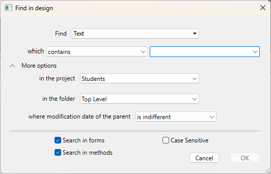
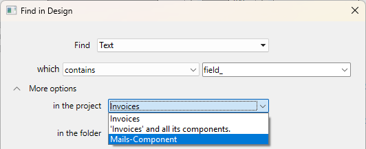
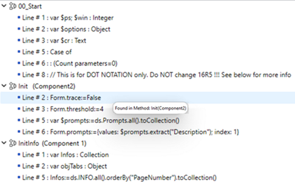
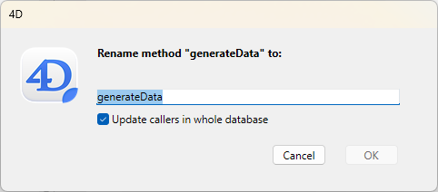

4D はデザイン環境の全ての要素に対して複数の検索と置換機能を提供しています。

- 文字列またはオブジェクトのタイプ(変数、コメント、式、など)に対して検索を行うことができます。 またカスタム条件("前方一致"、"含む"など)に基づいてプロジェクトの一部または全体に対して検索を行えます。 文字列またはオブジェクトのタイプ(変数、コメント、式、など)に対して検索を行うことができます。 またカスタム条件("前方一致"、"含む"など)に基づいてプロジェクトの一部または全体に対して検索を行えます。 例えば、"MyVar" という文字列を格納している変数を、名前が"HR_" で始まるメソッド内2位おいてのみ検索する、といったことを行うことができます。
- 検索した結果は結果ウィンドウ内に表示表示され、ここからコンテンツの置換を行うことができます。 この結果をテキストファイルとして書き出して、それをスプレッドシートなどに読み込ませることもできます。
- コード内で使用されていない変数やメソッドを検知し、それらを削除することでメモリを解放することもできます。
- 一回の操作で、デザイン環境内のプロジェクトメソッドや変数を名称変更することができます。

:::note

またエクスプローラーのメソッドページのコンテキストメニューには、プロジェクトのメソッド内を検索するための機能もあります: **呼び出し元を検索** ([メソッドエディター](../code-editor/write-class-method.md#search-callers) からも利用可能です) および **依存関係を検索** です。 どちらの機能も、[結果ウィンドウ](#結果ウィンドウ) 内に見つかった項目を表示します。 どちらの機能も、[結果ウィンドウ](#結果ウィンドウ) 内に見つかった項目を表示します。

:::

## 検索する場所

デザイン環境を検索する場合、以下の要素が検索されます:

- プロジェクトメソッドおよびクラスの名前
- 全てのメソッドとクラスの内容
- テーブル名、フィールド名、フォーム名
- フォームの中身:
  - オブジェクト名とタイトル
  - ヘルプTips、ピクチャー、変数、スタイルシートの名前
  - フォーマット文字列
  - 式
- メニュー(名前と項目)およびメニュー項目に割り当てられたコマンド
- 選択リスト(名前と項目)
- ヘルプTips (名前と内容)
- フォーマット / フィルター (名前と内容)
- エクスプローラーおよびコード内でのコメント

## デザインモードを検索

### 検索を開始する

"デザインモードを検索"ウィンドウ内で検索条件を指定します:

1. 4D ツールバー内の検索ボタン () をクリックします。
   または
   **編集** メニュー内から **デザインモードを検索...** コマンドを選択します。
   または
   **編集** メニュー内から **デザインモードを検索...** コマンドを選択します。

"デザインモードを検索" ウィンドウが表示されます:


メニューの選択に応じて、"デザインモードを検索"のエリアは動的に変化します。 ウィンドウを展開することで、全てのオプションを表示することもできます: ウィンドウを展開することで、全てのオプションを表示することもできます:



2. 異なるメニューやダイアログボックスの入力エリアを使用して検索をビルドすることができ、また必要であれば検索したい文字列を入力します。 これらの項目については、以下のセクションで説明されています。 これらの項目については、以下のセクションで説明されています。

3. [検索オプション](#検索オプション) を設定します(必要であれば)。

4. **OK** をクリックするか、または**Enter** キーを押してください。
   **OK** をクリックするか、または**Enter** キーを押してください。
   検索が完了すると、 [結果ウィンドウ](#結果ウィンドウ) が表示され、そこに検索で見つかった要素が一覧表示されます。

:::note

**x** ボタンを使用することで時間がかかっている進行中の検索をキャンセルすることができます。しかしキャンセルしてもウィンドウが閉じられることやすでに検索で見つかった結果が削除されることはありません。

:::

検索を一度実行したら、検索エリアに入力された値はメモリーに保存されます。 この値と、同じセッション中に入力された他の値は、コンボボックスから選択することができます。 この値と、同じセッション中に入力された他の値は、コンボボックスから選択することができます。

### 検索

**検索**メニューを使用して検索したい要素のタイプを指定します。 以下の選択肢から選択することが可能です: 以下の選択肢から選択することが可能です:

- **テキスト**: この場合、4D はデザイン環境内においてその文字列を検索します。 この検索はプレーンテキストモードで行われ、コンテキストは考慮されません。 例えば、"ALERT("Error number:"+" or "button27" というテキストを検索したとします。 このモードでは、ワイルドカード文字として "@" を使用することはできません。この場合は標準の文字として認識されるからです。 この検索はプレーンテキストモードで行われ、コンテキストは考慮されません。 例えば、"ALERT("Error number:"+" or "button27" というテキストを検索したとします。 このモードでは、ワイルドカード文字として "@" を使用することはできません。この場合は標準の文字として認識されるからです。
- **コメント**: この検索は基本的に前のものと同じですが、コード(// で始まる行)内の中身とエクスプローラーウィンドウ内のみを検索します。 例えば、 "To be verified" という文字列を格納する任意のコメントを検索することができます。 例えば、 "To be verified" という文字列を格納する任意のコメントを検索することができます。

:::note

どちらのタイプの検索結果も、選択された[検索モード](#検索モード) に応じて変わります。

:::

- **ランゲージ式**: これを使用すると任意の有効な4D 式を検索します。この検索は"含む"モードで実行されます。 この場合式の有効性が重要になります。4D はその式を検索するためにはそれが検証可能でなければならないからです。 例えば、 "[clients" (無効な式) を検索しても何も見つかりませんが、 "[clients]" であれば正しく検索されます。 このオプションは特に値の代入や比較の検索において特に有用です。 例:
  - "myvar:=" (代入) を検索する
  - "myvar=" (比較) を検索する
- **ランゲージ要素**: 特定のランゲージ要素をその名前で検索するのに使用されます。 4D は以下のような要素を識別することができます:
  - **すべてのランゲージ要素**: 以下のリスト内の全ての要素。
  - **プロジェクトメソッドまたはクラス**: プロジェクトメソッド名またはクラス名、例えば "M_Add" あるいは "EmployeeEntity" など。
  - **フォーム:** フォーム名。例 "Input"。 このコマンドはプロジェクトフォームおよびテーブルフォームを検索します。 このコマンドはプロジェクトフォームおよびテーブルフォームを検索します。
  - **フィールまたはテーブル**: テーブル名またはフィールド名。例 "Customers"。
  - **変数**: 任意の変数名。例 "$myvar"。
    **4D 定数**: 任意の定数。例 "Is Picture"。
    **引用符内の文字列**: リテラルなテキストのコンテンツ。例: コードエディター内、またはフォームエディターのテキストエリアに挿入された引用符内の任意の値。 例えば、 "Martin" を検索すると、コード内に以下のような行があった場合には検索結果を返します:
    `ds.Customer.query("name = :1"; "Martin")`
  - **4D コマンド**: 任意の4D コマンド。例 "Alert"。
  - **プラグインコマンド**: アプリケーションにインストールされたプラグインコマンド。
  - **プロパティ**: オブジェクトのプロパティ名(ORDA 属性名も含みます)。 **プロパティ**: オブジェクトのプロパティ名(ORDA 属性名も含みます)。 例えば "lastname" を検索した場合、"$o.lastname" および "ds.Employee.lastname" が返されます。
- **あらゆるオブジェクト**: このオプションを使用するとデザイン環境内にあるあらゆる要素内を検索します。 ここでは更新日フィルターしか使用できません。 このオプションを使用することで、例えば "今日変更されたもの"というような検索を実行できます。 ここでは更新日フィルターしか使用できません。 このオプションを使用することで、例えば "今日変更されたもの"というような検索を実行できます。

### 検索モード

検索モードメニュー(例えば"完全一致"や"名前"など)は入力された値をどのように検索するかを指定します。 このメニューの中身は、 **タイプ** ドロップダウンリスト内で選択された要素のタイプに応じて変化します。 このメニューの中身は、 **タイプ** ドロップダウンリスト内で選択された要素のタイプに応じて変化します。

- テキストまたはコメントの検索オプション:
  - **含む**: 指定された文字列をデザイン環境内の全てのテキスト内を検索します。 "var" の検索結果としては、 "myvar"、 "variable1" あるいは "aVariable" などが含まれます。 "var" の検索結果としては、 "myvar"、 "variable1" あるいは "aVariable" などが含まれます。
  - **語全体を含む**: 文字列を完全な単語としてデザイン環境内の全てのテキスト内を検索します。 "var" を検索した場合には、それと完全に一致した場合のみが結果として返されます。 この結果には "myvar" は含まれませんが、例えば "var:=10" や "ID+var" などは検索結果に含まれます。 何故なら `:` や `+` などの記号は単語の区切り文字だからです。
  - **前方一致 / 後方一致**: 文字列を単語の最初か最後に一致するか(テキスト検索)、あるいはコメント行の最初か最後に一致するか(コメント検索)を検索します。 "後方一致" モードにおいては、 "var" を検索した場合 "myvar" が検索結果に含まれます。 "後方一致" モードにおいては、 "var" を検索した場合 "myvar" が検索結果に含まれます。
- ランゲージ要素に対しての検索オプション: メニューは標準のオプション(等しい、含む、前方一致、後方一致)を提供します。 "等しい"検索オプションにおいては検索ワイルドカード (@) を使用できることに注意してください(指定されたタイプの全てのオブジェクトを返します)。

### コンポーネント内を検索

カレントのプロジェクトが [編集可能なコンポーネント](../Extensions/develop-components.md#editing-components) を参照している場合、コンポーネントの一つまたは全てを検索対象として含めることができます。 デフォルトでは、ホストに対してのみ検索が実行されます。 検索対象を変更するためには、**プロジェクト内** メニューを展開します: デフォルトでは、ホストに対してのみ検索が実行されます。 検索対象を変更するためには、**プロジェクト内** メニューを展開します:



ターゲットとして、以下を選択できます:

- **ホストプロジェクト** (デフォルトオプション、リストのトップ): 検索はホストプロジェクトのコードとフォーム内においてのみ実行され、コンポーネントは検索されません。
- **ホストプロジェクトとその全てのコンポーネント**: 検索はホストプロジェクトとそこでロードされた全てのコンポーネント内において実行されます。
- 全ての検索可能なコンポーネントのリスト内の**特定のコンポーネント**: 検索はそのコンポーネント内にのみ制限され、ホストと他のコンポーネントは検索されません。

:::note

検索可能なコンポーネントが見つからない場合、このメニューは利用できません。

:::

**フォルダ** メニュー(以下参照) はプロジェクト選択した時に更新されます。どのフォルダが利用できるかは選択された検索対象によって変わるからです。 **フォルダ** メニュー(以下参照) はプロジェクト選択した時に更新されます。どのフォルダが利用できるかは選択された検索対象によって変わるからです。 このメニューは "ホストプロジェクトとその全てのコンポーネント" オプションを選択している時には非表示になっています。

### Folder

**フォルダー** メニューは検索をプロジェクトの特定のフォルダへと制限します。 デフォルト("トップレベル"オプション)では、全てのフォルダ内で検索を実行します。 デフォルト("トップレベル"オプション)では、全てのフォルダ内で検索を実行します。

:::note

フォルダーは、エクスプローラーのホームページで定義されます。

:::

### 親オブジェクトの変更日

このメニューは親の作成日/変更日に従って検索(例えば、文字列を含んでいるメソッドの検索など)を制限します。 標準の日付条件(等しい、より以前、より以降、等しくない)に加えて、このメニューは標準の検索期間をより素早く指定するための複数のオプションを格納しています: 標準の日付条件(等しい、より以前、より以降、等しくない)に加えて、このメニューは標準の検索期間をより素早く指定するための複数のオプションを格納しています:

- **本日**: 現在の日付の真夜中(00:00 時)から始まる期間。
- **昨日以降**: 現在の日付と昨日の日付を含めた期間。
- **今週**: 現在の週の月曜日から始まる期間。
- **今月**: 現在の月の一日から始まる期間。

### 検索オプション

検索のスピードを上げるために役立つオプションを選択できます:

- **フォーム内を検索**: このオプションの選択が解除されていた場合、検索はプロジェクト内で行われますが、フォーム内は検索されません。
- **メソッド内を検索**: このオプションの選択が解除されていた場合、検索はプロジェクト内で行われますが、メソッド内は検索されません。
- **大文字/小文字を区別**: このオプションの選択が解除されていた場合、検索エリアに入力された文字の大文字/小文字を使用して検索が行われます。

## 結果ウィンドウ

結果ウィンドウはさまざまなタイプの検索を使用して設定された検索条件に合致する全ての要素を一覧表示します:

- [標準の検索](#検索を開始する)
- [未使用の要素を要素を検索する](#未使用のメソッドとグローバル変数を検索)
- [呼び出し元を検索](../code-editor/write-class-method.md#呼出し元を検索)
- 依存関係を検索
- [プロジェクトメソッドと変数の名称変更](#renaming-project-methods-and-variables)

検索結果は、見つかった要素のタイプごとに並べられた階層リストとして表示されます。 (ウィンドウの左下端にある)オプションメニュー、あるいはコンテキストメニュー内のオプションを使用してリスト内の階層項目を展開または折りたたむことができます。


このウィンドウの行をダブルクリックすることでその要素を [メソッドエディター(コードエディター)](../code-editor/write-class-method.md) などのエディター内で閲覧することができます。 複数の検索を実行した場合、それぞれの検索の結果ウィンドウが表示され、以前のウィンドウが開いたままで閉じられることはありません。 複数の検索を実行した場合、それぞれの検索の結果ウィンドウが表示され、以前のウィンドウが開いたままで閉じられることはありません。

一つ以上の結果が見つかった場合、リストには要素名のとなりに **個数** が表示されます。

各行には追加の情報を提供するtip が表示されていることがあります。例えば検索条件に合致した要素のプロパティや、検索結果を格納するフォームのページ番号などです。

検索の結果見つかった要素がコンポーネントに所属している場合、その要素名の右隣に **コンポーネント名** が表示されます:



検索が完了すると、  ボタンを使用することで同じ検索条件とオプションを使用した検索をもう一度実行することができます。

### オプションメニュー

オプションメニューを使用することでさまざまなアクションを実行することができます:


- **リストから削除**: 選択された要素を結果ウィンドウから削除します。 具体的には、結果のリスト内に置換操作を行いたい要素だけを残すことや、アプリケーション間でドラッグ&ドロップを使用したい要素だけを残すことなどができます。 具体的には、結果のリスト内に置換操作を行いたい要素だけを残すことや、アプリケーション間でドラッグ&ドロップを使用したい要素だけを残すことなどができます。
- **選択された項目以外を全てリストから削除**: 選択された項目を除いて全てを結果ウィンドウをから消去します。
- [**内容を置換**](#replace-in-content): 選択された項目の文字列を置き換えます。
- **選択 >**: 結果ウィンドウ内の全ての項目から、一つのタイプ(プロジェクトメソッド、オブジェクト名、など)だけを選択します。 階層サブメニューには全ての項目を一度に選択する(すべて)か選択解除する(なし)かを実行するコマンドを提供しています。 階層サブメニューには全ての項目を一度に選択する(すべて)か選択解除する(なし)かを実行するコマンドを提供しています。
- **全てを折りたたむ/全てを展開する**: 結果の一覧内の全ての階層項目を展開するか折りたたみます。
- **結果を書き出し**: 検索条件と結果ウィンドウに表示されている要素についての情報を書き出します。 このテキストファイルは例えばExcel などのスプレッドシートに読み込ませることができます。 各項目に対して、以下の情報がタブ区切りの値としてテキストファイル内に書き出されます: このテキストファイルは例えばExcel などのスプレッドシートに読み込ませることができます。 各項目に対して、以下の情報がタブ区切りの値としてテキストファイル内に書き出されます:
  - ホストプロジェクトまたはコンポーネント名
  - タイプ (メソッド、クラス、フォームオブジェクト、トリガー、など)
  - パス
  - プロパティ(正確であれば): 検索条件に合致するオブジェクトのプロパティを提供します。 例えば、文字列は同じフォーム内においても変数名(変数 プロパティ)またはオブジェクト名(オブジェクト名 プロパティ)として見つかることがありえます。 このフィールドは、合致する要素がオブジェクト自身である場合には空です。
  - コンテンツ (正確であれば): 検索条件に実際に合致するコンテンツを提供します。例えば、リクエストした文字列に合致するコード行などです。
  - 行番号(コードに対して) またはページ番号 (フォームオブジェクト)

## コンテンツを置換

内容を置換機能を使用すると、結果ウィンドウにリストされたオブジェクト内の文字列を他の文字列で置き換えることができます。 これはウィンドウの [オプションメニュー](#オプションメニュー) 内にて利用可能です。 これはウィンドウの [オプションメニュー](#オプションメニュー) 内にて利用可能です。

:::note

**内容を置換** メニュー項目は、読み出し専用のデータベース(例: .4dz ファイル内)などで作業している場合には無効化されています。

:::

このコマンドを選択した場合、最初の検索で見つかった全てのオカレンスを置き換える文字列を入力するためのダイアログボックスが表示されます:


置換オペレーションは以下のルールに基づいて実行されます:

- 置換はリスト内にある全ての項目に対して実行され、選択されている要素だけに止まりません。 置換はリスト内にある全ての項目に対して実行され、選択されている要素だけに止まりません。 しかしながら、 [オプションメニュー](#オプションメニュー) またはコンテキストメニュー内の **リストから削除** あるいは **選択された項目以外を全てリストから削除** を使用してリストの内容を最初に絞り込みすることで、置換オペレーションの対象を狭めることができます。
- 結果ウィンドウにコンポーネント内の要素が含まれていた場合、置換はコンポーネント内に対しても行われます。
- リストに表示されている発生箇所のみが置換され、かつ置換操作の前に、最初の検索条件に基づいて、最初の検索と置換操作の間にオブジェクトが変更されたケースを確認した後でのみ置換されます。
- 置換はコード、フォームオブジェクトのプロパティ、ヘルプメッセージの内容、入力フィルター、メニュー項目(項目のテキストとメソッド呼び出し)、選択リスト、コメント内で実行されます。
- それぞれのオブジェクトが編集されると、4D は他のマシンあるいは他のウィンドウにおいてすでにロードされているかどうかをチェックします。 コンフリクトがあった場合、オブジェクトがロックされていることを示す標準のダイアログボックスが表示されます。 オブジェクトを閉じてから再試行するか、置換をキャンセルすることができます。 置換操作はリスト内の他のオブジェクトに対して続行されます。 コンフリクトがあった場合、オブジェクトがロックされていることを示す標準のダイアログボックスが表示されます。 オブジェクトを閉じてから再試行するか、置換をキャンセルすることができます。 置換操作はリスト内の他のオブジェクトに対して続行されます。
- もし"内容を置換"操作の対象となっているメソッドまたはフォームが同じ4D アプリケーション内で現在編集中の場合、対象はその開かれているエディター内で直接編集されます(警告は表示されません)。 この方法で編集されたフォームおよびメソッドは自動的には保存されません: 変更を保存するためには **保存** あるいは **すべてを保存** コマンドを明示的に使用する必要があります。 この方法で編集されたフォームおよびメソッドは自動的には保存されません: 変更を保存するためには **保存** あるいは **すべてを保存** コマンドを明示的に使用する必要があります。
- リストの項目に対して置換が行われたあとは、それらは斜字体で表示されます。 ウィンドウの下部には行われた置換の回数がリアルタイムで表示されます。 ウィンドウの下部には行われた置換の回数がリアルタイムで表示されます。
- フォームオブジェクトを除き、見つかった要素自体の名前が **内容を置換** 機能で名称変更されることはありません。 そのため、リスト内の特定の一部の項目が置換オペレーションの影響を受けないことが有り得ます。 これは項目の名前のみが最初の検索条件に合致した場合などに起こり得ます。 この場合、リスト内の項目が必ずしも全て斜字体で表示されるわけではなく、また最終的な置換カウントが最初の検索で見つかったオカレンス数より少なくなることも有り得ます。

## プロジェクトメソッドと変数の名称変更 {#renaming-project-methods-and-variables}

4D は、プロジェクトメソッドと変数に対して、プロジェクト全体で名称変更を行うための専用の機能を提供しています。

**名称変更...** コマンドは、[コードエディター](プロジェクトメソッドと変数用)およびエクスプローラーのコンテキストメニュー(プロジェクトメソッド用)から利用可能です。


このコマンドを選択すると、そのオブジェクトの新しい名前を入力するためのダイアログボックスが表示されます。:



新しい名前は [命名規則](../Concepts/identifiers.md)に従っている必要があります。そうでない場合、ダイアログボックスを決定した際に警告が表示されます。 例えば、メソッド名を "Alert" などのコマンド名に変更することはできません。 例えば、メソッド名を "Alert" などのコマンド名に変更することはできません。

名称変更しようとしているオブジェクトのタイプ(プロジェクトメソッドまたは変数)によっては、名称変更ダイアログボックスに追加のオプションが表示される場合があります:

- プロジェクトメソッド: **すべての参照箇所でメソッド名を変更** オプションを使用すると、それを参照しているプロジェクト内の全てのコードにおいてメソッド名を変更します。 このオプションを選択解除することで、例えばエクスプローラー内においてのみメソッド名を変更することができます。 このオプションを選択解除することで、例えばエクスプローラー内においてのみメソッド名を変更することができます。
- プロセス変数: **すべての参照箇所で変数名を変更** オプションを使用すると、それを参照しているプロジェクト内のすべてのコードにおいて変数名を変更します。 このオプションを選択解除することで、カレントのメソッドの内の変数のみが名称変更されます。 このオプションを選択解除することで、カレントのメソッドの内の変数のみが名称変更されます。
- ローカル変数: これに対しては追加のオプションはありません。変数はカレントのメソッドまたはクラスにおいてのみ名称変更されます。

## 未使用の要素の検索

二つの特定のコマンドを使用することで、ホストプロジェクト内のコードでもう使用されていない変数とメソッドを検知することができます。 これらを削除することで、メモリーを解放することができます。 これらのコマンドは、デザイン環境の **編集** メニュー内にあります。

### 未使用のメソッドとグローバル変数を検索

このコマンドは、宣言されているものの使用されていないプロジェクトメソッドと、"グローバル"変数(プロセス変数とインタープロセス変数) を探します。 検索結果は標準の [結果ウィンドウ](#結果ウィンドウ) に表示されます。 検索結果は標準の [結果ウィンドウ](#結果ウィンドウ) に表示されます。

プロジェクトメソッドは、以下のようの場合に未使用であると判断されます:

- ゴミ箱の中にない
- 4D コード内でどこからも呼び出されていない
- メニューコマンドから呼び出されていない
- 4D コード内から文字列定数として呼び出されていない(4D はたとえメソッド名が括弧の中で後ろに引数が続いている時も、文字列内のメソッド名を検知することができます)。

プロセス変数とインタープロセス変数は、以下の場合に未使用であると判断されます:

- 4D コード内で [宣言されている](../Concepts/variables.md#変数の宣言)
- 4D コード内でどこでも使用されていない
- どのフォームオブジェクトでも使用されていない

ただしこの機能では特定の用法は検知できないことに注意してください。つまり、未使用と判断された要素が使用されていることが有り得るということです。 これは以下のようなコードの場合に当てはまります: これは以下のようなコードの場合に当てはまります:

```4d
var v : Text :="method"
EXECUTE FORMULA("my"+v+String(42))
```

このコードはメソッド名をビルドします。 このコードはメソッド名をビルドします。 *mymethod42* プロジェクトメソッドは実際には呼び出されていますが、ここでは未使用であると判断されてしまいます。 そのため、未使用であると宣言された要素が実際に不要であるかどうかを、削除する前に確認することが望ましいといえます。 そのため、未使用であると宣言された要素が実際に不要であるかどうかを、削除する前に確認することが望ましいといえます。

### 未使用のローカル変数を検索

このコマンドは宣言されているものの使用されていないローカル変数を探します。 検索結果は標準の [結果ウィンドウ](#結果ウィンドウ) に表示されます。 検索結果は標準の [結果ウィンドウ](#結果ウィンドウ) に表示されます。

ローカル変数は、以下のような場合に未使用であると判断されます:

- 4D コード内で [宣言されている](../Concepts/variables.md#変数の宣言)
- 同じメソッド内において宣言の箇所以外で使用されていない。
