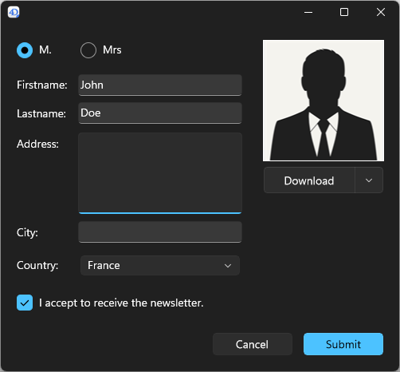

フォームはデスクトップアプリケーションにおいて、データの入力・修正・印刷をおこなうためのインターフェースとなります。 フォームを使用することで、ユーザーはデータベースのデータをやり取りし、レポートを印刷します。 フォームを使用して、カスタムダイアログボックスやパレット、そのほかのカスタムウィンドウを作成します。


また、以下の機能により、フォームは他のフォームを含むことができます:

- [サブフォームオブジェクト](FormObjects/subform_overview.md)
- [継承されたフォーム](./properties_FormProperties.md#継承するフォーム名)

## フォームを作成する

4Dフォームの追加や変更は、以下の要素を使っておこないます:

- **4D Developer インターフェース:** **ファイル** メニューまたは **エクスプローラ** ウィンドウから新規フォームを作成できます。
- **フォームエディター**: フォームの編集は **[フォームエディター](FormEditor/formEditor.md)** を使っておこないます。
- To simply print some part of a form, use the [`Print form`](../commands/print-form) command. 例:

```
{
    "windowTitle": "Hello World",
    "windowMinWidth": 220,
    "windowMinHeight": 80,
    "method": "HWexample",
    "pages": [
        null,
        {
            "objects": {
                "text": {
                "type": "text",
                "text": "Hello World!",
                "textAlign": "center",
                "left": 50,
                "top": 120,
                "width": 120,
                "height": 80
                },
                "image": {
                "type": "picture",
                "pictureFormat": "scaled",
                "picture": "/RESOURCES/Images/HW.png",
                "alignment":"center", 
                "left": 70,
                "top": 20, 
                "width":75, 
                "height":75        
                },
                "button": {
                "type": "button",
                "text": "OK",
                "action": "Cancel",
                "left": 60,
                "top": 160,


                "width": 100,
                "height": 20
                }
            }
        }
    ]
}
```

## Printing forms

In 4D desktop applications, forms can be printed using the various [commands of the **Printing** theme](../commands/theme/Printing).

### 印刷レンダリングエンジン

4D uses a dedicated print rendering engine to generate outputs with a design adapted for printing. It includes the following main features:

- Interactive widgets such as buttons, toggles, dropdowns, etc. and modern UI effects such as glass, blur, transparency, or shadow effects are converted into adapted static representations and flattened into printable styles, so that the document remains readable and professional once printed.
- Layout structure, spacing, and alignment, are preserved so that the printed document reflects the logical structure of the on-screen form.
- The same output is produced, whether the form is printed from macOS or Windows.

For example, the following form:


... will be printed with this rendering:


:::tip 関連したblog 記事

[Printing Modern Interfaces with Clean, Consistent Output](https://blog.4d.com/printing-modern-interfaces-with-clean-consistent-output)

:::

### 旧式印刷レンダラー

In releases prior to 4D 21 R3, another print renderer was used. This legacy renderer simply draws widgets as they appear on the screen. For compatibility, the legacy renderer is **enabled by default** in projects or databases converted from versions prior to 4D 21 R3, so that forms designed with this renderer continue to be printed as expected.

You can however enable the modern print rendering engine at any moment by:

- unchecking the **Use legacy print rendering** option in the [Compatibility page of the Settings dialog box](../settings/compatibility.md) (permanent setting),
- or executing [`SET DATABASE PARAMETER`](../commands/set-database-parameter) command with `Use legacy print rendering` selector set to 1 (volatile setting).

:::warning 制限

For technical reasons, the legacy print renderer is not available with forms displayed with [Fluent UI](#fluent-ui-rendering) on Windows or [Liquid Glass](../Notes/updates.md#support-of-liquid-glass-on-macos) on macOS. In these contexts, forms are **always printed with the modern print rendering engine**, whatever the compatibility option.

:::

## プロジェクトフォームとテーブルフォーム

2つのカテゴリーのフォームが存在します:

- **プロジェクトフォーム** - テーブルに属さない独立したフォームです。 このタイプのフォームは、おもにインターフェースダイアログボックスやコンポーネントを作成するのに使用されます。 プロジェクトフォームを使用してより簡単に OS標準に準拠するインターフェースを作成できます。 このタイプのフォームは、おもにインターフェースダイアログボックスやコンポーネントを作成するのに使用されます。 プロジェクトフォームを使用してより簡単に OS標準に準拠するインターフェースを作成できます。

- **テーブルフォーム** - 特定のテーブルに属していて、それによりデータベースに基づくアプリケーションの開発に便利な自動機能の恩恵を得ることができます。 通常、テーブルには入力フォームと出力フォームが別々に存在します。 通常、テーブルには入力フォームと出力フォームが別々に存在します。

フォームを作成する際にフォームカテゴリーを選択しますが、後から変更することも可能です。

## フォームのページ

Each form is made of at least two pages:

- ページ1: デフォルトで表示されるメインページ
- ページ0: 背景ページ。このページ上に置かれたオブジェクトはすべてのページで表示されます

1つの入力フォームに複数のページを作成することができます。 一画面に納まりきらない数のフィールドや変数がある場合は、これらを表示するためにページを追加することができます。 複数のページを作成すると、以下のようなことが可能になります:

- もっとも重要な情報を最初のページに配置し、他の情報を後ろのページに配置する。
- トピックごとに、専用ページにまとめる。
- [入力順](formEditor.md#データの入力順)を設定して、データ入力中のスクロール動作を少なくしたり、または不要にする。
- フォーム要素の周りの空間を広げ、洗練された画面をデザインする。

複数ページは入力フォームとして使用する場合にのみ役立ちます。 印刷出力には向きません。 マルチページフォームを印刷すると、最初のページしか印刷されません。

フォームのページ数には制限がありません。 フォーム内の複数ページ上に同じフィールドを何度でも表示することができます。 しかし、フォームのページ数が多くなるほど、フォームの表示に要する時間が長くなります。

マルチページフォームには、1つの背景ページと複数の表示ページが存在します。 背景ページ上に置かれたオブジェクトはすべての表示ページに現れますが、それらのオブジェクトの選択や編集は背景ページでのみ可能です。 複数ページフォームでは、ボタンパレットを背景ページに置くべきです。 また、ページ移動ツールオブジェクトを背景ページに配置し、ユーザーに提供する必要があります。

## Fluent UI レンダリング

:::caution デベロッパー・プレビュー

Fluent UI のサポートは現在デベロッパープレビューのフェーズです。 本番環境で使用すべきではありません。 本番環境で使用すべきではありません。

:::

Windows では、4D は **Fluent UI** フォームレンダリングをサポートしています。これは **WinUI 3** テクノロジーに基づいた、Microsoft のモダンなグラフィカルユーザーインターフェースデザインです。 **WinUI 3** はWindows App SDK の基礎であり、今後のWindows グラフィカルインターフェースを象徴するものです。 **WinUI 3** はWindows App SDK の基礎であり、今後のWindows グラフィカルインターフェースを象徴するものです。

Fluent UI レンダリングは現代的かつ魅力的なコントロールを提供するだけでなく、ダーク/ライトシステムテーマのサポート、高解像度ディスプレイのために最適化されたよりスムーズなレンダリング、そして最近のMicrosoft アプリケーションに沿った、一貫したユーザーエクスペリエンスを提供します。

| ライトテーマ                                  | ダークテーマ                                       |
| --------------------------------------- | -------------------------------------------- |
|  |  |

:::info 利用可能性

この機能は、**Windows の4D プロジェクト内** で使用可能です。 macOS や、Windows のバイナリー4D データベースなどではご利用いただけません。 macOS や、Windows のバイナリー4D データベースなどではご利用いただけません。

:::

:::tip 関連したblog 記事

[Modernize your 4D interfaces with Fluent UI](https://blog.4d.com/modernize-your-4d-interfaces-with-fluent-ui)<br/>
[Deploy Fluent UI effortlessly in your 4D applications](https://blog.4d.com/deploy-fluent-ui-effortlessly-in-your-4d-applications)

:::

### 要件

Fluent UI レンダリングを使用するには、 **Windows App SDK** がマシン上にインストールされている必要があります。 フォームを表示するためには、この SDK がWindows マシンにインストールされているか確認する必要があります。 フォームを表示するためには、この SDK がWindows マシンにインストールされているか確認する必要があります。

[必要であれば](https://blog.4d.com/deploy-fluent-ui-effortlessly-in-your-4d-applications)、 Windows App SDK をインストールすることができます。 利便性のために、4D インストーラーは、Windows App SDK インストーラーをダウンロードするための [リンクを提供しています](../GettingStarted/Installation.md#ディスクへのインストール) 。 また、 [Microsoft ダウンロードページ](https://learn.microsoft.com/ja-jp/windows/apps/windows-app-sdk/downloads) からダウンロードすることもできます。 推奨されるのは、4D インストーラーから提供されるバージョンを使用することです。こちらのほうが、最適な互換性を得られます。 利便性のために、4D インストーラーは、Windows App SDK インストーラーをダウンロードするための [リンクを提供しています](../GettingStarted/Installation.md#ディスクへのインストール) 。 また、 [Microsoft ダウンロードページ](https://learn.microsoft.com/ja-jp/windows/apps/windows-app-sdk/downloads) からダウンロードすることもできます。 推奨されるのは、4D インストーラーから提供されるバージョンを使用することです。こちらのほうが、最適な互換性を得られます。

Windows App SDK が適切にインストールされていない場合、4D は全てのフォームをクラシックモードで何のエラーもなく表示し、また [診断ログ](../Debugging/debugLogFiles.md#4ddiagnosticlogtxt) に以下のメッセージが記録されます: "Fluent UI が必要ですが利用不可です。 アプリケーションはClassic Windows テーマで実行されます。" アプリケーションはClassic Windows テーマで実行されます。"

### Fluent UI レンダリングを有効化する

Fluent UI レンダリングモードは、アプリケーションレベルまたはフォームレベルで有効化することができます。 フォームでの設定の方がアプリケーションの設定より優先されます。 フォームでの設定の方がアプリケーションの設定より優先されます。

#### アプリケーション設定

ストラクチャー設定ダイアログボックスの"インターフェース" ページ内にある **Windows で Fluent UI を使用する** オプションをチェックします。


この場合、Windows 上ではデフォルトで全てのフォームにおいてFluent UI レンダリングモードが使用されます。

:::note

カレントの設定が[Fluent UI の要件](#要件) に合致していない場合、チェックボックスの横にエラーメッセージが表示されます。

:::

#### フォーム設定

それぞれのフォームは、 **Widget appearance** プロパティによって独自のレンダリング設定を定義することができます。 次のオプションから選択することができます: 次のオプションから選択することができます:

- **継承**: グローバルなアプリケーション設定を継承します(デフォルト)
- **クラシック**: クラシック Windows スタイルを使用します
- **Fluent UI**: Fluent UI に基づいたモダンなレンダリングを有効化します。 <br/>
   <br/>
  

対応する[JSON フォームプロパティ](./properties_JSONref.md) は `fluentUI` で、値は未定義(つまり継承、デフォルト値)、 "true" または "false"です。

#### CSS

[**form-theme** CSS メディアクエリ](./createStylesheet.md#メディアクエリ) を使用することで、使用されるテーマに応じて異なるスタイルを設定することができます。

### 特定の振る舞い

Fluent UI で4D フォームを使用する場合、以下の点に注意を払う必要があります:

- 新しい [`FORM theme`](../commands/form-theme) コマンドはカレントのフォームの実際の表示テーマを返します。 取り得る値: "Classic" あるいは "FluentUI"。 カレントフォームがない場合、あるいはコマンドがmacOS 上で呼ばれた場合、空の文字列が返されます。 取り得る値: "Classic" あるいは "FluentUI"。 カレントフォームがない場合、あるいはコマンドがmacOS 上で呼ばれた場合、空の文字列が返されます。
- [`Application info`](../commands/application-info) コマンドを使用することで、Fluent UI が使用できるかどうか(`canUseFluentUI` プロパティ) あるいは使用されているかどうか(`useFluentUI` プロパティ) を知ることができます。
- [`GET STYLE SHEET INFO`](../commands/get-style-sheet-info) がフォームのコンテキストで呼び出された場合、返された情報はフォームのカレントのアピアランス(クラシックあるいはFluent UI)に関連したものです。 コマンドがフォームのコンテキスト外から呼ばれた場合、返された情報は[グローバルプロジェクト設定](#アプリケーション設定) に関連したものです。
- [`SET MENU ITEM STYLE`](../commands/set-menu-item-style) の*itemStyle* 引数での `Underline` はポップアップメニューではサポートされていません(無視されます)。
- [ステッパー](../FormObjects/stepper.md) フォームオブジェクトは[ダブルクリックイベント](../Events/onDoubleClicked.md) サポートしません。
- [サークルボタン](../FormObjects/button_overview.md#サークル) はサポートされています(macOS と同様)。
- [`WA ZOOM IN`](../commands/wa-zoom-in) / [`WA ZOOM OUT`](../commands/wa-zoom-out) コマンドは、システムレンダリングエンジンを使用したWeb エリアではサポートされません。
- フォーカスの四角はピクチャーおよびテキストの[入力](../FormObjects/input_overview.md) に追加することができます。

## 継承フォーム

4D では "継承フォーム" を使用することができます。これはつまり、*フォームA* の全オブジェクトが *フォームB* で使用可能であるということです。 この場合、*フォームB* は *フォームA* からオブジェクトを "継承" します。 この場合、*フォームB* は *フォームA* からオブジェクトを "継承" します。

継承フォームへの参照は常にアクティブです。そのため、継承フォームの要素が変更されると (たとえば、ボタンスタイル)、この要素を使用する全フォームが自動的に変更されます。

テーブルフォームおよびプロジェクトフォームの両方を継承フォームとして使用できます。 ただし、継承フォームに含まれる要素は、異なるデータベーステーブルでの使用に対応していなければなりません。

フォームが実行されると、オブジェクトがロードされ、次の順序で組み立てられます:

1. 継承フォームの 0ページ
2. 継承フォームの 1ページ
3. 開かれたフォームの 0ページ
4. 開かれたフォームのカレントページ

この順番はフォーム内でのオブジェクトのデフォルトの[入力順](formEditor.md#データ入力順) を決定します。

> 継承フォームの 0ページと 1ページだけが他のフォームに表示可能です。

継承フォームとして使用される場合、継承フォームのプロパティとフォームメソッドは使用されません。 他方、継承フォームに含まれるオブジェクトのメソッドは呼び出されます。

継承フォームを設定するには、他のフォームを継承するフォームにおいて、[継承されたフォーム名](properties_FormProperties.md#継承されたフォーム名) および [継承されたフォームテーブル](properties_FormProperties.md#継承されたフォームテーブル) (テーブルフォームの場合) プロパティを設定しなければなりません。

プロジェクトフォームを継承するには [継承されたフォームテーブル](properties_FormProperties.md#継承されたフォームテーブル) プロパティで `\<なし>` を選択します (JSON の場合は " ")。

フォームの継承をやめるには、プロパティリストの [継承されたフォーム名](properties_FormProperties.md#継承されたフォーム名) プロパティで `\<なし>` オプション (JSONの場合は " ") を選択します。

> 任意のフォームで継承フォームを設定し、そのフォームを第3のフォームの継承フォームとして使用することができます。 再帰的な方法で各オブジェクトが連結されます。 4Dは、再帰的ループを見つけ出し (たとえば、[テーブル1]フォーム1 が [テーブル1]フォーム1 を継承フォームとして定義している、つまり自分自身を継承している場合)、フォームの連鎖を中断します。

## プロパティ一覧

[フォームタイプ](properties_FormProperties.md#フォームタイプ) -
[フォーム名](properties_FormProperties.md#フォーム名) -
[継承されたフォームテーブル](properties_FormProperties.md#継承されたフォームテーブル) -
[継承されたフォーム名](properties_FormProperties.md#継承されたフォーム名) -
[ウィンドウタイトル](properties_FormProperties.md#ウィンドウタイトル) -
[配置を記憶](properties_FormProperties.md#配置を記憶) -
[サブフォームとして公開](properties_FormProperties.md#サブフォームとして公開) -
[固定幅](properties_WindowSize.md#固定幅) -
[最小幅](properties_WindowSize.md#最大幅-最小幅) -
[最大幅](properties_WindowSize.md#最大幅-最小幅) -
[固定高さ](properties_WindowSize.md#固定高さ) -
[最小高さ](properties_WindowSize.md#最大高さ-最小高さ) -
[最大高さ](properties_WindowSize.md#最大高さ-最小高さ) -
[印刷設定](properties_Print.md#設定) -
[連結メニューバー](properties_Menu.md#連結メニューバー) -
[フォームヘッダー](properties_Markers.md#フォームヘッダー) -
[フォーム詳細](properties_Markers.md#フォーム詳細) -
[フォームブレーク](properties_Markers.md#フォームブレーク) -
[フォームフッター](properties_Markers.md#フォームフッター) -
[メソッド](properties_Action.md#メソッド) -
[Pages](properties_FormProperties.md#pages)

## サポートされるイベント

[On Activate](../Events/onActivate.md) - [On After Edit](../Events/onAfterEdit.md) - [On After Keystroke](../Events/onAfterKeystroke.md) - [On Before Keystroke](../Events/onBeforeKeystroke.md) - [On Begin Drag Over](../Events/onBeginDragOver.md) - [On Bound Variable Change](../Events/onBoundVariableChange.md) - [On Clicked](../Events/onClicked.md) - [On Close Box](../Events/onCloseBox.md) - [On Close Detail](../Events/onCloseDetail.md) - [On Data Change](../Events/onDataChange.md) - [On Deactivate](../Events/onDeactivate.md) - [On Display Detail](../Events/onDisplayDetail.md) - [On Double Clicked](../Events/onDoubleClicked.md) - [On Drop](../Events/onDrop.md) - [On Header](../Events/onHeader.md) - [On Load](../Events/onLoad.md) - [On Load Record](../Events/onLoadRecord.md) - [On Losing focus](../Events/onLosingFocus.md) - [On Menu Selected](../Events/onMenuSelected.md) - [On Mouse Enter](../Events/onMouseEnter.md) - [On Mouse Leave](../Events/onMouseLeave.md) - [On Mouse Move](../Events/onMouseMove.md) - [On Open Detail](../Events/onOpenDetail.md) - [On Outside Call](../Events/onOutsideCall.md) - [On Page Change](../Events/onPageChange.md) - [On Plug in Area](../Events/onPlugInArea.md) - [On Printing Break](../Events/onPrintingBreak.md) - [On Printing Detail](../Events/onPrintingDetail.md) - [On Printing Footer](../Events/onPrintingFooter.md) - [On Resize](../Events/onResize.md) - [On Selection Change](../Events/onSelectionChange.md) - [On Timer](../Events/onTimer.md) - [On Unload](../Events/onUnload.md) - [On Validate](../Events/onValidate.md)