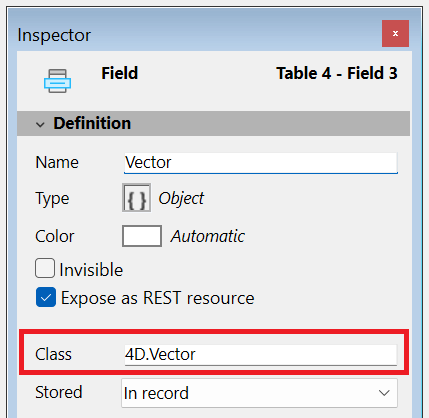

For other field properties, please refer to [doc.4d.com](https://doc.4d.com/4Dv21/4D/21/Field-properties.300-7676763.en.html).

## Class

このプロパティは**オブジェクト**型のフィールドにおいてのみ利用可能です(プロジェクトモードのみ)。 これを使用すると**クラス型のオブジェクトフィールド**を定義することができ、これによってコード保管、シンタックスチェック、そしてオブジェクトフィールドに絡んだコードを打ち込んでいる際のランタイム評価などを改善することができます。

ここには有効なクラス名であればなんでも入力することができます。これには以下のものも含まれます:

- ユーザークラス(例: `cs.MyClass`)
- ビルトイン4D クラス(例: `4D.File`、`4D.Folder`)
- [公開された](../Extensions/develop-components.md#クラスの共有) コンポーネントで定義されたクラス(例: `cs.MyComponent.MyClass`)

無効なクラス名を入力した場合、警告がトリガーされ、入力が拒否されます。

:::note

[ORDA データモデルクラス](../ORDA/ordaClasses.md)、[ファイルハンドラー](../API/FileHandleClass.md)、[Web サーバー](../API/WebServerClass.md)... などの**ストリーム不可のクラス** はオブジェクトフィールドに代入することはできません。

:::

コード内において、値をクラス型のオブジェクトフィールドに代入する場合、4D はその値が宣言されたクラスに所属しているかどうかを検証します。 クラスに所属していない場合、あるいはオブジェクトがどのクラスにも属していない場合、エラーがトリガーされます。 不明な属性へのアクセスもまたシンタックスエラーを発生させます。

ランタイムにおいて関連づけられたクラス名を取得するためには、[`classID`](../API/DataClassClass.md#attributename) プロパティを使用してください。例: `ds.MyTable.MyField.classID` 。

### 参照

- [Blog post: Stricter class-based typing for objects](https://blog.4d.com/stricter-class-based-typing-for-objects/)

