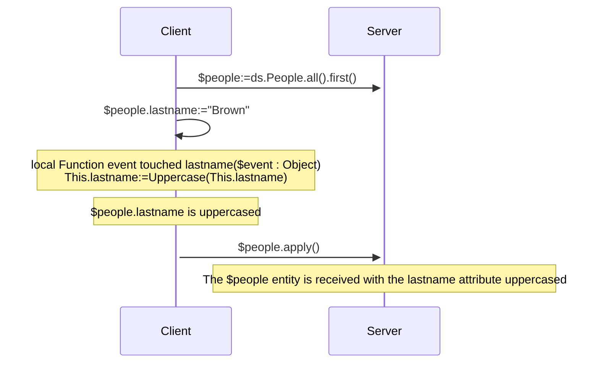
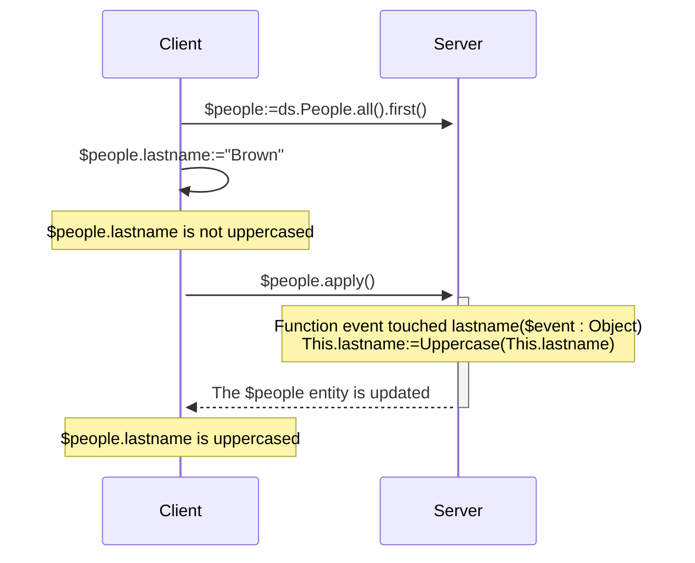
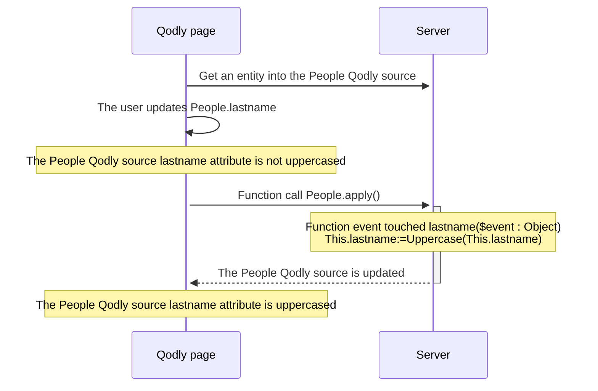

<details><summary>履歴</summary>

| リリース   | 内容                                                                                                 |
| ------ | -------------------------------------------------------------------------------------------------- |
| 21     | 追加されたイベント: validateSave / saving / afterSave / validateDrop / dropping / afterDrop |
| 20 R10 | touched イベント追加                                                                                     |

</details>

エンティティイベントとは、エンティティやエンティティ属性が操作(追加、削除、変更)されるたびに ORDA によって自動的に呼び出される関数です。 シンプルなイベントを書き、それをより洗練されたものに変えていくことができます。

イベント関数の実行は直接トリガーすることはできません。 イベントは、ユーザーアクションや、エンティティまたはその属性に対するコードを通して実行された操作に基づいて、ORDA によって自動的に呼び出されます。

:::tip Related blog post

[ORDA – Handle an event-driven logic during data persistence actions](https://blog.4d.com/orda-handle-an-event-driven-logic-during-database-operations)

:::

:::info 互換性に関する注意

データストアにおける ORDA エンティティイベントは、4D データベースにおけるトリガに相当します。 しかしながら、4D クラシックランゲージコマンドを使用して 4D データベースレベルでトリガーされたアクション、あるいは標準アクションは、ORDA イベントをトリガーしません。 また、トリガとは異なり、ORDA エンティティイベントはエンティティを保存または削除する際に、データクラスの元となるテーブル全体をロックしないことに注意して下さい。 個別のエンティティ(つまりレコード)に起因している限りは、複数のイベントが同時に実行されることが可能です。

:::

## 概要

### イベントレベル

イベント関数は必ず[Entity クラス](../ORDA/ordaClasses.md#エンティティクラス) 内で定義されます。

イベントは **エンティティ** レベルまたは **属性** レベルで設定することができます(属性には [**計算属性**](../ORDA/ordaClasses.md#計算属性) も含まれます)。 前者の場合、エンティティのあらゆる属性でイベントがトリガーされます。それ以外の場合、イベントは対象となる属性に対してのみトリガーされます。

同じイベントに対して、異なる属性に対して異なる関数を定義することができます。

また同じイベントを属性レベルとエンティティレベルの両方で定義することも可能です。 その場合、属性イベントが先に呼ばれ、その後にエンティティイベントが呼ばれます。

### リモート構成における実行

一般的に、ORDA イベントはサーバー上で実行されます。

しかしながらクライアント/サーバー構成においては、[`local`](./ordaClasses.md#local-functions) キーワードの使用によっては、`touched()` イベント関数を**サーバーまたはクライアント**で実行することが可能です。 クライアント側で特定の実装をすることにより、イベントをクライアント上でトリガーすることができるようになります。

:::note

ORDA [`constructor()`](./ordaClasses.md#class-constructor) 関数は必ずクライアント上で実行されます。

:::

他のリモート構成(例: [Qodly アプリケーション](https://developer.4d.com/qodly)、[REST API リクエスト](../REST/REST_requests.md)、あるいは[`Open datastore`](../commands/open-datastore.md) を通したリクエスト)においては、イベント関数は必ず**サーバー側**で実行されます。 これはつまりイベントをトリガーするためには、属性がタッチされたことがサーバーから"見える"ようにしておくようにしなければならいことを意味します(以下参照)。

### 概要表

以下の表は、ORDA イベントの一覧とそのルールをまとめたものです。

| イベント                                  | レベル    | 関数名                                                     |            (C/S の場合) 実行される場所            | エラーを返すことでアクションを停止できる |
| :------------------------------------ | :----- | :------------------------------------------------------ | :--------------------------------------------------------: | -------------------- |
| エンティティのインスタンス化                        | Entity | [`constructor()`](./ordaClasses.md#class-constructor-1) |                           client                           | ×                    |
| 属性がタッチされた                             | 属性     | `event touched <attrName>()`                            | [`local`](../ORDA/ordaClasses.md#local-functions) キーワードによる | ×                    |
|                                       | Entity | `event touched()`                                       | [`local`](../ORDA/ordaClasses.md#local-functions) キーワードによる | ×                    |
| エンティティを保存する前                          | 属性     | `validateSave <attrName>()`                             |                           server                           | ◯                    |
|                                       | Entity | `validateSave()`                                        |                           server                           | ◯                    |
| エンティティの保存時                            | 属性     | `saving <attrName>()`                                   |                           server                           | ◯                    |
|                                       | Entity | `saving()`                                              |                           server                           | ◯                    |
| エンティティを保存した後                          | Entity | `afterSave()`                                           |                           server                           | ×                    |
| エンティティをドロップ(削除)する前 | 属性     | `validateDrop <attrName>()`                             |                           server                           | ◯                    |
|                                       | Entity | `validateDrop()`                                        |                           server                           | ◯                    |
| エンティティのドロップ(削除)時   | 属性     | `dropping <attrName>()`                                 |                           server                           | ◯                    |
|                                       | Entity | `dropping()`                                            |                           server                           | ◯                    |
| エンティティをドロップした後                        | Entity | `afterDrop()`                                           |                           server                           | ×                    |

:::note

[`constructor()`](./ordaClasses.md#class-constructor-1) 関数は実際にはイベント関数ではありませんが、エンティティがインスタンス化される際に必ず呼び出されます。

:::

## *event* 引数

イベント関数は、単一の *event* オブジェクトを引数として受け取ります。 関数が呼び出されると、引数には複数のプロパティに値が入れられます:

| プロパティ名              | 利用可能性                                                                                         | 型          | 説明                                                                                                         |   |
| :------------------ | :-------------------------------------------------------------------------------------------- | :--------- | :--------------------------------------------------------------------------------------------------------- | - |
| "kind"              | 常に                                                                                            | 文字列        | イベント名: "touched"、"validateSave"、"saving"、"afterSave"、"validateDrop"、"dropping"、"afterDrop" |   |
| *attributeName*     | 属性レベルで実装されているイベントに対してのみ("validateSave"、"saving"、"validateDrop"、"dropping") | 文字列        | 属性名 (*例* "firstname")                                                                   |   |
| *dataClassName*     | 常に                                                                                            | 文字列        | データクラス名 (*例* "Company")                                                                 |   |
| "savedAttributes"   | [`afterSave()`](#function-event-aftersave) でのみ                                                | 文字列のコレクション | 正常に保存された属性名                                                                                                |   |
| "droppedAttributes" | [`afterDrop()`](#function-event-afterdrop) でのみ                                                | 文字列のコレクション | 正常にドロップ(削除)された属性名                                                                       |   |
| "saveStatus"        | [`afterSave()`](#function-event-aftersave) でのみ                                                | 文字列        | 保存が正常であれば "success"、それ以外の場合には "failed"                                                                     |   |
| "dropStatus"        | [`afterDrop()`](#function-event-afterdrop) でのみ                                                | 文字列        | ドロップ(削除)が正常であれば "success"、それ以外の場合には "failed"                                            |   |

## エラーオブジェクト

[一部のイベント関数](#概要表) は **エラーオブジェクト** を返すことでエラーを生成し実行中のアクションを停止することができます。

イベント中にエラーが発生した場合、他のイベントも最初にエラーが生成された時点で停止し、アクション(保存やドロップ)も停止します。 このエラーは[スタンプが変更された、エンティティがロックされていた](../API/EntityClass.md#save) などの潜在的なエラーの前に送信されます。

### エラーオブジェクトのプロパティ

| プロパティ              | 型       | 説明                                                                                                                                                                                                                                                                                                                                                                                                                               | 開発者によって設定                          |
| ------------------ | ------- | -------------------------------------------------------------------------------------------------------------------------------------------------------------------------------------------------------------------------------------------------------------------------------------------------------------------------------------------------------------------------------------------------------------------------------- | ---------------------------------- |
| errCode            | Integer | [`Last errors`](../commands/last-errors.md) コマンドと同じ                                                                                                                                                                                                                                                                                                                                                                              | ◯                                  |
| message            | Text    | [`Last errors`](../commands/last-errors.md) コマンドと同じ                                                                                                                                                                                                                                                                                                                                                                              | ◯                                  |
| extraDescription   | Object  | 自由に設定可能な情報                                                                                                                                                                                                                                                                                                                                                                                                                       | ◯                                  |
| seriousError       | Boolean | validate イベントでのみ使用されます(以下参照)。 <li>`True`: [深刻(予測不能)なエラー](../Concepts/error-handling.md#予測可能なエラーvs予測不能なエラー) を作成し、例外をトリガーします。 `dk status serious validation error` ステータスを追加します</li><li>`False`: creates only a [静か(予測可能) なエラー](../Concepts/error-handling.md#予測可能なエラーvs予測不可なエラー) のみを作成します。 `dk status validation failed` ステータスを追加します</li> | 可能(デフォルトはfalse) |
| componentSignature | Text    | 常に "DBEV"                                                                                                                                                                                                                                                                                                                                                                                                                        | ×                                  |

- [Serious errors](../Concepts/error-handling.md#predictable-vs-unpredictable-errors) are stacked in the `errors` collection property of the **Result object** returned by the [`save()`](../API/EntityClass.md#save) or [`drop()`](../API/EntityClass.md#drop) functions.
- In case of an error triggered by a **validate** event, the `seriousError` property allows you to choose the level of the error to generate:
  - If **true**: a serious error is thrown and should be handled by the [error processing code](../Concepts/error-handling.md#predictable-vs-unpredictable-errors), such as a [try catch](../Concepts/error-handling.md#trycatchend-try). In the result object of the calling function, `status` gets `dk status serious validation error` and `statusText` gets "Serious Validation Error". The error is raised at the end of the event and reach the client requesting the save/drop action (REST client for example).
  - If **false** (default): a [silent (predictable) error is generated](../Concepts/error-handling.md#predictable-vs-unpredictable-errors). It does not trigger any exception and is not stacked in the errors returned by the [`Last errors`](../commands/last-errors.md) command. In the result object of the calling function, `status` gets `dk status validation failed` and `statusText` gets "Mild Validation Error".
- In case of an error triggered by a **saving/dropping** event, when an error object is returned, the error is always raised as a serious error whatever the `seriousError` property value.

## Event function description

### `Function event touched`

#### シンタックス

```4d
{local} Function event touched($event : Object)
{local} Function event touched <attributeName>($event : Object)
// code
```

This event is triggered each time a value is modified in the entity.

- If you defined the function at the entity level (first syntax), it is triggered for modifications on any attribute of the entity.
- If you defined the function at the attribute level (second syntax), it is triggered only for modifications on this attribute.

This event is triggered as soon as the 4D Server / 4D engine can detect a modification of attribute value which can be due to the following actions:

- in **client/server with the [`local` keyword](../ORDA/ordaClasses.md#local-functions)** or in **4D single-user**:
  - the user sets a value on a 4D form,
  - the 4D code makes an assignment with the `:=` operator. The event is also triggered in case of self-assignment (`$entity.attribute:=$entity.attribute`).
- in **client/server without the `local` keyword**: some 4D code that makes an assignment with the `:=` operator is [executed on the server](../commands-legacy/execute-on-server.md).
- **`local` キーワードを使用しないクライアント/サーバー**、**[Qodly アプリケーション](https://developer.4d.com/qodly)** および **[リモートデータストア](../commands/open-datastore.md)**: ORDA 関数(エンティティ上の関数あるいはエンティティを引数として使用する関数)を呼び出した場合にはエンティティは4D Server 受信されます。 It means that you might have to implement a *refresh* or *preview* function on the remote application that sends an ORDA request to the server and triggers the event.
- with the REST server: the value is received on the REST server with a [REST request](../REST/$method.md#methodupdate) (`$method=update`)

The function receives an [*event* object](#event-parameter) as parameter.

If this function [throws](../commands/throw) an error, it will not stop the undergoing action.

:::note

This event is also triggered:

- when attributes are assigned by the [`constructor()`](./ordaClasses.md#class-constructor-1) event,
- when attributes are edited through the [Data Explorer](../Admin/dataExplorer.md).

:::

#### 例題 1

You want to uppercase all text attributes of an entity when it is updated.

```4d
    //ProductsEntity class
Function event touched($event : Object)
	
	If (Value type(This[$event.attributeName])=Is text)
		This[$event.attributeName]:=Uppercase(This[$event.attributeName])
	End if 
```

#### 例題 2

The "touched" event is useful when it is not possible to write indexed query code in [`Function query()`](./ordaClasses.md#function-query-attributename) for a [computed attribute](./ordaClasses.md#computed-attributes).

This is the case for example, when your [`query`](./ordaClasses.md#function-query-attributename) function has to compare the value of different attributes from the same entity with each other. You must use formulas in the returned ORDA query -- which triggers sequential queries.

To fully understand this case, let's examine the following two calculated attributes:

```4d
Function get onGoing() : Boolean
        return ((This.departureDate<=Current date) & (This.arrivalDate>=Current date))

Function get sameDay() : Boolean
        return (This.departureDate=This.arrivalDate)
```

Even though they are very similar, these functions cannot be associated with identical queries because they do not compare the same types of values. The first compares attributes to a given value, while the second compares attributes to each other.

- For the *onGoing* attribute, the [`query`](./ordaClasses.md#function-query-attributename) function is simple to write and uses indexed attributes:

```4d
Function query onGoing($event : Object) : Object
    var $operator : Text
    var $myQuery : Text
    var $onGoingValue : Boolean
    var $parameters : Collection
    $parameters:=New collection()

    $operator:=$event.operator
    Case of 
            : (($operator="=") | ($operator="==") | ($operator="==="))
                $onGoingValue:=Bool($event.value)
            : (($operator="!=") | ($operator="!=="))
                $onGoingValue:=Not(Bool($event.value))
            Else 
                return {query: ""; parameters: $parameters}
    End case 

    $myQuery:=($onGoingValue) ? "departureDate <= :1 AND arrivalDate >= :1" : "departureDate > :1 OR arrivalDate < :1"
        // the ORDA query string uses indexed attributes, it will be indexed
    $parameters.push(Current date)
    return {query: $myQuery; parameters: $parameters}
```

- For the *sameDay* attribute, the [`query`](./ordaClasses.md#function-query-attributename) function requires an ORDA query based on formulas and will be sequential:

```4d
Function query sameDay($event : Object) : Text
    var $operator : Text
    var $sameDayValue : Boolean

    $operator:=$event.operator
    Case of 
        : (($operator="=") | ($operator="==") | ($operator="==="))
            $sameDayValue:=Bool($event.value)
        : (($operator="!=") | ($operator="!=="))
            $sameDayValue:=Not(Bool($event.value))
        Else 
            return ""
        End case 

    return ($sameDayValue) ? "eval(This.departureDate = This.arrivalDate)" : "eval(This.departureDate != This.arrivalDate)"
        // the ORDA query string uses a formula, it will not be indexed

```

- Using a **scalar** *sameDay* attribute updated when other attributes are "touched" will save time:

```4d
    //BookingEntity class

Function event touched departureDate($event : Object) 

    This.sameDay:=(This.departureDate = This.arrivalDate) 
//
//
Function event touched arrivalDate($event : Object) 

    This.sameDay:=(This.departureDate = This.arrivalDate)

```

#### Example 3 (diagram): Client/server with the `local` keyword:



#### Example 4 (diagram): Client/server without the `local` keyword



#### Example 5 (diagram): Qodly application



### `Function event validateSave`

#### シンタックス

```4d
Function event validateSave($event : Object)
Function event validateSave <attributeName>($event : Object)
// code
```

This event is triggered each time an entity is about to be saved.

- if you defined the function at the entity level (first syntax), it is called for any attribute of the entity.
- if you defined the function at the attribute level (second syntax), it is called only for this attribute. This function is **not** executed if the attribute has not been touched in the entity.

The function receives an [*event* object](#event-parameter) as parameter.

This event is triggered by the following functions:

- [`entity.save()`](../API/EntityClass.md#save)
- [`dataClass.fromCollection()`](../API/DataClassClass.md#fromcollection)

This event is triggered **before** the entity is actually saved and lets you check data consistency so that you can stop the action if needed. For example, you can check in this event that "departure date" < "arrival date".

To stop the action, the code of the function must return an [error object](#error-object).

:::note

It is not recommended to update the entity within this function (using `This`).

:::

#### 例題

In this example, it is not allowed to save a product with a margin lower than 50%. In case of an invalid price attribute, you return an error object and thus, stop the save action.

```4d
// ProductsEntity class
//
// validateSave event at attribute level
Function event validateSave margin($event : Object) : Object
	
var $result : Object
	
//The user can't create a product whose margin is < 50%
If (This.margin<50)
	$result:={errCode: 1; message: "The validation of this product failed"; \
	extraDescription: {info: "The margin of this product ("+String(This.margin)+") is lower than 50%"}; seriousError: False}
End if 
return $result

```

### `Function event saving`

#### シンタックス

```4d
Function event saving($event : Object)
Function event saving <attributeName>($event : Object)
// code
```

This event is triggered each time an entity is being saved.

- If you defined the function at the entity level (first syntax), it is called for any attribute of the entity. The function is executed even if no attribute has been touched in the entity (e.g. in case of sending data to an external app each time a save is done).
- If you defined the function at the attribute level (second syntax), it is called only for this attribute. The function is **not** executed if the attribute has not been touched in the entity.

The function receives an [*event* object](#event-parameter) as parameter.

This event is triggered by the following functions:

- [`entity.save()`](../API/EntityClass.md#save)
- [`dataClass.fromCollection()`](../API/DataClassClass.md#fromcollection)

This event is triggered **while** the entity is actually saved. If a [`validateSave()`](#function-event-validatesave) event function was defined, the `saving()` event function is called if no error was triggered by `validateSave()`. For example, you can use this event to create a document on a Google Drive account.

:::note

The business logic should raise errors which can't be detected during the `validateSave()` events, e.g. a network error

:::

During the save action, 4D engine errors can be raised (index, stamp has changed, not enough space on disk).

To stop the action, the code of the function must return an [error object](#error-object).

#### 例題

When a file is saved on disk, catch errors related to disk space for example.

```4d
// ProductsEntity class
// saving event at attribute level
Function event saving userManualPath($event : Object) : Object
	
var $result : Object
var $userManualFile : 4D.File
var $fileCreated : Boolean
	
If (This.userManualPath#"")
	$userManualFile:=File(This.userManualPath)
				
	// The user manual document file is created on the disk
	// This may fail if no more space is available
	Try
        // The file content has been generated and stored in a map in Storage.docMap previously
	    $docInfo:=Storage.docMap.query("name = :1"; This.name).first()
        $userManualFile.setContent($docInfo.content)
	Catch
		// No more room on disk for example
		$result:={/
            errCode: 1; message: "Error during the save action for this product"; /
            extraDescription: {info: "There is no available space on disk to store the user manual"}/
        }
	End try
End if 
	
return $result

```

:::note

The content of the file is generated outside the `saving` event because it can be time consuming.

:::

### `Function event afterSave`

#### シンタックス

```4d
Function event afterSave($event : Object)
// code
```

This event is triggered just after an entity is saved in the data file, when at least one attribute was modified. It is not executed if no attribute has been touched in the entity.

This event is useful after saving data to propagate the save action outside the application or to execute administration tasks. For example, it can be used to send a confirmation email after data have been saved. Or, in case of error while saving data, it can make a rollback to restore a consistent state of data.

The function receives an [*event* object](#event-parameter) as parameter.

- To avoid infinite loops, calling a [`save()`](../API/EntityClass.md#save) on the current entity (through `This`) in this function is **not allowed**. It will raise an error.
- Throwing an [error object](#error-object) is **not supported** by this function.

#### 例題

If an error occurred in the above saving event, the attribute value is reset accordingly in the `afterSave` event:

```4d
// ProductsEntity class
Function event afterSave($event : Object)
	
If (($event.status.success=False) && ($event.status.errors=Null))  
    // $event.status.errors is filled if the error comes from the validateSave event
		
	// The userManualPath attribute has not been properly saved
	// Its value is reset
	If ($event.savedAttributes.indexOf("userManualPath")=-1)
		This.userManualPath:=""
		This.status:="KO"
	End if 
		
End if 
```

### `Function event validateDrop`

#### シンタックス

```4d
Function event validateDrop($event : Object)
Function event validateDrop <attributeName>($event : Object)
// code
```

This event is triggered each time an entity is about to be dropped.

- If you defined the function at the entity level (first syntax), it is called for any attribute of the entity.
- If you defined the function at the attribute level (second syntax), it is called only for this attribute.

The function receives an [*event* object](#event-parameter) as parameter.

This event is triggered by the following features:

- [`entity.drop()`](../API/EntityClass.md#drop)
- [`entitySelection.drop()`](../API/DataClassClass.md#fromcollection)
- [deletion control rules](https://doc.4d.com/4Dv20/4D/20.2/Relation-properties.300-6750290.en.html#107320) that can be defined at the database structure level.

This event is triggered **before** the entity is actually dropped, allowing you to check data consistency and if necessary, to stop the drop action.

To stop the action, the code of the function must return an [error object](#error-object).

#### 例題

In this example, it is not allowed to drop a product that is not labelled "TO DELETE". In this case, you return an error object and thus, stop the drop action.

```4d
// ProductsEntity class

Function event validateDrop status($event : Object) : Object

var $result : Object

// Products must be marked as TO DELETE to be dropped
If (This.status#"TO DELETE")
    $result:={errCode: 1; message: "You can't drop this product"; \
    extraDescription: {info: "This product must be marked as To Delete"}; seriousError: False}
End if 

return $result
```

### `Function event dropping`

#### シンタックス

```4d
Function event dropping($event : Object)
Function event dropping <attributeName>($event : Object)
// code
```

This event is triggered each time an entity is being dropped.

- If you defined the function at the entity level (first syntax), it is called for any attribute of the entity.
- If you defined the function at the attribute level (second syntax), it is called only for this attribute.

The function receives an [*event* object](#event-parameter) as parameter.

This event is triggered by the following features:

- [`entity.drop()`](../API/EntityClass.md#drop)
- [`entitySelection.drop()`](../API/DataClassClass.md#fromcollection)
- [deletion control rules](https://doc.4d.com/4Dv20/4D/20.2/Relation-properties.300-6750290.en.html#107320) that can be defined at the database structure level.

This event is triggered **while** the entity is actually dropped. If a [`validateDrop()`](#function-event-validatedrop) event function was defined, the `dropping()` event function is called if no error was triggered by `validateDrop()`.

:::note

The business logic should raise errors which cannot be detected during the `validateDrop()` events, e.g. a network error.

:::

To stop the action, the code of the function must return an [error object](#error-object).

#### 例題

Here is an example of `dropping` event at entity level:

```4d
// ProductsEntity class
Function event dropping($event : Object) : Object

var $result : Object
var $userManualFile : 4D.File

$userManualFile:=File(This.userManualPath)

    // When dropping a product, its user manual is also deleted on the disk
    // This action may fail
Try
    If ($userManualFile.exists)
        $userManualFile.delete()
    End if 
Catch
    // Dropping the user manual failed
    $result:={errCode: 1; message: "Drop failed"; extraDescription: {info: "The user manual can't be dropped"}}
End try

return $result
```

### `Function event afterDrop`

#### シンタックス

```4d
Function event afterDrop($event : Object)
// code
```

This event is triggered just after an entity is dropped.

This event is useful after dropping data to propagate the drop action outside the application or to execute administration tasks. For example, it can be used to send a cancellation email after data have been dropped. Or, in case of error while dropping data, it can log an information for the administrator to check data consistency.

The function receives an [*event* object](#event-parameter) as parameter.

- To avoid infinite loops, calling a [`drop()`](../API/EntityClass.md#drop) on the current entity (through `This`) in this function is **not allowed**. It will raise an error.
- Throwing an [error object](#error-object) is **not supported** by this function.

:::note

The dropped entity is referenced by `This` and still exists in memory.

:::

#### 例題

If the drop action failed, then the product must be checked manually:

```4d
Function event afterDrop($event : Object)

var $status : Object

If (($event.status.success=False) && ($event.status.errors=Null)) 
        //$event.status.errors is filled 
        //if the error comes from the validateDrop event
    This.status:="Check this product - Drop action failed"
    $status:=This.save()
End if 

```

