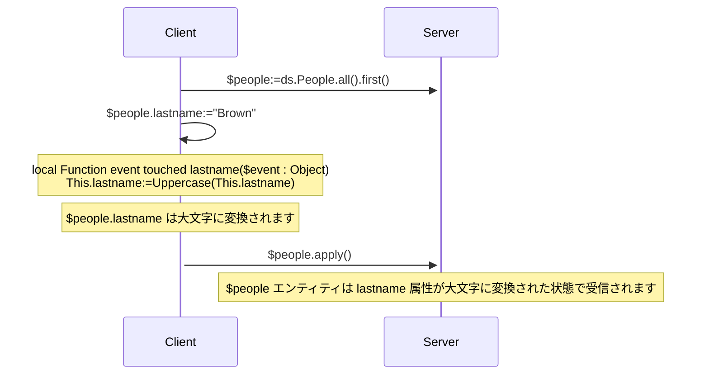
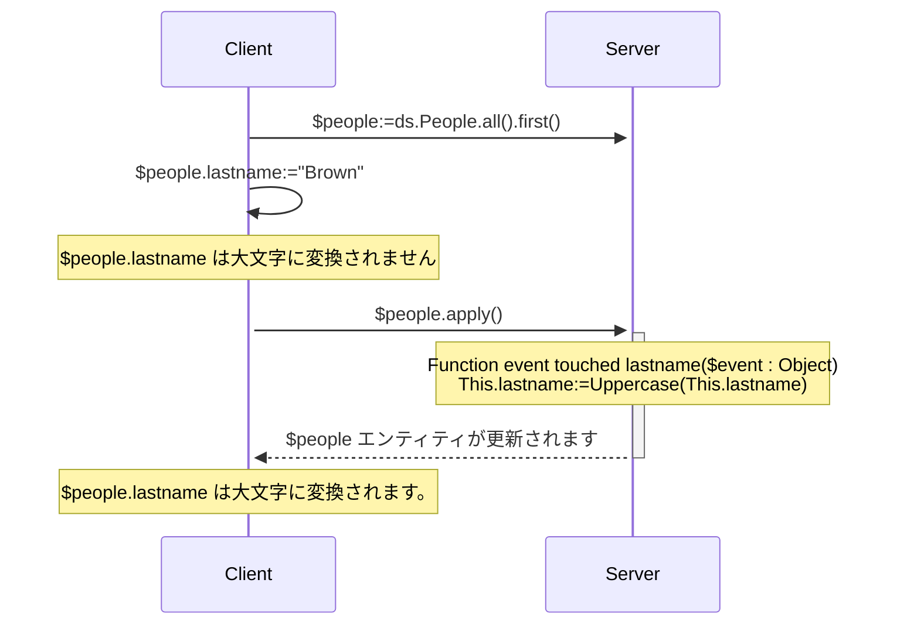
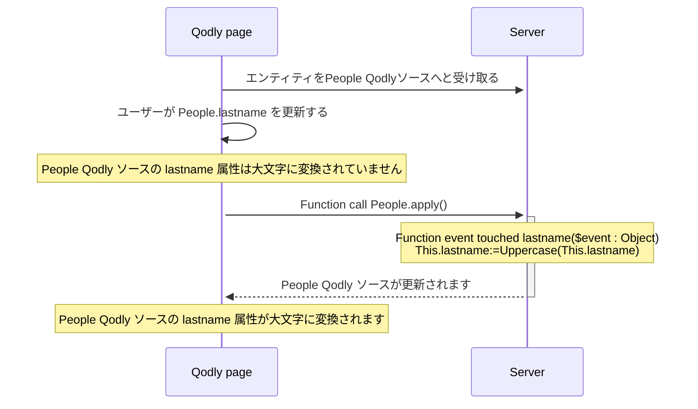

<details><summary>履歴</summary>

| リリース   | 内容                                                                                                 |
| ------ | -------------------------------------------------------------------------------------------------- |
| 21     | 追加されたイベント: validateSave / saving / afterSave / validateDrop / dropping / afterDrop |
| 20 R10 | touched イベント追加                                                                                     |

</details>

エンティティイベントとは、エンティティやエンティティ属性が操作(追加、削除、変更)されるたびに ORDA によって自動的に呼び出される関数です。 シンプルなイベントを書き、それをより洗練されたものに変えていくことができます。

イベント関数の実行は直接トリガーすることはできません。 イベントは、ユーザーアクションや、エンティティまたはその属性に対するコードを通して実行された操作に基づいて、ORDA によって自動的に呼び出されます。

:::tip 関連したblog 記事

[ORDA – Handle an event-driven logic during data persistence actions](https://blog.4d.com/orda-handle-an-event-driven-logic-during-database-operations)

:::

:::info 互換性に関する注意

データストアにおける ORDA エンティティイベントは、4D データベースにおけるトリガに相当します。 しかしながら、4D クラシックランゲージコマンドを使用して 4D データベースレベルでトリガーされたアクション、あるいは標準アクションは、ORDA イベントをトリガーしません。 また、トリガとは異なり、ORDA エンティティイベントはエンティティを保存または削除する際に、データクラスの元となるテーブル全体をロックしないことに注意して下さい。 個別のエンティティ(つまりレコード)に起因している限りは、複数のイベントが同時に実行されることが可能です。

:::

## 概要

### イベントレベル

イベント関数は必ず[Entity クラス](../ORDA/ordaClasses.md#エンティティクラス) 内で定義されます。

イベントは **エンティティ** レベルまたは **属性** レベルで設定することができます(属性には [**計算属性**](../ORDA/ordaClasses.md#計算属性) も含まれます)。 前者の場合、エンティティのあらゆる属性でイベントがトリガーされます。それ以外の場合、イベントは対象となる属性に対してのみトリガーされます。

同じイベントに対して、異なる属性に対して異なる関数を定義することができます。

また同じイベントを属性レベルとエンティティレベルの両方で定義することも可能です。 その場合、属性イベントが先に呼ばれ、その後にエンティティイベントが呼ばれます。

### リモート構成における実行

一般的に、ORDA イベントはサーバー上で実行されます。

しかしながらクライアント/サーバー構成においては、[`local`](./ordaClasses.md#local-functions) キーワードの使用によっては、`touched()` イベント関数を**サーバーまたはクライアント**で実行することが可能です。 クライアント側で特定の実装をすることにより、イベントをクライアント上でトリガーすることができるようになります。

:::note

ORDA [`constructor()`](./ordaClasses.md#class-constructor) 関数は必ずクライアント上で実行されます。

:::

他のリモート構成(例: [Qodly アプリケーション](https://developer.4d.com/qodly)、[REST API リクエスト](../REST/REST_requests.md)、あるいは[`Open datastore`](../commands/open-datastore.md) を通したリクエスト)においては、イベント関数は必ず**サーバー側**で実行されます。 これはつまりイベントをトリガーするためには、属性がタッチされたことがサーバーから"見える"ようにしておくようにしなければならいことを意味します(以下参照)。

### 概要表

以下の表は、ORDA イベントの一覧とそのルールをまとめたものです。

| イベント                                  | レベル    | 関数名                                                     |            (C/S の場合) 実行される場所            | エラーを返すことでアクションを停止できる |
| :------------------------------------ | :----- | :------------------------------------------------------ | :--------------------------------------------------------: | -------------------- |
| エンティティのインスタンス化                        | Entity | [`constructor()`](./ordaClasses.md#class-constructor-1) |                           client                           | ×                    |
| 属性がタッチされた                             | 属性     | `event touched <attrName>()`                            | [`local`](../ORDA/ordaClasses.md#local-functions) キーワードによる | ×                    |
|                                       | Entity | `event touched()`                                       | [`local`](../ORDA/ordaClasses.md#local-functions) キーワードによる | ×                    |
| エンティティを保存する前                          | 属性     | `validateSave <attrName>()`                             |                           server                           | ◯                    |
|                                       | Entity | `validateSave()`                                        |                           server                           | ◯                    |
| エンティティの保存時                            | 属性     | `saving <attrName>()`                                   |                           server                           | ◯                    |
|                                       | Entity | `saving()`                                              |                           server                           | ◯                    |
| エンティティを保存した後                          | Entity | `afterSave()`                                           |                           server                           | ×                    |
| エンティティをドロップ(削除)する前 | 属性     | `validateDrop <attrName>()`                             |                           server                           | ◯                    |
|                                       | Entity | `validateDrop()`                                        |                           server                           | ◯                    |
| エンティティのドロップ(削除)時   | 属性     | `dropping <attrName>()`                                 |                           server                           | ◯                    |
|                                       | Entity | `dropping()`                                            |                           server                           | ◯                    |
| エンティティをドロップした後                        | Entity | `afterDrop()`                                           |                           server                           | ×                    |

:::note

[`constructor()`](./ordaClasses.md#class-constructor-1) 関数は実際にはイベント関数ではありませんが、エンティティがインスタンス化される際に必ず呼び出されます。

:::

## *event* 引数

イベント関数は、単一の *event* オブジェクトを引数として受け取ります。 関数が呼び出されると、引数には複数のプロパティに値が入れられます:

| プロパティ名              | 利用可能性                                                                                         | 型          | 説明                                                                                                         |   |
| :------------------ | :-------------------------------------------------------------------------------------------- | :--------- | :--------------------------------------------------------------------------------------------------------- | - |
| "kind"              | 常に                                                                                            | 文字列        | イベント名: "touched"、"validateSave"、"saving"、"afterSave"、"validateDrop"、"dropping"、"afterDrop" |   |
| *attributeName*     | 属性レベルで実装されているイベントに対してのみ("validateSave"、"saving"、"validateDrop"、"dropping") | 文字列        | 属性名 (*例* "firstname")                                                                   |   |
| *dataClassName*     | 常に                                                                                            | 文字列        | データクラス名 (*例* "Company")                                                                 |   |
| "savedAttributes"   | [`afterSave()`](#function-event-aftersave) でのみ                                                | 文字列のコレクション | 正常に保存された属性名                                                                                                |   |
| "droppedAttributes" | [`afterDrop()`](#function-event-afterdrop) でのみ                                                | 文字列のコレクション | 正常にドロップ(削除)された属性名                                                                       |   |
| "saveStatus"        | [`afterSave()`](#function-event-aftersave) でのみ                                                | 文字列        | 保存が正常であれば "success"、それ以外の場合には "failed"                                                                     |   |
| "dropStatus"        | [`afterDrop()`](#function-event-afterdrop) でのみ                                                | 文字列        | ドロップ(削除)が正常であれば "success"、それ以外の場合には "failed"                                            |   |

## エラーオブジェクト

[一部のイベント関数](#概要表) は **エラーオブジェクト** を返すことでエラーを生成し実行中のアクションを停止することができます。

イベント中にエラーが発生した場合、他のイベントも最初にエラーが生成された時点で停止し、アクション(保存やドロップ)も停止します。 このエラーは[スタンプが変更された、エンティティがロックされていた](../API/EntityClass.md#save) などの潜在的なエラーの前に送信されます。

### エラーオブジェクトのプロパティ

| プロパティ              | 型       | 説明                                                                                                                                                                                                                                                                                                                                                                                                                               | 開発者によって設定                          |
| ------------------ | ------- | -------------------------------------------------------------------------------------------------------------------------------------------------------------------------------------------------------------------------------------------------------------------------------------------------------------------------------------------------------------------------------------------------------------------------------- | ---------------------------------- |
| errCode            | Integer | [`Last errors`](../commands/last-errors.md) コマンドと同じ                                                                                                                                                                                                                                                                                                                                                                              | ◯                                  |
| message            | Text    | [`Last errors`](../commands/last-errors.md) コマンドと同じ                                                                                                                                                                                                                                                                                                                                                                              | ◯                                  |
| extraDescription   | Object  | 自由に設定可能な情報                                                                                                                                                                                                                                                                                                                                                                                                                       | ◯                                  |
| seriousError       | Boolean | validate イベントでのみ使用されます(以下参照)。 <li>`True`: [深刻(予測不能)なエラー](../Concepts/error-handling.md#予測可能なエラーvs予測不能なエラー) を作成し、例外をトリガーします。 `dk status serious validation error` ステータスを追加します</li><li>`False`: creates only a [静か(予測可能) なエラー](../Concepts/error-handling.md#予測可能なエラーvs予測不可なエラー) のみを作成します。 `dk status validation failed` ステータスを追加します</li> | 可能(デフォルトはfalse) |
| componentSignature | Text    | 常に "DBEV"                                                                                                                                                                                                                                                                                                                                                                                                                        | ×                                  |

- [深刻なエラー](../Concepts/error-handling.md#予測可能なエラーvs予測不可なエラー) は[`save()`](../API/EntityClass.md#save) または [`drop()`](../API/EntityClass.md#drop) 関数から返される **Result オブジェクト** の `errors` コレクションプロパティにスタックされます。
- **validate** イベントによってトリガーされたエラーの場合、 `seriousError` プロパティを使用することで生成するエラーのレベルを選択することができます:
  - **true** の場合: 深刻なエラーが生成され、[try catch](../Concepts/error-handling.md#trycatchend-try)などの[エラー処理コード](../Concepts/error-handling.md#予測可能なエラーvs予測不可なエラー) によって管理される必要があります。 呼び出した関数のresult オブジェクトでは、`status` には `dk status serious validation error` が入り、 `statusText` には "Serious Validation Error" が入ります。 エラーはイベントの終わりに生成され、保存/ドロップアクションをリクエストしているクライアント(例えばREST クライアントなど)に届きます。
  - **false** (デフォルト)の場合: [静か(予測可能) なエラーが生成されます](../Concepts/error-handling.md#予測可能なエラーvs予測不可なエラー)。 これは例外はトリガーせず、また[`Last errors`](../commands/last-errors.md) コマンドから返されるエラーの中にはスタックされません。 呼び出した関数のresult オブジェクトでは、`status` には `dk status validation failed` が入り、 `statusText` には "Mild Validation Error" が入ります。
- **保存時/ドロップ時** のイベントによってトリガーされたエラーの場合、エラーオブジェクトが返されると、 `seriousError` プロパティの値に関わらず、エラーは常に深刻なエラーとして生成されます。

## イベント関数の詳細

### `Function event touched`

#### シンタックス

```4d
{local} Function event touched($event : Object)
{local} Function event touched <attributeName>($event : Object)
// コード
```

このイベントはエンティティ内の値が編集されるたびにトリガーされます。

- 関数をエンティティレベルで定義していた場合(第一シンタックス)、その関数はエンティティの任意の属性における変更に対してトリガーされます。
- 関数を属性レベルで定義していた場合(第二シンタックス)、関数はその属性に対する変更に対してのみトリガーされます。

このイベントは4D Server / 4Dエンジンが属性値の変更を検知するとすぐにトリガーされます。この変更は、以下のようなアクションによって引き起こされます:

- **[`local` キーワード](../ORDA/ordaClasses.md#local関数) を使用したクライアント/サーバー** あるいは **シングルユーザーモードの4D**:
  - ユーザーが4D フォーム上で値を設定した
  - 4D コードが `:=` 演算子によって代入を行った。 このイベントは自己代入の場合にもトリガーされます(`$entity.attribute:=$entity.attribute`)。
- **`local` キーワード を使用しないクライアント/サーバー**: `:=` 演算子によって代入を行う一部の4D コードは、[サーバー上で実行されます](../commands-legacy/execute-on-server.md)。
- **`local` キーワードを使用しないクライアント/サーバー**、**[Qodly アプリケーション](https://developer.4d.com/qodly)** および **[リモートデータストア](../commands/open-datastore.md)**: ORDA 関数(エンティティ上の関数あるいはエンティティを引数として使用する関数)を呼び出した場合にはエンティティは4D Server 受信されます。 これはつまり、リモートアプリケーション側に*refresh* あるいは *preview* 関数を実装することでORDA リクエストをサーバーに送信し、イベントをトリガーするようにする必要があるかもしれない、ということです。
- REST サーバー: 値は REST サーバーに、[REST リクエスト](../REST/$method.md#methodupdate) (`$method=update`) とともに受信されます。

関数は [*event* オブジェクト](#event-引数) を引数として受け取ります。

この関数がエラーを[throw](../commands/throw) する場合でも、進行中のアクションは停止しません。

:::note

このイベントは以下の場合にもトリガーされます:

- 属性の値が [`constructor()`](./ordaClasses.md#class-constructor-1) イベントによって代入された場合
- 属性の値が [データエクスプローラー](../Admin/dataExplorer.md) を通して編集された場合。

:::

#### 例題 1

エンティティが更新されたときに、エンティティ内のテキスト属性を全て大文字に変換したい場合を考えます。

```4d
    //ProductsEntity class
Function event touched($event : Object)
	
	If (Value type(This[$event.attributeName])=Is text)
		This[$event.attributeName]:=Uppercase(This[$event.attributeName])
	End if 
```

#### 例題 2

"touched" イベントは、[計算属性](./ordaClasses.md#計算属性)に対して[`Function query()`](./ordaClasses.md#function-query-attributename) 内でインデックスクエリコードを書くことが不可能な場合にとても有用です。

これは例えば、[`query`](./ordaClasses.md#function-query-attributename) 関数が同じエンティティの異なる属性の値どうしを比較したいような場合です。 これは返されたORDA クエリ内でフォーミュラを使う必要があり、結果としてシーケンシャルクエリをトリガーすることになります。

このような場合を完全に理解するために、以下の2つの計算属性について調べてみましょう:

```4d
Function get onGoing() : Boolean
        return ((This.departureDate<=Current date) & (This.arrivalDate>=Current date))

Function get sameDay() : Boolean
        return (This.departureDate=This.arrivalDate)
```

たとえ非常に似ていたとしても、これらのクエリは同じ型の値を比較している訳ではないため、これらの関数を同一のクエリと関連づけることはできません。 前者は属性を与えられた値と比較する一方、後者は属性どうしを比較します。

- *onGoing* 属性に対しては、[`query`](./ordaClasses.md#function-query-attributename) 関数をシンプルに書くことができ、またインデックス付きの属性を使用します:

```4d
Function query onGoing($event : Object) : Object
    var $operator : Text
    var $myQuery : Text
    var $onGoingValue : Boolean
    var $parameters : Collection
    $parameters:=New collection()

    $operator:=$event.operator
    Case of 
            : (($operator="=") | ($operator="==") | ($operator="==="))
                $onGoingValue:=Bool($event.value)
            : (($operator="!=") | ($operator="!=="))
                $onGoingValue:=Not(Bool($event.value))
            Else 
                return {query: ""; parameters: $parameters}
    End case 

    $myQuery:=($onGoingValue) ? "departureDate <= :1 AND arrivalDate >= :1" : "departureDate > :1 OR arrivalDate < :1"
        // ORDA クエリ文字列はインデックス付き属性を使用するので、インデックスがつけられます
    $parameters.push(Current date)
    return {query: $myQuery; parameters: $parameters}
```

- *sameDay* 属性に対しては、[`query`](./ordaClasses.md#function-query-attributename) 関数はフォーミュラに基づいたORDA クエリを必要とするため、検索はシーケンシャルに行われます:

```4d
Function query sameDay($event : Object) : Text
    var $operator : Text
    var $sameDayValue : Boolean

    $operator:=$event.operator
    Case of 
        : (($operator="=") | ($operator="==") | ($operator="==="))
            $sameDayValue:=Bool($event.value)
        : (($operator="!=") | ($operator="!=="))
            $sameDayValue:=Not(Bool($event.value))
        Else 
            return ""
        End case 

    return ($sameDayValue) ? "eval(This.departureDate = This.arrivalDate)" : "eval(This.departureDate != This.arrivalDate)"
        // ORDA クエリ文字列はフォーミュラを使用するため、インデックスはつけられません

```

- しかし他の属性が"タッチ"されたときに更新される**スカラー値の** *sameDay* 属性を使用することで、時間を節約することができます:

```4d
    //BookingEntity class

Function event touched departureDate($event : Object) 

    This.sameDay:=(This.departureDate = This.arrivalDate) 
//
//
Function event touched arrivalDate($event : Object) 

    This.sameDay:=(This.departureDate = This.arrivalDate)

```

#### 例題 3 (図): `local` キーワードを用いたクライアント/サーバー:



#### 例題 4 (図): `local` キーワードを用いないクライアント/サーバー



#### 例題 5 (図): Qodly アプリケーション



### `Function event validateSave`

#### シンタックス

```4d
Function event validateSave($event : Object)
Function event validateSave <attributeName>($event : Object)
// コード
```

このイベントは、エンティティが保存されようとするたびに毎回トリガーされます。

- 関数をエンティティレベルで定義していた場合(第一シンタックス)、その関数はエンティティの任意の属性に対して呼び出されます。
- 関数を属性レベルで定義していた場合(第二シンタックス)、関数はその属性に対してのみ呼び出されます。 この関数は、エンティティ内の指定した属性がタッチされていない場合には、実行**されません**。

関数は [*event* オブジェクト](#event-引数) を引数として受け取ります。

このイベントは、以下の関数によってトリガーされます:

- [`entity.save()`](../API/EntityClass.md#save)
- [`dataClass.fromCollection()`](../API/DataClassClass.md#fromcollection)

このイベントは、エンティティが実際に保存される **前に** トリガーされるため、データの一貫性をチェックし、必要であればアクションを停止することができます。 例えば、このイベントを使用して、 "出発日" < "到着日" であることをチェックすることができます。

アクションを停止するためには、関数のコードで[エラーオブジェクト](#エラーオブジェクト) を返す必要があります。

:::note

この関数内において(`This` を使用して)エンティティを更新することは推奨されません。

:::

#### 例題

この例では、マージンが50% 未満の製品を保存することは許可されていません。 無効な price 属性の場合、エラーオブジェクトを換えし、保存アクションを停止します。

```4d
// ProductsEntity class
//
// 属性レベルの validateSave イベント
Function event validateSave margin($event : Object) : Object
	
var $result : Object
	
// ユーザーは margin が50% 未満の製品を作成することはできません
If (This.margin<50)
	$result:={errCode: 1; message: "製品の検証に失敗しました"; \
	extraDescription: {info: "この製品のマージンの ("+String(This.margin)+") が 50%" 未満になっています}; seriousError: False}
End if 
return $result

```

### `Function event saving`

#### シンタックス

```4d
Function event saving($event : Object)
Function event saving <attributeName>($event : Object)
// コード
```

このイベントはエンティティが保存されるたびにトリガーされます。

- 関数をエンティティレベルで定義していた場合(第一シンタックス)、その関数はエンティティの任意の属性に対して呼び出されます。 この関数はエンティティ内でどの属性もタッチされていない場合でも実行されます(例: 保存されるたびに外部アプリへとデータを送信する場合など)。
- 関数を属性レベルで定義していた場合(第二シンタックス)、関数はその属性に対してのみ呼び出されます。 この関数は、エンティティ内の指定した属性がタッチされていない場合には、実行**されません**。

関数は [*event* オブジェクト](#event-引数) を引数として受け取ります。

このイベントは、以下の関数によってトリガーされます:

- [`entity.save()`](../API/EntityClass.md#save)
- [`dataClass.fromCollection()`](../API/DataClassClass.md#fromcollection)

このイベントはエンティティが実際に保存されている**最中に**トリガーされます。 [`validateSave()`](#function-event-validatesave) イベント関数が定義されていると場合、 `saving()` イベント関数は、 `validateSave()`がエラーを何もトリガーしなかった場合に呼び出されます。 例えば、このイベントを使用して、Google Drive アカウントにドキュメントを作成することができます。

:::note

このビジネスロジックは `validateSave()` イベントで検知できないエラーを生成する必要があります(例: ネットワークエラー)

:::

保存アクション中、4D エンジンのエラー(インデックスやスタンプが変更された、ディスク上に十分なスペースがありません、など)が生成されることがあります。

アクションを停止するためには、関数のコードで[エラーオブジェクト](#エラーオブジェクト) を返す必要があります。

#### 例題

ファイルがディスク上に保存されると、例えばディスクの要領に関連したエラーをキャッチします。

```4d
// ProductsEntity class
// 属性レベルでの保存イベント
Function event saving userManualPath($event : Object) : Object
	
var $result : Object
var $userManualFile : 4D.File
var $fileCreated : Boolean
	
If (This.userManualPath#"")
	$userManualFile:=File(This.userManualPath)
				
	// ユーザーマニュアルドキュメントファイルがディスク上に作成されます
	// これはディスク上に空き容量がない場合には失敗する可能性があります
	Try
        // ファイルのコンテンツは事前に生成され Storage.docMap に保存されています
	    $docInfo:=Storage.docMap.query("name = :1"; This.name).first()
        $userManualFile.setContent($docInfo.content)
	Catch
		// 例えばディスク上に要領が空いてない場合
		$result:={/
            errCode: 1; message: "この製品の保存アクション中にエラー発生"; /
            extraDescription: {info: "このディスク上にはユーザーマニュアルを保存するスペースがありません"}/
        }
	End try
End if 
	
return $result

```

:::note

この例ではファイルの中身は `saving` イベントの外で生成されています。時間がかなりかかる可能性があるからです。

:::

### `Function event afterSave`

#### シンタックス

```4d
Function event afterSave($event : Object)
// コード
```

このイベントは、少なくとも一つの属性が編集されていたエンティティがデータファイルに保存された直後にトリガーされます。 エンティティ内でどの属性もタッチされていない場合には、これは実行されません。

このイベントは、データを保存した後に、アプリケーション外に保存アクションを電波させたい場合や、管理タスクを実行したりするのに有用です。 例えばこれを使用して、データが保存された後に確認メールを送信することができます。 あるいは、データ保存中にエラーが発生した場合、これを使用してロールバックを行い、データの一貫性を復元することもできます。

関数は [*event* オブジェクト](#event-引数) を引数として受け取ります。

- 無限ループに陥るのを避けるため、この関数内でカレントのエンティティ上で(`This` を通して) [`save()`](../API/EntityClass.md#save) を呼び出すのは**許可されていません**。 これはエラーを発生させます。
- この関数では[エラーオブジェクト](#エラーオブジェクト) をスローすることは**サポートされていません**。

#### 例題

上記の保存イベント中にエラーが発生した場合、属性値は `afterSave` イベントでリセットされます:

```4d
// ProductsEntity class
Function event afterSave($event : Object)
	
If (($event.status.success=False) && ($event.status.errors=Null))  
    // エラーがvalidateSave イベントから来た場合には$event.status.errors に値が入れられます
		
	// userManualPath 属性は適切には保存されていません
	// その値はリセットされます
	If ($event.savedAttributes.indexOf("userManualPath")=-1)
		This.userManualPath:=""
		This.status:="KO"
	End if 
		
End if 
```

### `Function event validateDrop`

#### シンタックス

```4d
Function event validateDrop($event : Object)
Function event validateDrop <attributeName>($event : Object)
// コード
```

このイベントはエンティティがドロップ(削除)されようとするたびに毎回トリガーされます。

- 関数をエンティティレベルで定義していた場合(第一シンタックス)、その関数はエンティティの任意の属性に対して呼び出されます。
- 関数を属性レベルで定義していた場合(第二シンタックス)、関数はその属性に対してのみ呼び出されます。

関数は [*event* オブジェクト](#event-引数) を引数として受け取ります。

このイベントは以下の機能によってトリガーされます:

- [`entity.drop()`](../API/EntityClass.md#drop)
- [`entitySelection.drop()`](../API/DataClassClass.md#fromcollection)
- データベースストラクチャーレベルで定義されている可能性のある[削除制御](https://doc.4d.com/4Dv20/4D/20.2/Relation-properties.300-6750290.ja.html#107320)。

このイベントはエンティティが実際にドロップされる**前に**トリガーされるため、データの一貫性をチェックし、必要であればドロップアクションを停止することができます。

アクションを停止するためには、関数のコードで[エラーオブジェクト](#エラーオブジェクト) を返す必要があります。

#### 例題

この例では、"TO DELETE" とラベルのついていない製品をドロップすることはできません。 この場合、エラーオブジェクトを返すことで、ドロップアクションを停止することができます。

```4d
// ProductsEntity class

Function event validateDrop status($event : Object) : Object

var $result : Object

// ドロップするためには、製品は TO DELETE と記録されている必要があります
If (This.status#"TO DELETE")
    $result:={errCode: 1; message: "この製品は削除できません"; \
    extraDescription: {info: "この製品はTo Delete と記録されていなければなりません"}; seriousError: False}
End if 

return $result
```

### `Function event dropping`

#### シンタックス

```4d
Function event dropping($event : Object)
Function event dropping <attributeName>($event : Object)
// コード
```

このイベントはエンティティがドロップ(削除)されるたびにトリガーされます。

- 関数をエンティティレベルで定義していた場合(第一シンタックス)、その関数はエンティティの任意の属性に対して呼び出されます。
- 関数を属性レベルで定義していた場合(第二シンタックス)、関数はその属性に対してのみ呼び出されます。

関数は [*event* オブジェクト](#event-引数) を引数として受け取ります。

このイベントは以下の機能によってトリガーされます:

- [`entity.drop()`](../API/EntityClass.md#drop)
- [`entitySelection.drop()`](../API/DataClassClass.md#fromcollection)
- データベースストラクチャーレベルで定義されている可能性のある[削除制御](https://doc.4d.com/4Dv20/4D/20.2/Relation-properties.300-6750290.ja.html#107320)。

このイベントはエンティティが実際にドロップされている**最中に**トリガーされます。 [`validateDrop()`](#function-event-validatedrop) イベント関数が定義されている場合、 `dropping()` イベント関数は、 `validateDrop()` がエラーを何もトリガーしなかった場合に呼び出されます。

:::note

このビジネスロジックは `validateDrop()` イベントで検知できないエラーを生成する必要があります(例: ネットワークエラー)。

:::

アクションを停止するためには、関数のコードで[エラーオブジェクト](#エラーオブジェクト) を返す必要があります。

#### 例題

これはエンティティレベルでの `dropping` イベントの一例です:

```4d
// ProductsEntity class
Function event dropping($event : Object) : Object

var $result : Object
var $userManualFile : 4D.File

$userManualFile:=File(This.userManualPath)

    // 製品をドロップする場合、そのユーザーマニュアルもディスク上から削除されます
    // このアクションは失敗する可能性があります
Try
    If ($userManualFile.exists)
        $userManualFile.delete()
    End if 
Catch
    // ユーザーマニュアルのドロップに失敗した場合
    $result:={errCode: 1; message: "Drop failed"; extraDescription: {info: "The user manual can't be dropped"}}
End try

return $result
```

### `Function event afterDrop`

#### シンタックス

```4d
Function event afterDrop($event : Object)
// コード
```

このイベントはエンティティがドロップ(削除)された直後にトリガーされます。

このイベントは、データをドロップした後に、アプリケーション外にドロップアクションを伝播させたい場合や、管理タスクを実行したりするのに有用です。 例えばこれを使用して、データがドロップされたあとにキャンセルメールを送信することができます。 あるいは、データのドロップ中にエラーが発生した場合、あとで管理者がデータの一貫性をチェックできるように情報を記録することができます。

関数は [*event* オブジェクト](#event-引数) を引数として受け取ります。

- 無限ループに陥るのを避けるため、この関数内でカレントのエンティティ上で(`This` を通して) [`drop()`](../API/EntityClass.md#drop) を呼び出すのは**許可されていません**。 これはエラーを発生させます。
- この関数では[エラーオブジェクト](#エラーオブジェクト) をスローすることは**サポートされていません**。

:::note

ドロップされたエンティティは `This` を通して参照され、メモリー内に引き続き存在します。

:::

#### 例題

ドロップアクションが失敗した場合、製品は手動でチェックされる必要があります:

```4d
Function event afterDrop($event : Object)

var $status : Object

If (($event.status.success=False) && ($event.status.errors=Null)) 
        //$event.status.errors には、
        //エラーが validateDrop イベントから来た場合には値が入れられます
    This.status:="Check this product - Drop action failed"
    $status:=This.save()
End if 

```

