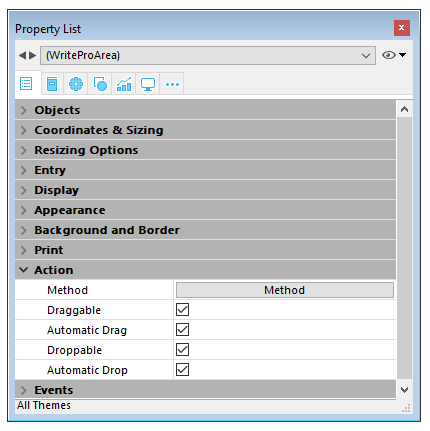
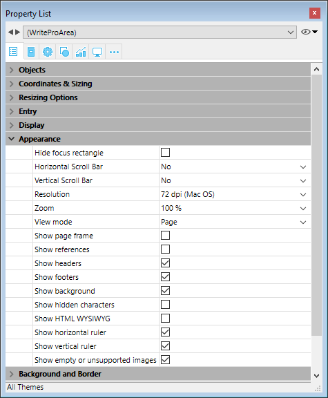

## Drag and Drop  

ご自分の4D Write Proエリアでのドラッグ＆ドロップ機能の設定をするためには、プロパティリストの"アクション"テーマ内にて適切なオプションを選択する必要があります:

4D Write Proエリアは、二つのドラッグ＆ドロップモードをサポートします:

* **カスタムモード:** "ドラッグ可"と"ドロップ可"のオプションのみチェックされています。  
このモードでは、テキストを選択し、移動させる事ができます。On Begin Drag Overイベントのオブジェクトメソッドが呼び出され、このカスタムモードを使用してドロップ時の挙動を定義する事ができます。
* **自動モード**: "ドラッグ可"、"ドロップ可"、そして"自動ドラッグ"と"自動ドロップ"のオプションがチェックされています。  
このモードでは、選択したテキストを移動または(**Alt/Option**キーを押しながら)コピーすることができます。On Begin Drag Overイベントはトリガーされません。

**注:** "自動ドラッグ"と"自動ドロップ"のオプションしか選択していなかった場合、4D Write Proエリアには何の影響もありません。

## View properties  

ドキュメントビュープロパティは、4D Write Pro エリアのプロパティリストで直接設定可能です。これを使用することで4D Write Pro エリアにおいて4D Wrie Pro ドキュメントがデフォルトでどのように表示されるかを指定することができます。これらのプロパティを使って、例えば 4D Write Pro ドキュメントを印刷されるとおりに表示するか、それともブラウザーで見たときと同じように表示するかを設定することができます。同一のフォーム上で、同じ 4D Write Pro ドキュメントの異なるビューを表示させることも可能です。

**注:** ビュー設定は[WP SET VIEW PROPERTIES](../commands/wp-set-view-properties) および [WP Get view properties](../commands/wp-get-view-properties) コマンドを使用することで動的に管理することも可能です。

ドキュメントビューの設定は、4D Write Pro フォームオブジェクトのプロパティリストにおいて、**アピアランス**テーマの項目で指定します:

* **解像度**: 4D Write Pro エリアの画面解像度を設定します。デフォルト値は **72 dpi (Mac OS)** で、これはすべてのプラットフォームにおける 4D フォームの標準解像度です。この項目を**自動**に設定すると、Mac OS と Windows 間でドキュメントのレンダリングが異なることになります。特定の dpi 値を指定すると、両プラットフォームでのレンダリングを同じになります。
* **ズーム**: 4D Write Pro エリアのコンテンツ表示に使用するズーム率を設定します。
* **ビューモード**: フォームエリア内の 4D Write Pro ドキュメントの表示モードを設定します。次の値が提供されています:  
   * **ページ**: もっとも完全といえるビューモードで、ページの枠、余白、改ページ、ヘッダー & フッターなどを含みます。詳細については *ページビュー機能* を参照ください。  
   * **下書き**: 基本のドキュメントプロパティを含む下書きモードです。  
   * **埋め込み**: 埋め込みエリアに適切なビューモードです。余白や、ヘッダー & フッター、ページフレームなどは表示されません。  
   このモードは Web に似た出力をするのに使用することもできます (この場合には、解像度を 96 dpi に設定のうえ、**HTML WYSIWYG を表示**オプションを有効にします)。  
         
   **注:** **ビューモード**プロパティは画面上のレンダリングにのみ使用されます。印刷設定については、特定のレンダリングルールが自動的に適用されます (*4D Write Pro ドキュメントの印刷* 参照)。
* **ページ枠を表示**: ページビューモードが "ページ" に設定されている場合に、ページのフレームを表示 / 非表示にします。
* **参照を表示**: ドキュメントに*参照* として挿入された 4Dフォーミュラ(または式)をすべて表示します(*フォーミュラの管理* 参照)。このオプションがチェックされていない場合、4D フォーミュラは全て*値* として表示されます。  
**注意:** フォーミュラ参照は 記号として表示することもできます(以下参照)。
* **ヘッダー / フッターを表示**: ページビューモードが "ページ" に設定されている場合に、ページのヘッダー & フッターを表示 / 非表示にします。ヘッダー & フッターについての詳細は を参照ください。
* **背景とアンカーされた要素を表示**: ページの背景画像、背景色、アンカーされた画像およびテキストボックスを表示 / 非表示にします。
* **非表示文字を表示**: 非表示の文字を表示 / 非表示にします。
* **HTML WYSIWYG を表示**: HTML WYSIWYG ビューを有効 / 無効にします。このビューでは、すべてのブラウザーに対応していない 4D Write Pro の属性が取り除かれます。
* **水平ルーラーを表示**: ルーラーを表示/非表示にします(デフォルトでは表示)。4D Write Proエリアでのルーラーについてのより詳細な情報については、*ルーラーの管理* の章を参照してください。
* **垂直** **ルーラーを表示**: ドキュメントがページモードの時の垂直ルーラーを表示 / 非表示にします。4D Write Pro エリアでのルーラーについての詳細な情報については、*ルーラーの管理* の章を参照してください。
* **空またはサポートされていない画像を表示**: 読み込めない、あるいは計算できない画像(空の画像またはサポートされていないフォーマットの画像)に対して表示する黒い四角形を表示/非表示にします。詳細な情報については*空のピクチャー* の章を参照して下さい。
* **フォーミュラのソースを記号として表示**: 4D式を参照として表示(上記参照)している場合、フォーミュラのソーステキストを 記号として表示します。フォーミュラを記号として表示することで、テンプレートのドキュメントをよりコンパクトに、より*wysiwyg* にすることができます。

****互換性に関する注記:**

* 4D v15 R5 までのバージョンで作成された 4D Write Pro ドキュメントは、これらのプロパティはデフォルト値に設定されますが、例外として解像度のみ自動に設定されます。
* 水平ルーラーは、4D v16 R2以降で作成されたデータベースについてはデフォルトで利用可能です。それ以前のバージョンから変換されたデータベースについては、このセッティングはデフォルトではチェックされていません。

## コンテキストメニュー 

4D Write Pro エリア内にて**コンテキストメニュー**プロパティがチェックされている場合(*4D Write Pro エリアを定義する*を参照して下さい)、ランタイムでフォームが実行された時に、ユーザーは包括的なコンテキストメニューを使用することができます:

 

このメニューを通して、提供されているすべての4D Write Pro 機能へとアクセスすることができます。

## ビューモードの選択 

4D Write Proドキュメントは三種のページビューモードで表示することができます:

* **下書き**: 基本的なプロパティを持つ下書きモード
* **ページ** (デフォルト): "印刷ビュー" モード
* **埋め込み**: 埋め込みエリアに最適なビューモードです。このモードでは余白、フッター、ヘッダー、カラム、ページフレーム等は表示されません。  
このモードはWeb風のビュー出力を作成するのにも使用できます (96 dpi解像度と **HTML WYSIWYG** オプションを選択した場合)。

ページビューモードはエリアポップアップメニューを使用することで設定が可能です:

**注:** ページビューモードはドキュメントには保存されません。

4Dフォームに埋め込まれたエリアについては、プロパティリストを使用してデフォルトのビューモードを設定することができます。この場合、ビューモードは 4D Write Proフォームオブジェクトのプロパティとして保存されます (より詳細な情報については、*ビュープロパティの設定* の章を参照してください)。

