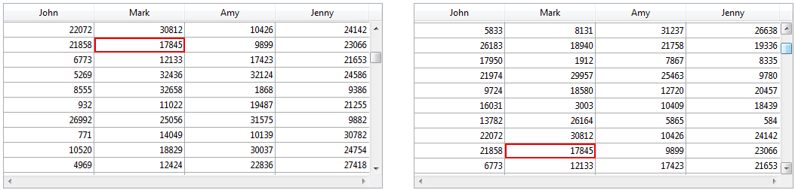

<!--REF #_command_.Form event code.Syntax-->**Form event code**  : Integer<!-- END REF-->

<!--REF #_command_.Form event code.Params-->

<div class="no-index">

| 引数  | 型       |                             | 説明         |
| --- | ------- | --------------------------- | ---------- |
| 戻り値 | Integer | &#8592; | フォームイベント番号 |

</div>
<!-- END REF-->

<div class="no-index">
<details><summary>履歴</summary>

| リリース                        | 内容                                    |
| --------------------------- | ------------------------------------- |
| 18                          | 名称変更(旧 Form event) |
| <6 | Created                               |

</details>
</div>

## 説明

**Form event code** コマンドは、現在生成中のフォームイベントタイプ を示す数値を返します。  通常フォームメソッドやオブジェクトメソッド内で **Form event code** を使用します。

4Dには*Form Events* テーマで定義された定数が用意されており、 **Form event code** コマンドから返される値と比較することができます。 イベントには、一般的なイベント(任意のタイプのオブジェクトに対して生成される)と、特定タイプのオブジェクトのみに発生するイベントがあります。

イベントの詳細については[**Form Events**](../Events/overview.md) の章を参照してください。

## 例題 1

この例題ではレコード更新日をOn Validateイベントで自動的に(フィールドへ)割り当てる例を示します:

```4d
  // フォームメソッド
 Case of
  // ...
    :(Form event code=On Validate)
       [aTable]Last Modified On:=Current date
 End case
```

## 例題 2

この例題では、ドロップダウンリスト処理 (初期化, ユーザクリック, オブジェクトのリリース) をオブジェクトメソッドにカプセル化します:

```4d
  // asBurgerSize ドロップダウンリストオブジェクトメソッド
 Case of
    :(Form event code=On Load)
       ARRAY TEXT(asBurgerSize;3)
       asBurgerSize{1}:="Small"
       asBurgerSize{1}:="Medium"
       asBurgerSize{1}:="Large"
    :(Form event code=On Clicked)
       If(asBurgerSize#0)
          ALERT("You chose a "+asBurgerSize{asBurgerSize}+" burger.")
       End if
    :(Form event code=On Unload)
       CLEAR VARIABLE(asBurgerSize)
 End case
```

## 例題 3

この例題はフォームメソッドのテンプレートです。 出力フォームとしてサマリレポートがフォームを使用する際に発生し得るイベントを示しています:

```4d
  // サマリーレポートの出力フォームとして使用されているフォームのフォームメソッド
 $vpFormTable:=Current form table
 Case of
  //...
    :(Form event code=On Header)
  // ヘッダーエリアが印刷されようとしている
       Case of
          :(Before selection($vpFormTable->))
  // 最初のブレークヘッダーのコードはここに書く
          :(Level=1)
  // レベル1のブレークヘッダーのコードはここに書く
          :(Level=2)
  // レベル2のブレークヘッダーのコードはここに書く
  //...
       End case
    :(Form event code=On Printing Detail)
  // レコードが印刷されようとしている
  // 各レコード用のコードはここに書く
    :(Form event code=On Printing Break)
  // ブレークエリアが印刷されようとしている
       Case of
          :(Level=0)
  // ブレークレベル0 用のコードはここに書く
          :(Level=1)
  // ブレークレベル1 用のコードはここに書く
  //...
       End case
    :(Form event code=On Printing Footer)
       If(End selection($vpFormTable->))
  // 最後のフッターのコードはここに書く
       Else
  // フッター用のコードはここに書く
       End if
 End case
```

## 例題 4

この例題は[DISPLAY SELECTION](../commands-legacy/display-selection.md) または [MODIFY SELECTION](../commands-legacy/modify-selection.md) で表示されるフォームで発生するイベントを処理するメソッドのテンプレートです。  説明的にするため、フォームウィンドウのタイトルバーにイベントの説明が表示されます:

```4d
  // フォームメソッド
 Case of
    :(Form event code=On Load)
       $vsTheEvent:="The form is about to be displayed"
    :(Form event code=On Unload)
       $vsTheEvent:="The output form has been exited and is about to disappear from the screen"
    :(Form event code=On Display Detail)
       $vsTheEvent:="Displaying record #"+String(Selected record number([TheTable]))
    :(Form event code=On Menu Selected)
       $vsTheEvent:="A menu item has been selected"
    :(Form event code=On Header")
       $vsTheEvent:="The header area is about to be drawn"
    :(Form event code=On Clicked")
       $vsTheEvent:="A record has been clicked"
    :(Form event code=On Double Clicked")
       $vsTheEvent:="A record has been double clicked"
    :(Form event code=On Open Detail)
       $vsTheEvent:="The record #"+String(Selected record number([TheTable]))+" is double-clicked"
    :(Form event code=On Close Detail)
       $vsTheEvent:="Going back to the output form"
    :(Form event code=On Activate)
       $vsTheEvent:="The form's window has just become the frontmost window"
    :(Form event code=On Deactivate)
       $vsTheEvent:="The form's window is no longer the frontmost window"
    :(Form event code=On Menu Selected)
       $vsTheEvent:="A menu item has been chosen"
    :(Form event code=On Outside Call)
       $vsTheEvent:="A call from another has been received"
    Else
       $vsTheEvent:="What's going on? Event #"+String(Form event)
 End case
 SET WINDOW TITLE($vsTheEvent)
```

## 例題 5

[`On Before Keystroke`](../Events/onBeforeKeystroke.md) と [`On After Keystroke`](../Events/onAfterKeystroke.md) イベントを処理する方法は [Get edited text](../commands-legacy/get-edited-text.md)、[Keystroke](../commands-legacy/keystroke.md)、そして[FILTER KEYSTROKE](../commands-legacy/filter-keystroke.md) コマンドの説明を参照してください。

## 例題 6

この例題は、スクロールエリアでクリックとダブルクリックを同様に扱う方法を示しています:

```4d
  // asChoices スクロール可能エリアのオブジェクトメソッド
 Case of
    :(Form event code=On Load)
       ARRAY TEXT(asChoices;...)
  //...
       asChoices:=0
    :((Form event code=On Clicked)|(Form event code=On Double Clicked))
       If(asChoices#0)
  // 項目がクリックされた、何かを行う
  //...
       End if
  //...
 End case
```

## 例題 7

この例題では、クリック とダブルクリックで異なるレスポンスをする方法を示します。  要素0を使用して選択された項目を追跡していることに注目してください:

```4d
  //asChoices スクロール可能エリアのオブジェクトメソッド
 Case of
    :(Form event code=On Load)
       ARRAY TEXT(asChoices;...)
  // ...
       asChoices:=0
       asChoices{0}:="0"
    :(Form event code=On Clicked)
       If(asChoices#0)
          If(asChoices#Num(asChoices))
  // 新しい項目がクリックされた、何かを行う
  //...
  // 次回のために、新しく保存された要素を保存する
             asChoices{0}:=String(asChoices)
          End if
       Else
          asChoices:=Num(asChoices{0})
       End if
    :(Form event code=On Double Clicked)
       If(asChoices#0)
  // 項目がダブルクリックされた、何か異なることを行う
       End if
  // ...
 End case
```

## 例題 8

この例題では、[`On Getting Focus`](../Events/onGettingFocus.md) と [`On Losing Focus`](../Events/onLosingFocus.md) を使用して、フォームメソッド内でステータス情報を管理します:

```4d
  // [Contacts];"Data Entry" フォームメソッド
 Case of
    :(Form event code=On Load)
       var vtStatusArea : Text
       vtStatusArea:=""
    :(Form event code=On Getting Focus)
       RESOLVE POINTER(Focus object;$vsVarName;$vlTableNum;$vlFieldNum)
       If(($vlTableNum#0)&($vlFieldNum#0))
          Case of
             :($vlFieldNum=1) // Last name フィールド
                vtStatusArea:="Enter the Last name of the Contact; it will be capitalized automatically"
  //...
             :($vlFieldNum=10) // Zip Code フィールド
                vtStatusArea:="Enter a 5-digit zip code; it will be checked and validated automatically"
  //...
          End case
       End if
    :(Form event code=On Losing Focus)
       vtStatusArea:=""
  //...
 End case
```

## 例題 9

この例題では、レコードのデータ入力に使われるフォームで、ウィンドウを閉じるイベントを処理する方法を示します:

```4d
  // 入力フォームのメソッド
 $vpFormTable:=Current form table
 Case of
  //...
    :(Form event code=On Close Box)
       If(Modified record($vpFormTable->))
          CONFIRM("レコードが変更されました。 変更を保存しますか？")
          If(OK=1)
             ACCEPT
          Else
             CANCEL
          End if
       Else
          CANCEL
       End if
  //...
 End case
```

## 例題 10

この例題では、文字フィールドが更新されるたびに、1文字目を大文字に、それ以外を小文字に変換する方法を示します:

```4d
  //[Contacts]First Name オブジェクトメソッド
 Case of
  //...
    :(Form event code=On Data Change)
       [Contacts]First Name:=Uppercase(Substring([Contacts]First Name;1;1))+Lowercase(Substring([Contacts]First Name;2))
  //...
 End case
```

## 例題 11

以下の例題では階層リストで削除アクションを管理する方法を示します:

```4d
 ... // 階層リストのメソッド
:(Form event code=On Delete Action)
 ARRAY LONGINT($itemsArray;0)
 $Ref:=Selected list items(<>HL;$itemsArray;*)
 $n:=Size of array($itemsArray)
 
 Case of
    :($n=0)
       ALERT("No item selected")
       OK:=0
    :($n=1)
       CONFIRM("Do you want to delete this item?")
    :($n>1)
       CONFIRM("Do you want to delete these items?")
 End case
 
 If(OK=1)
    For($i;1;$n)
       DELETE FROM LIST(<>HL;$itemsArray{$i};*)
    End for
 End if
```

## 例題 12

この例題では [`On Scroll`](../Events/onScroll.md) フォームイベントを使用してフォーム中の２つのピクチャーを同期します。  以下のコードを"satellite" のオブジェクトメソッド(ピクチャーフィールドまたは変数)に記述します:

```4d
 Case of
    :(Form event code=On Scroll)
  // 左のピクチャーの位置を取得する
       OBJECT GET SCROLL POSITION(*;"satellite";vPos;hPos)
  // そしてそれを右のピクチャーに適用する
       OBJECT SET SCROLL POSITION(*;"plan";vPos;hPos;*)
 End case
```

結果: https://www.youtube.com/watch?v=YIRfsW1BmHE

## 例題 13

リストボックスで選択されたセルの周りに赤い長方形を描画し、 リストボックスがユーザーによって垂直方向にスクロールされた場合には、その長方形を一緒に移動させたい場合を考えます。  その場合、リストボックスのオブジェクトメソッドに対して以下のように書きます:

```4d
 Case of
 
    :(Form event code=On Clicked)
       LISTBOX GET CELL POSITION(*;"LB1";$col;$raw)
       LISTBOX GET CELL COORDINATES(*;"LB1";$col;$raw;$x1;$y1;$x2;$y2)
       OBJECT SET VISIBLE(*;"RedRect";True) // 赤い四角形を初期化する
       OBJECT SET COORDINATES(*;"RedRect";$x1;$y1;$x2;$y2)
 
    :(Form event code=On Scroll)
       LISTBOX GET CELL POSITION(*;"LB1";$col;$raw)
       LISTBOX GET CELL COORDINATES(*;"LB1";$col;$raw;$x1;$y1;$x2;$y2)
       OBJECT GET COORDINATES(*;"LB1";$xlb1;$ylb1;$xlb2;$ylb2)
       $toAdd:=LISTBOX Get headers height(*;"LB1") // 重ならないようなヘッダーの高さ
       If($ylb1+$toAdd<$y1)&($ylb2>$y2) // リストボックスで見えないなら
  // 例題をシンプルにとどめるため、ここではヘッダーのみを管理する
  // 実際には水平方向のクリッピングに加え
  // スクロールバーも管理しなければなりません
          OBJECT SET VISIBLE(*;"RedRect";True)
          OBJECT SET COORDINATES(*;"RedRect";$x1;$y1;$x2;$y2)
       Else
          OBJECT SET VISIBLE(*;"RedRect";False)
       End if
 
 End case
```

結果として、赤い長方形はリストボックスのスクロールに沿って移動します:



## 参照

[Form Events](../Events/overview.md)
[CALL SUBFORM CONTAINER](../commands-legacy/call-subform-container.md)\
[Current form table](../commands-legacy/current-form-table.md)\
[FILTER KEYSTROKE](../commands-legacy/filter-keystroke.md)\
[FORM Event](form-event.md)\
[Get edited text](../commands-legacy/get-edited-text.md)\
[Keystroke](../commands-legacy/keystroke.md)\
[POST OUTSIDE CALL](../commands-legacy/post-outside-call.md)\
[SET TIMER](../commands-legacy/set-timer.md)

## プロパティ

|         |     |
| ------- | --- |
| コマンド番号  | 388 |
| スレッドセーフ | ×   |


