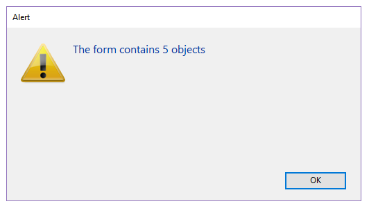

<!--REF #_command_.FORM LOAD.Syntax-->**FORM LOAD** ( {*aTable* : Table ;} *form* : Text, Object {; *formData* : Object}{; *} )<!-- END REF-->

<!--REF #_command_.FORM LOAD.Params-->

<div class="no-index">

| 引数       | 型            |                             | 説明                                                                                                                                                                      |
| -------- | ------------ | --------------------------- | ----------------------------------------------------------------------------------------------------------------------------------------------------------------------- |
| aTable   | Table        | &#8594; | ロードするテーブルフォーム(省略時はプロジェクトフォームをロード)                                                                                                                    |
| form     | Text, Object | &#8594; | (プロジェクトまたはテーブル)フォーム名(文字列)、&#xA;あるいはフォームを定義した.jsonファイルへのPOSIXパス(文字列)、&#xA;あるいは開くフォームを定義したオブジェクト |
| formData | Object       | &#8594; | フォームに関連づけるデータ                                                                                                                                                           |
| \*       | 演算子          | &#8594; | 指定時、コマンドはコンポーネントから実行した場合にホストのデータベースコマンドが適応されます(それ以外の場合は無視されます)。                                                                                      |

</div>
<!-- END REF-->

<div class="no-index">
<details><summary>履歴</summary>

| リリース  | 内容                                              |
| ----- | ----------------------------------------------- |
| 20    | 変更                                              |
| 16 R6 | 変更                                              |
| 14    | Renamed (OPEN PRINTING FORM) |
| 12    | Created                                         |

</details>
</div>

## 説明

<!--REF #_command_.FORM LOAD.Summary-->**FORM LOAD** コマンドを使用してデータ印刷・コンテンツ解析のために *form* 引数で指定したフォームをカレントプロセスにおいて *formData* 引数のデータ(オプション)とともにメモリーにロードします。 <!-- END REF-->1つのプロセスにつきカレントフォームは1つしか指定できません。

*form* 引数には、以下のいづれかを渡すことができます:

- フォーム名
- 使用するフォームの詳細を格納している有効な.josn ファイルへのパス(POSIX シンタックス)
- フォームの詳細を格納しているオブジェクト

コマンドがコンポーネントから呼び出された場合、 デフォルトではコマンドはコンポーネントのフォームをロードします。 *\** 引数を渡した場合、メソッド はホストデータベースのフォームをロードします。

### formData

オプションとして、*form* 引数のフォームに、*formData* オブジェクトを使用してパラメーターを渡すことができます。あるいは、 [フォームにユーザークラスを割り当てる](../FormEditor/properties_FormProperties.md#form-class) ことをしていた場合に4D によって自動的にインスタンス化されるフォームクラスオブジェクトを使うこともできます。  form data オブジェクト内のプロパティであればどれも[Form](form.md) コマンドを使用することでフォームコンテキストから利用可能になります。
formData オブジェクトは、[`On Load` form event](../Events/onLoad.md)フォームイベント内で利用可能です。 form data オブジェクト内のプロパティであればどれも[Form](form.md) コマンドを使用することでフォームコンテキストから利用可能になります。
formData オブジェクトは、[`On Load` form event](../Events/onLoad.md)フォームイベント内で利用可能です。

form data オブジェクトについての詳細な情報については、[`DIALOG`](dialog.md) コマンドを参照してください。

### データの印刷

このコマンドを実行するためには、[OPEN PRINTING JOB](../commands-legacy/open-printing-job.md) コマンドを使って印刷ジョブを事前に開いておく必要があります。 このコマンドを実行するためには、[OPEN PRINTING JOB](../commands-legacy/open-printing-job.md) コマンドを使って印刷ジョブを事前に開いておく必要があります。 [OPEN PRINTING JOB](../commands-legacy/open-printing-job.md) は[FORM UNLOAD](../commands-legacy/form-unload.md) を暗示的に呼び出すため、このコンテキストでは改めて **FORM LOAD** コマンドを使用する必要があります。 ロードされた *form* はカレントの印刷フォームとなります。 [Print object](../commands-legacy/print-object.md) コマンドを含む、すべてのオブジェクト管理コマンドはこのフォームに対して動作します。 ロードされた *form* はカレントの印刷フォームとなります。 [Print object](../commands-legacy/print-object.md) コマンドを含む、すべてのオブジェクト管理コマンドはこのフォームに対して動作します。

**FORM LOAD** コマンドを呼び出す前に、別の印刷フォームがロードされていた場合には、そのフォームは閉じられ、*form* に置き換えられます。 ひとつの印刷セッション内で複数のプロジェクトフォームを開いたり閉じたりすることができます。 **FORM LOAD** コマンドを呼び出す前に、別の印刷フォームがロードされていた場合には、そのフォームは閉じられ、*form* に置き換えられます。 ひとつの印刷セッション内で複数のプロジェクトフォームを開いたり閉じたりすることができます。 **FORM LOAD** で印刷フォームを変更してもページブレーク は生成されません。 ページブレークは開発者が別途指定する必要があります。 ページブレークは開発者が別途指定する必要があります。

プロジェクトフォーム (またはフォームのオブジェクトメソッド) を開く際には、 [`On Load` form event](../Events/onLoad.md) フォームイベントのみが実行されます。  他のフォームイベントは無視されます。 印刷の終わりには[`On Unload` form event](../Events/onUnload.md) フォームイベントが実行されます。 他のフォームイベントは無視されます。 印刷の終わりには[`On Unload` form event](../Events/onUnload.md) フォームイベントが実行されます。

フォームのグラフィックな一貫性を保持するために、プラットフォームにかかわらず"印刷"アピアランスプロパティを適用することをお勧めします。

[CLOSE PRINTING JOB](../commands-legacy/close-printing-job.md) コマンドが呼び出されると、カレント印刷フォームは自動で閉じられます。

### フォームコンテンツの解析

データ解析のためにスクリーン外にフォームをロードするには、 印刷ジョブ外のコンテキストで**FORM LOAD** を呼び出します。 この場合、フォームイベントは実行されません。

**FORM LOAD** を [FORM GET OBJECTS](../commands-legacy/form-get-objects.md) や[OBJECT Get type](../commands-legacy/object-get-type.md) コマンドと併用することで、フォームコンテンツを任意に処理することができます。 その後、フォームをメモリから解放するために [FORM UNLOAD](../commands-legacy/form-unload.md) コマンドを呼び出す必要があります。 その後、フォームをメモリから解放するために [FORM UNLOAD](../commands-legacy/form-unload.md) コマンドを呼び出す必要があります。

いずれの場合においても、スクリーン上のフォームはロードされたままであるため(**FORM LOAD** コマンドに影響されない)、[FORM UNLOAD](../commands-legacy/form-unload.md)コマンドを呼び出した後にこれらをリロードする必要はありません。

**注:** メモリオーバーフローのリスクを回避するため、スクリーン外でフォームを使用した場合には[FORM UNLOAD](../commands-legacy/form-unload.md) を必ずコールしてください。

## 例題 1

印刷ジョブにプロジェクトフォームを呼び出す場合:

```4d
 OPEN PRINTING JOB
 FORM LOAD("print_form")
  // execution of events and object methods
```

## 例題 2

印刷ジョブにテーブルフォームを呼び出す場合:

```4d
 OPEN PRINTING JOB
 FORM LOAD([People];"print_form")
  // execution of events and object methods
```

## 例題 3

フォームの内容を解析してテキスト入力エリアに何らかの処理をする場合:

```4d
 FORM LOAD([People];"my_form")
  // selection of form without execution of events or methods
 FORM GET OBJECTS(arrObjNames;arrObjPtrs;arrPages;*)
 For($i;1;Size of array(arrObjNames))
    If(OBJECT Get type(*;arrObjNames{$i})=Object type text input)
  //… processing
    End if
 End for
 FORM UNLOAD //do not forget to unload the form
```

## 例題 4

以下の例では、JSON ファイルで定義されたフォーム上にあるオブジェクトの数を返します:

```4d
 ARRAY TEXT(objectsArray;0) //sort form items into arrays
 ARRAY POINTER(variablesArray;0)
 ARRAY INTEGER(pagesArray;0)
 
 FORM LOAD("/RESOURCES/OutputForm.json") //load the form
 FORM GET OBJECTS(objectsArray;variablesArray;pagesArray;Form all pages+Form inherited)
 
 ALERT("The form contains "+String(size of array(objectsArray))+" objects") //return the object count
```

結果は以下のように表示されます:



## 例題 5

リストボックスを含んでいるフォームを印刷したい場合を考えます。 リストボックスを含んでいるフォームを印刷したい場合を考えます。 そして *on load* イベント中に、リストボックスのコンテンツを変更したいとします。

1\. 印刷メソッド内に、以下のように書きます:

```4d
 var $formData : Object
 var $over : Boolean
 var $full : Boolean
 
 OPEN PRINTING JOB
 $formData:=New object
 $formData.LBcollection:=New collection()
 ... //fill the collection with data
 
 FORM LOAD("GlobalForm";$formData) //store the collection in $formData
 $over:=False
 Repeat
    $full:=Print object(*;"LB") // the datasource of this "LB" listbox is Form.LBcollection
    LISTBOX GET PRINT INFORMATION(*;"LB";lk printing is over;$over)
    If(Not($over))
       PAGE BREAK
    End if
 Until($over)
 FORM UNLOAD
 CLOSE PRINTING JOB
```

2\. フォームメソッド内には以下のように書きます:

```4d
 var $o : Object
 Case of
    :(Form event code=On Load)
       For each($o;Form.LBcollection) //LBcollection is available
          $o.reference:=Uppercase($o.reference)
       End for each
 End case
```

## 参照

[Current form name](../commands-legacy/current-form-name.md)\
[FORM UNLOAD](../commands-legacy/form-unload.md)\
[LISTBOX GET OBJECTS](../commands-legacy/listbox-get-objects.md)\
[OBJECT Get type](../commands-legacy/object-get-type.md)\
[Print object](../commands-legacy/print-object.md)

## プロパティ

|         |      |
| ------- | ---- |
| コマンド番号  | 1103 |
| スレッドセーフ | ×    |


