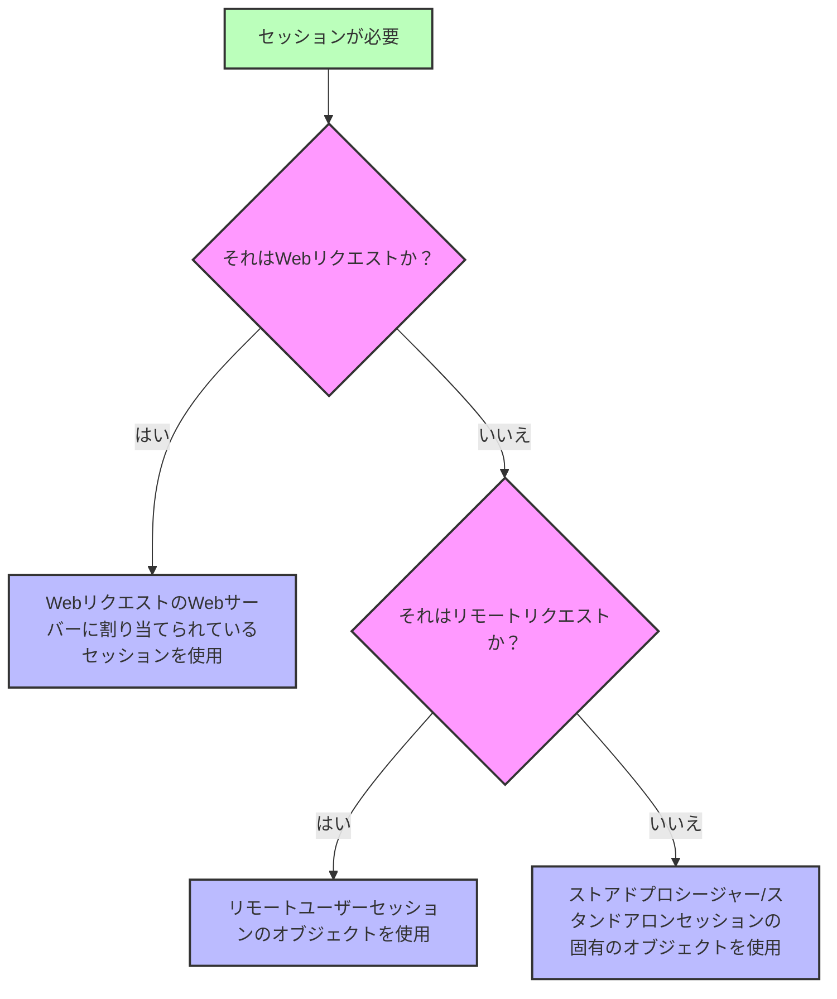

<!-- REF #_command_.Session.Syntax -->**Session** : 4D.Session<!-- END REF -->

<!--REF #_command_.Session.Params-->

| 引数  | 型                          |                             | 説明             |
| --- | -------------------------- | --------------------------- | -------------- |
| 戻り値 | 4D.Session | &#8592; | Session オブジェクト |

<!-- END REF-->

<details><summary>履歴</summary>

| リリース  | 内容                               |
| ----- | -------------------------------- |
| 20 R8 | スタンドアロンセッションのサポート                |
| 20 R5 | リモートクライアントとストアドプロシージャーセッションをサポート |
| 18 R6 | 追加                               |

</details>

## 説明

`Session` コマンドは、<!-- REF #_command_.Session.Summary -->カレントのセッションに対応する `Session` オブジェクトを返します<!-- END REF -->。

コマンドを呼び出したプロセスによって、カレントセッションは次のいずれかです:

- Web セッション([スケーラブルセッションが有効化されている](WebServer/sessions.md#webセッションの有効化) 場合)
- (サーバー上の)リモートクライアントセッション
- ストアドプロシージャーセッション
- スタンドアロンセッション

詳細については、[Session types](../API/SessionClass.md#session-types) の段落を参照ください。

このコマンドは、以下の場合には **Null** を返します:

- コマンドがWeb プロセス内で呼び出されているが、Web サーバーではスケーラブルセッションが無効化されている
- コマンドがリモート4D から呼び出されている

### Webセッション

Webセッションの `Session` オブジェクトは、どの Webプロセスからも利用できます:

- `On Web Authentication`、`On Web Connection`、および `On REST Authentication` データベースメソッド
- セミダイナミックページにおいて、4Dタグ (4DTEXT, 4DHTML, 4DEVAL, 4DSCRIPT/, 4DCODE) を介して処理されるコード
- "公開オプション: 4DタグとURL(4DACTION...)" を有効化されたうえで、4DACTION/ URL から呼び出されたプロジェクトメソッド
- モバイルリクエスト用の [`On Mobile App Authentication`](https://developer.4d.com/go-mobile/docs/4d/on-mobile-app-authentication) と [`On Mobile App Action`](https://developer.4d.com/go-mobile/docs/4d/on-mobile-app-action) データベースメソッド
- [RESTリクエストで呼び出された](../REST/ClassFunctions.md) ORDA関数。

Web ユーザーセッションに関する詳細な情報については、[Web Server Sessions](../WebServer/sessions.md) の章を参照してください。

### リモートクライアントセッション

リモートクライアントの `Session` オブジェクトは、次のいずれかから利用できます:

- [サーバー上で実行](../Project/code-overview.md#サーバー上で実行) 属性を持つプロジェクトメソッド (クライアントプロセスの "双子" プロセスで実行されます)
- トリガー
- ORDA [データモデル関数](../ORDA/ordaClasses.md) ([`local`](../ORDA/ordaClasses.md#ローカル関数) キーワードで宣言されたものを除く)
- `On Server Open Connection` および `On Server Shutdown Connection` データベースメソッド

リモートユーザーセッションの詳細については、[**リモートユーザーセッション**](../Desktop/sessions.md#リモートユーザーセッション) の段落を参照ください。

### ストアドプロシージャーセッション

すべてのストアドプロシージャープロセスは、同じ仮想ユーザーセッションを共有します。  ストアドプロシージャーの `Session` オブジェクトは、次のいずれかから利用できます:

- [`Execute on server`](../commands-legacy/execute-on-server.md) コマンドで呼び出されたメソッド
- `On Server Startup`、`On Server Shutdown`、`On Backup Startup`、`On Backup Shutdown`、および `On System event` データベースメソッド

ストアドプロシージャーバーチャルユーザーセッションの詳細については、[**ストアドプロシージャーセッション**](../Desktop/sessions.md#ストアドプロシージャーセッション) の段落を参照ください。

### スタンドアロンセッション

`Session` オブジェクトは、スタンドアロン(シングルユーザー)アプリケーション内の任意のプロセスから利用可能なため、4D 開発環境において`Session` オブジェクトを使用することで、クライアント/サーバー用のコードを書いてテストすることができます。

スタンドアロンセッションの詳細については、[**スタンドアロンセッション**](../Desktop/sessions.md#スタンドアロンセッション) の段落を参照ください。

### `Session`とコンポーネント

`Session` が[プロジェクト内に配置されている異なるコンポーネント](../Concepts/components.md) のコードから呼び出された場合には、このコマンドは呼び出しリクエストとコンテキストに応じて異なるオブジェクトを返します:

- Web リクエストの場合、`Session` は常にリクエストのターゲットWeb サーバーにアタッチされているセッションを返します(コンポーネントのWeb サーバーのセッションではありません)。
- サーバー上で実行されたリモートリクエストの場合、 `Session` は常にリモートユーザーにアタッチされたセッションを返します。
- ストアドプロシージャーセッションまたはスタンドアロンセッションの場合、`Session` は常にシングルカレントセッションを返します(同じオブジェクトが全てのワークセッションにおいて使用されます)。



## 例題

"公開オプション: 4DタグとURL(4DACTION...)" 属性を有効にした `action_Session` メソッドを定義したとします。 ブラウザーに次の URL を入力してメソッドを呼び出します:

```
IP:port/4DACTION/action_Session
```

```4d
  //action_Session メソッド
 Case of
    :(Session#Null)
       If(Session.hasPrivilege("CreateInvoices")) //hasPrivilege 関数を呼び出す
          WEB SEND TEXT("4DACTION --> Session is CreateInvoices")
       Else
          WEB SEND TEXT("4DACTION --> Session is not CreateInvoices")
       End if
    Else
       WEB SEND TEXT("4DACTION --> Session is null")
 End case
```

## 参照

[Session storage](session-storage.md)  
[Session API](../API/SessionClass.md)
[Desktop sessions](../Desktop/sessions.md)
[Web server user sessions](../WebServer/sessions.md)  
[*Scalable sessions for advanced web applications* (blog 記事)](https://blog.4d.com/scalable-sessions-for-advanced-web-applications/)

## プロパティ

|         |      |
| ------- | ---- |
| コマンド番号  | 1714 |
| スレッドセーフ | ◯    |


