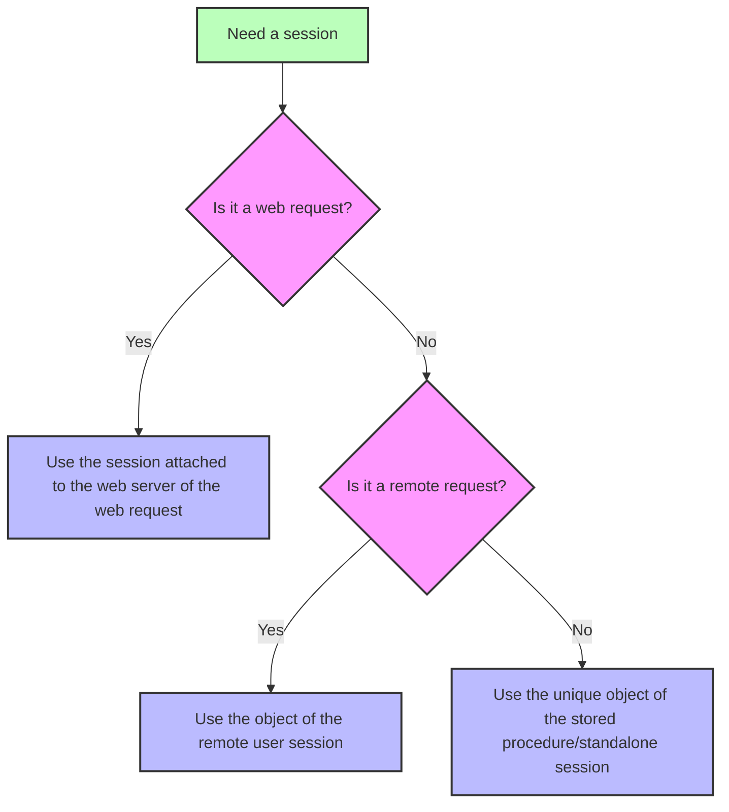

<!-- REF #_command_.Session.Syntax -->**Session** : 4D.Session<!-- END REF -->

<!--REF #_command_.Session.Params-->

| 引数  | 型                          |                             | 説明             |
| --- | -------------------------- | --------------------------- | -------------- |
| 戻り値 | 4D.Session | &#8592; | Session オブジェクト |

<!-- END REF-->

<details><summary>履歴</summary>

| リリース  | 内容                               |
| ----- | -------------------------------- |
| 20 R8 | スタンドアロンセッションのサポート                |
| 20 R5 | リモートクライアントとストアドプロシージャーセッションをサポート |
| 18 R6 | 追加                               |

</details>

## 説明

The `Session` command <!-- REF #_command_.Session.Summary -->returns the `Session` object corresponding to the current session<!-- END REF -->.

Depending on the process from which the command is called, the current session can be:

- Web セッション([スケーラブルセッションが有効化されている](WebServer/sessions.md#webセッションの有効化) 場合)
- a remote client session (on the server),
- a stored procedures session,
- a standalone session.

詳細については、[Session types](../API/SessionClass.md#session-types) の段落を参照ください。

The command returns *Null* if:

- it is called in a web process and scalable sessions are disabled on the web server,
- it is called on a remote 4D.

### Webセッション

Webセッションの `Session` オブジェクトは、どの Webプロセスからも利用できます:

- `On Web Authentication`、`On Web Connection`、および `On REST Authentication` データベースメソッド
- セミダイナミックページにおいて、4Dタグ (4DTEXT, 4DHTML, 4DEVAL, 4DSCRIPT/, 4DCODE) を介して処理されるコード
- "公開オプション: 4DタグとURL(4DACTION...)" を有効化されたうえで、4DACTION/ URL から呼び出されたプロジェクトメソッド
- モバイルリクエスト用の [`On Mobile App Authentication`](https://developer.4d.com/go-mobile/docs/4d/on-mobile-app-authentication) と [`On Mobile App Action`](https://developer.4d.com/go-mobile/docs/4d/on-mobile-app-action) データベースメソッド
- [RESTリクエストで呼び出された](../REST/ClassFunctions.md) ORDA関数。

Web ユーザーセッションに関する詳細な情報については、[Web Server Sessions](../WebServer/sessions.md) の章を参照してください。

### リモートクライアントセッション

リモートクライアントの `Session` オブジェクトは、次のいずれかから利用できます:

- [サーバー上で実行](../Project/code-overview.md#サーバー上で実行) 属性を持つプロジェクトメソッド (クライアントプロセスの "双子" プロセスで実行されます)
- トリガー
- ORDA [データモデル関数](../ORDA/ordaClasses.md) ([`local`](../ORDA/ordaClasses.md#ローカル関数) キーワードで宣言されたものを除く)
- `On Server Open Connection` および `On Server Shutdown Connection` データベースメソッド

For more information on remote user sessions, please refer to the [**Remote user sessions**](../Desktop/sessions.md#remote-user-sessions) paragraph.

### ストアドプロシージャーセッション

すべてのストアドプロシージャープロセスは、同じ仮想ユーザーセッションを共有します。  ストアドプロシージャーの `Session` オブジェクトは、次のいずれかから利用できます:

- [`Execute on server`](../commands-legacy/execute-on-server.md) コマンドで呼び出されたメソッド
- `On Server Startup`、`On Server Shutdown`、`On Backup Startup`、`On Backup Shutdown`、および `On System event` データベースメソッド

For more information on stored procedures virtual user session, please refer to the [**Stored procedure sessions**](../Desktop/sessions.md#stored-procedure-sessions) paragraph.

### スタンドアロンセッション

`Session` オブジェクトは、スタンドアロン(シングルユーザー)アプリケーション内の任意のプロセスから利用可能なため、4D 開発環境において`Session` オブジェクトを使用することで、クライアント/サーバー用のコードを書いてテストすることができます。

For more information on standalone sessions, please refer to the [**Standalone sessions**](../Desktop/sessions.md#standalone-sessions) paragraph.

### `Session` and components

When `Session` is called from the code of different [components loaded in the project](../Concepts/components.md), the command returns an object depending on the calling request and the context:

- in case of a web request, `Session` always returns the session attached to the target web server of the request (and not a session of the component's web server),
- in case of a remote request executed on the server, `Session` always returns the session attached to the remote user,
- in case of a stored procedure session or a standalone session, `Session` always returns the single current session (the same object is used during all the work session).



## 例題

"公開オプション: 4DタグとURL(4DACTION...)" ブラウザーに次の URL を入力してメソッドを呼び出します:

```
IP:port/4DACTION/action_Session
```

```4d
  //action_Session method
 Case of
    :(Session#Null)
       If(Session.hasPrivilege("CreateInvoices")) //calling the hasPrivilege function
          WEB SEND TEXT("4DACTION --> Session is CreateInvoices")
       Else
          WEB SEND TEXT("4DACTION --> Session is not CreateInvoices")
       End if
    Else
       WEB SEND TEXT("4DACTION --> Session is null")
 End case
```

## 参照

[Session storage](session-storage.md)  
[Session API](../API/SessionClass.md)
[Desktop sessions](../Desktop/sessions.md)
[Web server user sessions](../WebServer/sessions.md)  
[*Scalable sessions for advanced web applications* (blog post)](https://blog.4d.com/scalable-sessions-for-advanced-web-applications/)

## プロパティ

|         |      |
| ------- | ---- |
| コマンド番号  | 1714 |
| スレッドセーフ | ◯    |


