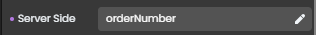

<!-- REF #_command_.Web Event.Syntax -->**Web Event** : object<!-- END REF -->

<!-- REF #_command_.Web Event.Params -->

| 引数  | 型      |                             | 説明                |
| --- | ------ | :-------------------------: | ----------------- |
| 戻り値 | Object | &#8592; | トリガーされたイベントに関する情報 |

<!-- END REF -->

## 説明

`Web Event` は、<!-- REF #_command_.Web Event.Summary -->Web ページコンポーネントにリンクされた、トリガーされたイベントに関する情報を格納したオブジェクトを返します<!-- END REF -->。

このコマンドは、4D Web サーバーによって管理されるWeb ページのコンテキスト内から呼び出さなければなりません。

**戻り値**

戻り値のオブジェクトには、以下のプロパティが格納されています:

| プロパティ     |       | 型      | 説明                                                                                                                                                                                                                                                |
| --------- | ----- | ------ | ------------------------------------------------------------------------------------------------------------------------------------------------------------------------------------------------------------------------------------------------- |
| caller    |       | string | イベントをトリガーしたコンポーネントの[サーバー側参照](https://developer.4d.com/qodly/4DQodlyPro/pageLoaders/pageLoaderOverview#data-access-category)                                                                                                                       |
| eventType |       | string | イベントの種類:<li>onblur</li><li>onfocus</li><li>onclick</li><li>onauxclick</li><li>onmouseenter</li><li>onmouseleave</li><li>onkeyup</li><li>onkeydown</li><li>onchange</li><li>unload</li><li>onload - `Page` がロードされたときにトリガーされます</li> |
| data      |       | object | 関連するコンポーネントに応じた追加の情報                                                                                                                                                                                                                              |
|           | index | number | <li>タブコンポーネント: タブのインデックス(インデックスは 0 から始まります)</li><li>データテーブルコンポーネント: カラムの番号</li>                                                                                                                                                                   |
|           | row   | number | データテーブルコンポーネント: 行番号                                                                                                                                                                                                               |
|           | name  | string | データテーブルコンポーネント: カラムの qodlyソース名(例: "firstname"、 "address.city")                                                                                                                 |

#### 例題

ここでの目的は、ユーザーがコンポーネント上をホバーした際にヘルプテキストを表示/非表示することです:


これは、("これはヘルプテキストです"というテキストを表示する)**Text** コンポーネントに保存された情報を表示する **Text input** コンポーネントに `onmouseenter` および `onmouseleave` イベントを割り当てることで可能になります。


このシナリオでは以下のような前提があります:

- Text input コンポーネントは、 `orderNumber` というサーバー側参照を持ちます。
  
- Text コンポーネントは `helpOn_orderNumber` というサーバー側参照を持ちます。
  
- `onmouseenter` および `onmouseleave` イベントの両方には[公開された](../ORDA/ordaClasses.md#exposed-vs-non-exposed-functions) `help()` 関数が割り当てられており、そこには以下のようなコードが書かれています:

```4d
shared singleton Class constructor()
exposed Function help()
	
	var event : Object
	var myForm : 4D.WebForm
	var componentRef : Text
	
	myForm:=web Form
	event:=web Event
	componentRef:=event.caller

	Case of 
		: (event.eventType="onmouseenter")  // onmouseenter イベント
			myForm["helpOn_"+componentRef].show()  // "helpOn_orderNumber" という参照のText コンポーネントを
			// 表示することで "orderNumber" にヘルプを表示する
		: (event.eventType="onmouseleave")  // onmouseleave イベント
			myForm["helpOn_"+componentRef].hide()  // orderNumber のヘルプを非表示にする
			
	End case 

```

このヘルプが表示されていない状態でWeb ページを開くためには、この関数をWeb ページの `onload` イベントに割り当てます:

```4d
exposed function hideOnLoad()
	webForm.helpOn_orderNumber.hide()

```

## 参照

[Web Form](web-form.md)</br>
[WebForm class](../API/WebFormClass.md)</br>
[WebFormItem class](../API/WebFormItemClass.md)

## プロパティ

|         |                             |
| ------- | --------------------------- |
| コマンド番号  | 1734                        |
| スレッドセーフ | no |

