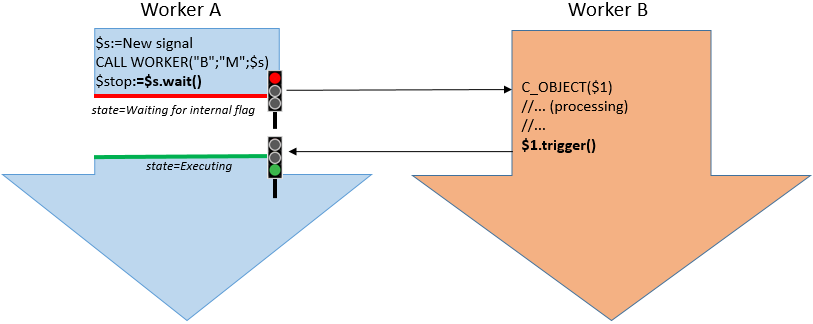

Sinais são ferramentas fornecidas pela linguagem 4D para gerenciar interações e evitar conflitos entre processos em uma aplicação multiprocesso. Sinais permitem assegurar que um ou mais processos vão esperar por uma tarefa específica a ser completada antes de continuar a execução. Qualquer processo pode esperar ou liberar um sinal.

> Os semáforos podem ser usados para gerenciar interações. Semaphores allow you to make sure that two or more processes do not modify the same resource (file, record...) ao mesmo tempo. Só o processo que estabelece o semáforo pode removê-lo.

### Objeto sinal

Um sinal é um objeto partilhado que deve ser passado como parâmetro a comandos que chamam ou criam trabalhadores ou processo.

Um objeto `4D.Signal` contém os seguintes métodos e propriedades integrados:

- [`.wait()`](#wait)
- [`.trigger()`](#trigger)
- [`.signaled`](#signaled)
- [`.description`](#description).

Any worker/process calling the `.wait()` method will suspend its execution until the `.signaled` property is true. Enquanto espera um sinal, o processo que chamar não usa nenhuma CPU. Isso pode ser muito interessante para o rendimento nas aplicações multiprocesso. The `.signaled` property becomes true when any worker/process calls the `.trigger()` method.

Note that to avoid blocking situations, the `.wait()` can also return after a defined timeout has been reached.

Os objetos Signal são criados com o comando [`New signal`](../commands/new-signal.md).

### Trabalhar com sinais

Em 4D, você cria um objeto signal chamando o comando [`New signal`](../commands/new-signal.md). Once created, this signal must be passed as a parameter to the `New process` or `CALL WORKER` commands so that they can modify it when they have finished the task you want to wait for.

- `signal.wait()` must be called from the worker/process that needs another worker/process to finish a task in order to continue.
- `signal.trigger()` must be called from the worker/process that finished its execution in order to release all others.



Once a signal has been released using a `signal.trigger()` call, it cannot be reused again. If you want to set another signal, you need to call the `New signal` command again.

Since a signal object is a [shared object](Concepts/shared.md), you can use it to return results from called workers/processes, provided that you do not forget to write values within a `Use...End use` structure (see example).

### Exemplo

```4d
 var $signal : 4D.Signal

// Criação de um sinal
 $signal:=New signal

// chamar o processo principal e executar o método OpenForm
 CALL WORKER(1;"OpenForm";$signal)
// fazer outro cálculo
...
// Esperando pelo fim do processo
 $signaled:=$signal.wait()

// Processamento dos resultados
 $calc:=$signal.result+...
```

Método ***OpenForm*** :

```4d
 #DECLARE ($signal : 4D.Signal)  
 var $form : Object
 $form:=New object("value";0)

  // Abrir o formulário
 $win:=Open form window("Information";Movable form dialog box)
 DIALOG("Information";$form)
 CLOSE WINDOW($win)

  // Adicione um novo atributo ao seu objeto compartilhado $signal para passar seu resultado ao outro processo:
 Use($signal)
    $signal.result:=$form.value
 End use

  // Disparar o sinal para o processo de espera
 $signal.trigger()
```

### Resumo

|                                                                                                                        |
| ---------------------------------------------------------------------------------------------------------------------- |
| [<!-- INCLUDE #SignalClass.description.Syntax -->](#description)<br/><!-- INCLUDE #SignalClass.description.Summary --> |
| [<!-- INCLUDE #SignalClass.signaled.Syntax -->](#signaled)<br/><!-- INCLUDE #SignalClass.signaled.Summary -->          |
| [<!-- INCLUDE #SignalClass.trigger().Syntax -->](#trigger)<br/><!-- INCLUDE #SignalClass.trigger().Summary -->         |
| [<!-- INCLUDE #SignalClass.wait().Syntax -->](#wait)<br/><!-- INCLUDE #SignalClass.wait().Summary -->                  |

<!-- REF SignalClass.description.Desc -->

## .description

<details><summary>História</summary>

| Release | Mudanças   |
| ------- | ---------- |
| 17 R4   | Adicionado |

</details>

<!-- REF #SignalClass.description.Syntax -->**.description** : Text<!-- END REF -->

#### Descrição

A propriedade <!-- REF #SignalClass.description.Summary -->contém uma descrição personalizada para o objeto `Signal`<!-- END REF -->.

`.description` pode ser definida ao criar o objeto signal ou a qualquer momento. Note that since the `Signal` object is a shared object, any write-mode access to the `.description` property must be surrounded by a `Use...End use` structure.

Essa propriedade é **leitura-escrita**.

<!-- END REF -->

<!-- REF SignalClass.signaled.Desc -->

## .signaled

<details><summary>História</summary>

| Release | Mudanças   |
| ------- | ---------- |
| 17 R4   | Adicionado |

</details>

<!-- REF #SignalClass.signaled.Syntax -->**.signaled** : Boolean<!-- END REF -->

#### Descrição

A propriedade `.signaled` <!-- REF #SignalClass.signaled.Summary -->contém o estado atual do objeto `Signal`<!-- END REF -->. Quando o sinal é criado, `.signaled` é **False**. Torna-se **True** quando o `.trigger( )` é chamado no objeto.

Essa propriedade é **somente leitura**.

<!-- END REF -->

<!-- REF SignalClass.trigger().Desc -->

## .trigger()

<details><summary>História</summary>

| Release | Mudanças   |
| ------- | ---------- |
| 17 R4   | Adicionado |

</details>

<!-- REF #SignalClass.trigger().Syntax -->**.trigger( )**<!-- END REF -->

<!-- REF #SignalClass.trigger().Params -->

| Parâmetro | Tipo |     | Descrição                  |
| --------- | ---- | :-: | -------------------------- |
|           |      |     | Não exige nenhum parâmetro |

<!-- END REF -->

#### Descrição

A função `.trigger( )` <!-- REF #SignalClass.trigger().Summary -->define a propriedade `signaled` do objeto de sinal como **true**<!-- END REF --> e desperta todos os workers ou processos esperando por este sinal.

Se o sinal já estiver no estado de sinalização (ou seja, a propriedade `signaled` já for **true**), a função não faz nada.

<!-- END REF -->

<!-- REF SignalClass.wait().Desc -->

## .wait()

<details><summary>História</summary>

| Release | Mudanças   |
| ------- | ---------- |
| 17 R4   | Adicionado |

</details>

<!-- REF #SignalClass.wait().Syntax -->**.wait**( { *timeout* : Real } ) : Boolean <!-- END REF -->

<!-- REF #SignalClass.wait().Params -->

| Parâmetro  | Tipo       |                             | Descrição                         |
| ---------- | ---------- | --------------------------- | --------------------------------- |
| timeout    | Real       | ->                          | Maximum wait time in seconds      |
| Resultados | Parâmetros | <- | Estado da propriedade `.signaled` |

<!-- END REF -->

#### Descrição

A função `.wait( )` <!-- REF #SignalClass.wait().Summary -->faz com que o processo atual aguarde até que a propriedade `.signaled` do objeto signal se torne **true** ou o *timeout* opcional expire<!-- END REF -->.

To prevent blocking code, you can pass a maximum waiting time in seconds in the *timeout* parameter. Decimals are accepted.

If the signal is already in the signaled state (i.e. the `.signaled` property is already **true**), the function returns immediately, without waiting.

The function returns the value of the .signaled property:

- **true** if the signal was triggered (`.trigger()` was called).
- **false** if the timeout expired before the signal was triggered.

:::note Aviso

Calling `.wait()` without a *timeout* in the main process is not recommended, as it could freeze the entire 4D application.

:::

> O estado de um processo que espera um signal é `Waiting for internal flag`.

<!-- END REF -->
