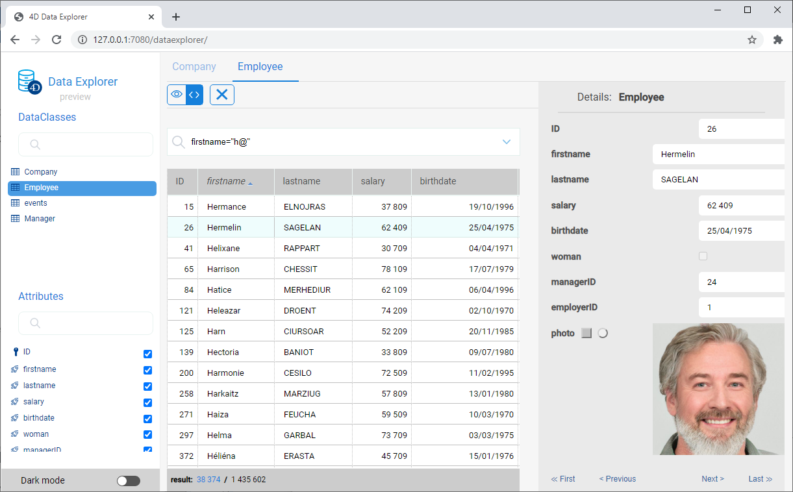
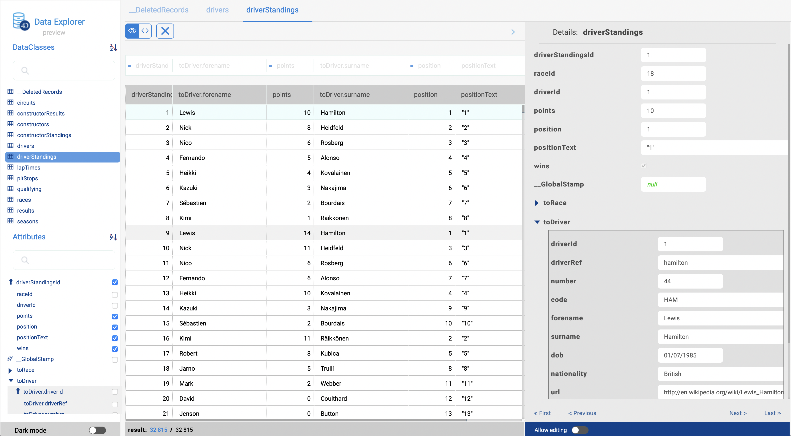
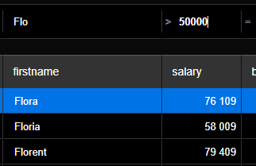

> **Preview**: O Web Data Explorer está sendo oferecido como uma funcionalidade em modo preview. Using this feature in production is not recommended. The final implementation could be slightly different.

O Data Explorer oferece uma interface web para ver e pesquisar dados em sua datastore de projeto. Ao usar esta ferramente, pode navegar facilmente entre todas suas entidades e pesquisar, ordenar ou filtrar valores de atributos. It helps you to control data and quickly identify issues at any step of the development process.



## Configuração

O Data Explorer depende do componente web server [`WebAdmin`](webAdmin.md) para a configuração e preferências de autentificação.

- **configuration**: a configuração de Data Explorer reutiliza as configurações [`WebAdmin` de web server](webAdmin.md#webadmin-settings),
- **authentication**: acesso ao Data Explorer é oferecido quando  [a sessão de usuário for autenticada](webAdmin.md#authentication-and-session) e tem o privilégio "WebAdmin". Quando o Data Explorer for acessado através do item de menu**Data Explorer** (ver abaixo), uma autenticação automática é oferecida.

> O acesso ao Data Explorer pode ser desativado usando a função [`.setAdminProtection()`](API/DataStoreClass.md#setadminprotection).

## Abrindo o Data Explorer

A página do Data Explorer está disponível automaticamente quando o web server [the `WebAdmin` for iniciado](webAdmin.md#starting-the-webadmin-web-server).

Para se conectar à página web do Data Explorer:

- Se usar a aplicação 4D com interface, selecione o comando **Data Explorer...** :
  - no menu **Records**  (em 4D monousuário)
  - no menu **Window**  (em 4D Server)

- mesmo se usar uma aplicação 4D headless, pode abrir seu navegador web e digitar o endereço abaixo:

 `IPaddress:HTTPPort/dataexplorer` or `IPaddress:HTTPSPort/dataexplorer`

 Neste contexto será pedido que digite a [chave de acesso](webAdmin.md#access-key) para abrir uma sessão `WebAdmin` no servidor:


> [HTTPPort](webAdmin.md#http-port) and [HTTPSPort](webAdmin.md#https-port) values are configured in the `WebAdmin` settings.

## Using the Data Explorer

In addition to a comprehensive and customizable view of your data, the Data Explorer allows you to query and order your data.

### Requisitos

The Data Explorer supports the following web browsers:

- Chrome
- Safari
- Edge
- FireFox

The minimum resolution to use the Data Explorer is 1280x720. Recommended resolution is 1920x1080.

### Básicos

The Data Explorer provides an overall access to the ORDA data model with respect to the [ORDA mapping rules](ORDA/dsMapping.md#general-rules).

You can switch to the **dark mode** display theme using the selector at the bottom of the page:


The page contains several areas:

- On the left side are the **Dataclasses area** and **Attributes area**, allowing you can select the dataclasses and attributes to display. Attributes are ordered according to the underlying structure creation order. Primary key and indexed attributes have a specific icon. You can filter the list of proposed dataclass names and attribute names using the respective search areas. 

- The central part contains the **Search area** and the **Data grid** (list of entities of the selected dataclass). Each column of the grid represents a datastore attribute.
  - By default, all entities are displayed. You can filter the displayed entities using the search area. Two query modes are available: [Query on attributes](#query-on-attributes) (selected by default), and the [Advanced query with expression](#advanced-query-with-expression). You select the query mode by clicking on the corresponding button (the **X** button allows you to reset the query area and thus stop filtering): 
  - The name of the selected dataclass is added as a tab above the data grid. Using these tabs, you can switch between dataclasses that have been already selected. You can remove a referenced dataclass by clicking the "remove" icon at the right of the dataclass name.
  - You can reduce the number of columns by unchecking attributes in the left side. You can also switch the columns in the data grid using drag and drop. You can click on a column header to [sort entities](#ordering-entities) according to its values (when possible).
  - If an operation requires a long time, a progress bar is displayed. You can stop the running operation at any moment by clicking on the red button:<br/> 

- On the right side is the **Details area**: it displays the attribute values of the currently selected entity as well as **related data**, if any. You can browse between the entities of the dataclass by clicking the **First** / **Previous** / **Next** / **Last** links at the bottom of the area.
  - All attribute types are displayed, including pictures, objects (expressed in json) as well as [computed](../ORDA/ordaClasses.md#computed-attributes-1) and [alias](../ORDA/ordaClasses.md#alias-attributes-1) attributes.
  - Related data (many-to-one and one-to-many relations) can be displayed through expandable/collapsable areas:<br/> 
  - **Ctrl+Click** (Windows) or **Command+Click** (macOS) on a related attribute name in the right side area displays the values of the attribute in an independant, floating area:<br/> 

### Updating contents

When the ORDA model or data is modified on the database side (table added, record edited or deleted, etc.), you just need to refresh the Data Explorer page in the browser (using the F5 key, for example).

### Ordering entities

You can reorder the displayed entity list according to attribute values. All types of attributes can be used for a sort, except picture and object.

- Click on a column header to order entities according to the corresponding attribute values. By default, the sort is ascending. Click twice for a descending sort. A column used to sort entities is displayed with a small icon and its name is in *italics*.


- You can sort attributes on several levels. For example, you can sort employees by city and then by salary. To do that, hold down the **Shift** key and click sequentially on each column header to include in the sort order.

### Query on attributes

In this mode, you can filter entities by entering values to find (or to exclude) in the areas above the attribute list. You can filter on one or several attributes. The entity list is automatically updated when you type in.


If you enter several attributes, a AND is automatically applied. For example, the following filter displays entities with *firstname* attribute starting with "flo" AND *salary* attribute value > 50000:



The **X** button allows you to remove entered attributes and thus stop filtering.

Different operators and query options are available, depending on the data type of the attribute.

> You cannot filter on picture or object attributes.

#### Numeric operators

With numeric, date, and time attributes, the "=" operator is selected by default. However, you can select another operator from the operator list (click on the "=" icon to display the list):


#### Datas

With date attributes, you can enter the date to use through a datepicker widget (click on the date area to display the calendar):


#### Booleans

When you click on a boolean attribute area, you can filter on **true**/**false** values but also on **null**/**not null** values:


- **null** indicates that the attribute value was not defined
- **not null** indicates that the attribute value is defined (thus true or false).

#### Text

Text filters are not diacritic (a = A).

The filter is of the "starts with" type. For example, entering "Jim" will show "Jim" and "Jimmy" values.

You can also use the wildcard character (@) to replace one or more starting characters. Por exemplo:

| A filter with | Resultados                                         |
| ------------- | -------------------------------------------------- |
| Bel           | All values beginning with “Bel”                    |
| @do           | All values containing “do”                         |
| Bel@do        | All values starting with “Bel” and containing “do” |

If you want to create more specific queries, such as "is exactly", you may need to use the advanced queries feature.

### Advanced queries with expression

When you select this option, a query area is displayed above the entity list, allowing you to enter any expression to use to filter the contents:


You can enter advanced queries that are not available as attribute queries. For example, if you want to find entities with *firstname* attribute containing "Jim" but not "Jimmy", you can write:

```
firstname=="Jim"
```

You can use any ORDA query expression as [documented with the `query()` function](API/DataClassClass.md#query), with the following limitations or differences:

- For security, you cannot execute formulas using `eval()`.
- Placeholders cannot be used; you have to write a *queryString* with values.
- String values containing space characters must be embedded in double quotes ("").

For example, with the Employee dataclass, you can write:

```
firstname = "Marie Sophie" AND manager.lastname = "@th"
```

You can click on the `v` icon to display both [`queryPlan`](API/DataClassClass.md#queryplan) and [`queryPath`](API/DataClassClass.md#querypath). In the area, you can hover over the subquery blocks to have detailed information per subquery:


Right-click in the query area to display the previous valid queries:


