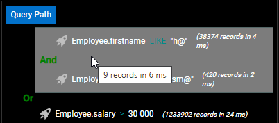

The Data Explorer provides a web interface to view, query, and edit data in your project datastore. Ao usar esta ferramente, pode navegar facilmente entre todas suas entidades e pesquisar, ordenar ou filtrar valores de atributos. It helps you quickly identifying issues at any step of the development process, as well as controlling and editing data.


## Configuração

O Data Explorer depende do componente web server [`WebAdmin`](webAdmin.md) para a configuração e preferências de autentificação.

- **configuration**: a configuração de Data Explorer reutiliza as configurações [`WebAdmin` de web server](webAdmin.md#webadmin-settings),
- **authentication**: acesso ao Data Explorer é oferecido quando  [a sessão de usuário for autenticada](webAdmin.md#authentication-and-session) e tem o privilégio "WebAdmin". Quando o Data Explorer for acessado através do item de menu**Data Explorer** (ver abaixo), uma autenticação automática é oferecida.

> O acesso ao Data Explorer pode ser desativado usando a função [`.setAdminProtection()`](API/DataStoreClass.md#setadminprotection).

## Abrindo o Data Explorer

A página do Data Explorer está disponível automaticamente quando o web server [the `WebAdmin` for iniciado](webAdmin.md#starting-the-webadmin-web-server).

Para ligar à página Web do Explorador de dados:

- A partir de uma aplicação 4D (com interface):
  - Se usar a aplicação 4D com interface, selecione o comando **Data Explorer...** :
  - Para abrir o Explorador de dados num separador de browser externo, seleccione **Explorador de dados no browser** no menu **Registos** ou prima a tecla **Alt** (Windows)/**Option** (macOS) e clique no botão **Dados** na barra de ferramentas principal.
- no menu **Window**  (em 4D Server)

- mesmo se usar uma aplicação 4D headless, pode abrir seu navegador web e digitar o endereço abaixo:

 `IPaddress:HTTPPort/dataexplorer` or `IPaddress:HTTPSPort/dataexplorer`

 Neste contexto será pedido que digite a [chave de acesso](webAdmin.md#access-key) para abrir uma sessão `WebAdmin` no servidor:


> [Os valores HTTPPort](webAdmin.md#http-port) e [HTTPSPort](webAdmin.md#https-port) são configurados nas definições `WebAdmin` .


## Requisitos

O Data Explorer suporta os seguintes navegadores web:

- Chrome
- Safari
- Edge
- FireFox

A resolução mínima para utilizar o Data Explorer é de 1280x720. A resolução recomendada é 1920x1080.


## Browsing Data

Para além de uma visão abrangente e personalizável dos seus dados, o Explorador de Dados permite-lhe consultar e ordenar os seus dados.


### Basics

O Data Explorer proporciona um acesso global ao modelo de dados ORDA em relação às regras de mapeamento ORDA [](ORDA/dsMapping.md#general-rules).

:::info

Quando o modelo ou dados ORDA é modificado no lado da base de dados (tabela adicionada, registo editado ou apagado, etc.), basta atualizar a página do Data Explorer no browser (usando a tecla F5, por exemplo).

:::

Pode mudar para o modo escuro **** mostrar o tema usando o selector no fundo da página:


A página contém várias áreas:

- Do lado esquerdo encontra-se a área **Dataclasses** e **Attributes area**, permitindo-lhe seleccionar os dataclasses e atributos a exibir. Os atributos são ordenados de acordo com a ordem de criação da estrutura subjacente. A chave primária e os atributos indexados têm um ícone específico. É possível filtrar a lista de nomes de dataclass propostos e nomes de atributos utilizando as respectivas áreas de pesquisa. 

- A parte central contém a área de pesquisa **** e a grade de dados **** (lista de entidades da classe de dados seleccionada). Cada coluna da grade representa um atributo de datastore.
  - Como padrão, todas as entidades são exibidas. É possível filtrar as entidades apresentadas utilizando a área de pesquisa. Estão disponíveis dois modos de consulta: [Consulta sobre atributos](#query-on-attributes) (seleccionado por defeito), e a consulta avançada [com expressão](#advanced-query-with-expression). Selecciona o modo de consulta clicando no botão correspondente (o botão **X** permite reiniciar a área de consulta e assim parar a filtragem): 
  - O nome da classe de dados seleccionada é adicionado como um separador por cima da grelha de dados. Utilizando estas abas, é possível alternar entre os valores já selecionados. Pode remover um dataclass referenciado clicando no ícone "remover" à direita do nome do dataclass.
  - É possível reduzir o número de colunas desmarcando os atributos do lado esquerdo. Também pode mudar as colunas da grade de dados utilizando arrastar e soltar. Pode clicar no cabeçalho de uma coluna  para [ordenar entidades](#ordering-entities) de acordo com seus valores (quando for possível).
  - Se uma operação exigir muito tempo, é mostrada uma barra de progresso. Pode deter a operação executando a qualquer momento clicando no botão vermelho:<br/> 

- On the right side is the **Details area**: it displays the attribute values of the currently selected entity. Pode navegar entre as entidades da dataclass cliando nos links **First** / **Previous** / **Next** / **Last** na parte inferior da área.
  - All attribute types are displayed, including pictures and objects (expressed in json).
  - Os dados relacionados (relações um a um e um a muitos) podem ser mostradas através de áreas expandíveis/colapsáveis:<br/> 
  - no menu **Records**  (em 4D monousuário)<br/> 


### Ordenar entidades

É possível reordenar a lista de entidades apresentada de acordo com os valores dos atributos. Todos os tipos de atributos podem ser utilizados para uma espécie, exceto imagem e objeto.

- Clique no cabeçalho de uma coluna para encomendar entidades de acordo com os valores dos atributos correspondentes. Como padrão, a ordem é ascendente. Clicar duas vezes para uma ordem decrescente. Uma coluna utilizada para classificar entidades é exibida com um pequeno ícone e o seu nome está em *itálico*.


- É possível ordenar atributos em vários níveis. Por exemplo, é possível classificar os empregados por cidade e depois por salário. Para fazer isso, mantenha apertada a tecla **Shift** e clique sequencialmente no cabeçalho de cada coluna para incluir na ordem.

### Consulta sobre atributos

Neste modo, é possível filtrar entidades introduzindo valores a encontrar (ou a excluir) nas áreas acima da lista de atributos. Pode filtrar um ou vários atributos. A lista de entidades é automaticamente atualizada quando se digita.


Se introduzir vários atributos, é automaticamente aplicado um AND. Por exemplo, o filtro a seguir exibe entidades com *primeiro nome* atributo começando com "flo" e *salário* valor do atributo > 50000:


O botão **X** permite remover os atributos introduzidos e assim parar a filtragem.

Estão disponíveis diferentes operadores e opções de consulta, dependendo do tipo de dados do atributo.

> Não é possível filtrar em imagens ou atributos de objectos.

#### Operadores de números

Com atributos numéricos, de data e hora, o operador "=" é seleccionado por defeito. Contudo, pode selecionar outro operador da lista de operadores (clicar no ícone "=" para exibir a lista):


#### Datas

Com atributos de data, pode introduzir a data a utilizar através de um widget de escolha de data (clique na área de data para exibir o calendário):


#### Booleanos

Ao clicar numa área de atributos booleanos, pode filtrar em **valores verdadeiros**/**valores falsos** ou também em **null**/**e não null**:


- **nulo** indica que o valor do atributo não foi definido
- **não nulo** indica que o valor do atributo está definido (portanto verdadeiro ou falso).

#### Text

Os filtros de texto não são diacríticos (a = A).

O filtro é do tipo "começa com". Por exemplo, a entrada "Jim" mostrará os valores "Jim" e "Jimmy".

Também pode usar o caractere coringa (@) para substituir um ou mais caracteres iniciais. Por exemplo:

| Um filtro com | Resultados                                                |
| ------------- | --------------------------------------------------------- |
| Bel           | Todos os valores que começam com "Bel                     |
| @do           | Todos os valores contendo "do"                            |
| Bel@do        | Todos os valores que começam com "Bel" e que contêm "do". |

Se quiser criar consultas mais específicas, tais como "é exatamente", poderá ter de utilizar a funcionalidade de consultas avançadas.

### Consultas avançadas com expressão

Ao seleccionar esta opção, é exibida uma área de consulta acima da lista de entidades, permitindo-lhe introduzir qualquer expressão a utilizar para filtrar o conteúdo:


Pode introduzir consultas avançadas que não estão disponíveis como consultas de atributos. Por exemplo, se quiser encontrar entidades com *primeiro nome* atributo contendo "Jim" mas não "Jimmy", pode escrever:

```
firstname=="Jim"
```

Pode utilizar qualquer expressão de consulta ORDA como [documentada com a consulta `()` função](API/DataClassClass.md#query), com as seguintes limitações ou diferenças:

- Para segurança, não é possível executar fórmulas usando `eval()`.
- Os marcadores de lugar não podem ser utilizados; é necessário escrever uma consulta *queryString* com valores.
- Os valores das strings contendo caracteres espaciais devem ser incorporados entre aspas duplas ("").

Por exemplo, com o Dataclass Employee, pode escrever:

```
firstname = "Marie Sophie" E manager.lastname = "@th"
```

Pode clicar no ícone `v` para visualizar tanto [`queryPlan`](API/DataClassClass.md#queryplan) como [`queryPath`](API/DataClassClass.md#querypath). Na área, pode pairar sobre os blocos de subconsulta para ter informações detalhadas por subconsulta:



Clique com o botão direito do mouse na área de consulta para exibir as consultas válidas anteriores:


## Editing Data

The Data Explorer allows you to modify attribute values, add or delete entities. These feature is intended to administrators, for example to test implementations or fix issues with invalid data.

### Allow editing

For security reasons, to be able to edit data through the Data Explorer, you first need to enable the editing mode using the **Allow editing** selector. When enabled, edit action buttons are displayed to the right side:


This selector is enabled **per dataclass** and **per browser session**.

:::info

The selector is intended to prevent accidental modifications since no confirmation dialog boxes are displayed when editing data through the Data Explorer.

:::

### Inserção de valores

When the **Allow editing** selector is enabled for a dataclass, you can enter values for a new or selected entity through dedicated input widgets in the **Details** area for the selected dataclass.

The following scalar attribute values can be edited:

- text
- boolean
- numeric
- date
- time
- image (you can upload or drag and drop an image)
- object (JSON string)

Blob attributes cannot be modified.

New or modified values are stored in the local cache, you need to [save them explicitely](#saving-modifications) to store them in the data.


### Criação de entidades

You can create a new, empty entity in the selected table by clicking on the creation button . You can then [enter values](#entering-values) for this entity.

The new entity is is kept in the local cache, you need to [save it explicitely](#saving-modifications) to store it in the data.

:::info

Attribute values that need to be calculated by 4D (IDs, computed attributes) will be returned only after you saved the entity.

:::

### Reloading values

The **reload** button  reloads the entity attribute values from the data file. This button is useful for example when you want to make sure the displayed values are the most recent saved values.


### Saving modifications

Except for [deletion](#deleting-entities) (see below), entity modifications are done locally and need to be saved so that they are stored in the data file.

To save modifications or to save an entity you created in the Data Explorer, click on the **Save** button .

:::info

Modifications on an existing entity are automatically saved when you select another entity of the same dataclass.

:::


In case of conflict (e.g. another user has modified the same attribute value on the same entity), an error message is displayed at the bottom of the Data Explorer. You can click on the [**Reload** button](#reloading-values) to get the new value from the data and then, apply and save your modifications.

### Deleting entities

You can delete entities by clicking on the **delete** button .

To delete a set of entities, select two or more entities in the list area using **Shift+click** (continuous selection) or **Ctrl/Command+click** (discontinuous selection) and click on the **delete** button.

:::note

If some entities could not be deleted because of a conflict (e.g. entities locked on the server), they are highlighted in the list.

:::

:::caution

No confirmation dialog is displayed when you delete entities. Selected entities are immediately deleted from the data.

:::