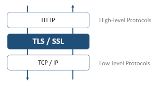

Todos os servidores 4D podem se comunicar em modo seguro através do protocolo TLS (Transport Layer Security):

- o servidor HTTP
- o servidor de aplicação (aplicações desktop cliente-servidor)
- o servidor SQL

Além disso, o cliente HTTP (comando `HTTP get` por exemplo) também é compatível com o protocolo TLS.

## Visão Geral

O protocolo TLS (sucessor de SSL) foi criado para assegurar trocas de dados entre duas aplicações - principalmente entre servidor web e um navegador. Esse protocolo é amplamente usado e é compatível com a maioria dos navegadores.

No nível de rede, o protocolo de segurança é inserido entre a capa TCP/IP (baixo nível) e o protocolo de alto nível HTTP. Foi criado principalmente para trabalhar com HTTP.

Configuração de rede usando TSL:

O protocolo TLS foi criado para autenticar o emissor e o recipiente e assim garantir a confidencialidade e integridade da troca de informações:

- **Autenticação**: As identidades do emissor e do receptor são confirmadas.
- **Confidencialidade**: O dado enviado é criptografado para que um terceiro não possa entender a mensagem.
- **Integridade**: Os dados recebidos não foram modificados, seja por acidente ou com má intenção.

TLS usa uma técnica de criptografia de chave pública baseado em duas chaves assimétricas para criptografia e descriptografia: uma chave pública e outra privada. A chave privada é usada para criptografar os dados. O emissor (o website) não dá essa chave para ninguém.

A chave pública é usada para decriptografar a informação e enviá-la para os recipientes (navegadores web) através de um **certificado**. The certificate is delivered through a Certification Authority. The website pays the certificate provider to deliver a certificate which guaranties the server authentication and contains the public key allowing to exchange data in a secured mode.

:::note

Web browsers authorize only the certificates issued by a Certification Authority referenced in their properties.

:::

## Versão mínima

By default, the minimum version of the secured protocol accepted by the 4D servers is TLS 1.3. Pode modificar esse valor usando o seletor `Min TLS version` com o comando `SET DATABASE PARAMETER`.

:::note

You can control separately the [minimum TLS version](WebServer/webServerConfig.md#minimum-tls-version) for **webServer objects**.

:::

## Enabling TLS with the HTTP server

To be able to use the TLS protocol with the 4D HTTP server, you have to:

1. Get your certificate files.
2. Install your certificate files at the appropriate location(s)
3. Enable TLS.

### Certificados

#### Formato

Certificados TLS gerenciados por 4D devem ser no **PEM format**. If your certificate provider sends you a certificate that is in a binary format such as .crt, .pfx or .p12, you have to convert it to PEM format in order to be able to use it. There are web sites where you can do this conversion on-line.

#### Criptografia

4D fornece certificados nos formatos de criptografia abaixo:

- [**RSA**](https://en.wikipedia.org/wiki/RSA_(cryptosystem))
- [**ECDSA**](https://en.wikipedia.org/wiki/Elliptic_Curve_Digital_Signature_Algorithm)

:::info Compatibilidade

O formato de criptografia ECDSA não é compatível com [a camada de rede legado 4D](../settings/client-server.md#network-layer).

:::

:::note

4D oferece dois comandos para ajudar a peticionar um certificado RSA, [veja o tutorial abaixo](#how-to-get-a-rsa-certificate-tutorial).

:::

### Installing certificate files

Certificate files include:

- **key.pem**: a document containing the private encryption key,
- **cert.pem**: a document containing the certificate.

Both **key.pem** and **cert.pem** files must be located:

- with 4D Server or 4D in local mode, next to the [project folder](Project/architecture.md#project-folder)
- with 4D in remote mode, in the client database folder on the remote machine (for more information about the location of this folder, see the [`Get 4D folder`](https://doc.4d.com/4dv20/help/command/en/page485.html) command). You must copy these files manually on the remote machine.

### Ativar TLS

For TLS connections to be accepted by the HTTP server, you must enable HTTPS. Refer to the [**Enable HTTPS**](WebServer/webServerConfig.md#enable-https) paragraph to know the different ways to enable TLS for the HTTP server.

:::note

O servidor 4D web é compatível com a opção HSTS para prevenir um navegador de

:::

### Perfect Forward Secrecy (PFS)

[PFS](https://en.wikipedia.org/wiki/Forward_secrecy) adiciona mais um nível de segurança para suas comunicações. Ao invés de usar chaves de troca pré-estabelecidas, PFS cria chaves de sessão cooperativamente entre as partes que se comunicam usando os algoritmos Difie-Hellman (DH). A maneira conjunta com a qual essas chaves são construídas cria um "segredo compartilhado" que impede partes externas de as comprometerem.

Quando TLS estiver ativado no servidor, PFS é ativado automaticamente. Se o arquivo *dhparams.pem* (documento que contém a chave privada DH do servidor) ainda não existir, 4D vai gerar o arquivo automaticamente com um tamanho de chave de  2048. A geração inicial deste arquivo pode levar vários minutos. The file is placed with the [*key.pem* and *cert.pem* files](#installing-certificate-files).

Se utilizar uma [lista de cifrado personalizada](WebServer/webServerConfig.md##cipher-list) e quiser habilitar o PFS, deve comprovar que contenha entradas com algoritmos DH ou ECDH (Elliptic-curve Diffie-Hellman).

## Enabling TLS with the other servers

To use TLS with the 4D application server (client-server desktop applications) or the SQL server, you only have to enable TLS communications and the server automatically configures the connections at startup.

- With the application server, select the **Encrypt Client-Server Communications** option in the ["Client-server/Network options" page of the Settings dialog box](../settings/client-server#encrypt-client-server-communications).
- With the SQL server, select the **Enable TLS** option in the ["SQL" page of the Settings dialog box](../settings/sql#sql-server-publishing).

## Como obter o certificado RSA? (tutorial)

Um servidor trabalhando em modo seguro significa que precisa de um certificado digital de uma autoridade de certificações. Esse certificado contém várias informações tais como a ID do site assim como a chave pública usada para comunicar com o servidor. Esse certificado é transmitido aos clientes (por exemplo os navegadores Web) conectando a esse servidor. Quando o certificado tiver sido identificado e aceito, a comunicação é feita em modo seguro.
> Navegadores web autorizam apenas os certificados emitidos por autoridades de certificação referenciados em suas propriedades.

A autoridade de certificação é escolhida de acordo com vários critérios. Se a autoridade de certificação for bem reconhecida, o certificado será autorizado por vários navegadores, mas o preço pode ser caro.

Para obter um certificado digital:

1. Crie uma chave privada usando o comando `GENERATE ENCRYPTION KEYPAIR`.
> **Aviso**: por razões de segurança, a chave privada deve ser sempre mantida em segredo. Na verdade deve ser mantida sempre na máquina servidor. Para o servidor web, o arquivo Key.pem deve ser localizado na pasta Project.

2. Use o comando `GENERATE CERTIFICATE REQUEST` para emitir uma petição de certificado.

3. Envie a petição de certificado à autoridade de certificação escolhida. Para preencher uma petição de certificado, pode ser necessário entrar em contato com a autoridade de certificação. A autoridade checa que a informação transmitida seja correta. A petição de certificado é gerada em um BLOB usando o formato PKCS codificado em base64 (formato PEM). Esse princípio permite que copie e cole as chaves como texto e as envie via E-mail sem modificar o conteúdo da chave. Por exemplo pode salvar o BLOB que contém a petição de certificado em um documento texto (usando o comando `BLOB TO DOCUMENT`), e então abrir e copiar e colar seu conteúdo em um mail ou um formulário web a ser enviado para a autoridade de certificação.

4. Quando tiver o certificado, crie um arquivo texto chamado "cert.pem" e cole seu conteúdo do certificado dentro dele. Pode receber um certificado de várias maneiras (geralmente por email ou formulário HTML). 4D aceita todos os formatos de texto relacionados à plataformas para certificados (OS X, PC, Linux, etc). However, the certificate must be in [PEM format](#format), *i.e.*, PKCS encoded in base64.
> Caracteres CR final de linha não são compatíveis em si; deve usar ou CRLF ou LF.

5. Place the “cert.pem” file in the [appropriate location](#installing-certificate-files).

O servidor 4D pode trabalhar em modo seguro. A certificate is usually valid between 3 months to a year.
