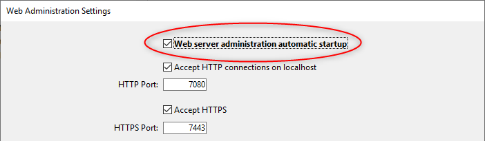

An embedded web server component, named `WebAdmin`, is used by 4D and 4D Server to provide a secured web access to specific features:

- REST accesses to the project
- the [Data Explorer](dataExplorer.md)
- the [Qodly Studio preview rendering](https://developer.4d.com/qodly/4DQodlyPro/rendering#preview-in-qodly-studio)

Pode conectar localmente ou remotamente ao servidor web de um navegador ou uma aplicação web e acessar a aplicação 4D associada.

The Web Administration Server handles the authentication of users with `WebAdmin` privileges, so that they can open administration sessions and access dedicated interfaces.

Essa funcionalidade pode ser usada em aplicações 4D rodando headless (sem monitor e periféricos) assim como aplicações 4D rodando sem interfaces.

## Starting the Web Administration Server

By default, the Web Administration Server web server is not launched. Precisa configurar o lançamento ao início ou (em versões com interface) lançar manualmente usando um item de menu.

### Lançar ao início

You can configure the Web Administration Server to be launched at 4D or 4D Server application startup (before any project is loaded).

- Se utilizar uma aplicação 4D con interface, selecione a opção de menu **Arquivo > Administração web > Propriedades...**.


Selecione a opção **Iniciar WebAdmin ao iniciar** na caixa de diálogo de parâmetros:



- Se usar uma aplicação 4D que tenha ou não interface, pode habilitar o modo de inicio automático utilizando o argumento abaixo *Interface de linha de comandos*:

```
open ~/Desktop/4D.app --webadmin-auto-start true
```

> If the TCP port used by the Web Administration Server ([HTTPS](#https-port) or [HTTP](#http-port), depending on the settings) is not free at startup, 4D will try successively the 20 following ports, and use the first one that is available. Se nenhum porto estiver disponível, o servidor web não é lançado e um erro é exibido (ou em aplicação headless, aparece no console)

### Iniciar e parar

If you use a 4D application with interface, you can start or stop the Web Administration Server for your project at any moment:

Selecione a opção de menu **Arquivo > Administração web > Iniciar o servidor**.


The menu item becomes **Stop Server** when the server is launched; select **Stop Server** to stop the Web Administration Server.

## Settings {#settings}

Configuring the Web Administration Server is mandatory in particular to define the [**access key**](#access-key). Como padrão, quando a chave de acesso não for estabelecida, o acesso via uma url não é permitido.

You can configure the Web Administration Server using the [Web Administration settings dialog box](#settings-dialog-box) (see below).

> Se você usar uma aplicação 4D headless, você pode usar os [argumentos da *Interface de Linha de Comando*](#webadmin-headless-configuration) para definir as configurações básicas. Se quiser personalizar o arquivo de configurações para definir os parâmetros avançados.

### Caixa de diálogos de configurações

Para abrir a caixa de diálogo de configurações de administração web, selecione o item de menu **File > Web Administration > Configurações...**.


A caixa de diálogo abaixo é mostrada:


#### Iniciar o servidor WebAdmin na inicialização

Check this option if you want the Web Administration Server to be automatically launched when the 4D or 4D Server application starts ([see above](#launch-at-startup)). Como padrão essa opção não é marcada.

#### Conexões HTTP em localhost aceitas

When this option is checked, you will be able to connect to the Web Administration Server through HTTP on the same machine as the 4D application. Como padrão, essa opção é marcada.

:::note Notas

- Conexões com HTTP outras que localhost nunca são aceitas.
- Mesmo se esta opção for marcada, quando [Accept HTTPS](#accept-https) for marcado e a configuração  TLS for válida, as conexões localhost vão usar HTTPS.

:::

#### Porta HTTP

Port number to use for connections through HTTP to the Web Administration Server when the **Accept HTTP connections on localhost** option is checked. Valor normal padrão é 7080

#### Aceitar HTTPS

When this option is checked, you will be able to connect to the Web Administration Server through HTTPS. Como padrão, essa opção é marcada.

#### Porta HTTPS

Port number to use for connections through HTTPS to the Web Administration Server when the **Accept HTTPS** option is checked. Valor normal padrão é 7443

#### Rota da pasta de certificados

Rota da pasta onde o certificado TLS está localizado. Como padrão, a rota da pasta de certificados está vazia e 4D ou Servidor 4D usa os arquivos de certificados contidos na apicação 4D (certificados personalizados devem ser armazenados do lado da pasta projeto).

#### Modo de registro de depuração

O estado ou formato do arquivo de registro da petição HTTP (HTTPDebugLog_*nn*.txt, armazenada na pasta "Logs" da aplicação -- *nn* é o número do arquivo). As opções abaixo estão disponíveis:

- **Desactivado** (por defecto)
- **Com todas as partes do corpo** - habilitado com partes do cuerpo das petições e respostas
- **Sem as partes do corpo** - ativado sem partes do corpo (se indica o tamanho do corpo)
- **Com os corpos das petições** - ativado com as partes do corpo unicamente nas petições
- **Com a resposta corpos** - ativado com as partes do corpo unicamente nas respostas

#### Chave de acesso

Defining an access key is mandatory to unlock access to the Web Administration Server through a URL (access via a 4D menu command does not require an access key). Quando nenhuma chave de acesso for definida, não é permitido que nenhum cliente web se conecte através de uma URL a uma interfaz de administração web como a página [Explorador de dados](dataExplorer.md). Uma página de erro é retornada no caso uma solicitação de conexão:


Uma chave de acesso é parecida a uma senha, mas não está associada com um login.

- Para definir uma nova chave de acesso: clique no botão **Definir**, introduza a string da chave de acesso na caixa de diálogo e clique em **OK**. La etiqueta del
  botón se convierte en **Modificar**.
- Para modificar a chave de acesso: clique no botão **Modificar**, introduza a nova string da chave de acesso na caixa de diálogo e clique em **OK**.
- Para eliminar a chave de acesso: clique no botão**Modificar**, deixe vazia a área daa chave de acesso e clique em **OK**.

#### Ativar o acesso a Qodly Studio

:::note

Essa opção só aparece se a licença do Qodly Studio estiver ativada.

:::

Essa opção permite o acesso do usuário a [Qodly Studio](../WebServer/qodly-studio.md) no nível da aplicação 4D. Observe que você também precisa [habilitar o acesso em cada nível de projeto](../settings/web.md#enable-access-to-qodly-studio).

:::note

This option is automatically checked if you used the [One-click configuration dialog box](https://developer.4d.com/qodly/4DQodlyPro/gettingStarted#one-click-configuration).

:::

## Headless Configuration

All [Web Administration Server settings](#settings) are stored in the `WebAdmin.4DSettings` file. Ha un arquivo `WebAdmin.4DSettings` por padrão para cada aplicação 4D e 4D Server, pelo qual é possível lançar várias aplicações na mesma máquina local.

Quando rodar uma aplicação sem interface 4D ou 4D Servidor, pode estabelecer e usar o arquivo padrão `WebAdmin.4DSettings` , ou determinar um arquivo personalizado `.4DSettings`.

Para estabelecer o conteúdo do arquivo, pode utilizar a [janela de parâmetros WebAdmin](#settings-dialog-box) da aplicação 4D com uma interface e ejecutá-la depois sem interface. Se utiliza então o arquivo padrão `WebAdmin.4DSettings`.

Ou, pode estabelecer um arquivo personalizado `.4DSettings` (formato xml) e usar ao invés do arquivo padrão. Na [Interfaz de linha de comandos](cli.md) há vários argumentos dedicados para compatibilidade com esta funcionalidade.

> A chave de acesso não é armazenada de forma transparente no arquivo `.4DSettings`.

Exemplo:

```
"%HOMEPATH%\Desktop\4D Server.exe" MyApp.4DLink --webadmin-access-key 
	"my Fabulous AccessKey" --webadmin-auto-start true   
	--webadmin-store-settings

```

## Autenticação

When a web page controlled by the Web Administration Server is accessed by entering a URL and without prior identification, an authentication is required. O usuário deve introduzir a [chave-de-acesso](#access-key) em uma janela de autenticação:


If the access key was not defined in the Web Administration Server settings, no access via URL is possible (a specific message is displayed).

When a web page controlled by the Web Administration Server page is accessed directly from a 4D or 4D Server menu item (such as **Records > Data Explorer** or **Window > Data Explorer** (4D Server)), access is granted without authentication, the user is automatically authenticated.

:::note

Once the access is granted, a [web session](WebServer/sessions.md) with a specific "WebAdmin" privilege is created by the Web Administration Server. This privilege provides an open access to all data through web processes, as soon as no [specific permissions are applied to resources](../ORDA/privileges.md).

:::

