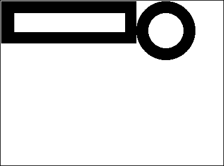
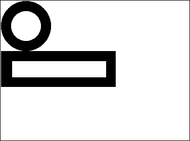
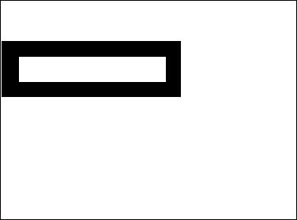
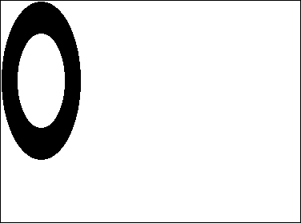

Um campo, variável ou expressão pode ser qualquer imagem de Windows ou Macintoh. En general, esto incluye toda imagen que pueda ser puesta en el portapapeles o leída desde el disco utilizando comandos 4D como `READ PICTURE FILE`.

4D usa APIs nativas para codificar (escrever) e decodificar (ler) campos de imagens e variáveis sob Windows e macOS. Essas implementações oferecem acesso a inúmeros formatos nativos, incluindo o formato RAW atualmente utilizado por câmeras digitais.

- no Windows, 4D usa o WIC (Componente de Imagens Windows).
- no macOS, 4D usa ImageIO.

WIC e ImageIO permitem o uso de metadados nas fotos. Dos comandos, `SET PICTURE METADATA` y `GET PICTURE METADATA`, le permiten beneficiarse de los metadatos en sus desarrollos.

## IDs de códigos de imagem

4D soporta de forma nativa un amplio conjunto de [formatos de imagen](FormEditor/pictures.md#native-formats-supported), como .jpeg, .png o .svg.

Los formatos de imágenes reconocidos por 4D son devueltos por el comando `PICTURE CODEC LIST` como identificadores de códecs de imágenes.  Eles podem ser devolvidos nos seguintes formulários:

- Como uma extensão (por exemplo ".gif")
- Como um tipo MIME (por exemplo, “image/jpeg”)

O formulário retornado para cada formato dependerá da forma como o Codec é gravado no nível do sistema operacional. Note que a lista de codecs disponíveis para leitura e escrita pode ser diferente desde que a codificação de codecs pode exigir licenças específicas.

La mayoría de los comandos de gestión de imágenes [4D](https://doc.4d.com/4Dv18/4D/18/Pictures.201-4504337.en.html) pueden recibir un Codec ID como parámetro. Por lo tanto, es imperativo utilizar el ID del sistema devuelto por el comando `PICTURE CODEC LIST`.
Los formatos de imágenes reconocidos por 4D son devueltos por el comando `PICTURE CODEC LIST`.

## Operadores de imagem

| Operação                | Sintaxe                               | Retorna    | Ação                                                                                                                                                                                           |
| ----------------------- | ------------------------------------- | ---------- | ---------------------------------------------------------------------------------------------------------------------------------------------------------------------------------------------- |
| Concatenação horizontal | Foto1 + Foto2                         | Imagem     | Adicionar Pict2 à direita da Pict1                                                                                                                                                             |
| Concatenação vertical   | Pict1 / Pict2                         | Imagem     | Acrescentar Pict2 ao fundo de Pict1                                                                                                                                                            |
| Sobreposição exclusiva  | Imagen1 & Imagen2 | Imagem     | Sobrepõe Pict2 no topo de Pict1 (Pict2 em primeiro plano). Produce el mismo resultado que `COMBINE PICTURES(pict3;pict1;Superimposition;pict2)`             |
| Sobreposição inclusiva  | Pict1 \| Pict2                        | Imagem     | Sobrepõe Pict2 em Pict1 e devolve a máscara resultante se ambas as imagens tiverem o mesmo tamanho. Produce el mismo resultado que `$equal:=Equal pictures(Pict1;Pict2;Pict3)` |
| Movimento horizontal    | Imagem + Número                       | Imagem     | Mover imagem horizontalmente número pixels                                                                                                                                                     |
| Movimento vertical      | Imagem / Número                       | Imagem     | Mover imagem em pixels do número vertical                                                                                                                                                      |
| Redimensionamento       | Imagem \* Número                      | Imagem     | Redimensionar imagem por proporção número                                                                                                                                                      |
| Escala horizontal       | Imagem \*+ Número                     | Imagem     | Redimensionar imagem horizontalmente por relação numérica                                                                                                                                      |
| Escala vertical         | Picture \*\| Number                   | Imagem     | Redimensionar imagem por proporção número                                                                                                                                                      |
| Contém palavra chave    | Picture % String                      | Parâmetros | Returns true if the string is associated with the picture stored in the picture expression. Veja `GET PICTURE KEYWORDS`                                                        |

**Notas:**

- Para utilizar o | operador, Pict1 e Pict2 devem ter exactamente a mesma dimensão. Se ambas as imagens tiverem um tamanho diferente, a operação Pict1 | Pict2 produz uma imagem em branco.
- El comando `COMBINE PICTURES` puede utilizarse para superponer imágenes manteniendo las características de cada imagen fuente en la imagen resultante.
- Se pueden realizar operaciones adicionales en las imágenes utilizando el comando `TRANSFORM PICTURE`.
- No hay operadores de comparación de imágenes, sin embargo 4D propone el comando `Equal picture` para comparar dos imágenes.

### Exemplos

Concatenação horizontal

```4d
 círculo+rectângulo //Coloca o retângulo à direita do círculo
 rectângulo+círculo //Coloca o círculo à direita do retângulo
```




Concatenação vertical

```4d
 círculo/retângulo //Coloca o retângulo abaixo do círculo
 retângulo/círculo //Coloca o círculo abaixo do retângulo
```




Sobreposição exclusiva

```4d
Pict3:=Pict1 & Pict2 // Superponer Pict2 sobre Pict1
```


Sobreposição inclusiva

```4d
Pict3:=Pict1|Pict2 // Recupera a máscara resultante da sobreposição de duas imagens do mesmo tamanho
```


Movimento horizontal

```4d
retângulo+50 //Mova o retângulo 50 pixels para a direita
retângulo-50 //Mova o retângulo 50 pixels para a esquerda
```


Movimento vertical

```4d
retângulo/50 //Mova o retângulo para baixo em 50 pixels
retângulo/-20 //Mova o retângulo para cima em 20 pixels
```



Redimensionar

```4d
retângulo*1,5 ///O retângulo fica 50% maior
retângulo*0,5 ///O retângulo fica 50% menor
```


Escala horizontal

```4d
círculo*+3 ///O círculo se torna 3 vezes maior
círculo*+0.25 ///A largura do círculo se torna um quarto da que era
```


Escala vertical

```4d
círculo*|2 //O círculo torna-se duas vezes mais alto
círculo*|0.25 //A altura do círculo torna-se um quarto do que era
```


