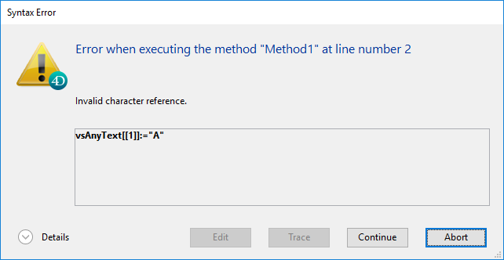

String é um termo genérico que significa:

- Campos ou variáveis texto: um campo, uma variável ou uma expressão texto pode conter de 0 a 2 GB de texto.
- Campos alfanuméricos: um campo alfanumérico pode conter de 0 a 255 caracteres (limite estabelecido aquando da definição do campo).

## Constantes literais String

Uma constante string é colocada entre aspas duplas e rectas ("..."). Eis alguns exemplos:

```4d
"Add Records"
"No records found."
"Invoice"
```

Uma cadeia vazia é especificada por duas aspas sem nada entre elas ("").

### Sequências de escape

As seguintes sequências de escape podem ser utilizadas em strings de caracteres:

| Escape sequence                                | Carácter substituído                    |
| ---------------------------------------------- | --------------------------------------- |
| \n                                             | LF (Avanço de linha) |
| \t                                             | HT (Tab)             |
| \r                                             | CR (Carriage return) |
| \\\\|\ (Barra invertida) |                                         |
| \\"                                          | " (aspas)            |

**Note:** The \ (backslash) character is used as a separator in pathnames under Windows. Portanto, deve usar uma barra invertida dupla \\\ em caminhos quando quiser ter uma barra invertida à frente de um carácter usado numa das sequências de escape reconhecidas pelo 4D (por exemplo, "C:\\\MyDocuments\\\New.txt").

## Operadores de string

| Operação             | Sintaxe          | Retorna    | Expression                                | Valor                        |
| -------------------- | ---------------- | ---------- | ----------------------------------------- | ---------------------------- |
| Concatenação         | String + String  | String     | "abc" + "def"                             | "abcdef"                     |
| Repetição            | String \* Number | String     | "ab" \* 3                                 | "ababab"                     |
| Igual                | String = String  | Parâmetros | "abc" = "abc"                             | True                         |
|                      |                  |            | "abc" = "abd"                             | False                        |
| Desigualdade         | String # String  | Parâmetros | "abc" # "abd"                             | True                         |
|                      |                  |            | "abc" # "abc"                             | False                        |
| Maior que            | String > String  | Parâmetros | "abd" > "abc"                             | True                         |
|                      |                  |            | "abc" > "abc"                             | False                        |
| Menor que            | String < String  | Parâmetros | "abc" < "abd"                             | True                         |
|                      |                  |            | "abc" < "abc"                             | False                        |
| Maior ou igual a     | String >= String | Parâmetros | "abd" >= "abc"                            | True                         |
|                      |                  |            | "abc" >= "abd"                            | False                        |
| Menor que ou igual a | String <= String | Parâmetros | "abc" <= "abd"                            | True                         |
|                      |                  |            | "abd" <= "abc"                            | False                        |
| Contém palavra chave | String % String  | Parâmetros | "Alpha Bravo" % "Bravo"                   | True                         |
|                      |                  |            | "Alpha Bravo" % "ravo"                    | False                        |
|                      | Picture % String | Parâmetros | Picture_expr % "Mer" | True (\*) |

(\*) Se a palavra-chave "Mer" estiver associada à imagem armazenada na expressão de imagem (campo ou variável).

## Comparações de cadeias

- Strings are compared on a character-by-character basis (except in the case of searching by [keywords](dt_string.md#keywords), see below).
- When strings are compared, the case of the characters is ignored; thus, "a"="A" returns `TRUE`. Para testar se o caso de dois caracteres é diferente, compare os seus códigos de caracteres. For example, the following expression returns `FALSE`:

```4d
Character code("A")=Character code("a") // porque 65 não é igual a 97
```

- Quando as cadeias de caracteres são comparadas, os caracteres diacríticos são tidos em conta. For example, the following expressions return `TRUE`:

```4d
     "n"="ñ"
     "n"="Ñ"
     "A"="å"
      // and so on
```

**Note:** String comparison takes into account specificities of the language **defined for the 4D data file** (which is not always the same as the language defined for the system).

### Caractere coringa(@)

The 4D language supports **@** as a wildcard character. Este carácter pode ser utilizado em qualquer comparação de cadeia para corresponder a qualquer número de caracteres. For example, the following expression is `TRUE`:

```4d
"abcdefghij"="abc@"
```

O carácter wildcard deve ser utilizado dentro do segundo operando (a cadeia do lado direito) para corresponder a qualquer número de caracteres. The following expression is `FALSE`, because the @ is considered only as a one character in the first operand:

```4d
    "abc@"="abcdefghij"
```

O wildcard significa "um ou mais caracteres ou nada". The following expressions are `TRUE`:

```4d
     "abcdefghij"="abcdefghij@"
     "abcdefghij"="@abcdefghij"
     "abcdefghij"="abcd@efghij"
     "abcdefghij"="@abcdefghij@"
     "abcdefghij"="@abcde@fghij@"
```

On the other hand, whatever the case, a string comparison with two consecutive wildcards will always return `FALSE`. The following expression is `FALSE`:

```4d
"abcdefghij"="abc@@fg"
```

Quando o operador de comparação é ou contém um símbolo < or >, só é suportada a comparação com um único carácter universal localizado no final do operando:

```4d
     "abcd"<="abc@" // Valid comparison
     "abcd"<="abc@ef" //Not a valid comparison
```

If you want to execute comparisons or queries using @ as a character (and not as a wildcard), you need to use the `Character code(At sign)` instruction. Imagine, por exemplo, que quer saber se uma cadeia de caracteres termina com o carácter @. The following expression (if $vsValue is not empty) is always `TRUE`:

```4d
($vsValue[[Length($vsValue)]]="@")
```

A seguinte expressão será avaliada correctamente:

```4d
(Character code($vsValue[[Length($vsValue)]])#64)  
```

**Note:** A 4D option in the Design environment allows you to define how the @ character is interpreted when it is included in a character string.

### Palavras-chave

Ao contrário de outras comparações de cadeias, a pesquisa por palavras-chave procura "palavras" em "textos": as palavras são consideradas individualmente e como um todo. The **%** operator always returns `False` if the query concerns several words or only part of a word (for example, a syllable). As "palavras" são cadeias de caracteres rodeadas por "separadores", que são espaços e caracteres de pontuação e traços. Um apóstrofo, como em "Today's", é normalmente considerado como parte da palavra, mas será ignorado em certos casos (ver as regras abaixo). Os números podem ser pesquisados porque são avaliados como um todo (incluindo símbolos decimais). Outros símbolos (moeda, temperatura, etc.) serão ignorados.

```4d
     "Alpha Bravo Charlie"%"Bravo"// Retorna True
     "Alpha Bravo Charlie"%"vo" // Retorna False
     "Alpha Bravo Charlie"%"Alpha Bravo"// Retorna False
     "Alpha,Bravo,Charlie"%"Alpha" // Retorna True
     "Software e Computadores"%"comput@" // Retorna True
```

> **Notas:**
>
> - 4D uses the ICU library for comparing strings (using `<>=#` operators) and detecting keywords. For more information about the rules implemented, please refer to the following address: http://www.unicode.org/reports/tr29/#Word_Boundaries.
> - Na versão japonesa, em vez de ICU, 4D usa Mecab por defeito para detectar palavras-chave.

## Símbolos de referência de caracteres

Os símbolos de referência dos caracteres: [[...]]

Estes símbolos são utilizados para se referir a um único carácter numa cadeia de caracteres. Esta sintaxe permite-lhe endereçar individualmente os caracteres de uma variável de texto, de uma variável de cadeia de caracteres ou de um campo.

Se os símbolos de referência de carácter aparecerem no lado esquerdo do operador de atribuição (:=), é atribuído um carácter à posição referenciada na cadeia. Por exemplo, se vsName não for uma cadeia de caracteres vazia, a linha seguinte define o primeiro carácter de vsName como maiúsculo:

```4d
If(vsName#"")
    vsName[[1]]:=Uppercase(vsName[[1]])
End if
```

Caso contrário, se os símbolos de referência de caracteres aparecerem numa expressão, devolvem o carácter (a que se referem) como uma cadeia de 1 carácter. Por exemplo:

```4d
//The following example tests if the last character of vtText is an At sign "@"
 If(vtText#"")
    If(Character code(Substring(vtText;Length(vtText);1))=At sign)
  //...
    End if
 End if
 
  //Using the character reference syntax, you would write in a simpler manner:
 If(vtText#"")
    If(Character code(vtText[[Length(vtText)]])=At sign)
  // ...
    End if
 End if
```

### Nota avançada sobre a referência de carácter inválido

Quando utiliza os símbolos de referência de caracteres, deve endereçar os caracteres existentes na cadeia da mesma forma que endereça os elementos existentes de uma matriz. Por exemplo, se endereçar o 20º carácter de uma variável de cadeia, esta variável DEVE conter pelo menos 20 caracteres.

- Se não o fizer, no modo interpretado, não causa um erro de sintaxe.
- Se não o fizer, em modo compilado (sem opções), pode levar à corrupção da memória, se, por exemplo, escrever um carácter para além do fim de uma cadeia ou de um texto.
- Se não o fizer, no modo compilado, causa um erro com a opção Range Checking On. Por exemplo, executando o seguinte código:

```
//Very bad and nasty thing to do, boo!
 vsAnyText:=""
 vsAnyText[[1]]:="A"
```

accionará o erro de tempo de execução mostrado aqui:



### Exemplo

O seguinte método de projeto capitaliza o primeiro carácter de cada palavra do texto recebido como parâmetro e devolve o texto capitalizado resultante:

```4d
  //Capitalize_text project method
  //Capitalize_text ( Text ) -> Text
  //Capitalize_text ( Source text ) -> Capitalized text
 
 $0:=$1
 $vlLen:=Length($0)
 If($vlLen>0)
    $0[[1]]:=Uppercase($0[[1]])
    For($vlChar;1;$vlLen-1)
       If(Position($0[[$vlChar]];" !&()-{}:;<>?/,.=+*")>0)
          $0[[$vlChar+1]]:=Uppercase($0[[$vlChar+1]])
       End if
    End for
 End if
```

Por exemplo, a linha:

```4d
ALERT(Capitalize_text("hello, my name is jane doe and i'm running for president!"))
```

mostra o alerta aqui mostrado:


