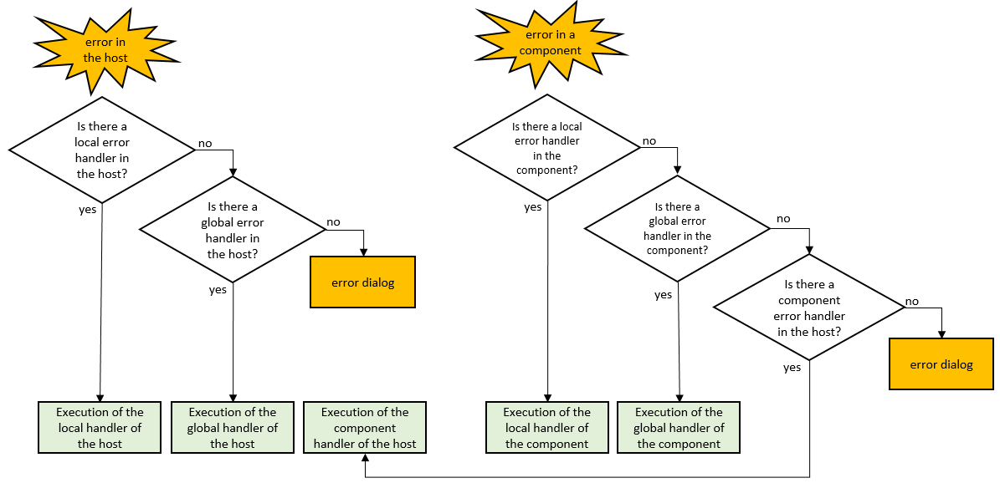

O manejo de erros é o processo de antecipar e responder aos erros que possam ocorrer em sua aplicação. 4D oferece assistência completa à detecção e notificação de erros no tempo de execução, assim como a análise de suas condições.

Manejo de erros responde à duas necessidades principais:

- descobrir e consertar erros potenciais e bugs no código durante a fase de desenvolvimento,
- detectar e recuperar de erros inesperados nas aplicações implementadas; em particular pode substituir diálogos de erros de sistemas (disco cheio, arquivo faltando, etc) com sua própria interface.

Basicamente, há duas maneiras de lidar com erros em 4D. Pode:

- [install an error-handling method](#installing-an-error-handling-method), or
- use a [`Try()` keyword](#tryexpression) or a [`Try/Catch` structure](#trycatchend-try) before pieces of code that call a function, method, or expression that can throw an error.

:::dica Boa prática

> > É recomendado instalar um método de gerenciamento de erros em 4D Server, para todos os códigos rodando no servidor. Quando 4D Server não está sendo executado [headless](../Admin/cli.md) (ou seja, é iniciado com sua [janela de administração](../ServerWindow/overview.md)), esse método evitaria que caixas de diálogo inesperadas fossem exibidas na máquina do servidor. No modo headless, os erros são registados no ficheiro [4DDebugLog](../Debugging/debugLogFiles.md#4ddebuglogtxt-standard) para análise posterior.

:::


## Erro ou status

Muitas funções de classe 4D, tais como `entity.save()` ou `transporter.send()`, devolvem um objecto com o estatuto **. Este objecto é utilizado para armazenar erros "previsíveis" no contexto do tempo de execução, por exemplo, palavra-passe inválida, entidade bloqueada, etc., que não interrompem a execução do programa. Esta categoria de erros pode ser tratada por código normal.

Outros erros "imprevisíveis" incluem erro de gravação em disco, falha de rede, ou em geral qualquer interrupção inesperada. Esta categoria de erros gera exceções e precisa ser tratada através de um método de manipulação de erros ou uma palavra-chave `Try()`.


## Instalação de um método de gestão de erros

Em 4D, todos os erros podem ser apanhados e tratados num método de projecto específico, o método **de tratamento de erros** (ou **de captura de erros**).

Uma vez instalados, os manipuladores de erros são automaticamente chamados em modo interpretado ou compilado em caso de erro na aplicação 4D ou num dos seus componentes. Um manipulador de erros diferente pode ser chamado em função do contexto de execução (ver abaixo).

Para *instalar* um método de projecto de tratamento de erros, basta chamar o comando [`ON ERR CALL`](https://doc.4d.com/4dv19/help/command/en/page155.html) com o nome do método de projecto e (opcionalmente) o âmbito como parâmetros. Por exemplo:

```4d
ON ERR CALL("IO_ERRORS") //Instala o método de gestão de erros
```

Para deixar de detectar erros e devolver o controle a 4D, chame a `ON ERR CALL` com uma string vazia:

```4d
ON ERR CALL("";ek local) // dá o controle para o processo local
```

The  [`Method called on error`](https://doc.4d.com/4dv20/help/command/en/page704.html) command allows you to know the name of the method installed by `ON ERR CALL` for the current process. É particularmente útil no contexto dos componentes porque permite mudar temporariamente e depois restaurar o método de captura de erros do banco de dados local:

```4d
 $methCurrent:=Method called on error
 ON ERR CALL("NewMethod")
  //Se o documento não pouder ser aberto, um erro é gerado
 $ref:=Open document("MyDocument")
  //Reinstalação do método anterior
 ON ERR CALL($methCurrent)

```

### Alcance e componentes

Um método de tratamento de erros pode ser definido para diferentes contextos de execução:

- ON ERR CALL("") //devolve o controle a 4D
- o comando `GET LAST ERROR STACK` que devolve informação sobre a pilha de erros atual da aplicação 4D.
- In the case of an error generated by a **component**, the `ON ERR CALL` error-handling method of the host application is not called, and vice versa.

Exemplos:

```4d
ON ERR CALL("IO_Errors";ek local) //Instala um método local de tratamento de erros ON ERR CALL("globalHandler";ek global) //Instala um método global de tratamento de erros ON ERR CALL("componentHandler";ek erros de componentes) //Instala um método de tratamento de erros de componentes
```

Pode instalar um gerenciador de erros global que servirá como "fallback" e métodos de erros locais específicos para certos processos. Um manipulador de erros global é também útil no servidor para evitar diálogos de erro no servidor quando executado com interface.

Pode definir um único método de captura de erros para toda a aplicação ou diferentes métodos por módulo de aplicação. Entretanto, apenas um método pode ser instalado por processo.

Quando ocorre um erro, apenas um método é chamado, como descrito no diagrama seguinte:




### Manejo de erros dentro do método

Within the custom error method, you have access to several pieces of information that will help you identifying the error:

- variáveis sistema (*):

  - `Error` (inteiro longo): código de erro
  - `Error method`(texto): nome do método que provocou o erro
  - `Error line` (entero largo): número de línea do método que provocou o erro
  - `Error formula` (text): fórmula do código 4D (texto bruto) que está na origem do erro.

:::info

(*) 4D mantém automaticamente uma série de variáveis chamadas **variáveis sistema**, que respondem a diferentes necessidades. Consulte o *Manual da linguagem de 4D*.

:::

- o comando [`últimos erros`](https://doc.4d.com/4dv19/help/command/en/page1799.html) que devolve uma coleção da pilha actual de erros que ocorreram na aplicação 4D. Também pode usar o comando [`GET LAST ERROR STACK`](https://doc.4d.com/4dv19/help/command/en/page1015.html) que devolve a mesma informação que os arrays.
- o comando `Get call chain` que devolve uma coleção de objetos que descrevem cada passo da string de chamadas a métodos dentro do processo atual.


#### Exemplo

Aqui está um sistema de gestão de erros simples:

```4d
//instalar o método de gestão de erros
 ON ERR CALL("errorMethod")
 //... executar o código
 ON ERR CALL("") //retorna o controle para 4D
```

```4d
// método projeto errorMethod
 If(Error#1006) //essa não é uma interrupção do usuário
    ALERT("Um erro foi produzido "+String(Error)+". O código em questão é: \""+Error formula+"\"")
 End if
```

### Utilizar um método de gestão de erro vazio

Se quiser que a caixa de diálogo fique escondida, pode instalar um método de gestão de erros vazio. A variável sistema `Error` pode ser provada em qualquer método, ou seja, fora do método de gestão de erros:

```4d
ON ERR CALL("emptyMethod") //emptyMethod exists but is empty
$doc:=Open document( "myFile.txt")
If (Error=-43)
    ALERT("File not found.")
End if
ON ERR CALL("")
```


## Try(expression)

The `Try(expression)` statement allows you to test a single-line expression in its actual execution context (including, in particular, local variable values) and to intercept errors it throws so that the 4D error dialog box is not displayed. Using `Try(expression)` provides an easy way to handle simple error cases with a very low number of code lines, and without requiring an error-handling method.

:::note

If you want to try a more complex code than a single-line expression, you might consider using a [`Try/Catch` structure](#trycatchend-try).

:::

A sintaxe formal da instrução `Try(expression)` é:

```4d

Try (expression) : any | Undefined

```

*expression* pode ser qualquer expressão válida.

If an error occurred during its execution, it is intercepted and no error dialog is displayed, whether an [error-handling method](#installing-an-error-handling-method) was installed or not before the call to `Try()`. Se *expression* retorna um valor, `Try()` retorna o último valor calculado, caso contrário, ele retorna `Undefined`.

Você pode tratar o(s) erro(s) usando o comando [`Last errors`](https://doc.4d.com/4dv20/help/command/en/page1799.html). If *expression* throws an error within a stack of `Try()` calls, the execution flow stops and returns to the latest executed `Try()` (the first found back in the call stack).

:::note

If an [error-handling method](#installing-an-error-handling-method) is installed by *expression*, it is called in case of error.

:::


### Exemplos

1. You want to display the contents of a file if the file can be open without error, and if its contents can be read. Você pode escrever:

```4d
var $text : Text
var $file : 4D.File := File("/RESOURCES/myFile.txt")
var $fileHandle : 4D.FileHandle := Try($file.open())
If ($fileHandle # Null)
  $text:=Try($fileHandle.readText()) || "Erro ao ler o arquivo"
End if
```


2. Você deseja tratar o erro de divisão por zero. Nesse caso, você deseja retornar 0 e lançar um erro:

```4d
function divide( $p1: real; $p2: real)-> $result: real
  if ($p2=0)
     $result:=0 //apenas para fins de clareza (0 é o padrão para reais)
     throw(-12345; "Division by zero")
  else
    $result:=$p1/$p2
  end if

function test()
  $result:=Try(divide($p1;$p2))
  If (Last errors # null)
    ALERT("Error")
  End if

```

3. You want to handle both [predictable and non-predictable](#error-or-status) errors:

```4d
var $e:=ds.Employee.new()
$e.name:="Smith"
$status:=Try($e.save()) // Captura de erros previsíveis e não previsíveis
If ($status.success)
   ALERT( "Success")
Else
   ALERT( "Error: "+JSON Stringify($status.errors))
End if

```


## Try...Catch...End try

The `Try...Catch...End try` structure allows you to test a block code in its actual execution context (including, in particular, local variable values) and to intercept errors it throws so that the 4D error dialog box is not displayed.

Unlike the `Try(expression)` keyword that evaluates a single-line expression, the `Try...Catch...End try` structure allows you to evaluate any code block, from the most simple to the most complex, without requiring an error-handling method. In addition, the `Catch` block can be used to handle the error in any custom way.


The formal syntax of the `Try...Catch...End try` structure is:

```4d

Try 
    statement(s) // Code to evaluate
Catch
    statement(s) // Code to execute in case of error
End try

```

The code placed between the `Try` and the `Catch` keywords is first executed, then the flow depends on the error(s) encountered during this execution.

- If no error is thrown, the code execution continues after the corresponding `End try` keyword. The code placed between the `Catch` and the `End try` keywords is not executed.
- If the code block execution throws a *non-deferred error*, the execution flow stops and executes the corresponding `Catch` code block.
- If the code block execution throws a *deferred error*, the execution flow continues until the end of the `Try` block and then executes the corresponding `Catch` code block.

:::note

If a *deferred* error is thrown outside of the `Try` block, the code execution continues until the end of the method or function.

:::

:::info

For more information on *deferred* and *non-deferred* errors, please refer to the [`throw`](https://doc.4d.com/4dv20R/help/command/en/page1805.html) command description.

:::


In the `Catch` code block, you can handle the error(s) using standard error handling commands. The [`Last errors`](https://doc.4d.com/4dv20/help/command/en/page1799.html) function contains the last errors collection. You can [declare an error-handling method](#installing-an-error-handling-method) in this code block, in which case it is called in case of error (otherwise the 4D error dialog box is displayed).

:::note

If an [error-handling method](#installing-an-error-handling-method) is installed in the code placed between the `Try` and the `Catch` keywords, it is called in case of error.

:::

### Exemplo

Combining transactions and `Try...Catch...End try` structures allows writing secured code for critical features.

```4d
Function createInvoice($customer : cs.customerEntity; $items : Collection; $invoiceRef : Text) : cs.invoiceEntity
    var $newInvoice : cs.invoiceEntity
    var $newInvoiceLine : cs.invoiceLineEntity
    var $item : Object
    ds.startTransaction()
    Try
        $newInvoice:=This.new()
        $newInvoice.customer:=$customer
        $newInvoice.invoiceRef:=$invoiceRef
        For each ($item; $items)
            $newInvoiceLine:=ds.invoiceLine.new()
            $newInvoiceLine.item:=$item.item
            $newInvoiceLine.amount:=$item.amount
            $newInvoiceLine.invoice:=$newInvoice
            //call other specific functions to validate invoiceline
            $newInvoiceLine.save()
        End for each 
        $newInvoice.save()
        ds.validateTransaction()
    Catch
        ds.cancelTransaction()
        ds.logErrors(Last errors)
        $newInvoice:=Null
    End try
    return $newInvoice

```
