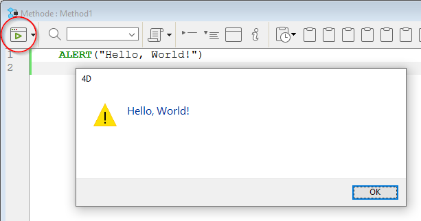

Usando a linguagem 4D, imprimir a mensagem tradicional ""Hello, world!" na tela pode ser feito de várias maneiras. A maneira mais simples é provavelmente escrever a linha única abaixo em um método de projeto:

```4d
ALERT("Hello, World!")
```

Esse código vai exibir um alerta normal de plataforma com a mensagem "hello world" contendo um botão OK. Para executar o código, precisa clicar no botão de execução do editor de Método:



Ou poderia anexar esse código a um botão em um formulário e executar o formulário, nesse caso, clicar no botão exibira a caixa de diálogo de alerta. Em qualquer caso, acabou de executar sua primeira linha de código 4D!

## Atribuir valores

Dados podem ser colocado ou copiados de ou em variáveis, campos, elementos arrays... Colocar dados em uma variável é chamado atribuiindo os dados a uma variável e é feito com o operador de atribuição (:=). O operador de atribuição também é usado para atribuir dados para elementos campos ou arrays.

```4d
$MyNumber:=3 //assigns 3 to MyNumber variable  
[Products]Size:=$MyNumber //assigns MyNumber variable to [Products]Size field
arrDays{2}:="Tuesday" //assigns "Tuesday" string to the 2nd arrDays element
MyVar:=Length("Acme") //assigns the result of the function (4) to MyVar
$myDate:=!2018/01/21! //assigns a date literal
$myHour:=?08:12:55? //assigns a time literal
```

Você DEVE diferenciar o operador atribuição := dos outros operadores. Ao invés de combinar expressões a uma nova, o operador de atribuição copia o valor da expressão para a direita do operador de atribuição para a variável ou campo para a esquerda do operador.

**Important:** Do NOT confuse the assignment operator := with the equality comparison operator =. Um operador de atribuição diferente (e não =) foi escolhido deliberadamente para evitar problemas e confusão que ocorrem frequentemente em outras linguagens com operadores como == ou ===. Esses erros são geralmente difíceis de reconhecer pelo compilador e geram problemas trabalhosos.

## Variáveis.

A linguagem 4D é baseada em tipos, mas com alguma flexibilidade. You create a typed variable using the `var` keyword. Por exemplo, para criar uma variável do tipo dados, pode escrever:

```4d
var MyDate : Date
```

The `var` keyword allows declaring object variables of a defined class type, for example:

```4d
var myPerson : cs.Person
//variable of the Person user class
```

Mesmo geralmente não sendo recomendado, é possível criar variáveis simplesmente usando-as; não precisa defini-las formalmente como se faz com campos. Por exemplo, se quiser criar uma variável que contenha a data atual mais 30 dias, pode escrever:

```4d
MyOtherDate:=Current date+30
```

A linha de código lê “MyOtherDate gets the current date plus 30 days.” Essa linha cria a variável e a atribuiu com o tipo de data (temporário) e um conteúdo. Uma variável criada por atribuição é interpretada como sem tipo, ou seja, pode ser atribuída com outros tipos em outras linhas e então muda o tipo dinamicamente. A variable typed with `var` cannot change the type. In [compiled mode](interpreted.md) however, the type can never be changed, regardless of how the variable was declared.

## Comandos

Os comandos 4D são métodos integrados para realizar uma ação. Comandos são frequentemente usados com parâmetros, que são passados em parênteses () e separados por ponto e vírgula (;). Exemplo:

```4d
COPY DOCUMENT("folder1\\name1";"folder2\\" ; "new")
```

Alguns comandos são anexados à coleções ou objetos, em cujo caso são métodos temporais que se utilizam com a notação de pontos. Por exemplo:

```4d
$c:=New collection(1;2;3;4;5)
$nc:=$c.slice(0;3) //$nc=[1,2,3]  

$lastEmployee:=$employee.last()
```

Pode utilizar os plug-ins ou os componentes 4D que adicionem novos comandos a seu entorno de desenvolvimento 4D.

Há vários plug-ins propostos pela comunidade de usuários 4D ou desenvolvedores de terceira parte no mercado. For example, using the [4d-plugin-pdf-pages](https://github.com/miyako/4d-plugin-pdf-pages) on macOS:

```4d
PDF REMOVE PAGE(path;page)
```

4D SVG é um exemplo de componente utilitário que aumenta as capacidades de sua aplicação:

```4d
//desenhar uma imagem
svgRef:=SVG_New
objectRef:=SVG_New_arc(svgRef;100;100;90;90;180)
```

4D SVG é incluído em 4D.

## Constantes

4D oferece um conjunto extensivo de constantes predefinidas, cujos valores são acessíveis por nome. Isso permite escrever código mais legível. For example, `Read Mode` is a constant (value 2).

```4d
vRef:=Open document("PassFile";"TEXT";Read Mode) // abre documento em modo apenas leitura
```

> As constantes pré-definidas aparecem sublinhadas como padrão no editor de métodos 4D.

## Página Métodos

4D provides a large number of built-in methods (or commands) but also lets you can create your own **project methods**. Os métodos de projeto são métodos definidos pelo usuário que contenham comandos, operadores e outras partes da linguaje.
Los métodos projeto são métodos genéricos, mas há outros tipos de métodos: métodos objeto, métodos formulário, métodos tabela (Triggers) e métodos base.

Um método projeto é composto de várias linhas de instruções, cada uma das quais consta de uma linha no método. Uma linha de instrução realiza uma ação e pode ser simples ou complexa.

Por exemplo, a linha abaixo é uma declaração que mostará uma caixa de diálogo de confirmação:

```4d
CONFIRM("Quer realmente fechar esta conta?"; "Sím"; "Não")
```

Um método também contém testes e loops que controlam o fluxo da execução. 4D methods support `If...Else...End if` and `Case of...Else...End case` branching structures as well as looping structures: `While...End while`, `Repeat...Until`, `For...End for`, and `For each...End for each`:

O exemplo abaixo recorre todos os caracteres do texto vtSomeText:

```4d
For($vlChar;1;Length(vtSomeText))
	//Do something with the character if it is a TAB


	If(Character code(vtSomeText[[$vlChar]])=Tab)
		//...
	End if
End for
```

Um método projeto pode chamar a outro método projeto com ou sem parâmetros (argumentos). Os parâmetros se passam ao método entre parêntesis, depois do nome do método. Cada parâmetro está separado do próximo por um ponto e vírgula (;). A method can return a single value in a parameter, which have to be declared. Os parâmetros estão disponíveis dentro do método chamado como variáveis locais numeradas sequencialmente: $1, $2,..., $n. Um método pode devolver um único valor no parâmetro $0. Quando chamar um método, apenas digite seu nome:

```4d
$myText:="hello"
$myText:=Do_Something($myText) //Call the Do_Something method
ALERT($myText) //"HELLO"

  //Here the code of the method Do_Something  
#DECLARE ($in : Text) -> $out : Text
$out:=Uppercase($in)
```

## Tipos de dados

Na linguagem, os diferentes tipos de dados que podem ser manejados são denominados tipos de dados. Existem tipos de dados básicos (string, numérico, data, hora, booleano, imagem, ponteiros, arrays), e também tipos de dados compostos (BLOBs, objetos, coleções).

Lembre que os dados de tipo string e numérico podem ser associados a mais de um tipo de campo. Quando são introduzidos dados em um campo, a linguagem converte automaticamente os dados no tipo correto para o campo. Por exemplo, se um campo inteiro for usado, seus dados são tratados automaticamente como numéricos. Em outras palavras não precisa se preocupar sobre misturar tipos de campos similares quando usando a linguagem; vai ser gerenciada por você.

Entretanto, quando usar a linguagem é importante que não misture diferentes tipos de dados. Da mesma forma que não tem sentido armazenar "ABC" em um campo de data, tampouco tem sentido por "ABC" em uma variável utilizada para datas. Na maioria dos casos, 4D é muito tolerante e tentará dar sentido ao que está fazendo. Por exemplo, se adicionar um número a uma data, 4D assumirá que quer adicionar esse número de dias à data, mas se tentar adicionar uma string a uma data, 4D dir-lhe-á que a operação não pode funcionar.

Há casos em que é necessário armazenar dados como um tipo e utilizá-los como outro tipo. A linguagem contém um conjunto completo de comandos que permitem a conversão de um tipo de dados para outro. Por exemplo, pode ser necessário criar um número de peça que comece com um número e termine com caracteres como "abc". Neste caso, poderá escrever:

```4d
[Products]Part Number:=String(Number)+"abc"
```

If _Number_ is 17, then _[Products]Part Number_ will get the string “17abc”.

The data types are fully defined in the section [Data Types](Concepts/data-types.md).

## Objectos e colecções

Pode manipular objectos e colecções da linguagem 4D utilizando a notação de objeto para obter ou definir os seus valores. Por exemplo:

```4d
employee.name:="Smith"
```

Também pode utilizar uma cadeia de caracteres entre parênteses rectos, por exemplo:

```4d
$vName:=employee["name"]
```

Uma vez que um valor de propriedade de objeto pode ser um objeto ou uma coleção, a notação de objeto aceita uma sequência de símbolos para acessar subpropriedades, por exemplo:

```4d
$vAge:=employee.children[2].age
```

Note-se que se o valor da propriedade do objeto for um objeto que encapsula um método (uma fórmula), é necessário adicionar parênteses () ao nome da propriedade para executar o método:

```
$f:=New object
$f.message:=Formula(ALERT("Hello world!"))
$f.message() //displays "Hello world!"
```

Para aceder a um elemento da collection, é necessário passar o número do elemento entre parênteses rectos:

```4d
C_COLLECTION(myColl)
myColl:=New collection("A";"B";1;2;Current time)
myColl[3]  //acesso ao 4º elemento da colecção
```

## Classes

A linguagem 4D suporta classes de objectos. Add a `myClass.4dm` file in the Project/Sources/Classes folder of a project to create a class named "myClass".

To instantiate an object of the class in a method, call the user class from the _class store_ (`cs`) and use the `new()` member function. É possível passar parâmetros.

```4d
// num método 4D
$o:=cs.myClass.new()
```

In the `myClass` class method, use the `Function <methodName>` statement to define the _methodName_ class member function. A class member function can receive and return parameters like any method, and use `This` as the object instance.

```4d

//in the myClass.4dm file
Function hello -> $welcome : Text
  $welcome:="Hello "+This.who
```

To execute a class member function, just use the `()` operator on the member function of the object instance.

```4d
$f:=New object
$f.message:=New formula(ALERT("Hello world!"))
$f.message() //displays "Hello world!"
```

Optionally, use the `Class constructor` keyword to declare properties of the object.

```4d
//in the Rectangle.4dm file
Class constructor ($width : Integer; $height : Integer)
This.height:=$height
This.width:=$width
This.name:="Rectangle"
```

A class can extend another class by using `Class extends <ClassName>`. Superclasses can be called using the `Super` command. Por exemplo:

```4d
//in the Square.4dm file Class extends rectangle Class constructor($length : Integer)

  // It calls the parent class's constructor with lengths   
  // provided for the Rectangle's width and height Super($length;$length) This.name:="Square"
```

## Operadores

Quando se utiliza a linguagem, é raro que se pretenda apenas um dado. É mais provável que queira fazer algo com esses dados ou a partir deles. Estes cálculos são efectuados com operadores. Os operadores, em geral, pegam em dois dados e efetuam uma operação sobre eles que resulta num novo dado. Já está familiarizado com muitos operadores. You are already familiar with many operators. You are already familiar with many operators.

| Operador | Operação      | Exemplo    |
| -------- | ------------- | ---------- |
| -        | Adição        | 1 +2 = 3   |
| –        | Subtração     | 3 - 2 = 1  |
| *        | Multiplicação | 2 \* 3 = 6 |
| /        | Divisão       | 6 / 2 = 3  |

Os operadores numéricos são apenas um dos tipos de operadores disponíveis. 4D suporta muitos tipos de dados, tais como números, texto, datas e imagens, por isso há operadores que realizam operações nestes diferentes tipos de dados.

Os mesmos símbolos são frequentemente utilizados para operações diferentes, consoante o tipo de dados. Por exemplo, o sinal de mais (+) efetua operações diferentes com dados diferentes:

| Tipo de dados | Operação       | Exemplo                                                                                                        |
| ------------- | -------------- | -------------------------------------------------------------------------------------------------------------- |
| Number        | Adição         | 1 + 2 adiciona os números e resultados em 3                                                                    |
| String        | Concatenação   | "Hello " + "there" concatena (junta) as cadeias de caracteres e resulta em "Hello there"    |
| Data e Número | Adição de data | !1989-01-01! + 20 acrescenta 20 dias à data de 1 de janeiro de 1989 e resulta na data de 21 de janeiro de 1989 |

## Expressões

Em termos simples, as expressões retornam um valor. De facto, quando se usa a linguagem 4D, usa-se expressões a toda a hora e tende-se a pensar nelas apenas em termos do valor que representam. As expressões também são conhecidas como fórmulas.

As expressões são compostas por quase todas as outras partes da linguagem: comandos, operadores, variáveis, campos, propriedades de objetos e elementos de coleções. Utiliza expressões para escrever linhas de código, que por sua vez são utilizadas para construir os métodos. A linguagem utiliza expressões sempre que necessita de um dado.

As expressões raramente são "autónomas." Há vários sítios em 4D onde uma expressão pode ser usada por si só. Inclui:

- Editor de fórmulas (apply formula, query with formula, order by formula)
- The `EXECUTE FORMULA` command
- A lista de propriedades, onde uma expressão pode ser usada como fonte de dados para a maioria dos widgets
- Depurador onde o valor das expressões pode ser verificado
- Editor de relatórios rápidos como uma fórmula para uma coluna

### Tipos de expressões

Refere-se a uma expressão pelo tipo de dados que devolve. Existem vários tipos de expressão. A tabela seguinte apresenta exemplos de cada tipo de expressão.

| Expression                                                                                | Tipo                 | Descrição                                                                                                                                                                                                                                    |
| ----------------------------------------------------------------------------------------- | -------------------- | -------------------------------------------------------------------------------------------------------------------------------------------------------------------------------------------------------------------------------------------- |
| “Hello”                                                                                   | String               | A palavra Hello é uma constante cadeia de caracteres, indicada pelas aspas duplas.                                                                                                                                           |
| “Hello ” + “there”                                                                        | String               | Duas cadeias, "Hello " e "there", são adicionadas (concatenadas) com o operador de concatenação de cadeias (+). É devolvida a cadeia de caracteres "Hello there".      |
| “Sr. ” + [People]Name | String               | São concatenadas duas cadeias: a cadeia "Mr. " e o valor atual do campo Name na tabela People. Se o campo contiver "Smith", a expressão devolve "Mr. Smith". |
| Uppercase("smith")                                                     | String               | This expression uses `Uppercase`, a command from the language, to convert the string “smith” to uppercase. Retorna "SMITH".                                                                                  |
| 4                                                                                         | Number               | Esta é uma constante numérica, 4.                                                                                                                                                                                            |
| 4 \* 2                                                                                    | Number               | Dois números, 4 e 2, são multiplicados utilizando o operador de multiplicação (\*). O resultado é o número 8.                                                                             |
| myButton                                                                                  | Number               | Esta é uma variável associada a um botão. Devolve o valor atual do botão: 1 se foi clicado, 0 se não foi.                                                                                    |
| !1997-01-25!                                                                              | Date                 | Esta é uma constante data para a data 1/25/97 (25 de janeiro de 1997).                                                                                                                                    |
| Current date+ 30                                                                          | Date                 | This is a date expression that uses the `Current date` command to get today’s date. Adiciona 30 dias à data de hoje e devolve a nova data.                                                                   |
| ?8:05:30?                                                 | Hora                 | Esta é uma constante de tempo que representa 8 horas, 5 minutos e 30 segundos.                                                                                                                                               |
| ?2:03:04? + ?1:02:03?     | Hora                 | Esta expressão soma dois horas e devolve a hora 3:05:07.                                                                                                                                     |
| True                                                                                      | Parâmetros           | Este comando devolve o valor Booleano TRUE.                                                                                                                                                                                  |
| 10 # 20                                                                                   | Parâmetros           | Trata-se de uma comparação lógica entre dois números. O sinal de número (#) significa "não é igual a". Como 10 "não é igual a" 20, a expressão devolve TRUE.              |
| “ABC” = “XYZ”                                                                             | Parâmetros           | Trata-se de uma comparação lógica entre duas cadeias. Não são iguais, pelo que a expressão devolve FALSE.                                                                                                    |
| My Picture + 50                                                                           | Imagem               | Esta expressão pega na imagem em My Picture, move-a 50 píxeis para a direita e devolve a imagem resultante.                                                                                                                  |
| ->[People]Name                        | Ponteiro             | Esta expressão devolve um ponteiro ao campo chamado [People]Name.                                                                                                        |
| Table(1)                                                               | Ponteiro             | Este é um comando que devolve um ponteiro para a primeira tabela.                                                                                                                                                            |
| JSON Parse (MyString)                                                  | Object               | Este é um comando que devolve MyString como um objeto (se o formato é adequado)                                                                                                                                           |
| JSON Parse (MyJSONArray)                                               | Collection           | Este é um comando que devolve MyJSONArray como uma coleção (se o formato é adequado)                                                                                                                                      |
| Form.pageNumber                                                           | Propriedade objecto  | Uma propriedade objeto é uma expressão que pode ser de qualquer tipo suportado                                                                                                                                                               |
| Col[5]                                | Elemento de colecção | Um elemento de coleção é uma expressão que pode ser de qualquer tipo suportado                                                                                                                                                               |
| $entitySel[0]                         | Entity               | Um elemento de uma seleção de entidade ORDA é uma expressão do tipo entidade. This kind of expression is **non-assignable**                                                                                                  |

### Expressões atribuíveis vs expressões não atribuíveis

An expression can simply be a literal constant, such as the number 4 or the string "Hello", or a variable like `$myButton`. Também pode utilizar operadores. Por exemplo, 4 + 2 é uma expressão que utiliza o operador de adição para somar dois números e devolver o resultado 6. In any cases, these expressions are **non-assignable**, which means that you cannot assign a value to them.
In 4D, expressions can be **assignable**. Uma expressão é atribuível quando pode ser utilizada no lado esquerdo de uma atribuição. Por exemplo:

```4d
//$myVar variable is assignable, you can write:  
$myVar:="Hello" //assign "Hello" to myVar
//Form.pageNumber is assignable, you can write: Form.pageNumber:=10 //assign 10 to Form.pageNumber
//Form.pageTotal-Form.pageNumber is not assignable: Form.pageTotal- Form.pageNumber:=10 //error, non-assignable
```

Em geral, as expressões que utilizam um operador não são atribuíveis. For example, `[Person]FirstName+" "+[Person]LastName` is not assignable.

## Ponteiro

A linguagem 4D fornece uma implementação avançada de ponteiros, que permite escrever código poderoso e modular. É possível utilizar ponteiros para referenciar tabelas, campos, variáveis, arrays e elementos de arrays.

A pointer to an element is created by adding a "->" symbol before the element name, and can be dereferenced by adding the "->" symbol after the pointer name.

```4d
MyVar:="Hello"
MyPointer:=->MyVar
ALERT(MyPointer->)
```

## Código em várias linhas

You can write a single statement on several lines by terminating each line of the statement with a trailing backslash `\` character. A linguagem 4D considera todas as linhas de uma só vez. Por exemplo, as duas declarações seguintes são equivalentes:

```4d
$str:=String("hello world!")
```

```4d
$str:=String("hello"+\
" world"+\
+"!")
```

## Comentários

Os comentários são linhas de código inactivas. Estas linhas não são interpretadas pela linguagem 4D e não são executadas quando o código é chamado.

Existem duas formas de criar comentários:

- `//` for single line comments
- `/*...*/` para comentarios em linha ou multilinha.

Ambos os estilos de comentários podem ser utilizados em simultâneo.

#### Single line comments (`//comment`)

Insert `//` at the beginning of a line or after a statement to add a single line comment. Exemplo:

```4d
//This is a comment For($vCounter;1;100) //Starting loop
  //comment
  //comment
  //comment
 End for
```

#### Inline or multiline comments (`/*comment*/`)

Surround contents with `/*` ... `*/` characters to create inline comments or multiline comment blocks. Both inline and multiline comment blocks begin with `/*` and end with `*/`.

- **Inline comments** can be inserted anywhere in the code. Exemplo:

```4d
For /* inline comment */ ($vCounter;1;100)
	...
End for
```

- **Multiline comment blocks** allows commenting an unlimited number of lines. Os blocos de comentários podem ser aninhados (o que é útil, já que o editor de código 4D suporta blocos condensados). Exemplo:

```4d
For ($vCounter;1;100)
/*
comments  
	/*
	other comments
	*/
*/
...
End for
```

## Sequências de escape

A linguagem 4D permite-lhe usar sequências de escape (também chamadas caracteres de escape). Uma sequência de escape é uma sequência de caracteres que pode ser utilizada para substituir um carácter "especial".

The sequence consists of a backslash `\`, followed by a character. For instance, `\t` is an escape sequence for the **Tab** character. Escape sequences facilitate the entry of special characters: the previous example (`\t`) replaces the entry "Character(Tab)".

Em 4D, podem ser utilizadas as seguintes sequências de escape:

| Escape sequence | Carácter substituído                      |
| --------------- | ----------------------------------------- |
| `\n`           | LF (Avanço de linha)   |
| `\t`           | HT (Tab)               |
| `\r`           | CR (Carriage return)   |
| `\\`          | `\` (Barra invertida) |
| `\"`           | " (aspas)              |

> É possível utilizar maiúsculas ou minúsculas nas sequências de escape.

In the following example, the **Carriage return** character (escape sequence `\r`) is inserted in a statement in order to obtain a dialog box:

`ALERT("The operation has been completed successfully.\rYou may now disconnect.")`
