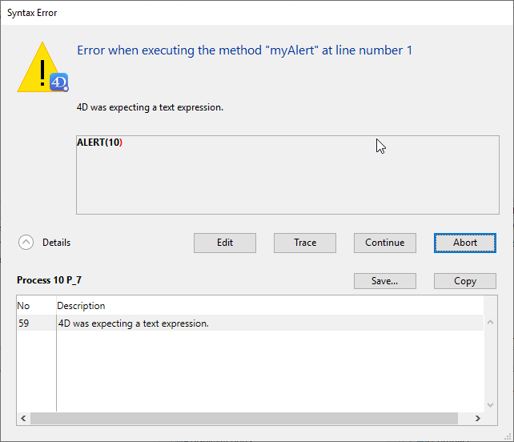

Os erros são comuns. It would be unusual to write a substantial number of lines of code without generating any errors. Por outro lado, tratar e/ou corrigir erros também é normal!

The 4D development environment provides several debugging tools for all types of errors.

## Tipos de erro

### Erros de dactilografia

Os erros de digitação são detectados pelo editor de código. They are displayed in red and additional information is provided at the bottom of the window. Aqui está um erro de dactilografia:

Such typing errors usually cause syntax errors (in the above image, the name of the table is unknown). You get the description of the error when you validate the line of code. Quando isso ocorrer, corrija o erro de digitação e digite Enter para validar a correção.

### Erros de sintaxe

Some errors can be caught only when you execute the method. The [Syntax Error Window](#syntax-error-window) appears when an error occurs during code execution. Por exemplo:

Expand the **Details** area to display the last error and its number.

### Environmental Errors

Ocasionalmente, pode não haver memória suficiente para criar um BLOB. Ou, quando se acede a um documento no disco, o documento pode não existir ou pode já estar aberto por outra aplicação. Estes erros ambientais não ocorrem diretamente devido ao seu código ou à forma como o escreveu. Na maior parte das vezes, estes erros são fáceis de tratar com um [método de deteção de erros](Concepts/error-handling.md) instalado através do comando `ON ERR CALL`.

### Erros de concepção ou de lógica

Estes são geralmente o tipo de erro mais difícil de encontrar. Com exceção dos erros de digitação, todos os tipos de erros acima enumerados são, em certa medida, abrangidos pela expressão "erro de conceção ou de lógica". Utilize o depurador  para os detectar. Por exemplo:

- Pode ocorrer um *erro de sintaxe* quando tenta utilizar uma variável que ainda não foi inicializada.
- An *environmental error* can occur when you try to open a document, because that document's name is received by a subroutine that did not get the right value as a parameter.

Os erros de concepção ou lógicos incluem também situações como:

- Um registo não é corretamente atualizado porque, ao chamar `SAVE RECORD`, se esqueceu de testar primeiro se o registo estava ou não bloqueado.
- Um método não faz exatamente o que se espera, porque a presença de um parâmetro opcional não é testada.

Por vezes, a parte do código que apresenta o erro pode ser diferente do código que está efetivamente na origem do problema.

### Erros de execução

No modo Aplicação, pode obter erros que não se vêem no modo interpretado. Aqui está um exemplo:

Para encontrar rapidamente a origem do problema, reabrir a versão interpretada do ficheiro da estrutura, abrir o método e ir para a linha correspondente.

## Janela de erro sintáctico

A janela erro de sintaxe aparece automaticamente quando a execução de um método é interrompida. Isto pode acontecer quando:

- um erro impede a continuação da execução do código
- o método produz uma afirmação falsa (ver o comando `ASSERT`)

A área de texto superior apresenta uma mensagem que descreve o erro. A área de texto inferior mostra a linha que estava a ser executada quando ocorreu o erro; a área onde ocorreu o erro é realçada. A secção Detalhes expandidos contém a "pilha" de erros relacionados com o processo.

A janela de erro de sintaxe propõe várias opções:

- **Editar**: Pára toda a execução do método. 4D switches to the Design environment and the method with the error opens in the Code Editor, allowing you to fix it. Utilize esta opção quando reconhecer imediatamente o erro e puder corrigi-lo sem mais investigações.

- **Trace**: Entra no modo Trace/Debugger. É apresentada a janela [Debugger](debugger.md). Se a linha atual só tiver sido executada parcialmente, poderá ter de clicar várias vezes no botão **Trace**.

- **Continuar**: A execução continua. A linha com o erro pode ser parcialmente executada, dependendo da localização do erro. Continue com cuidado: o erro pode impedir que o resto do seu método seja executado corretamente. Recomendamos clicar em **Continuar** apenas se o erro estiver numa chamada trivial (como `SET WINDOW TITLE`) que não impede a execução e o teste do resto do código.

> Sugestão: Para ignorar um erro que ocorre repetidamente (por exemplo, em loops), pode transformar o botão **Continuar** num botão **Ignorar**. Mantenha pressionada a tecla **Alt** (Windows) ou **Opção** (macOS) e clique no botão **Continuar** na primeira vez que ele aparecer. A etiqueta do botão muda para **Ignorar** se a caixa de diálogo for chamada novamente para o mesmo erro.

- **Abortar**: Interrompe a execução do método e regressa ao estado anterior ao início da execução do método:

    - Se um método formulário ou um método objeto estiver a ser executado em resposta a um evento, é interrompido e o usuário regressa ao formulário.
    - If the method is executing from within the Application environment, you return to that environment.

- **Copiar**: Copia as informações de depuração para a área de transferência. A informação descreve o ambiente interno do erro (número, componente interno, etc.). Eles são formatados como texto tabulado.

- **Guardar...**: Guarda o conteúdo da janela de erros de sintaxe e a cadeia de chamadas num ficheiro `.txt`.

## Depurador

Um erro comum de principiante ao lidar com a detecção de erros é clicar em **Abortar** na Janela de Erro de Sintaxe, voltar ao Editor de Código e tentar descobrir o que acontece olhando para o código. Não faça isso! Poupará muito tempo e energia se utilizar sempre o **Depurador**.

O depurador permite-lhe percorrer os métodos lentamente. Apresenta todas as informações necessárias para compreender o motivo do erro. Assim que tiver esta informação, saberá como corrigir o erro.

Outra razão para utilizar o depurador é para desenvolver código. Por vezes, pode escrever um algoritmo que é mais complexo do que o habitual. Apesar de todos os sentimentos de realização, não pode ter a certeza absoluta de que a sua codificação está 100% correcta. Em vez de o executar "às cegas", pode utilizar o comando `TRACE` no início do seu código e, em seguida, executá-lo passo a passo para ficar atento ao que acontece.

## Rupturas

No processo de depuração, pode ser necessário saltar o rastreio de algumas partes do código até uma determinada linha. Ou, pode querer rastrear o código quando uma dada expressão tem um certo valor (por exemplo, "$myVar > 1000"), ou cada vez que um comando 4D específico é chamado.

These needs are covered by **breakpoints** and **command catching** features. Podem ser configurados a partir do editor de código, do depurador ou do explorador de execução.