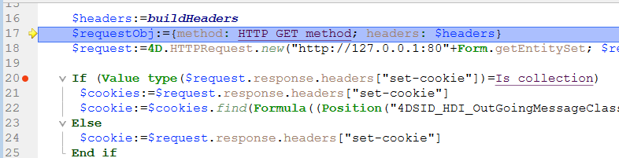

## Visão Geral

Os pontos de interrupção e a captura de comandos são técnicas de depuração muito eficientes. Ambas têm o mesmo efeito: fazem uma pausa na execução do código (e apresentam a janela do depurador, se ainda não tiver sido apresentada) num passo pretendido.

Os pontos de interrupção são definidos em qualquer linha de código onde se pretenda que a execução seja interrompida. É possível associar uma condição ao ponto de interrupção.

A captura de um comando permite começar a rastrear a execução de qualquer processo assim que um comando for chamado por esse processo.

## Breakpoints

Para criar um ponto de interrupção, clique na margem esquerda do painel Código-fonte no depurador ou no Editor de código.

In the following example, a break point (the red bullet) has been set, in the debugger, on the line `If (Value type(request.reponse.headers...`:

No exemplo acima, clicar no botão [**No Trace**](./debugger.md/#no-trace) retoma a execução normal até a linha marcada com o ponto de interrupção. Essa linha não é executada - o usuário é levado de volta ao modo de rastreio. Definir un punto de interrupción más allá del contador del programa y hacer clic en el botón **No Trace** le permite saltar las partes del método que se está rastreando.

Para remover um ponto de interrupção, clique no marcador correspondente.

### Propriedades do ponto de interrupção

Pode editar o comportamento de um ponto de interrupção utilizando a janela Propriedades do ponto de paragem:

Esta ventana está disponible en el Editor de Código o en la [ventana de código fuente](debugger.md#source-code-pane). Pode:

- haga clic derecho en una línea y seleccione **Modificar el punto de interrupción** en el menú contextual, o
- `Alt+clic` (Windows) o `Opción+clic` (macOS) en el margen izquierdo.

Se já existir um ponto de paragem, a janela é apresentada para esse ponto de paragem. Caso contrário, é criado um ponto de paragem e a janela é apresentada para o novo ponto de paragem criado.

Segue-se uma descrição das propriedades:

- **Ubicación**: indica el nombre del método y el número de línea que se adjunta al punto de interrupción.
- **Interrumpir cuando la siguiente expresión es true**: puede crear los **puntos de interrupción condicionales** introduciendo una fórmula 4D que devuelva `True` o `False`. Por ejemplo, inserte `Records in selection(\[aTable])=0` para asegurarse de que la ruptura se produce sólo si no hay ningún registro seleccionado para la tabla \[aTable]. Las condiciones de los puntos de interrupción están disponibles en la columna **Condición** de la [lista de interrupciones](#break-list).
- **Número de veces que hay que saltar antes de romper**: puede asociar un punto de ruptura a una línea situada en una estructura de bucle (While, Repeat o For) o situada en una subrutina o función llamada desde dentro de un bucle.
- **Punto de ruptura desactivado**: si actualmente no necesita un punto de ruptura, pero podría necesitarlo más adelante, puede desactivarlo temporalmente. Um ponto de interrupção desativado aparece como um traço (-) em vez de um marcador (-)|.

### Pontos de interrupção na depuração remota

A lista de pontos de paragem é armazenada localmente. No modo de depuração remota, se o depurador anexado for um 4D remoto, a lista de pontos de interrupção remota substitui temporariamente a lista de pontos de interrupção do servidor durante a sessão de depuração.

A lista de pontos de paragem do servidor é automaticamente restaurada se voltar a ser o depurador ligado.

### Lista de pausas

A lista de interrupções é uma página do explorador do tempo de execução que lhe permite gerir os pontos de interrupção criados na janela do depurador ou no editor de código. Para más información sobre el Explorador de ejecución, consulte su página dedicada en [el manual de Diseño](https://doc.4d.com/4Dv19/4D/19/Runtime-Explorer.200-5416614.en.html).

Para abrir a página da lista de pontos de interrupção:

1. En el **menú Ejecutar**, haga clic en el **Explorador de ejecución...**

2. Haga clic en la pestaña **Break** para mostrar la lista de pausas:

Usando esta janela, pode:

- Definir las condiciones para los puntos de interrupción en la columna **Condiciones**
- Ative ou desative os pontos de interrupção clicando nos marcadores na margem. Os pontos de interrupção desactivados apresentam marcadores transparentes
- Elimine los puntos de interrupción presionando la tecla `Delete` o `Backspace`, o haciendo clic en el botón **Delete** bajo la lista.
- Abrir os métodos onde se encontram os pontos de interrupção fazendo duplo clique em qualquer linha da lista

Não é possível adicionar novos pontos de paragem a partir desta janela. Os pontos de paragem só podem ser criados a partir da janela do depurador ou do editor de código.

## Comandos de captura

La pestaña **Catch** del Explorador de ejecución le permite añadir pausas adicionales a su código mediante la captura de llamadas a comandos 4D. Ao contrário de um ponto de interrupção, que está localizado em um método particular do projeto (e, portanto, desencadeia uma exceção de rastreamento apenas quando é alcançado), o escopo de captura de um comando inclui todos os processos que executam o código 4D e chamam esse comando.

A captura de um comando é uma forma conveniente de rastrear grandes porções de código sem definir pontos de interrupção em locais arbitrários. Por ejemplo, si un registro que no debería ser eliminado se borra después de haber ejecutado uno o varios procesos, puede intentar reducir el campo de su investigación vía puntos de interrupción en los comandos como `DELETE RECORD` and `DELETE SELECTION`. Cada vez que estes comandos forem chamados, é possível verificar se o registo em questão foi eliminado e, assim, isolar a parte defeituosa do código.

Pode combinar pontos de interrupção e captura de comandos.

Para abrir a página Comandos apanhados:

1. Elija **Ejecutar** > **Explorador de ejecución...** para abrir el Explorador de ejecución.

2. Haga clic en **Catch** para mostrar la lista de puntos de interrupción en los comandos:

Esta página lista os comandos que devem ser capturados durante a execução. É composto por duas colunas:

- A coluna da esquerda mostra o estado de ativação/desativação do ponto de interrupção no comando, seguido pelo nome do comando
- A coluna da direita mostra a condição associada ao ponto de interrupção do comando, se houver

Para adicionar um ponto de interrupção personalizado:

1. Haga clic en el botón **Add New Catch** (en forma de +) situado debajo de la lista. Se añade una nueva entrada a la lista con el comando `ALERT` por defecto
2. Haga clic en la etiqueta **ALERT**, escriba el nombre del comando en el cual desea poner un punto de interrupción y pulse **Enter**.

Para ativar ou desativar um ponto de interrupção de ordem, clique no ponto (-) na frente da etiqueta do comando.
A bala é transparente quando o controle é desativado.

> Desativar um ponto de interrupção no comando tem praticamente o mesmo efeito que excluí-lo. Durante a execução, o depurador quase não passa tempo na entrada. A vantagem de desativar uma entrada é que não tem de a recriar quando voltar a precisar dela.

Para remover um ponto de interrupção no comando:

1. Seleccione um comando na lista.
2. Presione la tecla **Backspace** o **Delete** en su teclado o haga clic en el botón **Delete** bajo la lista (**Delete All** elimina todos los comandos en la lista).

### Definir uma condição para um ponto de interrupção no comando

1. Clique na entrada na coluna da direita
2. Introduza uma fórmula 4D (expressão, chamada comando ou método de projeto) que devolve um valor booleano.

> Para remover uma condição, elimine a sua fórmula.

A adição de condições permite-lhe parar a execução quando o comando é invocado apenas se a condição for cumprida. Por exemplo, se você associar a condição `Records in selection(\[Emp]>10)` ao ponto de interrupção do comando `DELETE SELECTION`, o código não será interrompido durante a execução do comando `DELETE SELECTION` se a seleção atual da tabela \[Emp] contiver apenas 9 registros (ou menos).

A adição de condições a pontos de interrupção em comandos torna a execução mais lenta, pois a condição precisa ser avaliada toda vez que uma exceção é encontrada. Por outro lado, adicionar condições acelera o processo de depuração, porque 4D automaticamente ignora ocorrências que não correspondem às condições.
