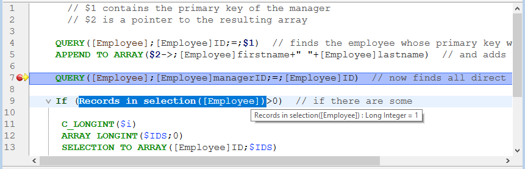
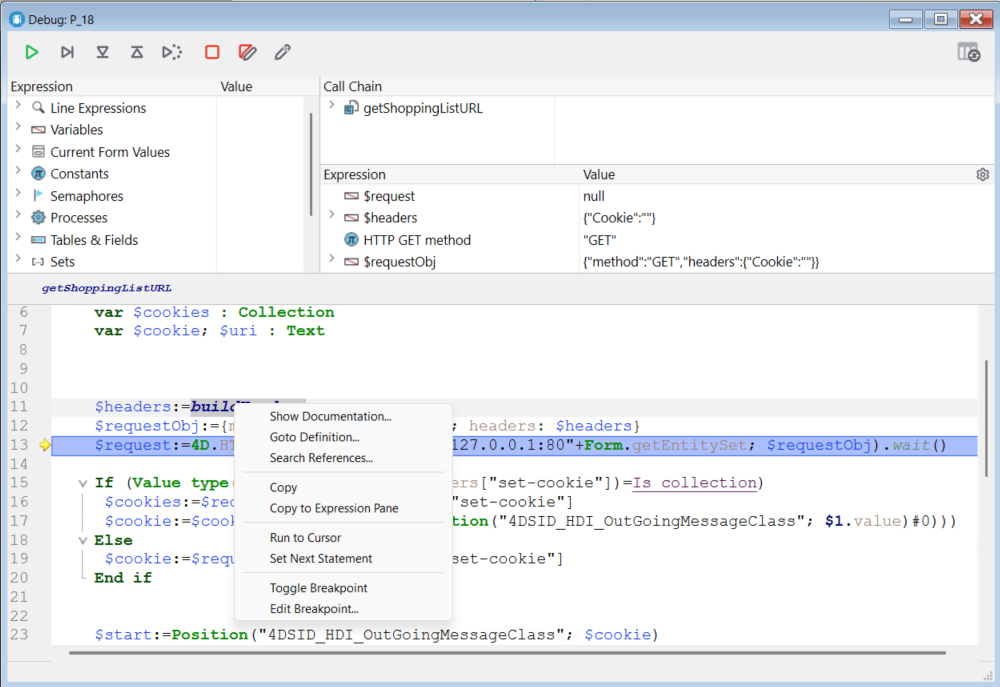

O depurador é útil quando é necessário detetar erros ou monitorizar a execução de métodos. Permite-lhe percorrer o seu código lentamente e examinar a informação. Este processo é designado por "rastreio".


## Chamando o depurador

Há várias formas de exibir o depurador:

- Haciendo clic en el botón **Trace** en [la ventana de errores de sintaxis](basics.md#syntax-error-window)
- Usando o comando [`TRACE`](https://doc.4d.com/4dv19/help/command/en/page157.html)
- Haciendo clic en el botón **Debug** en la ventana de ejecución del método o seleccionando **Run and debug...** en el Code Editor
- Utilizando **Alt+Shift+Clic derecho** (Windows) o **Ctrl+Option+Cmd+Clic** (macOS) mientras se ejecuta un método, seleccionando entonces el proceso a rastrear en el menú emergente:


- Haciendo clic en el botón **Trace** cuando se selecciona un proceso en la página de procesos del Explorador de ejecución.
- Adicionar um ponto de interrupção na janela do Editor de código ou nas páginas Break e Catch do Explorador de execução.

Quando chamada, a janela do depurador fornece o nome do método ou da função de classe que rastreia atualmente e a ação que causa o aparecimento inicial da janela do depurador. Por exemplo, na janela do depurador acima:

- _Clients_BuildLogo_ es el método en que se hace seguimiento
- La ventana del depurador apareció porque detectó una llamada al comando `C_PICTURE` y este comando fue uno de los a identificar

A exibição de uma nova janela do depurador utiliza a mesma configuração que a última janela exibida na mesma sessão. Se executar vários processos usuário, pode rastreá-los de forma independente e ter uma janela do depurador aberta para cada processo.

A janela do depurador é normalmente apresentada na máquina onde o código é executado. Com uma aplicação monousuário, é sempre apresentado na máquina que executa a aplicação. Com uma aplicação cliente/servidor, é apresentado:

- no 4D remoto para o código que está a ser executado localmente
- en la máquina del servidor para el código que se ejecuta en el servidor (por ejemplo, un método con la opción **Ejecutar en el servidor**).

> Se o servidor estiver a funcionar sem interface, não pode ser apresentada qualquer janela do depurador no servidor, pelo ser necessário utilizar o depurador remoto. Ver [Depuración desde máquinas remotas](./debugging-remote.md).

## Botões da barra de ferramentas

A barra de ferramentas do depurador inclui vários botões, associados a atalhos predefinidos:


> Os atalhos padrão podem ser personalizados na página Atalhos da caixa de diálogo Preferências.

#### Retomar execução

Interrompe o modo de rastreamento e retoma o curso normal da execução do método.

> **Shift** + **F5** o **Shift** + clic en el botón **No Trace** retoma la ejecución. Também desativa todas as chamadas TRACE subsequentes para o processo atual.

#### Executar passo a passo

Executa a linha de método atual, indicada pelo contador de programa (a seta amarela). O depurador passa para a linha seguinte.

O botão Executar não entra em sub-rotinas e funções, mantém-se ao nível do método que rastreia atualmente. Si desea también rastrear las llamadas a las subrutinas y a las funciones, utilice el botón **Paso a paso detallado**.

Na depuração remota, se o método for executado no servidor, o método principal é chamado após a execução da última linha do método secundário. Si el método padre se ejecuta en el lado remoto, el botón **Step Over** tiene el mismo efecto que el botón **No Trace**.

#### Passo a passo detalhado

Quando uma linha que chama outro método (sub-rotina ou função) é executada, clique neste botão para exibir o outro método e percorrê-lo.

El nuevo método se convierte en el método actual (superior) en la [Ventana cadena de llamada ](#call-chain-pane) de la ventana del depurador.

Cuando se ejecuta una línea que no llama a otro método, este botón tiene el mismo efecto que el botón **Ejectuar paso a paso**.

#### Step Out

If you are tracing subroutines and functions, clicking on this button allows you to execute the entire method currently being traced and to step back to the caller method. The Debugger window is brought back to the previous method in the call chain. If the current method is the last method in the call chain, the Debugger window is closed.

In remote debugging, on execution of the last line of the method, if the method is executed on the server, the parent method is called. If the parent method is executed on the remote side, the button acts in the same manner as the No Trace button.

#### Step Into Process

On execution of a line that creates a new process (i.e., calling the New process command), this button opens a new Debugger window that allows you to trace the process method of the newly created process. On execution of a line that does not creates a new process, this button acts in the same manner as the Step Over button.

#### Abortar

Interrompe a execução do método e regressa ao estado anterior ao início da execução do método:

- Ao rastrear um método formulário ou um método objeto em execução em resposta a um evento: pára e retorna ao formulário.
- Ao rastrear um método em execução no ambiente do aplicativo: pára e retorna ao ambiente.

#### Abortar e editar

El método que se está ejecutando cuando se presiona el botón **Abortar y Editar** se abre en el Editor de Código.

> **Consejo**: utilice este botón cuando sepa qué cambios son necesarios en su código, y el momento en que deben ser efectuados para proseguir con las pruebas de sus métodos. Quando terminar as alterações, volte a executar o método.

#### Editar

O método executado no momento em que se clica no botão Editar abre-se no Editor de código.

Se utilizar este botão para modificar um método, as modificações só entram em vigor na próxima vez que este for executado.

> **Consejo:** utilice este botón cuando sepa qué cambios son necesarios en su código y cuando no interfieran con el resto del código a ejecutar o rastrear.

#### Botão Salvar parâmetros

Salva a configuração atual da janela do depurador e a torna a configuração padrão. Isto inclui:

- o tamanho e a posição da janela
- a posição das linhas de divisão e o conteúdo da área que avalia as expressões

Estes parâmetros são armazenados no projeto.

Esta acción no está disponible en el modo de depuración remota (ver [Depuración desde máquinas remotas](./debugging-remote)).

## Janela de expressão

El **panel de expresión** se muestra en la esquina superior izquierda de la ventana del depurador, debajo de la barra de herramientas de control de ejecución. Aqui um exemplo simples:


> Este painel não está disponível no modo de depuração remota.

El **panel de expresión** muestra información general útil sobre el sistema, el entorno 4D y el entorno de ejecución.

La columna **Expression** muestra los nombres de los objetos y expresiones. La columna **Valor** muestra sus valores correspondientes actuales. Clicar em qualquer valor no lado direito do painel permite-lhe modificar o valor do objeto, se tal for permitido para esse objeto.

En cualquier momento, puede arrastrar y soltar temas, sublistas de temas (si las hay) y elementos de temas en el panel de expresión personalizado .

### Lista de expressões

#### Objetos linha

Este tema permite-lhe acompanhar os valores dos objetos ou expressões:

- utilizado en la línea de código a ejecutar (la marcada con el contador de programa-la flecha amarilla en el [Panel de Código Fuente](#source-code-pane)),
- utilizado na linha de código anterior

Como a linha de código anterior é a que acabou de ser executada antes, este tema mostra os objetos ou expressões da linha atual antes e depois da execução da linha.  Digamos que executa o seguinte método:

```4d
TRACE
$a:=1
$b:=a+1
$c:=a+b
```

1. Se abre una ventana Depurador con el contador del programa fijado en la línea con `a:=1`. En este punto aparece el tema **Objetos Línea**:

   | $a | Indefinido |
   | -- | ---------- |

   La variable `$a` aún no está inicializada, pero se muestra porque se utiliza en la línea que se va a ejecutar.

2. Haga clic en el botón **Step Over**. El contador del programa se pone ahora en la línea `b:=a+1`. At this point, the **Line Objects** theme displays:

   | $a | 1          |
   | -- | ---------- |
   | $b | Indefinido |

   El valor de la variable `$a` es ahora 1. La variable `$b` aún no está inicializada, pero se muestra porque se utiliza en la línea que se va a ejecutar.

3. Haga clic en el botón **Step Over** nuevamente. O contador do programa está agora definido na linha com $c:=a+b. the **Line Objects** theme displays:

   | $c | Indefinido |
   | -- | ---------- |
   | $a | 1          |
   | $b | 2          |

   El valor de la variable `$b` es ahora 2. La variable `$c` aún no está inicializada, pero se muestra porque se utiliza en la línea que se va a ejecutar.

#### Variáveis.

Este tema é composto pelos seguintes subtemas:

| Subtema       | Descrição                                                         | Os valores podem ser modificados? |
| ------------- | ----------------------------------------------------------------- | --------------------------------- |
| Interprocesso | Lista de variáveis interprocessos que são utilizadas agora        | Sim                               |
| Processo      | Lista de variáveis processo utilizadas pelo processo atual        | Sim                               |
| Local         | Lista de variáveis locais utilizadas pelo método rastreado        | Sim                               |
| Parâmetros    | Lista dos parâmetros recebidos pelo método                        | Sim                               |
| Self          | Ponteiro para o objeto atual, quando se rastreia um método objeto | Não                               |

Os arrays, como outras variáveis, aparecem nos subtemas Interprocesso, Processo e Local, dependendo do seu escopo. O depurador apresenta os primeiros 100 elementos. Dentro de la columna **Valor**, puede modificar los valores de los elementos del array, pero no el tamaño de los arrays.

Para mostrar los tipos de variables y sus nombres internos, haga clic derecho y marque la opción **Mostrar tipos** del menú contextual:


Aqui está o resultado:


#### Valores actuais do formulário

Este tema contém o nome de cada objeto dinâmico incluído no formulário atual, bem como o valor da sua variável associada:


Alguns objetos, como os arrays list box, podem ser apresentados como dois objetos distintos, a variável do próprio objeto e a sua fonte de dados.

#### Constantes

Como a página Constantes da janela Explorer, esse tema exibe as constantes predefinidas oferecidas pelo 4D. As expressões deste tema não podem ser modificadas.

#### Semáforos

Este tema lista os semáforos locais definidos atualmente. Para cada semáforo, a coluna Valor fornece o nome do processo que define o semáforo. As expressões deste tema não podem ser modificadas. The expressions from this theme cannot be modified.

#### Processos

Este tema enumera os processos iniciados desde o início da sessão de trabalho. A coluna do valor apresenta o tempo utilizado e o estado atual de cada processo (ou seja, Executando, pausado, etc.). As expressões deste tema não podem ser modificadas.

#### Tabela

Este tema lista as tabelas e campos na base de dados 4D. Para cada elemento de la Tabla, la columna Valor muestra el tamaño de la selección actual para el proceso actual, así como el número de **registros bloqueados**.

Para cada item Campo, a coluna Valor apresenta o valor do campo para o registo atual (exceto imagem e BLOB). Pode modificar os valores dos campos, mas não as informações das tabelas.

#### Conjuntos

Este tema lista os conjuntos definidos no processo atual (aquele que está sendo rastreado) e os conjuntos interprocessos. Para cada conjunto, a coluna Valor apresenta o número de registos e o nome da tabela. As expressões deste tema não podem ser modificadas.

#### Seleções temporárias

Este tema lista as seleções temporárias definidas no processo atual (aquele que está sendo rastreado no momento); ele também lista as seleções temporárias entre processos. Para cada seleção temporária, a coluna Valor apresenta o número de registos e o nome da tabela. As expressões deste tema não podem ser modificadas.

#### Informação

Este tema contém informações gerais sobre o funcionamento da base de dados, tais como a tabela predefinida atual (se existir), espaço de memória físico, virtual, livre e utilizado, destino da consulta, etc.

#### Web

Este tema apresenta informações sobre o servidor Web principal da aplicação (apenas disponível se o servidor Web estiver ativo):

- Arquivo Web para Enviar: nome do arquivo Web aguardando ser enviado (se houver)
- Utilização da cache Web: número de páginas presentes na cache Web, bem como a sua percentagem de utilização
- Tempo decorrido do servidor Web: duração da utilização do servidor Web no formato horas:minutos:segundos
- Contagem de visitas à Web: número total de pedidos HTTP recebidos desde o lançamento do servidor Web, bem como o número instantâneo de pedidos por segundo
- Número de processos Web ativos: número de processos Web ativos, todos os processos Web em conjunto

As expressões contidas neste tema não podem ser modificadas.

### Menu contextual

O menu contextual da janela de expressão oferece opções adicionais.


- **Contraer**: contracta todos los niveles de la lista jerárquica.
- **Desplegar todo**: despliega todos los niveles de la lista jerárquica.
- **Mostrar los tipos**: muestra el tipo de cada elemento (cuando es apropiado).
- **Mostrar números de campos y tablas**: muestra el número de cada tabla o campo. Es útil si trabaja con números de tabla o de campo, o con punteros utilizando comandos como `Table` o `Field`.
- **Mostrar los iconos**: muestra un icono que denota el tipo de objeto para cada objeto. Puede desactivar esta opción para acelerar la visualización, o simplemente porque prefiere utilizar sólo la opción **Mostrar los tipos**.
- **Tablas y campos ordenados**: ordena las tablas y campos por orden alfabético dentro de sus respectivas listas.
- **Mostrar los enteros en hexadecimal**: los números se suelen mostrar en notación decimal. Esta opção apresenta-os em notação hexadecimal. Nota: para introduzir um valor numérico em hexadecimal, digite 0x (zero + "x"), seguido dos dígitos hexadecimais.
- **Activar el seguimiento de la actividad**: activa el seguimiento de la actividad (control avanzado de la actividad interna de la aplicación) y muestra la información obtenida en los temas adicionales: **Programador**, **Web** y **Red**.

## Painel da cadeia de chamadas

Um método pode chamar outros métodos ou funções de classe, que podem chamar outros métodos ou funções. O painel Cadeia de chamadas permite-lhe acompanhar essa hierarquia.


Cada item do nível principal é o nome de um método ou função classe. O item superior é o que é atualmente rastreado, o item seguinte do nível principal é o nome do chamador (o método ou função que chamou o que é atualmente rastreado), o item seguinte é o chamador do chamador, e assim por diante.

Na imagem acima:

- `thirdMethod` no ha recibido ningún parámetro
- `$0` actualmente está indefinido, ya que el método no ha asignado ningún valor a `$0` (porque aún no ha ejecutado esta asignación o porque el método es una subrutina y no una función)
- `secondMethod` ha recibido tres parámetros de `firstMethod`:
  - $1 es un puntero a la tabla `[Employee]`
  - $2 es un puntero al campo `ID` en la tabla  `[Employee]`
  - $3 é um parâmetro alfanumérico cujo valor é "Z"

Puede hacer doble clic en el nombre de cualquier método para mostrar su contenido en la [Ventana de código fuente](#source-code-pane).

Clicar no ícone junto ao nome de um método ou função expande, ou recolhe os parâmetros e o resultado (se existir). Os valores aparecem no lado direito do painel. Clicar em qualquer valor do lado direito permite-lhe alterar o valor de qualquer parâmetro ou resultado de função.

Para mostrar el tipo de parámetro, marque la opción **Mostrar tipos** en el menú contextual:


Después de desplegar la lista de parámetros, puede arrastrar y soltar los parámetros y los resultados de las funciones en el [Custom Watch Pane](#custom-watch-pane).

También puede utilizar el comando [Get call chain](https://doc.4d.com/4dv19/help/command/en/page1662.html) para recuperar la cadena de llamadas por programación.

## Painel de Observação Personalizado

O Painel de controle personalizado é útil para avaliar expressões. Es similar al [panel de control](#watch-pane), excepto que aquí usted decide qué expresiones se muestran. Qualquer tipo de expressão pode ser avaliado:

- campo
- variável
- pointer
- cálculo
- Comando 4D
- method
- e qualquer outra coisa que devolva um valor


É possível avaliar qualquer expressão que possa ser apresentada sob a forma de texto. Isto não abrange os campos ou variáveis imagem e BLOB. Para mostrar el contenido de los BLOB, puede utilizar comandos BLOB, como [BLOB to text](https://doc.4d.com/4dv19/help/command/en/page555.html).

### Manuseamento de expressões

Existem várias formas de adicionar expressões à lista:

- Arraste e solte um objeto ou expressão do painel Watch ou do painel Call Chain
- Seleccione una expresión en el [panel código fuente](#source-code-pane) y presione **ctrl+D**  (Windows) o **cmd+D** (macOS)
- Dê duplo clique em algum lugar no espaço vazio do Custom Watch Pane (adiciona uma expressão com um nome de espaço reservado que você pode editar)

Pode introduzir qualquer fórmula que devolva um resultado.

Para editar una expresión, haga clic en ella para seleccionarla y, a continuación, vuelva a hacer clic o presione **Intro** en su teclado.

Para eliminar una expresión, haga clic en ella para seleccionarla y, a continuación, presione **Retroceso** o **Borrar** en su teclado.

> **Atención:** tenga cuidado cuando evalúe una expresión 4D que modifique el valor de una de las Variables del Sistema (por ejemplo, la variable OK) porque la ejecución del resto del método puede verse alterada.

### Menu contextual

O menu de contexto do Custom Watch Pane lhe dá acesso ao editor de fórmulas 4D e a outras opções:


**Nueva expresión**: inserta una nueva expresión y muestra el editor de fórmulas de 4D.


For more information on the Formula Editor, see the [4D Design Reference manual](https://doc.4d.com/4Dv19/4D/19/4D-Design-Reference.100-5416591.en.html).

- **Insertar comando**: acceso directo para insertar un comando 4D como una nueva expresión.
- **Borrar todo**: elimina todas las expresiones del panel de control personalizado.
- **Expresiones estándar**: copia la lista de expresiones del panel de control.

> This option is not available in [remote debugging mode](debugging-remote.md).

- **Contraer todo/Expandir todo**: contrae o expande todas las listas jerárquicas.
- **Mostrar tipos**: muestra el tipo de cada elemento de la lista (cuando es apropiado).
- **Mostrar números de campos y tablas**: muestra el número de las tabla o de los **campos**. Es útil si trabaja con números de tablas o de campos, o con punteros utilizando los comandos `Table` o `Field`.
- **Mostrar iconos**: muestra un icono que denota el tipo de cada elemento.
- **Tablas y campos ordenados**: muestra la tabla y los campos en orden alfabético.
- **Mostrar números enteros en hexadecimal**: muestra los números en notación hexadecimal. Para introduzir um valor numérico em hexadecimal, digite 0x (zero + "x"), seguido dos dígitos hexadecimais.

## Panel de código fuente

O painel Código-fonte mostra o código-fonte do método ou função que está sendo rastreado no momento.

This area also allows you to add or remove [**break points**](breakpoints.md).

### Tips

Passe o ponteiro do rato sobre qualquer expressão para visualizar uma dica de ferramenta que indica:

- o tipo declarado da expressão
- o valor atual da expressão


Isto também funciona com as selecções:



### Adição de expressões ao painel de controle personalizado

Puede copiar toda expresión seleccionada del panel de código fuente en el [Custom Watch Pane](#custom-watch-pane).

1. No painel de código fonte, selecione a expressão a avaliar
2. Faça uma das seguintes opções:
   - Arraste e solte o texto selecionado na área Expression (Expressão) do Custom Watch Pane (Painel de observação personalizada)
   - Presione **Ctrl+D** (Windows) o **Cmd+D** (macOS)
   - Haga clic con el botón derecho en el texto seleccionado **>** **Copiar al panel de expresiones**

### Contador do programa

A seta amarela na margem esquerda do painel Código-fonte é chamada contador de programa. Marca a linha seguinte a ser executada.

Por padrão, a linha do contador de programas (também designada por linha de execução) é realçada no depurador. Puede personalizar el color de resaltado en la [página Métodos de las Preferencias](Preferences/methods.md).

#### Movendo o contador do programa

Para efeitos de depuração, é possível deslocar o contador de programa para o método no topo da cadeia de chamadas (o método atualmente em execução). Para o fazer, clique e arraste a seta amarela para outra linha.

Isto apenas diz ao depurador para prosseguir o rastreio ou a execução a partir de um ponto diferente. Não executa linhas nem anula a sua execução. Todos os parâmetros, campos, variáveis, etc. atuais não são afetados.

Por exemplo:

```4d
  // ...
 If(This condition)
    DO_SOMETHING
 Else
    DO_SOMETHING_ELSE
 End if
  // ...
```

Digamos que el contador del programa se define en la línea `If (This condition)`.
Al hacer clic en el botón **Step over**, el contador del programa se mueve directamente a la línea `DO_SOMETHING_ELSE`.
Para examinar los resultados de la línea `DO_SOMETHING`, puede mover el contador del programa a esa línea y ejecutarla.

### Menu contextual

O menu contextual do painel Código-fonte fornece acesso a várias funções que são úteis ao executar métodos no modo Rastreamento:



- **Ir a definición**: va al lugar donde se define el objeto seleccionado. Este comando está disponível para:
  - _Métodos proyecto:_ muestra el contenido de los métodos en una nueva ventana del Editor de Código
  - _Campos_: muestra las propiedades de los campos en el inspector de la ventana de estructura
  - _Tablas:_ muestra las propiedades de la tabla en el inspector de la ventana de estructura
  - _Formularios:_ muestra el formulario en el editor de formularios
  - _Variables_ (locales, proceso, interproceso o parámetro $n): muestra la línea en el método actual o entre los métodos del compilador donde se declara la variable
- **Buscar Referencias** (también disponible en el Editor de Código): busca todos los objetos del proyecto (métodos y formularios) en los que se hace referencia al elemento actual del método. O elemento atual é o elemento selecionado ou o elemento onde se encontra o cursor. Pode ser o nome de um campo, variável, comando, cadeia de caracteres, etc. Os resultados da pesquisa são apresentados numa nova janela de resultados padrão.
- **Copiar**: copia estándar de la expresión seleccionada al portapapeles.
- **Copiar en la ventana de expresión**: copiar la expresión seleccionada en la Ventana de evaluación.
- **Ejecutar hasta el cursor**: ejecuta las instrucciones encontradas entre el contador del programa y la línea seleccionada del método (donde se encuentra el cursor).
- **Fijar siguiente instrucción**: mueve el contador del programa a la línea seleccionada sin ejecutar esta línea ni las intermedias. A linha designada só será executada se o usuário clicar em um dos botões de execução.
- **Alternar punto de interrupción** (también disponible en el Editor de código): inserta o elimina alternativamente el punto de interrupción correspondiente a la línea seleccionada. Isso modifica o ponto de interrupção permanentemente: por exemplo, se você remover um ponto de interrupção no depurador, ele não aparecerá mais no método original.
- **Editar punto de interrupción** (también disponible en el Editor de Código): muestra el diálogo Propiedades del punto de interrupción. Quaisquer alterações efetuadas modificam permanentemente o ponto de interrupção.

### Localizar seguinte/anterior

Os atalhos específicos permitem-lhe encontrar cadeias de caracteres idênticas à que foi selecionada:

- Para buscar las siguientes cadenas idénticas, presione **Ctrl+E** (Windows) o **Cmd+E** (macOS)
- Para buscar las cadenas idénticas anteriores, presione **Ctrl+Shift+E** (Windows) o **Cmd+E** (macOS)

A pesquisa só é efetuada se selecionar pelo menos um carácter no painel Código fonte.

## Atalhos

Esta secção lista todos os atalhos disponíveis na janela do depurador.

> La barra de herramientas también tiene [accesos directos](#tool-bar-buttons).

#### Ventana de evaluación & Subventana de evaluación personalizada

- Un **doble clic** en un elemento de la ventana de expresión para copiarlo en la ventana de evaluación
- Un **doble clic** en la ventana de evaluación crea una nueva expresión

#### Panel de código fuente

- Clique na margem esquerda para definir ou remover pontos de quebra.
- **Alt+Mayús+clic** (Windows) o **Option+Mayús+clic** (macOS) define un punto de interrupción temporal.
- **Alt-Clic** (Windows) u **Opción-Clic** muestra la ventana de las propiedades del punto de interrupción para un punto de ruptura nuevo o existente.
- Uma expressão ou objeto selecionado pode ser copiado para a janela de avaliação personalizada através de um simples arrastar e largar.
- **Ctrl+D** (Windows) o **Comando+D** (macOS) en un texto seleccionado lo copia en la ventana de evaluación.
- **Ctrl+E** (Windows) o **Comando+E** (macOS) identifica los canales posteriores que son idénticos al canal seleccionado.
- **Ctrl+Mayús+E** (Windows) o **Comando+Mayús+E** (macOS) identifica los canales posteriores que son idénticos al canal seleccionado.

#### Todas as janelas

- **Ctrl** + **+/-** (Windows) o **Comando** + **+/-** (macOS) aumenta o disminuye el tamaño de la fuente para una mejor legibilidad. O tamanho de letra modificado também é aplicado ao Editor de código sendo guardado nas Preferências.
- **Ctrl + \*** (Windows) o **Comando + \*** (macOS) fuerza la actualización del Panel de Control.
- Si no hay ningún elemento seleccionado en las ventanas, presione **Intro** para avanzar.
- Quando um valor de item é selecionado, utilize as teclas de setas para navegar na lista.
- Ao editar um item, utilize as teclas de seta para mover o cursor. Utilize Ctrl-A/X/C/V (Windows) ou Comandó-A/X/C/V (macOS) como atalhos para os comandos de menu Selecionar tudo/Cortar/Copiar/Colar do menu Editar.
