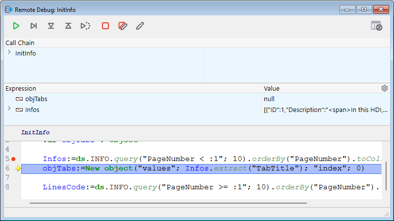

## Visão Geral

Quando um banco de dados 4D está sendo executado no 4D Server em modo interpretado, é possível depurar o código 4D em execução no servidor a partir de um cliente 4D remoto conectado ao projeto. Basta associar o depurador a uma máquina remota específica, e a execução do código pode ser monitorada no depurador diretamente na máquina remota.

En una máquina remota, la [ventana de depuración](debugger.md) muestra un icono de servidor específico y un color de fondo azul para indicar que está depurando el código servidor:

Esta funcionalidad es especialmente útil cuando 4D Server se ejecuta en modo sin interfaz (ver [Command Line Interface](../Admin/cli.md)), o cuando el acceso a la máquina del servidor no es fácil.

## Depurador anexado

Apenas um depurador pode depurar uma aplicação 4D Server num determinado momento. Se llama el **depurador asociado**. O depurador ligado pode ser:

- o depurador local do Servidor 4D (padrão) - se o servidor não estiver sendo executado sem interface.
- o depurador de um cliente 4D remoto - se a sessão remota tiver acesso ao modo Desenho.
- the [Qodly debugger](../WebServer/qodly-studio.md#using-qodly-debugger-on-4d-server) on 4D Server - if the server allows access to Qodly Studio.
- the VS Code debugger, provided you installed the [4D-Debugger](https://github.com/4d/4D-Debugger-VSCode) extension.

:::

O depurador anexado é chamado sempre que um 4D Server se encontra:

- um ponto de ruptura
- un comando `TRACE`
- um ponto de interrupção para fazer o pedido
- um erro

Tenga en cuenta que los mensajes de error se envían a la máquina depuradora asociada. Isso significa que, no caso de um depurador remoto, as mensagens de erro do servidor são exibidas no cliente 4D remoto.

Note que:

- El código ejecutado en el método `On Server Startup Database` no se puede depurar de forma remota. Só pode ser depurado no lado do servidor
- Se não estiver ligado um depurador, o código em execução não é interrompido pelos comandos de depuração

## Ligar o depurador

Por defeito, quando se inicia uma aplicação interpretada:

- se o 4D Server não estiver funcionando sem interface, o depurador está associado ao servidor,
- se 4D Server funciona sem interface, nenhum depurador está ligado.

Pode anexar o depurador a qualquer cliente 4D remoto autorizado a conectar-se à aplicação 4D Server.

> A sessão usuário do cliente 4D remoto deve ter acesso ao ambiente de desenho do banco de dados.

Para anexar o depurador a um cliente 4D remoto:

1. En la barra de menús de 4D Server, seleccione **Editar** > **Separar depurador** para que el depurador esté disponible para las máquinas remotas (este paso es inútil si 4D Server está funcionando sin interfaz).
2. En un cliente 4D remoto conectado al servidor, seleccione **Ejecutar** > **Adjuntar depurador remoto**

Si se acepta el archivo adjunto (ver [Solicitudes de archivo adjunto rechazadas](#rejected-attachment-requests)), el comando de menú se convierte en **Desconectar depurador remoto**.

O depurador é então ligado ao cliente 4D remoto:

- até ao fim da sessão do usuário
- hasta que se seleccione `Detach Remote Debugger`

Para ligar o depurador de novo ao servidor:

1. En el cliente 4D remoto que tiene el depurador conectado, seleccione **Ejecutar** > **Separar depurador remoto**.
2. En la barra de menú de 4D Server, seleccione **Editar** > **Adjuntar depurador**.

> Quando o depurador estiver conectado ao servidor (padrão), todos os processos do servidor são executados automaticamente no modo cooperativo para permitir a depuração. Este fato pode ter um impacto significativo no desempenho. Quando não for necessário depurar na máquina do servidor, recomenda-se desconectar o depurador e anexá-lo a uma máquina remota, se necessário.

## Anexar o depurador na inicialização

4D permite que você anexe automaticamente o depurador a um cliente 4D remoto ou ao servidor na inicialização:

- En el servidor (si no es headless), esta opción se llama **Attach Debugger At Startup**. Quando o servidor é iniciado, ele anexa automaticamente o depurador (padrão).

> **Advertencia**: si se selecciona esta opción para un servidor que posteriormente se lanza en modo sin interfaz, el depurador no estará disponible para este servidor.

- En un cliente 4D remoto, esta opción se llama **Attach Remote Debugger At Startup**. Quando selecionado, o cliente 4D remoto tentará automaticamente anexar o depurador remoto em cada conexão subsequente com o mesmo banco de dados do 4D Server. Si el adjunto es aceptado (ver [Rejected attachment requests](#rejected-attachment-requests)), el depurador remoto se adjunta automáticamente al cliente 4D remoto y se muestra la opción **Detach Remote Debugger**.

> Essa configuração é aplicada por projeto e é armazenada localmente no arquivo [`.4DPreferences`] (Project/architecture.md#userpreferencesusername).

## Solicitações de anexos rejeitadas

Enquanto o depurador estiver conectado a um cliente 4D remoto ou ao 4D Server, nenhuma outra máquina poderá se conectar ao depurador.

Se uma máquina tentar anexar o depurador enquanto este já estiver anexado, a anexação é rejeitada e aparece uma caixa de diálogo:

A ligação do depurador neste caso exige que:

- el depurador adjunto se separa del servidor o del cliente 4D remoto utilizando respectivamente el comando de menú **Detach debugger** o **Detach remote debugger**,
- a sessão do cliente remoto 4D anexado é encerrada.
