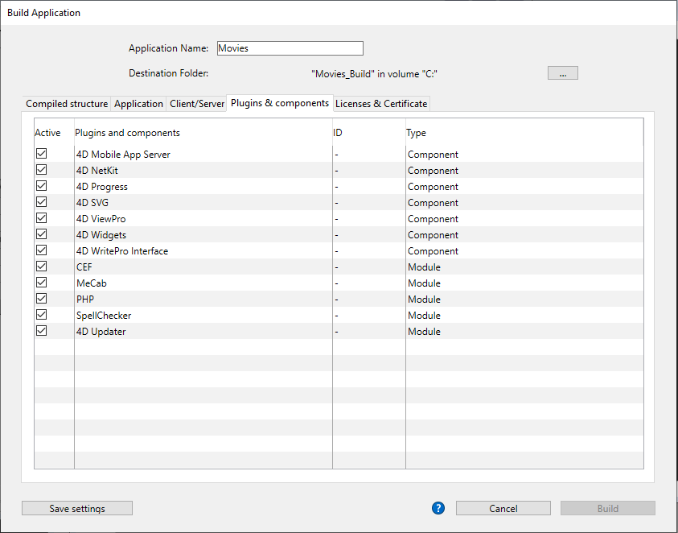
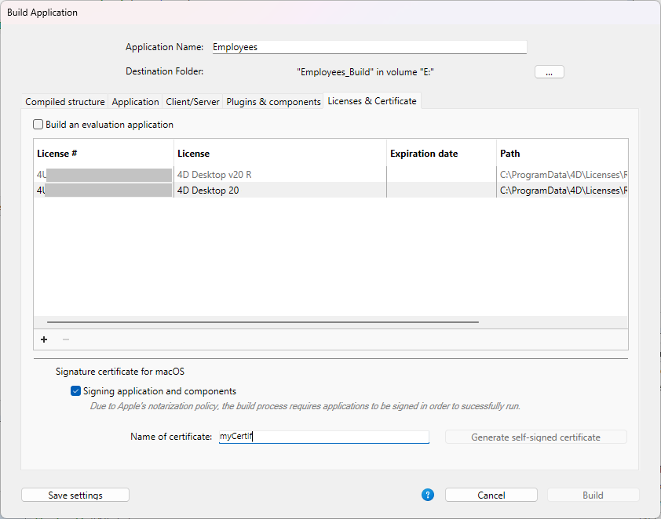
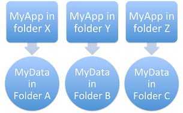
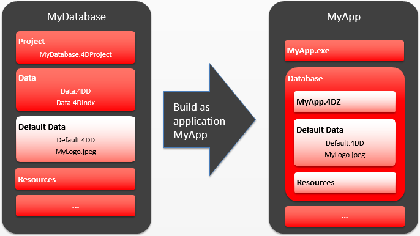

4D inclui um gerador de aplicativos para criar um pacote de projeto (versão final). Esse gerador simplifica o processo de finalização e desenvolvimento de aplicativos compilados 4D. Trata automaticamente as funcionalidades específicas de diferentes sistemas operacionais e facilita a implementação de aplicações cliente-servidor.

O construtor de aplicações permite-lhe:

- Build a compiled structure or component, without interpreted code,
- Generar una aplicación autónoma ejecutable, _es decir_, fusionada con 4D Volume Desktop, el motor de base de datos 4D,
- Gerar aplicações diferentes a partir do mesmo banco de dados compilado mediante um projeto XML,
- Criar aplicações cliente-servidor homogêneas,
- Construir aplicações cliente-servidor com atualização automática de partes do cliente e do servidor.
- Guardar sus parámetros de generación para su uso futuro (botón _Guardar los parámetros_).

> Las aplicaciones compiladas se basan en archivos [.4dz](#build-compiled-structure) que son **de sólo lectura**. Tenga en cuenta que el uso de comandos o funciones que modifican los archivos fuente (como `CREATE INDEX` o `CREATE TABLE` (SQL)) no es posible por defecto en las aplicaciones compiladas. Sin embargo, puede crear aplicaciones específicas que soporten modificaciones locales utilizando la llave XML `PackProject` (ver [doc.4d.com](https://doc.4d.com)).

## Visão Geral

A cria de um pacote de projetos pode ser efetuada utilizando:

- either the [`BUILD APPLICATION`](https://doc.4d.com/4dv20/help/command/en/page871.html) command,
- o el [diálogo Generador de aplicaciones](#application-builder).

:::tip

You can also download and use [`Build4D`](https://github.com/4d-depot/Build4D), a component that provides classes to compile, build, and sign 4D projects, even from a headless application.

:::

### Diálogo criar aplicação

Para mostrar la caja de diálogo Generar la aplicación, seleccione **Diseño** > **Generar la aplicación...** en la barra de menús.


A caixa de diálogo Criar aplicação inclui várias páginas que podem ser acedidas através de separadores:


A geração do banco de dados só pode ser realizado quando o banco de dados for compilado. Se selecionar esse comando sem ter previamente compilado o banco de dados, ou no caso do código compilado não for correspondente ao código interpretado, aparece uma caixa de diálogo de advertência que indica que o banco de dados deve ser (re)compilado.

### buildApp.4DSettings

Each build application parameter is stored as an XML key in the application project file named `buildApp.4DSettings` XML file, located in the [`Settings` folder of the project](../Project/architecture.md#settings-1).

Os parâmetros padrão são utilizados na primeira vez que a caixa de diálogo Criar aplicação é utilizada. El contenido del archivo proyecto se actualiza, si es necesario, al hacer clic en **Construir** o **Guardar los parámetros**. Puede definir varios archivos de parámetros XML para el mismo proyecto y utilizarlos con el comando [BUILD APPLICATION](https://doc.4d.com/4dv19/help/command/en/page871.html).

As chaves XML oferecem opções adicionais além daquelas exibidas na caixa de diálogo Criar aplicativo. La descripción de estas llaves se detalla en el manual [4D XML Keys BuildApplication](https://doc.4d.com/4Dv19/4D/19/4D-XML-Keys-BuildApplication.100-5447429.en.html).

### Arquivo histórico

Cuando se crea una aplicación, 4D genera un archivo de registro llamado _BuildApp.log.xml_ en la carpeta **Logs** del proyecto. O ficheiro de historial armazena as seguintes informações para cada compilação:

- O início e o fim da construção de objetivos,
- O nome e o caminho de acesso completo dos ficheiros gerados,
- A data e a hora da geração,
- Todos os erros que forem produzidos.
- Quaisquer problemas de assinatura (por exemplo, um plug-in não assinado).

A verificação desse arquivo pode ajudá-lo a economizar tempo durante as etapas de implantação subsequentes, por exemplo, se você pretende notarizar o aplicativo.

> Utilice el comando `Get 4D file(Build application log file)` para obtener la ubicación del archivo de registro.

## Nome da aplicação e pasta de destino


Introduzca el nombre de la aplicación en **Nombre de la aplicación**.

Especifique la carpeta para la aplicación generada en la **Carpeta de destino**. Si la carpeta especificada no existe todavía, 4D creará una carpeta _Build_.

## Página de estrutura compilada

Essa guia permite que você crie um arquivo de estrutura compilado padrão ou um componente compilado:


### Construir a estrutura compilada

Gera um banco de dados que contém apenas código compilado.

Esta funcionalidad crea un archivo _.4dz_ en una carpeta `Compiled Database/<project name>`. For example, if you have named your application “MyProject”, 4D will create:

`<destination>/Compiled Database/MyProject/MyProject.4dz`

Um ficheiro .4dz é essencialmente uma versão zipada (embalada) da pasta do projecto. A .4dz file is essentially a zipped (packed) version of the project folder. O tamanho compacto e otimizado dos arquivos .4dz torna os pacotes de projeto fáceis de implantar.

> Al generar archivos .4dz, 4D utiliza por defecto un formato zip **estándar**. A vantagem desse formato é que ele pode ser lido facilmente por todas as ferramentas de descompactação. If you do not want to use this standard format, add the `UseStandardZipFormat` XML key with value `False` in your [`buildApp.4DSettings`](#build-application-settings) file (for more information, see the [4D XML Keys BuildApplication](https://doc.4d.com/4Dv19/4D/19/4D-XML-Keys-BuildApplication.100-5447429.en.html) manual).

#### Incluir pastas relacionadas

Cuando se marca esta opción, todas las carpetas relacionadas con el proyecto se copian en la carpeta Build como carpetas _Components_ y _Resources_. Para más información sobre estas carpetas, consulte la [descripción de la arquitectura del proyecto](Project/architecture.md).

### Gerar um componente

Constrói um componente compilado a partir da estrutura.

A [component](../Extensions/develop-components.md) is a standard 4D project in which specific functionalities have been developed. Once the component has been configured and [installed in another 4D project](../Project/components.md#basics) (the host application project), its functionalities are accessible from the host project.

Si ha llamado a su aplicación, _MiComponente_, 4D creará una carpeta _Components_ que contiene la carpeta _MiComponente.4dbase_:

`<destination>/Components/MyComponent.4dbase/MyComponent.4DZ`.

La carpeta _MyComponent.4dbase_ contiene:

- _MyComponent.4DZ_ file
- Una carpeta _Resources_: todos los resources asociados se copian automáticamente en esta carpeta. Quaisquer outros componentes e/ou pastas de plug-ins não são copiados (um componente não pode utilizar plug-ins ou outros componentes).

La carpeta _MyComponent.4dbase_ es la [carpeta del paquete del componente compilado](../Project/components.md).

## Página Aplicação

Essa guia permite que você crie uma versão autônoma e de usuário único do seu aplicativo:


### Criar uma aplicação autónoma

Al marcar la opción **Crear una aplicación autónoma** y hacer clic en **Generar** se creará una aplicación autónoma (con doble clic) directamente desde su proyecto de aplicación.

Os seguintes elementos são necessários para a construção:

- 4D Volume Desktop (o motor de base de dados 4D),
- una [licencia apropiada](#licenses)

No Windows, esta funcionalidade cria um ficheiro executável (.exe). Em macOS, trata da criação de pacotes de software.

O princípio consiste em fundir um ficheiro de estrutura compilado com 4D Volume Desktop. A funcionalidade fornecida pelo ficheiro 4D Volume Desktop está ligada à oferta do produto a que se subscreveu. Las funcionalidades ofrecidas por el archivo 4D Volume Desktop están relacionadas con la oferta de productos a la que se ha suscrito.

You can define a default data file or allow users to [create and use their own data file](#management-of-data-files).

It is possible to [automate the update of merged single-user applications](#automatic-updating-of-server-or-single-user-applications) by means of a sequence of language commands.

#### Localização do 4D Volume Desktop

Para construir uma aplicação independente, você deve primeiro designar a pasta que contém o arquivo da área de trabalho do volume 4D:

- _Windows_ - the folder contains the 4D Volume Desktop.4DE, 4D Volume Desktop. RSR, as well as various files and folders required for its operation. Esses itens devem ser colocados no mesmo nível da pasta selecionada.
- _macOS_ - 4D Volume Desktop se entrega en forma de un paquete de software estructurado que contiene varios archivos y carpetas genéricos.

Para seleccionar la carpeta 4D Volume Desktop, haga clic en el botón **[...]**. Uma caixa de diálogo aparece permitindo que você designe a pasta 4D Volume Desktop (Windows) ou pacote (macOS).

Depois que a pasta for selecionada, o nome completo do caminho será exibido e, se realmente conter 4D Volume Desktop, a opção para a construção de uma aplicação executável é ativada.

> O número da versão do 4D Volume Desktop deve corresponder ao número da versão do 4D Developer Edition. Por exemplo, se você usar o 4D Developer v18, deverá selecionar um 4D Volume Desktop v18.

#### Modo de ligação de dados

Esta opção permite escolher o modo de ligação entre o aplicativo mesclado e o arquivo de dados local. Estão disponíveis dois modos de ligação de dados:

- **Por nombre de la aplicación** (por defecto) - La aplicación 4D abre automáticamente el archivo de datos abierto más recientemente correspondiente al archivo de estructura. Isto permite-lhe mover o pacote de aplicações livremente no disco. Esta opção deve ser geralmente utilizada para aplicações fundidas, a menos que seja especificamente necessário duplicar a aplicação.

- **Por ruta de la aplicación** - La aplicación 4D fusionada analizará el archivo _lastDataPath.xml_ de la aplicación e intentará abrir el archivo de datos con un atributo "executablePath" que coincida con la ruta completa de la aplicación. Se tal entrada for encontrada, o arquivo de dados correspondente (definido através do seu atributo "dataFilePath") será aberto. If such an entry is found, its corresponding data file (defined through its "dataFilePath" attribute) is opened.

Para más información sobre el modo de vinculación de datos, consulte la sección [Último archivo de datos abierto](#last-data-file-opened).

#### Ficheiros gerados

Al hacer clic en el botón **Generar**, 4D crea automáticamente una carpeta **Final Application** en la **carpeta de destino** definida. Dentro da pasta de Aplicação Final está uma subpasta com o nome do aplicativo especificado nele.

Se você tiver especificado "MyProject" como o nome do aplicativo, encontrará os seguintes arquivos nessa subpasta (também conhecida como MyProject):

- _Windows_
  - MyProject.exe - Seu executável e um MyProject.rsr (os recursos da aplicação)
  - Pasta 4D Extensions, pasta Resources, várias bibliotecas (DLL), pasta Native Components, pasta SASL Plugins - Arquivos necessários para a operação do aplicativo
  - Uma pasta Database - Inclui uma pasta Resources e um ficheiro MyProject.4DZ. Database folder  - Includes a Resources folder and  MyProject.4DZ file.
    **Nota**: esta carpeta también contiene la carpeta _Default Data_, si se ha definido (ver [Gestión de archivos de datos en las aplicaciones finales](#data-file-management-in-final-applicatons).
  - (Opcional) Pasta Components e/ou pasta Plugins - Contém todos os componentes e/ou arquivos de plug-in incluídos no banco de dados. Para más información sobre este punto, consulte la sección [Plugins y componentes](#plugins-and-components).
  - Pasta de licenças - Um arquivo XML com números de licença integrados ao aplicativo. Para obtener más información sobre este punto, consulte la sección [Licencias y certificados](#licenses-and-certificate).
  - Elementos adicionales añadidos a la carpeta 4D Volume Desktop, si los hay (ver [Personalizar la carpeta 4D Volume Desktop](#customizing-4d-volume-desktop-folder)).

Todos estes itens devem ser mantidos na mesma pasta para que o executável possa operar.

- _macOS_
  - Um pacote de software chamado MyProject.app que contém seu aplicativo e todos os itens necessários para sua operação, incluindo os plug-ins, componentes e licenças. Para más información sobre la integración de plug-ins y componentes, consulte la sección [Plugins y componentes](#plugins-and-components). Para obtener más información sobre la integración de licencias, consulte la sección [Licencias y certificados](#licenses-and-certificate). **Note**: In macOS, the [Application file](https://doc.4d.com/4Dv18R4/4D/18-R4/Application-file.301-4982855.en.html) command of the 4D language returns the pathname of the ApplicationName file (located in the Contents:macOS folder of the software package) and not that of the .comp file (Contents:Resources folder of the software package).

#### Personalização da pasta 4D Volume Desktop

Cuando se construye una aplicación independiente, 4D copia el contenido de la carpeta 4D Volume Desktop en la carpeta Destination > _Final Application_. Então, você será capaz de personalizar o conteúdo da pasta original de volume da área de trabalho 4D de acordo com suas necessidades. Pode, por exemplo:

- Instalar uma versão 4D Volume Desktop correspondente a um idioma específico;
- Añadir una carpeta _PlugIns_ personalizada;
- Personalizar el contenido de la carpeta _Resources_.

> No macOS, o 4D Volume Desktop é fornecido na forma de um pacote de software. You can display their contents (**Control+click** on the icon) in order to be able to modify them.

#### Localização de ficheiros Web

Se o seu aplicativo autônomo for usado como um servidor Web, os arquivos e pastas exigidos pelo servidor devem ser instalados em locais específicos. Estes itens são os seguintes:

- archivos _cert.pem_ y _key.pem_ (opcional): etos archivos se utilizan para las conexiones TLS y por los comandos de encriptación de datos,
- pasta raiz Web padrão.

Os elementos devem ser instalados:

- **En Windows**: en la subcarpeta _Final Application\MyProject\Database_.
- **En macOS**: junto al paquete de software _MyProject.app_.

## Página cliente/servidor

Nessa guia, você pode criar aplicativos cliente-servidor personalizados que sejam homogêneos, multiplataforma e com uma opção de atualização automática.


### O que é uma aplicação Cliente/Servidor?

Uma aplicação cliente/servidor provém da combinação de três itens:

- A compiled 4D database,
- A aplicação 4D Server,
- A aplicação 4D Volume Desktop (macOS e/ou Windows).

Uma vez criado, um aplicativo cliente/servidor é composto de duas partes personalizadas: a parte do servidor (exclusiva) e a parte do cliente (a ser instalada em cada máquina cliente).

> If you want to deploy a client/server application in an heterogeneous environment (client applications running on Intel/AMD and Apple Silicon machines), it is recommended to [compile the project for all processors](Project/compiler.md#compilation-target) on a macOS machine, so that all client applications will run natively.

Além disso, o aplicativo cliente/servidor é personalizado e fácil de usar:

- Para iniciar a parte do servidor, o usuário simplesmente clica duas vezes no aplicativo do servidor. The database does not need to be selected.
- Para iniciar a parte do cliente, o usuário simplesmente clica duas vezes no aplicativo cliente, que se conecta diretamente ao aplicativo do servidor. Você não precisa escolher um servidor em uma caixa de diálogo de conexão. Si desea que la aplicación cliente se conecte al servidor utilizando una dirección específica (distinta del nombre del servidor publicado en la subred), debe utilizar la llave XML `IPAddress` en el archivo buildapp.4DSettings. Si la conexión falla, [se pueden implementar mecanismos alternativos específicos](#management-of-client-connections). Puede "forzar" la visualización de la caja de diálogo de conexión estándar presionando la tecla **Opción** (macOS) o **Alt** (Windows) mientras inicia la aplicación cliente.
  Apenas a parte do cliente pode conectar à parte do servidor correspondente. Se um usuário tentar conectar à parte do servidor usando uma aplicação 4D padrão, uma mensagem de erro é retornada e a conexão é impossível.
- Una aplicación cliente/servidor puede configurarse para que la parte cliente [se actualice automáticamente a través de la red](#copy-of-client-applications-in-the-server-application). Você só precisa criar e distribuir uma versão inicial do aplicativo cliente, atualizações subsequentes são tratadas usando o mecanismo de atualização automática.
- It is also possible to automate the update of the server part through the use of a sequence of language commands ([SET UPDATE FOLDER](https://doc.4d.com/4dv19/help/command/en/page1291.html) and [RESTART 4D](https://doc.4d.com/4dv19/help/command/en/page1292.html).

### Criar aplicação servidor

Marque esta opção para gerar a parte do servidor da sua aplicação durante a fase de construção. Você deve designar a localização em seu disco da aplicação 4D Server para ser usado. Esse servidor 4D deve corresponder à plataforma atual (que também será a plataforma do aplicativo do servidor).

#### Localização do 4D Server

Haga clic en el botón **[...]** y utilice la caja de diálogo _Navegar carpeta_ para localizar la aplicación 4D Server. No macOS, deve selecionar o pacote 4D Server diretamente.

#### Versão atual

Utilizado para indicar o número da versão atual da aplicação gerada. Pode então aceitar ou rejeitar ligações de aplicações cliente conforme o seu número de versão. El intervalo de compatibilidad para las aplicaciones cliente y servidor se define mediante el uso de [llaves XML](#buildapp4dsettings) específicas).

#### Incorporar o projeto Usuários e Grupos na aplicação servidor criada

**Nota preliminar:** en esta sección se utilizan los siguientes términos:

| Nome                                | Definição                                                                                                                                                                                     |
| ----------------------------------- | --------------------------------------------------------------------------------------------------------------------------------------------------------------------------------------------- |
| Ficheiro do directório do projecto  | archivo [directory.json](../Users/handling_users_groups.md#directoryjson-file) ubicado en la [carpeta Settings](../Project/architecture.md#settings-1) del proyecto           |
| Ficheiro do directório de aplicação | archivo [directory.json](../Users/handling_users_groups.md#directoryjson-file) ubicado en la [carpeta Settings](../Project/architecture.md#settings-1) del servidor 4D creado |
| Ficheiro obrigatório                | archivo [directory.json](../Users/handling_users_groups.md#directoryjson-file) en la carpeta [Data > Settings](../Project/architecture.md#settings)                           |

Quando marca esta opção, o ficheiro do directório do projecto é copiado para o ficheiro do directório da aplicação no momento da construção.

Quando se executa uma aplicação 4D Server construída:

- Se o servidor tiver um ficheiro de directório de dados, este é carregado.
- Se o servidor não tiver um ficheiro de directório de dados, o ficheiro de directório da aplicação é carregado.

O ficheiro do directório de aplicação é apenas de leitura. Modificações feitas aos usuários, grupos e permissões durante a execução do servidor são armazenadas no arquivo de diretório de dados. Se nenhum arquivo de diretório de dados já existir, ele será criado automaticamente. Se o arquivo de diretório do aplicativo foi incorporado, ele é duplicado como arquivo de diretório de dados.

Embutir o arquivo de diretório do projeto permite que você faça deploy de um aplicativo cliente/servidor com um usuário de segurança básico e configuração de grupo. As alterações subsequentes são adicionadas ao ficheiro do diretório de dados.

#### Permitir a ligação de clientes Silicon Mac

Ao construir um servidor no Windows, marque esta opção para permitir que clientes Apple Silicon se conectem ao seu aplicativo do servidor. Em seguida, você pode especificar um caminho para a estrutura compilada para Apple Silicon/Intel.

Para permitir que os clientes da Apple Silicon se conectem a um aplicativo do servidor construído no Windows, você deve primeiro construir um aplicativo cliente no macOS, com um projeto compilado para Apple Silicon e Intel. Esto crea automáticamente una estructura compilada, idéntica a la creada con la opción **[Build compiled structure](#build-compiled-structure)** (sin las carpetas asociadas).

Em seguida, você pode copiar essa estrutura para sua máquina Windows e usá-la para construir a aplicação do servidor:


#### Localização da estrutura compilada

Ruta de acceso a la estructura compilada de la aplicación cliente Apple Silicon/Intel utilizada para crear un servidor Windows (ver [Permitir la conexión de clientes Silicon Mac](#allow-connection-of-silicon-mac-clients).

#### Modo de ligação de dados

Esta opção permite escolher o modo de ligação entre o aplicativo mesclado e o arquivo de dados local. Estão disponíveis dois modos de ligação de dados:

- **Por nombre de la aplicación** (por defecto) - La aplicación 4D abre automáticamente el archivo de datos abierto más recientemente correspondiente al archivo de estructura. Isto permite-lhe mover o pacote de aplicações livremente no disco. Esta opção deve ser geralmente utilizada para aplicações fundidas, a menos que seja especificamente necessário duplicar a aplicação.

- **Por ruta de la aplicación** - La aplicación 4D fusionada analizará el archivo _lastDataPath.xml_ de la aplicación e intentará abrir el archivo de datos con un atributo "executablePath" que coincida con la ruta completa de la aplicación. Se tal entrada for encontrada, o arquivo de dados correspondente (definido através do seu atributo "dataFilePath") será aberto. If such an entry is found, its corresponding data file (defined through its "dataFilePath" attribute) is opened.

Para más información sobre el modo de vinculación de datos, consulte la sección [Último archivo de datos abierto](#last-data-file-opened).

### Criar a aplicação cliente

Marcar esta opção gera a parte do cliente da sua aplicação durante a fase de construção.

Pode selecionar esta opção:

- along with the [**Build server application**](#build-server-application) option to build matching server and client parts for the current platform and (optionally) include the automatic update archive files,
- without selecting the [**Build server application**](#build-server-application) option, usually to build the update archive file to be selected from the "concurrent" platform when building the server part.

#### Localização do 4D Volume Desktop

Designa a localização no seu disco da aplicação 4D Volume Desktop a ser usada para construir a parte cliente da sua aplicação.

> O número da versão do 4D Volume Desktop deve corresponder ao número da versão do 4D Developer Edition. Por exemplo, se você usar 4D v19, você deve selecionar um volume 4D na área de trabalho v19.

A Área de Trabalho de Volume 4D deve corresponder à plataforma atual (que também será a plataforma do aplicativo cliente). Se você deseja criar um aplicativo cliente para a plataforma "simultânea", você deve realizar uma operação de construção adicional usando uma aplicação 4D em execução nessa plataforma.

Si desea que la aplicación cliente se conecte al servidor utilizando una dirección específica (distinta del nombre del servidor publicado en la subred), debe utilizar la llave XML `IPAddress` en el archivo buildapp.4DSettings. Para obter mais informações sobre este arquivo, consulte a descrição do comando [`BUILD APPLICATION`](https://doc.4d.com/4dv19/help/command/en/page871.html). Você também pode implementar mecanismos específicos em caso de falha na conexão. También puede implementar mecanismos específicos en caso de fallo de la conexión.

#### Cópia de aplicativos cliente dentro do aplicativo servidor

As opções desta área configuram o mecanismo para atualizar as partes do cliente do(s) seus aplicativos cliente/servidor usando a rede toda vez que uma nova versão do aplicativo for gerada. Estas opciones sólo se activan cuando la opción **Crear aplicación cliente** está marcada.

- **Permitir la actualización automática de la aplicación cliente Windows** - Marque esta opción para construir un archivo `.4darchive` que puede ser enviado a sus aplicaciones cliente en la plataforma Windows en caso de actualización.
- **Permitir la actualización automática de la aplicación cliente Macintosh** - Marque esta opción para construir un archivo `.4darchive` que puede ser enviado a sus aplicaciones cliente en la plataforma Macintosh en caso de actualización.

El archivo `.4darchive` se copia en la siguiente ubicación:

```
<ApplicationName>_Build/Client Server executable/Upgrade4DClient/
```

#### Seleção do arquivo cliente para a plataforma concorrente

Puede marcar la opción **Permitir la actualización automática...** para las aplicaciones clientes ejecutadas en la plataforma concurrente. Esta opção só é activada se:

- la opción **Crear aplicación servidor** está marcada,
- la opción **Permitir la actualización automática...** para las aplicaciones clientes ejecutadas en la plataforma actual está marcada.

Esta funcionalidad requiere que haga clic en el botón **[...]** y designe la ubicación en su disco del archivo que se utilizará para la actualización. O ficheiro a selecionar depende da plataforma do servidor atual:

| Plataforma de servidor actual | Ficheiro obrigatório                                        | Detalhes                                                                                                                                                                                                                                                                                                                  |
| ----------------------------- | ----------------------------------------------------------- | ------------------------------------------------------------------------------------------------------------------------------------------------------------------------------------------------------------------------------------------------------------------------------------------------------------------------- |
| macOS                         | Windows 4D Volume Desktop _o_ Windows client update archive | Por defecto, se selecciona la aplicación `4D Volume Desktop` para Windows. Para seleccionar un archivo `.4darchive` previamente construido en Windows, presione **Shift** mientras hace clic en [...] |
| Windows                       | macOS client update archive                                 | Seleccione un archivo `.4darchive` firmado previamente creado en macOS                                                                                                                                                                                                                                                    |

You can build specific a `.4darchive` file on the concurrent platform by selecting only the [**Build client application**](#build-client-application) and the appropriate [**Allow automatic update...**](#copy-of-client-applications-inside-the-server-application) option.

#### Mostrar notificação de atualização

A notificação de atualização da aplicação cliente é realizada automaticamente após a atualização da aplicação do servidor.

It works as follows: when a new version of the client/server application is built using the application builder, the new client portion is copied as a compressed file in the **Upgrade4DClient** subfolder of the **ApplicationName** Server folder (in macOS, these folders are included in the server package). Si ha seguido el proceso de generación de una aplicación cliente multiplataforma, un archivo de actualización ._4darchive_ está disponible para cada plataforma:

Para acionar notificações de atualização de aplicativo cliente, basta substituir a versão antiga do aplicativo servidor pelo novo e, em seguida, executá-lo. O resto do processo é automático.

Do lado do cliente, quando a aplicação cliente "antiga" tenta conectar-se à aplicação servidor atualizada, se mostra uma caixa de diálogo na máquina cliente, indicando que há uma nova versão disponível. O utilizador pode tanto actualizar a sua versão como cancelar a caixa de diálogo.

- Si el usuario hace clic en **OK**, la nueva versión se descarga en el equipo cliente a través de la red. Uma vez terminado o download, a antiga aplicação cliente é fechada e a nova versão é lançada e liga-se ao servidor. A versão antiga da aplicação é então colocada na lixeira da máquina.
- Si el usuario hace clic en **Cancelar**, la actualización se cancela; si la versión antigua de la aplicación cliente no está en el rango de versiones aceptadas por el servidor (consulte el siguiente párrafo), la aplicación se cierra y la conexión es impos Caso contrário (por defeito), a ligação é estabelecida.

#### Forçar atualizações automáticas

Em alguns casos, poderá querer impedir que as aplicações cliente possam cancelar a transferência da atualização. Por exemplo, se usou uma nova versão da aplicação fonte 4D Server, a nova versão da aplicação cliente deve absolutamente ser instalada em cada máquina cliente.

Para forçar a atualização, basta excluir o número da versão atual das aplicações cliente (X-1 e anteriores) no intervalo de números de versão compatível com a aplicação do servidor. Neste caso, o mecanismo de atualização não permitirá a conexão de aplicativos cliente não atualizados. Por exemplo, se a nova versão do aplicativo cliente-servidor for 6, pode estipular-se que qualquer aplicativo cliente com um número de versão inferior a 6 não será autorizado a ligar.

El [número de versión actual](#current_version) se define en la página Cliente/Servidor del generador de la aplicación. Los intervalos de los números autorizados se definen en el proyecto de la aplicación vía las [llaves XML](#buildapp4dsettings) específicas.

#### Erro de actualização

Se 4D não puder realizar a atualização do aplicativo cliente, a máquina do cliente exibe a seguinte mensagem de erro: "A atualização da aplicação do cliente falhou. A aplicação vai agora fechar."

Existem muitas causas possíveis para este erro. Quando você receber esta mensagem, é aconselhável verificar os seguintes parâmetros primeiro:

- **Nombres de ruta**: compruebe la validez de los nombres de ruta definidos en el proyecto de la aplicación a través del diálogo del Generador de aplicaciones o mediante las llaves XML (por ejemplo, _ClientMacFolderToWin_). Em particular, verifique os caminhos para as versões do 4D Volume Desktop.
- **Privilegios lectura/escritura**: en la máquina cliente, compruebe que el usuario actual tiene derechos de acceso de escritura para la actualización de la aplicación cliente.

### Ficheiros gerados

Una vez creada la aplicación cliente/servidor, encontrará una nueva carpeta en la carpeta de destino llamada **Client Server executable**. Esta carpeta contiene dos subcarpetas, `<ApplicationName>Client` y `<ApplicationName>Server`.

> Estas pastas não são geradas se ocorrer um erro. En este caso, abra el [archivo de historial](#archivo-registro) para conocer la causa del error.

La carpeta `<ApplicationName>Client` contiene la parte cliente de la aplicación correspondiente a la plataforma de ejecución del generador de aplicaciones. Esta pasta deve ser instalada em cada máquina do cliente. La carpeta `<ApplicationName>Server` contiene la parte del servidor de la aplicación.

O conteúdo dessas pastas varia dependendo da plataforma atual:

- _Windows_ - Cada carpeta contiene el archivo ejecutable de la aplicación, denominado `<ApplicationName>Client.exe` para la parte cliente y `<ApplicationName>Server.exe` para la parte servidor, así como los archivos .rsr correspondientes. As pastas também contêm vários arquivos e pastas necessários para que os aplicativos funcionem e itens personalizados que podem estar na pasta de Volume 4D e no Servidor 4D.
- _macOS_ - Cada carpeta contiene únicamente el paquete de la aplicación, denominado `<ApplicationName>Client` para la parte cliente y `<ApplicationName>Server` para la parte servidor. Cada pacote contém todos os itens necessários para que a aplicação funcione. No macOS, inicie um pacote fazendo duplo clique no mesmo.

> Os pacotes macOS construídos contêm os mesmos itens que as subpastas do Windows. Puede visualizar su contenido (**Control+clic** en el icono) para poder modificarlo.

Si ha marcado la opción "Permitir la actualización automática de la aplicación cliente", se añade una subcarpeta adicional llamada _Upgrade4DClient_ en la carpeta/paquete `<ApplicationName>Server`. Esta subpasta contém o aplicativo cliente no macOS e/ou no formato Windows como um arquivo compactado. Este ficheiro é utilizado durante a atualização automática das aplicações clientes.

#### Localização de ficheiros Web

Se o servidor e/ou cliente parte do seu aplicativo clicável duplo for usado como um servidor web, os arquivos e pastas exigidos pelo servidor devem ser instalados em locais específicos. Estes itens são os seguintes:

- archivos _cert.pem_ y _key.pem_ (opcional): etos archivos se utilizan para las conexiones TLS y por los comandos de encriptación de datos,
- Pasta raiz Web por defeito (WebFolder).

Os elementos devem ser instalados:

- **em Windows**
  - **Aplicación del servidor** - en la subcarpeta `Client Server executable/<ApplicationName>Server/Server Database`.
  - **Aplicación cliente** - en la subcarpeta `Client Server executable/<ApplicationName>Client`.

- **no macOS**
  - **Aplicación del servidor** - junto al paquete de software `<ApplicationName>Server`.
  - **Aplicación cliente** - junto al paquete de software `<ApplicationName>Cliente`.

### Incorporar uma aplicação cliente usuário único

4D lhe permite incorporar uma estrutura compilada na aplicação cliente. Esta funcionalidad puede utilizarse, por ejemplo, para ofrecer a los usuarios una aplicación "portal", que da acceso a diferentes aplicaciones del servidor gracias al comando `OPEN DATABASE` que ejecuta un archivo `.4dlink`.

Para activar esta funcionalidad, añada las llaves `DatabaseToEmbedInClientWinFolder` y/o `DatabaseToEmbedInClientMacFolder` en el archivo de configuración _buildApp_. Cuando una de estas llaves está presente, el proceso de generación de la aplicación cliente genera una aplicación monopuesto: la estructura compilada, en lugar del archivo _EnginedServer.4Dlink_, se coloca en la carpeta "Database".

- Se existir uma pasta de dados padrão no aplicativo de usuário único, uma licença será incorporada.
- Se não existir uma pasta de dados padrão no aplicativo de usuário único, ela será executada sem arquivo de dados e sem licença.

O cenário básico é o seguinte:

1. Na caixa de diálogo da Aplicação de Construção, selecione a opção "Construir estrutura compilada" para produzir um . DZ ou .4DC para o aplicativo a ser usado em modo de usuário único.
2. En el archivo _buildApp.4DSettings_ de la aplicación cliente-servidor, utilice la(s) siguiente(s) llave(s) xml para indicar la ruta de la carpeta que contiene la aplicación compilada monopuesto:

- `DatabaseToEmbedInClientWinFolder`
- `DatabaseToEmbedInClientMacFolder`

3. Construir a aplicação cliente-servidor. Isto terá os seguintes efeitos:

- toda a pasta do aplicativo do único usuário é copiada dentro da pasta "Database" do cliente mesclado
- el archivo _EnginedServer.4Dlink_ de la carpeta "Database" no se genera
- o .4DC, .4DZ, .4DIndy arquivos da cópia do aplicativo de usuário único são renomeados usando o nome do cliente mesclado
- la llave `PublishName` no se copia en el _info.plist_ del cliente fusionado
- Se o aplicativo de usuário único não tiver uma pasta "Dados padrão", o cliente mesclado será executado sem dados.

Automatic update 4D Server features ([Current version](#current-version) number, `SET UPDATE FOLDER` command...) work with single-user application as with standard remote application. Al conectarse, la aplicación monopuesto compara su llave `CurrentVers` con el rango de versión 4D Server. Se fora do intervalo, o aplicativo cliente atualizado será baixado do servidor e o atualizador iniciará o processo de atualização local.

### Personalização dos nomes da pasta de cache cliente e/ou servidor

Pastas de cache de cliente e servidor são usadas para armazenar elementos compartilhados como recursos ou componentes. Eles são necessários para gerenciar as trocas entre o servidor e os clientes remotos. Aplicações cliente/servidor usam caminhos padrão para as pastas de cache do sistema de cliente e servidor.

Em alguns casos específicos, talvez seja necessário personalizar os nomes dessas pastas para implementar arquiteturas específicas (veja abaixo). 4D le ofrece las llaves `ClientServerSystemFolderName` y `ServerStructureFolderName` a definir en el archivo de parámetros _buildApp_.

#### Pasta de cache cliente

Personalizar o nome da pasta de cache do lado do cliente pode ser útil quando sua aplicação do cliente é usada para se conectar a vários servidores mesclados que são similares, mas usam conjuntos de dados diferentes. Neste caso, para salvar vários downloads desnecessários de recursos locais idênticos, você pode usar a mesma pasta de cache local personalizada.

- Configuración por defecto (_para cada conexión a un servidor, una carpeta caché específica se descarga/actualiza_):


- Utilizando la llave `ClientServerSystemFolderName` (_se utiliza una única carpeta de caché para todos los servidores_):


#### Pasta de cache do servidor

Personalizar o nome da pasta de cache no lado do servidor é útil quando você executa vários aplicativos de servidor idênticos criados com diferentes versões 4D no mesmo computador. Se você quiser que cada servidor use seu próprio conjunto de recursos, você precisará personalizar a pasta de cache do servidor.

- Configuración por defecto (_las mismas aplicaciones servidor comparten la misma carpeta de caché_):


- Utilizando la llave `ServerStructureFolderName` (_se utiliza una carpeta de caché dedicada para cada aplicación servidor_):


## Página Plugins y componentes

On this tab, you set each [**plug-in**](Concepts/plug-ins.md), [**component**](../Project/components.md), and [**module**](#deselecting-modules) that you will use in your stand-alone or client/server application.

A página lista os elementos carregados pela aplicação 4D atual:



- La columna **Activa** indica los elementos que se integrarán en la aplicación generada. Todos os itens são marcados por padrão. Para excluir um plug-in, um componente ou um módulo, desmarque a caixa de seleção ao lado dele.

- columna **Plugins y componentes** - Muestra el nombre del plug-in/componente/módulo.

- Columna **ID** - Muestra el número de identificación del elemento (si lo hay).

- Columna **Tipo** - Indica el tipo de elemento: Plug-in, Componente o Módulo.

### Adicionar plug-ins ou componentes

Si desea integrar otros plug-ins o componentes en la aplicación ejecutable, sólo tiene que colocarlos en una carpeta **PlugIns** o **Components** junto a la aplicación 4D Volume Desktop o junto a la aplicación 4D Server. El mecanismo para copiar el contenido de la carpeta de la aplicación fuente (ver [Personalizar la carpeta 4D Volume Desktop](#customizing-4d-volume-desktop-folder)) puede utilizarse para integrar todo tipo de archivo en la aplicación ejecutable.

Se houver um conflito entre duas versões diferentes do mesmo plug-in (uma carregada por 4D e a outra localizada na pasta do aplicativo de origem), prioridade vai para o plug-in instalado na pasta Volume Desktop/4D do Servidor. No entanto, se houver duas instâncias do mesmo componente, o aplicativo não abrirá.

> O uso de plug-ins e/ou componentes em uma versão de implantação pode requerer números de licença.

### Anular a selecção de módulos

Um módulo é uma biblioteca de código integrada usada por 4D para controlar funções específicas. Se você sabe que sua aplicação construída não utiliza nenhum dos recursos cobertos por um módulo, você pode desselecioná-lo na lista para reduzir o tamanho dos arquivos da sua aplicação.

> **Atención:** deseleccionar un módulo podría impedir que su aplicación generada funcione como se espera. Se você não tem 100% de certeza de que um módulo nunca é chamado por sua aplicação, é recomendado mantê-lo selecionado.

Os seguintes módulos opcionais podem ser desmarcados:

- **CEF**: Librería integrada Chromium. Es necesario ejecutar [áreas Web](../FormObjects/webArea_overview.md) que utilizan el motor de renderizado integrado y [áreas 4D View Pro](../FormObjects/viewProArea_overview.md). Chamar essas áreas quando o CEF for deseleito, mostrará áreas em branco e/ou gerará erros.
- **MeCab**: librería utilizada para la indexación de textos en lengua japonesa (ver este [párrafo de propiedades](../settings/database.md#support-of-mecab-japanese-version)). Desmarcar este módulo irá forçar os índices de texto a serem reconstruídos na língua japonesa.

> If you deselect MeCab for an application in Japanese language used on heterogeneous platforms, make sure to deselect it on both client/server build and [client application build](#build-client-application) (for the concurrent platform), otherwise major malfunctions will occur in the application.

- **SpellChecker**: Se utiliza para las funciones integradas de [corrección ortográfica](../FormObjects/properties_Entry.md#auto-spellcheck) y los comandos disponibles para las áreas de entrada y las áreas 4D Write Pro.
- **4D Updater**: controla la [actualización automática](#what-is-a-clientserver-application) de las partes del cliente y es utilizado por el comando `SET UPDATE FOLDER` para [actualizaciones automáticas del servidor](#automatic-updating-of-server-or-single

## Página licencias y certificados

La página de Licencias y certificados puede utilizarse para:

- designar o(s) número(s) da licença que você deseja integrar em seu aplicativo de stand-alone de usuário único
- assinar a aplicação através de um certificado no macOS.



### Licenças

Esta aba exibe a lista de licenças de implantação disponíveis que você poderá integrar ao seu aplicativo. Por padrão, a lista está vazia. Debe añadir explícitamente su licencia _4D Developer Professional_, así como cada licencia _4D Desktop Volume_ que se vaya a utilizar en la aplicación generada. Você pode adicionar outro número de Profissional de Desenvolvedor 4D e suas licenças associadas, além da que está sendo usada atualmente.

Para eliminar o añadir una licencia, utilice los botones **[+]** y **[-]** de la parte inferior de la ventana.

Al hacer clic en el botón \N-[+], aparece una caja de diálogo para abrir archivos que muestra por defecto el contenido de la carpeta _Licencias_ de su máquina. Para obtener más información sobre la ubicación de esta carpeta, consulte el comando [Get 4D folder](https://doc.4d.com/4Dv17R6/4D/17-R6/Get-4D-folder.301-4311294.en.html).

Você deve designar os arquivos que contêm sua licença de desenvolvedor, bem como os que contém suas licenças de implantação. Estos archivos se generaron o actualizaron al adquirir la licencia _4D Developer Professional_ y las licencias _4D Desktop Volume_.

Depois de selecionar um arquivo, a lista indicará as características da licença que ele contém.

- **Licencia #** - número de licencia del producto
- **Licencia** - Nombre del producto
- **Fecha de vencimiento**: fecha de vencimiento de la licencia (si la hay)
- **Ruta de acceso** - Ubicación en el disco

Se uma licença não for válida, será avisado por uma mensagem.

Pode designar o número de ficheiros válidos que desejar. Ao construir uma aplicação executável, o 4D usará a licença mais apropriada disponível.

> Licenças "R" dedicadas são necessárias para criar aplicativos com base nas versões de "R-release" (números de licença para "R" produtos começam com "R-4DP").

Depois que o aplicativo é construído, um novo arquivo de licença de implantação é automaticamente incluído na pasta Licenças ao lado do aplicativo executável (Windows) ou no pacote (macOS).

### Certificação de aplicativos OS X

O construtor de aplicativos pode assinar aplicativos 4D mesclados no macOS (aplicativos de usuário único, componentes, servidor 4D e partes de clientes sob macOS). A assinatura de um aplicativo autoriza que ele seja executado usando a funcionalidade de Gatekeeper do macOS quando a opção "Mac App Store e Desenvolvedores identificados" estiver selecionada (veja "Sobre Gatekeeper" abaixo).

- Marque la opción **Firmar la aplicación** para incluir la certificación en los procesos de generación de aplicaciones para OS X. 4D comprobará la disponibilidad de los elementos necesarios para la certificación cuando se produzca la generación:


Esta opção é exibida tanto no Windows quanto no macOS, mas apenas é tida em conta para as versões do macOS.

- **Nombre del certificado**: introduzca en esta área el nombre de su certificado desarrollador validado por Apple. O nome do certificado geralmente é o nome do certificado no utilitário Acesso Keychain (parte em vermelho no exemplo a seguir):


To obtain a developer certificate from Apple, Inc., you can use the commands of the Keychain Access menu or go here: [http://developer.apple.com/library/mac/#documentation/Security/Conceptual/CodeSigningGuide/Procedures/Procedures.html](http://developer.apple.com/library/mac/#documentation/Security/Conceptual/CodeSigningGuide/Procedures/Procedures.html).

> Este certificado requer a presença da utilidade do co design da Apple, que é fornecida por padrão e geralmente localizada na pasta "/usr/bin/". Se ocorrer um erro, verifique se este utilitário está presente em seu disco.

- **Generar un certificado autofirmado** - ejecuta el "Asistente de Certificados" que permite generar un certificado autofirmado. Se você não tiver um certificado de desenvolvedor da Apple, você precisará fornecer um certificado auto-assinado. Com este certificado, nenhuma mensagem de alerta é exibida se a aplicação for implementada internamente. Se a aplicação é implantada externamente (por exemplo, através de http ou e-mail), na inicialização do macOS exibe uma mensagem de alerta de que o desenvolvedor da aplicação é não identificado. O usuário pode "forçar" a abertura da aplicação. In the "Certificate Assistant", be sure to select the appropriate options:
  
  

> 4D recomenda assinar o Programa de Desenvolvimento da Apple para obter acesso a Certificados de Desenvolvedor que são necessários para notarizar aplicativos (veja abaixo).

#### Sobre Gatekeeper

Gatekeeper é um recurso de segurança do OS X que controla a execução de aplicativos baixados da internet. Se um aplicativo baixado não vem da Apple Store ou não estiver assinado, será rejeitado e não poderá ser iniciado.

> En las máquinas Apple Silicon, los [componentes](#components)4D deben ser firmados. Um componente não assinado irá gerar um erro ao iniciar o aplicativo ("lib4d-arm64.dylib não pode ser aberto...").

La opción **Firmar la aplicación** del Generador de aplicaciones de 4D le permite generar aplicaciones y componentes compatibles con esta opción por defecto.

#### Sobre a notarização

A notarização de aplicação é altamente recomendada pela Apple a partir do macOS 10.14.5 (Mojave) e 10. 5 (Catalina), pois aplicativos não notariados implantados através da internet são bloqueados por padrão.

Las [funciones de firma integradas](#os-x-signing-certificate) de 4D se han adaptado para cumplir con todos los requisitos de Apple para permitir el uso del servicio de notario de Apple. A notarização em si deve ser conduzida pelo desenvolvedor e é independente da 4D (note também que ela requer a instalação do Xcode). La notarización en sí debe ser realizada por el desarrollador y es independiente de 4D (tenga en cuenta también que requiere la instalación de Xcode).

Para más información sobre el concepto de notarización, consulte [esta página en el sitio web para desarrolladores de Apple](https://developer.apple.com/documentation/xcode/notarizing_your_app_before_distribution/customizing_the_notarization_workflow).

## Personalizar ícones de uma aplicação

4D associa um ícone padrão com sistema autônomo, servidor e aplicativos clientes, no entanto, você pode personalizar o ícone para cada aplicativo.

- **macOs** - cuando se crea una aplicación con doble clic, 4D se encarga de la personalización del icono. Para fazer isso, você deve criar um arquivo de ícone (tipo de icns), antes de criar o arquivo do aplicativo, e colocá-lo ao lado da pasta do projeto.

> Apple, Inc. provides a specific tool for building _icns_ icon files (for more information, please refer to [Apple documentation](https://developer.apple.com/library/archive/documentation/GraphicsAnimation/Conceptual/HighResolutionOSX/Optimizing/Optimizing.html#//apple_ref/doc/uid/TP40012302-CH7-SW2)).

Su archivo de iconos debe tener el mismo nombre que el archivo del proyecto e incluir la extensión _.icns_. 4D tiene en cuenta automáticamente este archivo cuando genera la aplicación de doble clic (el archivo _.icns_ es renombrado _NomApplication.icns_ y copiado en la carpeta Resources; la entrada _CFBundleFileIcon_ del archivo _info.plist_ es actualizada).

- **Windows** - Cuando se crea una aplicación con doble clic, 4D se encarga de la personalización de su icono. Para ello, debe crear un archivo de iconos (extensión _.ico_), antes de crear el archivo de la aplicación, y colocarlo junto a la carpeta del proyecto.

Su archivo de iconos debe tener el mismo nombre que el archivo del proyecto e incluir la extensión _.ico_. 4D leva este arquivo automaticamente em conta ao construir um aplicativo clicável duplo.

También puede definir las [llaves XML](https://doc.4d.com/4Dv17R6/4D/17-R6/4D-XML-Keys-BuildApplication.100-4465602.en.html) específicas en el archivo buildApp.4DSettings para designar cada icono a utilizar. Estão disponíveis as seguintes chaves:

- RuntimeVLIconWinPath
- RuntimeVLIconMacPath
- ServerIconWinPath
- ServerIconMacPath
- ClientMacIconForMacPath
- ClientWinIconForMacPath
- ClientMacIconForWinPath
- ClientWinIconForWinPath

## Gestão do(s) ficheiro(s) de dados

### Abertura do ficheiro de dados

Quando um usuário lança um aplicativo mesclado ou uma atualização (usuário único ou aplicativo/servidor), 4D tenta selecionar um arquivo de dados válido. A aplicação examina sucessivamente vários locais.

A sequência para o lançamento de uma aplicação fusionada a seguinte:

1. 4D intenta abrir el último archivo de datos abierto, [como se describe a continuación](#last-data-file-opened) (no aplicable durante el lanzamiento inicial).
2. Se não for encontrado, 4D tenta abrir o arquivo de dados em uma pasta de dados padrão ao lado do arquivo .4DZ em modo somente leitura.
3. Se não for encontrado, 4D tenta abrir o arquivo de dados padrão (mesmo nome e mesmo local do arquivo .4DZ).
4. Se não for encontrado, 4D mostra uma caixa de diálogo padrão "Abrir ficheiro de dados".

### Último arquivo de dados aberto

#### Caminho do último arquivo de dados

Quaisquer aplicativos autônomos ou de servidor criados com 4D armazenam o caminho do último arquivo de dados aberto na pasta preferências do usuário do aplicativo.

O local da pasta de preferências do usuário da aplicação corresponde ao caminho retornado pela seguinte instrução:

```4d
userPrefs:=Get 4D folder(Pasta 4D activa)
```

La ruta del archivo de datos se almacena en un archivo dedicado, llamado _lastDataPath.xml_.

Graças a esta arquitetura, quando você fornece uma atualização do seu aplicativo, o arquivo de dados do usuário local (último arquivo de dados utilizado) é aberto automaticamente na primeira inicialização.

Este mecanismo é geralmente adequado para implantações padrão. No entanto, para necessidades específicas, por exemplo, se você duplicar seus aplicativos mesclados, você pode querer alterar a forma como o arquivo de dados está vinculado ao aplicativo (descrito abaixo).

#### Configuração do modo de ligação de dados

Com suas aplicações compiladas, o 4D utiliza automaticamente o último arquivo de dados aberto. Por defecto, la ruta del archivo de datos se almacena en la carpeta de preferencias del usuario de la aplicación y está vinculada al **nombre de la aplicación**.

Isso pode ser inadequado se você quiser duplicar um aplicativo com merge destinado a usar arquivos de dados diferentes. Os aplicativos duplicados realmente compartilham a pasta de preferências do usuário do aplicativo e assim, sempre use o mesmo arquivo de dados -- mesmo que o arquivo de dados seja renomeado, porque o último arquivo usado para o aplicativo é aberto.

Por conseguinte, a 4D permite ligar o caminho do arquivo de dados ao caminho da aplicação. Neste caso, o arquivo de dados será vinculado usando um caminho específico e não será apenas o último arquivo aberto. En este caso, el archivo de datos se relacionará con una ruta específica y no será simplemente el último archivo abierto.

Este modo permite a você duplicar seus aplicativos mesclados sem quebrar o link para o arquivo de dados. However, with this option, if the application package is moved on the disk, the user will be prompted for a data file, since the application path will no longer match the "executablePath" attribute (after a user has selected a data file, the _lastDataPath.xml_ file is updated accordingly).

_Duplication when data linked by application name:_


_Duplication when data linked by application path:_


Você pode selecionar o modo de ligação de dados durante o processo de construção do aplicativo. Você também pode:

- Utilice la [Página Aplicación](#application) o la [Página Cliente/Servidor](#client-server) de la caja de diálogo del Generador de aplicaciones.
- Utilice la llave XML **LastDataPathLookup** (aplicación monopuesto o aplicación servidor).

### Definição de uma pasta de dados por defeito

4D permite definir um ficheiro de dados padrão na fase de construção da aplicação. Cuando la aplicación se lanza por primera vez, si no se encuentra ningún archivo de datos local (ver \[secuencia de lanzamiento descrita anteriormente\](#opening-the-data-file)), el archivo de datos por defecto se abre automáticamente y de forma silencios Isto dá a você melhor controle sobre a criação e/ou abertura de arquivos ao iniciar uma aplicação mesclada pela primeira vez.

Mais especificamente, são abrangidos os seguintes casos:

- Evitar a exibição da caixa de diálogo 4D "Abrir Arquivo de Dados" ao iniciar um aplicativo novo ou atualizado com mesclagem. Você pode detectar, por exemplo, na inicialização, que o arquivo de dados padrão foi aberto e, portanto, executa seu próprio código e/ou diálogos para criar ou selecionar um arquivo de dados local.
- Permitir a distribuição de aplicativos mesclados com dados somente de leitura (para aplicativos de demonstração, por exemplo).

Para definir e utilizar um ficheiro de dados padrão:

- Você fornece um arquivo de dados padrão (chamado "Default.4DD") e o armazena em uma pasta padrão (chamado "Dados Padrão") dentro da pasta do projeto do aplicativo. Este arquivo deve ser fornecido juntamente com todos os outros arquivos necessários, dependendo da configuração do projeto: índice (.4DIndx), Blobs externos, periódico, etc. É sua responsabilidade fornecer um ficheiro de dados padrão válido. No entanto, note que, uma vez que um arquivo de dados padrão é aberto em modo somente leitura, é recomendável desmarcar a opção "Usar Arquivo de Log" no arquivo de estrutura original antes de criar o arquivo de dados.
- Quando a aplicação é criada, a pasta de dados predefinida é integrada na aplicação fundida. Todos os ficheiros dentro desta pasta de dados predefinida também são incorporados.

O gráfico seguinte ilustra esta funcionalidade:



Quando o arquivo de dados padrão é detectado na primeira inicialização, ele é silenciosamente aberto em modo somente leitura Assim, permite que você execute operações personalizadas que não modifiquem o arquivo de dados em si.

## Gestão da(s) ligação(ões) cliente

A gestão de conexões por aplicativos cliente cobre os mecanismos pelos quais um aplicativo cliente mesclado se conecta ao servidor de destino, uma vez situada no seu ambiente de produção.

### Cenário de ligação

O procedimento de conexão para aplicativos cliente mesclados suporta casos onde o servidor dedicado não está disponível. O cenário de inicialização de um aplicação cliente 4D é o seguinte:

1. If valid connection information is stored in the "EnginedServer.4DLink" file within the client application, the client application connects to the specified server address.\
   OR\
   The client application tries to connect to the server using the discovery service (based upon the server name, broadcasted on the same subnet).

2. Se isso falhar, o aplicativo cliente tenta se conectar ao servidor usando informações armazenadas na pasta de preferências do usuário do aplicativo ("lastServer. ml" arquivo, veja a última etapa).

3. Se isso falhar, o aplicativo cliente exibe uma caixa de diálogo de erro de conexão.

- Si el usuario hace clic en el botón **Seleccionar...** (cuando lo permite el desarrollador 4D al momento de la generación, ver más abajo), se muestra la caja de diálogo estándar "Conexión al servidor".
- Si el usuario hace clic en el botón **Salir**, la aplicación cliente se cierra.

4. Se a conexão for bem-sucedida, o aplicativo cliente salva esta informação de conexão na pasta de preferências de usuário do aplicativo para uso futuro.

Todo o procedimento é descrito no diagrama seguinte:


### Armazenar o último caminho do servidor

O último caminho de servidor usado e validado é automaticamente salvo em um arquivo chamado "lastServer.xml" na pasta de preferências do usuário do aplicativo. Esta pasta está armazenada na seguinte localização:

```4d
userPrefs:=Get 4D folder(Pasta 4D activa)
```

Este mecanismo aborda o caso de o servidor principal alvo estar temporariamente indisponível por algum motivo (modo de manutenção, por exemplo). Quando este caso ocorre pela primeira vez, a caixa de diálogo de seleção do servidor é exibida (se permitido, veja abaixo) e o usuário pode selecionar manualmente um servidor alternativo, cujo caminho é então salvo se a conexão for bem-sucedida. Qualquer não-disponibilidade subsequente seria tratada automaticamente através da informação do caminho "lastServer.xml".

> - When client applications cannot permanently benefit from the discovery service, for example because of the network configuration, it is recommended that the developer provide a host name at build time using the [IPAddress](https://doc.4d.com/4Dv17R6/4D/17-R6/IPAddress.300-4465710.en.html) key in the "BuildApp.4DSettings" file. O mecanismo aborda os casos de indisponibilidade temporária.
> - Presionar la tecla **Alt/Opción** al inicio para mostrar la caja de diálogo de selección del servidor sigue siendo soportado en todos los casos.

### Disponibilidade da caixa de diálogo de seleção do servidor em caso de erro

Você pode escolher se deseja ou não exibir a caixa de diálogo de seleção padrão do servidor em aplicações cliente mescladas quando o servidor não pode ser alcançado. La configuración depende del valor de la [ServerSelectionAllowed](https://doc.4d.com/4Dv17R6/4D/17-R6/ServerSelectionAllowed.300-4465714.en.html) La llave XML en la máquina donde se generó la aplicación:

- **exibir uma mensagem de erro sem acesso possível à caixa de diálogo de seleção do servidor**. Operação padrão. A aplicação só pode encerrar.\
  `ServerSelectionAllowed`: **False** or key omitted
  

- **exibir uma mensagem de erro com acesso à caixa de diálogo de seleção do servidor possível**. El usuario puede acceder a la ventana de selección del servidor haciendo clic en el botón **Seleccionar...**.
  `ServerSelectionAllowed`: **True**
  
  

## Atualização automática de aplicações servidor ou usuário único

Em princípio, atualizar aplicativos do servidor ou fundir aplicativos de único usuário requer a intervenção do usuário (ou programar sistemas personalizados rotinas): sempre que uma nova versão do aplicativo mesclado estiver disponível, você tem que sair da aplicação em produção e substituir manualmente os arquivos antigos pelos novos; então reinicie o aplicativo e selecione o arquivo de dados atual.

You can automate this procedure to a large extent using the following language commands: [`SET UPDATE FOLDER`](https://doc.4d.com/4dv19/help/command/en/page1291.html), [`RESTART 4D`](https://doc.4d.com/4dv19/help/command/en/page1292.html), and also [`Get last update log path`](https://doc.4d.com/4dv19/help/command/en/page1301.html) for monitoring operations. A ideia é implementar uma função em seu aplicativo 4D ativando a sequência de atualização automática descrita abaixo. Pode ser um comando de menu ou um processo sendo executado em segundo plano e verificando, em intervalos regulares, a presença de um arquivo em um servidor.

> También dispone de llaves XML para elevar los privilegios de instalación y poder utilizar archivos protegidos en Windows (consulte el manual [4D XML Keys BuildApplication](https://doc.4d.com/4Dv19/4D/19/4D-XML-Keys-BuildApplication.100-5447429.en.html)).

Este é o cenário para atualizar um servidor ou aplicação mesclada usuário único:

1. Você transfere, por exemplo, usando um servidor HTTP, a nova versão do aplicativo de servidor ou o aplicativo de usuário único mesclado para a máquina em produção.
2. En la aplicación en producción, se llama al comando `SET UPDATE FOLDER`: este comando designa la ubicación de la carpeta donde se encuentra la actualización "pendiente" de la aplicación actual. Opcionalmente, você pode copiar nesta pasta os elementos personalizados da versão em produção (arquivos do usuário).
3. In the application in production, call the `RESTART 4D` command: this command automatically triggers execution of a utility program named "updater" that exits the current application, replaces it using the "pending" update if one is specified, and restarts the application with the current data file. A versão anterior é renomeada.

> Esta sequência é compatível com aplicações servidor Windows executadas como um Serviço.

### Histórico de atualização

O procedimento de instalação produz um arquivo de log detalhando as operações de atualização de aplicativos mesclados (cliente, servidor ou único usuário) nas máquinas de destino. Este arquivo é útil para analisar quaisquer erros que ocorram durante o processo de instalação.

El historial de actualización se denomina `YYYY-MM-DD_HH-MM-SS_log_X.txt`, por ejemplo, `2021-08-25_14-23-00_log_1.txt` para un archivo creado el 25 de agosto de 2021 a las 14:23.

Este arquivo é criado na pasta de aplicativos "Atualizadores", dentro da pasta de usuário do sistema. You can find out the location of this file at any time using the [`Get last update log path`](https://doc.4d.com/4dv19/help/command/en/page1301.html) command.
