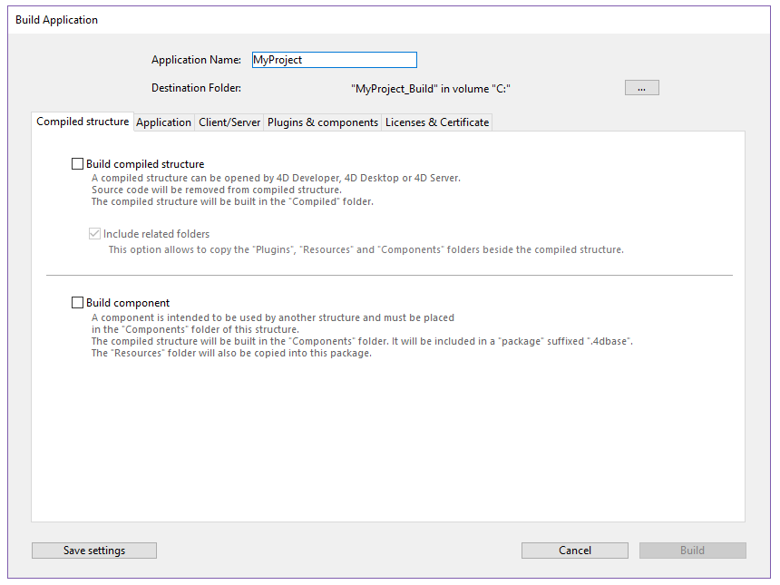
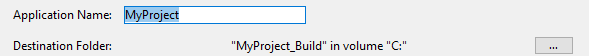
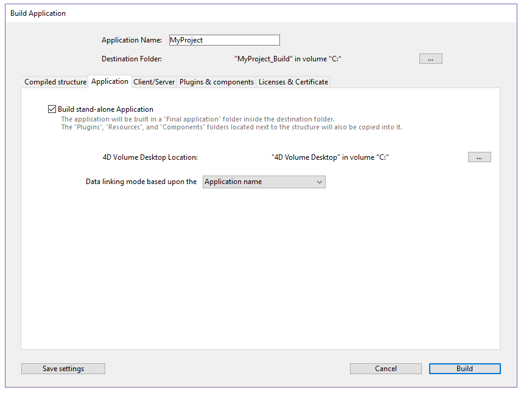
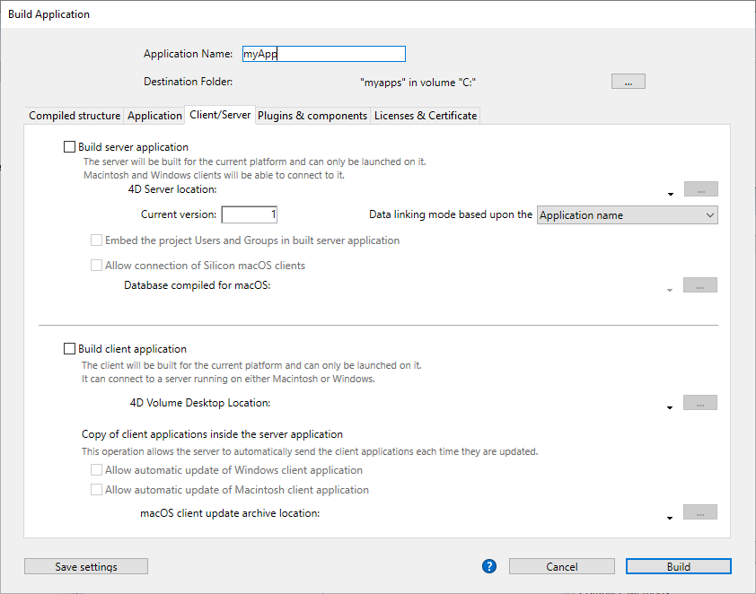
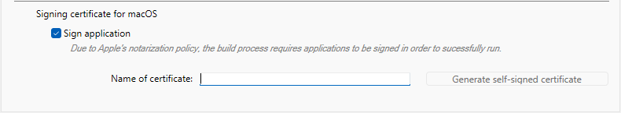
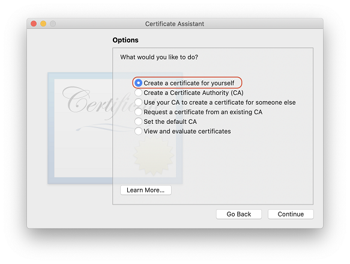
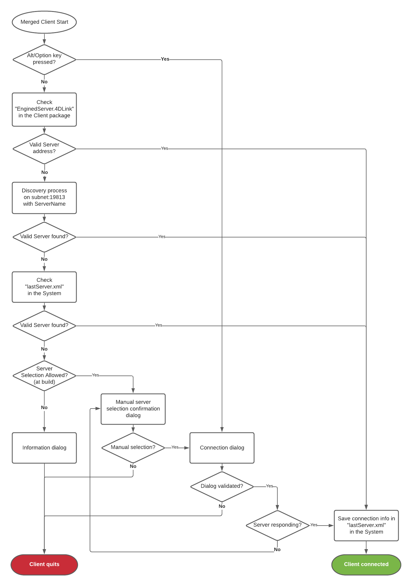

4D inclui um gerador de aplicativos para criar um pacote de projeto (versão final). Esse gerador simplifica o processo de finalização e desenvolvimento de aplicativos compilados 4D. Trata automaticamente as funcionalidades específicas de diferentes sistemas operacionais e facilita a implementação de aplicações cliente-servidor.

O construtor de aplicações permite-lhe:

- Criar uma estrutura ou componente compilado, sem código interpretado,
- Construir uma aplicação autônoma, de duplo clique, _i.e._, fundida com 4D Volume Desktop, o motor de banco de dados 4D,
- Gerar aplicações diferentes a partir do mesmo banco de dados compilado mediante um projeto XML,
- Criar aplicações cliente-servidor homogêneas,
- Construir aplicações cliente-servidor com atualização automática de partes do cliente e do servidor.
- Salve suas configurações de compilação para uso futuro (_botão Salvar configurações_)

> Aplicativos compilados são baseados em [arquivos .4dz](#build-compiled-structure) que são **somente leitura**. Tenha em mente que o uso de comandos ou funções que modificam os arquivos de origem (como `CREATE INDEX` ou `CREATE TABLE` (SQL)) não é possível por padrão em aplicações compiladas. No entanto, você pode construir aplicações específicas que suportem modificações locais utilizando a chave XML `PackProject` (veja [doc.4d.com](https://doc.4d.com)).

## Visão Geral

A cria de um pacote de projetos pode ser efetuada utilizando:

- ou o comando [`BUILD APPLICATION`](../commands-legacy/build-application.md),
- ou na [caixa de diálogo Criar aplicativo] (#application-builder).

:::tip

Você também pode fazer download e usar o [`Build4D`] (https://github.com/4d-depot/Build4D), um componente que fornece classes para compilar, construir e assinar projetos 4D, mesmo a partir de um aplicativo sem interface.

:::

### Diálogo criar aplicação

Para exibir a caixa de diálogo Criar aplicação, selecione **Design** > **Criar aplicação...** na barra de menus.


A caixa de diálogo Criar aplicação inclui várias páginas que podem ser acedidas através de separadores:



A geração do banco de dados só pode ser realizado quando o banco de dados for compilado. Se selecionar esse comando sem ter previamente compilado o banco de dados, ou no caso do código compilado não for correspondente ao código interpretado, aparece uma caixa de diálogo de advertência que indica que o banco de dados deve ser (re)compilado.

### buildApp.4DSettings

Cada parâmetro do geração da aplicação é armazenado como uma chave XML no arquivo XML `buildApp.4DSettings`, localizado na [pasta `Settings` do projeto](../Project/architecture.md#settings-1).

Os parâmetros padrão são utilizados na primeira vez que a caixa de diálogo Criar aplicação é utilizada. O conteúdo do arquivo de projeto é atualizado, se necessário, quando você clica em **Build** ou **Save settings**. You can define several other XML settings file for the same project and employ them using the [`BUILD APPLICATION`](../commands-legacy/build-application.md) command.

As chaves XML oferecem opções adicionais além daquelas exibidas na caixa de diálogo Criar aplicativo. The description of these keys are detailed in the [4D XML Keys BuildApplication](https://doc.4d.com/4Dv20/4D/20/4D-XML-Keys-BuildApplication.100-6335734.en.html) manual.

### Arquivo histórico

Quando uma aplicação é construída, 4D gera um arquivo de log chamado _BuildApp.log.xml_ na pasta **Logs** do projeto. O arquivo de registro armazena as seguintes informações para cada compilação:

- O início e o fim da construção de objetivos,
- O nome e o caminho de acesso completo dos ficheiros gerados,
- A data e a hora da geração,
- Todos os erros que forem produzidos.
- Quaisquer problemas de assinatura (por exemplo, um plug-in não assinado).

Checking this file may help you saving time during the subsequent deployment steps, for example if you intend to [notarize](#about-notarization) your application on macOS.

> Use the `Get 4D file(Build application log file)` statement to get the log file location.

## Nome da aplicação e pasta de destino



Digite o nome do aplicativo em **Application Name**.

Especifique a pasta para o aplicativo criado em **Destination Folder**. Se a pasta especificada ainda não existir, o 4D criará uma pasta _Build_ para você.

## Página de estrutura compilada

Essa guia permite que você crie um arquivo de estrutura compilado padrão ou um componente compilado:


### Construir a estrutura compilada

Gera um banco de dados que contém apenas código compilado.

Esta funcionalidad crea un archivo _.4dz_ en una carpeta `Compiled Database/<project name>`. For example, if you have named your application “MyProject”, 4D will create:

`<destination>/Compiled Database/MyProject/MyProject.4dz`

Um arquivo .4dz é essencialmente uma versão compactada da pasta do projeto. .4dz files can be used by 4D Server, 4D Volume Desktop (merged applications), and 4D. O tamanho compacto e otimizado dos arquivos .4dz torna os pacotes de projeto fáceis de implantar.

> Quando gerar arquivos .4dz, 4D usa um formato zip **padrão** por padrão. A vantagem desse formato é que ele pode ser lido facilmente por todas as ferramentas de descompactação. A vantagem desse formato é que ele pode ser lido facilmente por todas as ferramentas de descompactação. If you do not want to use this standard format, add the `UseStandardZipFormat` XML key with value `False` in your [`buildApp.4DSettings`](#build-application-settings) file (for more information, see the [4D XML Keys BuildApplication](https://doc.4d.com/4Dv20/4D/20/4D-XML-Keys-BuildApplication.100-6335734.en.html) manual).

#### Incluir pastas relacionadas

Quando você marca esta opção, todas as pastas relacionadas ao projeto são copiadas para a pasta Build como pastas _Components_ e _Resources_. Para saber mais sobre essas pastas, consulte a [descrição da arquitetura do projeto](Project/architecture.md).

### Gerar um componente

Constrói um componente compilado a partir da estrutura.

Um [componente](../Extensions/develop-components.md) é um projeto padrão 4D onde foram desenvolvidas funcionalidades específicas. Once the component has been configured and [installed in another 4D project](../Project/components.md#basics) (the host application project), its functionalities are accessible from the host project.

If you have named your application _MyComponent_, 4D will automatically create a _Components_ folder with the following structure:

`<destination_folder>/Components/MyComponent.4dbase/Contents/`.

The _MyComponent.4dbase_ folder is the [package folder of the compiled component](../Project/components.md#package-folder).

The _Contents_ folder contains:

- _MyComponent.4DZ_ file - the [compiled structure](#build-compiled-structure).
- Uma pasta _Resources_ - quaisquer Recursos associados são automaticamente copiados para esta pasta. Quaisquer outros componentes e/ou pastas de plug-ins não são copiados (um componente não pode utilizar plug-ins ou outros componentes).
- An _Info.plist_ file - this file is required to build [notarizeable and stapleable](#about-notarization) components for macOS (it is ignored on Windows). The following [Apple bundle keys](https://developer.apple.com/documentation/bundleresources/information-property-list) are prefilled:
  - `CFBundleDisplayName` and `CFBundleName` for the application name,
  - `NSHumanReadableCopyright`, can be [set using an XML key](https://doc.4d.com/4Dv20/4D/20/CommonCopyright.300-6335859.en.html).
  - `CFBundleShortVersionString` and `CFBundleVersion` for the application version (x.x.x format, e.g. 1.0.5), can be [set using an XML key](https://doc.4d.com/4Dv20/4D/20/CommonVersion.300-6335858.en.html).

## Página Aplicação

Essa guia permite que você crie uma versão autônoma e de usuário único do seu aplicativo:



### Criar uma aplicação autónoma

Checking the **Build stand-alone Application** option and clicking **Build** will create a stand-alone (double-clickable) application directly from your application project. No Windows, esta funcionalidade cria um ficheiro executável (.exe). Em macOS, trata da criação de pacotes de software.

The principle consists of merging a compiled structure file with **4D Volume Desktop** (the 4D database engine). A funcionalidade fornecida pelo ficheiro 4D Volume Desktop está ligada à oferta do produto a que se subscreveu. Para mais informações sobre este ponto, consulte a documentação de vendas e a [4D Store](http://www.4d.com/).

- Você pode definir um arquivo de dados padrão ou permitir que os usuários [criem e usem seu próprio arquivo de dados](#management-of-data-files).
- You can either embed a deployment license or let the final user enter their license at the first application launch (see the [**About licenses**](#about-licenses) paragraph).

:::note

É possível [automatizar a atualização de aplicativos mesclados de usuário único](#atualização-automática-de-aplicativos-de-servidor-ou-de-usuário-único) por meio de uma sequência de comandos de linguagem.

:::

#### Localização do 4D Volume Desktop

Para construir uma aplicação independente, você deve primeiro designar a pasta que contém o arquivo da área de trabalho do volume 4D:

- _Windows_ - a pasta contém o 4D Volume Desktop.4DE, 4D Volume Desktop.RSR, bem como vários arquivos e pastas necessários para sua operação. Esses itens devem ser colocados no mesmo nível da pasta selecionada.
- _macOS_ - 4D Volume Desktop é fornecido na forma de um pacote de software estruturado que contém vários arquivos genéricos e pastas.

Para selecionar a pasta Desktop de volume 4D, clique no botão **[...]**. Uma caixa de diálogo aparece permitindo que você designe a pasta 4D Volume Desktop (Windows) ou pacote (macOS).

Depois que a pasta for selecionada, o nome completo do caminho será exibido e, se realmente conter 4D Volume Desktop, a opção para a construção de uma aplicação executável é ativada.

> O número da versão do 4D Volume Desktop deve corresponder ao número da versão do 4D Developer Edition. For example, if you use 4D 20, you must select a 4D Volume Desktop 20.

#### Modo de ligação de dados

Esta opção permite escolher o modo de ligação entre o aplicativo mesclado e o arquivo de dados local. Estão disponíveis dois modos de ligação de dados:

- **Por nome do aplicativo** (padrão) - O aplicativo 4D abre automaticamente o arquivo de dados aberto mais recentemente correspondente ao arquivo de estrutura. Isto permite-lhe mover o pacote de aplicações livremente no disco. Esta opção deve ser geralmente utilizada para aplicações fundidas, a menos que seja especificamente necessário duplicar a aplicação.

- **Por caminho do aplicativo** - O aplicativo 4D mesclado analisará o arquivo _lastDataPath.xml_ do aplicativo e tentará abrir o arquivo de dados com um atributo "executablePath" que corresponda ao caminho completo do aplicativo. Se tal entrada for encontrada, o arquivo de dados correspondente (definido através do seu atributo "dataFilePath") será aberto. Caso contrário, o último arquivo de dados aberto será aberto (modo padrão).

Para obter mais informações sobre o modo de ligação de dados, consulte a seção [Último arquivo de dados aberto](#last-data-file-open).

#### Ficheiros gerados

Quando você clica no botão **Construir**, 4D cria automaticamente uma pasta **Aplicação Final** na **Pasta de Destino** especificada. Dentro da pasta de Aplicação Final está uma subpasta com o nome do aplicativo especificado nele.

Se você tiver especificado "MyProject" como o nome do aplicativo, encontrará os seguintes arquivos nessa subpasta (também conhecida como MyProject):

- _Windows_
  - MyProject.exe - Seu executável e um MyProject.rsr (os recursos da aplicação)
  - Pasta 4D Extensions, pasta Resources, várias bibliotecas (DLL), pasta Native Components, pasta SASL Plugins - Arquivos necessários para a operação do aplicativo
  - Database folder - Includes a Resources folder and  MyProject.4DZ file. Database folder  - Includes a Resources folder and  MyProject.4DZ file.
    **Observação**: Essa pasta também contém a pasta _Default Data_, se ela tiver sido definida (consulte [Gerenciamento de arquivos de dados em aplicativos finais](#data-file-management-in-final-applicatons)).
  - (Opcional) Pasta Components e/ou pasta Plugins - Contém todos os componentes e/ou arquivos de plug-in incluídos no banco de dados. Para mais informações sobre isso, consulte a seção [Plugins e componentes](#plugins-and-components).
  - (Optional) Licenses folder - An XML file of license numbers integrated into the application, if any. Para obter mais informações sobre isso, consulte a seção [Licenças e Certificado](#licenses-and-certificate).
  - Itens adicionais adicionados à pasta da Área de Trabalho de Volume 4D, se houver (veja [Personalizando a pasta 4D Volume Desktop)](#customizing-4d-volume-desktop-folder)).

Todos estes itens devem ser mantidos na mesma pasta para que o executável possa operar.

- _macOS_
  - Um pacote de software chamado MyProject.app que contém seu aplicativo e todos os itens necessários para sua operação, incluindo os plug-ins, componentes e licenças. Para obter mais informações sobre a integração de plug-ins e componentes, consulte a seção [Plugins e componentes](#plugins-and-components). Para obter mais informações sobre a integração de licenças, consulte a seção [Licenças e Certificado](#licenses-and-certificate). **Note**: In macOS, the [Application file](../commands-legacy/application-file.md) command of the 4D language returns the pathname of the ApplicationName file (located in the Contents:macOS folder of the software package) and not that of the .comp file (Contents:Resources folder of the software package).

#### Personalização da pasta 4D Volume Desktop

Ao criar um aplicativo autônomo, o 4D copia o conteúdo da pasta 4D Volume Desktop para a pasta Destination > _Final Application_ folder. Então, você será capaz de personalizar o conteúdo da pasta original de volume da área de trabalho 4D de acordo com suas necessidades. Pode, por exemplo:

- Instalar uma versão 4D Volume Desktop correspondente a um idioma específico;
- Add a custom _Plugins_ folder;
- Personalize o conteúdo da pasta _Resources_.

> No macOS, o 4D Volume Desktop é fornecido na forma de um pacote de software. Para modificá-lo, você deve primeiro exibir seu conteúdo (**Control+clique** no ícone).

#### Localização dos arquivos da Web

Se o seu aplicativo autônomo for usado como um servidor Web, os arquivos e pastas exigidos pelo servidor devem ser instalados em locais específicos. Estes itens são os seguintes:

- _cert.pem_ e _key.pem_ arquivos (opcional): Esses arquivos são usados para conexões TLS e por comandos de criptografia de dados,
- pasta raiz Web padrão.

Os elementos devem ser instalados:

- **No Windows**: na subpasta _Final Application\MyProject\Database_.
- **no macOS**: ao lado do pacote de software _MyProject.app_.

#### About licenses

A stand-alone application requires a deployment license. It can be embedded at build step by the developer or entered at first launch by the end-user, as described in the following table:

| Deployment license     | Descrição                                                          | Where to enter it                                                                          |
| ---------------------- | ------------------------------------------------------------------ | ------------------------------------------------------------------------------------------ |
| _4D OEM Desktop_       | Embedded custom license, contact 4D Sales for information          | [Licenses page](#licenses) of the Build application dialog                                 |
| _4D Unlimited Desktop_ | **Discontinued** - Embedded custom license                         | [Licenses page](#licenses) of the Build application dialog                                 |
| _4D Desktop_           | Per-user license, allowing them to use stand-alone 4D applications | [First activation](../Admin/licenses.md#first-activation) dialog box on the user's machine |

## Página cliente/servidor

Nessa guia, você pode criar aplicativos cliente-servidor personalizados que sejam homogêneos, multiplataforma e com uma opção de atualização automática.



### O que é uma aplicação Cliente/Servidor?

Uma aplicação cliente/servidor provém da combinação de três itens:

- A compiled 4D database,
- A aplicação 4D Server,
- A aplicação 4D Volume Desktop (macOS e/ou Windows).

Uma vez criado, um aplicativo cliente/servidor é composto de duas partes personalizadas: a parte do servidor (exclusiva) e a parte do cliente (a ser instalada em cada máquina cliente).

> Se quiser lançar uma aplicação cliente-servidor em um ambiente heterogêneo (aplicações de clliente rodando em Intel/AMD e Apple Silicon), é recomendado  compilar o projeto para todos os processsadores em uma máquina macOS, de forma que todas as aplicações cliente rodem nativamente.

Além disso, o aplicativo cliente/servidor é personalizado e fácil de usar:

- Para iniciar a parte do servidor, o usuário simplesmente clica duas vezes no aplicativo do servidor. The database does not need to be selected.
- Para iniciar a parte do cliente, o usuário simplesmente clica duas vezes no aplicativo cliente, que se conecta diretamente ao aplicativo do servidor. Você não precisa escolher um servidor em uma caixa de diálogo de conexão. O cliente direciona o servidor usando seu nome, quando o cliente e o servidor estão na mesma sub-rede, ou usando seu endereço IP, que é definido usando a chave `IPAddress` XML no arquivo buildapp.4DSettings. Se a conexão falhar, [mecanismos alternativos específicos](#management-of-client-connections) podem ser implementados). Você pode "forçar" a exibição da caixa de diálogo de conexão padrão segurando a tecla **Option** (macOS) ou **Alt** (Windows) enquanto inicia a aplicação cliente.
  Apenas a parte do cliente pode conectar à parte do servidor correspondente. Se um usuário tentar conectar à parte do servidor usando uma aplicação 4D padrão, uma mensagem de erro é retornada e a conexão é impossível.
- Uma aplicação cliente/servidor pode ser configurada para que a parte do cliente [possa ser atualizada automaticamente através da rede](#cópia-dos-aplicativos-cliente-na-aplicação-servidor). Você só precisa criar e distribuir uma versão inicial do aplicativo cliente, atualizações subsequentes são tratadas usando o mecanismo de atualização automática.
- It is also possible to automate the update of the server part through the use of a sequence of language commands ([SET UPDATE FOLDER](../commands-legacy/set-update-folder.md) and [RESTART 4D](../commands-legacy/restart-4d.md).

### Criar aplicação servidor

Marque esta opção para gerar a parte do servidor da sua aplicação durante a fase de construção. Você deve designar a localização em seu disco da aplicação 4D Server para ser usado. Esse servidor 4D deve corresponder à plataforma atual (que também será a plataforma do aplicativo do servidor).

#### Localização do 4D Server

Clique no \*\* Botão[...]\*\* e use a caixa de diálogo _Procurar pasta_ para localizar o aplicativo 4D Server Clique no \*\* Botão[...]\*\* e use a caixa de diálogo _Procurar pasta_ para localizar o aplicativo 4D Server No macOS, deve selecionar o pacote 4D Server diretamente.

#### Versão atual

Utilizado para indicar o número da versão atual da aplicação gerada. Pode então aceitar ou rejeitar ligações de aplicações cliente conforme o seu número de versão. O intervalo de compatibilidade para aplicações cliente e servidor é estabelecido usando [XML keys](#buildapp4dsettings) específicas)).

#### Incorporar o projeto Usuários e Grupos na aplicação servidor criada

**Nota Preliminar:** Os seguintes termos são utilizados nesta secção:

| Nome                                | Definição                                                                                                                                                                                   |
| ----------------------------------- | ------------------------------------------------------------------------------------------------------------------------------------------------------------------------------------------- |
| Ficheiro do directório do projecto  | arquivo [directory.json](../Users/handling_users_groups.md#directoryjson-file) localizado na pasta [Settings](../Project/architecture.md#settings-1) do projeto             |
| Ficheiro do directório de aplicação | arquivo [directory.json](../Users/handling_users_groups.md#directoryjson-file) localizado na pasta [Settings](../Project/architecture.md#settings-1) do 4D Server compilado |
| Ficheiro obrigatório                | arquivo [directory.json](../Users/handling_users_groups.md#directoryjson-file) na pasta [Data > Settings](../Project/architecture.md#settings)                              |

Quando marca esta opção, o ficheiro do directório do projecto é copiado para o ficheiro do directório da aplicação no momento da construção.

Quando se executa uma aplicação 4D Server construída:

- Se o servidor tiver um ficheiro de directório de dados, este é carregado.
- Se o servidor não tiver um ficheiro de directório de dados, o ficheiro de directório da aplicação é carregado.

O ficheiro do directório de aplicação é apenas de leitura. Modificações feitas aos usuários, grupos e permissões durante a execução do servidor são armazenadas no arquivo de diretório de dados. Se nenhum arquivo de diretório de dados já existir, ele será criado automaticamente. Se o arquivo de diretório do aplicativo foi incorporado, ele é duplicado como arquivo de diretório de dados.

Embutir o arquivo de diretório do projeto permite que você faça deploy de um aplicativo cliente/servidor com um usuário de segurança básico e configuração de grupo. As alterações subsequentes são adicionadas ao ficheiro do diretório de dados.

#### Permitir a ligação de clientes Silicon Mac

Ao construir um servidor no Windows, marque esta opção para permitir que clientes Apple Silicon se conectem ao seu aplicativo do servidor. Em seguida, você pode especificar um caminho para a estrutura compilada para Apple Silicon/Intel.

Para permitir que os clientes da Apple Silicon se conectem a um aplicativo do servidor construído no Windows, você deve primeiro construir um aplicativo cliente no macOS, com um projeto compilado para Apple Silicon e Intel. Isso cria automaticamente uma estrutura compilada, idêntica àquela criada com a opção **[Construir estrutura compilada](#construir-estrutura-compilada)** (sem as pastas relacionadas).

Em seguida, você pode copiar essa estrutura para sua máquina Windows e usá-la para construir a aplicação do servidor:


#### Localização da estrutura compilada

Ruta de acceso a la estructura compilada de la aplicación cliente Apple Silicon/Intel utilizada para crear un servidor Windows (ver [Permitir la conexión de clientes Silicon Mac](#allow-connection-of-silicon-mac-clients).

#### Modo de ligação de dados

Esta opção permite escolher o modo de ligação entre o aplicativo mesclado e o arquivo de dados local. Estão disponíveis dois modos de ligação de dados:

- **Por nome do aplicativo** (padrão) - O aplicativo 4D abre automaticamente o arquivo de dados aberto mais recentemente correspondente ao arquivo de estrutura. Isto permite-lhe mover o pacote de aplicações livremente no disco. Esta opção deve ser geralmente utilizada para aplicações fundidas, a menos que seja especificamente necessário duplicar a aplicação.

- **Por caminho do aplicativo** - O aplicativo 4D mesclado analisará o arquivo _lastDataPath.xml_ do aplicativo e tentará abrir o arquivo de dados com um atributo "executablePath" que corresponda ao caminho completo do aplicativo. Se tal entrada for encontrada, o arquivo de dados correspondente (definido através do seu atributo "dataFilePath") será aberto. Caso contrário, o último arquivo de dados aberto será aberto (modo padrão).

Para obter mais informações sobre o modo de ligação de dados, consulte a seção [Último arquivo de dados aberto](#last-data-file-open).

### Criar a aplicação cliente

Marcar esta opção gera a parte do cliente da sua aplicação durante a fase de construção.

Pode selecionar esta opção:

- juntamente com a opção [**Build server application**](#build-server-application) para construir partes correspondentes de servidor e cliente para a plataforma atual e (opcionalmente) incluir os arquivos de arquivo de atualização automática,
- sem selecionar a opção [**Construa a aplicação de servidor**](#build-server-application) geralmente para construir o arquivo de atualização a ser selecionado a partir da plataforma "simultânea" ao construir a parte do servidor.

#### Localização do 4D Volume Desktop

Designa a localização no seu disco da aplicação 4D Volume Desktop a ser usada para construir a parte cliente da sua aplicação.

> O número da versão do 4D Volume Desktop deve corresponder ao número da versão do 4D Developer Edition. For example, if you use 4D 20, you must select a 4D Volume Desktop 20.

A Área de Trabalho de Volume 4D deve corresponder à plataforma atual (que também será a plataforma do aplicativo cliente). Se você deseja criar um aplicativo cliente para a plataforma "simultânea", você deve realizar uma operação de construção adicional usando uma aplicação 4D em execução nessa plataforma.

Se você deseja que o aplicativo cliente se conecte ao servidor usando um endereço específico (diferente do nome do servidor publicado na sub-rede), você deve usar a chave `IPAddress` XML no arquivo buildapp.4DSettings. Para obter mais informações sobre esse arquivo, consulte a descrição do comando [`BUILD APPLICATION`](../commands-legacy/build-application.md). Você também pode implementar mecanismos específicos em caso de falha na conexão. Os diferentes cenários propostos são descritos no [Gerenciamento de conexões por aplicativos cliente](#management-of-client-connections) parágrafo.

#### Cópia de aplicativos cliente dentro do aplicativo servidor

As opções desta área configuram o mecanismo para atualizar as partes do cliente do(s) seus aplicativos cliente/servidor usando a rede toda vez que uma nova versão do aplicativo for gerada. Essas opções só são habilitadas quando a opção **Build client application** for marcada.

- **Permitir atualização automática do aplicativo cliente Windows** - Marque esta opção para construir um arquivo `.4darchive` que pode ser enviado para os seus aplicativos cliente na plataforma Windows em caso de atualização.
- **Permitir atualização automática do aplicativo cliente Macintosh** - Marque esta opção para construir um arquivo `.4darchive` que pode ser enviado para os seus aplicativos cliente na plataforma Macintosh em caso de atualização.

O `.4darchive` é copiado no seguinte lugar:

```
<ApplicationName>_Build/Client Server executable/Upgrade4DClient/
```

#### Seleção do arquivo cliente para a plataforma concorrente

Você pode marcar a opção **Permitir atualização automática...** para aplicativos clientes em execução na plataforma simultânea. Esta opção só é activada se:

- a opção **Build server application** está marcada,
- a opção **Permitir atualização automática** para aplicativos clientes que executam na plataforma atual está marcada.

Esta funcionalidade requer que clique no botão **[...]** e designe a localização no disco do ficheiro a utilizar para a atualização. O ficheiro a selecionar depende da plataforma do servidor atual:

| Plataforma de servidor actual | Ficheiro obrigatório                                        | Detalhes                                                                                                                                                                                                                                                                                                            |
| ----------------------------- | ----------------------------------------------------------- | ------------------------------------------------------------------------------------------------------------------------------------------------------------------------------------------------------------------------------------------------------------------------------------------------------------------- |
| macOS                         | Windows 4D Volume Desktop _o_ Windows client update archive | Por padrão, você seleciona a aplicação `4D Volume Desktop` para Windows. Para selecionar um arquivo `.4darchive` previamente construído no Windows, pressione **Shift** enquanto clica no [...] |
| Windows                       | macOS client update archive                                 | Selecione um arquivo `.4darchive` assinado, criado anteriormente no macOS                                                                                                                                                                                                                                           |

Você pode construir um arquivo específico `.4darchive` na plataforma simultânea selecionando apenas a opção [**Build client application**](#build-client-application) e a opção apropriada [**Permitir atualização automática...**](#copy-of-client-applications-inside-the-server-application).

#### Mostrar notificação de atualização

A notificação de atualização da aplicação cliente é realizada automaticamente após a atualização da aplicação do servidor.

Funciona da seguinte forma: quando uma nova versão da aplicação cliente/servidor é construída usando o construtor de aplicação, a nova parte do cliente é copiada como um arquivo compactado na subpasta **Upgrade4DClient** da pasta do Servidor **ApplicationName** (no macOS, essas pastas estão incluídas no pacote do servidor). Se você seguiu o processo de geração de um aplicativo cliente multiplataforma, um arquivo ._4darchive_ de atualização está disponível para cada plataforma:

Para acionar notificações de atualização de aplicativo cliente, basta substituir a versão antiga do aplicativo servidor pelo novo e, em seguida, executá-lo. O resto do processo é automático.

Do lado do cliente, quando a aplicação cliente "antiga" tenta conectar-se à aplicação servidor atualizada, se mostra uma caixa de diálogo na máquina cliente, indicando que há uma nova versão disponível. O utilizador pode tanto actualizar a sua versão como cancelar a caixa de diálogo.

- Se o usuário clicar em **OK**, a nova versão será baixada para a máquina cliente pela rede. Uma vez terminado o download, a antiga aplicação cliente é fechada e a nova versão é lançada e liga-se ao servidor. A versão antiga da aplicação é então colocada na lixeira da máquina.
- Se o usuário clicar em **Cancelar**, a atualização é cancelada; se a versão antiga do aplicativo cliente não estiver na faixa de versões aceitas pelo servidor (por favor, consulte o parágrafo a seguir), o aplicativo será fechado e a conexão será impossível. Caso contrário (por defeito), a ligação é estabelecida.

#### Forçar atualizações automáticas

Em alguns casos, poderá querer impedir que as aplicações cliente possam cancelar a transferência da atualização. Por exemplo, se usou uma nova versão da aplicação fonte 4D Server, a nova versão da aplicação cliente deve absolutamente ser instalada em cada máquina cliente.

Para forçar a atualização, basta excluir o número da versão atual das aplicações cliente (X-1 e anteriores) no intervalo de números de versão compatível com a aplicação do servidor. Neste caso, o mecanismo de atualização não permitirá a conexão de aplicativos cliente não atualizados. Por exemplo, se a nova versão do aplicativo cliente-servidor for 6, pode estipular-se que qualquer aplicativo cliente com um número de versão inferior a 6 não será autorizado a ligar.

O [número da versão atual](#current_version) é definido na página do Cliente/Servidor da caixa de diálogo da aplicação de construção. Os intervalos de números autorizados são definidos no projeto de aplicação usando [chaves XML específicas](#buildapp4dsettings).

#### Erro de actualização

Se 4D não puder realizar a atualização do aplicativo cliente, a máquina do cliente exibe a seguinte mensagem de erro: "A atualização da aplicação do cliente falhou. A aplicação vai agora fechar."

Existem muitas causas possíveis para este erro. Quando você receber esta mensagem, é aconselhável verificar os seguintes parâmetros primeiro:

- **Pathnames** - Verifique a validade dos pathnames definidos no projeto de aplicação através da caixa de diálogo do Construtor de Aplicação ou via chaves XML (por exemplo ClientMacFolderToWin\*). Em particular, verifique os caminhos para as versões do 4D Volume Desktop.
- **Privilégios de leitura/gravação** - Na máquina do cliente, verifique se o usuário atual tem direitos de acesso de escrita para a atualização do aplicativo do cliente.

### Ficheiros gerados

Uma vez que um aplicativo cliente/servidor é criado, você encontrará uma nova pasta na pasta de destino chamada **Server executável do Cliente**. Esta pasta contém duas subpastas, `<ApplicationName>Cliente` e `<ApplicationName>Servidor`.

> Estas pastas não são geradas se ocorrer um erro. Neste caso, abra o [arquivo de log](#log-file) para descobrir a causa do erro.

A pasta `<ApplicationName>Cliente` contém a porção do cliente do aplicativo correspondente à plataforma de execução do construtor de aplicativo. Esta pasta deve ser instalada em cada máquina do cliente. A pasta `<ApplicationName>Server` contém a parte do servidor da aplicação.

O conteúdo dessas pastas varia dependendo da plataforma atual:

- Se você quiser integrar outros plugins ou componentes na aplicação executável, você só precisa colocá-los em uma pasta **Plugins** ou **Components** ao lado da aplicação 4D Volume Desktop ou ao lado do aplicativo 4D do servidor. O mecanismo para copiar o conteúdo da pasta do aplicativo de origem (ver [Personalizando a pasta 4D Volume Deskto](#customizing-4d-volume-desktop-folder)) pode ser usado para integrar qualquer tipo de arquivo no aplicativo executável.
- _macOS_ - Cada pasta contém apenas o pacote de aplicação, chamado `<ApplicationName> Client` para a parte do cliente e `<ApplicationName> Server` para a parte do servidor. Cada pacote contém todos os itens necessários para que a aplicação funcione. No macOS, inicie um pacote fazendo duplo clique no mesmo.

> Os pacotes macOS construídos contêm os mesmos itens que as subpastas do Windows. Você pode exibir seus conteúdos (**Control+click** no ícone) para poder modificá-los.

Se você marcou a opção "Permitir atualização automática do aplicativo cliente", uma subpasta adicional chamada _Upgrade4DClient_ é adicionada na pasta/pacote `<ApplicationName>Server`. Esta subpasta contém o aplicativo cliente no macOS e/ou no formato Windows como um arquivo compactado. Este ficheiro é utilizado durante a atualização automática das aplicações clientes.

#### Localização dos arquivos da Web

Se o servidor e/ou cliente parte do seu aplicativo clicável duplo for usado como um servidor web, os arquivos e pastas exigidos pelo servidor devem ser instalados em locais específicos. Estes itens são os seguintes:

- _cert.pem_ e _key.pem_ arquivos (opcional): Esses arquivos são usados para conexões TLS e por comandos de criptografia de dados,
- Pasta raiz Web por defeito (WebFolder).

Os elementos devem ser instalados:

- **em Windows**
  - **Aplicativo do servidor** - na subpasta `Cliente Servidor executável/<ApplicationName>Server/Banco de Dados do Servidor`.
  - **Aplicativo do cliente** - na subpasta `Client Server executable/<ApplicationName>Client`.

- **no macOS**
  - **Aplicativo do servidor** - ao lado do pacote de software `<ApplicationName>Server`.
  - **Aplicação de cliente** - ao lado do pacote de software \\`<ApplicationName>cliente.

### Incorporar uma aplicação cliente usuário único

4D lhe permite incorporar uma estrutura compilada na aplicação cliente. Esse recurso pode ser usado, por exemplo, para fornecer aos usuários um aplicativo "portal", que dá acesso a diferentes aplicativos de servidor graças ao comando `OPEN DATABASE` executando um arquivo `.4dlink`.

Para ativar este recurso, adicione as chaves DatabaseToEmbedInClientWinFolder e/ou DatabaseToEmbedInClientMacFolder no arquivo de configurações do buildApp. Quando uma das chaves estiver presente, a aplicação cliente gera uma aplicação monousuário: a estrutura compilada, ao inves do arquivo EnginedServer.4Dlink é colocada na pasta "Database".

- Se existir uma pasta de dados padrão no aplicativo de usuário único, uma licença será incorporada.
- Se não existir uma pasta de dados padrão no aplicativo de usuário único, ela será executada sem arquivo de dados e sem licença.

O cenário básico é o seguinte:

1. Na caixa de diálogo da Aplicação de Construção, selecione a opção "Construir estrutura compilada" para produzir um . DZ ou .4DC para o aplicativo a ser usado em modo de usuário único.
2. No aplicativo da construção. DSettings arquivo da aplicação cliente-servidor, use o seguinte xml chave(s) para indicar o caminho para a pasta que contém a compilação de aplicação de único usuário:

- `DatabaseToEmbedInClientWinFolder`
- `DatabaseToEmbedInClientMacFolder`

3. Construir a aplicação cliente-servidor. Isto terá os seguintes efeitos:

- toda a pasta do aplicativo do único usuário é copiada dentro da pasta "Database" do cliente mesclado
- o ficheiro _EnginedServer.4Dlink_ da pasta "Database" não é gerado
- o .4DC, .4DZ, .4DIndy arquivos da cópia do aplicativo de usuário único são renomeados usando o nome do cliente mesclado
- a chave `PublishName` não é copiada no _info.plist_ do cliente mesclado
- Se o aplicativo de usuário único não tiver uma pasta "Dados padrão", o cliente mesclado será executado sem dados.

Automatic update 4D Server features ([Current version](#current-version) number, [`SET UPDATE FOLDER`](../commands-legacy/set-update-folder.md) command...) funciona com aplicação de usuário único como com aplicação remota padrão. Na conexão, o aplicativo de usuário único compara sua chave `CurrentVers` com o intervalo de versão do 4D Server. Se fora do intervalo, o aplicativo cliente atualizado será baixado do servidor e o atualizador iniciará o processo de atualização local.

### Personalização dos nomes da pasta de cache cliente e/ou servidor

Pastas de cache de cliente e servidor são usadas para armazenar elementos compartilhados como recursos ou componentes. Eles são necessários para gerenciar as trocas entre o servidor e os clientes remotos. Aplicações cliente/servidor usam caminhos padrão para as pastas de cache do sistema de cliente e servidor.

Em alguns casos específicos, talvez seja necessário personalizar os nomes dessas pastas para implementar arquiteturas específicas (veja abaixo). 4D fornece chaves `ClientServerSystemFolderName` e `ServerStructureFolderName` a serem definidas no arquivo de configurações do _buildApp_.

#### Pasta de cache cliente

Personalizar o nome da pasta de cache do lado do cliente pode ser útil quando sua aplicação do cliente é usada para se conectar a vários servidores mesclados que são similares, mas usam conjuntos de dados diferentes. Neste caso, para salvar vários downloads desnecessários de recursos locais idênticos, você pode usar a mesma pasta de cache local personalizada.

- Configuração padrão (_para cada conexão para um servidor, uma pasta cache é baixada ou atualizada_):


- Usando a chave `ClientServerSystemFolderName` (_uma única pasta de cache é usada para todos os servidores_):


#### Pasta de cache do servidor

Personalizar o nome da pasta de cache no lado do servidor é útil quando você executa vários aplicativos de servidor idênticos criados com diferentes versões 4D no mesmo computador. Se você quiser que cada servidor use seu próprio conjunto de recursos, você precisará personalizar a pasta de cache do servidor.

- Configuração padrão (_aplicativos do mesmo servidor compartilham a mesma pasta de cache_):


- Usando a tecla `ServerStructureFolderName` (_uma pasta de cache dedicada é usada para cada aplicativo de servidor_):


## Página Plugins e componentes

Nesta aba, você definiu cada um dos [**plug-in**](Concepts/plug-ins.md), [**component**](../Project/components.md), e [**module**](#deselecting-modules) que você usará em seu aplicativo autônomo ou cliente/servidor.

A página lista os elementos carregados pela aplicação 4D atual:


- **Coluna Active** - Indica que os itens serão integrados no pacote de aplicação compilado. Todos os itens são marcados por padrão. Para excluir um plug-in, um componente ou um módulo, desmarque a caixa de seleção ao lado dele.

- Coluna **Plugins e componentes** - Exibe o nome do plug-in/component/module.

- **ID** coluna - Exibe o número de identificação do elemento (se houver).

- **Coluna Tipo** - Indica o tipo do item: Plug-in, Componente, ou Módulo.

### Adicionar plug-ins ou componentes

If you want to integrate other plug-ins or components into the executable application, you just need to place them in a **Plugins** or **Components** folder next to the 4D Volume Desktop application or next to the 4D Server application. O mecanismo para copiar o conteúdo da pasta do aplicativo de origem (ver [Personalizando a pasta 4D Volume Deskto](#customizing-4d-volume-desktop-folder)) pode ser usado para integrar qualquer tipo de arquivo no aplicativo executável.

Se houver um conflito entre duas versões diferentes do mesmo plug-in (uma carregada por 4D e a outra localizada na pasta do aplicativo de origem), prioridade vai para o plug-in instalado na pasta Volume Desktop/4D do Servidor. No entanto, se houver duas instâncias do mesmo componente, o aplicativo não abrirá.

> O uso de plug-ins e/ou componentes em uma versão de implantação pode requerer números de licença.

### Anular a selecção de módulos

Um módulo é uma biblioteca de código integrada usada por 4D para controlar funções específicas. Se você sabe que sua aplicação construída não utiliza nenhum dos recursos cobertos por um módulo, você pode desselecioná-lo na lista para reduzir o tamanho dos arquivos da sua aplicação.

> **Aviso:** Desmarcar um módulo pode impedir que sua aplicação construída funcione como esperado. Se você não tem 100% de certeza de que um módulo nunca é chamado por sua aplicação, é recomendado mantê-lo selecionado.

Os seguintes módulos opcionais podem ser desmarcados:

- **CEF**: biblioteca integrada Chromium. É necessário executar [áreas Web](../FormObjects/webArea_overview.md) que usem o mecanismo de renderização incorporado e [áreas 4D View Pro](../FormObjects/viewProArea_overview.md). Chamar essas áreas quando o CEF for deseleito, mostrará áreas em branco e/ou gerará erros.
- **MeCab**: Biblioteca usada para indexação de texto em idioma japonês (veja este [parágrafo de configurações](../settings/database.md#support-of-mecab-japanese-version)). Desmarcar este módulo irá forçar os índices de texto a serem reconstruídos na língua japonesa.

> Se você desmarcar o MeCab para um aplicativo na linguagem japonesa usado em plataformas heterogêneas, certifique-se de desmarcá-lo na compilação cliente/servidor e na compilação do aplicativo cliente (para a plataforma simultânea) caso contrário, serão detectadas defeituosas no aplicativo.

- **SpellChecker**: usado para [correção ortográfica](../FormObjects/properties_Entry.md#auto-spellcheck) e comandos disponíveis para áreas de entrada e para áreas 4D Write Pro.
- **4D Updater**: Controla a [atualização automática](#what-is-a-clientserver-application) das partes do cliente e é usado pelo comando `SET UPDATE FOLDER` para [atualizações automáticas do servidor](#automatic-updating-of-server-or-single-user-applications).

## Página de licenças e certificados

A página de Licenças e Certificados pode ser usada:

- designate the license number(s) that you want to integrate into your single-user [stand-alone application](#application-page),
- assinar a aplicação através de um certificado no macOS.


### Licenças

This tab displays the list of available [deployment licenses that you can embed](#about-licenses) into your application. Por padrão, a lista está vazia.

:::info

If you keep the list empty, you build a stand-alone application without embedded deployment license. In this case, the end-user will have to purchase and enter a per-user _4D Desktop_ license. If you integrate a deployment license, the user will not have to enter or use their own license number at application startup. For more information, see the [**About licenses**](#about-licenses) paragraph.

:::

Your current _4D Developer Professional_ license is automatically associated with each deployment license to be used in the application built. You can add another 4D Developer Professional number and its associated licenses.

Para remover ou adicionar uma licença, use os **[+]** e **[-]** botões na parte inferior da janela.

Quando você clicar no botão \[+], uma caixa de diálogo 'Abrir arquivo' aparece exibindo por padrão o conteúdo da pasta _Licenças_ do seu computador. For more information about the location of this folder, refer to the [Get 4D folder](../commands-legacy/get-4d-folder.md) command.

Você deve designar os arquivos que contêm sua licença de desenvolvedor, bem como os que contém suas licenças de implantação. These files were generated or updated when the _4D Developer Professional_ license and the deployment licenses were purchased.

Depois de selecionar um arquivo, a lista indicará as características da licença que ele contém.

- **Licença #** - Número de licença do produto
- **Licença** - Nome do produto
- **Data de expiração** - Data de expiração da licença (se houver)
- **Caminho** - Localização em disco

Se uma licença não for válida, será avisado por uma mensagem.

Pode designar o número de ficheiros válidos que desejar. Ao construir uma aplicação executável, o 4D usará a licença mais apropriada disponível.

> Licenças "R" dedicadas são necessárias para criar aplicativos com base nas versões de "R-release" (números de licença para "R" produtos começam com "R-4DP").

After a licensed application is built, a new deployment license file is automatically included in the Licenses folder next to the executable application (Windows) or in the package (macOS).

### macOS signing certificate

O construtor de aplicativos pode assinar aplicativos 4D mesclados no macOS (aplicativos de usuário único, componentes, servidor 4D e partes de clientes sob macOS). A assinatura de um aplicativo autoriza que ele seja executado usando a funcionalidade de Gatekeeper do macOS quando a opção "Mac App Store e Desenvolvedores identificados" estiver selecionada (veja "Sobre Gatekeeper" abaixo).

- Check the **Sign application** option to include certification in the application builder procedure for macOS. 4D will check the availability of elements required for certification when the build occurs:



Esta opção é exibida tanto no Windows quanto no macOS, mas apenas é tida em conta para as versões do macOS.

- **Nome do certificado** - Digite o nome do seu certificado de desenvolvedor validado pela Apple nesta área de entrada. O nome do certificado geralmente é o nome do certificado no utilitário Acesso Keychain (parte em vermelho no exemplo a seguir):


Para obter um certificado de desenvolvedor da Apple, Inc., você pode usar os comandos do menu Acesso Keychain ou vá aqui: [http://developer.apple.com/library/mac/#documentation/Security/Conceptual/CodeSigningGuide/Procedures/Procedures.html](http://developer.apple.com/library/mac/#documentation/Security/Conceptual/CodeSigningGuide/Procedures/Procedures.html).

> Este certificado requer a presença da utilidade do co design da Apple, que é fornecida por padrão e geralmente localizada na pasta "/usr/bin/". Se ocorrer um erro, verifique se este utilitário está presente em seu disco.

- **Gerar certificado auto-assinado** - executa o "Assistente de Certificado" que permite gerar um certificado auto-assinado. Se você não tiver um certificado de desenvolvedor da Apple, você precisará fornecer um certificado auto-assinado. Com este certificado, nenhuma mensagem de alerta é exibida se a aplicação for implementada internamente. Se a aplicação é implantada externamente (por exemplo, através de http ou e-mail), na inicialização do macOS exibe uma mensagem de alerta de que o desenvolvedor da aplicação é não identificado. O usuário pode "forçar" a abertura da aplicação. No "Assistente de certificado", certifique-se de selecionar as opções apropriadas:
  
  

> 4D recomenda assinar o Programa de Desenvolvimento da Apple para obter acesso a Certificados de Desenvolvedor que são necessários para notarizar aplicativos (veja abaixo).

#### Sobre Gatekeeper

Gatekeeper is a security feature of macOS that controls the execution of applications downloaded from the Internet. Se um aplicativo baixado não vem da Apple Store ou não estiver assinado, será rejeitado e não poderá ser iniciado.

> Nas máquinas do Apple Silicon, os [componentes](#components) do 4D precisam ser realmente assinados. Um componente não assinado irá gerar um erro ao iniciar o aplicativo ("lib4d-arm64.dylib não pode ser aberto...").

A aplicação Sinal opção do construtor de aplicação 4D permite que você gere aplicativos e componentes que são compatíveis com esta opção por padrão.

#### Sobre a notarização

A notarização de aplicação é altamente recomendada pela Apple a partir do macOS 10.14.5 (Mojave) e 10. 5 (Catalina), pois aplicativos não notariados implantados através da internet são bloqueados por padrão.

The 4D [built-in signing features](#macos-signing-certificate) have been adapted to meet all of Apple's requirements to allow using the Apple notary service. A notarização em si deve ser conduzida pelo desenvolvedor e é independente da 4D (note também que ela requer a instalação do Xcode). Por favor, consulte [este post no blog 4D](https://blog.4d.com/how-to-notarize-your-merged-4d-application/) que fornece uma descrição passo a passo do processo de notarização.

Para mais informações sobre o conceito de notarização, por favor consulte [esta página no site de desenvolvedores da Apple](https://developer.apple.com/documentation/xcode/notarizing_your_app_before_distribution/customizing_the_notarization_workflow).

For more information on the stapling concept, please read [this Apple forum post](https://forums.developer.apple.com/forums/thread/720093).

## Personalizar ícones de uma aplicação

4D associa um ícone padrão com sistema autônomo, servidor e aplicativos clientes, no entanto, você pode personalizar o ícone para cada aplicativo.

- **macOs** - Ao construir uma aplicação com duplo clique, 4D lida com a personalização do ícone. Para fazer isso, você deve criar um arquivo de ícone (tipo de icns), antes de criar o arquivo do aplicativo, e colocá-lo ao lado da pasta do projeto.

> A Apple, Inc. fornece uma ferramenta específica para a construção de arquivos de ícones _icns_ (para mais informações, consulte a [documentação da Apple](https://developer.apple.com/library/archive/documentation/GraphicsAnimation/Conceptual/HighResolutionOSX/Optimizing/Optimizing.html#/apple_ref/doc/uid/TP40012302-CH7-SW2)).

Seu arquivo de ícone deve ter o mesmo nome do arquivo de projeto e incluir a extensão _.ico_. 4D leva este arquivo automaticamente em conta ao construir um aplicativo clicável duplo.

- **Windows** - Ao construir uma aplicação clicável e dupla, o 4D lida com a personalização do seu ícone. Para fazer isso, você deve criar um arquivo de ícone (_.ico_ extensão), antes de construir o arquivo do aplicativo e colocá-lo ao lado da pasta do projeto.

Seu arquivo de ícone deve ter o mesmo nome do arquivo de projeto e incluir a extensão .ico. 4D leva automaticamente este arquivo em conta ao construir o aplicativo clicável duplo (o arquivo _.icns_ é renomeado _ApplicationName.

You can also set specific [XML keys](https://doc.4d.com/4Dv20/4D/20/4D-XML-Keys-BuildApplication.100-6335734.en.html) in the buildApp.4DSettings file to designate each icon to use. Estão disponíveis as seguintes chaves:

- RuntimeVLIconWinPath
- RuntimeVLIconMacPath
- ServerIconWinPath
- ServerIconMacPath
- ClientMacIconForMacPath
- ClientWinIconForMacPath
- ClientMacIconForWinPath
- ClientWinIconForWinPath

## Gestão do(s) ficheiro(s) de dados

### Abertura do ficheiro de dados

Quando um usuário lança um aplicativo mesclado ou uma atualização (usuário único ou aplicativo/servidor), 4D tenta selecionar um arquivo de dados válido. A aplicação examina sucessivamente vários locais.

A sequência para o lançamento de uma aplicação fusionada a seguinte:

1. O 4D tenta abrir o último arquivo de dados aberto, [conforme descrito abaixo](#last-data-file-opened) (não aplicável durante a inicialização inicial).
2. Se não for encontrado, 4D tenta abrir o arquivo de dados em uma pasta de dados padrão ao lado do arquivo .4DZ em modo somente leitura.
3. Se não for encontrado, 4D tenta abrir o arquivo de dados padrão (mesmo nome e mesmo local do arquivo .4DZ).
4. Se não for encontrado, 4D mostra uma caixa de diálogo padrão "Abrir ficheiro de dados".

### Último arquivo de dados aberto

#### Caminho do último arquivo de dados

Quaisquer aplicativos autônomos ou de servidor criados com 4D armazenam o caminho do último arquivo de dados aberto na pasta preferências do usuário do aplicativo.

O local da pasta de preferências do usuário da aplicação corresponde ao caminho retornado pela seguinte instrução:

```4d
userPrefs:=Get 4D folder(Pasta 4D activa)
```

O caminho do arquivo de dados é armazenado em um arquivo dedicado, chamado _lastDataPath.xml_.

Graças a esta arquitetura, quando você fornece uma atualização do seu aplicativo, o arquivo de dados do usuário local (último arquivo de dados utilizado) é aberto automaticamente na primeira inicialização.

Este mecanismo é geralmente adequado para implantações padrão. No entanto, para necessidades específicas, por exemplo, se você duplicar seus aplicativos mesclados, você pode querer alterar a forma como o arquivo de dados está vinculado ao aplicativo (descrito abaixo).

#### Configuração do modo de ligação de dados

Com suas aplicações compiladas, o 4D utiliza automaticamente o último arquivo de dados aberto. Por padrão, o caminho do arquivo de dados é armazenado na pasta de preferências do usuário do aplicativo e está vinculado ao nome da aplicação\*\*.

Isso pode ser inadequado se você quiser duplicar um aplicativo com merge destinado a usar arquivos de dados diferentes. Os aplicativos duplicados realmente compartilham a pasta de preferências do usuário do aplicativo e assim, sempre use o mesmo arquivo de dados -- mesmo que o arquivo de dados seja renomeado, porque o último arquivo usado para o aplicativo é aberto.

Por conseguinte, a 4D permite ligar o caminho do arquivo de dados ao caminho da aplicação. Neste caso, o arquivo de dados será vinculado usando um caminho específico e não será apenas o último arquivo aberto. Você vincula, portanto, seus dados **por caminho da aplicação**.

Este modo permite a você duplicar seus aplicativos mesclados sem quebrar o link para o arquivo de dados. No entanto, com esta opção, se o pacote do aplicativo for movido no disco, o usuário será solicitado por um arquivo de dados, já que o caminho do aplicativo não corresponderá mais ao atributo "executablePath" (depois que um usuário tenha selecionado um arquivo de dados, o lastDataPath. ml arquivo é atualizado adequadamente).

_Duplicação quando os dados vinculados pelo nome da aplicação:_


_Duplicação quando os dados são vinculados pelo caminho do aplicativo:_


Você pode selecionar o modo de ligação de dados durante o processo de construção do aplicativo. Você também pode:

- Use a página [Application](#application) ou a página [Cliente/Servidor](#client-server) da caixa de diálogo da Construção da Aplicação.
- Use a chave **LastDataPathLookup** XML (aplicativo de usuário único ou aplicativo do servidor).

### Definição de uma pasta de dados por defeito

4D permite definir um ficheiro de dados padrão na fase de construção da aplicação. Quando a aplicação é iniciada pela primeira vez, se nenhum arquivo de dados local for encontrado (veja abertura sequencia descrita acima do), o arquivo de dados padrão é aberto automaticamente no modo somente leitura por 4D. Isto dá a você melhor controle sobre a criação e/ou abertura de arquivos ao iniciar uma aplicação mesclada pela primeira vez.

Mais especificamente, são abrangidos os seguintes casos:

- Evitar a exibição da caixa de diálogo 4D "Abrir Arquivo de Dados" ao iniciar um aplicativo novo ou atualizado com mesclagem. Você pode detectar, por exemplo, na inicialização, que o arquivo de dados padrão foi aberto e, portanto, executa seu próprio código e/ou diálogos para criar ou selecionar um arquivo de dados local.
- Permitir a distribuição de aplicativos mesclados com dados somente de leitura (para aplicativos de demonstração, por exemplo).

Para definir e utilizar um ficheiro de dados padrão:

- Você fornece um arquivo de dados padrão (chamado "Default.4DD") e o armazena em uma pasta padrão (chamado "Dados Padrão") dentro da pasta do projeto do aplicativo. Este arquivo deve ser fornecido juntamente com todos os outros arquivos necessários, dependendo da configuração do projeto: índice (.4DIndx), Blobs externos, periódico, etc. É sua responsabilidade fornecer um ficheiro de dados padrão válido. No entanto, note que, uma vez que um arquivo de dados padrão é aberto em modo somente leitura, é recomendável desmarcar a opção "Usar Arquivo de Log" no arquivo de estrutura original antes de criar o arquivo de dados.
- Quando a aplicação é criada, a pasta de dados predefinida é integrada na aplicação fundida. Todos os ficheiros dentro desta pasta de dados predefinida também são incorporados.

O gráfico seguinte ilustra esta funcionalidade:


Quando o arquivo de dados padrão é detectado na primeira inicialização, ele é silenciosamente aberto em modo somente leitura Assim, permite que você execute operações personalizadas que não modifiquem o arquivo de dados em si.

## Gestão da(s) ligação(ões) cliente

A gestão de conexões por aplicativos cliente cobre os mecanismos pelos quais um aplicativo cliente mesclado se conecta ao servidor de destino, uma vez situada no seu ambiente de produção.

### Cenário de ligação

O procedimento de conexão para aplicativos cliente mesclados suporta casos onde o servidor dedicado não está disponível. O cenário de inicialização de um aplicação cliente 4D é o seguinte:

1. Se informações de conexão válidas forem armazenadas no arquivo "EnginedServer.4DLink" dentro do aplicativo cliente, o aplicativo cliente se conecta ao endereço do servidor especificado.\
   OU
   O aplicativo cliente tenta se conectar ao servidor usando o serviço de descoberta (com base no nome do servidor, transmitido na mesma sub-rede).\
   OU
   O aplicativo cliente tenta se conectar ao servidor usando o serviço de descoberta (com base no nome do servidor, transmitido na mesma sub-rede).

2. Se isso falhar, o aplicativo cliente tenta se conectar ao servidor usando informações armazenadas na pasta de preferências do usuário do aplicativo ("lastServer. ml" arquivo, veja a última etapa).

3. Se isso falhar, o aplicativo cliente exibe uma caixa de diálogo de erro de conexão.

- Se o usuário clicar no botão **Selecionar...** (quando permitido pelo desenvolvedor 4D na etapa de compilação, veja abaixo), a caixa de diálogo padrão "Conexão do servidor" é exibida.
- Se o usuário clicar no botão **Sair**, o aplicativo cliente fecha.

4. Se a conexão for bem-sucedida, o aplicativo cliente salva esta informação de conexão na pasta de preferências de usuário do aplicativo para uso futuro.

Todo o procedimento é descrito no diagrama seguinte:



### Armazenar o último caminho do servidor

O último caminho de servidor usado e validado é automaticamente salvo em um arquivo chamado "lastServer.xml" na pasta de preferências do usuário do aplicativo. Esta pasta está armazenada na seguinte localização:

```4d
userPrefs:=Get 4D folder(Pasta 4D activa)
```

Este mecanismo aborda o caso de o servidor principal alvo estar temporariamente indisponível por algum motivo (modo de manutenção, por exemplo). Quando este caso ocorre pela primeira vez, a caixa de diálogo de seleção do servidor é exibida (se permitido, veja abaixo) e o usuário pode selecionar manualmente um servidor alternativo, cujo caminho é então salvo se a conexão for bem-sucedida. Qualquer não-disponibilidade subsequente seria tratada automaticamente através da informação do caminho "lastServer.xml".

> - When client applications cannot permanently benefit from the discovery service, for example because of the network configuration, it is recommended that the developer provide a host name at build time using the [IPAddress](https://doc.4d.com/4Dv20/4D/20/IPAddress.300-6335763.en.html) key in the "BuildApp.4DSettings" file. O mecanismo aborda os casos de indisponibilidade temporária.
> - Pressionar a tecla **Alt/Option** durante a inicialização para exibir a caixa de diálogo de seleção do servidor ainda é suportada em todos os casos.

### Disponibilidade da caixa de diálogo de seleção do servidor em caso de erro

Você pode escolher se deseja ou não exibir a caixa de diálogo de seleção padrão do servidor em aplicações cliente mescladas quando o servidor não pode ser alcançado. The configuration depends on the value of the [ServerSelectionAllowed](https://doc.4d.com/4Dv20/4D/20/ServerSelectionAllowed.300-6335767.en.html) XML key on the machine where the application was built:

- **exibir uma mensagem de erro sem acesso possível à caixa de diálogo de seleção do servidor**. Operação padrão. A aplicação só pode encerrar.\
  A aplicação só pode encerrar.\
  `ServerSelectionAllowed`: **False** or key omitted
  

- **exibir uma mensagem de erro com acesso à caixa de diálogo de seleção do servidor possível**. O usuário pode acessar a janela de seleção do servidor clicando no botão Select....
  `ServerSelectionAllowed`: **True**
  
  

## Atualização automática de aplicações servidor ou usuário único

Em princípio, atualizar aplicativos do servidor ou fundir aplicativos de único usuário requer a intervenção do usuário (ou programar sistemas personalizados rotinas): sempre que uma nova versão do aplicativo mesclado estiver disponível, você tem que sair da aplicação em produção e substituir manualmente os arquivos antigos pelos novos; então reinicie o aplicativo e selecione o arquivo de dados atual.

You can automate this procedure to a large extent using the following language commands: [`SET UPDATE FOLDER`](../commands-legacy/set-update-folder.md), [`RESTART 4D`](../commands-legacy/restart-4d.md), and also [`Get last update log path`](../commands-legacy/get-last-update-log-path.md) for monitoring operations. A ideia é implementar uma função em seu aplicativo 4D ativando a sequência de atualização automática descrita abaixo. Pode ser um comando de menu ou um processo sendo executado em segundo plano e verificando, em intervalos regulares, a presença de um arquivo em um servidor.

> You also have XML keys to elevate installation privileges so that you can use protected files under Windows (see the [4D XML Keys BuildApplication](https://doc.4d.com/4Dv20/4D/20/4D-XML-Keys-BuildApplication.100-6335734.en.html) manual).

Este é o cenário para atualizar um servidor ou aplicação mesclada usuário único:

1. Você transfere, por exemplo, usando um servidor HTTP, a nova versão do aplicativo de servidor ou o aplicativo de usuário único mesclado para a máquina em produção.
2. Na aplicação em produção, você chama o comando `SET UPDATE FOLDER`: este comando designa a localização da pasta onde a atualização "pendente" da aplicação atual é encontrada. Opcionalmente, você pode copiar nesta pasta os elementos personalizados da versão em produção (arquivos do usuário).
3. Na aplicação em produção, chama o comando `RESTART 4D`: este comando aciona automaticamente a execução de um programa de utilidade chamado "atualizador" que sai do aplicativo atual, substitui usando a atualização "pendente" se for especificada e reinicia o aplicativo com o arquivo de dados atual. A versão anterior é renomeada.

> Esta sequência é compatível com aplicações servidor Windows executadas como um Serviço.

### Histórico de atualização

O procedimento de instalação produz um arquivo de log detalhando as operações de atualização de aplicativos mesclados (cliente, servidor ou único usuário) nas máquinas de destino. Este arquivo é útil para analisar quaisquer erros que ocorram durante o processo de instalação.

O log de atualização é chamado `YYYY-MM-DD_HH-MM-SS_log_X.txt`, por exemplo, `2021-08-25_14-23-00_log_1.txt` para um arquivo criado em 25 de agosto de 2021 às 14:23.

Este arquivo é criado na pasta de aplicativos "Atualizadores", dentro da pasta de usuário do sistema. You can find out the location of this file at any time using the [`Get last update log path`](../commands-legacy/get-last-update-log-path.md) command.
