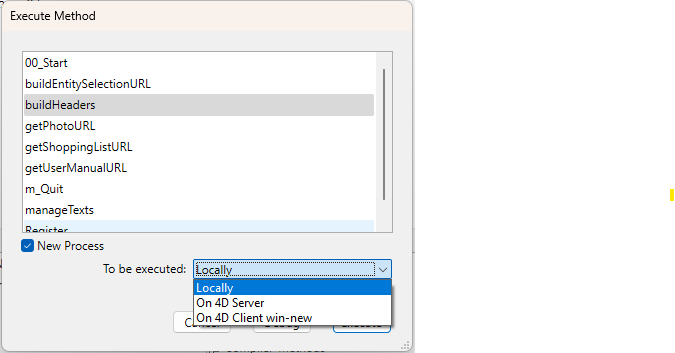

As aplicações 4D desktop podem ser utilizadas numa configuração Cliente/Servidor, quer como aplicações cliente/servidor fundidas, quer como projectos remotos.

- Os **aplicativos cliente/servidor mesclados** são gerados pelo [Gerenciador de aplicativos de compilação] (building.md#clientserver-page). São utilizados para implementações de aplicações.

- **Projetos remotos** são arquivos [.4DProject](Project/architecture.md) abertos pelo 4D Server e acessados com o 4D em modo remoto. O servidor envia uma versão .4dz do projeto ([formato comprimido](building.md#build-compiled-structure)) para o 4D remoto, assim os arquivos de estrutura são apenas de leitura. Esta configuração é normalmente utilizada para testar aplicações.


> Conectar a um projeto remoto da **mesma máquina que o 4D Server** permite modificar os arquivos do projeto. Esta [funcionalidade específica](#using-4d-and-4d-server-on-the-same-machine) permite desenvolver uma aplicação cliente/servidor no mesmo contexto do contexto de implantação.

## Abrir uma aplicação cliente/servidor fundida

Uma aplicação cliente/servidor mesclada é personalizada e seu início é simplificado:

- Para iniciar a parte do servidor, o usuário simplesmente clica duas vezes no aplicativo do servidor. The database does not need to be selected.
- Para iniciar a parte do cliente, o usuário simplesmente clica duas vezes no aplicativo cliente, que se conecta diretamente ao aplicativo do servidor.

Esses princípios são detalhados na página [Criar Aplicativo](building.md#what-is-a-clientserver-application).

## Abrir um projecto remoto

A primeira vez que se liga a um projecto 4D Server através de um 4D remoto, normalmente utilizará o diálogo de ligação padrão. Em seguida, você poderá se conectar diretamente usando o menu **Abrir Projetos Recentes** ou um arquivo de atalho 4DLink.

Para conectar remotamente a um projeto 4D Server:

1. Faça uma das seguintes opções:
   - Selecione **Conectar ao 4D Server** no diálogo Assistente de Boas Vindas
   - Selecione **Abrir/Projeto Remoto...** no menu **Arquivo** ou no botão de ferramentas **Abrir**.

Aparece o diálogo de ligação do 4D Server. Este diálogo possui três guias: **Recente**, **Disponível** e **Personalizado**.

Se o 4D Server estiver conectado à mesma sub-rede que o 4D remoto, selecione **Disponível**. O servidor 4D inclui um sistema de transmissão integrado que, por padrão, publica o nome dos projetos 4D Server disponíveis na rede. A lista é classificada por ordem de aparecimento e atualizada dinamicamente.


Para conectar a um servidor da lista, clique duas vezes no seu nome ou selecione-o e clique no botão **OK**.

Se o projeto publicado não for exibido na lista **Disponível**, selecione **Personalizado**. A página personalizada permite que você se conecte a um servidor publicado na rede usando seu endereço de rede e atribuindo-lhe um nome personalizado.


- **Nome do projeto**: Define o nome local do projeto no servidor 4D. Este nome será usado na página **Recente** quando referente ao projeto.
- **Endereço de rede**: O endereço IP da máquina onde o 4D Server foi lançado.
  - Se dois servidores forem executados simultaneamente na mesma máquina, o endereço IP deve ser seguido por dois pontos e o número da porta, por exemplo: `192.168.92.104:19814`.
  - Por padrão, a porta de publicação de um 4D Server é 19813. Este número pode ser modificado nas definições do Projecto.

> The [**Activate development mode**](#development-mode) option opens the remote connection in a special read/write mode and requires to access the project folder from the remote 4D.

Uma vez que esta página atribui um servidor, ao clicar no botão **OK**, você poderá se conectar ao servidor.

Uma vez que a conexão com o servidor tenha sido estabelecida, o projeto remoto será listado na guia **Recentes**.

### Atualizando arquivos do projeto no servidor

O 4D Server cria e envia automaticamente para as máquinas remotas uma versão [.4dz](building.md#build-compiled-structure) do arquivo de projeto *.4DProject* (não compactado) em modo interpretado.

- Uma versão .4dz atualizada do projeto é automaticamente produzida quando necessário, *ou seja*, quando o projeto foi modificado e recarregado pelo 4D Server. O projeto foi recarregado:
  - automaticamente quando a janela de aplicação do Servidor 4D chega à frente do sistema operacional ou quando o aplicativo 4D na mesma máquina salva uma modificação (veja abaixo).
  - when the [`RELOAD PROJECT`](../commands/reload-project) command is executed. Chamar este comando é necessário, por exemplo, quando você puxou uma nova versão do projeto a partir da plataforma de controle de origem.

### Atualizando arquivos do projeto em máquinas remotas

Quando uma atualização . versão dz do projeto foi produzida em 4D Server, máquinas remotas 4D conectadas devem sair e reconectar ao 4D Server para se beneficiar da versão atualizada.

### Development mode

The **Development mode** in 4D Server is a special project opening mode that allows read/write access for connected remote 4D applications. The project must be available in [**interpreted** mode](../Concepts/interpreted.md).

This mode allows one or more developers to work simultaneously on the same project in Design environment. When a project is opened in **Development mode**:

- Project files are available in read/write so that you can edit methods, forms, etc.
- Several remote 4D can concurrently open the same interpreted project files and edit them. An automatic locking system prevents from concurrent access to the same resource.
- Modifications are made available to all remote developers. Note however that there is no automatic push to remote developers, they need to refresh to get latest versions of files (a refresh is done each time the developer switches from design mode to application mode for example, or selects **Save all** from the **File** menu).

To use this mode, select the **Activate development mode** option in the [connection dialog box](#opening-a-remote-project) from your remote 4D. You are prompted to **Select 4D project file**: you need to select the [.project file](../Project/architecture.md#applicationname4dproject-file) that 4D Server has opened. If you select a different file, an alert dialog box warns you that the development mode is not available. It means that the remote 4D must have access to the project folder over the network (the whole project folder must be shared, i.e. the root folder of the project).

:::caution

For performance reasons with this configuration, it is strongly recommended that the project folder be stored on a dedicated file server (e.g. a NAS) on a local network.

:::

:::note

When both the server and the remote 4D are on the same machine, [additional rules applies](#using-4d-and-4d-server-on-the-same-machine).

:::

Here is an overview of the development mode architecture:


:::note Compatibidade

This feature is designed for small-size development teams who are used to work on binary databases and want to benefit from project features while maintaining their current organisation. However, for multi-user development on 4D projects, we recommend using a standard architecture where developers work on their machine and manage their work using source control repository tools (Git, SVN, etc.). This organisation provides a great flexibility by allowing developers to work on different branches, and compare, merge, or revert modifications.

:::

:::tip Related blog post

[Developing Concurrently on 4D Server in Project Mode](https://blog.4d.com/developing-concurrently-on-4d-server-in-project-mode/)

:::

## Utilização de 4D e 4D Server na mesma máquina

Quando o 4D se conectar a um Servidor 4D na mesma máquina, a aplicação se comporta como 4D em modo de usuário único e o ambiente de design permite que você edite os arquivos do projeto. Esse recurso permite que você desenvolva uma aplicação de cliente/servidor no mesmo contexto que o contexto de implantação.

> When 4D connects to a 4D Server on the same machine, the **development mode** is automatically activated, whatever the [Development mode](#development-mode) status.

Cada vez que o 4D realiza uma ação **Salvar tudo** no ambiente de design (explicitamente no menu **Arquivo** ou implicitamente ao alternar para o modo de aplicativo, por exemplo), o 4D Server recarrega sincronizadamente os arquivos do projeto. O 4D espera o servidor 4D terminar de recarregar os arquivos do projeto antes de continuar.

No entanto, você precisa prestar atenção às seguintes diferenças de comportamento em comparação com [a arquitetura padrão do projeto](Project/architecture.md):

- the userPreferences.\{username\} folder used by 4D is not the same folder used by 4D Server in the project folder. the userPreferences.\{username\} folder used by 4D is not the same folder used by 4D Server in the project folder.
- a pasta usada pelo 4D para dados derivados não é a pasta chamada "DerivedData" na pasta do projeto. Em vez disso, é uma pasta dedicada chamada "DerivedDataRemote" localizada na pasta do sistema do projeto.
- O arquivo catalog.4DCatalog não é editado pela 4D, mas sim pelo 4D Server. As informações do catálogo são sincronizadas através de pedidos cliente/servidor
- o arquivo directory.json não é editado por 4D, mas pelo servidor 4D. As informações do diretório são sincronizadas através de pedidos cliente/servidor
- 4D utiliza os seus próprios componentes internos e plug-ins em vez dos do 4D Server.

> Não é recomendado instalar plug-ins ou componentes no nível da aplicação 4D, ou 4D Server.

## Client/Server Development

### Code execution location

In a client/server application, it is important to know where your code will be actually executed: **server-side** or **client-side**. Execution location is crucial when you want to implement user session-related code, share information between processes, access data, etc.

The following table summarizes where the code is executed by default and how to switch its execution location (if allowed). Note that **local** means that the code will be executed on the machine from where it is actually called.

| Code                                                                                                                                                                                                                                                                                                                                                                                                                                                                                                                                                                                                                                                                                                                                                                                                                                                                                          | Default execution | How to switch                                                                                                                                                                                                               |
| --------------------------------------------------------------------------------------------------------------------------------------------------------------------------------------------------------------------------------------------------------------------------------------------------------------------------------------------------------------------------------------------------------------------------------------------------------------------------------------------------------------------------------------------------------------------------------------------------------------------------------------------------------------------------------------------------------------------------------------------------------------------------------------------------------------------------------------------------------------------------------------------- | ----------------- | --------------------------------------------------------------------------------------------------------------------------------------------------------------------------------------------------------------------------- |
| [ORDA data model functions](../ORDA/ordaClasses.md)                                                                                                                                                                                                                                                                                                                                                                                                                                                                                                                                                                                                                                                                                                                                                                                                                                           | server            | use `local` keyword in function definition                                                                                                                                                                                  |
| ORDA computed attribute functions [`get()`](../ORDA/ordaClasses.md#function-get-attributename), [`set()`](../ORDA/ordaClasses.md#function-set-attributename)                                                                                                                                                                                                                                                                                                                                                                                                                                                                                                                                                                                                                                                                                                                                  | server            | use `local` keyword in function definition                                                                                                                                                                                  |
| ORDA computed attribute functions [`query()`](../ORDA/ordaClasses.md#function-query-attributename), [`orderBy()`](../ORDA/ordaClasses.md#function-orderby-attributename)                                                                                                                                                                                                                                                                                                                                                                                                                                                                                                                                                                                                                                                                                                                      | server            | n/a                                                                                                                                                                                                                         |
| ORDA event functions [(general)](../ORDA/orda-events.md)                                                                                                                                                                                                                                                                                                                                                                                                                                                                                                                                                                                                                                                                                                                                                                                                                   | server            | n/a                                                                                                                                                                                                                         |
| ORDA event function [`constructor()`](../ORDA/ordaClasses.md#class-constructor-1)                                                                                                                                                                                                                                                                                                                                                                                                                                                                                                                                                                                                                                                                                                                                                                                                             | local             | n/a                                                                                                                                                                                                                         |
| ORDA event function [`event touched()`](../ORDA/orda-events.md#function-event-touched)                                                                                                                                                                                                                                                                                                                                                                                                                                                                                                                                                                                                                                                                                                                                                                                                        | server            | use `local` keyword in function definition                                                                                                                                                                                  |
| [User class functions](../Concepts/classes.md#function)                                                                                                                                                                                                                                                                                                                                                                                                                                                                                                                                                                                                                                                                                                                                                                                                                                       | local             | n/a                                                                                                                                                                                                                         |
| [Shared or session singleton function](../Concepts/classes.md#singleton-classes)                                                                                                                                                                                                                                                                                                                                                                                                                                                                                                                                                                                                                                                                                                                                                                                                              | local             | use `server` keyword in function definition                                                                                                                                                                                 |
| [Trigger](#triggers)                                                                                                                                                                                                                                                                                                                                                                                                                                                                                                                                                                                                                                                                                                                                                                                                                                                                          | server            | n/a                                                                                                                                                                                                                         |
| Project method called from a client                                                                                                                                                                                                                                                                                                                                                                                                                                                                                                                                                                                                                                                                                                                                                                                                                                                           | client            | check [**Execute on server** option](../Project/project-method-properties.md#execute-on-server). The code is executed in the twin process of the [user session process](./sessions.md#remote-user-sessions) |
|                                                                                                                                                                                                                                                                                                                                                                                                                                                                                                                                                                                                                                                                                                                                                                                                                                                                                               |                   | call [`Execute on server`](../commands/execute-on-server) command. The code is executed in the [Stored procedures session](./sessions.md#stored-procedure-sessions)                                         |
| Project method called from a [stored procedure](#stored-procedures) on the server                                                                                                                                                                                                                                                                                                                                                                                                                                                                                                                                                                                                                                                                                                                                                                                                             | server            | call [`EXECUTE ON CLIENT`](../commands/execute-on-client) command. The target client must have been [registered](../commands/register-client)                                                               |
| Object method                                                                                                                                                                                                                                                                                                                                                                                                                                                                                                                                                                                                                                                                                                                                                                                                                                                                                 | local             | n/a                                                                                                                                                                                                                         |
| Database methods:<ul><li>[On Backup Shutdown](../commands-legacy/on-backup-shutdown-database-method.md)</li><li>[On Backup Startup](../commands-legacy/on-backup-startup-database-method.md)</li><li>[On Server Close Connection](../commands-legacy/on-server-close-connection-database-method.md)</li><li>[On Server Open Connection](../commands-legacy/on-server-open-connection-database-method.md)</li><li>[On Server Shutdown](../commands-legacy/on-server-shutdown-database-method.md)</li><li>[On Server Startup](../commands-legacy/on-server-startup-database-method.md)</li><li>[On SQL Authentication](../commands-legacy/on-sql-authentication-database-method.md)</li><li>[On Web Authentication](../commands-legacy/on-web-authentication-database-method.md)</li><li>[On Web Connection](../commands-legacy/on-web-connection-database-method.md)</li></ul> | server            | n/a                                                                                                                                                                                                                         |
| Database methods:<ul><li>[On Startup](../commands-legacy/on-startup-database-method.md)</li><li>[On Exit](../commands-legacy/on-exit-database-method.md)</li><li>[On Drop](../commands-legacy/on-drop-database-method.md)</li></ul>                                                                                                                                                                                                                                                                                                                                                                                                                                                                                                                                                                                                                                           | client            | n/a                                                                                                                                                                                                                         |

### Triggers

[Triggers](../Develop/triggers) are executed on the machine where the database engine is actually located. With 4D Server, triggers are executed within the context of processes running on the server machine, and not on the client machine. More specifically, they are executed in the context of the "twinned" processes of the user processes that call the database operation. These twinned processes share the database context with the user process on the client machine (in particular, the state of transactions and the locking of records) but do not share the language context (variables, processes, sets, current selections). Note however that the current record of the table of the trigger is the same in all contexts.

:::note

On the server, a trigger is executed in the process responsible for the associated action (create/update/delete). If the action was triggered from a [preemptive process on the server](../Develop/preemptive.md) (e.g. a stored procedure, a http request in scalable session mode), then the trigger will be executed in the same preemptive process. But, if the action was triggered from a 4D remote, then the trigger will be executed in the twinned process, which is always in cooperative mode (a twinned process is shared for all calls of a user).

:::

### Stored procedures

A 4D stored procedure is project method executing a process method in a process running on the server machine (or on any registered client machine), instead of on the client machine which has launched the method.

With 4D in local mode, when you use a command, such as [`New process`](../commands/new-process), you can start a user process in which you can run a method. This method is called a [process method](../Project/project-method-properties.md#process-methods). You can do the same with 4D Server, on a client machine. In addition, using the [`Execute on server`](../commands/execute-on-server) command on the server machine, you can start a user process in which you can run a method. Moreover, when using the [`EXECUTE ON CLIENT`](../commands/execute-on-client) command, you can run a method in another process on a different client. In both cases, the method is called a **stored procedure**, and (by analogy) the process started on the server machine or another client is also called a stored procedure.

:::note

All stored procedures running on the server [share the same virtual user session](./sessions.md#stored-procedure-sessions).

:::

#### Arquitetura

Like a regular process, a stored procedure has its own environment:

- Current selection per table: Each stored procedure has a separate current selection. One table can have a different current selection in different stored procedures.
- Current record per table: Each table can have a different current record in each stored procedure.
- Variables: Every stored procedure has its own process variables. Process variables are recognized only within the domain of their native stored procedure.
- Default table: Each stored procedure has its own default table.
- Process sets: Each stored procedure has its own process sets.
- On Error Call: Each stored procedure has its own error-handling method.
- Debugger window: Each stored procedure can have its own Debugger window.

In terms of user interface, a stored procedure can open windows and display data (i.e., [`DISPLAY RECORD`](../commands/display-records)). A stored procedure executed on a 4D client machine allow data entry. On the other hand, a stored procedure executed on the server cannot invoke data entry interface; there is no data entry kernel on the server machine.

You can start as many as stored procedures as the system authorizes (hardware and memory). In fact, the 4D Server machine should be viewed as a machine that not only replies to 4D clients and web browsers, but also one that executes processes that interact with other processes running on the server machine and on remote 4D machines.

:::note

The [**Execute on Server** method property](../Project/project-method-properties.md#execute-on-server) can also be used to execute a method in a process on the server, but the method uses the "twinned" process of the client process in this case, which means more particularly that it can take advantage of the environment of this client process. In this case, it is not a 4D stored procedure.

:::

#### What a Stored Procedure Does?

Aside from data entry for stored procedures executed on the server, almost every capabilities of processes and 4D language applies to stored procedures.

A stored procedure can add, query, order by, update or delete data. A stored procedure can access documents on disk, work with BLOBs, print records and so on. Just think that instead of doing something on a local 4D machine, you are doing it on the server machine or on one or several 4D client machines.

One obvious advantage of stored procedures executed on the server is that indeed a stored procedure executes locally on the server machine, the machine where the database engine is located. For example, an [`APPLY TO SELECTION`](../commands/apply-to-selection) is not efficient over the network, but it is from within a stored procedure.

Stored procedures executed on one or several client machines allows to optimize the task repartition and the communication between several client machines. Refer to the command [`REGISTER CLIENT`](../commands/register-client) for an example of a stored procedures executed on several clients.

However, the most important advantage of the stored procedure architecture is the additional dimension it gives to 4D Server. Using stored procedures, you can implement your own custom 4D Server services. The only limit is your imagination.

#### What a stored procedure does not do?

Generally speaking, stored procedures executed on the server should not deal with interface items (such as menus, windows, forms...). Indeed the interface is not managed on the server's side.

All commands that are likely to generate modal dialog boxes on the server machine (e.g. [`Open document`](../commands/open-document) with an empty string as first parameter) should be avoided. Keep in mind that there isn't always a user in front of a server screen, and the display of a modal dialog box requiring a user action can lead to the application being blocked for some time.

#### Forbidden commands on the server

Here is the list of the commands that should NOT be used within stored procedures executed on the server. If one of the following commands is used within a stored procedure, an alert will be displayed indicating that this command cannot be executed on 4D Server. The error #67 is returned; it can be intercepted through a method installed in the [`ON ERR CALL`](../commands/on-err-call) command.

[`ADD RECORD`](../commands/add-record)
[`APPEND MENU ITEM`](../commands/append-menu-item)
[`POST OUTSIDE CALL`](../commands/post-outside-call)
[`CHANGE LICENSES`](../commands/change-licenses)
[`Count menu items`](../commands/count-menu-items)
[`Count menus`](../commands/count-menus)
[`DELETE MENU ITEM`](../commands/delete-menu-item)
[`DISABLE MENU ITEM`](../commands/disable-menu-item)
[`DISPLAY SELECTION`](../commands/display-selection)
[`EDIT ACCESS`](../commands/edit-access)
[`ENABLE MENU ITEM`](../commands/enable-menu-item)
[`FILTER EVENT`](../commands/filter-event)
[`Get menu item`](../commands/get-menu-item)
[`Get menu item key`](../commands/get-menu-item-key)
[`Get menu item mark`](../commands/get-menu-item-mark)
[`Get menu item style`](../commands/get-menu-item-style)
[`Get menu title`](../commands/get-menu-title)
[`SET PICTURE TO LIBRARY`](../commands/set-picture-to-library)
[`INSERT MENU ITEM`](../commands/insert-menu-item)
[`Menu selected`](../commands/menu-selected)
[`MODIFY RECORD`](../commands/modify-record)
[`MODIFY SELECTION`](../commands/modify-selection)
[`ON EVENT CALL`](../commands/on-event-call)
[`QUERY BY EXAMPLE`](../commands/query-by-example)
[`QR REPORT`](../commands/qr-report)
[`REMOVE PICTURE FROM LIBRARY`](../commands/remove-picture-from-library)
[`SET MENU ITEM`](../commands/set-menu-item)
[`SET MENU ITEM SHORTCUT`](../commands/set-menu-item-shortcut)
[`SET MENU ITEM MARK`](../commands/set-menu-item-mark)
[`SET MENU ITEM STYLE`](../commands/set-menu-item-style)
[`SET PICTURE TO LIBRARY`](../commands/set-picture-to-library)
[`SET USER ALIAS`](../commands/set-user-alias)
[`SHOW MENU BAR`](../commands/show-menu-bar)

Commands with no effect on the server
The following commands have no effect when they are executed within a stored procedure on the server. No specific error code is returned.

[`GRAPH`](../commands/graph)
[`MESSAGES OFF`](../commands/messages-off)
[`MESSAGES ON`](../commands/messages-on)
[`SET MENU BAR`](../commands/set-menu-bar)
[`SHOW TOOL BAR`](../commands/show-tool-bar)

#### How to Start a Stored Procedure

From 4D, you can manually start a stored procedure in the **Execute Method** dialog box:



You can execute it on 4D Server or on another 4D client machine. Note that to display the 4D client machines in this list, they should have been first [registered](#stored-procedures-on-client-machines).

- Also on 4D, you can programmatically start a stored procedure using the commands [`Execute on server`](../commands/execute-on-server) or [`EXECUTE ON CLIENT`](../commands/execute-on-client).
- A method executed on 4D Server (database method, method with the **Execute on Server** attribute or stored procedure) can start a stored procedure using [`Execute on server`](../commands/execute-on-server), [`New process`](../commands/new-process), or [`EXECUTE ON CLIENT`](../commands/execute-on-client).

:::note

It is not possible to use the process management commands [`DELAY PROCESS`](../commands/delay-process), [`PAUSE PROCESS`](../commands/pause-process) and [`RESUME PROCESS`](../commands/resume-process) from a remote 4D with stored procedures on the server.

:::

#### Communication Between Stored Procedures and User Processes

Stored procedures can communicate between themselves using:

- the [`session.storage`](../API/SessionClass.md#storage) shared object of the [Stored Procedures Session](../Desktop/sessions.md#stored-procedure-sessions)
- local or global [semaphores](../Develop/processes.md#semaphores)
- records
- commands [`GET PROCESS VARIABLE`](../commands/get-process-variable), [`SET PROCESS VARIABLE`](../commands/set-process-variable) and [`VARIABLE TO VARIABLE`](../commands/variable-to-variable)
- (*deprecated*) interprocess variables, interprocess sets and interprocess named selections

Keep in mind that the 4D commands act within the scope of the server machine which is executing the stored procedure (server or clients) in the same way as they act in the scope of a client machine.

:::note

The [`POST OUTSIDE CALL`](../commands/post-outside-call) and [`Outside call`](../commands/outside-call) mechanism has no meaning on the server machine, because stored procedures do not have a user interface with data entry.

:::

Client user processes (processes running on a client machine) can read and write the process variables (\*) of a stored procedure, using the commands [`GET PROCESS VARIABLE`](../commands/get-process-variable), [`SET PROCESS VARIABLE`](../commands/set-process-variable) and [`VARIABLE TO VARIABLE`](../commands/variable-to-variable).

(\*) as well as the server machine interprocess variable.

Important: "Intermachine" process communication, provided by the commands [`GET PROCESS VARIABLE`](../commands/get-process-variable), [`SET PROCESS VARIABLE`](../commands/set-process-variable) and [`VARIABLE TO VARIABLE`](../commands/variable-to-variable), is possible from client to server only. It is always a client process that reads or write the variables of a stored procedure.

#### Stored procedures on client machines

Stored procedures can be executed on one or several 4D client machines. Stored procedures on client machines are executed the same as way as stored procedures on the server, except that on the client they can invoke data entry with legacy commands such as [`ADD RECORD`](../commands/add-record).

Any client machine executing stored procedures triggered by a server or another client machine, should explicitly be registered for this session. There are two ways to register a client: it can automatically be registered when connecting or through programming.

- Registering automatically each 4D client machine connecting to 4D Server: check the [**Register Clients at Startup For Execute On Client**](../settings/client-server.md#register-clients-at-startup-for-execute-on-client) box in the Settings dialog box. When this option is checked, each 4D client machine connecting to the application is automatically referenced with 4D Server as being able to execute stored procedures. A 4D Client type process named according to the client machine is created on the server. An equivalent process is also created on each client machine.
- Registering 4D Client through programming: you can register one or several client machines using programming, allowing you to select the client machines that needs to be registered and to define their registration name. Use the [`REGISTER CLIENT`](../commands/register-client) command which allows you to register a client machine under any name.
- Unregistering 4D Client: No matter how the client machines have been registered, you can unregister them for the current session using the [`UNREGISTER CLIENT`](../commands/unregister-cient) command for a given client. The registration process (named according to the client) disappears from the user process group on the server machine as well as on the client.

You can get the list and the task distribution (number of methods still to be executed) for the clients registered for a given session using the [`GET REGISTERED CLIENTS`](../commands/get-registered-clients) command.

### Variáveis.

Like all processes, each stored procedure, database method and trigger has its own table of process variables. These process variables can be created and used dynamically during each phase of execution.

4D Server maintains one table of [interprocess variables](../Concepts/variables.md#interprocess-variables) (*deprecated*). The scope of these variables is the server machine. When running a compiled database, the interprocess variable table definition is common between the server and all the clients machines, each machine having its own instance.

### Sets and Named Selections

- Process sets/named selections: A process object can only be accessed by the process in which it has been created and, if it has been created in a client process, by the "twinned" process created on the server. Os conjuntos processo são apagados assim que o método processo termina. Process objects do not need any special prefix in the name.
- Interprocess sets/named selections (*deprecated*): An interprocess object is visible for all the processes on the machine (client or server) where it was created. A set or named selection is an interprocess object if the name of the set is preceded by the symbols (\<>) — a “less than” sign followed by a “greater than” sign.
- Local/Client sets/named selections: A local/client object is only visible in the process where it was created. The name of a local/client object is preceded by the dollar sign ($).
  Note: Although its name does not begin with a `$`, the `UserSet` system set is a local/client set.

The following table indicates the principles concerning the visibility of named selections and sets according to where they are created (the table is identical for both types of objects):

|                                 | Client Process | Other client processes | Server process                 | Other server processes |
| ------------------------------- | -------------- | ---------------------- | ------------------------------ | ---------------------- |
| **Created in a client process** |                |                        |                                |                        |
| `$test`                         | x              |                        |                                |                        |
| `test`                          | x              |                        | x (Trigger) |                        |
| `<>test`                        | x              | x                      |                                |                        |
| **Created in a server process** |                |                        |                                |                        |
| `$test`                         |                |                        | x                              |                        |
| `test`                          |                |                        | x                              |                        |
| `<>test`                        |                |                        | x                              | x                      |

x = visible

You need to keep this visibility matrix in mind depending on the operations you want to perform. For example, if you want to do a [`DIFFERENCE`](../commands/difference), [`INTERSECTION`](../commands/intersection) or [`UNION`](../commands/union) type operation, make sure that all the sets are visible on the machine that is carrying out the operation.

### Execute on Server attribute

The **Execute on Server** project method attribute can be set using the batch setting of attributes dialog box as well as the [Method Properties dialog box](../Project/project-method-properties.md#execute-on-server). Quando esta opção estiver selecionada, o método do projeto é sempre executado no servidor, independentemente da forma como é chamado.

#### Execution Context

When this attribute is checked, the execution context of the project method is comparable to that of [triggers](#triggers): the method on the server shares the same database context as the corresponding context on the client side for locking records and for transactions, but not the same language context (process variables, sets, current selections). However, unlike a trigger, a method executed on the server does not share the current record with the client context.
All the [parameters of the method](../Concepts/parameters.md) are sent to the server and the return value, if any, is returned to the client.

Unlike the [`Execute on server`](../commands/execute-on-server) command, this option does not create a process on the server. 4D Server uses the "twin" process of the client process that requested the execution. Moreover, this option simplifies the principle of delegating the execution of a method on the server since the transfer of parameters is automatically carried out in both directions, as with a "normal" method call. The [`Execute on server`](../commands/execute-on-server) command functions asynchronously, therefore it requires more programming and makes use of [semaphores](../Develop/processes.md#semaphores) for reading the results.

#### Usable Commands

Methods with "Execute on Server" attribute are subject to the same rules as the [stored procedures](#stored-procedures) as far as the use of 4D language commands is concerned.

#### Ponteiro

If you pass a pointer to a variable (simple variable, array or array element), the pointed value is also sent to the server. If the pointed value is modified on the server by the method, the modified value is returned to the client in order to update the corresponding variable on the client side.
Pointers to a table or field are sent as references (table number, field number). The current record value is not automatically exchanged.

:::note

This option works the same way in [interpreted mode as in compiled mode](../Concepts/interpreted.md).

:::

#### Exemplo

Here is the code for the *MyAppli* project method which has the "Execute on Server" attribute:

```4d
 #DECLARE($table: Pointer; $field: Pointer; $array: Pointer; $search: Text) -> $result : Integer
 
  //Search and send back values for each record
 QUERY($table->;$field->=$search)
 While(Not(End selection($table->)))
    APPEND TO ARRAY($array->;myFormula($table))
    NEXT RECORD($table->)
 End while
 UNLOAD RECORD($table->)
 $result:=Records in selection($table->)
```

On the client side, the method is called as follows:

```4d
 ARRAY TEXT(myArray;0)
 var $vlnum:=MyAppli(->[Table_1] ;->[Table_1]Field_1 ;->myArray;"to find")
```

## Pasta Resources

The [**Resources** folder](../Project/architecture.md#resources) of a project can be used to share custom data (pictures, files, subfolders, etc.) between the server machine and all the client machines. On the server machine, the **Resources** folder is simply be located at the first level of the [project root folder](../Project/architecture.md).

All referencing mechanisms associated with the **Resources** folder are supported in client/server mode (.lproj folder, XLIFF, pictures and so on).

Each client has a local copy of this folder. The contents of the local folder are automatically synchronized with that of the server each time the client connects.

Moreover, client machines can be dynamically "notified" during a session when the contents of the **Resources** folder of the server application are modified by a developer. This notification can be triggered:

- either automatically by the server, two minutes after the last modification made by a client (this delay helps to avoid inopportune notification in the case where numerous files are being copied).
- or manually via the **Notify clients** command in the action menu of the [**Resources explorer**][Using the Resources explorer](https://doc.4d.com/4Dv20/4D/20.2/Using-the-Resources-explorer.300-6750254.en.html) on the Toolbox of the client machine at the origin of the modification.
- or by programming, via a [`NOTIFY RESOURCES FOLDER MODIFICATION`](../commands/notify-resources-folder-notification) command. This command is useful when the contents of the **Resources** folder are modified on the server machine via a stored procedure.

On the client side, the way the notification of any modifications will be handled depending on the [**Update "Resources" folder during a session**](../settings/client-server.md#update-resources-folder-during-a-session) setting value. This can also be set individually via the [`Auto synchro resources folder` selector of the `SET DATABASE PARAMETER`](../commands/set-database-parameter#auto-synchro-resources-folder-48) command. Three choices are available: **no synchronization**, **auto synchronization** or **ask**. For more information, please refer to the [**Network and Client-Server options** section](../settings/client-server.md#update-resources-folder-during-a-session).

Lastly, each client machine can synchronize itself with the server at any time via the **Update Local Resources** command in the action menu of the [Resources explorer](https://doc.4d.com/4Dv20/4D/20.2/Resources-explorer.200-6750091.en.html).