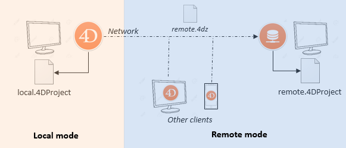

As aplicações 4D desktop podem ser utilizadas numa configuração Cliente/Servidor, quer como aplicações cliente/servidor fundidas, quer como projectos remotos.

- Os **aplicativos cliente/servidor mesclados** são gerados pelo [Gerenciador de aplicativos de compilação] (building.md#clientserver-page). São utilizados para implementações de aplicações.

- **Projetos remotos** são arquivos [.4DProject] (Project/architecture.md) abertos pelo 4D Server e acessados com o 4D em modo remoto. O servidor envia uma versão .4dz do projeto ([formato comprimido](building.md#build-compiled-structure)) para o 4D remoto, assim os arquivos de estrutura são apenas de leitura. Esta configuração é normalmente utilizada para testar aplicações.

> Conectar a um projeto remoto da **mesma máquina que o 4D Server** permite modificar os arquivos do projeto. Esta [funcionalidade específica](#using-4d-and-4d-server-on-the-same-machine) permite desenvolver uma aplicação cliente/servidor no mesmo contexto do contexto de implantação.

## Abrir uma aplicação cliente/servidor fundida

A merged client/server application is customized and its starting is simplified:

- Para iniciar a parte do servidor, o usuário simplesmente clica duas vezes no aplicativo do servidor. The database does not need to be selected.
- Para iniciar a parte do cliente, o usuário simplesmente clica duas vezes no aplicativo cliente, que se conecta diretamente ao aplicativo do servidor.

Esses princípios são detalhados na página [Criar Aplicativo](building.md#what-is-a-clientserver-application).

## Abrir um projecto remoto

A primeira vez que se liga a um projecto 4D Server através de um 4D remoto, normalmente utilizará o diálogo de ligação padrão. Em seguida, você poderá se conectar diretamente usando o menu **Abrir Projetos Recentes** ou um arquivo de atalho 4DLink.

Para conectar remotamente a um projeto 4D Server:

1. Faça uma das seguintes opções:
   - Selecione **Conectar ao 4D Server** no diálogo Assistente de Boas Vindas
   - Selecione **Abrir/Projeto Remoto...** no menu **Arquivo** ou no botão de ferramentas **Abrir**.

Aparece o diálogo de ligação do 4D Server. Este diálogo possui três guias: **Recente**, **Disponível** e **Personalizado**.

Se o 4D Server estiver conectado à mesma sub-rede que o 4D remoto, selecione **Disponível**. O servidor 4D inclui um sistema de transmissão integrado que, por padrão, publica o nome dos projetos 4D Server disponíveis na rede. A lista é classificada por ordem de aparecimento e atualizada dinamicamente.

Para conectar a um servidor da lista, clique duas vezes no seu nome ou selecione-o e clique no botão **OK**.

Se o projeto publicado não for exibido na lista **Disponível**, selecione **Personalizado**. The Custom page allows you to connect to a published server on the network using its network address and assigning it a customized name.

- **Nome do projeto**: Define o nome local do projeto no servidor 4D. Este nome será usado na página **Recente** quando referente ao projeto.
- **Endereço de rede**: O endereço IP da máquina onde o 4D Server foi lançado.
  - Se dois servidores forem executados simultaneamente na mesma máquina, o endereço IP deve ser seguido por dois pontos e o número da porta, por exemplo: `192.168.92.104:19814`.
  - Por padrão, a porta de publicação de um 4D Server é 19813. Este número pode ser modificado nas definições do Projecto.

> A opção **Ativar modo de desenvolvimento** abre a conexão remota em um modo especial de leitura/escrita e requer acessar a pasta do projeto a partir do 4D remoto (opção de compatibilidade).

Uma vez que esta página atribui um servidor, ao clicar no botão **OK**, você poderá se conectar ao servidor.

Uma vez que a conexão com o servidor tenha sido estabelecida, o projeto remoto será listado na guia **Recentes**.

### Atualizar ficheiros de projeto no servidor

O 4D Server cria e envia automaticamente para as máquinas remotas uma versão [.4dz](building.md#build-compiled-structure) do arquivo de projeto _.4DProject_ (não compactado) em modo interpretado.

- Uma versão .4dz atualizada do projeto é automaticamente produzida quando necessário, _ou seja_, quando o projeto foi modificado e recarregado pelo 4D Server. O projecto é recarregado:
  - automatically, when the 4D Server application window comes to the front of the OS or when the 4D application on the same machine saves a modification (see below).
  - quando o comando `RELOAD PROJECT` é executado. Calling this command is necessary for example when you have pulled a new version of the project from the source control platform.

### Atualizar ficheiros de projeto em máquinas remotas

When an updated .4dz version of the project has been produced on 4D Server, connected remote 4D machines must log out and reconnect to 4D Server in order to benefit from the updated version.

## Utilização de 4D e 4D Server na mesma máquina

When 4D connects to a 4D Server on the same machine, the application behaves as 4D in single user mode and the design environment allows you to edit project files. This feature allows you to develop a client/server application in the same context as the deployment context.

> Quando o 4D se conecta a um 4D Server na mesma máquina, o **modo de desenvolvimento** é ativado automaticamente, independentemente do status da [opção de abertura](#opening-a-remote-project).

Cada vez que o 4D realiza uma ação **Salvar tudo** no ambiente de design (explicitamente no menu **Arquivo** ou implicitamente ao alternar para o modo de aplicativo, por exemplo), o 4D Server recarrega sincronizadamente os arquivos do projeto. 4D waits for 4D Server to finish reloading the project files before it continues.

No entanto, você precisa prestar atenção às seguintes diferenças de comportamento em comparação com [a arquitetura padrão do projeto](Project/architecture.md):

- the userPreferences.\{username\} folder used by 4D is not the same folder used by 4D Server in the project folder. Instead, it is a dedicated folder, named "userPreferences", stored in the project system folder (i.e., the same location as when opening a .4dz project).
- the folder used by 4D for derived data is not the folder named "DerivedData" in the project folder. Instead it is a dedicated folder named "DerivedDataRemote" located in the project system folder.
- o ficheiro catalog.4DCatalog não é editado por 4D, mas pelo 4D Server. As informações do catálogo são sincronizadas através de pedidos cliente/servidor
- o ficheiro directory.json não é editado por 4D, mas pelo 4D Server. As informações do diretório são sincronizadas através de pedidos cliente/servidor
- 4D utiliza os seus próprios componentes internos e plug-ins em vez dos do 4D Server.

> Não é recomendado instalar plug-ins ou componentes no nível da aplicação 4D, ou 4D Server.

## Sessões de usuário remoto

On the server, the [`Session`](../commands/session.md) command returns a `session` object describing the current user session. Este objeto é tratado através das funções e propriedades da [classe `sessão`](../API/SessionClass.md).

### Utilização

O objeto `sessão` permite que você obtenha informações sobre a sessão remota do usuário. Você pode compartilhar dados entre todos os processos da sessão do usuário usando o objeto compartilhado [`session.storage`](../API/SessionClass.md#storage).

Por exemplo, você pode iniciar um procedimento de autenticação e verificação do usuário quando um cliente se conecta ao servidor, envolvendo a inserção de um código enviado por e-mail ou SMS no aplicativo. Em seguida, você adiciona as informações do usuário ao armazenamento de sessão, permitindo que o servidor identifique o usuário. Dessa forma, o servidor 4D pode acessar as informações do usuário para todos os processos do cliente, permitindo a escrita de código personalizado de acordo com o papel do usuário.

### Disponibilidade

O objeto `session` do usuário remoto está disponível em:

- Métodos de projeto que têm o atributo [Execute on Server](../Project/code-overview.md#execute-on-server) (são executados no processo "geminado" do processo do cliente),
- Triggers,
- ORDA [funções do modelo de dados](../ORDA/ordaClasses.md) (exceto aquelas declaradas com a palavra-chave [`local`](../ORDA/ordaClasses.md#local-functions),
- 'Conexão aberta com o servidor' e 'Conexão com o servidor' métodos de banco de dados.

:::info

Todos os procedimentos armazenados no servidor compartilham a mesma sessão do usuário virtual. Para obter mais informações, consulte [esta página em doc.4d.com](https://doc.4d.com/4Dv20R5/4D/20-R5/4D-Server-and-the-4D-Language.300-6932726.en.html).

:::

### Ver também (post do blog)

[Objeto de sessão remota 4D com conexão de Cliente/Servidor e procedimento armazenado](https://blog.4d.com/new-4D-remote-session-object-with-client-server-connection-and-stored-procedure re).
