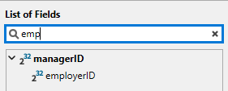
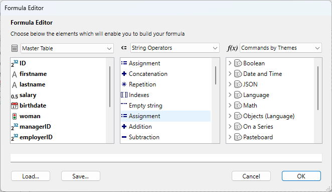
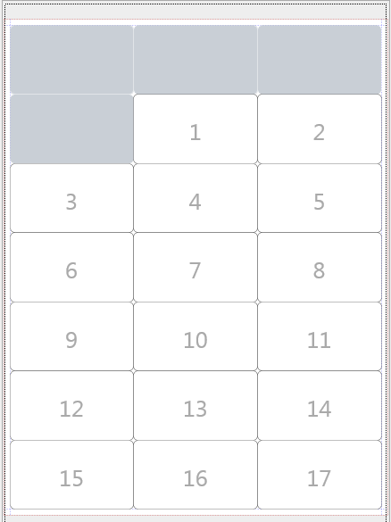
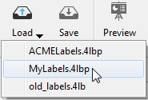

4D’s Label editor provides a convenient way to print a wide variety of labels. With it, you can do the following:

- Design labels for mailings, file folders and file cards, and for many other needs,
- Create and insert decorative items in label templates,
- Specify the font, font size, and style to be used for the labels,
- Specify the number of labels across and down on each page,
- Specify how many labels to print per record,
- Specify the label page margins,
- Designate a method to execute when printing each label or record,
- Create a preview and print the labels.

:::note

As etiquetas também podem ser criadas usando o [Editor de formulário](../FormEditor/formEditor.md). Use the Form editor to design specialized labels that include variables or take advantage of the drawing tools available in the Form editor and print them using the Label editor or the [`PRINT LABEL`](../commands-legacy/print-label.md) command.

:::

You use the Label editor to create, format, and print labels. The Label editor contains settings for designing labels and positioning the labels on label paper. For example, when producing mailing labels, you might want a label design that includes the person’s first and last name on the first line, the street address on the second line, and so on. As part of the design, the Label editor enables you to specify the number of labels on the page and the margins of the label paper so that the label text is centered within the labels.
When you create a satisfactory label design, you can save it to disk so that you can reuse it.

To open the Label editor:

- In the Design environment, choose **Labels...** from the **Tools** menu or from the menu associated with the "Tools" button in the 4D tool bar.
 OU
- Em uma aplicação, chame o comando [`PRINT LABEL`](../commands-legacy/print-label.md).


You use the Label page to specify the contents of the label and the Layout page to define the size and position of the labels on the page.


## Label Page

The Label page contains several areas with settings for designing and formatting labels.

### List of Fields

Displays the names of the fields in the current table in a hierarchical list. If this table is related to other tables, the foreign key fields have a plus sign (on Windows) or an arrow (on macOS). You can display fields from the related table by expanding the related fields. The fields in the related table are indented. To use a field from this list in the label template, you just drag it onto the label preview area to the right of the list.

:::note Notas

- Only tables and fields which are visible appear in the Label editor.
- Os campos de tipo [Object](../Concepts/dt_object.md) não são suportados pelo editor de etiquetas.

:::

The search area allows you to narrow the list of fields displayed to those containing the entered string:



### Label preview

You use this area to design your label zone by placing and positioning all the items that you want to include in your label. O retângulo branco representa um único rótulo (seu tamanho é configurado na página [Layout](#layout-page)).

- You can drag fields onto the label.
- You can also concatenate two fields by dropping the second field onto the first one. They are automatically separated by a space.<br/>
 <br/>
 If you hold down the **Shift** key, they are separated by a carriage return. This lets you create, for example, address labels using several overlapping fields (Address1, Address2, etc.), without producing a blank row when an address requires only one field.
- You can add a formula onto the label by selecting the **Formula** tool  (or choosing **Tool>Formula** in the contextual menu) and drawing an area. The **Formula editor** is then displayed:
 <br/>
 For example, you can apply a format to a field using the [`String`](../commands-legacy/string.md) command:<br/>

<br/>

:::note

Keep in mind that you can only enter methods that are "allowed" for the database in the Formula editor. Os métodos permitidos dependem das [configurações do projeto](../settings/security.md#options) e do comando [`SET ALLOWED METHODS`](../commands/set-allowed-methods.md).

:::

- You can drag and drop picture files as well as label files (".4lbp" files) from the desktop of the OS.

- To modify the area, double-click on the contents in order to switch to editing mode. When you double-click on fields or formulas, the **Formula editor** is displayed, allowing you to remove or modify items:
 

### Form to use

This drop-down list allows you to define a table form as a label template. The form chosen must be specially adapted to the creation of labels.
Neste caso, o editor de rótulo é parcialmente desativado: somente funções do [Layout page](#layout-page) podem ser usadas — para permitir que você configure a página com base no formulário. The image of the form selected is displayed in the label preview area.
When you use a form, 4D executes any form or object methods associated with it. When using this option, you can also designate a project method to execute for each record or label and then assignate variables (see [this example](#printing-labels-using-forms-and-methods-example) below). If you want to create your labels using the editor itself, you need to choose the **No Form** option.

:::note Notas

- Você pode restringir os formulários listados neste menu por meio de um [arquivo JSON específico](#controlling-available-forms-and-methods).
- If the database does not contain any table forms, this menu is not displayed.

:::

### Graphic area commands

The graphic area of the editor includes both a tool bar and a context menu that you can use to design your label template.

The left-hand side of the tool bar includes commands for selecting and inserting objects. You can also access these tools by means of the **Tool>** command in the area's context menu.

| Ícone                                     | Tool name          | Descrição                                                                                                                                                                                                          |
| ----------------------------------------- | ------------------ | ------------------------------------------------------------------------------------------------------------------------------------------------------------------------------------------------------------------ |
|  | Seleção            | Click on a single object or draw a selection box around several objects. For a selection of non-adjacent objects, hold down **Shift** and click on each object you want to select. |
|  | Line creation      |                                                                                                                                                                                                                    |
|  | Rectangle creation | For Rectangle or Rounded rectangle.                                                                                                                                                                |
|  | Circle creation    |                                                                                                                                                                                                                    |
|  | Text insertion     | Draw a rectangle and enter text inside it. You can edit any text area, including those containing field references, by double-clicking it.                                         |
|  | Formula insertion  | Draw a rectangle to display the **Formula editor**, where you can define dynamic label contents (fields and formulas).                                                          |

There are shortcuts available to move or resize objects more precisely using the keyboard arrow keys:

- Keyboard arrow keys move the selection of objects 1 pixel at a time.
- **Shift** + teclas de seta movem a seleção de objetos 10 píxeis por vez.
- **Ctrl** + teclas de seta ampliam ou reduzem a seleção de objetos em 1 píxel.
- **Ctrl** + **Maj** + arrow keys enlarge or reduce the selection of objects by 10 pixels.

The right-hand side of the tool bar contains commands used to modify items of the label template:

| Ícone                                      | Tool name                  | Descrição                                                                                                                                                                                                                                                                                                                                                        |
| ------------------------------------------ | -------------------------- | ---------------------------------------------------------------------------------------------------------------------------------------------------------------------------------------------------------------------------------------------------------------------------------------------------------------------------------------------------------------- |
|   | Fill Color                 | all color icons display the selected color                                                                                                                                                                                                                                                                                                                       |
|   | Cor da linha               |                                                                                                                                                                                                                                                                                                                                                                  |
|   | Lineweight                 |                                                                                                                                                                                                                                                                                                                                                                  |
|  | Font menu                  | Sets the font and its size, as well as the text style, color and alignment for the block(s) of selected text.                                                                                                                                                                                                                 |
|  | Alignment and distribution | Two or more objects must be selected for the alignment options to be available. "Distributing" objects means automatically setting the horizontal or vertical intervals between at least three objects, so that they are identical. The resulting interval is an average of all those existing in the selection. |
|  | Object level               | Moves objects to the front or back, or moves one or more objects up or down one level.                                                                                                                                                                                                                                                           |

## Layout Page

The Layout page contains controls for printing labels based on the requirements of your current print settings.


- **Labels Order**: Specifies whether labels should be printed in the direction of the rows or the columns.
- **Rows** and **Columns**: Set the number of labels to be printed by "row" and by "column" on each sheet. These settings determine the label size when the "Automatic resizing" option is enabled.
- **Labels per record**: Sets the number of copies to print for each label (copies are printed consecutively).
- **Print Setup...**: Sets the format of the page on which the sheet of labels will be printed. When you click this button, the setup dialog box for the printer selected in your system appears. By default, the sheet of labels is generated based on an A4 page in portrait mode.
 **Note:** The sheet created by the editor is based on the logical page of the printer, i.e. the physical page (for instance, an A4 page) less the margins that cannot be used on each side of the sheet. The physical margins of the page are shown by blue lines in the preview area.
- **Unit**: Changes the units in which you specify your label and label page measurements. You can use points, millimeters, centimeters, or inches.
- **Automatic resizing**: Means that 4D automatically calculates the size of the labels (i.e. the Width and Height parameters) according to the values set in all the other parameters. When this option is checked, the label size is adjusted each time you modify a page parameter. The Width and Height parameters can no longer be set manually.
- **Largura** e **Altura**: define a altura e a largura de cada etiqueta manualmente. Eles não podem ser editados quando a opção **Redimensionamento automático** estiver marcada.
- **Margens** (Superior, Direita, Esquerda, Inferior): define as margens de sua folha. These margins are symbolized by blue lines in the preview area. Clicking on **Use printer margins** replicates, in the preview area, the margin information provided by the selected printer (these values can be modified).
- **Gaps**: Set the amount of vertical and/or horizontal space between label rows and columns.
- **Method**: Lets you trigger a specific method that will be run at print time. For example, you can execute a method that posts the date and time that each label was printed. This feature is also useful when you print labels using a dedicated table form, in which case you can fill variables from a method.
 To be eligible for label processing, a project method must comply with the following settings:
 - it must be "allowed" for the database (allowed methods depend on [project settings](../settings/security.md#options) and the [`SET ALLOWED METHODS`](../commands/set-allowed-methods.md) command), otherwise it will not be displayed in the **Apply** menu.
 - precisa ter a opção [Compartilhada por componentes e banco de dados host](../Project/code-overview.md#shared-by-components-and-host-database).
  Veja também [este exemplo](#printing-labels-using-forms-and-methods-example) abaixo.

:::note

For advanced needs, you can restrict the list of methods available using a [specific json file](#controlling-available-forms-and-methods).
The **For each: Record or Label** options are used to specify whether to run the method once per label or once per record. This control has meaning only if you are printing more than one copy of each label and you are also executing a method at print time.

:::

- **Layout preview**: Provides a reduced view of how an entire page of labels will look, based on the dimensions you enter in the Label editor. The page preview also reflects the paper size selected in the Print Setup dialog box. You can also use this area to designate the first label on the page to be printed (this option only affects the first sheet in the case of multi-page printing). This can be useful, for example, when you want to print on a sheet of adhesive labels, part of which has already been used. You can also select the first label on the page to be printed by clicking on it:



## Impressão de etiquetas usando formulários e métodos (exemplo)

You can use dedicated table forms and project methods to print labels with calculated variables. This simple example shows how to configure the different elements.

1. In a dedicated table form, add your label field(s) and variable(s).
 Here, in a table form named "label", we added the *myVar* variable:
 

2. Create a `setMyVar` project method with the following code:

```4d
 var myVar+=1
```

3. Defina o método projeto como ["Compartilhado por componentes e banco de dados host"](../Project/code-overview.md#shared-by-components-and-host-database).

4. Before displaying the Label editor, make sure the project method is allowed by executing this code:

```4d
 ARRAY TEXT($methods;1)
 $methods{1}:="setMyVar"
 SET ALLOWED METHODS($methods)
```

5. Open the Label editor and use your form:
 

6. In the Layout page, select the method:
 

Then you can print your labels:


## Controlling available forms and methods

The Label editor includes an advanced feature allowing you to restrict which project forms and methods (within "allowed" methods) can be selected in the dialog box:

- no menu **Formulário para usar** na página "Etiqueta" e/ou
- in the **Apply (method)** menu on the "Layout" page.

1. Crie um arquivo JSON chamado **labels.json** e coloque-o na pasta [Resources] (../Project/architecture.md#resources) do projeto.
2. In this file, add the names of forms and/or project methods that you want to be able to select in the Label editor menus.

O conteúdo do arquivo **labels.json** deve ser semelhante a:

```json
[ 
    {"tableId":2,"forms":[],"methods":["myMethod1","myMethod2"]},
    {"tableId":1,"forms":["Sample Label 1","Sample Label 2"],"methods":[]}
]
```

Se nenhum arquivo **labels.json** tiver sido definido, nenhuma filtragem será aplicada.

## Managing label files

4D allows you to save each label design in a file that you can open subsequently from within the wizard. By saving your label designs, you can build a label library adapted to your specific needs. Each label design stores the settings defined on the Label and Layout pages.

You can drag and drop label files from your desktop onto the label design area.

Os desenhos das etiquetas são gerenciados usando os botões **Carregar** e **Salvar** da barra de ferramentas.

- To load a label design, click on the **Load** button and designate the design you want to load by means of the File Open dialog box (if a label design is already present in the wizard, 4D replaces it by the one you have loaded).
- To save a label design, click on the **Save** button and indicate the name and location of the design to be created.

### File format

The file extension of 4D labels saved by the wizard is ".4lbp". Note that this format is open since it is written internally in XML.

### Preloading label files

The Label Wizard allows you to store label files within your application, so that label designs can be selected and opened by the user directly using the **Load** button.

To do this, you just need to create a folder named `Labels` within the [Resources folder](../Project/architecture.md#resources) of the project and then copy your label files into it:


:::note

Both standard ".4lbp" files and files generated by the former wizard (".4lb") files are supported.

:::

When the Label Wizard starts, if this folder is detected and contains valid label files, a pop-up icon is added to the **Load** button. Label designs can then be selected through a menu line:



