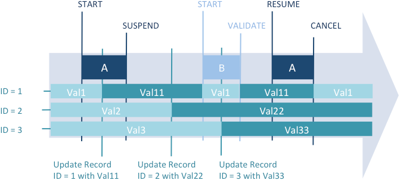

## Descrição

As transações são uma série de modificações de dados relacionadas que são realizadas em um banco de dados ou armazenamento de dados dentro de um [process](./processes.md). Uma transação não é salva em um banco de dados permanentemente até que a transação seja validada. Se uma transação não for concluída, seja porque é cancelada ou por algum evento externo, as modificações não são salvas.

Durante uma transação, todas as alterações feitas nos dados do banco de dados dentro de um processo são armazenadas localmente em um buffer temporário. Se a transação for aceita com [`VALIDATE TRANSACTION`](../commands-legacy/validate-transaction.md) ou [`validateTransaction()`](../API/DataStoreClass.md#validatetransaction), as alterações são salvas permanentemente. Se a transação for cancelada com [`CANCEL TRANSACTION`](../commands-legacy/cancel-transaction.md) ou [`cancelTransaction()`](../API/DataStoreClass.md#canceltransaction), as alterações não são salvas. Em todos os casos, nem a seleção atual nem o registro atual são modificados pelos comandos de gerenciamento de transações.

4D suporta transações aninhadas, ou seja, transações em vários níveis hierárquicos. O número de subtransações permitidas é ilimitado. O comando [`Transaction level`](../commands-legacy/transaction-level.md) pode ser usado para descobrir o nível de transação atual em que o código está sendo executado. Quando transações aninhadas são usadas, o resultado de cada subtransação depende da validação ou cancelamento da transação de nível superior. Se a transação de nível superior for validada, os resultados das subtransações (validação ou cancelamento) são confirmados. Por outro lado, se a operação de nível superior for anulada, todas as suboperações são anuladas, independentemente de seus respectivos resultados.

4D inclui uma funcionalidade que permite [suspender e retomar transações](#suspending-transactions) dentro do seu código 4D. Quando uma transação é suspensa, você pode executar operações independentemente da transação em si e, em seguida, retomar a transação para validá-la ou cancelá-la como de costume.

### Exemplo

Neste exemplo, o banco de dados é um sistema de faturamento simples. As linhas de fatura são armazenadas em uma tabela chamada [Invoice Lines], que está relacionada à tabela [Invoices] por meio de um relacionamento entre os campos [Invoices]Invoice ID e [Invoice Lines]Invoice ID. Quando uma fatura é adicionada, um ID único é calculado, usando o comando [`Sequence number`](../commands-legacy/sequence-number.md). O relacionamento entre [Invoices] e [Invoice Lines] é um relacionamento automático Relate Many. A caixa de seleção **Asignar automáticamente valor relacionado en subformulario** está marcada.

O relacionamento entre [Invoice Lines] e [Parts] é manual.


Quando uma fatura é adicionada, um ID único é calculado, usando o comando
Quando um usuário insere uma fatura, as seguintes ações são executadas:

- Adicionar um registro na tabela [Invoices].
- Adicionar vários registros na tabela [Invoice Lines].
- Atualizar o campo [Parts]In Warehouse de cada peça listada na fatura.

Este exemplo é uma situação típica em que você precisa usar uma transação. Você deve ter certeza de que poderá salvar todos esses registros durante a operação ou de que poderá cancelar a transação se um registro não puder ser adicionado ou atualizado. Em outras palavras, você deve salvar os dados relacionados. Se você não usar uma transação, não poderá garantir a integridade lógica dos dados do seu banco de dados. Por exemplo, se um dos registros de [Parts] estiver bloqueado, você não poderá atualizar a quantidade armazenada no campo [Parts]In Warehouse. Portanto, este campo será logicamente incorreto. A soma das peças vendidas e das peças restantes no armazém não será igual à quantidade original inserida no registro. Você pode evitar essa situação usando transações.

Existem várias maneiras de realizar a entrada de dados usando transações:

1. Você pode gerenciar as transações você mesmo usando os comandos de transação [`START TRANSACTION`](../commands-legacy/start-transaction.md), [`VALIDATE TRANSACTION`](../commands-legacy/validate-transaction.md) e [`CANCEL TRANSACTION`](../commands-legacy/cancel-transaction.md). Você pode escrever, por exemplo:

```4d
 READ WRITE([Invoice Lines])
 READ WRITE([Parts])
 FORM SET INPUT([Invoices];"Input")
 Repeat
    START TRANSACTION
    ADD RECORD([Invoices])
    If(OK=1)
       VALIDATE TRANSACTION
    Else
       CANCEL TRANSACTION
    End if
 Until(OK=0)
 READ ONLY(*)
```

2. Para reduzir o bloqueio de registros enquanto a entrada de dados está sendo realizada, você também pode optar por gerenciar as transações a partir do método do formulário e acessar as tabelas em READ WRITE apenas quando necessário. A entrada de dados é realizada usando o formulário de entrada de [Invoices], que contém a tabela relacionada [Invoice Lines] em um subformulário. O formulário tem dois botões: bCancel e bOK, que não são botões de ação.

O loop de adição se torna:

```4d
 READ WRITE([Invoice Lines])
 READ ONLY([Parts])
 FORM SET INPUT([Invoices];"Input")
 Repeat
    ADD RECORD([Invoices])
 Until(bOK=0)
 READ ONLY([Invoice Lines])
```

id: transactions
title: Transactions
---

## Description

As transações são uma série de modificações de dados relacionadas que são realizadas em um banco de dados ou armazenamento de dados dentro de um [processo](./processes.md). Uma transação não é salva em um banco de dados permanentemente até que a transação seja validada. Se uma transação não for concluída, seja porque é cancelada ou por algum evento externo, as modificações não são salvas.

Durante uma transação, todas as alterações feitas nos dados do banco de dados dentro de um processo são armazenadas localmente em um buffer temporário. Se a transação for aceita com [`VALIDATE TRANSACTION`](https://www.google.com/search?q=../commands-legacy/validate-transaction.md) ou [`validateTransaction()`](../API/DataStoreClass.md#validatetransaction), as alterações são salvas permanentemente. Se a transação for cancelada com [`CANCEL TRANSACTION`](../commands-legacy/cancel-transaction.md) ou [`cancelTransaction()`](../API/DataStoreClass.md#canceltransaction), as alterações não são salvas. Em todos os casos, nem a seleção atual nem o registro atual são modificados pelos comandos de gerenciamento de transações.

O 4D suporta transações aninhadas, ou seja, transações em vários níveis hierárquicos. O número de subtransações permitidas é ilimitado. O comando [`Transaction level`](https://www.google.com/search?q=../commands-legacy/transaction-level.md) pode ser usado para descobrir o nível de transação atual em que o código está sendo executado. Quando transações aninhadas são usadas, o resultado de cada subtransação depende da validação ou cancelamento da transação de nível superior. Se a transação de nível superior for validada, os resultados das subtransações (validação ou cancelamento) são confirmados. Por outro lado, se a operação de nível superior for anulada, todas as suboperações são anuladas, independentemente de seus respectivos resultados.

O 4D inclui uma funcionalidade que permite [suspender e retomar transações](#suspending-transactions) dentro do seu código 4D. Quando uma transação é suspensa, você pode executar operações independentemente da transação em si e, em seguida, retomar a transação para validá-la ou cancelá-la como de costume.

### Example

Neste exemplo, o banco de dados é um sistema de faturamento simples. As linhas de fatura são armazenadas em uma tabela chamada [Invoice Lines], que está relacionada à tabela [Invoices] por meio de um relacionamento entre os campos [Invoices]Invoice ID e [Invoice Lines]Invoice ID. Quando uma fatura é adicionada, um ID único é calculado, usando o comando [`Sequence number`](../commands-legacy/sequence-number.md). O relacionamento entre [Invoices] e [Invoice Lines] é um relacionamento automático Relate Many. A caixa de seleção **Asignar automáticamente valor relacionado en subformulario** está marcada.

O relacionamento entre [Invoice Lines] e [Parts] é manual.


Quando um usuário insere uma fatura, as seguintes ações são executadas:

- Adicionar um registro na tabela [Invoices].
- Adicionar vários registros na tabela [Invoice Lines].
- Atualizar o campo [Parts]In Warehouse de cada peça listada na fatura.

Este exemplo é uma situação típica em que você precisa usar uma transação. Você deve ter certeza de que poderá salvar todos esses registros durante a operação ou de que poderá cancelar a transação se um registro não puder ser adicionado ou atualizado. Em outras palavras, você deve salvar os dados relacionados. Se você não usar uma transação, não poderá garantir a integridade lógica dos dados do seu banco de dados. Por exemplo, se um dos registros de [Parts] estiver bloqueado, você não poderá atualizar a quantidade armazenada no campo [Parts]In Warehouse. Portanto, este campo será logicamente incorreto. A soma das peças vendidas e das peças restantes no armazém não será igual à quantidade original inserida no registro. Você pode evitar essa situação usando transações.

Existem várias maneiras de realizar a entrada de dados usando transações:

1. Você pode gerenciar as transações você mesmo usando os comandos de transação [`START TRANSACTION`](../commands-legacy/start-transaction.md), [`VALIDATE TRANSACTION`](https://www.google.com/search?q=../commands-legacy/validate-transaction.md) e [`CANCEL TRANSACTION`](../commands-legacy/cancel-transaction.md). Você pode escrever, por exemplo:

```4d
 READ WRITE([Invoice Lines])
 READ WRITE([Parts])
 FORM SET INPUT([Invoices];"Input")
 Repeat
    START TRANSACTION
    ADD RECORD([Invoices])
    If(OK=1)
       VALIDATE TRANSACTION
    Else
       CANCEL TRANSACTION
    End if
 Until(OK=0)
 READ ONLY(*)
Para reduzir o bloqueio de registros enquanto a entrada de dados está sendo realizada, você também pode optar por gerenciar as transações a partir do método do formulário e acessar as tabelas em READ WRITE apenas quando necessário. A entrada de dados é realizada usando o formulário de entrada de [Invoices], que contém a tabela relacionada [Invoice Lines] em um subformulário. O formulário tem dois botões: bCancel e bOK, que não são botões de ação.
O loop de adição se torna:

4D

 READ WRITE([Invoice Lines])
 READ ONLY([Parts])
 FORM SET INPUT([Invoices];"Input")
 Repeat
    ADD RECORD([Invoices])
 Until(bOK=0)
 READ ONLY([Invoice Lines])
Observe que a tabela [Parts] agora está em modo de acesso somente leitura durante a entrada de dados. O acesso de leitura/gravação só estará disponível se a entrada de dados for validada.

A transação é iniciada no método do formulário de entrada [Invoices] indicado abaixo:

```4d
 Case of
    :(Form event code=On Load)
       START TRANSACTION
       [Invoices]Invoice ID:=Sequence number([Invoices]Invoice ID)
    Else
       [Invoices]Total Invoice:=Sum([Invoice Lines]Total line)
 End case
```

If you click the *bCancel* button, the data entry as well as the transaction must be canceled. Here is the object method of the *bCancel* button:

```4d
 Case of
    :(Form event code=On Clicked)
       CANCEL TRANSACTION
       CANCEL
 End case
```

Se você clicar no botão *bOK*, tanto a entrada de dados quanto a transação serão canceladas. Este é o método objeto do botão *bOK*:

```4d
 Case of
    :(Form event code=On Clicked)
       var $NbLines:=Records in selection([Invoice Lines])
       READ WRITE([Parts]) //Mudar para acesso de Leitura/Gravação para a tabela [Parts]
       FIRST RECORD([Invoice Lines]) //Começar na primeira linha
       var $ValidTrans:=True //Assumir que tudo estará OK
       var $Line : Integer
       For($Line;1;$NbLines) //Para cada linha
          RELATE ONE([Invoice Lines]Part No)
          OK:=1 //Assumir que você quer continuar
          While(Locked([Parts]) & (OK=1)) //Tentar obter o registro em acesso de Leitura/Gravação
             CONFIRM("The Part "+[Invoice Lines]Part No+" is in use. Wait?")
             If(OK=1)
                DELAY PROCESS(Current process;60)
                LOAD RECORD([Parts])
             End if
          End while
          If(OK=1)
               //Atualizar a quantidade no armazém
             [Parts]In Warehouse:=[Parts]In Warehouse-[Invoice Lines]Quantity
             SAVE RECORD([Parts]) //Salvar o registro
          Else
             $Line:=$NbLines+1 //Sair do loop
             $ValidTrans:=False
          End if
          NEXT RECORD([Invoice Lines]) //Ir para a próxima linha
       End for
       READ ONLY([Parts]) //Definir o estado da tabela como somente leitura
       If($ValidTrans)
          SAVE RECORD([Invoices]) //Salvar o registro de Invoices
          VALIDATE TRANSACTION //Validar todas as modificações do banco de dados
       Else
          CANCEL TRANSACTION //Cancelar tudo
       End if
       CANCEL //air do formulário
 End case
```

Neste código, chamamos o comando `CANCEL` independentemente do botão pressionado. O novo registro não é validado por uma chamada a [`ACCEPT`](../commands-legacy/accept.md), mas sim pelo comando [`SAVE RECORD`](../commands-legacy/save-record.md) Além disso, observe que `SAVE RECORD` é executado imediatamente antes do comando [`VALIDATE TRANSACTION`](../commands-legacy/validate-transaction.md). Portanto, salvar o registro [Invoices] é, na verdade, parte da transação. O comando ACCEPT também validaria o registro, mas neste caso a transação seria validada antes de o registro [Invoices] ser salvo. Em outras palavras, o registro seria salvo fora da transação.

Dependendo de suas necessidades, você pode personalizar seu banco de dados, conforme mostrado nestes exemplos. No último exemplo, o gerenciamento de registros bloqueados na tabela [Parts] poderia ser ainda mais desenvolvido.


## Suspensão de transações

### Princípio

Suspender uma transação é útil quando você precisa realizar, de dentro de uma transação, certas operações que não precisam ser executadas sob o controle dessa transação. Por exemplo, imagine o caso em que um cliente faz um pedido, portanto dentro de uma transação, e também atualiza seu endereço. Em seguida, o cliente muda de ideia e cancela o pedido. A transação é cancelada, mas você não deseja que a alteração de endereço seja revertida. Este é um exemplo típico em que suspender a transação é útil. Três comandos são usados para suspender e retomar transações:

- [`SUSPEND TRANSACTION`](../commands-legacy/suspend-transaction.md): pausa a transação atual. Os registros atualizados ou adicionados permanecem bloqueados.
- [`RESUME TRANSACTION`](../commands-legacy/resume-transaction.md): reativa uma transação suspensa.
- [`Active transaction`](../commands-legacy/active-transaction.md): retorna False se a transação estiver suspensa ou se não houver transação em andamento, e True se tiver sido iniciada ou retomada.

### Exemplo  

Este exemplo ilustra a necessidade de uma transação suspensa. Em um banco de dados Invoices, queremos obter um novo número de fatura durante uma transação. Este número é calculado e armazenado em uma tabela [Settings]. Em um ambiente multiusuário, acessos concorrentes devem ser protegidos; no entanto, devido à transação, a tabela [Settings] pode estar bloqueada por outro usuário, embora esses dados sejam independentes da transação principal. Neste caso, você pode suspender a transação ao acessar a tabela.

```4d
  //Método padrão que cria uma fatura
 START TRANSACTION
 ...
 CREATE RECORD([Invoices])
 //chamar o método para obter um número disponível
 [Invoices]InvoiceID:=GetInvoiceNum 
 ...
 SAVE RECORD([Invoices])
 VALIDATE TRANSACTION

 ```

O método *GetInvoiceNum* suspende a transação antes de ser executado. Observe que este código funcionará mesmo quando o método for chamado de fora de uma transação:

```4d
  //Método projeto GetInvoiceNum
  //GetInvoiceNum -> Próximo número de fatura disponível
 #DECLARE -> $freeNum : Integer
 SUSPEND TRANSACTION
 ALL RECORDS([Settings])
 If(Locked([Settings])) //acesso multiusuário
    While(Locked([Settings]))
       MESSAGE("Waiting for locked Settings record")
       DELAY PROCESS(Current process;30)
       LOAD RECORD([Settings])
    End while
 End if
 [Settings]InvoiceNum:=[Settings]InvoiceNum+1
 $freeNum:=[Settings]InvoiceNum
 SAVE RECORD([Settings])
 UNLOAD RECORD([Settings])
 RESUME TRANSACTION

```

### Operação detalhada

#### Como funciona uma transação suspensa?  

Quando uma transação é suspensa, os seguintes princípios são aplicados:

- Você pode acessar os registros que foram adicionados ou modificados durante a transação e não pode ver os registros que foram excluídos durante a transação.
- Você pode criar, salvar, excluir ou modificar registros fora da transação.
- Você pode iniciar uma nova transação, mas dentro desta transação incluída, você não poderá ver nenhum registro ou valor de registro que tenha sido adicionado ou modificado durante a transação suspensa. De fato, esta nova transação é totalmente independente da suspensa, semelhante a uma transação de outro processo, e como a transação suspensa pode ser retomada ou cancelada posteriormente, qualquer registro adicionado ou modificado é automaticamente ocultado para a nova transação. Assim que a nova transação for retomada ou cancelada, esses registros poderão ser vistos novamente.
- Os registros modificados, excluídos ou adicionados dentro da transação suspensa permanecem bloqueados para outros processos. Se uma tentativa for feita para modificar ou excluir esses registros fora da transação ou em uma nova transação, um erro é gerado.

Essas implementações são resumidas no seguinte gráfico:




*Os valores editados durante a transação A (o registro ID1 obtém Val11) não estão disponíveis em uma nova transação (B) criada durante o período "suspenso". Os valores editados durante o período "suspenso" (o registro ID2 obtém Val22 e o registro ID3 obtém Val33) são salvos mesmo após o cancelamento da transação A.*

Funcionalidades específicas foram adicionadas para gerenciar erros:

- O registro atual de cada tabela é temporariamente bloqueado se for modificado durante a transação e desbloqueado automaticamente quando a transação é retomada. Este mecanismo é importante para evitar salvamentos indesejados em partes da transação.
- Se uma sequência inválida for executada, como iniciar transação / suspender transação / iniciar transação / retomar transação, um erro é gerado. Este mecanismo evita que os desenvolvedores esqueçam de confirmar ou cancelar qualquer transação incluída antes de retomar a transação suspensa.


#### Transações suspensas e estado do processo

O comando [`In transaction`](../commands-legacy/in-transaction.md) etorna True quando uma transação foi iniciada, mesmo que esteja suspensa. Para saber se a transação atual está suspensa, é necessário usar o comando [`Active transaction`](../commands-legacy/active-transaction.md), que retorna False neste caso. 

Ambos os comandos, no entanto, também retornam False se nenhuma transação foi iniciada. Nesse caso, pode ser necessário usar o comando [`Transaction level`](../commands-legacy/transaction-level.md), que retorna 0 neste contexto (nenhuma transação foi iniciada).

O gráfico a seguir ilustra os diferentes contextos de transação e os valores correspondentes retornados pelos comandos de transação:


