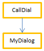

O código 4D compilado pode ser executado em **processos preemptivos**. Graças a esta funcionalidade, seus aplicativos 4D compilados poderão aproveitar ao máximo os computadores de vários núcleos de modo que sua execução será mais rápida e pode suportar mais usuários conectados.

## O que é um processo preemptivo?

Quando for executado em _modo preemptivo_, um processo estará dedicado a uma CPU. A gestão de processos então é delegada ao sistema, que pode adjudicar por separado cada CPU em uma máquina multi-núcleo.

Quando for executado em modo _cooperativo_, todos os processos serão gestionados pelo thread da aplicação pai e compartem a mesma CPU, mesmo em uma máquina multi-núcleo.

Como resultado, no modo apropriativo, o rendimento global da aplicação é incrementado, especialmente em máquinas multi-núcleo, já que múltiplos processos (threads ou fios) podem ser executados simultaneamente. Entretanto, os ganhos reais dependem das operações executadas. Por outro lado, já que no modo apropriativo cada fio é independente dos demais e não é gestionado diretamente pela aplicação, limitações específicas se aplicam aos métodos que queira que sejam compatíveis com o modo apropriativo. Além disso, a execução apropriativa está disponível só em alguns contextos específicos.

## Disponibilidade de modo preemptivo

O uso do modo preemptivo está disponível nos seguintes contextos de execução:

| Contexto          | Execução preventiva                                                   |
| ----------------- | --------------------------------------------------------------------- |
| 4D Server         | sim                                                                   |
| 4D remoto         | sim, com [ServerNet ou QUIC](../settings/client-server#network-layer) |
| 4D usuário único  | sim                                                                   |
| Modo compilado    | sim                                                                   |
| Modo interpretado | não                                                                   |

Se o contexto de execução suporta o modo apropriativo e se o método for "thread seguro", um novo processo 4D lançado utilizando os comandos New process ou CALL WORKER ou do menu "Executar método" se executará em modo apropriativo.

De outro modo, se chamar `New process` ou `CALL WORKER` em um contexto de execução que não é suportado (por exemplo em uma máquina remota 4D) o processo é sempre cooperativo.

## Código thread-seguro vs thread-inseguro

O código 4D pode ser executado em fio (thread) apropriativo só quando algumas condições específicas forem cumpridas. Cada parte do código executado (comandos, métodos, variáveis, funções...) deve ser compatível com uma execução apropriativa. Os elementos que podem ser executados em fios apropriativos são chamados threads seguros e os elementos que não podem ser executados em fios apropriativos são chamados threads inseguros.

:::note

Dado que um thread se maneja de forma independente a partir do método processo pai, toda a string de chamadas não deve incluir nenhum código thread inseguro, do contrário a execução apropriativa não será possível. Esse ponto é discutido \[neste parágrafo] (#when-is-a-process-started-preemptively).

:::

A propriedade "segurança de fio" de cada elemento depende do elemento em si:

- Comandos 4D: thread seguro é uma propriedade interna. Na [referência da linguagem 4D](https://doc.4d.com/4Dv20/4D/20.1/4D-Language-Reference.100-6479538.en.html), os comandos thread seguro se identificam pelo ícone . Você também pode usar o comando [`Command name`](https://doc.4d.com/4dv20/help/command/en/page538.html) para saber se um comando é thread-safe. Grande parte dos comandos 4D podem ser executados em modo apropriativo.
- Métodos de projeto: as condições para segurança de thread se listam no [este parágrafo](#writing-a-thread-safe-method).

Basicamente, o código que se executa em thread apropriativos não podem ser chamados as partes com as interações externas, tal como o código plug-in ou as variáveis interprocesso. Os acessos aos dados, entretanto, são permitidos desde o servidor de dados 4D que suporta a execução apropriativa.

## Declaração de um método preemptivo

Como padrão, 4D executará todos os métodos de projeto em modo cooperativo. Se desejar se beneficiar da funcionalidade modo apropriativo, o primeiro passo consiste em declarar explicitamente todos os métodos que deseja que se iniciem em modo apropriativo sempre que for possível, ou seja, os métodos que considere capaz de executar em processo apropriativo. O compilador \[verificará se esses métodos são realmente thread-safe] (#writing-a-thread-safe-method) em tempo de compilação. Também pode desabilitar o modo apropriativo para alguns métodos, se for necessário.

Lembre que definir um método como apropriativo faz com que seja elegível para execução apropriativa, mas não garante que se execute realmente em modo apropriativo. Iniciar um processo no modo preemptivo resulta de uma \[avaliação realizada por 4D] (#when-is-a-process-started-preemptively) com relação às propriedades de todos os métodos na cadeia de chamadas do processo.

Para declarar seu método de elegibilidade para o modo apropriativo, é necessário utilizar a opção de declaração "Modo de execução" no quadro de diálogo Propriedades de método:


São fornecidas as seguintes opções:

- **Pode ser executado em um processo preemptivo**: ao selecionar esta opção, declara que o método pode ser executado em um processo preemptivo e, portanto, deve ser executado em modo preemptivo quando for possível. A propriedade "preemptive" do método é definida como "capable".

  Quando essa opção estiver marcada, o compilador 4D verificará se o método é realmente capaz e retornará erros se esse não for o caso -- por exemplo, se ele chama direta ou indiretamente comandos ou métodos que não podem ser executados em modo preemptivo (toda a cadeia de chamadas é analisada, mas os erros são reportados apenas ao primeiro subnível). Pode então editar o método para que se torne thread-safe, ou selecionar outra opção.

  Se a capacidade preemptiva do método for aprovada, este é marcado internamente como "thread-safe" e será executado em modo preemptivo sempre que as condições necessárias forem cumpridas. Esta propriedade define a sua elegibilidade para o modo preemptivo, mas não garante que o método será efetivamente executado em modo preemptivo, uma vez que este modo de execução requer um \[contexto específico] (#when-is-a-process-started-preemptively).

- **Não pode ser executado em um processo preemptivo**: selecionando esta opção, se declara que o método não deve ser executado em modo preemptivo, e, portanto, sempre se deve executar em modo cooperativo, da mesma forma que nas versões anteriores de 4D. A propriedade "preemptive" do método é definida como "incapable".

  Quando esta opção estiver marcada, o compilador 4D não verificará a habilidade do método de executar preemptivamente; ele é automaticamente marcado como "thread-unsafe" internamente (mesmo que seja teoricamente capaz). Quando chamado em tempo de execução, este método irá "contaminar" quaisquer outros métodos na mesma thread, forçando assim esta thread a ser executada em modo cooperativo, mesmo que os outros métodos sejam thread-safe.

- **Indiferente** (pré-determinado): ao selecionar esta opção, declara que não deseja manejar a propriedade preventiva para o método. A propriedade "preemptiva" do método é definida como "indiferente".

  Quando esta opção está marcada, o compilador 4D avaliará a capacidade preemptiva do método e o marcará internamente como "thread-safe" ou "thread-unsafe". Não é devolvido qualquer erro relacionado com a execução preemptiva. Se o método for avaliado como thread-safe, em tempo de execução não impedirá a execução preemptiva de threads quando chamado num contexto preemptivo. Por outro lado, se o método for avaliado como "thread-unsafe", em tempo de execução impedirá qualquer execução de thread preemptiva quando for chamado.

Note que com essa opção, independentemente da avaliação interna de segurança de thread, o método será sempre executado em modo cooperativo quando chamado diretamente por 4D como o primeiro método pai (por exemplo, através do comando `New process`). Se for marcado internamente como "thread-safe", só é tido em conta quando chamado a partir de outros métodos dentro de uma cadeia de chamadas.

:::note Caso particular

If the method has also the [**Shared by components and host database**](../Project/code-overview.md#shared-by-components-and-host-database) property, setting the **Indifferent** option will automatically tag the method as thread-unsafe. If you want a shared component method to be thread-safe, you must explicitely set it to **Can be run in preemptive processes**.

:::

## When is a process started preemptively?

:::info Lembrete

Preemptive execution is only available in compiled mode.

:::

In compiled mode, when starting a process created by either `New process` or `CALL WORKER` commands, 4D reads the preemptive property of the process method (also named _parent_ method) and executes the process in preemptive or cooperative mode, depending on this property:

- If the process method is thread-safe (validated during compilation), the process is executed in a preemptive thread.
- If the process method is thread-unsafe, the process is run in a cooperative thread.
- If the preemptive property of the process method was set to "indifferent", by compatibility the process is run in a cooperative thread (even if the method is actually capable of preemptive use). Note however that this compatibility feature is only applied when the method is used as a process method: a method declared "indifferent" but internally tagged "thread-safe" by the compiler can be called preemptively by another method (see below).

The actual thread-safe property depends on the call chain. If a method with the property declared as "capable" calls a thread-unsafe method at either of its sublevels, a compilation error will be returned: if a single method in the entire call chain is thread-unsafe, it will "contaminate" all other methods and preemptive execution will be rejected by the compiler. A preemptive thread can be created only when the entire chain is thread-safe and the process method has been declared "Can be run in preemptive process".
On the other hand, the same thread-safe method may be executed in a preemptive thread when it is in one call chain, and in a cooperative thread when it is in another call chain.

For example, consider the following project methods:

```4d
  //MyDialog project method
  //contains interface calls: will be internally thread unsafe
 $win:=Open form window("tools";Palette form window)
 DIALOG("tools")
```

```4d
  //MyComp project method
  //contains simple computing: will be internally thread safe
 #DECLARE($value : Integer) -> $result : Integer
 $result:=$value*2
```

```4d
  //CallDial project method
 var $vName : Text
 MyDialog
```

```4d
  //CallComp project method
 var $vAge : Integer
 MyComp($vAge)
```

Executing a method in preemptive mode will depend on its "execution" property and the call chain. The following table illustrates these various situations:


| Declaration and call chain            | Compilação | Resulting thread safety                | Execution               | Comentário                                                                                                                                                                                                                                                                                                                                                                                                                                                                  |
| ------------------------------------- | ---------- | -------------------------------------- | ----------------------- | --------------------------------------------------------------------------------------------------------------------------------------------------------------------------------------------------------------------------------------------------------------------------------------------------------------------------------------------------------------------------------------------------------------------------------------------------------------------------- |
|  | OK         |   | Preemptive              | CallComp is the parent method, declared "capable" of preemptive use; since MyComp is thread-safe internally, CallComp is thread-safe and the process is preemptive                                                                                                                                                                                                                                                                                                          |
|  | Error      |   | A execução é impossível | CallDial is the parent method, declared "capable"; MyDialog is "indifferent". However, since MyDialog is thread-unsafe internally, it contaminates the call chain. The compilation fails because of a conflict between the declaration of CallDial and its actual capability. The solution is either to modify MyDialog so that it becomes thread-safe so that execution is preemptive, or to change the declaration of CallDial 's property in order to run as cooperative |
|  | OK         |   | Cooperative             | Since CallDial is declared "incapable" of preemptive use, compilation is thread-unsafe internally; thus execution will always be cooperative, regardless of the status of MyDialog                                                                                                                                                                                                                                                                                          |
|  | OK         |   | Cooperative             | Since CallComp is the parent method with property "Indifferent", then the process is cooperative even if the entire chain is thread-safe.                                                                                                                                                                                                                                                                                                                                   |
|  | OK         |  | Cooperative             | Since CallDial is the parent method (property was "Indifferent"), then the process is cooperative and compilation is successful                                                                                                                                                                                                                                                                                                                                             |

### How to find out the actual execution mode

4D allows you to identify the execution mode of processes in compiled mode:

- The [`PROCESS PROPERTIES`](https://doc.4d.com/4dv20/help/command/en/page336.html) command allows you to find out whether a process is run in preemptive or cooperative mode.
- Both the Runtime Explorer and the [4D Server administration window](../ServerWindow/processes.md#process-type) display specific icons for preemptive processes.

## Writing a thread-safe method

To be thread-safe, a method must respect the following rules:

- It must have either the "Can be run in preemptive processes" or "Indifferent" property
- It must not call a 4D command or function that is thread-unsafe.
- It must not call another project method or function that is thread-unsafe
- It must not call a plug-in that is thread-unsafe.
- It must not use any interprocess variables(1)
- It must not call interface objects(2) (there are exceptions however, see below).

(1) To exchange data between preemptive processes (and between all processes), you can pass [shared collections or shared objects](../Concepts/shared.md) as parameters to processes, and/or use the [`Storage`](https://doc.4d.com/4dv20/help/command/en/page1525.html) catalog.
[Worker processes](processes.md#worker-processes) also allow you to exchange messages between any processes, including preemptive processes.

(2) The [`CALL FORM`](https://doc.4d.com/4dv20/help/command/en/page1391.html) command provides an elegant solution to call interface objects from a preemptive process.

:::note Notas

- In the case of a "Shared by components and host databases" method, the "Can be run in preemptive processes" property must be selected.
- All SQL statements are thread-safe. SQL code inserted in `Begin SQL`/`End SQL` blocks must comply with the following conditions:
  - It must apply to the 4D Server or 4D local database (ODBC or remote databases via `SQL LOGIN` are thread-unsafe. However, local databases used with `USE DATABASE` are thread-safe).
  * Any trigger called by SQL statements must be thread-safe (see [Triggers](#triggers) below).

:::

Methods with the "Can be run in preemptive processes" property will be checked by 4D during compilation. A compilation error is issued whenever the compiler finds something that prevents it from being thread-safe:


:::info

It is possible to [disable locally the thread-safety verification](#).

:::

The [symbol file](../Project/compiler.md/#complete-list-of-methods), if enabled, also contains the thread safety status for each method.

### Interface do usuário

Since they are "external" accesses, calls to user interface objects such as forms, as well as to the Debugger, are not allowed in preemptive threads.

The only possible accesses to the user interface from a preemptive thread are:

- [Standard error dialog](../Debugging/basics). The dialog is displayed in the user mode process (on 4D) or the server user interface process (4D Server). The **Trace** button is disabled.
- Standard progress indicators
- `ALERT`, `Request` and `CONFIRM` dialogs. The dialog is displayed in the user mode process (on 4D) or the server user interface process (4D Server). Note that if 4D Server has been launched as a service on Windows with no user interaction allowed, the dialogs will not be displayed.

### Triggers

When a method uses a command that can call a trigger, the 4D compiler evaluates the thread safety of the trigger in order to check the thread safety of the method:

```4d
 SAVE RECORD([Table_1]) //trigger on Table_1, if it exists, must be thread-safe
```

Here is the list of commands that are checked at compilation time for trigger thread safety:

`SAVE RECORD`, `SAVE RELATED ONE`, `DELETE RECORD`, `DELETE SELECTION`, `ARRAY TO SELECTION`, `JSON TO SELECTION`, `APPLY TO SELECTION`, `IMPORT DATA`, `IMPORT DIF`, `IMPORT ODBC`, `IMPORT SYLK`, `IMPORT TEXT`.

If the table is passed dynamically, the compiler may sometimes not be able to find out which trigger it needs to evaluate. Here are some examples of such situations:

```4d
 DEFAULT TABLE([Table_1])
 SAVE RECORD
 SAVE RECORD($ptrOnTable->)
 SAVE RECORD(Table(myMethodThatReturnsATableNumber())->)
```

In this case, all triggers are evaluated. If a thread-unsafe command is detected in at least one trigger, the whole group is rejected and the method is declared thread-unsafe.

### Error-handling methods

[Error-catching methods](../Concepts/error-handling.md) installed by the `ON ERR CALL` command must be thread-safe if they are likely to be called from a preemptive process. In order to handle this case, the compiler checks the thread safety property of error-catching project methods passed to the `ON ERR CALL` command during compilation and returns appropriate errors if they do not comply with preemptive execution.

Note that this checking is only possible when the method name is passed as a constant, and is not computed, as shown below:

```4d
 ON ERR CALL("myErrMethod1") //will be checked by the compiler
 ON ERR CALL("myErrMethod"+String($vNum)) //will not be checked by the compiler
```

In addition, if an error-catching project method cannot be called at runtime (following a thread safety issue, or for any reason like "method not found"), the error -10532 "Cannot call error handling project method 'methodName'" is generated.

### Compatibilidade de ponteiros

A process can dereference a pointer to access the value of another process variable only if both processes are cooperative; otherwise, 4D will throw an error. In a preemptive process, if some 4D code tries to dereference a pointer to an interprocess variable, 4D will throw an error.

Exemplo com os seguintes métodos:

Method1:

```4d
 myVar:=42
 $pid:=New process("Method2";0;"process name";->myVar)
```

Method2:

```4d
 $value:=$1->
```

If either the process running Method1 or the process running Method2 is preemptive, then the expression `$value:=$1->` will throw an execution error.

### DocRef document reference

The use of DocRef type parameters (opened document reference, used or returned by `Open document`, `Create document`, `Append document`, `CLOSE DOCUMENT`, `RECEIVE PACKET`, `SEND PACKET`) is limited to the following contexts:

- When called from a preemptive process, a `DocRef` reference is only usable from that preemptive process.
- When called from a cooperative process, a `DocRef` reference is usable from any other cooperative process.

## Disabling thread safety checking locally

There may be some cases where you prefer that thread safety checking of commands not be applied to certain parts of code, for example when it contains thread-unsafe commands that you know to be never called.

To do this, you must surround the code to be excluded from command thread safety checking with the special directives `%T-` and `%T+` as comments. The `//%T-` comment disables thread safety checking and `//%T+` enables it again:

```4d
  // %T- to disable thread safety checking
 
  // Place the code containing commands to be excluded from thread safety checking here
 $w:=Open window(10;10;100;100) //for example
 
  // %T+ to enable thread safety checking again for the rest of the method
```

Of course, the 4D developer is responsible for the preemptive mode compatibility of the code between the deactivation and reactivation directives. Runtime errors will be generated if thread-unsafe code is executed in a preemptive thread.
