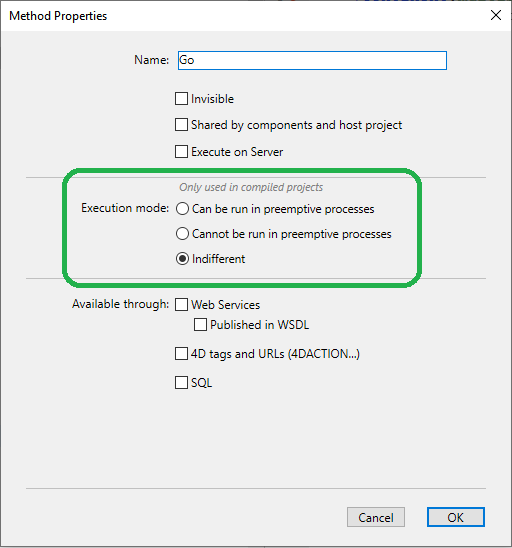
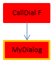

O código 4D compilado pode ser executado em **processos preemptivos**. Graças a esta funcionalidade, seus aplicativos 4D compilados poderão aproveitar ao máximo os computadores de vários núcleos de modo que sua execução será mais rápida e pode suportar mais usuários conectados.

## O que é um processo preemptivo?

Quando for executado em _modo preemptivo_, um processo estará dedicado a uma CPU. A gestão de processos então é delegada ao sistema, que pode adjudicar por separado cada CPU em uma máquina multi-núcleo.

Quando for executado em modo _cooperativo_, todos os processos serão gestionados pelo thread da aplicação pai e compartem a mesma CPU, mesmo em uma máquina multi-núcleo.

Como resultado, no modo apropriativo, o rendimento global da aplicação é incrementado, especialmente em máquinas multi-núcleo, já que múltiplos processos (threads ou fios) podem ser executados simultaneamente. Entretanto, os ganhos reais dependem das operações executadas. Por outro lado, já que no modo apropriativo cada fio é independente dos demais e não é gestionado diretamente pela aplicação, limitações específicas se aplicam aos métodos que queira que sejam compatíveis com o modo apropriativo. Além disso, a execução apropriativa está disponível só em alguns contextos específicos.

## Disponibilidade de modo preemptivo

O uso do modo preemptivo está disponível nos seguintes contextos de execução:

| Contexto          | Execução preventiva                                                   |
| ----------------- | --------------------------------------------------------------------- |
| 4D Server         | sim                                                                   |
| 4D remoto         | sim, com [ServerNet ou QUIC](../settings/client-server#network-layer) |
| 4D usuário único  | sim                                                                   |
| Modo compilado    | sim                                                                   |
| Modo interpretado | não                                                                   |

Se o contexto de execução suporta o modo apropriativo e se o método for "thread seguro", um novo processo 4D lançado utilizando os comandos New process ou CALL WORKER ou do menu "Executar método" se executará em modo apropriativo.

De outro modo, se chamar `New process` ou `CALL WORKER` em um contexto de execução que não é suportado (por exemplo em uma máquina remota 4D) o processo é sempre cooperativo.

## Código thread-seguro vs thread-inseguro

O código 4D pode ser executado em fio (thread) apropriativo só quando algumas condições específicas forem cumpridas. Cada parte do código executado (comandos, métodos, variáveis, funções...) deve ser compatível com uma execução apropriativa. Os elementos que podem ser executados em fios apropriativos são chamados threads seguros e os elementos que não podem ser executados em fios apropriativos são chamados threads inseguros.

:::note

Dado que um thread se maneja de forma independente a partir do método processo pai, toda a string de chamadas não deve incluir nenhum código thread inseguro, do contrário a execução apropriativa não será possível. Esse ponto é discutido \[neste parágrafo] (#when-is-a-process-started-preemptively).

:::

A propriedade "segurança de fio" de cada elemento depende do elemento em si:

- Comandos 4D: thread seguro é uma propriedade interna. Na [referência da linguagem 4D](https://doc.4d.com/4Dv20/4D/20.1/4D-Language-Reference.100-6479538.en.html), os comandos thread seguro se identificam pelo ícone . Você também pode usar o comando [`Command name`](https://doc.4d.com/4dv20/help/command/en/page538.html) para saber se um comando é thread-safe. Grande parte dos comandos 4D podem ser executados em modo apropriativo.
- Métodos de projeto: as condições para segurança de thread se listam no [este parágrafo](#writing-a-thread-safe-method).

Basicamente, o código que se executa em thread apropriativos não podem ser chamados as partes com as interações externas, tal como o código plug-in ou as variáveis interprocesso. Os acessos aos dados, entretanto, são permitidos desde o servidor de dados 4D que suporta a execução apropriativa.

## Declaração de um método preemptivo

Como padrão, 4D executará todos os métodos de projeto em modo cooperativo. Se desejar se beneficiar da funcionalidade modo apropriativo, o primeiro passo consiste em declarar explicitamente todos os métodos que deseja que se iniciem em modo apropriativo sempre que for possível, ou seja, os métodos que considere capaz de executar em processo apropriativo. O compilador \[verificará se esses métodos são realmente thread-safe] (#writing-a-thread-safe-method) em tempo de compilação. Também pode desabilitar o modo apropriativo para alguns métodos, se for necessário.

Lembre que definir um método como apropriativo faz com que seja elegível para execução apropriativa, mas não garante que se execute realmente em modo apropriativo. Iniciar um processo no modo preemptivo resulta de uma \[avaliação realizada por 4D] (#when-is-a-process-started-preemptively) com relação às propriedades de todos os métodos na cadeia de chamadas do processo.

Para declarar seu método de elegibilidade para o modo apropriativo, é necessário utilizar a opção de declaração "Modo de execução" no quadro de diálogo Propriedades de método:



São fornecidas as seguintes opções:

- **Pode ser executado em um processo preemptivo**: ao selecionar esta opção, declara que o método pode ser executado em um processo preemptivo e, portanto, deve ser executado em modo preemptivo quando for possível. A propriedade "preemptive" do método é definida como "capable".

  Quando essa opção estiver marcada, o compilador 4D verificará se o método é realmente capaz e retornará erros se esse não for o caso -- por exemplo, se ele chama direta ou indiretamente comandos ou métodos que não podem ser executados em modo preemptivo (toda a cadeia de chamadas é analisada, mas os erros são reportados apenas ao primeiro subnível). Pode então editar o método para que se torne thread-safe, ou selecionar outra opção.

  Se a capacidade preemptiva do método for aprovada, este é marcado internamente como "thread-safe" e será executado em modo preemptivo sempre que as condições necessárias forem cumpridas. Esta propriedade define a sua elegibilidade para o modo preemptivo, mas não garante que o método será efetivamente executado em modo preemptivo, uma vez que este modo de execução requer um \[contexto específico] (#when-is-a-process-started-preemptively).

- **Não pode ser executado em um processo preemptivo**: selecionando esta opção, se declara que o método não deve ser executado em modo preemptivo, e, portanto, sempre se deve executar em modo cooperativo, da mesma forma que nas versões anteriores de 4D. A propriedade "preemptive" do método é definida como "incapable".

  Quando esta opção estiver marcada, o compilador 4D não verificará a habilidade do método de executar preemptivamente; ele é automaticamente marcado como "thread-unsafe" internamente (mesmo que seja teoricamente capaz). Quando chamado em tempo de execução, este método irá "contaminar" quaisquer outros métodos na mesma thread, forçando assim esta thread a ser executada em modo cooperativo, mesmo que os outros métodos sejam thread-safe.

- **Indiferente** (pré-determinado): ao selecionar esta opção, declara que não deseja manejar a propriedade preventiva para o método. A propriedade "preemptiva" do método é definida como "indiferente".

  Quando esta opção está marcada, o compilador 4D avaliará a capacidade preemptiva do método e o marcará internamente como "thread-safe" ou "thread-unsafe". Não é devolvido qualquer erro relacionado com a execução preemptiva. Se o método for avaliado como thread-safe, em tempo de execução não impedirá a execução preemptiva de threads quando chamado num contexto preemptivo. Por outro lado, se o método for avaliado como "thread-unsafe", em tempo de execução impedirá qualquer execução de thread preemptiva quando for chamado.

Note que com essa opção, independentemente da avaliação interna de segurança de thread, o método será sempre executado em modo cooperativo quando chamado diretamente por 4D como o primeiro método pai (por exemplo, através do comando `New process`). Se for marcado internamente como "thread-safe", só é tido em conta quando chamado a partir de outros métodos dentro de uma cadeia de chamadas.

:::note Caso particular

Se o método também tem a propriedade [**Compartilhada por componentes e banco de dados host**](../Project/code-overview.md#shared-by-components-and-host-database), configurando a opção **Indiferente** irá automaticamente marcar o método como thread-unsafe. Se pretender que um método de componente partilhado seja thread-safe, deve defini-lo explicitamente como **Pode ser executado em processos preemptivos**.

:::

## Quando um processo é iniciado de forma preemptiva?

:::info Lembrete

A execução apropriativa só está disponível em modo compilado.

:::

Em modo compilado, quando for iniciado um processo criado pelos métodos `New process` ou `CALL WORKER`, 4D lê a propriedade apropiativa do método processo (também chamado método pai) e executa o processo em modo apropriativo ou cooperativo, em função desta propriedade:

- Se o método processo for thread seguro (validado durante a compilação), o processo é executado em um thread apropriativo.
- Se o método processo for thread inseguro, o processo é executado em um thread cooperativo.
- Se a propriedade apropiativa do método de processo era "indiferente", por compatibilidade o processo é executado em um thread cooperativo (mesmo que o método seja realmente capaz de uso preemptivo). Note, entretanto, que esta funcionalidade de compatibilidade for aplicada só quando for utilizado o método como método de processo: um método declarado "indiferente", mas internamente etiquetado "thread seguro" pelo compilador pode ser chamado apropriativamente por outro método (ver abaixo).

A propriedade segurança de thread depende da cadeia de chamadas. Se um método com a propriedade declarada "capable" chamar a um método thread inseguro em qualquer de seus subníveis, um erro de compilação será devolvido: se um método único em toda a cadeia de chamadas for thread inseguro, "contaminará" todos os outros métodos e a execução apropriativa será recusada pelo compilador. Um thread apropriativo só pode ser criado quando toda a cadeia for thread seguro e o método de processo tiver sido declarado "Pode ser executado em processo apropiativo".
Por outro lado, o mesmo método thread seguro pode ser executado em um thread apropriativo em uma cadeia de chamada e em thread cooperativo em outra cadeia de chamada.

Por exemplo, considere os métodos de projeto abaixo:

```4d
  //Método projeto MyDialog
  //contém chamadas de interface: será internamente thread inseguro
 $win:=Open form window("tools";Palette form window)
 DIALOG("tools")
```

```4d
  //Método projeto MyComp
  //contém computação simples: será internamente thread seguro
 #DECLARE($value : Integer) -> $result : Integer
 $result:=$value*2
```

```4d
  //Método projeto CallDial
 var $vName : Text
 MyDialog
```

```4d
  //Método projeto CallComp
 var $vAge : Integer
 MyComp($vAge)
```

A execução de un método no modo preemptivo dependerá de que a propriedade "execução" e da cadeia de chamadas. A tabela abaixo ilustra estas diversas situações:


| Declaração e cadeia de chamadas       | Compilação | Segurança de thread resultante         | Execução                | Comentário                                                                                                                                                                                                                                                                                                                                                                                                                                         |
| ------------------------------------- | ---------- | -------------------------------------- | ----------------------- | -------------------------------------------------------------------------------------------------------------------------------------------------------------------------------------------------------------------------------------------------------------------------------------------------------------------------------------------------------------------------------------------------------------------------------------------------- |
|  | OK         |   | Apropiativo             | CallComp é o método pai, declarado "capable" de uso preemptivo; já que MyComp é internamente thread seguro, CallComp é thread seguro e o processo for preemptivo                                                                                                                                                                                                                                                                                   |
|  | Error      |   | A execução é impossível | CallDial é o método pai, declarado "capaz"; MyDialog é "indiferente". Entretanto, já que MyDialog está internamente thread inseguro, contamina a string de chamadas. A compilação falha devido a um conflito entre a declaração deCallDial e sua capacidade real. A solução é modificar MyDialog para ser thread seguro, de modo que a execução seja preemptiva, ou mudar a declaração de propriedade de CallDial para executá-lo como cooperativo |
|  | OK         |   | Cooperativo             | Como CallDial se declara "incapable" de uso apropiativo, a compilação é internamente thread inseguro, a execução sempre será cooperativa, independentemente do estado de MyDialog                                                                                                                                                                                                                                                                  |
|  | OK         |   | Cooperativo             | Como CallComp é o método pai com a propriedade "Indifferent", depois o processo é cooperativo mesmo se toda a string for thread seguro.                                                                                                                                                                                                                                                                                                            |
|  | OK         |  | Cooperativo             | Como CallDial é o método pai (propriedade era "Indifferent"), então o processo é cooperativo e a compilação exitosa                                                                                                                                                                                                                                                                                                                                |

### Como descobrir o modo de execução real

4D permite que você identifique o modo de execução dos processos no modo compilado:

- O comando \[`PROCESS PROPERTIES`] (https\://doc.4d.com/4dv20/help/command/en/page336.html) permite que você descubra se um processo é executado em modo apropriativo ou cooperativo.
- O Explorador de execução e a \[janela de administração de 4D Server] (../ServerWindow/processes.md#process-type)
  mostram ícones específicos para os processos preemptivos.

## Escrevendo um método thread seguro

Para ser thread seguro, um método deve respeitar as seguintes regras:

- deve ter a propriedade "Pode ser executado em processos preemptivos" ou "Indiferente"
- não chama a um comando 4D que seja thread inseguro.
- não deve chamar outro método projeto ou função de que não seja thread seguro
- não deve chamar um plug-in que seja thread inseguro.
- não deve usar nenhuma variável de interprocesso(1)
- não deve chamar objetos de interface (2) (existem, no entanto, exceções, veja abaixo).

(1) Para intercambiar dados entre processos preemptivos (e entre todos os processos), pode passar [coleções compartilhadas ou objetos compartidos](../Concepts/shared.md) como parâmetros a processos, ou usar o catálogo [`Storage`](https://doc.4d.com/4dv20/help/command/en/page1525.html).
[Os processos worker](processes.md#worker-processes) também permitem que você troque mensagens entre quaisquer processos, inclusive processos preemptivos.

(2) O comando \[`CALL FORM`] (https\://doc.4d.com/4dv20/help/command/en/page1391.html) oferece uma solução elegante para chamar objetos de interface a partir de um processo preemptivo.

:::note Notas

- No caso de um método "Compartilhado por componentes e bancos de dados host", a propriedade "Pode ser executado em processos preemptivos" deve ser selecionada.
- Todas as instruções SQL são thread- seguro. O código SQL inserido nos blocos `Begin SQL`/`End SQL` deve estar em conformidade com as seguintes condições:
  - Deve ser aplicado ao 4D Server ou ao banco de dados local do 4D (ODBC ou bancos de dados remotos via `SQL LOGIN` não são thread seguros. No entanto, os bancos de dados locais usados com `USE DATABASE` são thread seguro).
  * Qualquer trigger chamado por instruções SQL deve ser thread seguro (consulte [Triggers](#triggers) abaixo).

:::

Os métodos com a propriedade "Pode ser executado em processos preemptivos" serão verificados por 4D na etapa de compilação. Um erro de compilação se emite quando o compilador encontrar algo que lhe impeça ser thread seguro:


:::info

É possível [desativar localmente a verificação thread seguro](#).

:::

O [arquivo de símbolos](../Project/compiler.md/#complete-list-of-methods), se ativado, também contém o estado de segurança de thread para cada método.

### Interface de usuário

Since they are "external" accesses, calls to user interface objects such as forms, as well as to the Debugger, are not allowed in preemptive threads.

The only possible accesses to the user interface from a preemptive thread are:

- [Diálogo de erro padrão](.../Debugging/basics). The dialog is displayed in the user mode process (on 4D) or the server user interface process (4D Server). O botão **Rastreamento** está desativado.
- Standard progress indicators
- Diálogos `ALERT`, `Request` e `CONFIRM`. The dialog is displayed in the user mode process (on 4D) or the server user interface process (4D Server). Note that if 4D Server has been launched as a service on Windows with no user interaction allowed, the dialogs will not be displayed.

### Triggers

When a method uses a command that can call a trigger, the 4D compiler evaluates the thread safety of the trigger in order to check the thread safety of the method:

```4d
 SAVE RECORD([Table_1]) //trigger on Table_1, if it exists, must be thread-safe
```

Here is the list of commands that are checked at compilation time for trigger thread safety:

`SAVE RECORD`, `SAVE RELATED ONE`, `DELETE RECORD`, `DELETE SELECTION`, `ARRAY TO SELECTION`, `JSON TO SELECTION`, `APPLY TO SELECTION`, `IMPORT DATA`, `IMPORT DIF`, `IMPORT ODBC`, `IMPORT SYLK`, `IMPORT TEXT`.

If the table is passed dynamically, the compiler may sometimes not be able to find out which trigger it needs to evaluate. Aqui estão alguns exemplos de tais situações:

```4d
 DEFAULT TABLE([Table_1])
 SAVE RECORD
 SAVE RECORD($ptrOnTable->)
 SAVE RECORD(Table(myMethodThatReturnsATableNumber())->)
```

Nesse caso, todos os triggers são avaliados. If a thread-unsafe command is detected in at least one trigger, the whole group is rejected and the method is declared thread-unsafe.

### Métodos de tratamento de erros

[Error-catching methods](../Concepts/error-handling.md) installed by the `ON ERR CALL` command must be thread-safe if they are likely to be called from a preemptive process. In order to handle this case, the compiler checks the thread safety property of error-catching project methods passed to the `ON ERR CALL` command during compilation and returns appropriate errors if they do not comply with preemptive execution.

Note that this checking is only possible when the method name is passed as a constant, and is not computed, as shown below:

```4d
 ON ERR CALL("myErrMethod1") //will be checked by the compiler
 ON ERR CALL("myErrMethod"+String($vNum)) //will not be checked by the compiler
```

In addition, if an error-catching project method cannot be called at runtime (following a thread safety issue, or for any reason like "method not found"), the error -10532 "Cannot call error handling project method 'methodName'" is generated.

### Compatibilidade de ponteiros

A process can dereference a pointer to access the value of another process variable only if both processes are cooperative; otherwise, 4D will throw an error. In a preemptive process, if some 4D code tries to dereference a pointer to an interprocess variable, 4D will throw an error.

Exemplo com os seguintes métodos:

Method1:

```4d
 myVar:=42
 $pid:=New process("Method2";0;"process name";->myVar)
```

Method2:

```4d
 $value:=$1->
```

If either the process running Method1 or the process running Method2 is preemptive, then the expression `$value:=$1->` will throw an execution error.

### Referência do documento DocRef

The use of DocRef type parameters (opened document reference, used or returned by `Open document`, `Create document`, `Append document`, `CLOSE DOCUMENT`, `RECEIVE PACKET`, `SEND PACKET`) is limited to the following contexts:

- When called from a preemptive process, a `DocRef` reference is only usable from that preemptive process.
- When called from a cooperative process, a `DocRef` reference is usable from any other cooperative process.

## Disabling thread safety checking locally

There may be some cases where you prefer that thread safety checking of commands not be applied to certain parts of code, for example when it contains thread-unsafe commands that you know to be never called.

To do this, you must surround the code to be excluded from command thread safety checking with the special directives `%T-` and `%T+` as comments. The `//%T-` comment disables thread safety checking and `//%T+` enables it again:

```4d
  // %T- to disable thread safety checking
 
  // Place the code containing commands to be excluded from thread safety checking here
 $w:=Open window(10;10;100;100) //for example
 
  // %T+ to enable thread safety checking again for the rest of the method
```

Of course, the 4D developer is responsible for the preemptive mode compatibility of the code between the deactivation and reactivation directives. Runtime errors will be generated if thread-unsafe code is executed in a preemptive thread.
