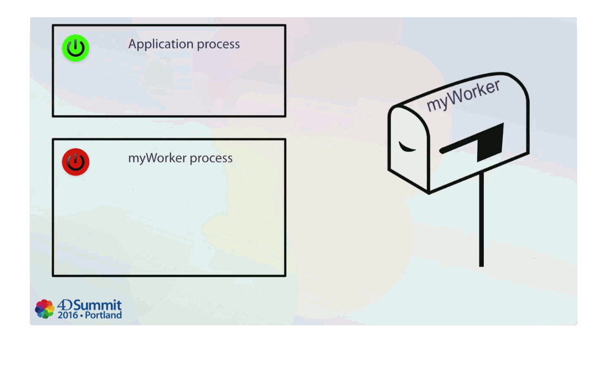

Multi-tarefa no 4D é a habilidade de ter várias operações que são executadas simultaneamente. Essas operações são chamadas **processos**. Processos múltiplos são como múltiplos usuários no mesmo computador, cada um trabalhando em sua própria tarefa. Isto significa, essencialmente, que cada método pode ser executado como uma tarefa distinta de base de dados.

Se você escrever código seguro para threads, você pode criar [**processos preemptivos**](preemptive.md) que serão capazes de aproveitar o poder de processamento de computadores multi-core em suas aplicações compiladas, para execução mais rápida.

:::note

A aplicação 4D cria processos para suas próprias necessidades, por exemplo, o processo Principal para gerenciar as janelas de exibição da interface do usuário, o processo Design para gerenciar as janelas e editores do ambiente de design (observe que ambos são [processos de trabalho](#worker-processes)), o processo Servidor Web, o processo Gerenciador de Cache, o processo de Indexação ou o processo Gerenciador de Eventos.

:::

## Criar e limpar processos

Existem várias maneiras de criar um processo:

- Execute um método no ambiente de Design após marcar a caixa de seleção **Novo Processo** na caixa de diálogo "Executar Método". O método escolhido na caixa de diálogo Executar Método é o método do processo.
- Use o comando [`New process`] (https://doc.4d.com/4dv20/help/command/en/page317.html). O método passado como parâmetro para o comando `Novo processo` é o método de processo.
- Use o comando [`Execute on server`] (https://doc.4d.com/4dv20/help/command/en/page373.html) para criar um procedimento armazenado no servidor. O método passado como parâmetro do comando é o método processo.
- Use o comando [`CALL WORKER`] (https://doc.4d.com/4dv20/help/command/en/page1389.html). Se o processo worker ainda não existir, será criado.

:::note

Em aplicativos de desktop, os processos podem ser executados escolhendo comandos de menu. No [Editor de Barra de Menu](../Menus/creating.md), selecione o comando de menu e marque a caixa de seleção **Iniciar um Novo Processo**. O método associado ao comando do menu é o método processo.

:::

Um processo pode ser liberado sob as seguintes condições (as primeiras duas condições são automáticas):

- Quando o método processo termina de ser executado
- Quando o usuário sai da aplicação
- Se você parar o processo procedimentalmente ou usar o botão **Abortar** no Depurador ou no Explorador de Tempo de Execução
- Se você chamar o comando [`KILL WORKER`](https://doc.4d.com/4dv20/help/command/en/page1390.html) (para excluir apenas um processo de trabalhador).

Um processo pode criar outro processo. Os processos não são organizados hierarquicamente—todos os processos são iguais, independentemente do processo do qual foram criados. Uma vez que o processo "pai" cria um processo "filho", o processo filho continuará independentemente de o processo pai ainda estar em execução.

## Elementos de um processo

Cada processo contém elementos específicos que podem ser tratados independentemente de outros processos.

### Elementos da linguagem

- Variáveis: Cada processo tem suas próprias [variáveis de processo](../Concepts/variables#process-variables). Variáveis de processo são reconhecidas apenas dentro do domínio de seu processo nativo.
- Conjuntos de processo: cada processo tem seus próprios conjuntos de processos. `LockedSet` é um conjunto de processos. Os conjuntos processo são apagados assim que o método processo termina.
- [Método de tratamento de erros](../Concepts/error-handling#installing-an-error-handling-method): Cada processo pode ter seu próprio método de tratamento de erros.
- [Janela do Depurador](../Debugging/debugger#calling-the-debugger): Cada processo pode ter sua própria janela do Depurador.

### Elementos da interface

Elementos de interface são usados em [Aplicações para Desktop](../category/desktop-applications). Eles consistem nos seguintes:

- [Barra de menus](../Menus/creating.md): cada processo pode ter sua própria barra de menu atual. A barra de menu do processo ativo é a barra de menu atual para o aplicativo.
- Um ou mais janelas: Cada processo pode ter mais de uma janela aberta simultaneamente. Por outro lado, alguns processos não têm nenhuma janela.
- Uma janela ativa (em primeiro plano): Mesmo que um processo possa ter várias janelas abertas simultaneamente, cada processo tem apenas uma janela ativa. Para ter mais de uma janela ativa, você deve iniciar mais de um processo.
- Formulários de entrada e saída: Os formulários de entrada e saída padrão podem ser definidos processualmente para cada tabela em cada processo.

:::info

- Por padrão, os processos não incluem barras de menu, o que significa que os atalhos do menu **Editar** (em particular, cortar/copiar/colar) não estão disponíveis nas janelas de processo. Quando você chama caixas de diálogo ou editores do 4D (editor de formulários, editor de consultas, Requisição, etc.) de um processo, se você deseja que o usuário possa se beneficiar de atalhos de teclado como copiar/colar, você precisa garantir que o equivalente a um menu **Editar** esteja instalado no processo.
- [Processos preemptivos](preemptive.md) e processos executados no servidor (procedimentos armazenados) não devem conter elementos da interface.

:::

:::note

Cada processo também possui uma seleção atual e registro atual separados por tabela. Para obter mais informações sobre esses conceitos, consulte [doc.4d.com] (https://doc.4d.com/4Dv20/4D/20.1/Displaying-and-selecting-records.300-6602144.en.html).

:::

## Processos globais e locais

Os processos podem ser globais ou locais em seu escopo. Por padrão, todos os processos são globais.

Processos globais podem realizar qualquer operação, incluindo o acesso e manipulação de dados. Geralmente, você desejará usar processos globais. Processos locais devem ser utilizados apenas para operações que não acessam dados. Por exemplo, você pode usar um processo local para executar um método de manipulação de eventos ou para controlar elementos da interface como janelas flutuantes.

Você especifica que um processo tem escopo local através de seu nome. O nome do processo local deve começar com um sinal de dólar ($).

:::warning

Se você tentar acessar os dados de um processo local, acessá-lo através do processo principal (processo #1), risco entra em conflito com operações realizadas dentro desse processo.

:::

### 4D Server

Usar processos locais no lado remoto para operações que não requerem acesso a dados reserva mais tempo de processamento para tarefas intensivas do servidor. Quando você cria um processo local para o cliente (usando `Novo processo`, por exemplo), ele só existe no lado remoto.

Quando você cria um processo global no cliente, um processo "gêmeo" é criado no servidor, consumindo assim recursos do servidor para lidar com o acesso aos dados e o contexto do banco de dados. No entanto, por motivo de otimização, o processo duplicado é criado apenas se necessário, ou seja, na primeira vez em que o processo global precisa acessar dados.

## Processos Worker

Usar um processo de trabalho é uma maneira simples e poderosa de trocar informações entre processos. Esta funcionalidade é baseada em um sistema de mensagens assíncrono que permite que processos e formulários sejam chamados e solicitados a executar métodos com parâmetros em seu próprio contexto.

Um trabalhador pode ser "contratado" por qualquer processo (usando o comando [`CALL WORKER`](https://doc.4d.com/4dv20/help/command/en/page1389.html)) para executar métodos do projeto com parâmetros em seu próprio contexto, permitindo assim o acesso a informações compartilhadas.

:::info

No aplicativo Desktop, um método de projeto também pode ser executado com parâmetros no contexto de qualquer forma usando o comando [`CALL FORM`](https://doc.4d.com/4dv20/help/command/en/page1391.html).

:::

Esta funcionalidade aborda as seguintes necessidades em relação à comunicação de interprocessos 4D:

- Uma vez que são suportados tanto por processos cooperativos quanto preemptivos, eles são a solução perfeita para comunicação entre processos em [processos preemptivos](preemptive.md) ([variáveis entre processos estão obsoletas](https://doc.4d.com/4Dv20/4D/20/Deprecated-or-Removed-Features.100-6259787.en.html#5868705) e não são permitidas em processos preemptivos).
- Eles fornecem uma alternativa simples aos semáforos, que podem ser complicados de configurar e complexos de usar

:::note

Embora tenham sido projetados principalmente para comunicação entre processos no contexto de processos preemptivos, `CALL WORKER` e `CALL FORM` podem ser usados com processos cooperativos.

:::

### Usando workers

Um worker é usado para solicitar a um processo que execute métodos projeto. Um worker consiste de:

- um nome único (_warning: o nome diferencia maiúsculas de minúsculas_), também usado para nomear seu processo associado
- um processo associado, que pode ou não existir em um determinado momento
- uma caixa de mensagem
- um método de inicialização (opcional)

Você pede a um trabalhador para executar um método de projeto chamando o comando `CALL WORKER`. O trabalhador e sua caixa de mensagens são criados no primeiro uso; seu processo associado também é lançado automaticamente no primeiro uso. Se o processo do trabalhador morrer em seguida, a caixa de mensagem permanece aberta e qualquer nova mensagem na caixa iniciará um novo processo do trabalhador.

A animação a seguir ilustra esta sequência:

Ao contrário de um processo criado com o comando `Novo processo`, um processo de trabalhador **permanece ativo após a conclusão do método de execução do processo**. Isto significa que todas as execuções de métodos para o mesmo trabalhador serão executadas no mesmo processo, que mantém todas as informações do estado do processo (variáveis do processo, registro atual e seleção atual, etc.). Consequentemente, os métodos executados sucessivamente terão acesso e compartilharão as mesmas informações, permitindo a comunicação entre os processos. A caixa de mensagens do worker lida com chamadas sucessivas de forma assíncrona.

`CALL WORKER` encapsula tanto o nome do método quanto os argumentos de comando em uma mensagem que é postada na caixa de mensagem do worker. O processo do trabalhador é então iniciado, se já não existe e solicitado a executar a mensagem. Isso significa que `CALL WORKER` geralmente retornará antes que o método seja realmente executado (o processamento é assíncrono). Por esse motivo, `CALL WORKER` não retorna nenhum valor. Se você precisa de um trabalhador para enviar informações de volta para o processo que o chamou (callback), você precisa usar `CALL WORKER` novamente para passar as informações necessárias para o chamador. É claro que, nesse caso, o próprio chamador deve ser um worker.

Não é possível usar `CALL WORKER` para executar um método em um processo criado pelo comando `Novo processo`. Apenas os processos trabalhadores possuem uma caixa de mensagens e podem, portanto, serem chamados pelo `CALL WORKER`. Note that a process created by `Novo processo` can call a worker, but cannot be called back.

Os processos trabalhadores podem ser criados no 4D Server por meio de procedimentos armazenados: por exemplo, você pode usar o comando `Executar no servidor` para executar um método que chama o comando `CALL WORKER`.

Um processo de trabalho é encerrado por meio de uma chamada ao comando [`KILL WORKER`](https://doc.4d.com/4dv20/help/command/en/page1390.html), que esvazia a caixa de mensagens do trabalhador e solicita ao processo associado que pare de processar mensagens e termine sua execução atual assim que a tarefa atual for concluída.

O método de inicialização de um worker é o método usado para criar o trabalhador (na primeira utilização). Se `CALL WORKER` for chamado com um parâmetro _method_ vazio, então o método de inicialização é automaticamente reutilizado como método para executar.

O processo principal criado pelo 4D ao abrir um banco de dados para os modos de usuário e aplicativo é um processo de trabalhador e pode ser chamado usando `CALL WORKER`. Observe que o nome do processo principal pode variar dependendo do idioma de localização do 4D, mas ele sempre tem o número de processo 1; como resultado, é mais conveniente designá-lo pelo número de processo em vez do nome do processo ao chamar `CALL WORKER`.

### Identificação dos processos Worker

Todos os processos trabalhadores, exceto o processo principal, têm o tipo de processo `processo trabalhador` (5) retornado pelo comando [`PROCESS PROPERTIES`](https://doc.4d.com/4dv20/help/command/en/page336.html).

[Ícones específicos](../ServerWindow/processes#process-type) identificam os processos worker.

### Veja também

Para obter mais informações, consulte [este post](https://blog.4d.com/4d-summit-2016-laurent-esnault-presents-workers-and-ui-in-preemptive-mode/) sobre como usar os workers.
