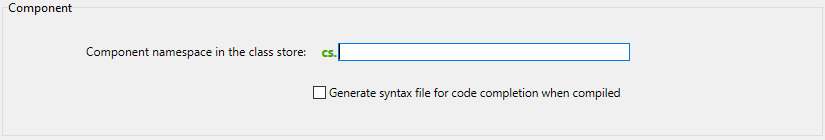

Um componente 4D é um conjunto de funções, métodos e formulários 4D que representam uma ou mais funcionalidades que podem ser [instaladas e usadas em aplicativos 4D] (Concepts/components.md). Por exemplo, você pode desenvolver um componente de e-mail 4D que gerencia todos os aspectos de envio, recebimento e armazenamento de e-mails em aplicativos 4D.

Você pode desenvolver componentes 4D para suas próprias necessidades e mantê-los privados. Você também pode [compartilhar seus componentes com a comunidade 4D] (https://github.com/topics/4d-component).

## Definições

- **Projeto Matrix**: ´projeto 4D usado para desenvolver o componente. O projeto matriz é um projeto standard sem atributos específicos. Um projeto matricial forma um componente único.
- **Projeto Host**: projeto aplicação onde um componente é instalado e usado.
- **Component**: Matrix project that can be compiled and [built](Desktop/building.md#build-component), [installed in the host application](../Project/components.md#basics) and whose contents are used in the host application.

## Básicos

Criar e instalar componentes 4D é realizado diretamente a partir de 4D:

- Para usar um componente, basta [instalá-lo em seu aplicação](../Project/components.md#basics).
- Um projeto pode ser tanto uma matriz quanto um host, em outras palavras, um projeto de matriz pode usar um ou mais componentes. No entanto, um componente não pode utilizar ele próprio "subcomponentes".
- Um componente pode chamar a maioria dos elementos 4D: classes, funções, métodos de projeto, formulários de projeto, barras de menu, listas de opções e assim por diante. Não pode chamar métodos de bancos de dados e triggers.
- Não é possível usar o datastore, as tabelas padrão ou os arquivos de dados nos componentes 4D. Entretanto um componente não pode criar ou usar tabelas, campos e arquivos de dados usando mecanismos de bancos de dados externos. São bancos 4D independentes com as que se trabalha utilizando comandos SQL.
- Um projecto anfitrião executado em modo interpretado pode utilizar componentes interpretados ou compilados. Um projecto anfitrião executado em modo compilado não pode utilizar componentes interpretados. Por isso não pode ser usado em um componente.

## Escopo dos comandos de linguagem

A excepción de los [comandos no utilizables](#comandos-inutilizables), un componente puede utilizar cualquier comando del lenguaje 4D.

Quando os comandos são chamados a partir de um componente, eles são executados no contexto do componente, com exceção dos comandos [`EXECUTE METHOD`] (https://doc.4d.com/4dv20/help/command/en/page1007.html) ou [`EXECUTE FORMULA`] (https://doc.4d.com/4dv20/help/command/en/page63.html), que usam o contexto do método especificado pelo comando. Observe também que os comandos de leitura do tema "Usuários e grupos" podem ser usados a partir de um componente, mas lerão os usuários e grupos do projeto host (um componente não tem seus próprios usuários e grupos).

Os comandos [`SET DATABASE PARAMETER`](https://doc.4d.com/4dv20/help/command/pt-BR/page642.html) e [`Get database parameter`](https://doc.4d.com/4dv20/help/command/pt-BR/page643.html) são uma exceção: seu escopo é global para a aplicação. Quando esses comandos forem chamados de um componente, são aplicados ao projecto de aplicação local.

Além disso, medidas especificas foram criadas para os comandos `Structure file` e `Get 4D folder` quando utilizados no marco dos componentes.

O comando [`COMPONENT LIST`](https://doc.4d.com/4dv20/help/command/en/page1001.html) pode ser usado para obter a lista de componentes carregados pelo projeto host.

### Comandos não utilizáveis

Os comandos abaixo não são compatíveis para seu uso dentro de um componente porque modificam o arquivo de estrutura - que está aberto em apenas leitura. Sua execução em um componente irá gerar erro -10511, "O comando CommandName não pode ser chamado a partir de um componente":

- `ON EVENT CALL`
- `Method called on event`
- `SET PICTURE TO LIBRARY`
- `REMOVE PICTURE FROM LIBRARY`
- `SAVE LIST`
- `ARRAY TO LIST`
- `EDIT FORM`
- `CREATE USER FORM`
- `DELETE USER FORM`
- `CHANGE PASSWORD`
- `EDIT ACCESS`
- `Set group properties`
- `Set user properties`
- `DELETE USER`
- `CHANGE LICENSES`
- `BLOB TO USERS`
- `SET PLUGIN ACCESS`

**Notas:**

- O comando `Current form table` retorna `Nil` quando é chamado no contexto de um formulário de projeto. Por isso não pode ser usado em um componente.
- Os comandos da linguagem de definição de dados SQL (`CREATE TABLE`, `DROP TABLE`, etc.) não pode ser usado no projeto do componente. No entanto, eles são compatíveis com bancos de dados externos (consulte o comando SQL `CREATE DATABASE`).

## Partilhar os métodos projeto

Todos os métodos de projeto de um projeto de matriz são, por definição, incluídos no componente (o projeto é o componente), o que significa que eles podem ser chamados e executados dentro do componente.

Por outro lado, por padrão, esses métodos projeto não estarão visíveis e não poderão ser chamados no projeto host. In the matrix project, you must explicitly designate the methods that you want to share with the host project and its components by checking the **Shared by components and host project** box in the method properties dialog box:


Os métodos do projeto compartilhado podem ser chamados no código do projeto host (mas não podem ser modificados no Editor de código do projeto host). Estos métodos son los **puntos de entrada** del componente.

Por outro lado, por motivos de segurança, por padrão, um componente não pode executar métodos de projeto pertencentes ao projeto host. Em alguns casos, talvez seja necessário permitir que um componente acesse os métodos de projeto do seu projeto host. Para isso, você deve designar explicitamente quais métodos de projeto do projeto host você deseja tornar acessíveis aos componentes (nas propriedades do método, marque a caixa **Compartilhado por componentes e projeto host**).


Quando os métodos projeto dos projetos host estiverem disponíveis para os componentes, você poderá executar um método do projeto host de dentro de um componente usando o comando [`EXECUTE FORMULA`](https://doc.4d.com/4dv20/help/command/en/page63.html) ou [`EXECUTE METHOD`](https://doc.4d.com/4dv20/help/command/en/page1007.html). Por exemplo:

```4d
// Método host
component_method("host_method_name")
```

```4d
// component_method
#DECLARE ($param : Text)
EXECUTE METHOD($param)
```

> Um banco de dados de host interpretado que contém componentes interpretados pode ser compilado ou verificado quanto à sintaxe se não chamar métodos do componente interpretado. Caso contrário, uma caixa de diálogo de aviso será exibida quando você tentar iniciar a compilação ou uma verificação de sintaxe, e não será possível executar a operação.\
> Lembre-se de que um método interpretado pode chamar um método compilado, mas não o contrário, exceto pelo uso dos comandos `EXECUTE METHOD` e `EXECUTE FORMULA`.

## Compartilhamento de classes

By default, component classes cannot be called from the 4D Code Editor of the host project. If you want your component classes to be exposed in the host project and its loaded components, you need to **declare a component namespace**. Additionally, you can control how component classes are suggested in the host Code Editor.

### Declaração do namespace

To allow classes of your component to be exposed in the host projects and their loaded components, enter a value in the [**Component namespace in the class store** option in the General page](../settings/general.md#component-namespace-in-the-class-store) of the matrix project Settings. Por padrão, a área está vazia: as classes de componentes não estão disponíveis fora do contexto do componente.



:::note

Um namespace garante que não surja nenhum conflito quando um projeto host usar componentes diferentes que tenham classes ou funções com nomes idênticos. Um namespace de componente deve estar em conformidade com as [regras de nomeação de propriedades](../Concepts/identifiers.md#object-properties).

:::

When you enter a value, you declare that component classes will be available in the [user class store (**cs**)](../Concepts/classes.md#cs) of the host project as well as its loaded components, through the `cs.<value>` namespace. Por exemplo, se você digitar "eGeometry" como namespace do componente, Supondo que você criou uma classe `Rectangle` contendo uma função `getArea()`, assim que seu projeto for instalado como componente, o desenvolvedor do projeto host pode escrever:

```4d
//in host project or one of its components
var $rect: cs.eGeometry.Rectangle
$rect:=cs.eGeometry.Rectangle.new(10;20)
$area:=$rect.getArea()
```

:::info

The namespace of a [compiled](#protection-of-components-compilation) component is added between parentheses after the component name in the [Component Methods page](../Concepts/components.md#using-components) of the host projects:


:::

Obviamente, é recomendável usar um nome distinto para evitar qualquer conflito. If a user class with the same name as a component namespace already exists in the project, the user class is taken into account and the component classes are ignored.

As classes ORDA de um componente não estão disponíveis no seu projeto host. Por exemplo, se houver uma classe de dados chamada Employees em seu componente, você não poderá usar uma classe "cs.Mycomponent.Employee" no projeto host.

### Classes ocultas

Assim como em qualquer projeto, você pode criar classes e funções ocultas no componente prefixando os nomes com um sublinhado ("_"). Quando um [componente namespace for definido](#declaring-the-component-namespace), classes ocultas e funções do componente não aparecerão como sugestões ao usar a conclusão do código.

No entanto, se souberes os seus nomes, podes utilizá-los. Por exemplo, a sintaxe a seguir é válida mesmo que a classe `_Rectangle` esteja oculta:

```4d
$rect:=cs.eGeometry._Rectangle.new(10;20)
```

> As funções não ocultas dentro de uma classe oculta aparecem como sugestões quando você usa a funcionalidade autocompletar código com uma classe que [herda](../Concepts/classes.md#inheritance) dela. Por exemplo, se um componente tiver uma classe `Teacher` que herda de uma classe `_Person`, o recurso autocompletar código para `Teacher` sugere funções não ocultas de `_Person`.

## Completar o código dos componentes compilados

Para facilitar o uso do seu componente pelos desenvolvedores, você pode marcar a opção [**Gerar arquivo de sintaxe para autocompletar código quando compilado** na página Geral](../settings/general.md#component-namespace-in-the-class-store) das Configurações do projeto da matriz.

Um arquivo de sintaxe (formato JSON) é criado automaticamente durante a fase de compilação, preenchido com a sintaxe das classes, funções e [métodos expostos] do seu componente (#sharing-of-project-methods) e colocado na pasta `\Resources\en.lproj` do projeto do componente. 4D usa o conteúdo desse arquivo de sintaxe para gerar ajuda contextual no editor de código, como autocompletar código e sintaxe de função:


Se você não inserir um [component namespace] (#declaring-the-component-namespace), os recursos para as classes e os métodos expostos não serão gerados, mesmo que a opção de arquivo de sintaxe esteja marcada.

## Passar variáveis

As variáveis locais, de processo e interprocessos não são compartilhadas entre componentes e projetos de host. A única maneira de modificar variáveis de componentes do projeto host e vice-versa é usando ponteiros.

Exemplo usando um array:

```4d
//No projeto host:
     ARRAY INTEGER(MyArray;10)
     AMethod(->MyArray)

//No componente, o método projeto AMethod contém:
     APPEND TO ARRAY($1->;2)
```

Exemplos usando variáveis:

```4d
C_TEXT(myvariable)
component_method1(->myvariable)
```

```4d
C_POINTER($p)
$p:=component_method2(...)
```

Sem um ponteiro, um componente ainda pode acessar o valor de uma variável do banco de dados do host (mas não a própria variável) e vice-versa:

```4d
//No banco de dados host
C_TEXT($input_t)
$input_t:="DoSomething"
component_method($input_t)
// component_method gets "DoSome" in $1 (mas não na variável $input_t)
```

Quando você usa ponteiros para permitir que os componentes e o projeto host se comuniquem, é necessário levar em conta as seguintes especificidades:

- O comando `Get pointer` não retornará um ponteiro para uma variável do projeto host se for chamado a partir de um componente e vice-versa.

- A arquitetura de componentes permite a coexistência, no mesmo projeto interpretado, de componentes interpretados e compilados (por outro lado, somente componentes compilados podem ser usados em um projeto compilado). Para utilizar apontadores neste caso, deve respeitar o seguinte princípio: o intérprete pode desconectar um ponteiro construído em modo compilado; no entanto, em modo compilado, não pode deconectar um ponteiro construído em modo interpretado.
  Vamos ilustrar esse princípio com o seguinte exemplo: dados dois componentes, C (compilados) e eu (interpretados), instalados no mesmo projeto host.

- Se o componente C definir a variável `myCvar`, o componente I poderá acessar o valor dessa variável usando o ponteiro `->myCvar`.

- Se o componente I definir a variável `myIvar`, o componente C não poderá acessar essa variável usando o ponteiro `->myIvar`. Esta sintaxe causa um erro de execução.

- A comparação de ponteiros usando o comando `RESOLVE POINTER` não é recomendada com componentes, uma vez que o princípio de partição de variáveis permite a coexistência de variáveis com o mesmo nome, mas com conteúdos radicalmente diferentes em um componente e o projeto host (ou outro componente). O tipo da variável pode mesmo ser diferente em ambos os contextos. Se os ponteiros `myptr1` e `myptr2` apontarem cada um para uma variável, a comparação a seguir produzirá um resultado incorreto:

```4d
     RESOLVE POINTER(myptr1;vVarName1;vtablenum1;vfieldnum1)
     RESOLVE POINTER(myptr2;vVarName2;vtablenum2;vfieldnum2)
     If(vVarName1=vVarName2)
      //Este teste retorna True mesmo se as variáveis forem diferentes
```

Neste caso é preciso usar a comparação de ponteiros:

```4d
     If(myptr1=myptr2) //Este teste retorna False
```

## Gestão de erros

Um [método de tratamento de erros] (Concepts/error-handling.md) instalado pelo comando `ON ERR CALL` aplica-se somente ao aplicativo em execução. No caso de um erro gerado por um componente, o método de tratamento de erros `ON ERR CALL` do projeto host não é chamado, e vice-versa.

## Acesso às tabelas do projeto local

Apesar de os componentes não poderem usar tabelas, ponteiros podem permitir que projetos locais e componentes se comuniquem entre si. Por exemplo, aqui está um método que pode ser chamado a partir de um componente:

```4d
// chamando um método de componente
methCreateRec(->[PEOPLE];->[PEOPLE]Name; "Julie Andrews")
```

Dentro do componente, o código do método `methCreateRec`:

```4d
C_POINTER($1) ///Pointer em uma tabela no projeto host
C_POINTER($2) ///Pointer em um campo no projeto host
C_TEXT($3) // Valor para inserir

$tablepointer:=$1
$fieldpointer:=$2
CREATE RECORD($tablepointer->)

$fieldpointer->:=$3
SAVE RECORD($tablepointer->)
```

> No contexto de um componente, 4D assume que uma referência a um formulário de tabela é uma referência ao formulário de tabela do host (já que os componentes não podem ter tabelas).

## Uso de tabelas e campos

Um componente não pode usar as tabelas e os campos definidos na estrutura 4D do projeto de matriz. Mas pode criar e usar bancos de dados externos e então usar suas tabelas e campos de acordo com suas necessidades. Pode criar e gerenciar bancos de dados externos usando SQL. Mas pode criar e usar bancos de dados externos e então usar suas tabelas e campos de acordo com suas necessidades. Usar um banco externo significa designar temporariamente esse banco de dados como o banco atual, em outras palavras, o banco alvo para as pesquisas SQL executadas por 4D. Você cria bancos de dados externos usando o comando SQL `CREATE DATABASE`.

### Exemplo

O código abaixo está incluído em um componente e realiza três ações básicas com um banco externo:

- cria o banco externo se não existir ainda
- adiciona dados ao banco externo,
- lê dados do banco externo.

Cria o banco externo:

```4d
<>MyDatabase:=Get 4D folder+"\MyDB" // (Windows) armazena os dados em um diretório autorizado
 Begin SQL
        CREATE DATABASE IF NOT EXISTS DATAFILE :[<>MyDatabase];
        USE DATABASE DATAFILE :[<>MyDatabase];
        CREATE TABLE IF NOT EXISTS KEEPIT
        (
        ID INT32 PRIMARY KEY,
        kind VARCHAR,
        name VARCHAR,
        code TEXT,
        sort_order INT32
        );
 
        CREATE UNIQUE INDEX id_index ON KEEPIT (ID);
 
        USE DATABASE SQL_INTERNAL;

 End SQL
```

Escrita no banco de dados externa:

```4d
 $Ptr_1:=$2 // recupera dados do projeto host por meio de ponteiros
 $Ptr_2:=$3
 $Ptr_3:=$4
 $Ptr_4:=$5
 $Ptr_5:=$6
 Begin SQL

        USE DATABASE DATAFILE :[<>MyDatabase];
 
        INSERT INTO KEEPIT
        (ID, kind, name, code, sort_order)
        VALUES
        (:[$Ptr_1], :[$Ptr_2], :[$Ptr_3], :[$Ptr_4], :[$Ptr_5]);
 
        USE DATABASE SQL_INTERNAL;
 

 End SQL
```

Lendo de um banco externo:

```4d
 $Ptr_1:=$2 // acessa dados do projeto host por meio de ponteiros
 $Ptr_2:=$3
 $Ptr_3:=$4
 $Ptr_4:=$5
 $Ptr_5:=$6
 
 Begin SQL

    USE DATABASE DATAFILE :[<>MyDatabase];
 
    SELECT ALL ID, kind, name, code, sort_order
    FROM KEEPIT
    INTO :$Ptr_1, :$Ptr_2, :$Ptr_3, :$Ptr_4, :$Ptr_5;
 
    USE DATABASE SQL_INTERNAL;

 End SQL
```

## Uso de formulários

- Só os "formulários projeto" (formulários que não estejam associados a nenhuma tabela específica) podem ser utilizados em um componente. Só os "formulários de projeto" (formulários que não estejam associados a nenhuma tabela específica) podem ser utilizados em um componente.
- Um componente pode chamar formulários tabela do projeto host. Note que nesse caso é necessário usar ponteiros ao invés de nomes de tabelas entre colchetes [] para especificar os formulários no código do componente.

> Se um componente usar o comando `ADD RECORD`, será exibido o formulário de entrada atual do projeto host, no contexto do projeto host. Por isso se o formulário incluir variáveis, o componente não terá acesso às mesmas.

- Você pode [publicar formulários de componentes como subformulários](../FormEditor/properties_FormProperties.md#published-as-subform) nos projetos host. Pode publicar formulários componentes como subformulários no banco de dados local Isso significa que pode desenvolver componentes oferecendo objetos gráficos. Por exemplo, Widgets fornecidos por 4D são baseados no uso de subformulários em componentes.

> No contexto de um componente, qualquer formulário projeto referenciado deve pertencer a esse componente. Por exemplo, dentro de um componente, a referência a um formulário do projeto host usando `DIALOG` ou `Open form window` gerará um erro.

## Uso de recursos

Os componentes podem usar recursos localizados na pasta Resources do componente.

Os mecanismos automáticos estão operacionais: os arquivos XLIFF encontrados na pasta Recursos de um componente serão carregados por este componente.

Em um projeto host contendo um ou mais componentes, cada componente, bem como os projetos de host tem sua própria "string de recursos." Os recursos são particionados entre os diferentes projetos: não é possível acessar os recursos do componente A do componente B ou do projeto de host.

## Execução de código de inicialização

Um componente pode executar o código 4D automaticamente ao abrir ou fechar o banco de dados do host, por exemplo, para carregar e/ou salvar as preferências ou os estados do usuário relacionados à operação do banco de dados do host.

A execução do código de inicialização ou fechamento é feita por meio do método de banco de dados `On Host Database Event`.

> Por motivos de segurança, você deve autorizar explicitamente a execução do método de banco de dados `On Host Database Event` no banco de dados do host para poder chamá-lo. Para fazer isso, você deve marcar a opção [**Executar o método "On Host Database Event" dos componentes**](../settings/security.md#options) na página Segurança das Configurações.

## Proteção dos componentes: compilação

Por padrão, todo o código de um projeto de matriz instalado como um componente é potencialmente visível no projeto host. Em particular:

- Os métodos do projeto compartilhado são encontrados na página de métodos do Explorer e podem ser chamados nos métodos do projeto host. Seu conteúdo pode ser selecionado e copiado na área de vista prévia do Explorador. Também podem ser vistos no depurador. No entanto, eles não podem ser abertos ou modificados no editor de código.
- Os outros métodos de projeto do projeto matriz não aparecem no Explorer, mas também podem ser visualizados no depurador do projeto host.
- As classes e funções não-ocultas podem ser vistas no depurador [se um namespace for declarado](#declaring-the-component-namespace).

Para proteger o código de um componente de forma eficaz, basta [compilar e construir] (Desktop/building.md#build-component) o projeto da matriz e fornecê-lo na forma de um arquivo .4dz. Quando um projeto compilado usado como uma matriz é instalado como um componente:

- Os métodos, as classes e as funções do projeto compartilhado podem ser chamados nos métodos do projeto host e também ficam visíveis na página Métodos do Explorer. No entanto, seu conteúdo não aparecerá na área de visualização e no depurador.
- Os outros métodos projeto do projeto matriz nunca aparecerão.

## Partilha de componentes

Nós encorajamos você a apoiar a comunidade de desenvolvedores 4D compartilhando seus componentes, de preferência na [plataforma GitHub](https://github.com/topics/4d-component). Recomendamos que você use o tópico **`4d-component`** para ser referenciado corretamente.
