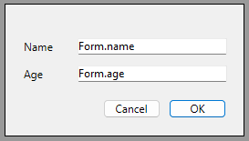
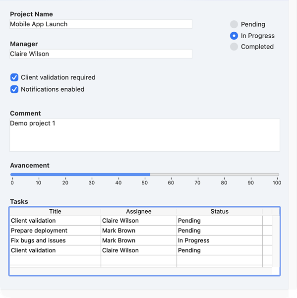
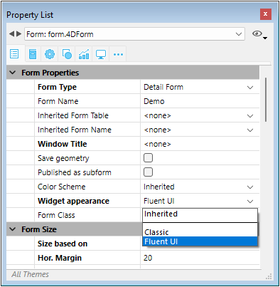

Os formulários constituem a interface através da qual a informação é introduzida, modificada e impressa numa aplicação de desktop. Os usuários interagem com os dados em um banco de dados usando formulários e imprimem relatórios usando formulários. Formulários podem ser usados para criar caixas de diálogo personalizadas, paletas ou qualquer janela personalizada em destaque.


Os formulários também podem conter outros formulários através das seguintes funcionalidades:

- [objetos de subformulário](FormObjects/subform_overview.md)
- [formulários herdados](./properties_FormProperties.md#inherited-form-name)

## Criar formulários

É possível adicionar ou modificar formulários 4D usando os seguintes elementos:

- **Interface de Desenvolvedor 4D:** Crie novos formulários a partir do menu **Arquivo** ou da janela **Explorador**.
- **Form Editor**: Modifique seus formulários usando o **[Editor de formulários](FormEditor/formEditor.md)**.
- **Código JSON:** crie e projete seus formulários usando JSON e salve os arquivos de formulário no [local apropriado](Project/architecture#sources). Exemplo:

```
{
    "windowTitle": "Hello World",
    "windowMinWidth": 220,
    "windowMinHeight": 80,
    "method": "HWexample",
    "pages": [
        null,
        {
            "objects": {
                "text": {
                "type": "text",
                "text": "Hello World!",
                "textAlign": "center",
                "left": 50,
                "top": 120,
                "width": 120,
                "height": 80
                },
                "image": {
                "type": "picture",
                "pictureFormat": "scaled",
                "picture": "/RESOURCES/Images/HW.png",
                "alignment":"center", 
                "left": 70,
                "top": 20, 
                "width":75, 
                "height":75        
                },
                "button": {
                "type": "button",
                "text": "OK",
                "action": "Cancel",
                "left": 60,
                "top": 160,


                "width": 100,
                "height": 20
                }
            }
        }
    ]
}
```

### Formulário projeto e formulário tabela

Existem duas categorias de formulários:

- **Formulários de projeto** - Formulários independentes que não estão anexados a nenhuma tabela. Eles são destinados principalmente para criar caixas de diálogo de interface, bem como componentes. Os formulários do projeto podem ser usados para criar interfaces que estejam em conformidade com os padrões do sistema operacional.

- **Formulários de tabela** - Vinculados a tabelas específicas e, portanto, beneficiam-se de funções automáticas úteis para o desenvolvimento de aplicativos baseados em bancos de dados. Normalmente, uma tabela tem formulários de entrada e saída separados.

Normalmente, você seleciona a categoria do formulário quando o cria, mas pode alterá-la posteriormente.

## Using forms

Forms are called using specific commands of the 4D Language. In your 4D desktop applications, forms can be used in various ways, depending on their status within your interface needs. A form can be:

- used in its own window for data viewing, processing, editing, or to display on-screen information to the user,
- used embedded in another form (subform),
- used as template for printing,
- or called by specific features like the Label editor.

### Using a project form in a window

When you want to use a form as on-screen dialog, you need to (1) create a window and (2) load the form within the window, along with an event loop to process user actions. The straighforward steps to display a form on screen are:

1. Call the [`Open form window`](../commands/open-form-window) command to create and preconfigure a window tailored for your form. Note that the command only draws an empty window, it does **not** display anything.
2. In the same method, call the [`DIALOG`](../commands/dialog) command to actually load the form in the opened form window, ready for user interaction. [`DIALOG`](../commands/dialog) loads form data and places your code in [listening mode to user events](../Develop/async.md#event-listening). When you call this command without asterisk (\*), the dialog will stay on screen and the code execution is frozen until an event occurs.
3. (optional) Use the [`Form`](../commands/form) command from within the form context to access form data.

:::note Compatibidade

All-in-one commands such as [`ADD RECORD`](../commands/add-record) or [`MODIFY RECORD`](../commands/add-record) merge all steps in a single call. These legacy commands can still be used for prototyping or basic developments but are not adapted to modern, fully controlled interfaces. They directly rely on the 4D database and legacy features such as [table forms](#project-form-and-table-form) and do not benefit from the power and flexibility of [ORDA features](../ORDA/overview.md). Unless specific needs, it is recommended to use project forms for your 4D desktop application interfaces.

:::

#### Simple example

You create the following basic form in the [Form editor](./formEditor.md):



The form is [associated with a "myForm" class](./properties_FormProperties.md#form-class), defined as follow:

```4d
    //cs.myForm
property name : Text
property age : Integer

Class constructor
  This.name:=""
  This.age:=0
```

The form class is automatically instantiated by 4D once the form is loaded. If you execute the following project method:

```4d
    // Instantiate a form object that will host form data and UI logic
var $formObject:=cs.myForm.new()

    //Prepare default value within the form object
$formObject.name:="Smith"
$formObject.age:=42

    // Create an empty window with ad-hoc settings that fits the desired form dimensions, resizing properties,
    // and window type (this does not render the form)
var $win:=Open form window("myForm"; Movable form dialog box; Horizontally centered; Vertically centered)

    //Render the form, and provide $formObject's data. Dialog also activates the form event loop
DIALOG("myForm"; $formObject)

    //Without asterisk to Dialog statement, the form waits for a closing action from the user 
    //before executing the rest of the code. Calling Close window is just a good practice 
CLOSE WINDOW($win) //releases reference

    //Display data modified by the user, if any/
ALERT($formObject.name+" is "+String($formObject.age)+" years old!")

```

4D displays:


### Using forms as subforms

A form can be embedded within another form, in which case it becomes a [subform object](../FormObjects/subform_overview.md) which follows specific rules. A subform is automatically used when its parent form is [displayed in a window](#using-a-project-form-in-a-window).

In the same way that you pass an object to a form with the [`DIALOG`](../commands/dialog) command, you can also pass an object to a subform area using the property list. Then, you can use it in the subform with the [`Form`](../commands/form) command. In this example, the "InvoiceAddress" object is bound to the subform:


### Using forms to be printed

In 4D desktop applications, forms can be printed using the various [commands of the **Printing** theme](../commands/theme/Printing).

#### Exemplos

You can use forms to print data, either as page or as list.

- To simply print some part of a form, use the [`Print form`](../commands/print-form) command. Por exemplo:

```4d
var $formData:={}
$formData.lastname:="Smith"
$formData.firstname:="john"
$formData.request:="I need more COFFEE"
var $h:=Print form("Request_var";$formData;Form detail)
```

- To print a form within a printing job to process data during printing, use [`FORM LOAD`](../commands/form-load) and [`Print object`](../commands/print-object) commands. Por exemplo:

```4d
 var $formData : Object
 var $over : Boolean
 var $full : Boolean
 
 OPEN PRINTING JOB
 $formData:={}
 $formData.LBcollection:=[]
 ... //fill the collection with data
 
 FORM LOAD("GlobalForm";$formData) 
 $over:=False
 Repeat
    $full:=Print object(*;"LB") // the datasource of this "LB" listbox is Form.LBcollection
    LISTBOX GET PRINT INFORMATION(*;"LB";lk printing is over;$over)
    If(Not($over))
       PAGE BREAK
    End if
 Until($over)
 FORM UNLOAD
 CLOSE PRINTING JOB
```

#### Print rendering engine

4D uses a dedicated print rendering engine to generate outputs with a design adapted for printing. It includes the following main features:

- Interactive widgets such as buttons, toggles, dropdowns, etc. and modern UI effects such as glass, blur, transparency, or shadow effects are converted into adapted static representations and flattened into printable styles, so that the document remains readable and professional once printed.
- Layout structure, spacing, and alignment, are preserved so that the printed document reflects the logical structure of the on-screen form.
- The same output is produced, whether the form is printed from macOS or Windows.

For example, the following form:



... will be printed with this rendering:


:::tip Related blog post

[Printing Modern Interfaces with Clean, Consistent Output](https://blog.4d.com/printing-modern-interfaces-with-clean-consistent-output)

:::

#### Legacy print renderer

In releases prior to 4D 21 R3, another print renderer was used. This legacy renderer simply draws widgets as they appear on the screen. For compatibility, the legacy renderer is **enabled by default** in projects or databases converted from versions prior to 4D 21 R3, so that forms designed with this renderer continue to be printed as expected.

You can however enable the modern print rendering engine at any moment by:

- unchecking the **Use legacy print rendering** option in the [Compatibility page of the Settings dialog box](../settings/compatibility.md) (permanent setting),
- or executing [`SET DATABASE PARAMETER`](../commands/set-database-parameter) command with `Use legacy print rendering` selector set to 1 (volatile setting).

:::warning Limitação

For technical reasons, the legacy print renderer is not available with forms displayed with [Fluent UI](#fluent-ui-rendering) on Windows or [Liquid Glass](../Notes/updates.md#support-of-liquid-glass-on-macos) on macOS. In these contexts, forms are **always printed with the modern print rendering engine**, whatever the compatibility option.

:::

### Other form usages

There are several other ways to use forms in the 4D applications, including:

- a form can be [inherited](#inherited-forms) from another form,
- a form can be [associated to a listbox](../FormObjects/properties_ListBox.md#detail-form-name) in response to a user action to display a row using an edit button or a double-click,
- the [label editor can use a form](../Desktop/labels.md#form-to-use) as template to print labels.

## Páginas formulário

Each form is made of at least two pages:

- uma página 1: uma página principal, exibida por defeito
- uma página 0: uma página de fundo, cujo conteúdo é exibido em todas as outras páginas.

É possível criar várias páginas para um formulário de entrada. Se você tiver mais campos ou variáveis do que cabem em uma tela, você pode querer criar páginas adicionais para exibi-los. As páginas múltiplas permitem-lhe fazer o seguinte:

- Coloque as informações mais importantes na primeira página e as informações menos importantes nas outras páginas.
- Organize cada tópico na sua própria página.
- Reduza ou elimine a rolagem durante a entrada de dados definindo a [ordem de entrada](formEditor.md#data-entry-order).
- Fornece espaço em torno dos elementos de formulário para um design de tela atrativo.

As páginas múltiplas são uma conveniência utilizada apenas para formulários de introdução. Não são para produção impressa. Quando um formulário de várias páginas é impresso, apenas a primeira página é impressa.

Não há restrições quanto ao número de páginas que um formulário pode ter. O mesmo campo pode aparecer quantas vezes quiser em um formulário e em quantas páginas desejar. No entanto, quanto mais páginas você tiver em um formulário, mais tempo levará para exibi-lo.

Um formulário de múltiplas páginas possui tanto uma página de fundo quanto várias páginas de exibição. Objetos que são colocados na página de fundo podem ser visíveis em todas as páginas de exibição, mas só podem ser selecionados e editados na página de fundo. Em formulários de várias páginas, você deve colocar sua paleta de botões na página de fundo. Você também precisa incluir um ou mais objetos na página de fundo que forneçam ferramentas de navegação de página para o usuário.

## Fluent UI rendering

:::caution Prévia do desenvolvedor

Fluent UI support is currently in the Developer Preview phase. Não deve ser usado na produção.

:::

On Windows, 4D supports **Fluent UI** form rendering, Microsoft's modern graphical user interface design, based upon **WinUI 3** technology. **WinUI 3** is the foundation of the Windows App SDK and represents the upcoming Windows graphical interfaces.

Fluent UI rendering offers modern and attractive controls, support of dark/light system themes, smoother rendering optimized for high-resolution displays, and consistent user experience aligned with recent Microsoft applications.

| Light theme                             | Dark theme                                   |
| --------------------------------------- | -------------------------------------------- |
|  |  |

:::info Disponibilidade

This feature can be used **in 4D projects on Windows**. It is not available on macOS or in binary 4D databases on Windows.

:::

:::tip Related blog posts

[Modernize your 4D interfaces with Fluent UI](https://blog.4d.com/modernize-your-4d-interfaces-with-fluent-ui)<br/>
[Deploy Fluent UI effortlessly in your 4D applications](https://blog.4d.com/deploy-fluent-ui-effortlessly-in-your-4d-applications)

:::

### Requisitos

The Fluent UI rendering requires that the **Windows App SDK** be installed on your machine. You need to make sure this SDK is installed on any Windows machine displaying your forms.

[If necessary](https://blog.4d.com/deploy-fluent-ui-effortlessly-in-your-4d-applications), you can install the Windows App SDK. For convenience, the 4D installer [provides a link](../GettingStarted/Installation.md#installation-on-disk) to download the Windows App SDK installer. You can also visit the [Microsoft download page](https://learn.microsoft.com/en-us/windows/apps/windows-app-sdk/downloads). We recommend using the version provided by the 4D installer, which offers optimal compatibility.

If the Windows App SDK is not properly installed, 4D will render all your forms in classic mode with no error and the following warning will be recorded in the [diagnostic log](../Debugging/debugLogFiles.md#4ddiagnosticlogtxt): "Fluent UI is required but not available. The application runs in the Classic Windows look."

### Enabling the Fluent UI rendering

You can enable the Fluent UI rendering mode at the application level or at the form level. Form setting has priority over application setting.

#### Application setting

Check the **Use Fluent UI on Windows** option in the "Interface" page of the Settings dialog box.


In this case, the Fluent UI rendering mode will be used by default on Windows for all forms.

:::note

If the current configuration is not compliant with the [Fluent UI requirements](#requirements), an error message is displayed next to the check box.

:::

#### Form setting

Each form can define its own rendering via the **Widget appearance** property. As opções abaixo estão disponíveis:

- **Inherited**: inherits the global application setting (default),
- **Classic**: uses the classic Windows style,
- **Fluent UI**: enables the modern rendering based on Fluent UI. <br/>
  

The corresponding [JSON form property](./properties_JSONref.md) is `fluentUI` with value undefined (i.e. inherited, default value), "true" or "false".

#### CSS

The [**form-theme** CSS media query](./createStylesheet.md#media-queries) allows you to configure several styles depending on the used theme.

### Specific behaviors

When using 4D forms with Fluent UI rendering, you need to pay attention to the following points:

- The [`FORM theme`](../commands/form-theme) command returns the actual display theme of the current form. Possible values: "Classic" or "FluentUI". If there is no current form or if the command is called on macOS, and empty string is returned.
- The [`Application info`](../commands/application-info) command allows you to know if Fluent UI can be used (`canUseFluentUI` property) or is being used (`useFluentUI` property).
- If [`GET STYLE SHEET INFO`](../commands/get-style-sheet-info) is called in the context of a form, the information returned relates to the current appearance of the form (Classic or FluentUI). If the command is called outside the context of a form, the information returned relates to the [global project settings](#application-setting).
- [`SET MENU ITEM STYLE`](../commands/set-menu-item-style) with `Underline` *itemStyle* parameter is not supported (ignored) for pop up menus.
- [Stepper](../FormObjects/stepper.md) form object does not support [double-click event](../Events/onDoubleClicked.md).
- [Circle buttons](../FormObjects/button_overview.md#circle) are supported (similar as macOS).
- The [`WA ZOOM IN`](../commands/wa-zoom-in) / [`WA ZOOM OUT`](../commands/wa-zoom-out) commands are not supported in Web areas with system rendering engine.
- A focus ring can be added to picture and text [inputs](../FormObjects/input_overview.md).

## Formulários herdados

Formulários 4D podem usar e ser usados como "formulários herdados," o que significa que todos os objetos do *Formulário A* podem ser usados no *Formulário B*. Neste caso, *Formulário B* "herda" os objetos do *Formulário A*.

Referências a um formulário herdado estão sempre ativas: se um elemento de um formulário herdado for modificado (estilos de botão, por exemplo), todos os formulários que utilizam esse elemento serão automaticamente modificados.

Todos os formulários (formulários de tabela e formulários de projeto) podem ser designados como um formulário herdado. No entanto, os elementos que eles contêm devem ser compatíveis com o uso em diferentes tabelas de banco de dados.

Quando um formulário é executado, os objetos são carregados e combinados na seguinte ordem:

1. Página zero do formulário herdado
2. Página 1 do formulário herdado
3. Página zero do formulário aberto
4. Página actual do formulário aberto.

Essa ordem determina a [ordem de entrada](formEditor.md#data-entry-order) padrão dos objetos no formulário.

> Apenas as páginas 0 e 1 de um formulário herdado podem aparecer noutros formulários.

As propriedades e o método de um formulário não são considerados quando esse formulário é usado como um formulário herdado. Por outro lado, são chamados os métodos dos objetos que contém.

Para definir um formulário herdado, as propriedades [Inherited Form Name](properties_FormProperties.md#inherited-form-name) e [Inherited Form Table](properties_FormProperties.md#inherited-form-table) (para formulário de tabela) devem ser definidas no formulário que herdará algo de outro formulário.

Um formulário pode herdar de um formulário de projeto, definindo a propriedade [Tabela de formulário herdado](properties_FormProperties.md#inherited-form-table) como `\<None>` na Property List (ou " " em JSON).

Para interromper a herança de um formulário, selecione `\<None>` na Property List (ou " " em JSON) para a propriedade [Nome do formulário herdado](properties_FormProperties.md#inherited-form-name).

> É possível definir um formulário herdado em um formulário que eventualmente será usado como um formulário herdado para um terceiro formulário. A combinação de objetos é feita de forma recursiva. 4D detecta loops recursivos (por exemplo, se o formulário [table1]form1 é definido como o formulário herdado de [table1]form1, ou seja, ele mesmo) e interrompe a cadeia de formulários.

## Propriedades compatíveis

[Barra de Menu Associado](properties_Menu.md#associated-menu-bar) - [Altura fixa](properties_WindowSize.md#fixed-height) - [Largura fixa](properties_Markers.md#fixed-width) - [Quebra de forma](properties_Markers.md#form-break) - [Formulário detalhado](properties_Markers.md#form-detail) - [Form Footer](properties_Markers.md#form-footer) - [Cabeçalho do formulário](properties_Markers.md#form-header) - [Nome do formulário](properties_FormProperties.md#form-name) - [Tipo de Formulário](properties_FormProperties.md#form-type) - [Nome do formulário herdado](properties_FormProperties.md#inherited-form-name) - [Tabela de formulário herdades](properties_FormProperties.md#hererited-form-table) - [Altura Máxima](properties_WindowSize.md#maximum-height-minimum-height) - [Largura Máxima](properties_WindowSize.md#maximum-width-minimum-width) - [Método](properties_Action.md#method) - [Altura mínima](properties_WindowSize.md#maximum-height-minimum-height) - [Widget mínimo](properties_WindowSize.md#maximum-width-minimum-width) - [Páginas](properties_FormProperties.md#pages) - [Configurações de impressão](properties_Print.md#settings) - [Publicado como subform](properties_FormProperties.md#published-as-subform) - [Salvar Geometry](properties_FormProperties.md#save-geometry) - [Título da Janela](properties_FormProperties.md#window-title)

## Supported Events

[On Activate](../Events/onActivate.md) - [On After Edit](../Events/onAfterEdit.md) - [On After Keystroke](../Events/onAfterKeystroke.md) - [On Before Keystroke](../Events/onBeforeKeystroke.md) - [On Begin Drag Over](../Events/onBeginDragOver.md) - [On Bound Variable Change](../Events/onBoundVariableChange.md) - [On Clicked](../Events/onClicked.md) - [On Close Box](../Events/onCloseBox.md) - [On Close Detail](../Events/onCloseDetail.md) - [On Data Change](../Events/onDataChange.md) - [On Deactivate](../Events/onDeactivate.md) - [On Display Detail](../Events/onDisplayDetail.md) - [On Double Clicked](../Events/onDoubleClicked.md) - [On Drop](../Events/onDrop.md) - [On Header](../Events/onHeader.md) - [On Load](../Events/onLoad.md) - [On Load Record](../Events/onLoadRecord.md) - [On Losing focus](../Events/onLosingFocus.md) - [On Menu Selected](../Events/onMenuSelected.md) - [On Mouse Enter](../Events/onMouseEnter.md) - [On Mouse Leave](../Events/onMouseLeave.md) - [On Mouse Move](../Events/onMouseMove.md) - [On Open Detail](../Events/onOpenDetail.md) - [On Outside Call](../Events/onOutsideCall.md) - [On Page Change](../Events/onPageChange.md) - [On Plug in Area](../Events/onPlugInArea.md) - [On Printing Break](../Events/onPrintingBreak.md) - [On Printing Detail](../Events/onPrintingDetail.md) - [On Printing Footer](../Events/onPrintingFooter.md) - [On Resize](../Events/onResize.md) - [On Selection Change](../Events/onSelectionChange.md) - [On Timer](../Events/onTimer.md) - [On Unload](../Events/onUnload.md) - [On Validate](../Events/onValidate.md)