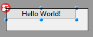

O editor de formulários 4D suporta macros. Uma macro é um conjunto de instruções para executar uma ação ou uma sequência de ações. Quando chamada, a macro executará suas instruções e realizará automaticamente a(s) ação(ões).

Por exemplo, se você tiver um relatório recorrente com formatação específica (por exemplo, determinado texto deve aparecer em vermelho e determinado texto deve aparecer em verde), poderá criar uma macro para definir automaticamente a cor. É possível criar macros para o editor de 4D Form que podem:

- Criar e executar código 4D
- Exibir diálogos
- Seleccionar objectos do formulário
- Adicionar / excluir / modificar formulários, objetos de formulário e suas propriedades
- Modificar ficheiros de projeto (atualizar, apagar)

O código de macros suporta [funções de classe] (Concepts/classes.md) e [propriedades de objeto de formulário em JSON] (FormObjects/properties_Reference.md) para permitir que você defina qualquer recurso personalizado no editor de formulários.

As macros podem ser definidas para o projeto host ou para componentes do projeto. Normalmente, você vai criar uma macro e instalá-la nos componentes que você usa para o desenvolvimento.

Quando chamada, uma macro substitui qualquer comportamento especificado anteriormente.

## Exemplo prático

Neste pequeno exemplo, você verá como criar e chamar uma macro que adiciona um botão de alerta "Hello World!" no canto superior esquerdo do seu formulário.

1. Em um arquivo `formMacros.json` na pasta `Sources` do seu projeto, você escreve:

```js
{
   "macros": {
      "Add Hello World button": {
       "class": "AddButton"
     }
   }
}
```

2. Crie uma classe 4D chamada `AddButton`.

3. Na classe `AddButton`, escreva a seguinte função:

```4d
Function onInvoke($editor : Object)->$result : Object
	
	var $btnHello : Object
	
	// Criar um botão "Hello"
	$btnHello:=New object("type"; "button"; \
	"text"; "Hello World!"; \
	"method"; New object("source"; "ALERT(\"Hello World!\")"); \
	"events"; New collection("onClick"); \
	"width"; 120; \
	"height"; 20; \
	"top"; 0; \
	"left"; 0)	
	
	// Adicionar botão na página atual
	$editor.editor.currentPage.objects.btnHello:=$btnHello	
	
	// Selecionar o novo botão no editor de formulários
	$editor.editor.currentSelection.clear() //desmarcar elementos
	$editor.editor.currentSelection.push("btnHello")	
	
	// Notificar a modificação no editor de formulários 4D
	$result:=New object("currentSelection"; $editor.editor.currentSelection;\  
		"currentPage"; $editor.editor.currentPage)
```

Em seguida, você pode chamar a macro:



## Chamar macros no editor de formulários

Quando as macros são definidas no seu projeto 4D, você pode chamar uma macro usando o menu contextual do editor de formulário:


Esse menu é construído com base no `formMacros.json` [arquivo(s) de definição de macro] (#localização-de-macros). Os itens de macro estão ordenados por ordem alfabética.

Este menu pode ser chamado numa área vazia ou numa seleção no formulário. O objeto selecionado é passado para `$editor.currentSelection` ou `$editor.target` na função [`onInvoke`](#oninvoke) do macro.

Uma única macro pode executar várias operações. Se selecionado, o recurso **Desfazer** do editor de Formulário pode ser usado para reverter as operações macro globalmente.

## Localização do ficheiro macro

Todas as macros do 4D Form Editor são definidas em um único arquivo JSON por projeto ou componente: `FormMacros.json`.

Esse arquivo deve estar localizado na pasta **Project** > **Sources** do host ou do componente:


## Declaração de macros

A estrutura do arquivo `formMacros.json` é a seguinte:

```js
{
    "macros": {
            <macroName>: {
                "class": <className>,
                <customProperty> : <value>
        }
    }
}
```

Eis a descrição do conteúdo do ficheiro JSON:

| Atributo |               |                    | Tipo   | Descrição                                                               |
| -------- | ------------- | ------------------ | ------ | ----------------------------------------------------------------------- |
| macros   |               |                    | object | lista de macros definidas                                               |
|          | `<macroName>` |                    | object | definição macro                                                         |
|          |               | "class"            | string | nome da classe macro                                                    |
|          |               | `<customProperty>` | any    | (opcional) valor personalizado a obter no construtor |

As propriedades personalizadas, quando usadas, são passadas para a função [constructor](#class-constructor) da macro.

### Exemplo

```js
{
   "macros": {
     "Open Macros file": {
       "class": "OpenMacro"
     },
     "Align to Right on Target Object": {
       "class": "AlignOnTarget",
       "myParam": "right"
     },
     "Align to Left on Target Object": {
       "class": "AlignOnTarget",
       "myParam": "left"
     }
   }
}
```

## Instanciando macros em 4D

Cada macro que você deseja instanciar em seu projeto ou componente deve ser declarada como uma [classe 4D] (Concepts/classes.md).

O nome da classe deve corresponder ao nome definido usando o atributo [class](#creating-macros) do arquivo `formMacros.json`.

As macros são instanciadas no arranque da aplicação. Consequentemente, se você modificar a estrutura da classe de macro (adicionar uma função, modificar um parâmetro...) ou o [constructor](#class-constructor), você terá que reiniciar o aplicativo para aplicar as alterações.

## Funções macro

Toda classe de macro pode conter um construtor `Class` e duas funções: `onInvoke()` e `onError()`.

### Class constructor

#### Class constructor($macro : Object)

| Parâmetro | Tipo   | Descrição                                                                    |
| --------- | ------ | ---------------------------------------------------------------------------- |
| $macro    | Object | Objeto declaração de macro (no arquivo `formMacros.json`) |

As macros são instanciadas usando uma função [construtor de classe] (Concepts/classes.md#class-constructor), se ela existir.

O class constructor é chamado uma vez durante a instanciação das classes, que ocorre na inicialização da aplicação.

As propriedades personalizadas adicionadas à [declaração de macro] (#declaring-macros) são retornadas no parâmetro da função do construtor da classe.

#### Exemplo

No arquivo `formMacros.json`:

```js
{
   "macros": {
     "Align to Left on Target Object": {
       "class": "AlignOnTarget",
       "myParam": "left"
     }
   }
}
```

Você pode escrever:

```4d
// Class "AlignOnTarget" Class constructor($macro : Object)
    This.myParameter:=$macro.myParam //left
    ...
```

### onInvoke()

#### onInvoke($editor : Object) -> $result : Object

| Parâmetro | Tipo   | Descrição                                                                                                       |
| --------- | ------ | --------------------------------------------------------------------------------------------------------------- |
| $editor   | Object | Objeto Form Editor Macro Proxy que contém as propriedades do formulário                                         |
| $result   | Object | Objeto Form Editor Macro Proxy que devolve as propriedades modificadas pela macro (opcional) |

A função `onInvoke` é executada automaticamente sempre que a macro for chamada.

Quando a função for chamada, ela recebe na propriedade `$editor.editor` uma cópia de todos os elementos do formulário com seus valores atuais. Pode então executar qualquer operação sobre estas propriedades.

Depois que as operações forem concluídas, se a macro resultar na modificação, adição ou remoção de objetos, você poderá passar as propriedades editadas resultantes em `$result`. O processador macro analisará as propriedades retornadas e aplicará as operações necessárias no formulário. Obviamente, quanto menos propriedades você retornar, menos tempo o processamento exigirá.

Aqui estão as propriedades retornadas no parâmetro _$editor_:

| Propriedade                                                      | Tipo       | Descrição                                                                              |
| ---------------------------------------------------------------- | ---------- | -------------------------------------------------------------------------------------- |
| $editor.editor.form              | Object     | O formulário completo                                                                  |
| $editor.editor.file              | File       | Objeto File do ficheiro do formulário                                                  |
| $editor.editor.name              | Text       | Nome do formulário                                                                     |
| $editor.editor.table             | number     | Número da tabela do formulário, 0 para formulário projecto                             |
| $editor.editor.currentPageNumber | number     | O número da página actual                                                              |
| $editor.editor.currentPage       | Object     | A página atual, contendo todos os objetos de formulário e a ordem de entrada da página |
| $editor.editor.currentSelection  | Collection | Colecção de nomes de objectos seleccionados                                            |
| $editor.editor.formProperties    | Object     | Propriedades do formulário atual                                                       |
| $editor.editor.target            | string     | Nome do objeto sob o rato quando clicado numa macro                                    |

Aqui estão as propriedades que você pode passar no objeto `$result` se quiser que o processador de macro execute uma modificação. Todas as propriedades são opcionais:

| Propriedade                       | Tipo       | Descrição                                                              |
| --------------------------------- | ---------- | ---------------------------------------------------------------------- |
| currentPage                       | Object     | currentPage incluindo os objectos modificados pela macro, se existirem |
| currentSelection                  | Collection | currentSelection se modificada pela macro                              |
| formProperties                    | Object     | formProperties se modificada pela macro                                |
| editor.groups     | Object     | informação do grupo, se os grupos forem modificados pela macro         |
| editor.views      | Object     | view info, se as vistas forem modificadas pela macro                   |
| editor.activeView | Text       | Nome da vista activa                                                   |

Por exemplo, se objectos da página actual e grupos tiverem sido modificados, pode escrever:

```4d
	$result:=New object("currentPage"; $editor.editor.currentPage ; \ 
			"editor"; New object("groups"; $editor.editor.form.editor.groups))

```

#### atributo `method`

Ao lidar com o atributo 'método' de objetos de formulário, você pode definir o valor do atributo de duas maneiras nas macros:

- Usando uma [string contendo o nome/caminho do arquivo do método] (FormObjects/properties_Action.md#method).

- Utilizar um objeto com a seguinte estrutura:

| Propriedade | Tipo | Descrição        |
| ----------- | ---- | ---------------- |
| source      | Text | Código do método |

O 4D criará um arquivo usando o nome do objeto na pasta "objectMethods" com o conteúdo do atributo `source`. Esta funcionalidade só está disponível para o código macro.

#### Propiedad `$4dId` en `currentPage.objects`

A propriedade `$4dId` define um ID exclusivo para cada objeto na página atual. Essa chave é usada pelo processador de macro para controlar as alterações em `$result.currentPage`:

- Se a chave `$4dId` estiver ausente no formulário e em um objeto em `$result`, o objeto será criado.
- Se a chave `$4dId` existir no formulário, mas estiver ausente em `$result`, o objeto será excluído.
- Se a chave `$4dId` existir tanto no formulário quanto em um objeto em `$result`, o objeto será modificado.

#### Exemplo

You want to define a macro function that will apply the red color and italic font style to any selected object(s).

```4d
Função onInvoke($editor : Objeto)->$result : Objeto
	├var $name : Texto
	
	(ESIf ($editor.editor.currentSeletion. ength>0)&		
		├// Ajuste um golpe em vermelho e estilo em itálico para cada objeto selecionado
		├Para cada ($name; $editor. ditor.currentSeletion)
			├			$editor.editor.currentPage.objects[$name]. troke:="red"
			├			$editor.editor.currentPage.objects[$name].fontStyle:="italic"

		「End para cada 
		➲		
	ct, Else 
		├ALERT("Por favor, selecione um objeto de formulário. )
	schar@@0o final se 
	
	char@@1 Notificar para 4D a modificação
	$result:=Novo objeto("currentPage"; $editor.editor.currentPage)
```

### onError()

#### onError($editor : Object; $resultMacro : Object ; $error : Collection)

| Parâmetro    |                                                                                           | Tipo       | Descrição                                  |
| ------------ | ----------------------------------------------------------------------------------------- | ---------- | ------------------------------------------ |
| $editor      |                                                                                           | Object     | Objeto enviado a [onInvoke](#oninvoke)     |
| $resultMacro |                                                                                           | Object     | Objeto retornado por [onInvoke](#oninvoke) |
| $error       |                                                                                           | Collection | Pilha de erros                             |
|              | [].errCode            | Number     | Código de erro                             |
|              | [].message            | Text       | Descrição do erro                          |
|              | [].componentSignature | Text       | Assinatura da componente interna           |

A função `onError` é executada quando o processador de macros encontra um erro.

When executing a macro, if 4D encounters an error which prevents the macro from being cancelled, it does not execute the macro. É o caso, por exemplo, se a execução de uma macro resultar em:

- eliminar ou modificar um script cujo ficheiro é só de leitura.
- criar dois objectos com o mesmo ID interno.

#### Exemplo

Em uma definição de classe macro, você pode escrever o seguinte código de erro genérico:

```4d
Function onError($editor : Object; $resultMacro : Object; $error : Collection)
	var $obj : Object
	var $txt : Text
	$txt:=""
	
	For each ($obj; $error)
		$txt:=$txt+$obj.message+" \n"
	End for each 
	
	ALERT($txt)
```
