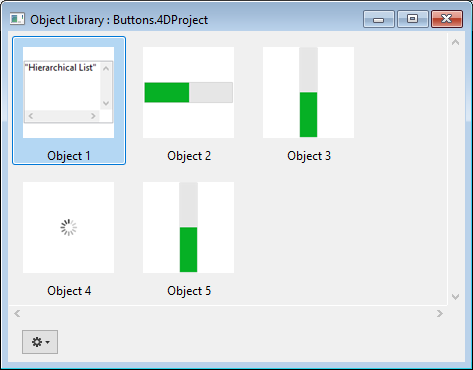

Pode utilizar bibliotecas de objectos nos seus formulários. An object library offers a collection of preconfigured objects that can be used in your forms by simple or copy-paste or drag-and-drop.

4D propõe dois tipos de bibliotecas de objetos:

- uma biblioteca de objetos padrão, pré-configurada, disponível em todos os seus projetos.
- custom object librairies, that you can use to store your favorite form objects or full project forms.

## Criar e utilizar bibliotecas de objetos personalizadas

The standard object library is available from the Form editor: click on the last button of the toolbar:\

A biblioteca é apresentada numa janela separada:

A janela tem as seguintes características principais:

- Preview area with tips: The central area displays a preview of each object. You can hover on an object to obtain information about the object in a tip.
- You can filter the window contents by using the **Categories** menu:
  
- Para utilizar um objeto da biblioteca no seu formulário, pode:
  - right-click on an object and select **Copy** in the contextual menu
  - or drag and drop the object from the library The object is then added to the form.

Esta biblioteca é só de leitura. If you want to edit default objects or create your own library of preconfigured objects or project forms, you need to create a custom object library (see below).

All objects proposed in the standard object library are described on [this section on doc.4d.com](https://doc.4d.com/4Dv17R6/4D/17-R6/Library-objects.200-4354586.en.html).

## Utilização da biblioteca de objetos padrão

Pode criar e usar bibliotecas de objetos personalizados em 4D. A custom object library is a 4D project where you can store your favorite objects (buttons, texts, pictures, etc.) You can then reuse these objects in different forms and different projects. You can then reuse these objects in different forms and different projects.

Os objetos são armazenados com todas as suas propriedades, incluindo seus métodos objeto. Libraries are put together and used by simple drag-and-drop or copy-paste operations.

Using libraries, you can build form object backgrounds grouped by graphic families, by behavior, etc.

### Criar uma biblioteca de objetos

To create an object library, select **New>Object Library...** from the 4D **File** menu or tool bar. A standard save file dialog box appears, which allows you to choose the name and the location of the object library.

Once you validate the dialog box, 4D creates a new object library on your disk and displays its window (empty by default).

É possível criar tantas bibliotecas quantas as desejadas por projeto. A library created and built under macOS can be used under Windows and vice-versa.

### Abrir uma biblioteca de objetos

Uma determinada biblioteca de objetos só pode ser aberta por um m banco de dados por vez. Entretanto, várias livrarias diferentes podem ser abertas no mesmo banco de dados.

To open a custom object library, select **Open>Object Library...** command in the 4D **File** menu or tool bar. Aparece uma caixa de diálogo padrão de ficheiro aberto, que lhe permite seleccionar a biblioteca de objectos a abrir. Pode seleccionar os seguintes tipos de ficheiros:

- **.4dproject**
- **.4dz**

Na realidade, as bibliotecas de objectos personalizados são projectos 4D clássicos. Apenas as seguintes partes de um projecto são expostas quando este é aberto como biblioteca:

- formulários projecto
- páginas formulário 1

### Construir uma biblioteca de objectos

Os objectos são colocados numa biblioteca de objectos usando o método de arrastar e largar ou uma operação de cortar-copiar-colar. They can come from either a form or another object library (including the [standard library](#using-the-standard-object-library)). No link is kept with the original object: if the original is modified, the copied object is not affected.

> In order to be able to drag and drop objects from forms to object libraries, you must make sure the **Start drag and drop** option in the 4D Preferences is selected.

As operações básicas estão disponíveis no menu de contexto ou no menu de opções da janela:

- **Cut** or **Copy** to the pasteboard
- **Paste** an object from the pasteboard
- **Clear** - deletes the object from the library
- **Rename** - a dialog box appears allowing you to rename the item. Note-se que os nomes dos objectos devem ser únicos numa biblioteca.

Pode colocar objectos individuais (incluindo subformulários) ou conjuntos de objectos numa biblioteca de objectos. Cada objecto ou conjunto é agrupado num único item:

Uma biblioteca de objectos pode conter até 32.000 elementos.

Os objectos são copiados com todas as suas propriedades, tanto gráficas como funcionais, incluindo os seus métodos. Estas propriedades são mantidas na íntegra quando o elemento é copiado para um formulário ou outra biblioteca.

#### Objetos dependentes

A utilização de copiar-colar ou arrastar-e-soltar com determinados objetos de biblioteca também faz com que os seus objetos dependentes sejam copiados. Por exemplo, copiar um botão fará com que o método objeto que pode estar anexado também seja copiado. Estes objetos dependentes não podem ser copiados ou arrastados e largados diretamente.

Segue-se uma lista de objetos dependentes que serão colados na biblioteca enquanto o objeto principal que os utiliza (quando aplicável):

- Listas
- Formatos/Filtros
- Imagens
- Dicas de ajuda (ligadas a um campo)
- Métodos objecto
