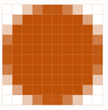
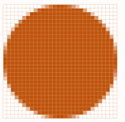

4D inclui suporte específico para imagens utilizadas nos seus formulários.

## Formatos Nativos Compatíveis

4D integra a gestão nativa dos formatos de imagem. Isso significa que imagens serão mostradas e armazenadas em seu formato original, sem qualquer interpretação em 4D. As funcionalidades específicas dos diferentes formatos (sombreado, áreas transparentes, etc.) serão mantidos quando forem copiados e colados, e serão exibidos sem alterações. Esse suporte nativo é válido para todas as imagens armazenadas em formulários 4D: [imagens estáticas](FormObjects/staticPicture.md) coladas no modo Desenho, imagens coladas em [objetos de entrada](FormObjects/input_overview.md) em execução, etc.

Os formatos de imagem mais comuns são compatíveis com ambas as plataformas: .jpeg, .gif, .png, .tiff, .bmp, etc. Em macOS, o formato pdf também está disponível para codificar e decodificar.

> A lista completa dos formatos suportados varia de acordo com o sistema operativo e os codecs personalizados que são instalados nas máquinas. Para descobrir quais codecs estão disponíveis, você deve usar o comando `PICTURE CODEC LIST` (veja também a descrição de [tipo de dados imagem](Concepts/dt_picture.md)).

### Formato de imagem não disponível

Um ícone específico é exibido para imagens salvas em um formato que não esteja disponível no mecanismo. A extensão do formato faltante é mostrado na parte inferior do ícone:

O ícone é usado automaticamente onde a imagem precisar ser exibida:

O ícone indica que a imagem não pode ser exibida ou manipulada localmente - mas pode ser salva sem alteração para que possa ser exibida em outros dispositivos. Por exemplo esse é o caso para imagens PDF em Windows ou para imagens no formato PICT.

## Imagens em alta resolução

4D admite imagens de alta resolução tanto em plataformas MacOS como Windows. As imagens de alta resolução podem ser definidas quer por factor de escala quer por dpi.

### Factor de escala

As telas de alta resolução têm uma densidade de pixels maior do que as telas padrão tradicionais. Para que as imagens sejam renderizadas corretamente em ecrãs de alta resolução, o número de píxeis na imagem deve ser multiplicado pelo _fator de escala_ (_ou seja_, duas vezes maior, três vezes maior, etc.).

Ao utilizar imagens de alta resolução, pode especificar o fator de escala adicionando "@nx" no nome da imagem (onde _n_ designa o fator de escala). En la tabla siguiente, puede ver que el factor de escala se indica en los nombres de las imágenes de alta resolución, _circle@2x.png_ y _circle@3x.png_.

| Tipo de exibição     | Fator de Escala                                                         | Exemplo                                                                                                                                                                                         |
| -------------------- | ----------------------------------------------------------------------- | ----------------------------------------------------------------------------------------------------------------------------------------------------------------------------------------------- |
| Resolução ‘standard’ | Densidade de pixel 1:1.                 | **1x**  _circle.png_                                                                                                          |
| Alta resolução       | A densidade de pixels aumentou por um factor de 2 ou 3. | <table><th>2x</th><th>3x</th><tr><td>*circle@2x.png*</td><td> *circle@3x.png*</td></tr></table> |

As imagens de alta resolução com a convenção @nx podem ser utilizadas nos seguintes objectos:

- [Imagens estáticas](FormObjects/staticPicture.md)
- [Botones](FormObjects/button_overview.md)/[radio](FormObjects/radio_overview.md)/[casillas de selección](FormObjects/checkbox_overview.md)
- [Botones imagen](FormObjects/pictureButton_overview.md)/[imagen Pop-up](FormObjects/picturePopupMenu_overview.md)
- [Controles de tabulação](FormObjects/tabControl.md)
- [Cabeçalhos List box](FormObjects/listbox_overview.md#list-box-headers)
- [Ícones de menu](Menus/properties.md#item-icon)

4D dá automaticamente prioridade às imagens com a resolução mais alta. Por exemplo, ao usar duas telas (uma de alta resolução e outra padrão) e mover um formulário de uma tela para outra, 4D renderiza automaticamente a resolução mais alta possível da imagem. Mesmo que um comando ou propriedade especifique _circle.png_, _circle@3x.png_ será usado (se existir).

> Note que a priorização da resolução ocorre apenas para a apresentação de imagens no ecrã, não havendo priorização automática durante a impressão.

### DPI (macOS and Windows)

Embora 4D priorize automaticamente a resolução mais alta, há, no entanto, algumas diferenças de comportamento dependendo da tela e da imagem dpi\*(\*)\*, e do formato da imagem:

| Operação                                                                                                                                                                        | Comportamento                                                                                                                                                                                                                                                                                                                                                                                                                                                                                                                                                                                                                                       |
| ------------------------------------------------------------------------------------------------------------------------------------------------------------------------------- | --------------------------------------------------------------------------------------------------------------------------------------------------------------------------------------------------------------------------------------------------------------------------------------------------------------------------------------------------------------------------------------------------------------------------------------------------------------------------------------------------------------------------------------------------------------------------------------------------------------------------------------------------- |
| Soltar o pegar                                                                                                                                                                  | Se a imagem tem:<ul><li>**72dpi ou 96dpi** - A imagem é "[Center](FormObjects/properties_Picture.md#center--trunca-não-centralizado)" formatado e o objeto que contém a imagem tem o mesmo número de pixels.</li><li>**Outros dpi** - A imagem é "[Dimensionada para fit](FormObjects/properties_Picture.md#scaled-to-fit)" formatado e o objeto que contém a imagem é igual (número de pixels \* tela dpi) / (imagem dpi)</li> <li>**Sem dpi** - A imagem é "[Escalonado para caber](FormObjects/properties_Picture.md#escaled-to-fit)" formatado.</li></ul> |
| [Tamanho automático](https://doc.4d.com/4Dv19/4D/19/Setting-object-display-properties.300-5416671.en.html#148057) (Menu de contexto do Editor de Formulário) | Se o formato de exibição da imagem for:<ul><li>**[Scaled](FormObjects/properties_Picture.md#scaled-to-fit)** - O objeto que contém a imagem é redimensionado de acordo com (número de pixels da imagem \* dpi da tela) / (dpi da imagem) </li> <li>**Não dimensionado** - O objeto que contém a imagem tem o mesmo número de pixels que a imagem.</li></ul>                                                                                                                                                                                                                   |

_(\*) Normalmente, macOS = 72 dpi, Windows = 96 dpi_

## Imagens em modo escuro (apenas macOS)

Você pode definir imagens e ícones específicos a serem usados em vez de imagens padrão quando [os formulários usam o esquema escuro] (properties_FormProperties.md#color-scheme).

Uma imagem em modo escuro é definida da seguinte forma:

- A imagem do modo escuro tem o mesmo nome da versão padrão (esquema de luz) com o sufixo "`_dark`"
- a imagem do modo escuro é guardada ao lado da versão padrão.

Em tempo de execução, 4D carregará automaticamente a imagem clara ou escura de acordo com o [esquema de cores do formulário atual] (https://doc.4d.com/4dv19/help/command/en/1761.html).

## Coordenadas do mouse numa imagem

4D permite recuperar as coordenadas locais do mouse em um [objeto de entrada](FormObjects/input_overview.md) associado a uma [expressão de imagem](FormObjects/properties_Object.md#expression-type), em caso de um clique ou um mouse, mesmo que um rolagem ou zoom tenha sido aplicado à imagem. Esse mecanismo, similar ao de um mapa de imagens, pode ser utilizado, por exemplo, para manejar barras de botões deslocáveis ou a interface de um software de cartografia.

The coordinates are returned in the _MouseX_ and _MouseY_ [System Variables](../Concepts/variables.md#system-variables). As coordenadas são expressas em píxeis em relação ao canto superior esquerdo da imagem (0,0). Se o mouse estiver fora do sistema de coordenadas da imagem, se devolverá -1 em MouseX e MouseY\*.

Você pode obter o valor dessas variáveis como parte do eventos de formulário [`On Clicked`](Events/onClicked.md), [`On Double Clicked`](Events/onDoubleClicked. d), [`No Mouse up`](Events/onMouseUp.md), [`On Mouse Enter`](Events/onMouseEnter.md), ou [`On Mouse Move`](Events/onMouseMove.md).
