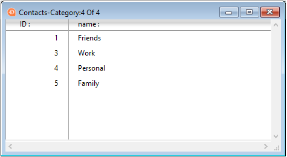

---

## Esquema de cores

> A propriedade Esquema de cores só é aplicada no macOS.

Esta propriedade define o esquema de cores para o formulário. By default when the property is not set, the value for a color scheme is **inherited** (the form uses the scheme defined at the [application level](../commands-legacy/set-application-color-scheme.md)). Isto pode ser alterado para o formulário para uma das duas opções seguintes:

- dark - texto claro sobre um fundo escuro
- light - texto escuro sobre um fundo claro

> \> A defined color scheme can not be overridden by a CSS.

#### Gramática JSON

| Nome        | Tipo de dados | Valores possíveis |
| ----------- | ------------- | ----------------- |
| colorScheme | string        | "dark", "light"   |

---

## CSS

Esta propriedade permite-lhe carregar ficheiros CSS específicos para o formulário.

Um ficheiro CSS definido ao nível do formulário substituirá a(s) folha(s) de estilo predefinida(s). Para obter mais informações, consulte a página [Folhas de estilo] (createStylesheet.md).

#### Gramática JSON

| Nome | Tipo de dados      | Valores possíveis                                                                                                                                                                                                                                                                                                                                                                            |
| ---- | ------------------ | -------------------------------------------------------------------------------------------------------------------------------------------------------------------------------------------------------------------------------------------------------------------------------------------------------------------------------------------------------------------------------------------- |
| css  | cadeia ou colecção | Caminho(s) do arquivo CSS fornecido(s) como<li>:uma string (um arquivo para ambas as plataformas)</li><li>uma coleção de strings (uma lista de arquivos para ambas as plataformas)</li><li>uma coleção de objetos {"path":string; "media": "mac" \| "win"} </li> |

---

## Form Class

Name of an existing [user class](../Concepts/classes.md#class-definition) to associate to the form . The user class can belong to the host project or to a [component](../Extensions/develop-components.md#sharing-of-classes), in which case the formal syntax is "[_componentNameSpace_](../settings/general.md#component-namespace-in-the-class-store).className".

Associating a class to the form provides the following benefits:

- When you work in the [Form editor](../FormEditor/formEditor.md), the associated class is used for accurate syntax checking of expressions such as `Form.myProperty` in all areas of the [Property list](../FormEditor/formEditor.md#property-list) that support [expressions](../Concepts/quick-tour.md#expressions) (e.g. **Variable or Expression**, **Font color expression**...). Errors are displayed in red and warnings are displayed in yellow in the left column of the Property list and you can hover it to get explanations:

- The detection of errors in the code of form object expressions by the [compiler](../Project/compiler.md) is improved.

- You can also to benefit from [autocompletion features](../code-editor/write-class-method.md#autocomplete-functions) in the code editor.

- When the form is executed, 4D automatically instantiates a user class object for the form, which is returned by the [`Form`](../commands/form.md) object. Your code can directly access class functions defined in the user class through the `Form` command (e.g. `Form.message()`) without having to pass a _formData_ object as parameter to the [`DIALOG`](../commands/dialog.md), [`Print form`](../commands/print-form.md), or [`FORM LOAD`](../commands/form-load.md) commands.

:::note

See [this blog post](http://blog.4d.com/empower-your-development-process-with-your-forms) for an illustration of this feature.

:::

#### Gramática JSON

| Nome      | Tipo de dados | Valores possíveis                                                                                                       |
| --------- | ------------- | ----------------------------------------------------------------------------------------------------------------------- |
| formClass | string        | name of an existing user class ("_className_" or "_componentNameSpace_._className_") |

---

## Nome do formulário

This property is the name of the form itself and is used to refer to the form by name using the 4D language. O nome do formulário deve estar em conformidade com as [regras especificadas para identificadores] (Concepts/identifiers.md) em 4D.

#### Gramática JSON

The form name is defined by the name of the folder that contains the form.4Dform file. Consulte [arquitetura do projeto](Project/architecture.md#sources-folder) para obter mais informações.

---

## Tipo de formulário

O tipo de formulário, _ou seja_, seu destino, define as características que estarão disponíveis para o formulário. Por exemplo, [markers](properties_Markers.md) só pode ser definido para formulários de tabela de lista (saída).

Cada tabela de um banco de dados tem geralmente pelo menos duas formas de tabela. Uma para listar os registos no ecrã e a outra para visualizar um registo de cada vez (utilizada para a introdução de dados e modificações):

- Formulário de saída - o _formulário de saída_ ou _formulário de lista_ exibe uma lista de registros, com uma única linha por registro. Os resultados das consultas são apresentados num formulário de saída e os usuários podem fazer duplo clique numa linha para visualizar o formulário de entrada para esse registo.
  

- Formulário de entrada - utilizado para entrada de dados. Exibe um único registro por tela e, normalmente, tem botões para salvar e cancelar modificações no registro e para navegar de registro em registro (\*primeiro registro, último registro, registro anterior, próximo registro).
  

Os tipos suportados dependem da categoria do formulário:

| Tipo de formulário                  | Gramática JSON   | Descrição                                                            | Suportado por                            |
| ----------------------------------- | ---------------- | -------------------------------------------------------------------- | ---------------------------------------- |
| Formulário detalhado                | detailScreen     | Um formulário de visualização para introdução e modificação de dados | Formulários projeto - Formulários tabela |
| Formulário detalhado para impressão | detailPrinter    | Um relatório impresso com uma página por registo, como uma fatura    | Formulários projeto - Formulários tabela |
| Formulário lista                    | listScreen       | Um formulário para listar os registos no ecrã                        | Formularios tabla                        |
| Formulário de lista para impressão  | listPrinter      | Um relatório impresso que lista os registos                          | Formularios tabla                        |
| Nenhum                              | _no destination_ | Um formulário sem caraterística específica                           | Formulários projeto - Formulários tabela |

#### Gramática JSON

| Nome        | Tipo de dados | Valores possíveis                                            |
| ----------- | ------------- | ------------------------------------------------------------ |
| destination | string        | "detailScreen", "listScreen", "detailPrinter", "listPrinter" |

---

## Nome do formulário herdado

Essa propriedade designa o [formulário a ser herdado] (forms.md#inherited-forms) no formulário atual.

Para herdar de um formulário de tabela, defina a tabela na propriedade [Inherited Form Table] (#inherited-form-table).

Para remover a herança, selecione `\<None>` na Property List (ou " " em JSON).

#### Gramática JSON

| Nome          | Tipo de dados | Valores possíveis                                                                                                                  |
| ------------- | ------------- | ---------------------------------------------------------------------------------------------------------------------------------- |
| inheritedForm | string        | Name of table or project form OR a POSIX path to a .json file describing the form OR an object describing the form |

---

## Tabelas de formulário herdadas

Essa propriedade especifica a tabela do banco de dados da qual [herdar um formulário] (forms.md#inherited-forms) no formulário atual.

Defina como `\<None>` na Property List (ou " " em JSON) para herdar de um formulário de projeto.

#### Gramática JSON

| Nome               | Tipo de dados    | Valores possíveis        |
| ------------------ | ---------------- | ------------------------ |
| inheritedFormTable | string ou number | nome ou número da tabela |

---

## Pages

Cada formulário é composto por, pelo menos, duas páginas:

- uma página 0 (página de fundo)
- uma página 1 (página principal)

Para obter mais informações, consulte [Páginas de formulário] (forms.md#form-pages).

#### Gramática JSON

| Nome  | Tipo de dados | Valores possíveis                                                                                 |
| ----- | ------------- | ------------------------------------------------------------------------------------------------- |
| pages | collection    | Coleção de páginas (cada página é um objeto, a página 0 é o primeiro elemento) |

---

## Publicado como subformulário

Para que um formulário de componente seja selecionado como um [subformulário] (FormObjects/subform_overview.md) em um aplicativo host, ele deve ter sido explicitamente compartilhado. When this property is selected, the form will be published in the host application.

Apenas os projetos formulário podem ser especificados como subformulários publicados.

#### Gramática JSON

| Nome   | Tipo de dados | Valores possíveis |
| ------ | ------------- | ----------------- |
| shared | boolean       | true, false       |

---

## Guardar geometria

Quando a opção é usada, se a janela for aberta usando o comando "Abrir janela de formulário" com o parâmetro "\*", vários parâmetros de formulário são salvos automaticamente pelo 4D quando a janela é fechada, independentemente de como foram modificados durante a sessão:

- a página atual,
- a posição, tamanho e visibilidade de cada objecto de formulário (incluindo o tamanho e visibilidade das colunas da lista box).

> Esta opção não leva em conta objetos gerados usando o comando `OBJECT DUPLICATE`. In order for a user to recover their environment when using this command, the developer must repeat the sequence of creation, definition and positioning of the objects.

Quando essa opção é selecionada, a opção [Save Value] (FormObjects/properties_Object.md#save-value) fica disponível para determinados objetos.

#### Gramática JSON

| Nome             | Tipo de dados | Valores possíveis |
| ---------------- | ------------- | ----------------- |
| memorizeGeometry | boolean       | true, false       |

#### Veja também

[**Salvar valor**](FormObjects/properties_Object.md#save-value)

---

## Título da janela

O título da janela é usado quando o formulário é aberto usando os comandos `Abrir janela do formulário` e `Abrir janela` 4D no ambiente de aplicativos. O título da janela aparece na barra de título da janela.

Você pode usar referências dinâmicas para definir os títulos das janelas dos formulários, ou seja, \*:

- Uma referência XLIFF padrão armazenada na pasta Resources.
- Um rótulo de tabela ou campo: A sintaxe a ser aplicada é `<?[TableNum]FieldNum>` ou `<?[TableName]FieldName>`.
- Uma variável ou um campo: A sintaxe a ser aplicada é `\<VariableName>` ou `<[TableName]FieldName>`. The current value of the field or variable will be displayed in the window title.

> O número de caracteres para um título de janela é limitado a 31.

#### Gramática JSON

| Nome        | Tipo de dados | Valores possíveis                                      |
| ----------- | ------------- | ------------------------------------------------------ |
| windowTitle | string        | O nome da janela como texto simples ou como referência |
