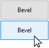
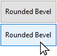

Um botão é um objeto ativo ao qual pode ser atribuída uma ação (_por exemplo_, uma tarefa de banco de dados ou uma função de interface) a executar quando um usuário clica nele.


Buttons can fulfill a variety of roles, depending on their style and the action assigned to it. For example, buttons could lead a user through a questionnaire or form to complete, or to make choices. Depending on its settings, a button may be designed to be clicked only once and execute a command, while others may require the user to click more than once to receive the desired result.

## Manipulação de botões

As ações atribuídas aos botões podem se originar de [ações padrão](properties_Action.md#standard-action) predefinidas ou de métodos objeto personalizados. Examples of typical actions include letting the user accept, cancel, or delete records, copy or paste data, move from page to page in a multi-page form, open, delete, or add records in a subform, handle font attributes in text areas, etc.

Buttons with standard actions are dimmed when appropriate during form execution. Por exemplo, se o primeiro registro de uma tabela for exibido, um botão com a ação padrão `firstRecord` aparecerá esmaecido.

If you want a button to perform an action that's not available as a standard action, leave the standard action field empty and write an object method to specify the button’s action. Para obter mais informações sobre métodos objeto e como criá-los e associá-los, consulte [Usando métodos objeto](https://doc.4d.com/4Dv17R5/4D/17-R5/Using-object-methods.300-4163733.en.html).
Normalmente, você ativaria o evento `On Clicked` e o método seria executado somente quando o botão fosse clicado. Pode associar um método a qualquer botão.

La [variable](properties_Object.md#variable-or-expression) asociada a un botón se define automáticamente a **0** cuando el formulario se ejecuta por primera vez en modo Diseño o Aplicación. Cuando el usuario hace clic en un botón, su variable se define como **1**.

> A um botão pode ser atribuída uma ação padrão e um método. In this case, if the button is not disabled by the standard action, the method is executed before the standard action.

## Estilos de botões

Os estilos dos botões controlam a aparência geral de um botão, bem como as suas propriedades disponíveis. É possível aplicar diferentes estilos pré-definidos a botões ou associar-lhes menus pop-up. Um grande número de variações podem ser obtidas combinando essas propriedades/comportamentos.

Com exceção das [propriedades disponíveis](#supported-properties), muitos objetos de botão são _estruturalmente_ idênticos. A diferença é no processamento das variáveis associadas.

4D fornece botões nos seguintes estilos pré-definidos:

### Clássico

O estilo de botão Clássico é um botão padrão do sistema (ou seja, um retângulo com um rótulo descritivo) que executa o código quando o usuário clica nele.


By default, the Regular style has a light gray background with a label in the center. When the cursor hovers over the Regular button style, the border and background color change to demonstrate that it has the focus. In addition to initiating code execution, the Regular button style mimics a mechanical button by quickly changing background color when being clicked.

#### JSON Exemplo

```4d

	"myButton": {
		"type": "button", //defina o tipo de objeto
		"style": "regular", //defina o estilo do botão
		"defaultButton": "true" //defina o botão como a opção padrão
		"text": "OK", //texto a ser exibido no botão
		"action": "Cancel", //ação a ser executada 
		"left": 60, //posição esquerda no formulário  
		"top": 160, //posição superior no formulário 
	  	"width": 100, //largura do botão
		"height": 20 //altura do botão
}
```

Somente os estilos Clássico e Plano oferecem a propriedade [Botão padrão](properties_Appearance.md#default-button).

### Plano

O estilo de botão Plano é um botão padrão do sistema (ou seja, um retângulo com um rótulo descritivo) que executa o código quando o usuário clica nele.


By default, the Flat style has a white background with a label in the center, rounded corners, and a minimalist appearance. The Flat button style's graphic nature is particularly useful for forms that will be printed.

#### JSON Exemplo

```4d

	"myButton": {
                "type": "button",	
                "style":"flat",	
                "defaultButton":"true"	
                "text": "OK",	
                "action": "Cancel", 
                "left": 60,			
                "top": 160,			
                "width": 100,	
                "height": 20	
                }
```

Somente os estilos Clássico e Plano oferecem a propriedade [Botão padrão](properties_Appearance.md#default-button).

### Barra de ferramentas

The Toolbar button style is primarily intended for integration in a toolbar. Inclui a opção de adicionar um menu pop-up (indicado por um triângulo invertido), sendo geralmente usado para exibir opções adicionais para o usuário selecionar.

By default, the Toolbar style has a transparent background with a label in the center. A aparência do botão pode ser diferente quando o cursor passar por cima dele, dependendo do SO:

- _Windows_ - o botão é destacado quando usa a propriedade "Com menu pop-up", um triângulo é exibido à direita e no centro do botão.


- _macOS_ - o destaque do botão nunca aparece. When it uses the “With Pop-up Menu” property, a triangle is displayed to the right and at the bottom of the button.

#### JSON Exemplo

```4d
	"myButton": {
                "type": "button",	
                "style":"toolbar",	
                "text": "OK",		
                "popupPlacement":"separated"	
                "action": "Cancel", 	
                "left": 60,				
                "top": 160,				
                "width": 100,			
                "height": 20		
                }
```

### Bevel

O estilo de botão Chanfrado combina a aparência do estilo [Clássico](#regular) (\*ou seja, \*um retângulo com um rótulo descritivo) com a opção de propriedade de menu pop-up do estilo [Barra de ferramentas](#toolbar).

By default, the Bevel style has a light gray background with a label in the center. A aparência do botão pode ser diferente quando o cursor passar por cima dele, dependendo do SO:

- _Windows_ - o botão é destacado. When it uses the “With Pop-up Menu” property, a triangle is displayed to the right and in the center of the button.



- _macOS_ - o destaque do botão nunca aparece. When it uses the “With Pop-up Menu” property, a triangle is displayed to the right and at the bottom of the button.

#### JSON Exemplo

```4d
	"myButton": {
                "type": "button",
                "style":"bevel",	
                "text": "OK",		
                "popupPlacement":"linked"	
                "action": "Cancel", 
                "left": 60,		
                "top": 160,		
                "width": 100,	
                "height": 20	
                }
```

### Bevel arredondado

O estilo de botão Bevel arredondado é quase idêntico ao estilo [Bevel](#bevel), exceto que dependendo do sistema operacional, as esquinas do botão podem ser arredondadas. Assim como o estilo Bevel, o estilo Rounded Bevel combina a aparência do estilo [Regular](#regular) com a opção de propriedade do menu pop-up do estilo [Barra de ferramentas](#toolbar).

By default, the Rounded Bevel style has a light gray background with a label in the center. A aparência do botão pode ser diferente quando o cursor passar por cima dele, dependendo do SO:

- _Windows_ - o botão é idêntico ao estilo Bevel. When it uses the “With Pop-up Menu” property, a triangle is displayed to the right and in the center of the button.



- _macOS_ - las esquinas del botón están redondeadas. When it uses the “With Pop-up Menu” property, a triangle is displayed to the right and at the bottom of the button.

#### JSON Exemplo

```4d
	"myButton": {
                "type": "button",
                "style":"roundedBevel",	
                "text": "OK",	
                "popupPlacement":"none"	/
                "action": "Cancel", 
                "left": 60,			
                "top": 160,	
                "width": 100,	
                "height": 20	
                }
```

### OS X Gradient

O estilo de botão OS X Gradient é quase idêntico ao estilo [Bevel](#bevel). Assim como o estilo Bevel, o estilo OS X Gradient combina a aparência do estilo [Clássico](#regular) com a opção de propriedade do menu pop-up do estilo [Barra de ferramentas](#toolbar).

By default, the OS X Gradient style has a light gray background with a label in the center. A aparência do botão pode ser diferente quando o cursor passar por cima dele, dependendo do SO:

- _Windows_ - o botão é idêntico ao estilo Bevel. When it uses the “With Pop-up Menu” property, a triangle is displayed to the right and in the center of the button.


- _macOS_ - el botón se muestra como un botón de dos tonos. When it uses the “With Pop-up Menu” property, a triangle is displayed to the right and at the bottom of the button.

#### JSON Exemplo

```4d
	"myButton": {
                "type": "button",	
                "style":"gradientBevel",
                "text": "OK",	
                "popupPlacement":"linked"
                "action": "Cancel", 	
                "left": 60,		
                "top": 160,	
                "width": 100,	
                "height": 20	
                }
```

### OS X Texturizado

O estilo do botão OS X Textured é quase igual ao estilo [Bevel](#bevel), mas pode possuir uma aparência diferente, dependendo do sistema operacional. Assim como o estilo Bevel, o estilo OS X Textured combina a aparência do estilo [Clássico](#regular) com a opção de propriedade do menu pop-up do estilo [Barra de ferramentas](#toolbar).

Como padrão, o estilo OS X Textured aparece como:

- _Windows_ - um botão padrão do sistema com um fundo cinza-claro e um rótulo no centro. Tem a particularidade de ser transparente no Vista.


- _macOS_ - um botão sistema padrão que mostra uma mudança de cor cinza-claro a cinza-escuro. Sua altura está predefinida: não é possível ampliar ou reduzir.

#### JSON Exemplo

```4d
	"myButton": {
                "type": "button",	
                "style":"texturedBevel",	
                "text": "OK",	
                "popupPlacement":"separated"	
                "action": "Cancel", 
                "left": 60,			
                "top": 160,		
                "width": 100,	
                "height": 20	
                }
```

### Office XP

O estilo de botão Office XP combina a aparência do estilo [Clássico](#regular) com a transparência e a opção de propriedade de menu pop-up do estilo [Barra de ferramentas](#toolbar).

As cores (ressaltado e fundo) de um botão com o estilo Office XP são baseadas nos sistemas de cores. A aparência do botão pode ser diferente quando o cursor passar por cima dele, dependendo do SO:

- _Windows_ - seu fundo só aparece quando o mouse passa por cima.


- _macOS_ - its background is always displayed.

#### JSON Exemplo

```4d
	"myButton": {
                "type": "button",	
                "style":"office",
                "text": "OK",
                "popupPlacement":"none"	
                "action": "Cancel", 
                "left": 60,		
                "top": 160,	
                "width": 100,
                "height": 20	
                }
```

### Ajuda

The Help button style can be used to display a standard system help button. By default, the Help style is displayed as a question mark within a circle.


#### JSON Exemplo

```4d
	"myButton": {
                "type": "button",
                "style":"help",		
                "text": "OK",	
                "dropping": "custom", 
                "left": 60,	
                "top": 160,		
                "width": 100,	
                "height": 20	
                }
```

> O estilo da Ajuda não é compatível com as propriedades básicas [Número de estados](properties_TextAndPicture.md#number-of-states), [Caminho da imagem](properties_TextAndPicture.md#picture-pathname) e [Posição Título/Imagem](properties_TextAndPicture.md#titlepicture-position) basic properties.

### Círculo

O estilo de botão Círculo aparece como um botão sistema redondo. Este estilo de botão foi concebido para macOS.


No Windows, ele é idêntico ao estilo "Nenhum" (o círculo no plano de fundo não é considerado).

#### JSON Exemplo

```
	"myButton": {
                "type": "button",	
                "style":"circular",	
                "text": "OK",	
                "dropping": "custom", 
                "left": 60,	
                "top": 160,		
                "width": 100,
                "height": 20	
                }
```

### Personalizado

The Custom button style accepts a personalized background picture and allows managing additional parameters such as icon and margin offset.


#### JSON Exemplo

```code
	"myButton": {
                "type": "button",	
                "style":"custom",	
                "text": "",	
                "customBackgroundPicture": "/RESOURCES/bkgnd.png",
                "icon": "/RESOURCES/custom.png",  
                "textPlacement": "center",
                "left": 60,	
                "top": 160,		
                "width": 100,	
                "height": 20
                }
```

## Propriedades compatíveis

Todos os botões partilham o mesmo conjunto de propriedades básicas:

[Bold](properties_Text.md#bold) - [Border Line Style](properties_BackgroundAndBorder.md#border-line-style) - [Bottom](properties_CoordinatesAndSizing.md#bottom) - [Button Style](properties_TextAndPicture.md#button-style) - [Class](properties_Object.md#css-class) - [Droppable](properties_Action.md#droppable) - [Focusable](properties_Entry.md#focusable) - [Font](properties_Text.md#font) - [Font Color](properties_Text.md#font-color) - [Font Size](properties_Text.md#font-size) - [Height](properties_CoordinatesAndSizing.md#height) - [Help Tip](properties_Help.md#help-tip) - [Horizontal Alignment](properties_Text.md#horizontal-alignment) - [Horizontal Sizing](properties_ResizingOptions.md#horizontal-sizing) - [Italic](properties_Text.md#italic) - [Image hugs title](properties_TextAndPicture.md#image-hugs-title)(1) - [Left](properties_CoordinatesAndSizing.md#left) - [Not rendered](properties_Display.md#not-rendered) - [Number of States](properties_TextAndPicture.md#number-of-states)(1) - [Object Name](properties_Object.md#object-name) - [Picture pathname](properties_TextAndPicture.md#picture-pathname)(1) - [Right](properties_CoordinatesAndSizing.md#right) - [Shortcut](properties_Entry.md#shortcut) - [Standard action](properties_Action.md#standard-action) - [Title](properties_Object.md#title) - [Title/Picture Position](properties_TextAndPicture.md#titlepicture-position)(1) - [Top](properties_CoordinatesAndSizing.md#top) - [Type](properties_Object.md#type) - [Underline](properties_Text.md#underline) - [Variable or Expression](properties_Object.md#variable-or-expression) - [Vertical Sizing](properties_ResizingOptions.md#vertical-sizing) - [Visibility](properties_Display.md#visibility) - [Width](properties_CoordinatesAndSizing.md#width) - [With pop-up menu](properties_TextAndPicture.md#with-pop-up-menu)(2)

> (1) Não é compatível com o estilo [Help](#help).<br/>
> (2) Não é compatível com os estilos [Help](#help), [Flat](#flat) e [Regular](#regular).

Outras propriedades específicas estão disponíveis, dependendo do [estilo do botão](#button-styles):

- Custom: [Background pathname](properties_TextAndPicture.md#background-pathname) - [Horizontal Margin](properties_TextAndPicture.md#horizontal-margin) - [Icon Offset](properties_TextAndPicture.md#icon-offset) - [Vertical Margin](properties_TextAndPicture.md#vertical-margin)
- Plano, Regular: [Botão padrão](properties_Appearance.md#default-button)
