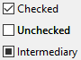
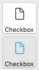

Uma caixa de seleção é um tipo de botão usado para introduzir ou exibir dados binários (verdadeiro-falso). Basicamente, ela é marcada ou desmarcada, mas um [terceiro estado](#three-states-check-box) pode ser definido.


As caixas de seleção são controladas por métodos ou [ações padrão](#using-a-standard-action). O método associado com ela é executado quando selecionar a caixa de seleção. Como todos os botões, uma variável da caixa de seleção é estabelecida em 0 quando o formulário é aberto pela primeira vez.

Uma caixa de seleção mostra o teto do lado de um pequeno quadrado. Esse texto é definido na propriedade [Título](properties_Object.md#title) da caixa de seleção. Você pode inserir um título na forma de uma referência XLIFF nessa área (consulte [Apêndice B: Arquitetura XLIFF](https://doc.4d.com/4Dv17R5/4D/17-R5/Appendix-B-XLIFF-architecture.300-4163748.en.html)).

## Utilizar caixas de seleção

Uma caixa de seleção pode ser associada a uma [variável ou expressão](properties_Object.md#variable-or-expression) do tipo inteiro ou booleano.

- **inteiro:** se a caixa for selecionada, a variável tem o valor 1. Quando não for marcado, tem o valor 0. Se a caixa de seleção estiver no terceiro estado (ver abaixo), tem o valor 2.
- **booleano:** se a caixa for marcada, a variável tem o valor `True`. Quando não marcado, ele tem o valor `False`.

Uma parte ou todas as caixas de seleção de um formulário podem estar marcadas ou desmarcadas. As caixas de seleção múltiplas permitem ao usuário selecionar várias opções.

### Caixas de seleção de três estados

Os objetos caixa de seleção com o [estilo de botão](checkbox_overview.md#regular) e [Normal](checkbox_overview.md#flat) e [Plano](properties_TextAndPicture.md#button-style) aceitam um terceiro estado. Este terceiro estado é um estado intermediário, que geralmente se usa para fins de visualização. Por exemplo, permite indicar que uma propriedade é presentada em uma seleção de objetos,



Para ativar esse terceiro estado, você deve selecionar a propriedade [Três estados](properties_Display.md#three-states).

Essa propriedade só está disponível para caixas de seleção clássicas e planas associadas a [variáveis ou expressões](properties_Object.md#variable-or-expression) numéricas - caixas de seleção para expressões booleanas não podem usar a propriedade [Três estados](properties_Display.md#three-states) (uma expressão booleana não pode estar em um estado intermediário).

A variável associada à caixa de seleção devolve o valor 2 quando a caixa estiver no terceiro estado.

> No modo de entrada, as caixas de seleção dos três Estados exibem cada estado sequencialmente, na seguinte ordem: desmarcado / verificado / intermediário / desmarcado, etc. O estado intermediário não é geralmente muito útil no modo entrada; no código, simplesmente force o valor da variável para 0 quando tomar o valor de 2 para passar diretamente de um estado marcado para o estado desmarcado.

## Usar uma ação padrão

Você pode atribuir uma [ação padrão](properties_Action.md#standard-action) a uma caixa de seleção para manipular atributos de áreas de texto. Por exemplo, se atribuir a ação padrão `fontBold`, em execução a caixa de seleção gerenciará o atributo "negrito" do texto selecionado na área atual.

Só as ações que podem representar um estado verdadeiro/falso (ações "marcáveis") são compatíveis com esse objeto:

| Ações suportadas                    | Condições de uso (se houver) |
| ----------------------------------- | ----------------------------------------------- |
| avoidPageBreakInsideEnabled         | Apenas áreas 4D Write Pro                       |
| fontItalic                          |                                                 |
| fontBold                            |                                                 |
| fontLinethrough                     |                                                 |
| fontSubscript                       | Apenas áreas 4D Write Pro                       |
| fontSuperscript                     | Apenas áreas 4D Write Pro                       |
| fontUnderline                       |                                                 |
| font/showDialog                     | Só em Mac                                       |
| htmlWYSIWIGEnabled                  | Apenas áreas 4D Write Pro                       |
| section/differentFirstPage          | Apenas áreas 4D Write Pro                       |
| section/differentLeftRightPages     | Apenas áreas 4D Write Pro                       |
| spell/autoCorrectionEnabled         |                                                 |
| spell/autoDashSubstitutionsEnabled  | Só em Mac                                       |
| spell/autoLanguageEnabled           | Só em Mac                                       |
| spell/autoQuoteSubstitutionsEnabled | Só em Mac                                       |
| spell/autoSubstitutionsEnabled      |                                                 |
| spell/enabled                       |                                                 |
| spell/grammarEnabled                | Só em Mac                                       |
| spell/showDialog                    | Só em Mac                                       |
| spell/visibleSubstitutions          |                                                 |
| visibleBackground                   | Apenas áreas 4D Write Pro                       |
| visibleFooters                      | Apenas áreas 4D Write Pro                       |
| visibleHeaders                      | Apenas áreas 4D Write Pro                       |
| visibleHiddenChars                  | Apenas áreas 4D Write Pro                       |
| visibleHorizontalRuler              | Apenas áreas 4D Write Pro                       |
| visiblePageFrames                   | Apenas áreas 4D Write Pro                       |
| visibleReferences                   |                                                 |
| widowAndOrphanControlEnabled        | Apenas áreas 4D Write Pro                       |

Para obter informações detalhadas sobre essas ações, consulte a seção [Ações padrão](properties_Action.md#standard-action).

## Estilos de botão caixas de seleção

As caixas de seleção usam [estilos de botão](properties_TextAndPicture.md#button-style) para controlar a aparência geral de uma caixa de seleção, bem como suas propriedades disponíveis. É possível aplicar diferentes estilos pré-definidos para caixas de seleção. Um grande número de variações podem ser obtidas combinando essas propriedades/comportamentos.

Com exceção das [propriedades disponíveis](#supported-properties), muitos objetos de caixa de seleção são _estruturalmente_ idênticos. A diferença é no processamento das variáveis associadas.

4D oferece caixas de seleção nos estilos predefinidos abaixo:

### Clássico

O estilo Clássico de caixa de seleção corresponde a um sistema de caixa de seleção padrão (\*ou seja, \*, um retângulo com um título descritivo):


#### Exemplo JSON:

```
	"myCheckBox": {
		"type": "checkbox",	
		"style":"regular",
		"text": "Cancel",	
		"action": "Cancel", 	
		"left": 60,			
		"top": 160,		
		"width": 100,			
		"height": 20		
		"dataSourceTypeHint":"boolean"
		}
```

### Plano

O estilo de caixa de seleção Plano tem uma aparência minimalista. A natureza gráfica do estilo Flat é especialmente útil para os formulários que vão ser impressos.


#### Exemplo JSON:

```
	"myCheckBox": {
			"type": "checkbox",	
			"style":"flat",
			"text": "Cancel",	
			"action": "cancel", 
			"left": 60,		
 			"top": 160,	
 			"width": 100,			
			"height": 20			
			}
```

### Botão barra de ferramentas

O estilo de botão barra de ferramentas está pensado principalmente para sua integração em uma barra de ferramentas.

O estilo Barra de ferramentas tem um fundo transparente com um título. Geralmente está associado a uma [imagem de 4 estados](properties_TextAndPicture.md#number-of-states).

Exemplo com estados selecionado/ não selecionado/ ressaltado:


#### Exemplo JSON:

```
	"myCheckBox": {
                "type": "checkbox",
                "style":"toolbar",	
                "text": "Checkbox",
				"icon": "/RESOURCES/File.png", 
				"iconFrames": 4 
                "left": 60,	
                "top": 160,	
                "width": 100,					
                "height": 20					
                }
```

### Bevel

O estilo de botão Bevel combina a aparência do estilo de botão [Clássico](#regular) (_ou seja,_ um retângulo com um título descritivo) com o comportamento do estilo de botão [Barra de ferramentas](#toolbar-button).

O estilo Bevel tem um fundo cinza claro com um título. Geralmente está associado a uma [imagem de 4 estados](properties_TextAndPicture.md#number-of-states).

Exemplo com estados selecionado/ não selecionado/ ressaltado:


#### Exemplo JSON:

```
	"myCheckBox": {
                "type": "checkbox",	
                "style":"bevel",
                "text": "Checkbox",	 
 				"icon": "/RESOURCES/File.png", 
				"iconFrames": 4 
              	"left": 60,	
                "top": 160,	
                "width": 100,				
                "height": 20				
                }
```

### Bevel arredondado

O estilo de caixa de seleção Bevel arredondado é quase idêntico ao estilo [Bevel](#bevel), exceto que, dependendo do sistema operativo, as esquinas do botão podem ser arredondadas. Como no estilo do botão Bevel, o estilo do botão Arredondado Bevel combina a aparência do estilo do botão [Clássico](#regular) com o comportamento do estilo de botão [Barra de ferramentas](#toolbar-button).

O estilo Bevel arredondado tem um fundo cinza claro com um título. Geralmente está associado a uma [imagem de 4 estados](properties_TextAndPicture.md#number-of-states).

Exemplo em macOS:



> No Windows, o estilo de botão Rounded Bevel é idêntico ao estilo de botão [Bevel](#bevel).

#### Exemplo JSON:

```4d
	"myCheckBox": {
                "type": "checkbox",	
                "style":"roundedBevel",	 
                "text": "Checkbox",	
 				"icon": "/RESOURCES/File.png", 
				"iconFrames": 4 
                "left": 60,	
                "top": 160,	
                "width": 100,			
                "height": 20			
                }
```

### OS X Gradient

O estilo do botão da caixa de seleção OS X Gradient é quase idêntico ao estilo do botão [Bevel](#bevel). Assim como o estilo de botão Bevel, o estilo de botão OS X Gradient combina a aparência do estilo de botão [Clássico](#regular) com o comportamento do estilo de botão [Barra de ferramentas](#toolbar-button).

O estilo Gradient OS X tem um fundo cinza claro com um título e se mostra como um botão de sistema de dois tons em macOS. Geralmente está associado a uma [imagem de 4 estados](properties_TextAndPicture.md#number-of-states).


> No Windows, esse estilo de botão de caixa de seleção é idêntico ao estilo de botão [Bevel](#bevel).

#### Exemplo JSON:

```
	"myCheckBox": {
			"type": "checkbox",	
			"style":"gradientBevel", 
			"text": "Checkbox",	
			"icon": "/RESOURCES/File.png",
			"iconFrames": 4
			"left": 60,		
			"top": 160,		
			"width": 100,				
			"height": 20				
           }
```

### OS X Texturizado

O estilo de botão OS X Texturizado é semelhante ao estilo de botão [Bevel](#bevel), mas com um tamanho menor (o tamanho máximo é o tamanho de um botão padrão do sistema macOS). Assim como o estilo de botão Bevel, o estilo de botão OS X Texturizado combina a aparência do estilo de botão [Clássico](#regular) com o comportamento do estilo de botão [Barra de ferramentas](#toolbar-button).

Como padrão, o estilo OS X Textured aparece como:

- _Windows_ - um botão padrão com um fundo azul-claro com um título no centro.


- _macOS_ - um botão de sistema padrão. Sua altura está predefinida: não é possível ampliar ou reduzir.


#### Exemplo JSON:

```
	"myCheckBox": {
			"type": "checkbox",	
			"style":"texturedBevel", 
			"text": "Checkbox",	
			"left": 60,	
			"top": 160,	
			"width": 100,					
			"height": 20					
			}
```

### Office XP

O estilo do botão Office XP combina a aparência do estilo do botão [Clássico](#regular) com o comportamento du style do botão [Barra de ferramentas](#toolbar-button).

As cores (ressaltado e fundo) de um botão com o estilo Office XP são baseadas nos sistemas de cores. A aparência do botão pode ser diferente quando o cursor passar por cima dele, dependendo do SO:

- _Windows_ - seu fundo só aparece quando o mouse passa por cima. Exemplo com estados selecionado/ não selecionado/ ressaltado:


- _macOS_ - its background is always displayed. Exemplos com estados desmarcado/ marcado:


#### Exemplo JSON:

```
	"myCheckBox": {
                "type": "checkbox",	
                "style":"office",
                "text": "Checkbox",	 
                "action": "fontBold",
 				"icon": "/RESOURCES/File.png", 
				"iconFrames": 4 	
               "left": 60,	
                "top": 160,		
                "width": 100,			
                "height": 20			
                }
```

### Contrair/expandir

Este estilo de caixa de seleção pode ser usado para adicionar um ícone padrão de contrair/expandir. Estes ícones são utilizados nativamente em listas hierárquicas.

- _Windows_ - o ícone se parece com um [+] ou um [-]


- _macOS_ - parece um triângulo apontando para a direita ou para baixo.


:::info

O estilo Recolher/Expandir é denominado "disclosure" na [gramática JSON de estilo de botão](properties_TextAndPicture.md#button-style).

:::

#### Exemplo JSON:

```
	"myCheckBox": {
                "type": "checkbox",	
                "style":"disclosure",
				"method": "m_collapse",
				"left": 60,	
                "top": 160,	
                "width": 100,			
                "height": 20			
                }
```

### Botão disclosure

Em macOS e Windows, uma caixa de seleção com o estilo de botão "Divulgação" aparece como um botão de informação padrão, normalmente utilizado para mostrar/ocultar informação adicional. Quando usar um botão radio, o símbolo botão aponta para baixo com o valor 0 e para cima com o valor 1.

- _Windows_

  

- _macOS_

  

:::info

O estilo Disclosure é denominado "roundedDisclosure" na [gramática JSON do estilo de botão](properties_TextAndPicture.md#button-style).

:::

#### Exemplo JSON:

```
	"myCheckBox": {
                "type": "checkbox",		
                "style":"roundedDisclosure",	
				"method": "m_disclose",
                "left": 60,		
                "top": 160,	
                "width": 100,			
                "height": 20			
                }
```

### Personalizado

O estilo de botão Personalizado aceita uma imagem de fundo personalizada e permite gerir propriedades específicas:

- [Nome do caminho do plano de fundo](properties_TextAndPicture.md#background-pathname)
- [Deslocamento do ícone](properties_TextAndPicture.md#icon-offset)
- [Horizontal Margin](properties_TextAndPicture.md#horizontal-margin) and [Vertical Margin](properties_TextAndPicture.md#vertical-margin)

It is usually associated with a [4-state picture](properties_TextAndPicture.md#number-of-states), that can be used in conjunction with a [4-state](properties_TextAndPicture.md#number-of-states) [background picture](properties_TextAndPicture.md#background-pathname).

#### Exemplo JSON:

```
	"myCheckbox": {
		"type": "checkbox",
		"style":"custom",
		"text": "OK", 
		"icon": "/RESOURCES/smiley.jpg", 
		"iconFrame": 4, 
		"customBackgroundPicture": "/RESOURCES/paper.jpg", 
		"iconOffset": 5, //custom icon offset when clicked
		"left": 60,	
		"top": 160,	
		"width": 100,		
		"height": 20,
		"customBorderX": 20,
		"customBorderY": 5
		}
```

## Propriedades compatíveis

Todas as caixas de seleção partilhar o mesmo conjunto de propriedades básicas:

[Bold](properties_Text.md#bold) - [Bottom](properties_CoordinatesAndSizing.md#bottom) - [Button Style](properties_TextAndPicture.md#button-style) - [Class](properties_Object.md#css-class) - [Enterable](properties_Entry.md#enterable) - [Expression Type](properties_Object.md#expression-type) - [Focusable](properties_Entry.md#focusable) - [Font](properties_Text.md#font) - [Font Color](properties_Text.md#font-color) - [Font Size](properties_Text.md#font-size) - [Height](properties_CoordinatesAndSizing.md#height) - [Help Tip](properties_Help.md#help-tip) - [Horizontal Alignment](properties_Text.md#horizontal-alignment)(1) - [Horizontal Sizing](properties_ResizingOptions.md#horizontal-sizing) - [Image hugs title](properties_TextAndPicture.md#image-hugs-title)(2) - [Italic](properties_Text.md#italic) - [Left](properties_CoordinatesAndSizing.md#left) - [Number of States](properties_TextAndPicture.md#number-of-states)(2) - [Object Name](properties_Object.md#object-name) - [Picture pathname](properties_TextAndPicture.md#picture-pathname)(2) - [Right](properties_CoordinatesAndSizing.md#right) - [Save value](properties_Object.md#save-value) - [Shortcut](properties_Entry.md#shortcut) - [Standard action](properties_Action.md#standard-action) - [Title](properties_Object.md#title) - [Title/Picture Position](properties_TextAndPicture.md#titlepicture-position)(2) - [Top](properties_CoordinatesAndSizing.md#top) - [Type](properties_Object.md#type) - [Underline](properties_Text.md#underline) - [Variable or Expression](properties_Object.md#variable-or-expression) - [Vertical Sizing](properties_ResizingOptions.md#vertical-sizing) - [Visibility](properties_Display.md#visibility) - [Width](properties_CoordinatesAndSizing.md#width)

> (1) Não compatível com os estilos [Regular](#regular) e [Flat](#flat).<br/>
> (2) Não é compatível com os estilos [Regular](#regular), [Flat](#flat), [Disclosure](#disclosure) e [Collapse/Expand](#collapseexpand).

Outras propriedades específicas estão disponíveis, dependendo do [estilo do botão](#button-styles):

- Custom: [Background pathname](properties_TextAndPicture.md#background-pathname) - [Horizontal Margin](properties_TextAndPicture.md#horizontal-margin) - [Icon Offset](properties_TextAndPicture.md#icon-offset) - [Vertical Margin](properties_TextAndPicture.md#vertical-margin)
- Flat, Regular: [Três estados](properties_Display.md#three-states)
