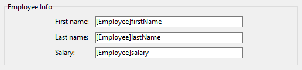

A group box is a static object that allows you to visually assemble multiple form objects:



> O nome de uma caixa de grupo é texto estático; você pode usar uma referência "localizável" como com qualquer rótulo 4D (veja [Usando referências em texto estático](https://doc.4d.com/4Dv17R5/4D/17-R5/Using-references-in-static-text.300-4163725.en.html) e seção _Arquitetura XLIFF_ em referência Desenho 4D.

#### Exemplo JSON:

```
	"myGroup": {
		"type": "groupBox",	
		"title": "Employee Info"
		"left": 60,
		"top": 160,
		"width": 100,
		"height": 20
		}
```

#### Propriedades compatíveis

[Inferior](properties_CoordinatesAndSizing.md#bottom) - [Class CSS](properties_Object.md#css-class) - [Fonte](properties_Text.md#font) - [Cor da fonte](properties_Text.md#font-color) - [Tamanho da fonte](properties_Text.md#font-size) - [Altura](properties_CoordinatesAndSizing.md#height) - [Alinhamento horizontal](properties_Text.md#horizontal-alignment) - [Dimensionamento horizontal](properties_ResizingOptions.md#horizontal-sizing) - [Itálico](properties_Text.md#italic) - [Esquerda](properties_CoordinatesAndSizing.md#left) - [Nome do objeto](properties_Object.md#object-name) - [Certo](properties_CoordinatesAndSizing.md#right) - [Título](properties_Object.md#title) - [Topo](properties_CoordinatesAndSizing.md#top) - [Tipo](properties_Object.md#type) - [Sublinhado](properties_Text.md#underline) - [Dimensionamento vertical](properties_ResizingOptions.md#vertical-sizing) - [Visibilidade](properties_Display.md#visibility) - [Largura](properties_CoordinatesAndSizing.md#width)
