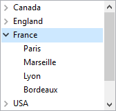

As listas hierárquicas são objetos de formulário que podem ser utilizados para apresentar dados como listas com um ou mais níveis que podem ser expandidos ou recolhidos.



Quando apropriado, o ícone de expansão/colapso é automaticamente apresentado à esquerda do item. As listas hierárquicas suportam um número ilimitado de subníveis.

## Fonte de dados de lista hierárquica

O conteúdo de um objeto formulário lista hierárquica pode ser inicializado de uma das seguintes formas:

- Associar uma [lista de opções](properties_DataSource.md#choice-list) existente ao objeto. A lista de opções deve ter sido definida no editor de listas no modo Desenho.
- Atribuir diretamente uma referência de lista hierárquica à [variável ou expressão](properties_Object.md#variable-or-expression) associada ao objeto formulário.

Em ambos os casos, você gerencia uma lista hierárquica em tempo de execução através de sua referência *ListRef*, usando os comandos de [lista hierárquica](../commands/theme/Hierarchical_Lists) na linguagem 4D.

## RefList e nome de objeto

Uma lista hierárquica é tanto um **objeto de linguagem** existente na memória quanto um **objeto de formulário**.

O **objeto de linguagem** é referenciado por um ID interno único do tipo Longint, designado por *ListRef* na manual da Linguagem 4D. This ID is returned by the commands that can be used to create lists: [`New list`](../commands/new-list), [`Copy list`](../commands/copy-list), [`Load list`](../commands/load-list), [`BLOB to list`](../commands/blob-to-list). Existe apenas uma instância do objeto língua na memória e qualquer modificação efetuada neste objeto é imediatamente transferida para todos os locais onde é utilizado.

O **objeto de formulário** não é necessariamente único: podem existir várias representações da mesma lista hierárquica na mesma forma ou em formas diferentes. Tal como acontece com outros objetos de formulário, especifica-se o objeto na linguagem utilizando a sintaxe (\*; "ListName", etc.).

Você conecta o "objeto de linguagem" lista hierárquica com o "objeto de formulário" lista hierárquica pelo intermediário da variável que contém o valor ListRef. Você conecta o "objeto de linguagem" lista hierárquica com o "objeto de formulário" lista hierárquica pelo intermediário da variável que contém o valor ListRef.

```4d
$mylist:=New list
```

Cada representação da lista tem suas próprias características específicas e compartilha características comuns com todas as outras representações. As características a seguir são específicas de cada representação da lista:

- A selecção,
- O estado expandido/recolhido dos seus itens,
- A posição do cursor de rolagem.

As outras características (fonte, tamanho da fonte, estilo, controle de entrada, cor, conteúdo da lista, ícones, etc.) são comuns a todas as representações e não podem ser modificados separadamente.
Consequently, when you use commands based on the expanded/collapsed configuration or the current item, for example [`Count list items`](../commands/count-list-items) (when the final `*` parameter is not passed), it is important to be able to specify the representation to be used without any ambiguity.

Você deve usar o ID `ListRef` com comandos de linguagem quando quiser especificar a lista hierárquica encontrada na memória. Por outro lado, se você quiser especificar a representação de um objeto lista hierárquica no nível do formulário, deverá usar o nome do objeto (tipo string) no comando, por meio da sintaxe padrão (\*; "ListName", etc.).

> No caso de comandos que definem propriedades, a sintaxe baseada no nome do objeto não significa que somente o objeto de formulário especificado será modificado pelo comando, mas sim que a ação do comando será baseada no estado desse objeto. As características comuns das listas hierárquicas são sempre modificadas em todas as suas representações.
> Por exemplo, se executa:

```4d
SET LIST ITEM FONT(*;"mylist1";*;thefont)
```

> ... está a indicar que pretende modificar o tipo de letra do item da lista hierárquica associado ao objeto de formulário *mylist1*. O comando considerará o item atual do objeto *mylist1* para especificar o item a ser modificado, mas essa modificação será transferida para todas as representações da lista em todos os processos.

### Suporte da @

As with [other object property management commands](../FormObjects/formObjects_overview.md#accessing-form-objects-using-their-name-or-their-data-source-in-the-4d-language), it is possible to use the “@” character in the `ListName` parameter. Regra geral, esta sintaxe é utilizada para designar um conjunto de objetos no formulário. No entanto, no contexto dos comandos de lista hierárquica, isso não se aplica em todos os casos. Essa sintaxe tem dois efeitos diferentes, dependendo do comando:

- Para comandos que definem propriedades, essa sintaxe designa todos os objetos cujo nome corresponde (comportamento padrão). Por exemplo, o parâmetro "LH@" designa todos os objetos do tipo lista hierárquica cujo nome começa com "LH."
  - [`DELETE FROM LIST`](../commands/delete-from-list)
  - [`INSERT IN LIST`](../commands/insert-in-list)
  - [`SELECT LIST ITEMS BY POSITION`](../commands/select-list-items-by-position)
  - [`SET LIST ITEM`](../commands/set-list-item)
  - [`SET LIST ITEM FONT`](../commands/set-list-item-font)
  - [`SET LIST ITEM ICON`](../commands/set-list-item-icon)
  - [`SET LIST ITEM PARAMETER`](../commands/set-list-item-parameter)
  - [`SET LIST ITEM PROPERTIES`](../commands/set-list-item-properties)

- Para comandos que recuperam propriedades, essa sintaxe designa o primeiro objeto cujo nome corresponde:
  - [`Count list items`](../commands/count-list-items)
  - [`Find in list`](../commands/find-in-list)
  - [`GET LIST ITEM`](../commands/get-list-item)
  - [`Get list item font`](../commands/get-list-item-font)
  - [`GET LIST ITEM ICON`](../commands/get-list-item-icon)
  - [`GET LIST ITEM PARAMETER`](../commands/get-list-item-parameter)
  - [`GET LIST ITEM PROPERTIES`](../commands/get-list-item-properties)
  - [`List item parent`](../commands/list-item-parent)
  - [`List item position`](../commands/list-item-position)
  - [`Selected list items`](../commands/selected-list-items)

## Comandos genéricos utilizáveis com listas hierárquicas

É possível modificar a aparência de uma lista hierárquica de objetos usando vários comandos 4D genéricos. Você pode passar para esses comandos o nome do objeto da lista hierárquica (usando o parâmetro \*) ou o nome da variável (contendo o valor ListRef):

- [`OBJECT SET FONT`](../commands/object-set-font)
- [`OBJECT SET FONT STYLE`](../commands/object-set-font-style)
- [`OBJECT SET FONT SIZE`](../commands/object-set-font-size)
- [`OBJECT SET FILTER`](../commands/object-set-filter)
- [`OBJECT SET ENTERABLE`](../commands/object-set-enterable)
- [`OBJECT SET SCROLLBAR`](../commands/object-set-scrollbar)
- [`OBJECT SET SCROLL POSITION`](../commands/object-set-scroll-position)
- [`OBJECT SET RGB COLORS`](../commands/object-set-rgb-colors)

> Reminder: Except [`OBJECT SET SCROLL POSITION`](../commands/object-set-scroll-position), these commands modify all the representations of the same list, even if you only specify a list via its object name.

## Prioridade dos comandos de propriedade

Certas propriedades das listas hierárquicas (por exemplo, o atributo **Entrável** ou a cor) podem ser definidas de diferentes maneiras: nas propriedades do formulário, por um comando do tema "Propriedades dos objetos" ou através de um comando do tema "Listas hierárquicas". Quando todos esses três meios são usados para definir as propriedades da lista, a seguinte ordem de prioridade é aplicada:

1. Comandos do tema "Listas hierárquicas"
2. Comandos genéricos de propriedades de objectos
3. Propriedade formulário

Esse princípio é aplicado independentemente da ordem em que os comandos são chamados. Se uma propriedade de item for modificada individualmente através de um comando de lista hierárquica, o comando de propriedade de objeto equivalente não afetar esse item, mesmo que seja chamado posteriormente. For example, if the color of an item is modified via the [`SET LIST ITEM PROPERTIES`](../commands/set-list-item-properties) command, the `OBJECT SET COLOR` command will have no effect on this item.

## Gerenciamento dos itens por posição ou referência

Normalmente, você pode trabalhar de duas maneiras com o conteúdo das listas hierárquicas: por posição ou por referência.

- Quando se trabalha por posição, 4D se baseia na posição em relação aos itens da lista exibida na tela para identificá-los. O resultado diferirá conforme o fato de determinados itens hierárquicos serem expandidos ou recolhidos. Observe que, no caso de várias representações, cada objeto de formulário tem sua própria configuração de itens expandidos/colapsados.
- Quando você trabalha por referência, 4D se baseia no número de identificação *itemRef* dos itens da lista. Assim, cada item pode ser especificado individualmente, independentemente de sua posição ou de sua exibição na lista hierárquica.

### Utilização de números de referência dos items (itemRef)

Cada item de uma lista hierárquica tem um número de referência (*itemRef*) do tipo Longint. Este valor é apenas destinado ao seu próprio uso: 4D simplesmente o mantém.

> Aviso: você pode usar qualquer tipo de valor Longint como número de referência, exceto 0. De fato, na maioria dos comandos desse tema, o valor 0 é usado para especificar o último item adicionado à lista.

Seguem-se algumas sugestões para a utilização de números de referência:

1. Não é necessário identificar cada item com um número exclusivo (nível iniciante).

   - Primeiro exemplo: você cria um sistema de guias programando, por exemplo, um catálogo de endereços. Como o sistema retorna o número da guia selecionada, você provavelmente não precisará de mais informações do que isso. Nesse caso, não se preocupe com os números de referência do item: passe qualquer valor (exceto 0) no parâmetro *itemRef*. Observe que, para um sistema de catálogo de endereços, você pode predefinir uma lista A, B, ..., Z no modo Desenho. Também é possível criá-lo por programação, de modo a eliminar quaisquer letras para as quais não haja registros.
   - Segundo exemplo: ao trabalhar com um banco de dados, você constrói progressivamente uma lista de palavras-chave. You can save this list at the end of each session by using the [`SAVE LIST`](../commands/save-list) or [`LIST TO BLOB`](../commands/list-to-blob) commands and reload it at the beginning of each new session using the [`Load list`](../commands/load-list) or [`BLOB to list`](../commands/blob-to-list) commands. Você pode exibir essa lista em uma paleta flutuante; quando cada usuário clica em uma palavra-chave da lista, o item escolhido é inserido na área de entrada selecionada no processo em primeiro plano. The important thing is that you only process the item selected, because the [`Selected list items`](../commands/selected-list-items) command returns the position of the item that you must process. When using this position value, you obtain the title of the item by means of the [`GET LIST ITEM`](../commands/get-list-item) command. Aqui, novamente, não é necessário identificar cada item individualmente; você pode passar qualquer valor (exceto 0) no parâmetro *itemRef*.

2. Você precisa identificar parcialmente os itens da lista (nível intermediário).  
   You use the item reference number to store information needed when you must work with the item; this point is detailed in the example of the [`APPEND TO LIST`](../commands/append-to-list) command. Neste exemplo, usamos os números de referência do item para armazenar os números de registro. No entanto, devemos conseguir estabelecer uma distinção entre os itens que correspondem aos registros do [Departament] e aqueles que correspondem aos registros dos [Employees].

3. Você precisa identificar todos os itens da lista individualmente (nível atacante).  
   Você programa um gerenciamento elaborado de listas hierárquicas em que é absolutamente necessário poder identificar cada item individualmente em cada nível da lista. Uma forma simples de o fazer é manter um contador pessoal. Suppose that you create a *hlList* list using the [`APPEND TO LIST`](../commands/append-to-list) command. En esta etapa, se inicializa un contador *vhlCounter* en 1. Each time you call [`APPEND TO LIST`](../commands/append-to-list) or [`INSERT IN LIST`](../commands/insert-in-list), you increment this counter `(vhlCounter:=vhlCounter+1)`, and you pass the counter number as the item reference number. O truque consiste em nunca diminuir o contador quando você exclui itens - o contador só pode aumentar. Dessa forma, você garante a exclusividade dos números de referência do item. Como esses números são do tipo Longint, é possível adicionar ou inserir mais de dois bilhões de itens em uma lista que foi reinicializada... (no entanto, se estiver trabalhando com um número tão grande de itens, isso geralmente significa que você deve usar uma tabela em vez de uma lista).

> Se você usar operadores bit a bit, também poderá usar números de referência de itens para armazenar informações que podem ser colocadas em um Longint, ou seja, 2 inteiros, valores de 4 bytes ou, mais uma vez, 32 boolianos.

### Quando é que são necessários números de referência únicos?

Geralmente, ao usar listas hierárquicas para fins de interface usuário e ao lidar apenas com o item selecionado (aquele sendo clicado ou arrastado), não será necessário usar números de referência de item. Using [`Selected list items`](../commands/selected-list-items) and [`GET LIST ITEM`](../commands/get-list-item) you have all you need to deal with the currently selected item. In addition, commands such as [`INSERT IN LIST`](../commands/insert-in-list) and [`DELETE FROM LIST`](../commands/delete-from-list) allow you to manipulate the list “relatively” with respect to the selected item.

Basicamente, você precisa lidar com números de referência de itens quando quiser acessar diretamente qualquer item da lista de forma programática e não necessariamente o item selecionado no momento na lista.

## Elemento modificável

Pode controlar se os itens da lista hierárquica podem ser modificados pelo usuário, utilizando o atalho **Alt+click**(Windows) / **Option+click** (macOS), ou fazendo um clique longo no texto do item.

- Independentemente da fonte de dados da lista hierárquica, você pode controlar todo o objeto com a propriedade [Entrável](properties_Entry.md#enterable).

- Além disso, se você preencher a lista hierárquica usando uma lista criada no editor de Listas, poderá controlar se um item em uma lista hierárquica é modificável usando a opção **Elemento modificável** no editor de Listas. Para obter mais informações, consulte [Definir as propriedades das listas](https://doc.4d.com/4Dv20/4D/20.2/Setting-list-properties.300-6750359.en.html#1350157).

## Propriedades compatíveis

[Bold](properties_Text.md#bold) - [Border Line Style](properties_BackgroundAndBorder.md#border-line-style) - [Bottom](properties_CoordinatesAndSizing.md#bottom) - [Choice List](properties_DataSource.md#choice-list) - [Class](properties_Object.md#css-class) - [Draggable](properties_Action.md#draggable) - [Droppable](properties_Action.md#droppable) - [Enterable](properties_Entry.md#enterable) - [Entry Filter](properties_Entry.md#entry-filter) - [Fill Color](properties_BackgroundAndBorder.md#background-color--fill-color) - [Focusable](properties_Entry.md#focusable) - [Font](properties_Text.md#font) - [Font Color](properties_Text.md#font-color) - [Font Size](properties_Text.md#font-size) - [Height](properties_CoordinatesAndSizing.md#height) - [Help Tip](properties_Help.md#help-tip) - [Hide focus rectangle](properties_Appearance.md#hide-focus-rectangle) - [Horizontal Scroll Bar](properties_Appearance.md#horizontal-scroll-bar) - [Horizontal Sizing](properties_ResizingOptions.md#horizontal-sizing) - [Italic](properties_Text.md#italic) - [Left](properties_CoordinatesAndSizing.md#left) - [Multi-selectable](properties_Action.md#multi-selectable) - [Object Name](properties_Object.md#object-name) - [Right](properties_CoordinatesAndSizing.md#right) - [Top](properties_CoordinatesAndSizing.md#top) - [Type](properties_Object.md#type) - [Underline](properties_Text.md#underline) - [Vertical Scroll Bar](properties_Appearance.md#vertical-scroll-bar) - [Vertical Sizing](properties_ResizingOptions.md#vertical-sizing) - [Variable or Expression](properties_Object.md#variable-or-expression) - [Visibility](properties_Display.md#visibility) - [Width](properties_CoordinatesAndSizing.md#width)

## Supported Events

[On After Edit](../Events/onAfterEdit.md) - [On Begin Drag Over](../Events/onBeginDragOver.md) - [On Clicked](../Events/onClicked.md) - [On Collapse](../Events/onCollapse.md) - [On Data Change](../Events/onDataChange.md) - [On Delete Action](../Events/onDeleteAction.md) - [On Double Clicked](../Events/onDoubleClicked.md) - [On Drag Over](../Events/onDragOver.md) - [On Drop](../Events/onDrop.md) - [On Expand](../Events/onExpand.md) - [On Getting focus](../Events/onGettingFocus.md) - [On Header](../Events/onHeader.md) - [On Load](../Events/onLoad.md) - [On Losing focus](../Events/onLosingFocus.md) - [On Mouse Enter](../Events/onMouseEnter.md) - [On Mouse Leave](../Events/onMouseLeave.md) - [On Mouse Move](../Events/onMouseMove.md) - [On Printing Break](../Events/onPrintingBreak.md) - [On Printing Detail](../Events/onPrintingDetail.md) - [On Printing Footer](../Events/onPrintingFooter.md) - [On Selection Change](../Events/onSelectionChange.md) - [On Unload](../Events/onUnload.md) - [On Validate](../Events/onValidate.md)