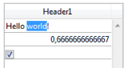
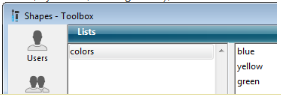

Uma list box é feita de um ou mais objetos coluna que têm propriedades específicas. Pode selecionar uma coluna list box no editor de Formulário clicando nela ou quando o objeto list box for selecionado:


Você pode definir propriedades padrão (texto, cor de fundo, etc.) para cada coluna da caixa de listagem; essas propriedades têm prioridade sobre as propriedades do objeto da caixa de listagem.

> Você pode definir o [Expression type](properties_Object.md#expression-type) para colunas de list box de tipo array (String, Text, Number, Date, Time, Picture, Boolean ou Object).

## Column Specific Properties {#column-specific-properties}

[Alpha Format](properties_Display.md#alpha-format) - [Alternate Background Color](properties_BackgroundAndBorder.md#alternate-background-color) - [Automatic Row Height](properties_CoordinatesAndSizing.md#automatic-row-height) - [Background Color](properties_BackgroundAndBorder.md#background-color--fill-color) - [Background Color Expression](properties_BackgroundAndBorder.md#background-color-expression) - [Bold](properties_Text.md#bold) - [Choice List](properties_DataSource.md#choice-list) - [Class](properties_Object.md#css-class) - [Context Menu](properties_Entry.md#context-menu) - [Data Type (selection and collection list box column)](properties_DataSource.md#data-type-list) - [Date Format](properties_Display.md#date-format) - [Default Values](properties_DataSource.md#default-list-of-values) - [Display Type](properties_Display.md#display-type) - [Enterable](properties_Entry.md#enterable) - [Entry Filter](properties_Entry.md#entry-filter) - [Excluded List](properties_RangeOfValues.md#excluded-list) - [Expression](properties_DataSource.md#expression) - [Expression Type (array list box column)](properties_Object.md#expression-type) - [Font](properties_Text.md#font) - [Font Color](properties_Text.md#font-color) - [Horizontal Alignment](properties_Text.md#horizontal-alignment) - [Horizontal Padding](properties_CoordinatesAndSizing.md#horizontal-padding) - [Italic](properties_Text.md#italic) - [Invisible](properties_Display.md#visibility) - [Maximum Width](properties_CoordinatesAndSizing.md#maximum-width) - [Method](properties_Action.md#method) - [Minimum Width](properties_CoordinatesAndSizing.md#minimum-width) - [Multi-style](properties_Text.md#multi-style) - [Number Format](properties_Display.md#number-format) - [Object Name](properties_Object.md#object-name) - [Picture Format](properties_Display.md#picture-format) - [Resizable](properties_ResizingOptions.md#resizable) - [Required List](properties_RangeOfValues.md#required-list) - [Row Background Color Array](properties_BackgroundAndBorder.md#row-background-color-array) - [Row Font Color Array](properties_Text.md#row-font-color-array) - [Row Style Array](properties_Text.md#row-style-array) - [Save as](properties_DataSource.md#save-as) - [Style Expression](properties_Text.md#style-expression) - [Text when False/Text when True](properties_Display.md#text-when-falsetext-when-true) - [Time Format](properties_Display.md#time-format) - [Truncate with ellipsis](properties_Display.md#truncate-with-ellipsis) - [Underline](properties_Text.md#underline) - [Variable or Expression](properties_Object.md#variable-or-expression) - [Vertical Alignment](properties_Text.md#vertical-alignment) - [Vertical Padding](properties_CoordinatesAndSizing.md#vertical-padding) - [Width](properties_CoordinatesAndSizing.md#width) - [Wordwrap](properties_Display.md#wordwrap)

## Supported Form Events {#supported-form-events}

| Evento formulário    | Propriedades adicionais retornadas (consulte [Form event](../commands/form-event) para obter as propriedades principais)                                                                                                                                                                            | Comentários                                                                                                                                                         |
| -------------------- | ---------------------------------------------------------------------------------------------------------------------------------------------------------------------------------------------------------------------------------------------------------------------------------------------------------------------- | ------------------------------------------------------------------------------------------------------------------------------------------------------------------- |
| On After Edit        | <ul><li>[column](./listbox-object.md#additional-properties)</li><li>[columnName](./listbox-object.md#additional-properties)</li><li>[row](./listbox-object.md#additional-properties)</li></ul>                                                                                                                         |                                                                                                                                                                     |
| On After Keystroke   | <ul><li>[column](./listbox-object.md#additional-properties)</li><li>[columnName](./listbox-object.md#additional-properties)</li><li>[row](./listbox-object.md#additional-properties)</li></ul>                                                                                                                         |                                                                                                                                                                     |
| On After Sort        | <ul><li>[column](./listbox-object.md#additional-properties)</li><li>[columnName](./listbox-object.md#additional-properties)</li><li>[headerName](./listbox-object.md#additional-properties)</li></ul>                                                                                                                  | *fórmulas compostas não podem ser ordenadas. <br/>(por exemplo, This.firstName + This.lastName)* |
| On Alternative Click | <ul><li>[column](./listbox-object.md#additional-properties)</li><li>[columnName](./listbox-object.md#additional-properties)</li><li>[row](./listbox-object.md#additional-properties)</li></ul>                                                                                                                         | *List box array unicamente*                                                                                                                                         |
| On Before Data Entry | <ul><li>[column](./listbox-object.md#additional-properties)</li><li>[columnName](./listbox-object.md#additional-properties)</li><li>[row](./listbox-object.md#additional-properties)</li></ul>                                                                                                                         |                                                                                                                                                                     |
| On Before Keystroke  | <ul><li>[column](./listbox-object.md#additional-properties)</li><li>[columnName](./listbox-object.md#additional-properties)</li><li>[row](./listbox-object.md#additional-properties)</li></ul>                                                                                                                         |                                                                                                                                                                     |
| On Begin Drag Over   | <ul><li>[column](./listbox-object.md#additional-properties)</li><li>[columnName](./listbox-object.md#additional-properties)</li><li>[row](./listbox-object.md#additional-properties)</li></ul>                                                                                                                         |                                                                                                                                                                     |
| On Clicked           | <ul><li>[column](./listbox-object.md#additional-properties)</li><li>[columnName](./listbox-object.md#additional-properties)</li><li>[row](./listbox-object.md#additional-properties)</li></ul>                                                                                                                         |                                                                                                                                                                     |
| On Column Moved      | <ul><li>[columnName](./listbox-object.md#additional-properties)</li><li>[newPosition](./listbox-object.md#additional-properties)</li><li>[oldPosition](./listbox-object.md#additional-properties)</li></ul>                                                                                                            |                                                                                                                                                                     |
| On Column Resize     | <ul><li>[column](./listbox-object.md#additional-properties)</li><li>[columnName](./listbox-object.md#additional-properties)</li><li>[newSize](./listbox-object.md#additional-properties)</li><li>[oldSize](./listbox-object.md#additional-properties)</li></ul>                                                        |                                                                                                                                                                     |
| On Data Change       | <ul><li>[column](./listbox-object.md#additional-properties)</li><li>[columnName](./listbox-object.md#additional-properties)</li><li>[row](./listbox-object.md#additional-properties)</li></ul>                                                                                                                         |                                                                                                                                                                     |
| On Double Clicked    | <ul><li>[column](./listbox-object.md#additional-properties)</li><li>[columnName](./listbox-object.md#additional-properties)</li><li>[row](./listbox-object.md#additional-properties)</li></ul>                                                                                                                         |                                                                                                                                                                     |
| On Drag Over         | <ul><li>[area](./listbox-object.md#additional-properties)</li><li>[areaName](./listbox-object.md#additional-properties)</li><li>[column](./listbox-object.md#additional-properties)</li><li>[columnName](./listbox-object.md#additional-properties)</li><li>[row](./listbox-object.md#additional-properties)</li></ul> |                                                                                                                                                                     |
| On Drop              | <ul><li>[column](./listbox-object.md#additional-properties)</li><li>[columnName](./listbox-object.md#additional-properties)</li><li>[row](./listbox-object.md#additional-properties)</li></ul>                                                                                                                         |                                                                                                                                                                     |
| On Footer Click      | <ul><li>[column](./listbox-object.md#additional-properties)</li><li>[columnName](./listbox-object.md#additional-properties)</li><li>[footerName](./listbox-object.md#additional-properties)</li></ul>                                                                                                                  | *List box arrays, seleção atual e seleção temporal apenas*                                                                                                          |
| On Getting Focus     | <ul><li>[column](./listbox-object.md#additional-properties)</li><li>[columnName](./listbox-object.md#additional-properties)</li><li>[row](./listbox-object.md#additional-properties)</li></ul>                                                                                                                         | *Propriedades adicionais devolvidas apenas quando se edita uma célula*                                                                                              |
| On Header Click      | <ul><li>[column](./listbox-object.md#additional-properties)</li><li>[columnName](./listbox-object.md#additional-properties)</li><li>[headerName](./listbox-object.md#additional-properties)</li></ul>                                                                                                                  |                                                                                                                                                                     |
| On Load              |                                                                                                                                                                                                                                                                                                                        |                                                                                                                                                                     |
| On Losing Focus      | <ul><li>[column](./listbox-object.md#additional-properties)</li><li>[columnName](./listbox-object.md#additional-properties)</li><li>[row](./listbox-object.md#additional-properties)</li></ul>                                                                                                                         | *Propriedades adicionais devolvidas apenas quando a edição de uma célula tiver sido concluída*                                                                      |
| On Row Moved         | <ul><li>[newPosition](./listbox-object.md#additional-properties)</li><li>[oldPosition](./listbox-object.md#additional-properties)</li></ul>                                                                                                                                                                            | *List box array unicamente*                                                                                                                                         |
| On Unload            |                                                                                                                                                                                                                                                                                                                        |                                                                                                                                                                     |
| On Validate          |                                                                                                                                                                                                                                                                                                                        |                                                                                                                                                                     |

## Arrays objetos nas colunas (4D View Pro)

As colunas da caixa de listagem podem tratar de arrays de objectos. Uma vez que os arrays de objectos podem conter diferentes tipos de dados, esta nova e poderosa característica permite-lhe misturar diferentes tipos de entrada nas linhas de uma única coluna, e exibir também vários widgets. Por exemplo, poderia inserir uma entrada de texto na primeira linha, uma caixa de verificação na segunda, e uma lista drop down na terceira. Os arrays de objetos também fornecem acesso a novos tipos de widgets, tais como botões ou seletores de cores.

A seguinte caixa de listagem foi concebida utilizando uma matriz de objectos:


### Configuração de uma coluna de matriz de objectos

To assign an object array to a list box column, you just need to set the object array name in either the Property list ("Variable Name" field), or using the [LISTBOX INSERT COLUMN](../commands/listbox-insert-column) command, like with any array-based column. Na lista de propriedades, pode agora selecionar Objecto como "Tipo de Expressão" para a coluna:


Estão disponíveis propriedades padrão relacionadas com coordenadas, tamanho e estilo para colunas de objectos. Pode defini-los usando a lista de propriedades, ou programando o estilo, cor da fonte, cor de fundo e visibilidade para cada linha de uma coluna de caixa de lista de tipo de objecto. Estes tipos de colunas também podem ser ocultados.

No entanto, o tema Fonte de Dados não está disponível para as colunas da caixa de listagem tipo objecto. De fato, o conteúdo de cada célula de coluna é baseado em atributos encontrados no elemento correspondente da array de objectos. Cada elemento da array pode definir:

o tipo de valor (obrigatório): texto, cor, evento, etc.
o valor em si (opcional): usado para entrada/saída.
a exibição do conteúdo da célula (opcional): botão, lista, etc.
configurações adicionais (opcional): dependem do tipo de valor
Para definir essas propriedades, você precisa definir os atributos apropriados no objeto (os atributos disponíveis estão listados abaixo). Por exemplo, pode escrever "Olá Mundo!" numa coluna de objectos usando este código simples:

```4d
ARRAY OBJECT(obColumn;0) //column array
 var $ob : Object //first element
 OB SET($ob;"valueType";"text") //defines the value type (mandatory)
 OB SET($ob;"value";"Hello World!") //defines the value
 APPEND TO ARRAY(obColumn;$ob)  
```


> O formato de visualização e os filtros de entrada não podem ser definidos para uma coluna de objectos. Dependem automaticamente do tipo de valor.

#### valueType e visualização de dados

Quando uma coluna de caixa de listagem é associada a uma array de objectos, a forma como uma célula é exibida, introduzida, ou editada, é baseada no atributo valueType do elemento da array. Os valores suportados são os tipos de valores:

- "texto": para um valor de texto
- "real": para um valor numérico que pode incluir separadores como `\<space>`, `<.>` ou `<,>`
- "integer": para um valor inteiro
- "booleano": para um valor Verdadeiro/Falso
- "cor": para definir uma cor de fundo
- "evento": para exibir um botão com um rótulo.

4D utiliza widgets padrão no que respeita ao valor "valueType" (ou seja, um "texto" é exibido como um widget de entrada de texto, um "booleano" como uma caixa de verificação), mas também estão disponíveis exibições alternativas através de opções (*por exemplo*, um real também pode ser representado como um menu drop-down). A tabela seguinte mostra a visualização por defeito, bem como as alternativas para cada tipo de valor:

| valueType | Widget padrão                                                          | Widgets alternativos                                                                                                                                  |
| --------- | ---------------------------------------------------------------------- | ----------------------------------------------------------------------------------------------------------------------------------------------------- |
| text      | entrada de texto                                                       | menu drop-down (lista obrigatória) ou caixa combinada (lista de escolha)                                        |
| real      | entrada de texto controlada (números e separadores) | menu drop-down (lista obrigatória) ou caixa combinada (lista de escolha)                                        |
| integer   | entrada de texto controlada (apenas números)        | menu drop down (lista necessária) ou caixa combinada (lista de escolha) ou caixa de verificação de três estados |
| boolean   | caixa de verificação                                                   | menu drop-down (lista obrigatória)                                                                                                 |
| color     | cor de fundo                                                           | text                                                                                                                                                  |
| "event"   | botão com rótulo                                                       |                                                                                                                                                       |
|           |                                                                        | Todos os widgets podem ter um botão de alternância de unidade adicional ou um botão de elipse ligado à célula.                        |

Define-se a visualização e opções de células usando atributos específicos em cada objecto (ver abaixo).

#### Formatos de visualização e filtros de entrada

Não é possível definir formatos de exibição ou filtros de entrada para colunas de caixas de listagem de tipos de objectos. São automaticamente definidos de acordo com o tipo de valor. Estes estão listados na tabela seguinte:

| Tipo de valor | Formato predefinido                                                                           | Controlo de entrada                        |
| ------------- | --------------------------------------------------------------------------------------------- | ------------------------------------------ |
| text          | o mesmo que definido no objecto                                                               | qualquer (sem controlo) |
| real          | o mesmo que definido no objeto (utilizando o separador decimal do sistema) | "0-9" e "." e "-"          |
|               |                                                                                               | "0-9" y "." si min>=0      |
| integer       | o mesmo que definido no objecto                                                               | "0-9" e "-"                                |
|               |                                                                                               | "0-9" if min>=0                            |
| Parâmetros    | caixa de verificação                                                                          | N/A                                        |
| color         | N/A                                                                                           | N/A                                        |
| "event"       | N/A                                                                                           | N/A                                        |

### Atributos

Cada elemento da array de objetos é um objecto que pode conter um ou mais atributos que definirão o conteúdo da célula e a exibição dos dados (ver exemplo acima).

O único atributo obrigatório é "valueType" e os seus valores suportados são "text", "real", "integer", "boolean", "color", e "event". A tabela seguinte lista todos os atributos suportados nas arrays de objectos da caixa de listagem, dependendo do valor "valueType" (quaisquer outros atributos são ignorados). Os formatos de exibição são detalhados e são fornecidos exemplos abaixo.

|                       | valueType                                             | text | real | integer | boolean | color | "event" |
| --------------------- | ----------------------------------------------------- | ---- | ---- | ------- | ------- | ----- | ------- |
| *Atributos*           | *Description*                                         |      |      |         |         |       |         |
| value                 | valor da célula (entrada ou saída) | x    | x    | x       |         |       |         |
| min                   | valor mínimo                                          |      | x    | x       |         |       |         |
| max                   | valor máximo                                          |      | x    | x       |         |       |         |
| behavior              | valor "threeStates"                                   |      |      | x       |         |       |         |
| requiredList          | lista drop down definida no objecto                   | x    | x    | x       |         |       |         |
| choiceList            | combo box definida no objecto                         | x    | x    | x       |         |       |         |
| requiredListReference | 4D lista ref, depende do valor "saveAs                | x    | x    | x       |         |       |         |
| requiredListName      | Nome da lista 4D, depende do valor "saveAs            | x    | x    | x       |         |       |         |
| saveAs                | "referência" ou "valor                                | x    | x    | x       |         |       |         |
| choiceListReference   | 4D lista ref, mostrar caixa combinada                 | x    | x    | x       |         |       |         |
| choiceListName        | Nome da lista 4D, mostrar caixa combinada             | x    | x    | x       |         |       |         |
| unitList              | array de X elementos                                  | x    | x    | x       |         |       |         |
| unitReference         | índice de elementos seleccionados                     | x    | x    | x       |         |       |         |
| unitsListReference    | 4D lista ref para unidades                            | x    | x    | x       |         |       |         |
| unitsListName         | 4D nome da lista para unidades                        | x    | x    | x       |         |       |         |
| alternateButton       | adicionar um botão alternativo                        | x    | x    | x       | x       | x     |         |

#### value

Os valores das células são armazenados no atributo "value". Este atributo é utilizado tanto para a entrada como para a saída. Também pode ser utilizada para definir valores por defeito quando se utilizam listas (ver abaixo).

```4d
 ARRAY OBJECT(obColumn;0) //column array
 var $ob1;$ob2;$ob3 : Object
 var $entry:="Hello world!"
 OB SET($ob1;"valueType";"text")
 OB SET($ob1;"value";$entry) // if the user enters a new value, $entry will contain the edited value

 OB SET($ob2;"valueType";"real")
 OB SET($ob2;"value";2/3)

 OB SET($ob3;"valueType";"boolean")
 OB SET($ob3;"value";True)

 APPEND TO ARRAY(obColumn;$ob1)
 APPEND TO ARRAY(obColumn;$ob2)
 APPEND TO ARRAY(obColumn;$ob3)
```



> Os valores Null são suportados e resultam numa célula vazia.

#### mín. e máx

Quando o "valueType" é "real" ou "integer", o objeto também aceita os atributos min e max com os valores apropriados (os valores devem ser do mesmo tipo que o valueType).

Esses atributos podem ser usados para controlar o intervalo de valores de entrada. Quando uma célula é validada (quando perde o foco), se o valor de entrada for menor que o valor mínimo ou maior que o valor máximo, ela será rejeitada. Nesse caso, o valor anterior é mantido e uma dica exibe uma explicação.

```4d
 var $ob3 : Object
 var $entry3:=2015
 OB SET($ob3;"valueType";"integer")
 OB SET($ob3;"value";$entry3)
 OB SET($ob3;"min";2000)
 OB SET($ob3;"max";3000)
```


#### behavior

O atributo behavior fornece variações para a representação regular de valores. Em 4D v15, uma única variação é proposta:

| Atributo | Valor(es) disponível(eis) | valueType(s) | Descrição                                                                                                                                                                                                                                 |
| -------- | --------------------------------------------------------------- | ------------------------------- | ----------------------------------------------------------------------------------------------------------------------------------------------------------------------------------------------------------------------------------------- |
| behavior | threeStates                                                     | integer                         | Representa um valor numérico como uma caixa de verificação de três estados.<br/> 2=semi-checado, 1=marcada, 0=desmarcada, -1=invisível, -2=desmarcado desabilitado, -3=checado desabilitado, -4=semi-checado desabilitado |

```4d
 var $ob3; $ob4 : Object
 OB SET($ob3;"valueType";"integer")
 OB SET($ob3;"value";-3)
 OB SET($ob4;"valueType";"integer")
 OB SET($ob4;"value";-3)
 OB SET($ob4;"behavior";"threeStates")
```


#### requiredList e choiceList

Quando um atributo "choiceList" ou "requiredList" está presente no objeto, a entrada de texto é substituída por uma lista suspensa ou uma combo box, dependendo do atributo:

- Se o atributo é "choiceList", a célula é apresentada como um combo box. Isto significa que o usuário pode selecionar ou escrever um valor.
- Se o atributo for "requiredList", então a célula é exibida como uma lista suspensa e o usuário só pode selecionar um dos valores fornecidos na lista.

Em ambos os casos, um atributo "valor" pode ser usado para pré-selecionar um valor no widget.

> Os valores do widget são definidos através de um array. Se quiser atribuir uma lista 4D existente ao widget, você precisará usar os atributos "requiredListReference", "requiredListName", "choiceListReference" ou "choiceListName".

Exemplos:

- Se quiser exibir uma lista suspensa com apenas duas opções: "Open" ou "Closed". "Closed" deve ser pré-selecionada:

```4d
	ARRAY TEXT($RequiredList;0)
	APPEND TO ARRAY($RequiredList;"Open")
	APPEND TO ARRAY($RequiredList;"Closed")
	var $ob : Object
	OB SET($ob;"valueType";"text")
	OB SET($ob;"value";"Closed")
	OB SET ARRAY($ob;"requiredList";$RequiredList)
```


- Se quiser aceitar qualquer valor inteiro, mas exibir uma caixa de combinação para sugerir os valores mais comuns:

```4d
	ARRAY LONGINT($ChoiceList;0)
	APPEND TO ARRAY($ChoiceList;5)
	APPEND TO ARRAY($ChoiceList;10)
	APPEND TO ARRAY($ChoiceList;20)
	APPEND TO ARRAY($ChoiceList;50)
	APPEND TO ARRAY($ChoiceList;100)
	var $ob : Object
	OB SET($ob;"valueType";"integer")
	OB SET($ob;"value";10) //10 as default value
	OB SET ARRAY($ob;"choiceList";$ChoiceList)
```


#### requiredListName e requiredListReference

Os atributos "requiredListName" e "requiredListReference" permitem que você use, em uma célula do list box, uma lista definida no 4D no modo Desenho (no editor de Listas da caixa de ferramentas) ou por programação (usando o comando New list). A célula será então apresentada como uma lista pendente. Isso significa que o usuário só pode selecionar um dos valores fornecidos na lista.

Use "requiredListName" ou "requiredListReference" dependendo da origem da lista: se a lista vier da Caixa de ferramentas, você passará um nome; caso contrário, se a lista tiver sido definida por programação, você passará uma referência. Em ambos os casos, um atributo "valor" pode ser usado para pré-selecionar um valor no widget.

> - Se quiser definir esses valores através de uma matriz simples, você precisará usar o atributo "requiredList".
> - Se a lista contiver itens de texto que representem valores reais, o separador decimal deverá ser um ponto ("."), independentemente das configurações locais, por exemplo: "17.6" "1234.456".

Exemplos:

- Você deseja exibir uma lista suspensa com base em uma lista de "cores" definida na caixa de ferramentas (contendo os valores "azul", "amarelo" e "verde"), salvá-la como um valor e exibir "azul" por padrão:



```4d
	var $ob : Object
	OB SET($ob;"valueType";"text")
	OB SET($ob;"saveAs";"value")
	OB SET($ob;"value";"blue")
	OB SET($ob;"requiredListName";"colors")
```


- Você quer exibir uma lista suspensa baseada em uma lista definida por programação e salvá-la como uma referência:

```4d
	<>List:=New list
	APPEND TO LIST(<>List;"Paris";1)
	APPEND TO LIST(<>List;"London";2)
	APPEND TO LIST(<>List;"Berlin";3)
	APPEND TO LIST(<>List;"Madrid";4)
	var $ob : Object
	OB SET($ob;"valueType";"integer")
	OB SET($ob;"saveAs";"reference")
	OB SET($ob;"value";2) //displays London by default
	OB SET($ob;"requiredListReference";<>List)
```

../assets/en/FormObjects/listbox_column_objectArray_cities.png

#### choiceListName e choiceListReference

Os atributos "choiceListName" e "choiceListReference" permitem que você use, em uma célula de list box, uma lista definida no 4D no modo Desenho (na caixa de ferramentas) ou por programação (usando o comando New list). A célula é então exibida como uma combo box, o que significa que o usuário pode selecionar ou digitar um valor.

Use "choiceListName" ou "choiceListReference" dependendo da origem da lista: se a lista vier da Caixa de ferramentas, você passará um nome; caso contrário, se a lista tiver sido definida por programação, você passará uma referência. Em ambos os casos, um atributo "valor" pode ser usado para pré-selecionar um valor no widget.

> - Se quiser definir esses valores através de um array simples, você precisará usar o atributo "choiceList".
> - Se a lista contiver itens de texto que representem valores reais, o separador decimal deverá ser um ponto ("."), independentemente das configurações locais, por exemplo: "17.6" "1234.456".

Exemplo:

Você deseja exibir uma caixa de combinação com base em uma lista de "cores" definida na caixa de ferramentas (contendo os valores "azul", "amarelo" e "verde") e exibir "verde" por padrão:


```4d
 var $ob : Object
 OB SET($ob;"valueType";"text")

 OB SET($ob;"value";"blue")
 OB SET($ob;"choiceListName";"colors")
```


#### unitsList, unitsListName, unitsListReference e unitReference

Você pode usar atributos específicos para adicionar unidades associadas aos valores das células (por exemplo: "10 cm", "20 pixels" etc.). Para definir a lista de unidades, pode utilizar um dos seguintes atributos:

- "unitsList": um array que contém os elementos x usados para definir as unidades disponíveis (por exemplo: "cm", "polegadas", "km", "milhas" etc.). Utilize este atributo para definir unidades no interior do objeto.
- "unitsListReference": uma referência de lista 4D que contém as unidades disponíveis. Use esse atributo para definir unidades com uma lista 4D criada com o comando [`New list`](../commands/new-list).
- "unitsListName": um nome de uma lista 4D baseada em design que contém unidades disponíveis. Utilize este atributo para definir unidades com uma lista 4D criada na caixa de ferramentas.

Independentemente da forma como a lista de unidades é definida, ela pode ser associada ao seguinte atributo:

- "unitReference": um valor único que contenha o índice (de 1 a x) do item selecionado na lista de valores "unitsListReference" ou "unitsListName".

A unidade atual é exibida como um botão que percorre os valores "unitList", "unitsListReference" ou "unitsListName" sempre que é clicado (por exemplo, "pixels" -> "rows" -> "cm" -> "pixels" -> etc.)

Exemplo:

Queremos configurar uma entrada numérica seguida de duas unidades possíveis: "linhas" ou "píxeis". O valor atual é "2" + "linhas". Utilizamos valores definidos diretamente no objeto (atributo "unitsList"):

```4d
ARRAY TEXT($_units;0)
APPEND TO ARRAY($_units;"lines")
APPEND TO ARRAY($_units;"pixels")
var $ob : Object
OB SET($ob;"valueType";"integer")
OB SET($ob;"value";2) // 2 "units"
OB SET($ob;"unitReference";1) //"lines"
OB SET ARRAY($ob;"unitsList";$_units)
```


#### alternateButton

Se você quiser adicionar um botão de elipses [...] para uma célula, basta passar o "alternateButton" com o valor True no objeto. O botão será automaticamente apresentado na célula.

Quando esse botão for clicado por um usuário, será gerado um evento `On Alternate Click`, e você poderá tratá-lo como quiser (consulte o parágrafo "Gerenciamento de eventos" para obter mais informações).

Exemplo:

```4d
var $ob1 : Object
var $entry:="Hello world!"
OB SET($ob;"valueType";"text")
OB SET($ob;"alternateButton";True)
OB SET($ob;"value";$entry)
```


#### valueType color

O valueType "color" permite-lhe apresentar uma cor ou um texto.

- Se o valor for um número, é desenhado um retângulo colorido no interior da célula. Exemplo:

  ```4d
  var $ob4 : Object
  OB SET($ob4;"valueType";"color")
  OB SET($ob4;"value";0x00FF0000)
  ```


- Si el valor es un texto, entonces se muestra el texto (*por ejemplo*: "valor"; "Automatic").

#### event valueType

O "event" valueType exibe um botão simples que gera um evento `On Clicked` quando clicado. Nenhum dado ou valor pode ser transmitido ou devolvido.

Opcionalmente, pode passar um atributo "label".

Exemplo:

```4d
var $ob : Object
OB SET($ob;"valueType";"event")
OB SET($ob;"label";"Edit...")
```


### Gestão de eventos

Vários eventos podem ser tratados durante o uso de um list box array de objetos:

- **On Data Change**: um evento `On Data Change` é acionado quando qualquer valor é modificado:
  - numa zona de introdução de texto
  - numa lista pendente
  - numa área combo box
  - num botão de unidade (mudar do valor x para o valor x+1)
  - numa caixa de verificação (alternar entre verificado/não verificado)
- **On Clicked**: quando o usuário clicar em um botão instalado usando o atributo "event" *valueType*, será gerado um evento `On Clicked`. Este evento é gerido pelo programador.
- **On Alternative Click**: quando o usuário clicar em um botão de reticências (atributo "alternateButton"), será gerado um evento `On Alternative Click`. Este evento é gerido pelo programador.

