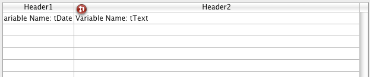
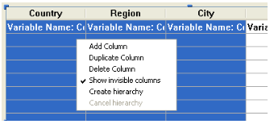
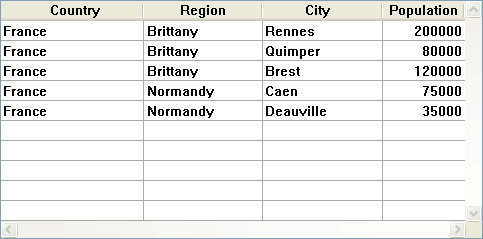
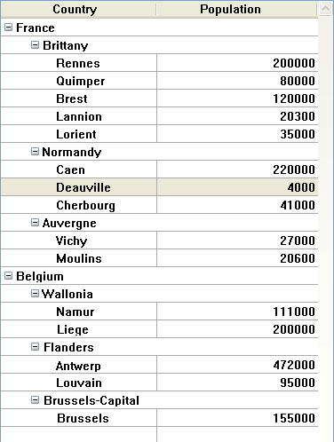
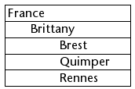
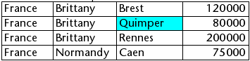

List boxes são objetos ativos complexos que permitem exibir e ingressar dados como colunas sincronizadas. Podem ser conectadas aos conteúdos de banco de dados como seleções de entidade e seleções de registro, ou para conteúdos de linguagem como coleções e arrays. Incluem as funcionalidades avançadas relativas à entrada de dados, classificação de colunas, gerenciamento de eventos, aspecto personalizado, movimentação de colunas, etc.


Uma list box contém uma ou mais colunas cujo conteúdos são automaticamente sincronizados. O número de colunas é teoricamente ilimitado (depende dos recursos da máquina).

## Visão Geral

### Funcionalidades de usuário básicas

Durante a execução, list boxes permitem exibir e ingressar dados como listas. Para tornar uma célula editável ([se a entrada for permitida para a coluna](#managing-entry)), basta clicar duas vezes no valor que ela contém:


Usuários podem ingressar e exibir o texto em várias linhas dentro de uma célula list box. Para adicionar uma quebra de linha pressione **Ctrl+Retorno de carro** em Windows ou **Opção+Retorno de Carro** em macOS.

Booleanos e imagens podem ser exibidos em células, assim como datas, horas ou números. É possível classificar os valores da coluna clicando em um cabeçalho ([classificação padrão](#managing-sorts)). Todas as colunas são sincronizadas automaticamente.

Também é possível redimensionar cada coluna, e o usuário pode modificar a ordem das [colunas](properties_ListBox.md#locked-columns-and-static-columns) e das [linhas](properties_Action.md#movable-rows) movendo-as com o mouse, se essa ação for autorizada. Observe que os list boxes podem ser usados no [modo hierárquico](#hierarchical-list-boxes).

O usuário pode selecionar um ou mais linhas usando os atalhos padrão: **Shift+clique** para uma seleção adjacente **Ctrl+clique** (Windows) ou **Comando+clique** (macOS) para uma seleção não adjacente.

### Partes de list box

Uma list box é composta de quatro partes diferentes:

- the [list box object](./listbox-object.md) in its entirety,
- [columns](./listbox-column.md),
- column [headers](./listbox-header-footer.md#headers), and
- column [footers](./listbox-header-footer.md#footers).


Cada parte tem seu próprio nome assim como propriedades específicas. Por exemplo, o número de colunas ou as cores alternativas de cada linha é estabelecida nas propriedades de objeto list box, a largura de cada coluna é estabelecida nas propriedades de colunas e a fonte do cabeçalho é estabelecida nas propriedades de cabeçalho.

É possível adicionar um método objeto para o objeto list box ou para cada coluna da list box. Métodos objetos são chamados na ordem abaixo:

1. Método objeto de cada coluna
2. Método objeto da list box

O método objeto de coluna obtém os eventos que ocorrem em seu [cabeçalho](./listbox-header-footer.md#headers) e [rodapé](./listbox-header-footer.md#footers).

### Tipos de List box

Há vários tipos de list boxes com seus próprios comportamentos e propriedades específicos. Há vários tipos de list boxes com seus próprios comportamentos e propriedades específicos.

- **Arrays**: cada coluna é vinculada a um array 4D. Os list boxes baseados em arrays podem ser exibidas como [list boxes hierárquicos](listbox_overview.md#hierarchical-list-boxes).
- **Seleção** (**Seleção atual** ou **Seleção temporária**): cada coluna é vinculada a uma expressão (por exemplo, um campo) avaliada para cada registro da seleção.
- **Coleção ou seleção de entidade**: cada coluna é conectada a uma expressão avaliada para todo elemento da coleção ou toda entidade da seleção de entidade.

> &#062; Não é possível combinar diferentes tipos de list box no mesmo objeto list box. A fonte de dados é estabelecida quando a list box é criada. Não é mais possível modificar por programação.

### Gerenciando list boxes

Pode configurar completamente um objeto list box através de suas propriedades e também pode gerenciar dinamicamente por programação.

Consulte a página [Resumo dos comandos List Box](https://doc.4d.com/4Dv20/4D/20.6/List-Box-Commands-Summary.300-7487600.en.html) da *Referência da linguagem 4D* para obter mais informações. The 4D Language includes a dedicated "List Box" theme for list box commands, but commands from various other themes, such as "Object properties" commands or [`EDIT ITEM`](../commands/edit-item), [`Displayed line number`](../commands/displayed-line-number) commands can also be used.

## Gerenciar entrada

Para uma célula list box ser editável, as duas condições abaixo devem ser atendidas:

- A coluna da célula deve ter sido definida como [Enterable](properties_Entry.md#enterable) (caso contrário, as células da coluna nunca poderão ser acessadas).
- No evento `On Before Data Entry`, $0 não retorna -1. Quando o cursor chega à célula, o evento `On Before Data Entry` é gerado no método da coluna. Se, no contexto desse evento, $0 for estabelecido a -1, a célula é considerada como não editável. Si el evento se generó después de presionar **Tab** o **Mayús+Tab**, el foco pasa a la siguiente celda o a la anterior, respectivamente. Se $0 não for -1 (como padrão $0 é 0), a célula for editável e trocar para o modo edição.

Vamos considerar o exemplo de uma lsit box contendo dois arrays: uma data e um texto. O array data não é editável mas o array texto é editável se a data não tiver sido passada.



Aqui está o método da coluna *arrText*:

```4d
Case of
    :(Form event=On Before Data Entry) // uma célua obtém o foco
       LISTBOX GET CELL POSITION(*;"lb";$col;$row)
  // identificação da célula       If(arrDate{$row}Current date) // se data for anterior que hoje
          $0:=-1 // célula NAO é editável
       Else
  // senão, célula é editável
       End if
 End case
```

O evento `No Antes da entrada de dados` é retornado antes de `Ao receber o foco`.

Para preservar consistência de dados para list boxes de tipo seleção e tipo seleção de entidade, qualquer registro/entidade modificada é automaticamente salva assim que a célula for validada, ou seja.:

- quando a célula for desativada (usuário pressiona tab, clica, etc)
- quando a listbox não estiver mais em foco,
- quando o formulário não tiver mais o foco.

A sequencia típica de eventos gerados durante a entrada de dados ou modificação é como a seguir:

| Ação                                                                                                                 | Tipos Listbox                        | Sequencia de eventos                                                                                                                                                                                                                                                                                            |
| -------------------------------------------------------------------------------------------------------------------- | ------------------------------------ | --------------------------------------------------------------------------------------------------------------------------------------------------------------------------------------------------------------------------------------------------------------------------------------------------------------- |
| Uma célula muda para o modo de edição (ação do usuário ou uma chamada para o comando `EDIT ITEM`) | Todos                                | On Before Data Entry                                                                                                                                                                                                                                                                                            |
|                                                                                                                      | Todos                                | On Getting Focus                                                                                                                                                                                                                                                                                                |
| Quando o valor foi modificado                                                                                        | Todos                                | On Before Keystroke                                                                                                                                                                                                                                                                                             |
|                                                                                                                      | Todos                                | On After Keystroke                                                                                                                                                                                                                                                                                              |
|                                                                                                                      | Todos                                | On After Edit                                                                                                                                                                                                                                                                                                   |
| Um usuário valida e deixa a célula                                                                                   | List box de tipo seleção             | Salvar                                                                                                                                                                                                                                                                                                          |
|                                                                                                                      | List box de tipo seleção de registro | Ativação de On saving an existing record (se estabelecido)                                                                                                                                                                                                                                   |
|                                                                                                                      | List box de tipo seleção             | On Data Change(\*)                                                                                                                                                                                                                                                                           |
|                                                                                                                      | List box de tipo seleção de entidade | Entidade é salva com opção autofusão, trancamento otimista (ver entitity.save()). No caso de salvamento com sucesso, a entidade é recarregada com a última atualização. Se a operação de salvar falhar, um erro é exibido |
|                                                                                                                      | Todos                                | On Losing Focus                                                                                                                                                                                                                                                                                                 |

(\*) Com list boxes de seleção de entidade, no evento On Data Change:

- o objeto [item atual](properties_DataSource.md#current-item) contém o valor antes da modificação.
- o objeto `This` contém o valor modificado.

> Entrada de dados em list boxes do tipo coleção/seleção de entidade tem uma limitação quando a expressão for analisada como null. Nesse caso, não é possível editar ou remover o valor null na célula.

## Gerenciar seleções

Seleções são gerenciadas diretamente, dependendo de se a list box é a baseada em um array, em uma seleção de registros ou em uma coleção/seleção de entidades:

- **Caixa de listagem de seleção**: As seleções são gerenciadas por um conjunto, que pode ser modificado se necessário, chamado `$ListboxSetX` por padrão (em que X começa em 0 e é incrementado com base no número de caixas de listagem no formulário). Esse conjunto é [definido nas propriedades](properties_ListBox.md#highlight-set) da caixa de listagem. É mantido automaticamente por 4D: se o usuário selecionar uma ou mais linhas na list box, o conjunto se atualiza imediatamente. Por outro lado, é também possível usar comandos do tema "Conjuntos" para modificar a seleção na list box via programação.

- **Caixa de listagem de seleção de coleção/entidade**: As seleções são gerenciadas por meio de propriedades dedicadas da caixa de listagem:
  - [Current item](properties_DataSource.md#current-item) é um objeto que receberá o elemento/entidade selecionado
  - [Itens selecionados](properties_DataSource.md#selected-items) é um objeto de seleção de coleção/entidade dos itens selecionados
  - [Current item position](properties_DataSource.md#current-item-position) retorna a posição do elemento ou da entidade selecionada.

- **List box de tipo array**: o comando `LISTBOX SELECT ROW` pode ser usado para selecionar uma ou mais linhas do list box por programação.
  A [variável vinculada ao objeto List box](properties_Object.md#variable-or-expression) é usada para obter, definir ou armazenar seleções de linhas do objeto.
  A [variável vinculada ao objeto List box](properties_Object.md#variable-or-expression) é usada para obter, definir ou armazenar seleções de linhas do objeto. Esta variável corresponde a um array de booleanos que é criado e mantido automaticamente por 4D. O tamanho deste array vem determinado pelo tamanho do list box: contém o mesmo número de elementos que o menor array associado às colunas.
  Cada elemento dessa matriz contém `True` se a linha correspondente for selecionada e `False` caso contrário. 4D atualiza o conteúdo deste array em função das ações de usuário. Do lado contrário, pode mduar o valor dos elementos array para mudar a seleção na list box.
  Mas não se pode inserir nem apagar linhas nesse array; nem se pode reescrever as linhas. O comando `Count in array` pode ser usado para descobrir o número de linhas selecionadas.
  Por exemplo, este método permite inverter a seleção da primeira línha de list box (tipo array):

```4d
 BOOLEANY ARRAY (tBListBox; 0)
  //tBListBox é o nome da variável da caixa de lista no formato
 If(tBListBox{1}=True)
    tBListBox{1}:=False
 Else
    tBListBox{1}:=Verdadeiro
 final, se
```

> The [`OBJECT SET SCROLL POSITION`](../commands/object-set-scroll-position) command scrolls the list box rows so that the first selected row or a specified row is displayed.

### Personalizar a aparência de linhas selecionadas

Quando a opção [Esconder destaque da seleção](properties_Appearance.md#hide-selection-highlight) estiver selecionada, você precisará tornar visíveis as seleções da caixa de listagem usando as opções de interface disponíveis. Como seleções não são gerenciadas totalmente por 4D, isso significa:

- Para array de tipo list boxes, deve analisar a variável array booleana associada com a list box para determinar quais linhas foram ou não selecionadas.
- Para caixas de listagem do tipo seleção, é necessário verificar se o registro atual (linha) pertence ao conjunto especificado na propriedade [Conjunto destacado](properties_ListBox.md#highlight-set) do list box.

Pode então definir cores de fundo especificas, cores de fonte ou estilos de fonte por programação para personalizar a aparência de linhas selecionadas. Isso pode ser feito usando arrays ou expressões, dependendo do tipo de list box sendo exibido (ver as seções abaixo).

> Você pode usar a constante `lk inherited` para imitar a aparência atual da caixa de listagem (por exemplo, cor da fonte, cor do plano de fundo, estilo da fonte etc.).

#### List box de tipo seleção

Para determinar quais linhas estão selecionadas, você deve verificar se elas estão incluídas no conjunto indicado na propriedade [Conjunto destacado](properties_ListBox.md#highlight-set) do list box. Pode então definir a aparência das linhas selecionadas usando um ou mais das cores ou estilos propriedades de estilo relevantes .

Lembre que essas expressões são automaticamente reavaliadas a cada vez que:

- a seleção de list box mudar.
- a list box obter ou perder o foco.
- a janela de formulário contendo a list box virar a janela mais à frente, ou deixar de estar à frente.

#### List box de tipo array

Você precisa analisar a matriz booleana [Variable or Expression](properties_Object.md#variable-or-expression) associada à caixa de listagem para determinar se as linhas estão selecionadas ou não.

Em seguida, você pode definir a aparência das linhas selecionadas usando uma ou mais das propriedades relevantes de [matriz de cores ou estilos](#using-arrays-and-expressions).

Observe que os conjuntos de caixas de listagem usados para definir a aparência das linhas selecionadas devem ser recalculados durante o evento de formulário `On Selection Change`; no entanto, você também pode modificar esses conjuntos com base nos seguintes eventos de formulário adicionais:

- `On Getting Focus` (propriedade da caixa de listagem)
- `On Losing Focus` (propiedad list box)
- `On Activate` (propiedad list box)
- `On Deactivate` (form property) ...depending on whether and how you want to visually represent changes of focus in selections.

##### Exemplo

Se escolher esconder os destaques do sistema e quiser exibir seleções de list box com uma cor de fundo verde, como mostrado aqui:


Para uma caixa de lista de tipos de matriz, você precisa atualizar a [matriz de cor de fundo da linha de fundo](properties_BackgroundAndBorder.md#row-background-color-array) pela programação. No formulário JSON, se definiu o array de cores de fundo seguinte para o list box:

```
	"rowFillSource": "_ListboxBackground",
```

No método de objeto da list box, pode escrever:

```4d
 Case of
    :(Form event=On Selection Change)
       $n:=Size of array(LB_Arrays)
       ARRAY LONGINT(_ListboxBackground;$n) // cores de fundo linha
       For($i;1;$n)
          If(LB_Arrays{$i}=True) // selecionado
             _ListboxBackground{$i}:=0x0080C080 // fundo verde
          Else // não selecionado
             _ListboxBackground{$i}:=lk inherited
          End if
       End for
 End case
```

Em uma caixa de listagem do tipo seleção, para produzir o mesmo efeito, você pode usar um método para atualizar a [Background Color Expression](properties_BackgroundAndBorder.md#background-color-expression) com base no conjunto especificado na propriedade [Conjunto destacado](properties_ListBox.md#highlight-set).

Por exemplo, no formulário JSON, se definiu  HIghlight Set e Background Color Expression para o list box:

```
	"highlightSet": "$SampleSet",
	"rowFillSource": "UI_SetColor",
```

Você pode escrever no método *UI_SetColor*:

```4d
 If(Is in set("$SampleSet"))
    $color:=0x0080C080 //  fundo verde
 Else
    $color:=lk inherited
 End if

 $0:=$color
```

> Em caixas de listagem hierárquicas, as linhas de quebra não podem ser destacadas quando a opção [Ocultar destaque de seleção](properties_Appearance.md#hide-selection-highlight) está marcada. Já que não é possível diferenciar cores de cabeçalho ao mesmo nível, não há uma maneira de ressaltar uma quebra de linha especifica por programação.

## Gestão de ordenações

Uma ordenação num list box pode ser padrão ou personalizada. Todas as colunas são sincronizadas automaticamente.

### Ordenação standard

como padrão, uma list box gerencia automaticamente ordenações de coluna padrão quando o cabeçalho for clicado. Uma ordenação normal é uma ordenação alfanumérica de valores de coluna, alternando entre ascendente e descendente com cada clique sucessivo.

Você pode ativar ou desativar a classificação padrão do usuário desativando a propriedade [Sortable](properties_Action.md#sortable) da caixa de listagem (ativada por padrão).

O suporte de ordenação padrão depende do tipo de list box:

| Tipo de list box              | Suporte de ordenação padrão | Comentários                                                                                                                                                                                                                                                                                                                                                                                                                                                                                                                                                                                                                                                            |
| ----------------------------- | --------------------------- | ---------------------------------------------------------------------------------------------------------------------------------------------------------------------------------------------------------------------------------------------------------------------------------------------------------------------------------------------------------------------------------------------------------------------------------------------------------------------------------------------------------------------------------------------------------------------------------------------------------------------------------------------------------------------- |
| Uma coleção de objetos        | Sim                         | <ul><li>As colunas "This.a" ou "This.a.b" são classificáveis.</li><li>A [propriedade de origem da list box](properties_Object.md#variable-or-expression) deve ser uma [expressão atribuível](../Concepts/quick-tour.md#assignable-vs-non-assignable-expressions).</li></ul>                                                                                                                                                                                                                                                                                                                                                                                            |
| Colecção de valores escalares | Não                         | Use a classificação personalizada com a função [`orderBy()`](../API/CollectionClass.md#orderby)                                                                                                                                                                                                                                                                                                                                                                                                                                                                                                                                                                        |
| Seleção de entidades          | Sim                         | <ul><li>The [list box source property](properties_Object.md#variable-or-expression) must be an [assignable expression](../Concepts/quick-tour.md#assignable-vs-non-assignable-expressions).</li><li>Supported: sorts on object attribute properties (e.g. "This.data.city" when "data" is an object attribute)</li><li>Supported: sorts on related attributes (e.g. "This.company.name")</li><li>Not supported: sorts on object attribute properties through related attributes (e.g. "This.company.data.city"). For this, you need to use custom sort with [`orderByFormula()`](../API/EntitySelectionClass.md#orderbyformula) function (see example below)</li></ul> |
| Selecção actual               | Sim                         | Somente expressões simples podem ser classificadas (por exemplo, `[Table_1]Field_2`)                                                                                                                                                                                                                                                                                                                                                                                                                                                                                                                                                                |
| Seleção temporal              | Não                         |                                                                                                                                                                                                                                                                                                                                                                                                                                                                                                                                                                                                                                                                        |
| Arrays                        | Sim                         | As colunas ligadas a arrays de imagens e ponteiros não podem ser ordenadas                                                                                                                                                                                                                                                                                                                                                                                                                                                                                                                                                                                             |

### Ordenação personalizada

O desenvolvedor pode configurar tipos personalizados, por exemplo, usando o comando [`LISTBOX SORT COLUMNS`](../commands/listbox-sort-columns) e/ou combinação dos eventos de formulário [`On Header Click`](../Events/onHeaderClick) e [`On After Sort`](../Events/onAfterSort) e comandos 4D relevantes.

As ordenações personalizadas permitem-lhe:

- realizar classificações em vários níveis em várias colunas, graças ao comando [`LISTBOX SORT COLUMNS`](../commands/listbox-sort-columns),
- utilize funções como [`collection.orderByMethod()`](../API/CollectionClass.md#orderbymethod) ou [`entitySelection.orderByFormula()`](../API/EntitySelectionClass.md#orderbyformula) para classificar colunas com base em critérios complexos.

#### Exemplo

Você deseja classificar um list box usando valores de uma propriedade armazenada em um atributo de objeto relacionado. Tem a seguinte estrutura:


Você projeta uma caixa de lista do tipo de seleção de entidades, vinculada à expressão `Form.child`. No evento de formulário `On Load`, você executa `Form.child:=ds.Child.all()`.

São exibidas duas colunas:

| Negrito     | Apelido do progenitor        |
| ----------- | ---------------------------- |
| `This.name` | `This.parent.extra.nickname` |

Se quiser ordenar o list box utilizando os valores da segunda coluna, tem de escrever:

```4d
If (Form event code=On Header Click)
	Form.child:=Form.child.orderByFormula("This.parent.extra.nickname"; dk ascending)
End if
```

### Variável de cabeçalho de coluna

O valor da [variável de cabeçalho de coluna](properties_Object.md#variable-or-expression) permite que você gerencie informações adicionais: a classificação atual da coluna (leitura) e a exibição da seta de classificação.

- Se a variável for estabelecida como 0, a coluna não é ordenada e a flecha de ordenação não é exibida;  
  

- Se a variável for estabelecida como 2, a coluna é ordenada de forma descendente e a flecha de ordenação é exibida.  
  

- Se a variável for definida como 1, a coluna será classificada em ordem crescente e a seta de classificação será exibida.  
  

> Somente [variáveis] declaradas ou dinâmicas (Concepts/variables.md) podem ser usadas como variáveis de coluna de cabeçalho. Outros tipos de [expressions](Aceitações/quick-tour.md#expressions) como `Form.sortValue` não são suportados.

Pode estabelecer o valor da variável (por exemplo, Header2:=2) para  “forçar” a exibição da flecha de ordenação. A ordenação de coluna não é modificada nesse caso; depende do desenvolvedor como vai manejá-la.

> O comando [`OBJECT SET FORMAT`](../commands/object-set-format) oferece suporte específico para ícones em cabeçalhos de list box, o que pode ser útil quando você deseja trabalhar com um ícone de classificação personalizado.

## Gerenciar cores linha, estilos e exibição

Aqui estão algumas maneiras de estabelecer cores de fundo, cores de fonte e estilos de fonte para list boxes:

- no nível das [propriedades do objeto list box](./listbox-object.md),
- no nível das [propriedades da coluna](./listbox-column.md),
- usando [propriedades de matrizes ou expressões](#using-arrays-and-expressions) para o list box e/ou para cada coluna,
- no nível do texto de cada célula (se [texto multi-estilo](properties_Text.md#multi-style)).

### Prioridade e herança

Princípios de prioridade e herança são observados quando a mesma propriedade for estabelecida em mais de um nível.

1. (highest priority) Cell (if multi-style text)
2. Arrays/métodos de coluna
3. Arrays/métodos de Listbox
4. Propriedades da coluna
5. Propriedades de list box
6. (lowest priority) Meta Info expression (for collection or entity selection list boxes)

Por exemplo se estabelecer um estilo de fonte nas propriedades de list box e outro usando um array estilo para a coluna, este último será levado em consideração.

Para cada atributo (estilo, cor e cor de fundo), uma **herança** é implementada quando o valor padrão é usado:

- Para atributos de célula: atributos valores de linhas
- para atributos linhas: valores de atributos de colunas
- para atributos coluna: valores atributos no list box

Dessa maneira se quiser que um objeto herde o valor de atributo de um nível superior, pode usar a constante `lk inherited` (valor padrão) à definição de comando ou diretamente no elemento do array correspondente de estilo/cor. Por exemplo dado um list box array contendo um estilo de fonte padrão com cores alternantes:


Pode realizar as modificações abaixo:

- Mude o fundo da linha 2 para vermelho usando a propriedade [Linha de Cor de Fundo Array](properties_BackgroundAndBorder.md#row-background-color-array) do objeto caixa de lista,
- altere o estilo de linha 4 para itálico usando a propriedade [Linha de Estilo Array](properties_Text.md#row-style-array) do objeto caixa de lista,
- dois elementos na coluna 5 são alterados para negrito usando a propriedade [Matriz de Estilo da Linha](properties_Text.md#row-style-array) do objeto da coluna 5,
- os 2 elementos da coluna 1 e 2 são alterados para azul escuro usando a propriedade [Row Background Color Array](properties_BackgroundAndBorder.md#row-background-color-array) para os objetos da coluna 1 e 2:


Para restaurar a aparência original da list box, é possível:

- passe a constante `lk inherited` no elemento 2 das matrizes de cores de fundo para as colunas 1 e 2: então elas herdarão a cor de fundo vermelha da linha.
- passe a constante `lk inherited` nos elementos 3 e 4 da matriz de estilo da coluna 5: então eles herdam o estilo padrão, exceto o elemento 4, que muda para itálico conforme especificado na matriz de estilo da caixa de listagem.
- passar a constante 'lk herdado' no elemento 4 da matriz de estilo para a caixa de lista a fim de remover o estilo itálico.
- passe a constante `lk inherited` no elemento 2 da matriz de cores de fundo da caixa de listagem para restaurar a cor alternada original da caixa de listagem.

### Usar arrays e expressões

Dependendo do tipo de list box, pode usar diferentes propriedades para personalizar cores de linha, estilos e exibição:

| Propriedade     | List box array                                                                             | List box seleção                                                                           | List box coleção ou entity selection                                                                                                                            |
| --------------- | ------------------------------------------------------------------------------------------ | ------------------------------------------------------------------------------------------ | --------------------------------------------------------------------------------------------------------------------------------------------------------------- |
| Cor de fundo    | [Row Background Color Array](properties_BackgroundAndBorder.md#row-background-color-array) | [Expressão de cor de fundo](properties_BackgroundAndBorder.md#background-color-expression) | [Background Color Expression](properties_BackgroundAndBorder.md#background-color-expression) ou [Meta info expression](properties_Text.md#meta-info-expression) |
| Cor de fundo    | [Row Font Color Array](properties_Text.md#row-font-color-array)                            | [Expressão de Cor da Fonte](properties_Text.md#font-color-expression)                      | [Font Color Expression](properties_Text.md#font-color-expression) ou [Meta info expression](properties_Text.md#meta-info-expression)                            |
| Estilo de letra | [Row Style Array](properties_Text.md#row-style-array)                                      | [Expressão de estilo](properties_Text.md#style-expression)                                 | [Style Expression](properties_Text.md#style-expression) ou [Meta info expression](properties_Text.md#meta-info-expression)                                      |
| Visualização    | [Row Control Array](properties_ListBox.md#row-control-array)                               | -                                                                                          | -                                                                                                                                                               |

## Imprimir list boxes

Há dois modos de impressão disponíveis: **modo de visualização** - que pode ser usado para imprimir uma caixa de listagem como um objeto de formulário, e **modo avançado** - que permite controlar a impressão do próprio objeto da caixa de listagem dentro do formulário. Note que a aparência "Impressão" está disponível para objetos list box no editor de Formulário.

### Modo de vista previa

A impressão de uma caixa de listagem no modo de visualização consiste em imprimir diretamente a caixa de listagem e o formulário que a contém usando os comandos de impressão padrão ou o comando de menu **Print**. A list box é impressa como no formulário. Esse modo não permite controle preciso da impressão do objeto, especialmente não permite imprimir todas as linhas da list box que contenham mais linhas que podem ser exibidas.

### Modo avançado

Nesse modo, a impressão de caixas de listagem é realizada por programação, por meio do comando `Print object` (há suporte para formulários de projeto e formulários de tabela). The [`LISTBOX GET PRINT INFORMATION`](../commands/listbox-get-print-information) command is used to control the printing of the object.

Nesse modo:

- A altura do objeto list box é reduzida automaticamente quando o número de linhas a ser impresso for menor que a altura original do objeto (não há linhas "em branco" impressas). Por outro lado a altura não aumenta automaticamente de acordo com os conteúdos do objeto. The size of the object actually printed can be obtained via the [`LISTBOX GET PRINT INFORMATION`](../commands/listbox-get-print-information) command.
- The list box object is printed "as is", in other words, taking its current display parameters into account: visibility of headers and gridlines, hidden and displayed rows, etc. These parameters also include the first row to be printed: if you call the <code>OBJECT SET SCROLL POSITION</code> command before launching the printing, the first row printed in the list box will be the one designated by the command.
  These parameters also include the first row to be printed: if you call the [`OBJECT SET SCROLL POSITION`](../commands/object-set-scroll-position) command before launching the printing, the first row printed in the list box will be the one designated by the command.
- Um mecanismo automático facilita a impressão de caixas de listagem que contêm mais linhas do que é possível exibir: chamadas sucessivas para `Print object` podem ser usadas para imprimir um novo conjunto de linhas a cada vez. The [`LISTBOX GET PRINT INFORMATION`](../commands/listbox-get-print-information) command can be used to check the status of the printing while it is underway.

## List box hierárquicos.

Uma list box hierárquica é uma list box na qual o conteúdo da primeira coluna aparece em forma hierárquica. Esse tipo de representação se adapta à apresentação de informação que inclua valores repetidos ou que dependem de hierarquias (país/região/cidade e assim por diante).

> Apenas [caixas de lista de tipos de arrays](#array-list-boxes) podem ser hierárquicas.

As caixas de listagem hierárquica são uma forma particular de representar dados, mas não modificam a estrutura de dados (matrizes). As caixas de listagem hierárquica são geridas exactamente da mesma forma que as caixas de listagem normais.

### Definir a hierarquia

Para definir uma list box hierárquica há várias possibilidades:

- Configurar manualmente os elementos hierárquicos usando a lista Propriedade no editor de formulário (ou editar o formulário JSON).
- Gerar visualmente a hierarquia usando o menu emergente de gestão de list box no editor de formulários.
- Use the [`LISTBOX SET HIERARCHY`](../commands/listbox-set-hierarchy) and [`LISTBOX GET HIERARCHY`](../commands/listbox-get-hierarchy) commands.

#### Propriedades de List Box hierárquico

Essa propriedade especifica que o list box deve ser exibido em forma hierárquica. No formulário JSON, esse recurso é acionado [quando o valor da propriedade *dataSource* da coluna é um array](properties_Object.md#array-list-box), ou seja, uma coleção.

Opções adicionais (**Variável 1...10**) estão disponíveis quando a opção *List Box hierárquico* é selecionada, correspondendo a cada elemento da array *dataSource* a ser usada como coluna de quebra. A cada vez que um valor é digitado em um campo, uma nova linha é adicionada. Podem ser especificadas até 10 variáveis. Essas variáveis estabelecem os níveis hierárquicos a serem exibidos na primeira coluna.

A primeira variável sempre corresponde ao nome da variável para a primeira coluna da list box (os dois valores são automaticamente conectados) Essa primeira variável é sempre visível e editável. Essa primeira variável é sempre visível e editável. Por exemplo: country.
A segunda variável é sempre visível e editável: especifica o segundo nível hierárquico. Por exemplo: regions.
A partir do terceiro campo, cada variável depende da variável que a antecedeu. Por exemplo: countries, cities etc. Por exemplo: countries, cities etc. Pode ser especificado um máximo de dez níveis hierárquicos. Se remover um valor, a hierarquia inteira move um nível para cima.

A última variável nunca é hierárquica mesmo se vários valores idênticos existirem nesse nível. Por exemplo, referindo-se à configuração ilustrada acima, imagine que arr1 contém os valores  A A A B B B, arr2 tenha os valores 1 1 1 2 2 2 e arr3 os valores X X Y Y Y Z. Neste caso, A, B, 1 e 2 poderiam aparecer na forma colapsada, mas não  X e Y:


Esse princípio não é aplicado quando apenas uma variável for especificada na hierarquia: nesse caso, valores idênticos podem ser agrupados.

> Se especificar uma hierarquia baseada nas primeiras colunas de uma list box existente, deve então remover ou esconder essas colunas (exceto a primeira) senão vão aparecer de forma duplicada na list box. Se especificar a hierarquia via o menu pop up do editor (ver abaixo), as colunas desnecessárias serão removidas automaticamente da list box.

#### Crie hierarquias usando o menu contextual

Quando se seleciona pelo menos uma coluna para além da primeira num objeto list box (do tipo array) no editor de formulários, o comando **Criar hierarquia** está disponível no menu de contexto:



Este comando é um atalho para definir a hierarquia. Quando for selecionado, as ações a seguir são realizadas:

- A opção **List box hierárquico** é marcada para o objeto na Lista de propriedades.
- As variváveis das colunas são usadas para especificar a hierarquia. Elas substituem qualquer variável já especificada.
- As colunas selecionadas não aparecem mais na list box (exceto para o título da primeira).

Exemplo: dado uma list box cujas primeiras colunas contém País, região, cidade e população. Quando País, região e cidade forem selecionadas, se escolher **Criar hierarquia** no menu contextual, uma hierarquia de três níveis é criada na primeira coluna, colunas número 2 e 3 são removidas e a coluna População vira a segunda:


##### Cancelar hierarquia

Quando a primeira coluna for selecionada e especificada como hierárquica pode usar o comando **Cancelar hierarquia**. Quando selecionar este comando, as ações abaixo serão realizadas:

- A opção **Hierarchical list box** é desmarcada para o objeto,
- Os níveis hierárquicos 2 a X são removidos e transformados em colunas adicionadas à list box.

### Como funciona

Quando um formulário que conter uma list box hierárquica for aberto pela primeira vez, como padrão todas as linhas são expandidas.

Uma linha de quebra e um "nó" hierárquico são automaticamente adicionados na caixa de listagem quando os valores são repetidos nas matrizes. Por exemplo, imagine uma caixa de listagem contendo quatro arrays especificando cidades, sendo cada cidade caracterizada pelo seu país, a sua região, o seu nome e o seu número de habitantes:



Se esta caixa de listagem for apresentada de forma hierárquica (sendo as três primeiras arrays incluídas na hierarquia), obtém-se:


Os arrays não são ordenadas antes de a hierarquia ser construída. Se, por exemplo, uma matriz contiver os dados AAABBAACC, a hierarquia obtida será:
\> A
\> B
\> A
\> C

Para expandir ou colapsar um "nó" hierárquico, pode simplesmente clicar sobre ele. Se você **Alt+click** (Windows) ou **Option+click** (macOS) no nó, todos os seus subelementos também serão expandidos ou recolhidos. Essas operações também podem ser executadas por meio de programação, usando os comandos `LISTBOX EXPAND` e `LISTBOX COLLAPSE`.

Quando valores do tipo de data ou hora são incluídos numa caixa de listagem hierárquica, eles são exibidos no formato de sistema curto.

#### Ordenar em caixas de listagem hierárquica

Numa caixa de listagem em modo hierárquico, uma ordenação padrão (realizada clicando no cabeçalho de uma coluna da caixa de listagem) é sempre construída da seguinte forma:

- Em primeiro lugar, todos os níveis da coluna hierárquica (primeira coluna) são automaticamente ordenados por ordem ascendente.
- A ordenação é então efectuada por ordem ascendente ou descendente (de acordo com a acção do utilizador) sobre os valores da coluna que foi clicada.
- Todas as colunas são sincronizadas.
- Durante ordenações posteriores realizadas em colunas não hierárquicas da caixa de listagem, apenas o último nível da primeira coluna é classificado. É possível modificar a ordenação desta coluna, clicando no seu cabeçalho.

Dada, por exemplo, a seguinte caixa de listagem, na qual não é especificado nenhum tipo específico:



Se clicar no cabeçalho "População" para ordenar as populações por ordem ascendente (ou alternadamente descendente), os dados aparecem como se segue:


Quanto a todas os list boxes, você pode [desativar o mecanismo de classificação padrão](properties_Action.md#sortable) e gerenciar as classificações usando programação.

#### Seleções e posições em caixas de listagem hierárquica

Uma caixa de listagem hierárquica exibe um número variável de linhas na tela, de acordo com o estado expandido/colocado dos nós hierárquicos. Isto não significa, contudo, que o número de filas das matrizes varie. Apenas o visor é modificado, não os dados. É importante compreender este princípio porque a gestão programada das caixas de listagem hierárquica é sempre baseada nos dados das matrizes, não nos dados apresentados. Em particular, as linhas de intervalo adicionadas automaticamente não são tidas em conta nas matrizes de opções de visualização (ver abaixo).

Vejamos, por exemplo, as seguintes matrizes:


Se estes conjuntos forem representados hierarquicamente, a linha "Quimper" não será exibida na segunda linha, mas sim na quarta, devido às duas linhas de interrupção que são adicionadas:



Independentemente de como os dados são exibidos na caixa da lista (hierarquicamente ou não), se quiser alterar a linha que contém "Quimper" para negrito, deve utilizar a declaração Style{2} = negrito. Apenas a posição da fila nas matrizes é tida em conta.

Este princípio é implementado para as matrizes internas que podem ser utilizadas para gerir:

- cores

- cores de fundo

- estilos

- filas ocultas

- seleções

Por exemplo, se quiser seleccionar a fila que contém Rennes, deve passar:

```4d
 ->MyListbox{3}:=True
```

*Non-hierarchical representation:*  


*Hierarchical representation:*  


> Se uma ou mais filas estiverem escondidas porque os seus pais estão desmoronados, já não são seleccionados. Apenas as linhas visíveis (directamente ou por rolagem) podem ser seleccionadas. Por outras palavras, as filas não podem ser tanto escondidas como seleccionadas.

As with selections, the [`LISTBOX GET CELL POSITION`](../commands/listbox-get-cell-position) command will return the same values for a hierarchical list box and a non-hierarchical list box. This means that in both of the examples below, [`LISTBOX GET CELL POSITION`](../commands/listbox-get-cell-position) will return the same position: (3;2).

*Non-hierarchical representation:*  


*Hierarchical representation:*  


Quando todas as filas de uma sub-hierarquia estão escondidas, a linha de quebra é automaticamente escondida. No exemplo acima, se as linhas 1 a 3 estiverem escondidas, a linha de quebra "Bretanha" não aparecerá.

#### Linhas de quebra

If the user selects a break row, [`LISTBOX GET CELL POSITION`](../commands/listbox-get-cell-position) returns the first occurrence of the row in the corresponding array. No caso seguinte:


... [`LISTBOX GET CELL POSITION`](../commands/listbox-get-cell-position) returns (2;4). To select a break row by programming, you will need to use the [`LISTBOX SELECT BREAK`](../commands/listbox-select-break) command.

As linhas de quebra não são tidas em conta nos arrays internos utilizados para gerir o aspecto gráfico das caixas de listagem (estilos e cores). No entanto, é possível modificar estas características para linhas de quebra através dos comandos de gestão gráfica dos objectos. Basta executar os comandos apropriados nas matrizes que constituem a hierarquia.

Dada, por exemplo, a seguinte caixa de listagem (os nomes dos arrays associados são especificados entre parênteses):

*Non-hierarchical representation:*  


*Hierarchical representation:*  


No modo hierárquico, os níveis de interrupção não são levados em consideração pelas matrizes de modificação de estilo denominadas `tStyle` e `tColors`. Para modificar a cor ou o estilo dos níveis de quebra, é necessário executar as seguintes declarações:

```4d
 OBJECT SET RGB COLORS(T1;0x0000FF;0xB0B0B0)
 OBJECT SET FONT STYLE(T2;Bold)
```

> Neste contexto, apenas a sintaxe usando a variável array pode funcionar com os comandos de propriedade do objecto porque as arrays não têm nenhum objecto associado.

Resultados:


#### Gestão otimizada da expansão/colapso

Pode optimizar a exibição e gerenciamento de caixas de listagem hierárquica usando os eventos de formulário `On Expand` e `On Collapse`.

Uma caixa de listagem hierárquica é construída a partir do conteúdo de seus arrays de modo a só poder ser exibida quando todas estas matrizes são carregadas na memória. Uma caixa de listagem hierárquica é construída a partir do conteúdo de seus arrays de modo a só poder ser exibida quando todas estas matrizes são carregadas na memória.

Usando os formulários `On Expand` e `On Collapse`, os eventos podem ultrapassar estas restrições: por exemplo, é possível exibir apenas parte da hierarquia e carregar/descarregar as arrays a qualquer momento, com base nas ações dos usuários. In the context of these events, the [`LISTBOX GET CELL POSITION`](../commands/listbox-get-cell-position) command returns the cell where the user clicked in order to expand or collapse a row.

Neste caso, é necessário preencher e esvaziar os arrays através do código. Os princípios a serem implementados são os seguintes:

- Quando a list box é exibido, somente o primeiro array deve ser preenchido. However, you must create a second array with empty values so that the list box displays the expand/collapse buttons:  
  

- Quando um usuário clicar num botão de expansão, pode processar o evento `On Expand`. The [`LISTBOX GET CELL POSITION`](../commands/listbox-get-cell-position) command returns the cell concerned and lets you build the appropriate hierarchy: you fill the first array with the repeated values and the second with the values sent from the [`SELECTION TO ARRAY`](../commands/selection-to-array) command and you insert as many rows as needed in the list box using the [`LISTBOX INSERT ROWS`](../commands/listbox-insert-rows) command.  
  

- Quando um usuário clicar num botão de colapso, pode processar o evento `On Collapse`. The [`LISTBOX GET CELL POSITION`](../commands/listbox-get-cell-position) command returns the cell concerned: you remove as many rows as needed from the list box using the [`LISTBOX DELETE ROWS`](../commands/listbox-delete-rows) command.

## List boxes and the 4D language

Many commands of the 4D language can be used with list boxes, from the [List box theme](../commands/theme/List_Box.md) but also from [Objects (Forms)](../commands/theme/Objects_Forms.md) and other themes. They can be used with list boxes, or [parts of list boxes](#list-box-parts) such as headers, footers, rows, or columns. Some of them can only be used with specific [list box types](#list-box-types).

### List Box commands

| Comando                                                                          | List Box Type                | Supported Parts                           |
| -------------------------------------------------------------------------------- | ---------------------------- | ----------------------------------------- |
| [`LISTBOX COLLAPSE`](../commands/listbox-collapse)                               | Hierarchical                 | List box, headers, footers, rows, columns |
| [`LISTBOX DELETE COLUMN`](../commands/listbox-delete-column)                     | Todos                        | Colunas                                   |
| [`LISTBOX DELETE ROWS`](../commands/listbox-delete-rows)                         | Array                        | List box, headers, footers, rows, columns |
| [`LISTBOX DUPLICATE COLUMN`](../commands/listbox-duplicate-column)               | Array, Selection, Collection | Colunas                                   |
| [`LISTBOX EXPAND`](../commands/listbox-expand)                                   | Hierarchical                 | List box, headers, footers, rows, columns |
| [`LISTBOX Get array`](../commands/listbox-get-array)                             | Array                        | List box, headers, footers, rows, columns |
| [`LISTBOX GET ARRAYS`](../commands/listbox-get-arrays)                           | Todos                        | List box, headers, footers, rows, columns |
| [`LISTBOX Get auto row height`](../commands/listbox-get-auto-row-height)         | Array                        | List box, headers, footers, rows, columns |
| [`LISTBOX GET CELL COORDINATES`](../commands/listbox-get-cell-coordinates)       | Todos                        | List box, headers, footers, rows, columns |
| [`LISTBOX GET CELL POSITION`](../commands/listbox-get-cell-position)             | Todos                        | List box, headers, footers, rows, columns |
| [`LISTBOX Get column formula`](../commands/listbox-get-column-formula)           | Selection, Collection        | Colunas                                   |
| [`LISTBOX Get column width`](../commands/listbox-get-column-width)               | Todos                        | Colunas                                   |
| [`LISTBOX Get footer calculation`](../commands/listbox-get-footer-calculation)   | Array, Selection             | Rodapés                                   |
| [`LISTBOX Get footers height`](../commands/listbox-get-footers-height)           | Todos                        | Rodapés                                   |
| [`LISTBOX GET GRID`](../commands/listbox-get-grid)                               | Todos                        | List box, headers, footers, rows, columns |
| [`LISTBOX GET GRID COLORS`](../commands/listbox-get-grid-colors)                 | Todos                        | List box, headers, footers, rows, columns |
| [`LISTBOX Get headers height`](../commands/listbox-get-headers-height)           | Todos                        | Cabeçalhos                                |
| [`LISTBOX GET HIERARCHY`](../commands/listbox-get-hierarchy)                     | Array                        | List box, headers, footers, rows, columns |
| [`LISTBOX Get locked columns`](../commands/listbox-get-locked-columns)           | Todos                        | List box                                  |
| [`LISTBOX Get number of columns`](../commands/listbox-get-number-of-columns)     | Todos                        | List box                                  |
| [`LISTBOX GET OBJECTS`](../commands/listbox-get-objects)                         | Todos                        | List box                                  |
| [`LISTBOX GET PRINT INFORMATION`](../commands/listbox-get-print-information)     | Todos                        | List box, headers, footers, rows, columns |
| [`LISTBOX Get property`](../commands/listbox-get-property)                       | Todos                        | List box, columns                         |
| [`LISTBOX Get row color as number`](../commands/listbox-get-row-color-as-number) | Array                        | Linhas                                    |
| [`LISTBOX Get row font style`](../commands/listbox-get-row-font-style)           | Array                        | Linhas                                    |
| [`LISTBOX Get row height`](../commands/listbox-get-row-height)                   | Array                        | Linhas                                    |
| [`LISTBOX Get rows height`](../commands/listbox-get-rows-height)                 | Todos                        | List box                                  |
| [`LISTBOX Get static columns`](../commands/listbox-get-static-columns)           | Todos                        | List box                                  |
| [`LISTBOX GET TABLE SOURCE`](../commands/listbox-get-table-source)               | Todos                        | List box                                  |
| [`LISTBOX INSERT COLUMN`](../commands/listbox-insert-column)                     | Todos                        | List box                                  |
| [`LISTBOX INSERT COLUMN FORMULA`](../commands/listbox-insert-column-formula)     | Todos                        | List box                                  |
| [`LISTBOX INSERT ROWS`](../commands/listbox-insert-rows)                         | Array                        | List box                                  |
| [`LISTBOX MOVE COLUMN`](../commands/listbox-move-column)                         | Todos                        | Colunas                                   |
| [`LISTBOX MOVED COLUMN NUMBER`](../commands/listbox-moved-column-number)         | Todos                        | Colunas                                   |
| [`LISTBOX MOVED ROW NUMBER`](../commands/listbox-moved-row-number)               | Array                        | Linhas                                    |
| [`LISTBOX SELECT BREAK`](../commands/listbox-select-break)                       | Hierarchical                 | List box                                  |
| [`LISTBOX SELECT ROW`](../commands/listbox-select-row)                           | Todos                        | Linhas                                    |
| [`LISTBOX SET ARRAY`](../commands/listbox-set-array)                             | Array                        | List box, columns                         |
| [`LISTBOX SET AUTO ROW HEIGHT`](../commands/listbox-set-auto-row-height)         | Array                        | Linhas                                    |
| [`LISTBOX SET COLUMN FORMULA`](../commands/listbox-set-column-formula)           | Selection, Collection        | Colunas                                   |
| [`LISTBOX SET COLUMN WIDTH`](../commands/listbox-set-column-width)               | Todos                        | Colunas                                   |
| [`LISTBOX SET FOOTER CALCULATION`](../commands/listbox-set-footer-calculation)   | Array, Selection             | Rodapés                                   |
| [`LISTBOX SET FOOTERS HEIGHT`](../commands/listbox-set-footers-height)           | Todos                        | Rodapés                                   |
| [`LISTBOX SET GRID`](../commands/listbox-set-grid)                               | Todos                        | List box                                  |
| [`LISTBOX SET GRID COLOR`](../commands/listbox-set-grid-color)                   | Todos                        | List box                                  |
| [`LISTBOX SET HEADERS HEIGHT`](../commands/listbox-set-headers-height)           | Todos                        | Cabeçalhos                                |
| [`LISTBOX SET HIERARCHY`](../commands/listbox-set-hierarchy)                     | Array                        | List box                                  |
| [`LISTBOX SET LOCKED COLUMNS`](../commands/listbox-set-locked-columns)           | Todos                        | List box                                  |
| [`LISTBOX SET PROPERTY`](../commands/listbox-set-property)                       | Todos                        | List box, columns                         |
| [`LISTBOX SET ROW COLOR`](../commands/listbox-set-row-color)                     | Array                        | Linhas                                    |
| [`LISTBOX SET ROW FONT STYLE`](../commands/listbox-set-row-font-style)           | Array                        | Linhas                                    |
| [`LISTBOX SET ROW HEIGHT`](../commands/listbox-set-row-height)                   | Array                        | Linhas                                    |
| [`LISTBOX SET ROWS HEIGHT`](../commands/listbox-set-rows-height)                 | Todos                        | List box                                  |
| [`LISTBOX SET STATIC COLUMNS`](../commands/listbox-set-static-columns)           | Todos                        | List box                                  |
| [`LISTBOX SET TABLE SOURCE`](../commands/listbox-set-table-source)               | Seleção                      | List box                                  |
| [`LISTBOX SORT COLUMNS`](../commands/listbox-sort-columns)                       | Todos                        | Colunas                                   |

### Miscellaneous commands

| Comando                                                      | List Box Type    | Supported Parts                           | Comentários                                                                                                                                                                               |
| ------------------------------------------------------------ | ---------------- | ----------------------------------------- | ----------------------------------------------------------------------------------------------------------------------------------------------------------------------------------------- |
| [`EDIT ITEM`](../commands/edit-item)                         | Todos            | Colunas                                   | Allows you to pass a cell of a list box object into edit mode                                                                                                                             |
| [`Get edited text`](../commands/get-edited-text)             | Todos            | List box, headers, footers, rows, columns |                                                                                                                                                                                           |
| [`REDRAW`](../commands/redraw)                               | Array, Selection | List box                                  | When applied to a selection list box, triggers an update of the data displayed in the list box. Not supported with list box of the entity selection type. |
| [`Displayed line number`](../commands/displayed-line-number) | Todos            | List box, headers, footers, rows, columns | Works in the context of the [`On Display Detail`](../Events/onDisplayDetail.md) form event for a list box object                                                                          |
| [`Drop position`](../commands/drop-position)                 | Todos            | List box, headers, footers, rows, columns |                                                                                                                                                                                           |
| [`Count in array`](../commands/count-in-array)               | Todos            | List box, headers, footers, rows, columns |                                                                                                                                                                                           |
| [`Print object`](../commands/print-object)                   | Todos            | List box, headers, footers, rows, columns |                                                                                                                                                                                           |

### Object (forms) commands

| Comando                                                                                    | List Box Type | Supported Parts                                                                                                    |
| ------------------------------------------------------------------------------------------ | ------------- | ------------------------------------------------------------------------------------------------------------------ |
| [`OBJECT DUPLICATE`](../commands/object-duplicate)                                         | Todos         | List box, headers, footers, rows, columns                                                                          |
| [`OBJECT GET BEST SIZE`](../commands/object-get-best-size)                                 | Todos         | Colunas                                                                                                            |
| [`OBJECT Get border style`](../commands/object-get-border-style)                           | Todos         | List box, headers, footers, rows, columns                                                                          |
| [`OBJECT GET COORDINATES`](../commands/object-get-coordinates)                             | Todos         | List box, headers, footers, rows, columns                                                                          |
| [`OBJECT Get data source`](../commands/object-get-data-source)                             | Array         | List box                                                                                                           |
| [`OBJECT GET DRAG AND DROP OPTIONS`](../commands/object-get-drag-and-drop-options)         | Todos         | List box, headers, footers, rows, columns                                                                          |
| [`OBJECT Get enterable`](../commands/object-get-enterable)                                 | Todos         | Colunas                                                                                                            |
| [`OBJECT Get filter`](../commands/object-get-filter)                                       | Todos         | Colunas                                                                                                            |
| [`OBJECT Get focus rectangle invisible`](../commands/object-get-focus-rectangle-invisible) | Todos         | List box, headers, footers, rows, columns                                                                          |
| [`OBJECT Get font`](../commands/object-get-font)                                           | Todos         | List box, headers, footers, rows, columns                                                                          |
| [`OBJECT Get font size`](../commands/object-get-font-size)                                 | Todos         | List box, headers, footers, rows, columns                                                                          |
| [`OBJECT Get font style`](../commands/object-get-font-style)                               | Todos         | List box, headers, footers, rows, columns                                                                          |
| [`OBJECT Get format`](../commands/object-get-format)                                       | Todos         | Cabeçalhos                                                                                                         |
| [`OBJECT Get help tip`](../commands/object-get-help-tip)                                   | Todos         | Headers, footers                                                                                                   |
| [`OBJECT Get horizontal alignment`](../commands/object-get-horizontal-alignment)           | Todos         | List box, headers, footers, columns                                                                                |
| [`OBJECT Get list reference`](../commands/object-get-list-reference)                       | Todos         | Colunas                                                                                                            |
| [`OBJECT Get name`](../commands/object-get-name)                                           | Todos         | List box, headers, footers, rows, columns                                                                          |
| [`OBJECT Get pointer`](../commands/object-get-pointer)                                     | Todos         | List box, headers, footers, rows, columns (see below)                                           |
| [`OBJECT GET RESIZING OPTIONS`](../commands/object-get-resizing-options)                   | Todos         | List box, headers, footers, rows, columns                                                                          |
| [`OBJECT GET RGB COLORS`](../commands/object-get-rgb-colors)                               | Todos         | List box, headers, footers, rows, columns                                                                          |
| [`OBJECT GET SCROLL POSITION`](../commands/object-get-scroll-position)                     | Todos         | List box                                                                                                           |
| [`OBJECT GET SCROLLBAR`](../commands/object-get-scrollbar)                                 | Todos         | List box                                                                                                           |
| [`OBJECT Get type`](../commands/object-get-type)                                           | Todos         | List box, headers, footers, columns                                                                                |
| [`OBJECT Get vertical alignment`](../commands/object-get-vertical-alignment)               | Todos         | List box, headers, footers, columns                                                                                |
| [`OBJECT MOVE`](../commands/object-move)                                                   | Todos         | List box, headers, footers, rows, columns                                                                          |
| [`OBJECT SET COLOR`](../commands/object-set-color)                                         | Todos         | List box, headers, footers, rows, columns                                                                          |
| [`OBJECT SET COORDINATES`](../commands/object-set-coordinates)                             | Todos         | List box                                                                                                           |
| [`OBJECT SET DATA SOURCE`](../commands/object-set-data-source)                             | Todos         | List box                                                                                                           |
| [`OBJECT SET ENTERABLE`](../commands/object-set-enterable)                                 | Todos         | Colunas                                                                                                            |
| [`OBJECT SET EVENTS`](../commands/object-set-events)                                       | Todos         | List box                                                                                                           |
| [`OBJECT SET FOCUS RECTANGLE INVISIBLE`](../commands/object-set-focus-rectangle-invisible) | Todos         | List box, headers, footers, rows, columns                                                                          |
| [`OBJECT SET FONT`](../commands/object-set-font)                                           | Todos         | List box, headers, footers, rows, columns                                                                          |
| [`OBJECT SET FONT SIZE`](../commands/object-set-font-size)                                 | Todos         | List box, headers, footers, rows, columns                                                                          |
| [`OBJECT SET FONT STYLE`](../commands/object-set-font-style)                               | Todos         | List box, headers, footers, rows, columns                                                                          |
| [`OBJECT SET FORMAT`](../commands/object-set-format)                                       | Todos         | List box, headers, footers, rows, columns                                                                          |
| [`OBJECT SET HELP TIP`](../commands/object-set-help-tip)                                   | Todos         | Headers, footers                                                                                                   |
| [`OBJECT SET HORIZONTAL ALIGNMENT`](../commands/object-set-horizontal-alignment)           | Todos         | List box, headers, footers, columns                                                                                |
| [`OBJECT SET RESIZING OPTIONS`](../commands/object-set-resizing-options)                   | Todos         | List box, headers, footers, rows, columns                                                                          |
| [`OBJECT SET RGB COLORS`](../commands/object-set-rgb-colors)                               | Todos         | List box, headers, footers, rows, columns                                                                          |
| [`OBJECT SET SCROLL POSITION`](../commands/object-set-scroll-position)                     | Todos         | List box                                                                                                           |
| [`OBJECT SET SCROLLBAR`](../commands/object-set-scrollbar)                                 | Todos         | List box. Scrolls the list box rows so that the first selected row or a specified row is displayed |
| [`OBJECT SET TITLE`](../commands/object-set-title)                                         | Todos         | Cabeçalhos                                                                                                         |
| [`OBJECT SET VERTICAL ALIGNMENT`](../commands/object-set-vertical-alignment)               | Todos         | List box, headers, footers, columns                                                                                |
| [`OBJECT SET VISIBLE`](../commands/object-set-visible)                                     | Todos         | List box, headers, footers                                                                                         |

When [`OBJECT SET VISIBLE`](../commands/object-set-visible) is used with a header or footer, it is applied on all List box object headers or footers, regardless of the individual element set by the command. For example, the `OBJECT SET VISIBLE(*;"header3";False)` statement will hide all headers in the List box object to which *header3* belongs and not simply this header. Note that in order for you to be able to manage the visibility of these objects using the [`OBJECT SET VISIBLE`](../commands/object-set-visible) command, they must have been displayed in the list box properties.

### OBJECT Get pointer

The [`OBJECT Get pointer`](../commands/object-get-pointer) command used with the `Object with focus` or `Object current` constant can be used in the object method of a list box or a list box column. They return a pointer to the list box, the list box column (see note below) or the header variable depending on the type of [form event](../Events/overview.md). The following table details this functioning:

| Evento                                                   | Object with focus                          | Object current                             |
| -------------------------------------------------------- | ------------------------------------------ | ------------------------------------------ |
| [`On Clicked`](../Events/onClicked.md)                   | list box                                   | column                                     |
| [`On Double Clicked`](../Events/onDoubleClicked.md)      | list box                                   | column                                     |
| [`On Before Keystroke`](../Events/onBeforeKeystroke.md)  | column                                     | column                                     |
| [`On After Keystroke`](../Events/onAfterKeystroke.md)    | column                                     | column                                     |
| [`On After Edit`](../Events/onAfterEdit.md)              | column                                     | column                                     |
| [`On Getting Focus`](../Events/onGettingFocus.md)        | column or list box (\*) | column or list box (\*) |
| [`On Losing Focus`](../Events/onLosingFocus.md)          | column or list box (\*) | column or list box (\*) |
| [`On Drop`](../Events/onDrop.md)                         | list box (source)       | list box (\*)           |
| [`On Drag Over`](../Events/onDragOver.md)                | list box (source)       | list box (\*)           |
| [`On Begin Drag Over`](../Events/onBeginDragOver.md)     | list box                                   | list box (\*)           |
| [`On Mouse Enter`](../Events/onMouseEnter.md)            | list box (\*\*)         | list box (\*\*)         |
| [`On Mouse Move`](../Events/onMouseMove.md)              | list box (\*\*)         | list box (\*\*)         |
| [`On Mouse Leave`](../Events/onMouseLeave.md)            | list box (\*\*)         | list box (\*\*)         |
| [`On Data Change`](../Events/onDataChange.md)            | column                                     | column                                     |
| [`On Selection Change`](../Events/onSelectionChange.md)  | list box (\*\*)         | list box (\*\*)         |
| [`On Before Data Entry`](../Events/onBeforeDataEntry.md) | column                                     | column                                     |
| [`On Column Moved`](../Events/onColumnMoved.md)          | list box                                   | column                                     |
| [`On Row Moved`](../Events/onRowMoved.md)                | list box                                   | list box                                   |
| [`On Column Resize`](../Events/onColumnResize.md)        | list box                                   | column                                     |
| [`On Open Detail`](../Events/onOpenDetail.md)            | Nil                                        | list box (\*\*)         |
| [`On Close Detail`](../Events/onCloseDetail.md)          | Nil                                        | list box (\*\*)         |
| [`On Header Click`](../Events/onHeaderClick.md)          | list box                                   | header                                     |
| [`On Footer Click`](../Events/onFooterClick.md)          | list box                                   | footer                                     |
| [`On After Sort`](../Events/onAfterSort.md)              | list box                                   | header                                     |

(\*) When the focus is modified within a list box, a pointer to the column is returned. When the focus is modified at the overall form level, a pointer to the list box is returned. In the context of a column object method, a pointer to the column is returned.
(\*\*) Not executed in the context of a column object method.

:::note

When a pointer to a column is returned, the object pointed to depends on the type of list box. With an array type list box, the `OBJECT Get pointer` command returns a pointer to the column of the list box with the focus (i.e. to an array). The 4D pointer mechanism allows you to see the item number of the modified array. For example, supposing a user modified the 5th line of the column col2:

```4d
 $Column:=OBJECT Get pointer(Object with focus)
  //$Column contains a pointer to col2
 $Row:=$Column-> //$Row equals 5
```

:::

For a selection type list box, the `OBJECT Get pointer` command returns:

- For a column associated with a field, a pointer to the associated field,
- For a column associated with a variable, a pointer to the variable,
- For a column associated with an expression, the `Is nil pointer` pointer.
