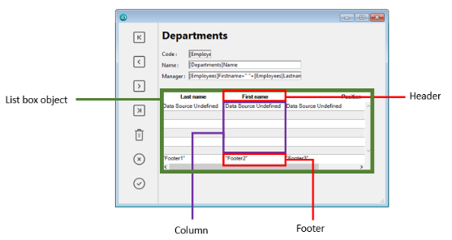
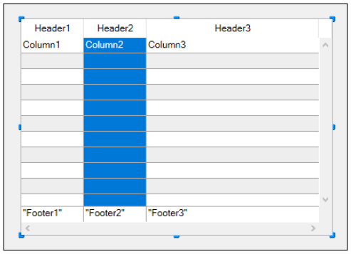
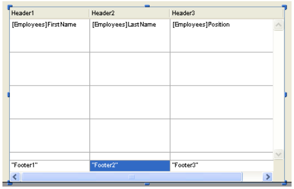
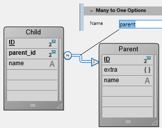
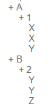
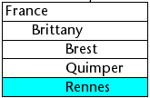
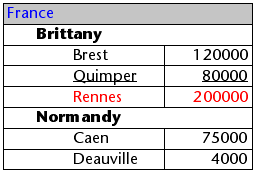
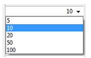

List boxes são objetos ativos complexos que permitem exibir e ingressar dados como colunas sincronizadas. Podem ser conectadas aos conteúdos de banco de dados como seleções de entidade e seleções de registro, ou para conteúdos de linguagem como coleções e arrays. Incluem características avançadas relativas à entrada de dados, classificação de colunas, gestão de eventos, aspecto personalizado, movimentação de colunas, etc.


Uma list box contém uma ou mais colunas cujo conteúdos são automaticamente sincronizados. O número de colunas é teoricamente ilimitado (depende dos recursos da máquina).

## Visão Geral

### Funcionalidades de usuário básicas

Durante a execução, list boxes permitem exibir e ingressar dados como listas. Para hacer que una celda sea editable ([si se permite la entrada para la columna](#managing-entry)), basta con pulsar dos veces sobre el valor que contiene:


Usuários podem ingressar e exibir o texto em várias linhas dentro de uma célula list box. Para añadir un salto de línea, presione **Ctrl+Retorno de carro** en Windows o **Opción+Retorno de carro** en macOS.

Booleanos e imagens podem ser exibidos em células, assim como datas, horas ou números. Es posible ordenar los valores de las columnas haciendo clic en un encabezado ([ordenación estándar](#managing-sorts)). Todas as colunas são sincronizadas automaticamente.

También es posible cambiar el tamaño de cada columna, y el usuario puede modificar el orden de las [columnas](properties_ListBox.md#locked-columns-and-static-columns) y [líneas](properties_Action.md#movable-rows) moviéndolas con el ratón, si esta acción e Tenga en cuenta que los list box se pueden utilizar en [modo jerárquico](#caja-de-lista-jerárquica).

El usuario puede seleccionar una o varias líneas utilizando los atajos estándar: **Mayúsculas+clic** para una selección adyacente y **Ctrl+clic** (Windows) o **Comando+clic** (macOS) para una selección no adyacente.

### Partes de list box

Uma list box é composta de quatro partes diferentes:

- o objeto list box em sua globalidade
- colunas,
- cabeçalhos de coluna, e
- rodapés de colunas.



Cada parte tem seu próprio nome assim como propriedades específicas. Por exemplo, o número de colunas ou as cores alternativas de cada linha é estabelecida nas propriedades de objeto list box, a largura de cada coluna é estabelecida nas propriedades de colunas e a fonte do cabeçalho é estabelecida nas propriedades de cabeçalho.

É possível adicionar um método objeto para o objeto list box ou para cada coluna da list box. Métodos objetos são chamados na ordem abaixo:

1. Método objeto de cada coluna
2. Método objeto da list box

El método objeto de columna obtiene los eventos que se producen en su [encabezado](#list-box-headers) y [pie](#list-box-footers).

### Tipos de List box

Há vários tipos de list boxes com seus próprios comportamentos e propriedades específicos. El tipo de list box depende de su [propiedad Fuente de datos](properties_Object.md#data-source):

- **Arrays**: cada columna está ligada a un array 4D. Los list boxes basados en arrays pueden mostrarse como [cajas de lista jerárquicas](listbox_overview.md#hierarchical-list-boxes).
- **Selección** (**Selección actual** o **Selección con nombre**): cada columna está vinculada a una expresión (por ejemplo, un campo) que se evalúa para cada registro de la selección.
- **Collection o Entity selection**: cada columna está ligada a una expresión que se evalúa para cada elemento de la colección o cada entidad de la selección de entidades.

> \> > It is not possible to combine different list box types in the same list box object. A fonte de dados é estabelecida quando a list box é criada. Não é mais possível modificar por programação.

### Gerenciando list boxes

Pode configurar completamente um objeto list box através de suas propriedades e também pode gerenciar dinamicamente por programação.

El lenguaje 4D incluye un tema "List Box" dedicado a los comandos de list box, pero los comandos de otros temas, tales como "Propiedades de los objetos" o los comandos `EDIT ITEM` y `Displayed line number` también pueden ser utilizados. Para mayor información consulte la página [List Box Commands Summary](https://doc.4d.com/4Dv17R6/4D/17-R6/List-Box-Commands-Summary.300-4311159.en.html) del manual _Lenguaje 4D_.

## Objetos tipo list box

### List box de tipo array

Em um list box de tipo array, cada coluna deve estar associada a um array unidimensional 4D; podem ser utilizados todos os tipos de array, com exceção dos arrays de ponteiros. O número de linhas é baseado no número de elementos array.

Como padrão, 4D atribui o nome "ColumnX" para cada coluna. Puede cambiarlo, así como las otras propiedades de la columna, en las [propiedades de las columnas](listbox_overview.md#column-specific-properties). El formato de visualización de cada columna también puede definirse mediante el comando `OBJECT SET FORMAT`.

> Los list boxes de tipo array pueden mostrarse en [modo jerárquico](listbox_overview.md#hierarchical-list-boxes), con mecanismos específicos.

Com list box de tipo array, o valor ingressado ou exibido são gerenciados usando a linguagem 4D. También puede asociar una [lista de opciones](properties_DataSource.md#choice-list) con una columna para controlar la entrada de datos.
Los valores de las columnas se gestionan mediante comandos de alto nivel del tema List box (como `LISTBOX INSERT ROWS` o `LISTBOX DELETE ROWS`), así como comandos de manipulación de arrays. Por exemplo, para iniciar os conteúdos da coluna, pode usar a instrução abaixo:

```4d
ARRAY TEXT(varCol;size)
```

Também pode usar uma lista:

```4d
LIST TO ARRAY("ListName";varCol)
```

> **Atención**: cuando un objeto List box contiene varias columnas de diferentes tamaños, sólo se mostrará el número de elementos del array (columna) más pequeño. Tem que verificar que cada array tenha o mesmo número de elementos que os outros. Além disso, se uma coluna list box for vazia (isso ocorre quando o array associado não for corretamente declarado ou dimensionado usando a linguagem), a list box não exibe nada.

### List box de tipo seleção

En este tipo de list box, cada columna puede estar asociada a un campo (por ejemplo `[Employees]LastName)` o a una expresión. La expresión puede basarse en uno o más campos (por ejemplo, `[Employees]FirstName+" "[Employees]LastName`) o puede ser simplemente una fórmula (por ejemplo `String(Milliseconds)`). A expressão também pode ser um método de proejeto, uma variável ou um item array. Puede utilizar los comandos `LISTBOX SET COLUMN FORMULA` y `LISTBOX INSERT COLUMN FORMULA` para modificar las columnas por programación.

A continuación, el contenido de cada línea se evalúa en función de una selección de registros: la **selección actual** de una tabla o una **selección temporal**.

No caso de uma list box baseada na seleção atual de uma tablea, qualquer modificação feita do lado da database é refletida automaticamente na list box e vice versa. A seleção atual é portanto sempre a mesma em ambos os lugares.

### List boxes de coleção ou de seleção de entidade

Nesse tipo de list box, cada coluna deve ser associada a uma expressão. Os conteúdos de cada linha são então avaliados por elemento de coleção ou por entidade da seleção de entidade.

Cada elemento de la colección o cada entidad está disponible como un objeto al que se puede acceder a través de la palabra clave [This](../Concepts/classes.md#this). Una expresión de columna puede ser una ruta de propiedad, un método de proyecto, una variable o cualquier fórmula, accediendo a cada entidad u objeto elemento de colección a través de `This`, por ejemplo `This.<propertyPath>` (o `This.value` en el caso de Puede utilizar los comandos `LISTBOX SET COLUMN FORMULA` y `LISTBOX INSERT COLUMN FORMULA` para modificar las columnas por programación.

Quando a fonte de dados for uma seleção de entidades, qualquer modificação feita no lado da list box são salvas automaticamente na database. Do outro lado, modificações feitas na database são visíveis na list box depois que as entidades tocadas foram recarregadas.

:::note

When entities are deleted, their references remain in the entity selection with an _undefined_ value, thus displaying blank rows in the list box. In this case, you can call the [`.clean()`](API/EntitySelectionClass.md#clean) function to get a new entity selection but without the deleted entity references.

:::

Quando a fonte de dados for uma coleção, qualquer modificação feita nos valores da list box são refletidas na coleção. On the other hand, if modifications are done on the collection using for example the various functions of the [Collection class](../API/CollectionClass.md), you will need to explicitely notify 4D by reassigning the collection variable to itself, so that the list box contents is refreshed. Por exemplo:

```4d
myCol:=myCol.push("new value") //exibir novo valor na list box
```

### Propriedades compatíveis

Propriedades compatíveis dependem do tipo de list box.

| Propriedade                                                                                  | List box array | List box seleção | List box coleção ou entity selection |
| -------------------------------------------------------------------------------------------- | -------------- | ---------------- | ------------------------------------ |
| [Alternate Background Color](properties_BackgroundAndBorder.md#alternate-background-color)   | X              | X                | X                                    |
| [Background Color](properties_BackgroundAndBorder.md#background-color)                       | X              | X                | X                                    |
| [Bold](properties_Text.md#bold)                                                              | X              | X                | X                                    |
| [Background Color Expression](properties_BackgroundAndBorder.md#background-color-expression) |                | X                | X                                    |
| [Border Line Style](properties_BackgroundAndBorder.md#border-line-style)                     | X              | X                | X                                    |
| [Bottom](properties_CoordinatesAndSizing.md#bottom)                                          | X              | X                | X                                    |
| [Class](properties_Object.md#css-class)                                                      | X              | X                | X                                    |
| [Collection or entity selection](properties_Object.md#collection-or-entity-selection)        |                | X                | X                                    |
| [Column Auto-Resizing](properties_ResizingOptions.md#column-auto-resizing)                   | X              | X                | X                                    |
| [Current item](properties_DataSource.md#current-item)                                        |                |                  | X                                    |
| [Current item position](properties_DataSource.md#current-item-position)                      |                |                  | X                                    |
| [Data Source](properties_Object.md#data-source)                                              | X              | X                | X                                    |
| [Detail Form Name](properties_ListBox.md#detail-form-name)                                   |                | X                |                                      |
| [Display Headers](properties_Headers.md#display-headers)                                     | X              | X                | X                                    |
| [Display Footers](properties_Footers.md#display-footers)                                     | X              | X                | X                                    |
| [Double-click on row](properties_ListBox.md#double-click-on-row)                             |                | X                |                                      |
| [Draggable](properties_Action.md#droppable)                                                  | X              | X                | X                                    |
| [Droppable](properties_Action.md#droppable)                                                  | X              | X                | X                                    |
| [Focusable](properties_Entry.md#focusable)                                                   | X              | X                | X                                    |
| [Font](properties_Text.md#font)                                                              | X              | X                | X                                    |
| [Font Color](properties_Text.md#font_color)                                                  | X              | X                | X                                    |
| [Font Color Expression](properties_Text.md#font-color-expression)                            |                | X                | X                                    |
| [Font Size](properties_Text.md#font-size)                                                    | X              | X                | X                                    |
| [Height (list box)](properties_CoordinatesAndSizing.md#height)            | X              | X                | X                                    |
| [Height (headers)](properties_Headers.md#height)                          | X              | X                | X                                    |
| [Height (footers)](properties_Footers.md#height)                          | X              | X                | X                                    |
| [Hide extra blank rows](properties_BackgroundAndBorder.md#hide-extra-blank-rows)             | X              | X                | X                                    |
| [Hide focus rectangle](properties_Appearance.md#hide-focus-rectangle)                        | X              | X                | X                                    |
| [Hide selection highlight](properties_Appearance.md#hide-selection-highlight)                | X              | X                | X                                    |
| [Hierarchical List Box](properties_Object.md#hierarchical-list-box)                          | X              |                  |                                      |
| [Highlight Set](properties_ListBox.md#highlight-set)                                         |                | X                |                                      |
| [Horizontal Alignment](properties_Text.md#horizontal-alignment)                              | X              | X                | X                                    |
| [Horizontal Line Color](properties_Gridlines.md#horizontal-line-color)                       | X              | X                | X                                    |
| [Horizontal Padding](properties_CoordinatesAndSizing.md#horizontal-padding)                  | X              | X                | X                                    |
| [Horizontal Scroll Bar](properties_Appearance.md#horizontal-scroll-bar)                      | X              | X                | X                                    |
| [Horizontal Sizing](properties_ResizingOptions.md#horizontal-sizing)                         | X              | X                | X                                    |
| [Italic](properties_Text.md#italic)                                                          | X              | X                | X                                    |
| [Left](properties_CoordinatesAndSizing.md#left)                                              | X              | X                | X                                    |
| [Master Table](properties_DataSource.md#table)                                               |                | X                |                                      |
| [Meta info expression](properties_Text.md#meta-info-expression)                              |                |                  | X                                    |
| [Method](properties_Action.md#method)                                                        | X              | X                | X                                    |
| [Movable Rows](properties_Action.md#movable-rows)                                            | X              |                  |                                      |
| [Named Selection](properties_DataSource.md#selectionName)                                    |                | X                |                                      |
| [Number of Columns](properties_ListBox.md#number-of-columns)                                 | X              | X                | X                                    |
| [Number of Locked Columns](properties_ListBox.md#number-of-locked-columns)                   | X              | X                | X                                    |
| [Number of Static Columns](properties_ListBox.md#number-of-static-columns)                   | X              | X                | X                                    |
| [Object Name](properties_Object.md#object-name)                                              | X              | X                | X                                    |
| [Right](properties_CoordinatesAndSizing.md#right)                                            | X              | X                | X                                    |
| [Row Background Color Array](properties_BackgroundAndBorder.md#row-background-color-array)   | X              |                  |                                      |
| [Row Control Array](properties_ListBox.md#row-control-array)                                 | X              |                  |                                      |
| [Row Font Color Array](properties_Text.md#row-font-color-array)                              | X              |                  |                                      |
| [Row Height](properties_CoordinatesAndSizing.md#row-height)                                  | X              |                  |                                      |
| [Row Height Array](properties_CoordinatesAndSizing.md#row-height-array)                      | X              |                  |                                      |
| [Row Style Array](properties_Text.md#row-style-array)                                        | X              |                  |                                      |
| [Selected Items](properties_DataSource.md#selected-items)                                    |                |                  | X                                    |
| [Selection Mode](properties_ListBox.md#selection-mode)                                       | X              | X                | X                                    |
| [Single-Click Edit](properties_Entry.md#single-click-edit)                                   | X              | X                | X                                    |
| [Sortable](properties_Action.md#sortable)                                                    | X              | X                | X                                    |
| [Standard action](properties_Action.md#standard-action)                                      | X              |                  |                                      |
| [Style Expression](properties_Text.md#style-expression)                                      |                | X                | X                                    |
| [Top](properties_CoordinatesAndSizing.md#top)                                                | X              | X                | X                                    |
| [Transparent](properties_BackgroundAndBorder.md#transparent)                                 | X              | X                | X                                    |
| [Type](properties_Object.md#type)                                                            | X              | X                | X                                    |
| [Underline](properties_Text.md#underline)                                                    | X              | X                | X                                    |
| [Variable or Expression](properties_Object.md#variable-or-expression)                        | X              | X                |                                      |
| [Vertical Alignment](properties_Text.md#vertical-alignment)                                  | X              | X                | X                                    |
| [Vertical Line Color](properties_Gridlines.md#vertical-line-color)                           | X              | X                | X                                    |
| [Vertical Padding](properties_CoordinatesAndSizing.md#vertical-padding)                      | X              | X                | X                                    |
| [Vertical Scroll Bar](properties_Appearance.md#vertical-scroll-bar)                          | X              | X                | X                                    |
| [Vertical Sizing](properties_ResizingOptions.md#vertical-sizing)                             | X              | X                | X                                    |
| [Visibility](properties_Display.md#visibility)                                               | X              | X                | X                                    |
| [Width](properties_CoordinatesAndSizing.md#width)                                            | X              | X                | X                                    |

> Colunas list box, cabeçalhos e rodapés suportam propriedades específicas.

### Eventos formulário suportados

| Evento formulário    | Propiedades adicionales devueltas (ver [Evento formulario](https://doc.4d.com/4Dv18/4D/18/FORM-Event.301-4522191.en.html) para las propiedades principales)                                 | Comentários                                                                                                                                                            |
| -------------------- | -------------------------------------------------------------------------------------------------------------------------------------------------------------------------------------------------------------- | ---------------------------------------------------------------------------------------------------------------------------------------------------------------------- |
| On After Edit        | <li>[column](#additional-properties)</li><li>[columnName](#additional-properties)</li><li>[row](#additional-properties)</li>                                                                                   |                                                                                                                                                                        |
| On After Keystroke   | <li>[column](#additional-properties)</li><li>[columnName](#additional-properties)</li><li>[row](#additional-properties)</li>                                                                                   |                                                                                                                                                                        |
| On After Sort        | <li>[column](#additional-properties)</li><li>[columnName](#additional-properties)</li><li>[headerName](#additional-properties)</li>                                                                            | _As fórmulas compostas não podem ser ordenadas. <br/>(por exemplo, This.firstName + This.lastName)_ |
| On Alternative Click | <li>[column](#additional-properties)</li><li>[columnName](#additional-properties)</li><li>[row](#additional-properties)</li>                                                                                   | _List box array unicamente_                                                                                                                                            |
| On Before Data Entry | <li>[column](#additional-properties)</li><li>[columnName](#additional-properties)</li><li>[row](#additional-properties)</li>                                                                                   |                                                                                                                                                                        |
| On Before Keystroke  | <li>[column](#additional-properties)</li><li>[columnName](#additional-properties)</li><li>[row](#additional-properties)</li>                                                                                   |                                                                                                                                                                        |
| On Begin Drag Over   | <li>[column](#additional-properties)</li><li>[columnName](#additional-properties)</li><li>[row](#additional-properties)</li>                                                                                   |                                                                                                                                                                        |
| On Clicked           | <li>[column](#additional-properties)</li><li>[columnName](#additional-properties)</li><li>[row](#additional-properties)</li>                                                                                   |                                                                                                                                                                        |
| On Close Detail      | <li>[row](#additional-properties)</li>                                                                                                                                                                         | _Current Selection & Named Selection list boxes only_                                                                                              |
| On Collapse          | <li>[column](#additional-properties)</li><li>[columnName](#additional-properties)</li><li>[row](#additional-properties)</li>                                                                                   | _Apenas list box hierárquicos_                                                                                                                                         |
| On Column Moved      | <li>[columnName](#additional-properties)</li><li>[newPosition](#additional-properties)</li><li>[oldPosition](#additional-properties)</li>                                                                      |                                                                                                                                                                        |
| On Column Resize     | <li>[column](#additional-properties)</li><li>[columnName](#additional-properties)</li><li>[newSize](#additional-properties)</li><li>[oldSize](#additional-properties)</li>                                     |                                                                                                                                                                        |
| On Data Change       | <li>[column](#additional-properties)</li><li>[columnName](#additional-properties)</li><li>[row](#additional-properties)</li>                                                                                   |                                                                                                                                                                        |
| On Delete Action     | <li>[row](#additional-properties)</li>                                                                                                                                                                         |                                                                                                                                                                        |
| On Display Detail    | <li>[isRowSelected](#additional-properties)</li><li>[row](#additional-properties)</li>                                                                                                                         |                                                                                                                                                                        |
| On Double Clicked    | <li>[column](#additional-properties)</li><li>[columnName](#additional-properties)</li><li>[row](#additional-properties)</li>                                                                                   |                                                                                                                                                                        |
| On Drag Over         | <li>[area](#additional-properties)</li><li>[areaName](#additional-properties)</li><li>[column](#additional-properties)</li><li>[columnName](#additional-properties)</li><li>[row](#additional-properties)</li> |                                                                                                                                                                        |
| On Drop              | <li>[column](#additional-properties)</li><li>[columnName](#additional-properties)</li><li>[row](#additional-properties)</li>                                                                                   |                                                                                                                                                                        |
| On Expand            | <li>[column](#additional-properties)</li><li>[columnName](#additional-properties)</li><li>[row](#additional-properties)</li>                                                                                   | _Apenas list box hierárquicos_                                                                                                                                         |
| On Footer Click      | <li>[column](#additional-properties)</li><li>[columnName](#additional-properties)</li><li>[footerName](#additional-properties)</li>                                                                            | _Arrays, Current Selection & Named Selection list boxes only_                                                                                      |
| On Getting Focus     | <li>[column](#additional-properties)</li><li>[columnName](#additional-properties)</li><li>[row](#additional-properties)</li>                                                                                   | _Propriedades adicionais devolvidas apenas quando se edita uma célula_                                                                                                 |
| On Header Click      | <li>[column](#additional-properties)</li><li>[columnName](#additional-properties)</li><li>[headerName](#additional-properties)</li>                                                                            |                                                                                                                                                                        |
| On Load              |                                                                                                                                                                                                                |                                                                                                                                                                        |
| On Losing Focus      | <li>[column](#additional-properties)</li><li>[columnName](#additional-properties)</li><li>[row](#additional-properties)</li>                                                                                   | _Propriedades adicionais devolvidas apenas quando a edição de uma célula tiver sido concluída_                                                                         |
| On Mouse Enter       | <li>[area](#additional-properties)</li><li>[areaName](#additional-properties)</li><li>[column](#additional-properties)</li><li>[columnName](#additional-properties)</li><li>[row](#additional-properties)</li> |                                                                                                                                                                        |
| On Mouse Leave       |                                                                                                                                                                                                                |                                                                                                                                                                        |
| On Mouse Move        | <li>[area](#additional-properties)</li><li>[areaName](#additional-properties)</li><li>[column](#additional-properties)</li><li>[columnName](#additional-properties)</li><li>[row](#additional-properties)</li> |                                                                                                                                                                        |
| On Open Detail       | <li>[row](#additional-properties)</li>                                                                                                                                                                         | _Current Selection & Named Selection list boxes only_                                                                                              |
| On Row Moved         | <li>[newPosition](#additional-properties)</li><li>[oldPosition](#additional-properties)</li>                                                                                                                   | _List box array unicamente_                                                                                                                                            |
| On Selection Change  |                                                                                                                                                                                                                |                                                                                                                                                                        |
| On Scroll            | <li>[horizontalScroll](#additional-properties)</li><li>[verticalScroll](#additional-properties)</li>                                                                                                           |                                                                                                                                                                        |
| On Unload            |                                                                                                                                                                                                                |                                                                                                                                                                        |

#### Propriedades adicionais

Form events on list box or list box column objects may return the following additional properties:

| Propriedade          | Tipo          | Descrição                                                                    |
| -------------------- | ------------- | ---------------------------------------------------------------------------- |
| area                 | text          | Área de objeto List box ("header", "footer", "cell")      |
| areaName             | text          | Nome da zona                                                                 |
| column               | inteiro longo | Número da coluna                                                             |
| columnName           | text          | Nome da coluna                                                               |
| footerName           | text          | Nome do rodapé                                                               |
| headerName           | text          | Nome do cabeçalho                                                            |
| horizontalScroll     | inteiro longo | Positivo se a deslocação for para a direita, negativo se for para a esquerda |
| isRowSelected        | boolean       | True se a linha estiver selecionada, senão False                             |
| newPosition          | inteiro longo | Nova posição da coluna ou linha                                              |
| newSize              | inteiro longo | Novo tamanho (em pixéis) da coluna ou linha               |
| oldPosition          | inteiro longo | Posição anterior da coluna ou da linha                                       |
| oldSize              | inteiro longo | Tamanho anterior (em pixéis) da coluna ou linha           |
| row                  | inteiro longo | Número da linha                                                              |
| Alinhamento vertical | inteiro longo | Positivo se a deslocação for para baixo, negativo se for para cima           |

> If an event occurs on a "fake" column or row that doesn't exist, an empty string is typically returned.

## Colunas list boxes

Uma list box é feita de um ou mais objetos coluna que têm propriedades específicas. Pode selecionar uma coluna list box no editor de Formulário clicando nela ou quando o objeto list box for selecionado:



You can set standard properties (text, background color, etc.) for each column of the list box; these properties take priority over those of the list box object properties.

> Puede definir el [tipo de expresión](properties_Object.md#expression-type) para las columnas de list box de tipo array (cadena, texto, número, fecha, hora, imagen, booleano u objeto).

### Propriedades específicas de coluna

[Alpha Format](properties_Display.md#alpha-format) - [Alternate Background Color](properties_BackgroundAndBorder.md#alternate-background-color) - [Automatic Row Height](properties_CoordinatesAndSizing.md#automatic-row-height) - [Background Color](properties_Text.md#background-color) - [Background Color Expression](properties_BackgroundAndBorder.md#background-color-expression) - [Bold](properties_Text.md#bold) - [Choice List](properties_DataSource.md#choice-list) - [Class](properties_Object.md#css-class) - [Data Type (selection and collection list box column)](properties_DataSource.md#data-type) - [Date Format](properties_Display.md#date-format) - [Default Values](properties_DataSource.md#default-values) - [Display Type](properties_Display.md#display-type) - [Enterable](properties_Entry.md#enterable) - [Entry Filter](properties_Entry.md#entry-filter) - [Excluded List](properties_RangeOfValues.md#excluded-list) - [Expression](properties_DataSource.md#expression) - [Expression Type (array list box column)](properties_Object.md#expression-type) - [Font](properties_Text.md#font) - [Font Color](properties_Text.md#font-color) - [Horizontal Alignment](properties_Text.md#horizontal-alignment) - [Horizontal Padding](properties_CoordinatesAndSizing.md#horizontal-padding) - [Italic](properties_Text.md#italic) - [Invisible](properties_Display.md#visibility) - [Maximum Width](properties_CoordinatesAndSizing.md#maximum-width) - [Method](properties_Action.md#method) - [Minimum Width](properties_CoordinatesAndSizing.md#minimum-width) - [Multi-style](properties_Text.md#multi-style) - [Number Format](properties_Display.md#number-format) - [Object Name](properties_Object.md#object-name) - [Picture Format](properties_Display.md#picture-format) - [Resizable](properties_ResizingOptions.md#resizable) - [Required List](properties_RangeOfValues.md#required-list) - [Row Background Color Array](properties_BackgroundAndBorder.md#row-background-color-array) - [Row Font Color Array](properties_Text.md#row-font-color-array) - [Row Style Array](properties_Text.md#row-style-array) - [Save as](properties_DataSource.md#save-as) - [Style Expression](properties_Text.md#style-expression) - [Text when False/Text when True](properties_Display.md#text-when-false-text-when-true) - [Time Format](properties_Display.md#time-format) - [Truncate with ellipsis](properties_Display.md#truncate-with-ellipsis) - [Underline](properties_Text.md#underline) - [Variable or Expression](properties_Object.md#variable-or-expression) - [Vertical Alignment](properties_Text.md#vertical-alignment) - [Vertical Padding](properties_CoordinatesAndSizing.md#vertical-padding) - [Width](properties_CoordinatesAndSizing.md#width) - [Wordwrap](properties_Display.md#wordwrap)

### Eventos formulário suportados

| Evento formulário    | Propiedades adicionales devueltas (ver [Evento formulario](https://doc.4d.com/4Dv18/4D/18/FORM-Event.301-4522191.en.html) para las propiedades principales)                                 | Comentários                                                                                                                                                            |
| -------------------- | -------------------------------------------------------------------------------------------------------------------------------------------------------------------------------------------------------------- | ---------------------------------------------------------------------------------------------------------------------------------------------------------------------- |
| On After Edit        | <li>[column](#additional-properties)</li><li>[columnName](#additional-properties)</li><li>[row](#additional-properties)</li>                                                                                   |                                                                                                                                                                        |
| On After Keystroke   | <li>[column](#additional-properties)</li><li>[columnName](#additional-properties)</li><li>[row](#additional-properties)</li>                                                                                   |                                                                                                                                                                        |
| On After Sort        | <li>[column](#additional-properties)</li><li>[columnName](#additional-properties)</li><li>[headerName](#additional-properties)</li>                                                                            | _As fórmulas compostas não podem ser ordenadas. <br/>(por exemplo, This.firstName + This.lastName)_ |
| On Alternative Click | <li>[column](#additional-properties)</li><li>[columnName](#additional-properties)</li><li>[row](#additional-properties)</li>                                                                                   | _List box array unicamente_                                                                                                                                            |
| On Before Data Entry | <li>[column](#additional-properties)</li><li>[columnName](#additional-properties)</li><li>[row](#additional-properties)</li>                                                                                   |                                                                                                                                                                        |
| On Before Keystroke  | <li>[column](#additional-properties)</li><li>[columnName](#additional-properties)</li><li>[row](#additional-properties)</li>                                                                                   |                                                                                                                                                                        |
| On Begin Drag Over   | <li>[column](#additional-properties)</li><li>[columnName](#additional-properties)</li><li>[row](#additional-properties)</li>                                                                                   |                                                                                                                                                                        |
| On Clicked           | <li>[column](#additional-properties)</li><li>[columnName](#additional-properties)</li><li>[row](#additional-properties)</li>                                                                                   |                                                                                                                                                                        |
| On Column Moved      | <li>[columnName](#additional-properties)</li><li>[newPosition](#additional-properties)</li><li>[oldPosition](#additional-properties)</li>                                                                      |                                                                                                                                                                        |
| On Column Resize     | <li>[column](#additional-properties)</li><li>[columnName](#additional-properties)</li><li>[newSize](#additional-properties)</li><li>[oldSize](#additional-properties)</li>                                     |                                                                                                                                                                        |
| On Data Change       | <li>[column](#additional-properties)</li><li>[columnName](#additional-properties)</li><li>[row](#additional-properties)</li>                                                                                   |                                                                                                                                                                        |
| On Double Clicked    | <li>[column](#additional-properties)</li><li>[columnName](#additional-properties)</li><li>[row](#additional-properties)</li>                                                                                   |                                                                                                                                                                        |
| On Drag Over         | <li>[area](#additional-properties)</li><li>[areaName](#additional-properties)</li><li>[column](#additional-properties)</li><li>[columnName](#additional-properties)</li><li>[row](#additional-properties)</li> |                                                                                                                                                                        |
| On Drop              | <li>[column](#additional-properties)</li><li>[columnName](#additional-properties)</li><li>[row](#additional-properties)</li>                                                                                   |                                                                                                                                                                        |
| On Footer Click      | <li>[column](#additional-properties)</li><li>[columnName](#additional-properties)</li><li>[footerName](#additional-properties)</li>                                                                            | _Arrays, Current Selection & Named Selection list boxes only_                                                                                      |
| On Getting Focus     | <li>[column](#additional-properties)</li><li>[columnName](#additional-properties)</li><li>[row](#additional-properties)</li>                                                                                   | _Propriedades adicionais devolvidas apenas quando se edita uma célula_                                                                                                 |
| On Header Click      | <li>[column](#additional-properties)</li><li>[columnName](#additional-properties)</li><li>[headerName](#additional-properties)</li>                                                                            |                                                                                                                                                                        |
| On Load              |                                                                                                                                                                                                                |                                                                                                                                                                        |
| On Losing Focus      | <li>[column](#additional-properties)</li><li>[columnName](#additional-properties)</li><li>[row](#additional-properties)</li>                                                                                   | _Propriedades adicionais devolvidas apenas quando a edição de uma célula tiver sido concluída_                                                                         |
| On Row Moved         | <li>[newPosition](#additional-properties)</li><li>[oldPosition](#additional-properties)</li>                                                                                                                   | _List box array unicamente_                                                                                                                                            |
| On Scroll            | <li>[horizontalScroll](#additional-properties)</li><li>[verticalScroll](#additional-properties)</li>                                                                                                           |                                                                                                                                                                        |
| On Unload            |                                                                                                                                                                                                                |                                                                                                                                                                        |

## Cabeçalhos de list box

> Para poder acceder a las propiedades de los pies de un list box, debe activar la opción [Mostrar pies](properties_Footers.md#display-footers).

Quando mostrar os cabeçalhos, pode selecionar um cabeçalho no editor de formulários clicando nele quando o objeto List Box estiver selecioando:


Pode estabelecer propriedades de texto padrão para cada cabeçalho de coluna da list box, nesse caso, essas propriedades tem prioriedade sobre aquelas da coluna ou da própria list box.

Além disso, tem acesso às propriedades específicas para cabeçalhos. En particular, se puede mostrar un icono en el encabezado junto al título de la columna o en su lugar, por ejemplo, cuando se realizan [ordenaciones personalizadas](#managing-sorts).


Al momento de la ejecución, los eventos que se producen en un encabezado se generan en el [método objeto de la columna de list box](#object-methods).

Cuando el comando `OBJECT SET VISIBLE` se utiliza con un encabezado, se aplica a todos los encabezados, independientemente del elemento individual definido por el comando. Por ejemplo, `OBJECT SET VISIBLE(*; "header3";False)` ocultará todos los encabezados del objeto list box al que pertenece _header3_ y no simplemente este encabezado.

### Propriedades específicas de cabeçalho

[Bold](properties_Text.md#bold) - [Class](properties_Object.md#css-class) - [Font](properties_Text.md#font) - [Font Color](properties_Text.md#font-color) - [Help Tip](properties_Help.md#help-tip) - [Horizontal Alignment](properties_Text.md#horizontal-alignment) - [Horizontal Padding](properties_CoordinatesAndSizing.md#horizontal-padding) - [Icon Location](properties_TextAndPicture.md#icon-location) - [Italic](properties_Text.md#italic) - [Object Name](properties_Object.md#object-name) - [Pathname](properties_TextAndPicture.md#picture-pathname) - [Title](properties_Object.md#title) - [Underline](properties_Text.md#underline) - [Variable or Expression](properties_Object.md#variable-or-expression) - [Vertical Alignment](properties_Text.md#vertical-alignment) - [Vertical Padding](properties_CoordinatesAndSizing.md#vertical-padding) - [Width](properties_CoordinatesAndSizing.md#width)

## Rodapés de list box

> Para poder acceder a las propiedades de los encabezados de un list box, debe activar la opción [Mostrar encabezados](properties_Headers.md#display-headers) del list box.

List boxes podem conter "cabeçalhos" não editáveis, exibindo informação adicional. No caso de dados mostrados em formato de tabela, os rodapés são geralmente usados para exibir cálculos como totais ou médias.

Quando cabeçalhos são exibidos, pode clicar para selecionar um quando o objeto list box for selecionado no editor de Formulário:



Para cada cabeçalho coluna List Box pode estabelecer propriedades texto padrão: nesse caso, essas propriedades têm prioridade sobre àquelas da coluna ou da list box. Pode também acessar propriedades específicas para cabeçalhos. En particular, puede insertar un [cálculo personalizado o automático](properties_Object.md#variable-calculation).

Al momento de la ejecución, los eventos que se producen en un pie de página se generan en el [método objeto de la columna de list box](#object-methods).

Cuando el comando `OBJECT SET VISIBLE` se utiliza con un pie de página, se aplica a todos los pies, independientemente del elemento individual definido por el comando. Por ejemplo, `OBJECT SET VISIBLE(*; "footer3";False)` ocultará todos los pies de página del objeto list box al que pertenece _footer3_ y no simplemente este pie de página.

### Propriedades específicas do rodapé

[Alpha Format](properties_Display.md#alpha-format) - [Background Color](properties_BackgroundAndBorder.md#background-color-fill-color) - [Bold](properties_Text.md#bold) - [Class](properties_Object.md#css-class) - [Date Format](properties_Display.md#date-format) - [Expression Type](properties_Object.md#expression-type) - [Font](properties_Text.md#font) - [Font Color](properties_Text.md#font-color) - [Help Tip](properties_Help.md#help-tip) - [Horizontal Alignment](properties_Text.md#horizontal-alignment) - [Horizontal Padding](properties_CoordinatesAndSizing.md#horizontal-padding) - [Italic](properties_Text.md#italic) - [Number Format](properties_Display.md#number-format) - [Object Name](properties_Object.md#object-name) - [Picture Format](properties_Display.md#picture-format) - [Time Format](properties_Display.md#time-format) - [Truncate with ellipsis](properties_Display.md#truncate-with-ellipsis) - [Underline](properties_Text.md#underline) - [Variable Calculation](properties_Object.md#variable-calculation) - [Variable or Expression](properties_Object.md#variable-or-expression) - [Vertical Alignment](properties_Text.md#vertical-alignment) - [Vertical Padding](properties_CoordinatesAndSizing.md#vertical-padding) - [Width](properties_CoordinatesAndSizing.md#width) - [Wordwrap](properties_Display.md#wordwrap)

## Gerenciar entrada

Para uma célula list box ser editável, as duas condições abaixo devem ser atendidas:

- La columna de la celda debe haberse definido como [Enterable](properties_Entry.md#enterable) (de lo contrario, las celdas de la columna nunca podrán ser editables).
- En el evento `On Before Data Entry`, $0 no devuelve -1. Cuando el cursor llega a la celda, se genera el evento `On Before Data Entry` en el método de la columna. Se, no contexto desse evento, $0 for estabelecido a -1, a célula é considerada como não editável. Si el evento se generó después de presionar **Tab** o **Mayús+Tab**, el foco pasa a la siguiente celda o a la anterior, respectivamente. Se $0 não for -1 (como padrão $0 é 0), a célula for editável e trocar para o modo edição.

Vamos considerar o exemplo de uma lsit box contendo dois arrays: uma data e um texto. O array data não é editável mas o array texto é editável se a data não tiver sido passada.


Aquí está el método de la columna _arrText_:

```4d
 Case of
    :(FORM event.code=On Before Data Entry) // a cell gets the focus
       LISTBOX GET CELL POSITION(*;"lb";$col;$row)
  // identification of cell
       If(arrDate{$row}<Current date) // if date is earlier than today
          $0:=-1 // cell is NOT enterable
       Else
  // otherwise, cell is enterable
       End if
 End case
```

El evento `On Before Data Entry` se devuelve antes de `On Getting Focus`.

Para preservar consistência de dados para list boxes de tipo seleção e tipo seleção de entidade, qualquer registro/entidade modificada é automaticamente salva assim que a célula for validada, ou seja.:

- quando a célula for desativada (usuário pressiona tab, clica, etc)
- quando a listbox não estiver mais em foco,
- quando o formulário não tiver mais o foco.

A sequencia típica de eventos gerados durante a entrada de dados ou modificação é como a seguir:

| Ação                                                                                                     | Tipos Listbox                        | Sequencia de eventos                                                                                                                                                                                                                                                                                            |
| -------------------------------------------------------------------------------------------------------- | ------------------------------------ | --------------------------------------------------------------------------------------------------------------------------------------------------------------------------------------------------------------------------------------------------------------------------------------------------------------- |
| Una celda pasa al modo edición (acción del usuario o llamada del comando `EDIT ITEM`) | Todos                                | On Before Data Entry                                                                                                                                                                                                                                                                                            |
|                                                                                                          | Todos                                | On Getting Focus                                                                                                                                                                                                                                                                                                |
| Quando o valor foi modificado                                                                            | Todos                                | On Before Keystroke                                                                                                                                                                                                                                                                                             |
|                                                                                                          | Todos                                | On After Keystroke                                                                                                                                                                                                                                                                                              |
|                                                                                                          | Todos                                | On After Edit                                                                                                                                                                                                                                                                                                   |
| Um usuário valida e deixa a célula                                                                       | List box de tipo seleção             | Salvar                                                                                                                                                                                                                                                                                                          |
|                                                                                                          | List box de tipo seleção de registro | Ativação de On saving an existing record (se estabelecido)                                                                                                                                                                                                                                   |
|                                                                                                          | List box de tipo seleção             | On Data Change(\*)                                                                                                                                                                                                                                                                           |
|                                                                                                          | List box de tipo seleção de entidade | Entidade é salva com opção autofusão, trancamento otimista (ver entitity.save()). No caso de salvamento com sucesso, a entidade é recarregada com a última atualização. Se a operação de salvar falhar, um erro é exibido |
|                                                                                                          | Todos                                | On Losing Focus                                                                                                                                                                                                                                                                                                 |

(\*) Com list boxes de seleção de entidade, no evento On Data Change:

- el objeto [elemento actual](properties_DataSource.md#element-courant) contiene el valor antes de la modificación.
- el objeto `This` contiene el valor modificado.

> Entrada de dados em list boxes do tipo coleção/seleção de entidade tem uma limitação quando a expressão for analisada como null. Nesse caso, não é possível editar ou remover o valor null na célula.

## Gerenciar seleções

Seleções são gerenciadas diretamente, dependendo de se a list box é a baseada em um array, em uma seleção de registros ou em uma coleção/seleção de entidades:

- **Lista box de tipo selección**: las selecciones se gestionan mediante un conjunto llamado por defecto `$ListboxSetX` (donde X empieza en 0 y se incrementa en función del número de list box en el formulario), que puede modificar si es necesario. Este conjunto se [define en las propiedades](properties_ListBox.md#highlight-set) del list box. É mantido automaticamente por 4D: se o usuário selecionar uma ou mais linhas na list box, o conjunto se atualiza imediatamente. Por outro lado, é também possível usar comandos do tema "Conjuntos" para modificar a seleção na list box via programação.

- **List box de tipo colección/selección de entidades**: las selecciones se gestionan a través de las propiedades del list box dedicado:
  - [Elemento actual](properties_DataSource.md#current-item) es un objeto que recibirá el elemento/la entidad seleccionado(a)
  - [Elementos seleccionados](properties_DataSource.md#selected-items) es una colección de elementos seleccionados
  - [Posición del elemento actual](properties_DataSource.md#current-item-position) devuelve la posición del elemento o de la entidad seleccionada.

- **List box de tipo array**: el comando `LISTBOX SELECT ROW` puede utilizarse para seleccionar una o más líneas del list box por programación.
  La [variable asociada al objeto List box](propiedades_Objeto.md#variable-o-expresión) se utiliza para obtener, definir o almacenar las selecciones de líneas en el objeto. Esta variável corresponde a um array de booleanos que é criado e mantido automaticamente por 4D. O tamanho deste array vem determinado pelo tamanho do list box: contém o mesmo número de elementos que o menor array associado às colunas.
  Cada elemento de este array contiene `True` si se selecciona la línea correspondiente y `False` en caso contrario. 4D atualiza o conteúdo deste array em função das ações de usuário. Do lado contrário, pode mduar o valor dos elementos array para mudar a seleção na list box.
  Mas não se pode inserir nem apagar linhas nesse array; nem se pode reescrever as linhas. El comando `Count in array` puede utilizarse para averiguar el número de líneas seleccionadas.
  Por exemplo, este método permite inverter a seleção da primeira línha de list box (tipo array):

```4d
 ARRAY BOOLEAN(tBListBox;10)
  //tBListBox is the name of the list box variable in the form
 If(tBListBox{1}=True)
    tBListBox{1}:=False
 Else
    tBListBox{1}:=True
 End if
```

> El comando `OBJECT SET SCROLL POSITION` se desplaza por las líneas del list box para que se muestre la primera línea seleccionada o una línea especificada.

### Personalizar a aparência de linhas selecionadas

Cuando la opción [Ocultar el resaltado de la selección](properties_Appearance.md#cacher-surlignage-selection) está seleccionada, debe gestionar la representación visual de las selecciones en el list box utilizando las opciones de interfaz disponibles. Como seleções não são gerenciadas totalmente por 4D, isso significa:

- Para array de tipo list boxes, deve analisar a variável array booleana associada com a list box para determinar quais linhas foram ou não selecionadas.
- Para los list box de tipo selección, hay que comprobar si el registro actual (línea) pertenece al conjunto especificado en la propiedad [Conjunto resaltado](properties_ListBox.md#highlight-set) del list box.

Pode então definir cores de fundo especificas, cores de fonte ou estilos de fonte por programação para personalizar a aparência de linhas selecionadas. Isso pode ser feito usando arrays ou expressões, dependendo do tipo de list box sendo exibido (ver as seções abaixo).

> Puede utilizar la constante `lk inherited` para aplicar la apariencia actual del list box (por ejemplo, el color de la fuente, el color de fondo, el estilo de la fuente, etc.).

#### List box de tipo seleção

Para determinar qué líneas están seleccionadas, hay que comprobar si están incluidas en el conjunto indicado en la propiedad [Conjunto resaltado](properties_ListBox.md#highlight-set) del list box. A continuación, puede definir la apariencia de las líneas seleccionadas utilizando una o varias de las [propiedades de expresión de color o estilo](#using-arrays-and-expressions) relevantes.

Lembre que essas expressões são automaticamente reavaliadas a cada vez que:

- a seleção de list box mudar.
- a list box obter ou perder o foco.
- a janela de formulário contendo a list box virar a janela mais à frente, ou deixar de estar à frente.

#### List box de tipo array

Tiene que analizar el array booleano [Variable o expresión](properties_Object.md#variable-or-expression) asociado al list box para determinar si las líneas están seleccionadas o no.

A continuación, puede definir la apariencia de las líneas seleccionadas utilizando una o varias de las [propiedades de array de color o de estilo](#using-arrays-and-expressions) relevantes.

Tenga en cuenta que los arrays de list box utilizados para definir la apariencia de las líneas seleccionadas deben recalcularse en el evento formulario `On Selection Change`; sin embargo, también puede modificar estos arrays basándose en los siguientes ev

- `On Getting Focus` (propiedad list box)
- `On Losing Focus` (propiedad list box)
- `On Activate` (propiedad list box)
- `On Deactivate` (form property) ...depending on whether and how you want to visually represent changes of focus in selections.

##### Exemplo

Se escolher esconder os destaques do sistema e quiser exibir seleções de list box com uma cor de fundo verde, como mostrado aqui:


Para un list box de tipo array, es necesario actualizar el [Array colores de fondo](properties_BackgroundAndBorder.md#row-background-color-array) por programación. No formulário JSON, se definiu o Array Row Background Color para a list box:

```
	"rowFillSource": "_ListboxBackground",
```

No método de objeto da list box, pode escrever:

```4d
 Case of
    :(FORM event.code=On Selection Change)
       $n:=Size of array(LB_Arrays)
       ARRAY LONGINT(_ListboxBackground;$n) // row background colors
       For($i;1;$n)
          If(LB_Arrays{$i}=True) // selected
             _ListboxBackground{$i}:=0x0080C080 // green background
          Else // not selected
             _ListboxBackground{$i}:=lk inherited
          End if
       End for
 End case
```

For a selection type list box, to produce the same effect you can use a method to update the [Background Color Expression](properties_BackgroundAndBorder.md#background-color-expression) based on the set specified in the [Highlight Set](properties_ListBox.md#highlight-set) property.

Por exemplo, no formulário JSON, se definiu  HIghlight Set e Background Color Expression para o list box:

```
	"highlightSet": "$SampleSet",
	"rowFillSource": "UI_SetColor",
```

Puede escribir en el método _UI_SetColor_:

```4d
 If(Is in set("$SampleSet"))
    $color:=0x0080C080 // green background
 Else
    $color:=lk inherited
 End if

 $0:=$color
```

> En los list box jerárquicos, las líneas de ruptura no pueden resaltarse cuando la opción [Ocultar resaltado selección](properties_Appearance.md#hide-selection-highlight) está seleccionada. Já que não é possível diferenciar cores de cabeçalho ao mesmo nível, não há uma maneira de ressaltar uma quebra de linha especifica por programação.

## Gestão de ordenações

Uma ordenação num list box pode ser padrão ou personalizada. Todas as colunas são sincronizadas automaticamente.

### Ordenação standard

como padrão, uma list box gerencia automaticamente ordenações de coluna padrão quando o cabeçalho for clicado. Uma ordenação normal é uma ordenação alfanumérica de valores de coluna, alternando entre ascendente e descendente com cada clique sucessivo.

Puede activar o desactivar la ordenación usuario estándar desactivando la propiedad [Ordenable](properties_Action.md#sortable) del list box (activada por defecto).

O suporte de ordenação padrão depende do tipo de list box:

| Tipo de list box              | Suporte de ordenação padrão | Comentários                                                                                                                                                                                                                                                                                                                                                                                                                                                                                                                                                                                                                                                   |
| ----------------------------- | --------------------------- | ------------------------------------------------------------------------------------------------------------------------------------------------------------------------------------------------------------------------------------------------------------------------------------------------------------------------------------------------------------------------------------------------------------------------------------------------------------------------------------------------------------------------------------------------------------------------------------------------------------------------------------------------------------- |
| Uma coleção de objetos        | Sim                         | <ul><li>"This.a" or "This.a.b" columns are sortable.</li><li>The [list box source property](properties_Object.md#variable-or-expression) must be an [assignable expression](../Concepts/quick-tour.md#assignable-vs-non-assignable-expressions).</li></ul>                                                                                                                                                                                                                                                                                                                                                                                                    |
| Colecção de valores escalares | Não                         | Use custom sort with [`orderBy()`](../API/CollectionClass.md#orderby) function                                                                                                                                                                                                                                                                                                                                                                                                                                                                                                                                                                                |
| Seleção de entidades          | Sim                         | <li>The [list box source property](properties_Object.md#variable-or-expression) must be an [assignable expression](../Concepts/quick-tour.md#assignable-vs-non-assignable-expressions).</li><li>Supported: sorts on object attribute properties (e.g. "This.data.city" when "data" is an object attribute)</li><li>Supported: sorts on related attributes (e.g. "This.company.name")</li><li>Not supported: sorts on object attribute properties through related attributes (e.g. "This.company.data.city"). For this, you need to use custom sort with [`orderByFormula()`](../API/EntitySelectionClass.md#orderbyformula) function (see example below)</li> |
| Selecção actual               | Sim                         | Sólo se pueden ordenar las expresiones simples (por ejemplo, `[Table_1]Campo_2`)                                                                                                                                                                                                                                                                                                                                                                                                                                                                                                                                                           |
| Seleção temporal              | Não                         |                                                                                                                                                                                                                                                                                                                                                                                                                                                                                                                                                                                                                                                               |
| Arrays                        | Sim                         | As colunas ligadas a arrays de imagens e ponteiros não podem ser ordenadas                                                                                                                                                                                                                                                                                                                                                                                                                                                                                                                                                                                    |

### Ordenação personalizada

The developer can set up custom sorts, for example using the [`LISTBOX SORT COLUMNS`](https://doc.4d.com/4dv19/help/command/en/page916.html) command and/or combining the [`On Header Click`](../Events/onHeaderClick) and [`On After Sort`](../Events/onAfterSort) form events and relevant 4D commands.

As ordenações personalizadas permitem-lhe:

- carry out multi-level sorts on several columns, thanks to the [`LISTBOX SORT COLUMNS`](https://doc.4d.com/4dv19/help/command/en/page916.html) command,
- use functions such as [`collection.orderByFormula()`](../API/CollectionClass.md#orderbyformula) or [`entitySelection.orderByFormula()`](../API/EntitySelectionClass.md#orderbyformula) to sort columns on complex criteria.

#### Exemplo

You want to sort a list box using values of a property stored in a related object attribute. Tem a seguinte estrutura:



Se diseña un list box de tipo entity selection, vinculado a la expresión `Form.child`. En el evento formulario `On Load`, se ejecuta `Form.child:=ds.Child.all()`.

São exibidas duas colunas:

| Negrito     | Apelido do progenitor        |
| ----------- | ---------------------------- |
| `This.name` | `This.parent.extra.nickname` |

Se quiser ordenar o list box utilizando os valores da segunda coluna, tem de escrever:

```4d
If (Form event code=On Header Click)
	Form.child:=Form.child.orderByFormula("This.parent.extra.nickname"; dk ascending)
End if
```

### Variável de cabeçalho de coluna

El valor de la [variable asociada al encabezado de una columna](properties_Object.md#variable-or-expression) permite gestionar una información adicional: la ordenación actual de la columna (lectura) y la visualización de la flecha de ordenación.

- Se a variável for estabelecida como 0, a coluna não é ordenada e a flecha de ordenação não é exibida;\
  

- If the variable is set to 1, the column is sorted in ascending order and the sort arrow is displayed.
  

- If the variable is set to 2, the column is sorted in descending order and the sort arrow is displayed.
  

> Sólo las [variables](Concepts/variables.md) declaradas o dinámicas pueden utilizarse como variables de encabezado de columna. Otros tipos de [expresiones](Concepts/quick-tour.md#expressions) como `Form.sortValue` no son soportadas.

Pode estabelecer o valor da variável (por exemplo, Header2:=2) para  “forçar” a exibição da flecha de ordenação. A ordenação de coluna não é modificada nesse caso; depende do desenvolvedor como vai manejá-la.

> The [`OBJECT SET FORMAT`](https://doc.4d.com/4dv19/help/command/en/page236.html) command offers specific support for icons in list box headers, which can be useful when you want to work with a customized sort icon.

## Gerenciar cores linha, estilos e exibição

Aqui estão algumas maneiras de estabelecer cores de fundo, cores de fonte e estilos de fonte para list boxes:

- al nivel de las [propiedades del objeto list box](#list-box-objects),
- a nivel de las [propiedades de la columna](#list-box-columns),
- utilizando los [arrays o expresiones](#using-arrays-and-expressions) para el list box y/o para cada columna,
- a nivel del texto de cada celda (si [texto multi-estilo](properties_Text.md#multi-style)).

### Prioridad & herencia

Princípios de prioridade e herança são observados quando a mesma propriedade for estabelecida em mais de um nível.

| Nível de prioridade | Localização do parâmetro                                                                           |
| ------------------- | -------------------------------------------------------------------------------------------------- |
| alta prioridade     | Célula (se texto multiestilo)                                                   |
|                     | Arrays/métodos de coluna                                                                           |
|                     | Arrays/métodos de Listbox                                                                          |
|                     | Propriedades da coluna                                                                             |
|                     | Propriedades de list box                                                                           |
| baixa prioridade    | Expressão Meta Info (para list boxes de tipo collection ou seleção de entidade) |

Por exemplo se estabelecer um estilo de fonte nas propriedades de list box e outro usando um array estilo para a coluna, este último será levado em consideração.

Para cada atributo (estilo, color y color de fondo), se implementa una **herencia** cuando se utiliza el valor por defecto:

- Para atributos de célula: atributos valores de linhas
- para atributos linhas: valores de atributos de colunas
- para atributos coluna: valores atributos no list box

De esta forma, si desea que un objeto herede el valor de atributo de un nivel superior, puede utilizar pasar la constante `lk inherited` (valor por defecto) al comando de definición o directamente en el elemento del array de estilo/color correspondiente. For example, given an array list box containing a standard font style with alternating colors:


Pode realizar as modificações abaixo:

- cambiar el fondo de la línea 2 a rojo utilizando la propiedad [Row Background Color Array](properties_BackgroundAndBorder.md#row-background-color-array) del objeto list box,
- cambia el estilo de la línea 4 a cursiva utilizando la propiedad [Row Style Array](properties_Text.md#row-style-array) del objeto list box,
- dos elementos de la columna 5 se cambian a negrita utilizando la propiedad [Row Style Array](properties_Text.md#row-style-array) del objeto columna 5,
- los 2 elementos de la columna 1 y 2 se cambian a azul oscuro utilizando la propiedad [Row Background Color Array](properties_BackgroundAndBorder.md#row-background-color-array) para los objetos de la columna 1 y 2:


Para restaurar a aparência original da list box, é possível:

- pasar la constante `lk inherited` en el elemento 2 de los arrays de color de fondo de las columnas 1 y 2: entonces heredan el color de fondo rojo de la línea.
- pasar la constante `lk inherited` en los elementos 3 y 4 del array de estilo de la columna 5: entonces heredan el estilo estándar, excepto el elemento 4, que cambia a itálica según lo especificado en el array de estilo del list box.
- pasar la constante `lk inherited` en el elemento 4 del array de estilos para el list box con el fin de eliminar el estilo itálica.
- pasar la constante `lk inherited` en el elemento 2 del array de colores de fondo para el list box con el fin de restaurar el color alternativo original del list box.

### Usar arrays e expressões

Dependendo do tipo de list box, pode usar diferentes propriedades para personalizar cores de linha, estilos e exibição:

| Propriedade     | List box array                                                                             | List box seleção                                                                             | List box coleção ou entity selection                                                                                                                       |
| --------------- | ------------------------------------------------------------------------------------------ | -------------------------------------------------------------------------------------------- | ---------------------------------------------------------------------------------------------------------------------------------------------------------- |
| Cor de fundo    | [Row Background Color Array](properties_BackgroundAndBorder.md#row-background-color-array) | [Background Color Expression](properties_BackgroundAndBorder.md#background-color-expression) | [Expresión color de fondo](properties_BackgroundAndBorder.md#background-color-expression) o [Meta info expresión](properties_Text.md#meta-info-expression) |
| Cor de fundo    | [Row Font Color Array](properties_Text.md#row-font-color-array)                            | [Font Color Expression](properties_Text.md#font-color-expression)                            | [Expresión color de fuente](properties_Text.md#font-color-expression) o [Meta info expression](properties_Text.md#meta-info-expression)                    |
| Estilo de letra | [Row Style Array](properties_Text.md#row-style-array)                                      | [Style Expression](properties_Text.md#style-expression)                                      | [Expresión de estilo](properties_Text.md#style-expression) o [Expresión meta info](properties_Text.md#meta-info-expression)                                |
| Visualização    | [Row Control Array](properties_ListBox.md#row-control-array)                               | -                                                                                            | *                                                                                                                                                          |

## Imprimir list boxes

Hay dos modos de impresión disponibles: **modo vista previa** - que se puede utilizar para imprimir un list box como un objeto de formulario y el **modo avanzado**, que le permite controlar la impresión del propio objeto list box en el formulario. Note que a aparência "Impressão" está disponível para objetos list box no editor de Formulário.

### Modo de vista previa

La impresión de un list box en modo vista previa consiste en imprimir directamente el list box y el formulario que lo contiene utilizando los comandos de impresión estándar o el comando de menú **Imprimir**. A list box é impressa como no formulário. Esse modo não permite controle preciso da impressão do objeto, especialmente não permite imprimir todas as linhas da list box que contenham mais linhas que podem ser exibidas.

### Modo avançado

En este modo, la impresión de los list box se realiza por programación, a través del comando `Print object` (se soportan los formularios proyecto y los formularios tabla). El comando `LISTBOX GET PRINT INFORMATION` se utiliza para controlar la impresión del objeto.

Nesse modo:

- A altura do objeto list box é reduzida automaticamente quando o número de linhas a ser impresso for menor que a altura original do objeto (não há linhas "em branco" impressas). Por outro lado a altura não aumenta automaticamente de acordo com os conteúdos do objeto. El tamaño del objeto efectivamente impreso puede obtenerse vía el comando `LISTBOX GET PRINT INFORMATION`.
- The list box object is printed "as is", in other words, taking its current display parameters into account: visibility of headers and gridlines, hidden and displayed rows, etc. These parameters also include the first row to be printed: if you call the <code>OBJECT SET SCROLL POSITION</code> command before launching the printing, the first row printed in the list box will be the one designated by the command.
  Estos parámetros también incluyen la primera línea a imprimir: si llama al comando `OBJECT SET SCROLL POSITION` antes de lanzar la impresión, la primera línea impresa en el list box será la designada por el comando.
- Un mecanismo automático facilita la impresión de los list box que contienen más líneas de las que es posible mostrar: se pueden realizar llamadas sucesivas a `Print object` para imprimir cada vez un nuevo conjunto de líneas. El comando `LISTBOX GET PRINT INFORMATION` puede utilizarse para comprobar el estado de la impresión durante la operación.

## List box hierárquicos.

Uma list box hierárquica é uma list box na qual o conteúdo da primeira coluna aparece em forma hierárquica. Esse tipo de representação se adapta à apresentação de informação que inclua valores repetidos ou que dependem de hierarquias (país/região/cidade e assim por diante).

> Sólo los [list box de tipo array](#array-list-boxes) pueden ser jerárquicos.

As caixas de listagem hierárquica são uma forma particular de representar dados, mas não modificam a estrutura de dados (matrizes). As caixas de listagem hierárquica são geridas exactamente da mesma forma que as caixas de listagem normais.

### Definir a hierarquia

Para definir uma list box hierárquica há várias possibilidades:

- Configurar manualmente os elementos hierárquicos usando a lista Propriedade no editor de formulário (ou editar o formulário JSON).
- Gerar visualmente a hierarquia usando o menu emergente de gestão de list box no editor de formulários.
- Use the [LISTBOX SET HIERARCHY](https://doc.4d.com/4Dv17R5/4D/17-R5/LISTBOX-SET-HIERARCHY.301-4127969.en.html) and [LISTBOX GET HIERARCHY](https://doc.4d.com/4Dv17R5/4D/17-R5/LISTBOX-GET-HIERARCHY.301-4127970.en.html) commands, described in the _4D Language Reference_ manual.

#### Propriedades de List Box hierárquico

Essa propriedade especifica que o list box deve ser exibido em forma hierárquica. In the JSON form, this feature is triggered [when the column _dataSource_ property value is an array](properties_Object.md#array-list-box), i.e. a collection.

Las opciones adicionales (**Variable 1...10**) están disponibles cuando se selecciona la opción _List box jerárquico_, correspondiente a cada elemento del array _dataSource_ a utilizar como columna de ruptura. A cada vez que um valor é digitado em um campo, uma nova linha é adicionada. Podem ser especificadas até 10 variáveis. Essas variáveis estabelecem os níveis hierárquicos a serem exibidos na primeira coluna.

A primeira variável sempre corresponde ao nome da variável para a primeira coluna da list box (os dois valores são automaticamente conectados) Essa primeira variável é sempre visível e editável. Essa primeira variável é sempre visível e editável. Por exemplo: country.
A segunda variável é sempre visível e editável: especifica o segundo nível hierárquico. Por exemplo: regions.
A partir do terceiro campo, cada variável depende da variável que a antecedeu. Por exemplo: countries, cities etc. Pode ser especificado um máximo de dez níveis hierárquicos. Se remover um valor, a hierarquia inteira move um nível para cima.

A última variável nunca é hierárquica mesmo se vários valores idênticos existirem nesse nível. Por exemplo, referindo-se à configuração ilustrada acima, imagine que arr1 contém os valores  A A A B B B, arr2 tenha os valores 1 1 1 2 2 2 e arr3 os valores X X Y Y Y Z. Neste caso, A, B, 1 e 2 poderiam aparecer na forma colapsada, mas não  X e Y:



Esse princípio não é aplicado quando apenas uma variável for especificada na hierarquia: nesse caso, valores idênticos podem ser agrupados.

> Se especificar uma hierarquia baseada nas primeiras colunas de uma list box existente, deve então remover ou esconder essas colunas (exceto a primeira) senão vão aparecer de forma duplicada na list box. Se especificar a hierarquia via o menu pop up do editor (ver abaixo), as colunas desnecessárias serão removidas automaticamente da list box.

#### Crie hierarquias usando o menu contextual

Cuando selecciona al menos una columna además de la primera en un objeto list box (de tipo array) en el editor de formularios, el comando **Crear jerarquía** está disponible en el menú contextual:


Este comando é um atalho para definir a hierarquia. Quando for selecionado, as ações a seguir são realizadas:

- La opción **List box jerárquico** está marcada para el objeto en la Lista de propiedades.
- As variváveis das colunas são usadas para especificar a hierarquia. Elas substituem qualquer variável já especificada.
- As colunas selecionadas não aparecem mais na list box (exceto para o título da primeira).

Exemplo: dado uma list box cujas primeiras colunas contém País, região, cidade e população. Cuando se seleccionan País, Región y Ciudad, si se elige **Crear jerarquía** en el menú contextual, se crea una jerarquía de tres niveles en la primera columna, se eliminan las columnas 2 y 3 y la columna Población pasa a ser la segunda:


##### Cancelar hierarquia

Cuando la primera columna está seleccionada y ya se ha definido como jerárquica, puede utilizar el comando **Cancelar jerarquía**. Quando selecionar este comando, as ações abaixo serão realizadas:

- La opción **List box jerárquico** está deseleccionada para el objeto,
- Os níveis hierárquicos 2 a X são removidos e transformados em colunas adicionadas à list box.

### Como funciona

Quando um formulário que conter uma list box hierárquica for aberto pela primeira vez, como padrão todas as linhas são expandidas.

Uma linha de quebra e um "nó" hierárquico são automaticamente adicionados na caixa de listagem quando os valores são repetidos nas matrizes. Por exemplo, imagine uma caixa de listagem contendo quatro arrays especificando cidades, sendo cada cidade caracterizada pelo seu país, a sua região, o seu nome e o seu número de habitantes:


Se esta caixa de listagem for apresentada de forma hierárquica (sendo as três primeiras arrays incluídas na hierarquia), obtém-se:


As matrizes não são ordenadas antes de a hierarquia ser construída. If, for example, an array contains the data AAABBAACC, the hierarchy obtained is:
\>    A
\>    B
\>    A
\>    C

Para expandir ou colapsar um "nó" hierárquico, pode simplesmente clicar sobre ele. Si hace **Alt+clic** (Windows) o **Opción+clic** (macOS) en el nodo, todos sus subelementos se desplegarán o contraerán también. Estas operaciones también pueden realizarse por programación utilizando los comandos `LISTBOX EXPAND` y `LISTBOX COLLAPSE`.

Quando valores do tipo de data ou hora são incluídos numa caixa de listagem hierárquica, eles são exibidos no formato de sistema curto.

#### Ordenar em caixas de listagem hierárquica

Numa caixa de listagem em modo hierárquico, uma ordenação padrão (realizada clicando no cabeçalho de uma coluna da caixa de listagem) é sempre construída da seguinte forma:

- Em primeiro lugar, todos os níveis da coluna hierárquica (primeira coluna) são automaticamente ordenados por ordem ascendente.
- A ordenação é então efectuada por ordem ascendente ou descendente (de acordo com a acção do utilizador) sobre os valores da coluna que foi clicada.
- Todas as colunas são sincronizadas.
- Durante ordenações posteriores realizadas em colunas não hierárquicas da caixa de listagem, apenas o último nível da primeira coluna é classificado. É possível modificar a ordenação desta coluna, clicando no seu cabeçalho.

Dada, por exemplo, a seguinte caixa de listagem, na qual não é especificado nenhum tipo específico:


Se clicar no cabeçalho "População" para ordenar as populações por ordem ascendente (ou alternadamente descendente), os dados aparecem como se segue:


Como para todos los list box, puede [desactivar el mecanismo de ordenación estándar](properties_Action.md#sortable) y gestionar las ordenaciones por programación.

#### Seleções e posições em caixas de listagem hierárquica

Uma caixa de listagem hierárquica exibe um número variável de linhas na tela, de acordo com o estado expandido/colocado dos nós hierárquicos. Isto não significa, contudo, que o número de filas das matrizes varie. Apenas o visor é modificado, não os dados. É importante compreender este princípio porque a gestão programada das caixas de listagem hierárquica é sempre baseada nos dados das matrizes, não nos dados apresentados. Em particular, as linhas de intervalo adicionadas automaticamente não são tidas em conta nas matrizes de opções de visualização (ver abaixo).

Vejamos, por exemplo, as seguintes matrizes:


Se estes conjuntos forem representados hierarquicamente, a linha "Quimper" não será exibida na segunda linha, mas sim na quarta, devido às duas linhas de interrupção que são adicionadas:


Independentemente de como os dados são exibidos na caixa da lista (hierarquicamente ou não), se quiser alterar a linha que contém "Quimper" para negrito, deve utilizar a declaração Style{2} = negrito. Apenas a posição da fila nas matrizes é tida em conta.

Este princípio é implementado para as matrizes internas que podem ser utilizadas para gerir:

- cores

- cores de fundo

- estilos

- filas ocultas

- seleções

Por exemplo, se quiser seleccionar a fila que contém Rennes, deve passar:

```4d
 ->MyListbox{3}:=True
```

Non-hierarchical representation:

Hierarchical representation:


> Se uma ou mais filas estiverem escondidas porque os seus pais estão desmoronados, já não são seleccionados. Apenas as linhas visíveis (directamente ou por rolagem) podem ser seleccionadas. Por outras palavras, as filas não podem ser tanto escondidas como seleccionadas.

Al igual que con las selecciones, el comando `LISTBOX GET CELL POSITION` devolverá los mismos valores para un list box jerárquico y un list box no jerárquico. Esto significa que en los dos ejemplos siguientes, `LISTBOX GET CELL POSITION` devolverá la misma posición: (3;2).

_Non-hierarchical representation:_


_Representação hierárquica:_


Quando todas as filas de uma sub-hierarquia estão escondidas, a linha de quebra é automaticamente escondida. No exemplo acima, se as linhas 1 a 3 estiverem escondidas, a linha de quebra "Bretanha" não aparecerá.

#### Linhas de quebra

Si el usuario selecciona una línea de ruptura, `LISTBOX GET CELL POSITION` devuelve la primera ocurrencia de la línea en el array correspondiente. No caso seguinte:


... `LISTBOX GET CELL POSITION` retorna (2;4). Para seleccionar una línea de ruptura por programación, deberá utilizar el comando `LISTBOX SELECT BREAK`.

As linhas de quebra não são tidas em conta nos arrays internos utilizados para gerir o aspecto gráfico das caixas de listagem (estilos e cores). No entanto, é possível modificar estas características para linhas de quebra através dos comandos de gestão gráfica dos objectos. Basta executar os comandos apropriados nas matrizes que constituem a hierarquia.

Dada, por exemplo, a seguinte caixa de listagem (os nomes dos arrays associados são especificados entre parênteses):

_Non-hierarchical representation:_


_Representação hierárquica:_


En modo jerárquico, los niveles de ruptura no son tenidos en cuenta por los arrays de modificación de estilo denominados `tStyle` y `tColors`. Para modificar a cor ou o estilo dos níveis de quebra, é necessário executar as seguintes declarações:

```4d
 OBJECT SET RGB COLORS(T1;0x0000FF;0xB0B0B0)
 OBJECT SET FONT STYLE(T2;Bold)
```

> Neste contexto, apenas a sintaxe usando a variável array pode funcionar com os comandos de propriedade do objecto porque as arrays não têm nenhum objecto associado.

Resultados:



#### Gestão otimizada da expansão/colapso

Puede optimizar la visualización y gestión de los list box jerárquicos utilizando los eventos formulario `On Expand` y `On Collapse`.

Uma caixa de listagem hierárquica é construída a partir do conteúdo de seus arrays de modo a só poder ser exibida quando todas estas matrizes são carregadas na memória. Esto dificulta la generación de list box jerárquicos de gran tamaño basados en arrays generados a partir de datos (a través del comando `SELECTION TO ARRAY`), no sólo por la velocidad de visualización sino también por la memoria utilizada.

El uso de los eventos de formulario `On Expand` y `On Collapse` puede superar estas limitaciones: por ejemplo, puede mostrar sólo una parte de la jerarquía y cargar/descargar los arrays sobre la marcha, basándose en las acciones del usuario. En el contexto de estos eventos, el comando `LISTBOX GET CELL POSITION` devuelve la celda en la que el usuario hizo clic para desplegar o contraer una línea.

Neste caso, é necessário preencher e esvaziar os arrays através do código. Os princípios a serem implementados são os seguintes:

- Quando a list box é exibido, somente o primeiro array deve ser preenchido. However, you must create a second array with empty values so that the list box displays the expand/collapse buttons:
  

- Cuando un usuario hace clic en un botón de expandir, puede procesar el evento `On Expand`. The `LISTBOX GET CELL POSITION` command returns the cell concerned and lets you build the appropriate hierarchy: you fill the first array with the repeated values and the second with the values sent from the `SELECTION TO ARRAY` command and you insert as many rows as needed in the list box using the `LISTBOX INSERT ROWS` command.
  

- Cuando un usuario hace clic en un botón de contracción, puede procesar el evento `On Collapse`. El comando `LISTBOX GET CELL POSITION` devuelve la celda en cuestión: con el comando `LISTBOX DELETE ROWS` se eliminan tantas líneas como sean necesarias del list box.

## Arrays objetos nas colunas (4D View Pro)

As colunas da caixa de listagem podem tratar de arrays de objectos. Uma vez que os arrays de objectos podem conter diferentes tipos de dados, esta nova e poderosa característica permite-lhe misturar diferentes tipos de entrada nas linhas de uma única coluna, e exibir também vários widgets. Por exemplo, poderia inserir uma entrada de texto na primeira linha, uma caixa de verificação na segunda, e uma lista drop down na terceira. Os arrays de objetos também fornecem acesso a novos tipos de widgets, tais como botões ou seletores de cores.

A seguinte caixa de listagem foi concebida utilizando uma matriz de objectos:


### Configuração de uma coluna de matriz de objectos

To assign an object array to a list box column, you just need to set the object array name in either the Property list ("Variable Name" field), or using the [LISTBOX INSERT COLUMN](https://doc.4d.com/4Dv17R6/4D/17-R6/LISTBOX-INSERT-COLUMN.301-4311153.en.html) command, like with any array-based column. Na lista de propriedades, pode agora selecionar Objecto como "Tipo de Expressão" para a coluna:


Estão disponíveis propriedades padrão relacionadas com coordenadas, tamanho e estilo para colunas de objectos. Pode defini-los usando a lista de propriedades, ou programando o estilo, cor da fonte, cor de fundo e visibilidade para cada linha de uma coluna de caixa de lista de tipo de objecto. Estes tipos de colunas também podem ser ocultados.

No entanto, o tema Fonte de Dados não está disponível para as colunas da caixa de listagem tipo objecto. De fato, o conteúdo de cada célula de coluna é baseado em atributos encontrados no elemento correspondente da array de objectos. Cada elemento da array pode definir:

the value type (mandatory): text, color, event, etc. the value itself (optional): used for input/output.
the cell content display (optional): button, list, etc. additional settings (optional): depend on the value type To define these properties, you need to set the appropriate attributes in the object (available attributes are listed below). Por exemplo, pode escrever "Olá Mundo!" numa coluna de objectos usando este código simples:

```4d
ARRAY OBJECT(obColumn;0) //column array
 C_OBJECT($ob) //first element
 OB SET($ob;"valueType";"text") //defines the value type (mandatory)
 OB SET($ob;"value";"Hello World!") //defines the value
 APPEND TO ARRAY(obColumn;$ob)  
```


> O formato de visualização e os filtros de entrada não podem ser definidos para uma coluna de objectos. Dependem automaticamente do tipo de valor.

#### valueType e visualização de dados

Quando uma coluna de caixa de listagem é associada a uma array de objectos, a forma como uma célula é exibida, introduzida, ou editada, é baseada no atributo valueType do elemento da array. Os valores suportados são os tipos de valores:

- "texto": para um valor de texto
- "real": para un valor numérico que puede incluir separadores como un `\<espacio>`, `<.>`, o `<,>`
- "integer": para um valor inteiro
- "booleano": para um valor Verdadeiro/Falso
- "cor": para definir uma cor de fundo
- "evento": para exibir um botão com um rótulo.

4D uses default widgets with regards to the "valueType" value (i.e., a "text" is displayed as a text input widget, a "boolean" as a check box), but alternate displays are also available through options (_e.g._, a real can also be represented as a drop-down menu). A tabela seguinte mostra a visualização por defeito, bem como as alternativas para cada tipo de valor:

| valueType | Widget padrão                                                          | Widgets alternativos                                                                                                                                  |
| --------- | ---------------------------------------------------------------------- | ----------------------------------------------------------------------------------------------------------------------------------------------------- |
| text      | entrada de texto                                                       | menu drop-down (lista obrigatória) ou caixa combinada (lista de escolha)                                        |
| real      | entrada de texto controlada (números e separadores) | menu drop-down (lista obrigatória) ou caixa combinada (lista de escolha)                                        |
| integer   | entrada de texto controlada (apenas números)        | menu drop down (lista necessária) ou caixa combinada (lista de escolha) ou caixa de verificação de três estados |
| boolean   | caixa de verificação                                                   | menu drop-down (lista obrigatória)                                                                                                 |
| color     | cor de fundo                                                           | text                                                                                                                                                  |
| "event"   | botão com rótulo                                                       |                                                                                                                                                       |
|           |                                                                        | Todos os widgets podem ter um botão de alternância de unidade adicional ou um botão de elipse ligado à célula.                        |

Define-se a visualização e opções de células usando atributos específicos em cada objecto (ver abaixo).

#### Formatos de visualização e filtros de entrada

Não é possível definir formatos de exibição ou filtros de entrada para colunas de caixas de listagem de tipos de objectos. São automaticamente definidos de acordo com o tipo de valor. Estes estão listados na tabela seguinte:

| Tipo de valor | Formato predefinido                                                                           | Controlo de entrada                        |
| ------------- | --------------------------------------------------------------------------------------------- | ------------------------------------------ |
| text          | o mesmo que definido no objecto                                                               | qualquer (sem controlo) |
| real          | o mesmo que definido no objeto (utilizando o separador decimal do sistema) | "0-9" e "." e "-"          |
|               |                                                                                               | "0-9" y "." si min>=0      |
| integer       | o mesmo que definido no objecto                                                               | "0-9" e "-"                                |
|               |                                                                                               | "0-9" if min>=0                            |
| Parâmetros    | caixa de verificação                                                                          | N/A                                        |
| color         | N/A                                                                                           | N/A                                        |
| "event"       | N/A                                                                                           | N/A                                        |

### Atributos

Cada elemento da array de objetos é um objecto que pode conter um ou mais atributos que definirão o conteúdo da célula e a exibição dos dados (ver exemplo acima).

O único atributo obrigatório é "valueType" e os seus valores suportados são "text", "real", "integer", "boolean", "color", e "event". A tabela seguinte lista todos os atributos suportados nas arrays de objectos da caixa de listagem, dependendo do valor "valueType" (quaisquer outros atributos são ignorados). Os formatos de exibição são detalhados e são fornecidos exemplos abaixo.

|                       | valueType                                             | text | real | integer | boolean | color | "event" |
| --------------------- | ----------------------------------------------------- | ---- | ---- | ------- | ------- | ----- | ------- |
| _Atributos_           | _Description_                                         |      |      |         |         |       |         |
| value                 | valor da célula (entrada ou saída) | x    | x    | x       |         |       |         |
| min                   | valor mínimo                                          |      | x    | x       |         |       |         |
| max                   | valor máximo                                          |      | x    | x       |         |       |         |
| behavior              | valor "threeStates"                                   |      |      | x       |         |       |         |
| requiredList          | lista drop down definida no objecto                   | x    | x    | x       |         |       |         |
| choiceList            | combo box definida no objecto                         | x    | x    | x       |         |       |         |
| requiredListReference | 4D lista ref, depende do valor "saveAs                | x    | x    | x       |         |       |         |
| requiredListName      | Nome da lista 4D, depende do valor "saveAs            | x    | x    | x       |         |       |         |
| saveAs                | "referência" ou "valor                                | x    | x    | x       |         |       |         |
| choiceListReference   | 4D lista ref, mostrar caixa combinada                 | x    | x    | x       |         |       |         |
| choiceListName        | Nome da lista 4D, mostrar caixa combinada             | x    | x    | x       |         |       |         |
| unitList              | array de X elementos                                  | x    | x    | x       |         |       |         |
| unitReference         | índice de elementos seleccionados                     | x    | x    | x       |         |       |         |
| unitsListReference    | 4D lista ref para unidades                            | x    | x    | x       |         |       |         |
| unitsListName         | 4D nome da lista para unidades                        | x    | x    | x       |         |       |         |
| alternateButton       | adicionar um botão alternativo                        | x    | x    | x       | x       | x     |         |

#### value

Os valores das células são armazenados no atributo "value". Este atributo é utilizado tanto para a entrada como para a saída. Também pode ser utilizada para definir valores por defeito quando se utilizam listas (ver abaixo).

```4d
 ARRAY OBJECT(obColumn;0) //column array
 C_OBJECT($ob1)
 $entry:="Hello world!"
 OB SET($ob1;"valueType";"text")
 OB SET($ob1;"value";$entry) // if the user enters a new value, $entry will contain the edited value
 C_OBJECT($ob2)
 OB SET($ob2;"valueType";"real")
 OB SET($ob2;"value";2/3)
 C_OBJECT($ob3)
 OB SET($ob3;"valueType";"boolean")
 OB SET($ob3;"value";True)

 APPEND TO ARRAY(obColumn;$ob1)
 APPEND TO ARRAY(obColumn;$ob2)
 APPEND TO ARRAY(obColumn;$ob3)
```


> Os valores Null são suportados e resultam numa célula vazia.

#### mín. e máx

When the "valueType" is "real" or "integer", the object also accepts min and max attributes with appropriate values (values must be of the same type as the valueType).

Estes atributos podem ser utilizados para controlar a gama de valores de entrada. When a cell is validated (when it loses the focus), if the input value is lower than the min value or greater than the max value, then it is rejected. In this case, the previous value is maintained and a tip displays an explanation.

```4d
 C_OBJECT($ob3)
 $entry3:=2015
 OB SET($ob3;"valueType";"integer")
 OB SET($ob3;"value";$entry3)
 OB SET($ob3;"min";2000)
 OB SET($ob3;"max";3000)
```


#### behavior

The behavior attribute provides variations to the regular representation of values. Em 4D v15, uma única variação é proposta:

| Atributo | Valor(es) disponível(eis) | valueType(s) | Descrição                                                                                                                                                                                               |
| -------- | --------------------------------------------------------------- | ------------------------------- | ------------------------------------------------------------------------------------------------------------------------------------------------------------------------------------------------------- |
| behavior | threeStates                                                     | integer                         | Represents a numeric value as a three-states check box.<br/> 2=semi-checked, 1=checked, 0=unchecked, -1=invisible, -2=unchecked disabled, -3=checked disabled, -4=semi-checked disabled |

```4d
 C_OBJECT($ob3)
 OB SET($ob3;"valueType";"integer")

 OB SET($ob3;"value";-3)
 C_OBJECT($ob4)


 OB SET($ob4;"valueType";"integer")
 OB SET($ob4;"value";-3)
 OB SET($ob4;"behavior";"threeStates")
```


#### requiredList e choiceList

When a "choiceList" or a "requiredList" attribute is present inside the object, the text input is replaced by a drop-down list or a combo box, depending of the attribute:

- Se o atributo é "choiceList", a célula é apresentada como um combo box. Isto significa que o usuário pode selecionar ou escrever um valor.
- If the attribute is "requiredList" then the cell is displayed as a drop-down list and the user can only select one of the values provided in the list.

In both cases, a "value" attribute can be used to preselect a value in the widget.

> Os valores do widget são definidos através de um array. If you want to assign an existing 4D list to the widget, you need to use the "requiredListReference", "requiredListName", "choiceListReference", or "choiceListName" attributes.

Exemplos:

- You want to display a drop-down list with only two options: "Open" or "Closed". "Closed" deve ser pré-selecionada:

```4d
	ARRAY TEXT($RequiredList;0)
	APPEND TO ARRAY($RequiredList;"Open")
	APPEND TO ARRAY($RequiredList;"Closed")
	C_OBJECT($ob)
	OB SET($ob;"valueType";"text")
	OB SET($ob;"value";"Closed")
	OB SET ARRAY($ob;"requiredList";$RequiredList)
```


- You want to accept any integer value, but display a combo box to suggest the most common values:

```4d
	ARRAY LONGINT($ChoiceList;0)
	APPEND TO ARRAY($ChoiceList;5)
	APPEND TO ARRAY($ChoiceList;10)
	APPEND TO ARRAY($ChoiceList;20)
	APPEND TO ARRAY($ChoiceList;50)
	APPEND TO ARRAY($ChoiceList;100)
	C_OBJECT($ob)
	OB SET($ob;"valueType";"integer")
	OB SET($ob;"value";10) //10 as default value
	OB SET ARRAY($ob;"choiceList";$ChoiceList)
```



#### requiredListName e requiredListReference

The "requiredListName" and "requiredListReference" attributes allow you to use, in a list box cell, a list defined in 4D either in Design mode (in the Lists editor of the Tool box) or by programming (using the New list command). A célula será então apresentada como uma lista pendente. This means that the user can only select one of the values provided in the list.

Use "requiredListName" or "requiredListReference" depending on the origin of the list: if the list comes from the Tool box, you pass a name; otherwise, if the list has been defined by programming, you pass a reference. In both cases, a "value" attribute can be used to preselect a value in the widget.

> - If you want to define these values through a simple array, you need to use the "requiredList" attribute.
> - If the list contains text items representing real values, the decimal separator must be a period ("."), regardless of the local settings, e.g.: "17.6" "1234.456".

Exemplos:

- You want to display a drop-down list based on a "colors" list defined in the Tool box (containing the values "blue", "yellow", and "green"), save it as a value and display "blue" by default:


```4d
	C_OBJECT($ob)
	OB SET($ob;"valueType";"text")
	OB SET($ob;"saveAs";"value")
	OB SET($ob;"value";"blue")
	OB SET($ob;"requiredListName";"colors")
```


- You want to display a drop-down list based on a list defined by programming and save it as a reference:

```4d
	<>List:=New list
	APPEND TO LIST(<>List;"Paris";1)
	APPEND TO LIST(<>List;"London";2)
	APPEND TO LIST(<>List;"Berlin";3)
	APPEND TO LIST(<>List;"Madrid";4)
	C_OBJECT($ob)
	OB SET($ob;"valueType";"integer")
	OB SET($ob;"saveAs";"reference")
	OB SET($ob;"value";2) //displays London by default
	OB SET($ob;"requiredListReference";<>List)
```

```
../assets/en/FormObjects/listbox_column_objectArray_cities.png
```

#### choiceListName e choiceListReference

The "choiceListName" and "choiceListReference" attributes allow you to use, in a list box cell, a list defined in 4D either in Design mode (in the Tool box) or by programming (using the New list command). The cell is then displayed as a combo box, which means that the user can select or type a value.

Use "choiceListName" or "choiceListReference" depending on the origin of the list: if the list comes from the Tool box, you pass a name; otherwise, if the list has been defined by programming, you pass a reference. In both cases, a "value" attribute can be used to preselect a value in the widget.

> - If you want to define these values through a simple array, you need to use the "choiceList" attribute.
> - If the list contains text items representing real values, the decimal separator must be a period ("."), regardless of the local settings, e.g.: "17.6" "1234.456".

Exemplo:

You want to display a combo box based on a "colors" list defined in the Tool box (containing the values "blue", "yellow", and "green") and display "green" by default:


```4d
 C_OBJECT($ob)
 OB SET($ob;"valueType";"text")

 OB SET($ob;"value";"blue")
 OB SET($ob;"choiceListName";"colors")
```


#### unitsList, unitsListName, unitsListReference e unitReference

Puede utilizar atributos específicos para añadir unidades asociadas a los valores de las celdas (\*por ejemplo, \*: "10 cm", "20 píxeles", etc.). Para definir a lista de unidades, pode utilizar um dos seguintes atributos:

- "unitsList": an array containing the x elements used to define the available units (e.g.: "cm", "inches", "km", "miles", etc.). Utilize este atributo para definir unidades no interior do objeto.
- "unitsListReference": uma referência de lista 4D que contém as unidades disponíveis. Utilice este atributo para definir unidades con una lista 4D creada con el comando [New list](https://doc.4d.com/4Dv15/4D/15.6/New-list.301-3818474.en.html).
- "unitsListName": a name of a design-based 4D list that contains available units. Utilize este atributo para definir unidades com uma lista 4D criada na caixa de ferramentas.

Regardless of the way the unit list is defined, it can be associated with the following attribute:

- "unitReference": a single value that contains the index (from 1 to x) of the selected item in the "unitList", "unitsListReference" or "unitsListName" values list.

Independientemente de la forma en que se defina la lista de unidades, puede asociarse con el siguiente atributo:

Exemplo:

We want to set up a numeric input followed by two possible units: "rows" or "pixels". O valor atual é "2" + "linhas". Utilizamos valores definidos diretamente no objeto (atributo "unitsList"):

```4d
ARRAY TEXT($_units;0)
APPEND TO ARRAY($_units;"lines")
APPEND TO ARRAY($_units;"pixels")
C_OBJECT($ob)
OB SET($ob;"valueType";"integer")
OB SET($ob;"value";2) // 2 "units" OB SET($ob;"unitReference";1) //"lines" OB SET ARRAY($ob;"unitsList";$_units)
```


#### alternateButton

Se você quiser adicionar um botão de elipses [...] to a cell, you just need to pass the "alternateButton" with the True value in the object. O botão será automaticamente apresentado na célula.

Cuando este botón es presionado por un usuario, se generará un evento `On Alternate Click`, y usted podrá manejarlo como quiera (vea el párrafo "Manejo de eventos" para más información).

Exemplo:

```4d
C_OBJECT($ob1)
$entry:="Hello world!"
OB SET($ob;"valueType";"text")
OB SET($ob;"alternateButton";True)
OB SET($ob;"value";$entry)
```


#### valueType color

O valueType "color" permite-lhe apresentar uma cor ou um texto.

- Se o valor for um número, é desenhado um retângulo colorido no interior da célula. Exemplo:

  ```4d
  C_OBJECT($ob4)
  OB SET($ob4;"valueType";"color")
  OB SET($ob4;"value";0x00FF0000)
  ```


- Si el valor es un texto, entonces se muestra el texto (_por ejemplo_: "valor"; "Automatic").

#### event valueType

El "event" valueType muestra un botón que genera un evento `On Clicked` al ser presionado. Nenhum dado ou valor pode ser transmitido ou devolvido.

Opcionalmente, pode passar um atributo "label".

Exemplo:

```4d
C_OBJECT($ob)
OB SET($ob;"valueType";"event")
OB SET($ob;"label";"Edit...")
```


### Gestão de eventos

Vários eventos podem ser tratados durante o uso de um list box array de objetos:

- **On Data Change**: un evento `On Data Change` se dispara cuando se ha modificado algún valor:
  - numa zona de introdução de texto
  - numa lista pendente
  - numa área combo box
  - num botão de unidade (mudar do valor x para o valor x+1)
  - numa caixa de verificação (alternar entre verificado/não verificado)
- **On Clicked**: cuando el usuario haga clic en un botón instalado con el "event" atributo _valueType_, se generará un evento `On Clicked`. Este evento é gerido pelo programador.
- **On Alternative Click**: cuando el usuario haga clic en un botón de elipsis (atributo "alternateButton"), se generará un evento `On Alternative Click`. Este evento é gerido pelo programador.
